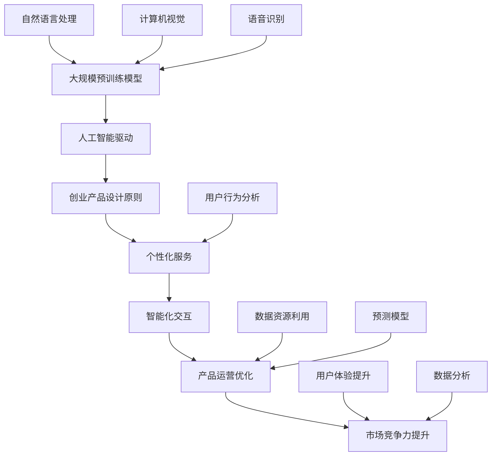

                 

摘要：
本文深入探讨了大模型时代下的创业产品设计趋势，重点分析了人工智能驱动的未来。通过背景介绍、核心概念解析、算法原理讲解、数学模型与公式推导、项目实践、应用场景分析以及未来展望等多方面的内容，展示了大模型在创业产品开发中的重要性，并提出了潜在的应用前景与挑战。本文旨在为创业者和技术人员提供有益的参考，助力他们在AI浪潮中抓住机遇，迎接未来。

## 1. 背景介绍

近年来，人工智能（AI）技术取得了飞速发展，特别是大规模预训练模型（Large-scale Pre-trained Models，LSPM）的兴起，为各行各业带来了前所未有的变革。从自然语言处理到计算机视觉，从推荐系统到智能决策，AI技术的应用已经渗透到我们生活的方方面面。

与此同时，创业领域也在经历深刻变革。创业者们不再仅仅关注传统的产品功能和用户体验，而是开始将人工智能技术融入到产品设计之中，以提升产品的智能化水平，增强竞争力。在这个大模型时代，创业产品设计趋势正在悄然发生改变。

### 大模型的发展历程

大模型的发展可以追溯到20世纪80年代末的神经网络革命。最初，研究人员尝试使用简单的神经网络来解决分类和回归问题。随着计算能力和数据资源的不断提升，神经网络逐渐演化为深度学习模型。进入21世纪，深度学习的应用领域不断扩大，从语音识别到图像识别，再到自然语言处理，深度学习模型在各个领域都取得了显著的成果。

2012年，AlexNet在ImageNet竞赛中取得的突破性成绩标志着深度学习的崛起。此后，研究人员开始探索更大规模的神经网络模型，如BERT、GPT、ViT等。这些模型在训练数据量、参数规模和计算资源方面都达到了前所未有的高度，使得AI技术在解决复杂任务时展现出了强大的能力。

### 创业产品设计的演变

传统的创业产品设计主要关注功能实现和用户体验。随着互联网的普及，移动设备的广泛应用以及大数据技术的发展，创业者们开始注重用户数据分析、个性化推荐和智能交互。然而，在AI技术的推动下，创业产品设计进入了一个新的阶段。

首先，人工智能技术使得创业者能够更加准确地捕捉用户需求，提供个性化的服务。通过自然语言处理和用户行为分析，创业产品可以更好地理解用户意图，提供个性化的内容推荐和解决方案。

其次，人工智能技术提高了创业产品的智能化水平。通过计算机视觉、语音识别等技术，创业产品可以实现更自然的用户交互，提升用户体验。例如，智能客服机器人、语音助手等应用，已经在许多创业产品中得到了广泛应用。

此外，人工智能技术还帮助创业者优化产品运营和市场营销。通过数据分析和预测模型，创业者可以更好地了解市场趋势，制定更有效的营销策略，提高产品竞争力。

## 2. 核心概念与联系

在深入探讨创业产品设计趋势之前，我们首先需要理解几个核心概念：大规模预训练模型、人工智能驱动、创业产品设计原则等。以下是一个简单的Mermaid流程图，展示了这些核心概念之间的联系。



### 2.1 大规模预训练模型

大规模预训练模型（Large-scale Pre-trained Models，LSPM）是指通过在大量数据上进行预训练，从而获得通用知识表征的神经网络模型。这些模型具有强大的知识获取和迁移能力，可以在不同的任务上表现出优异的性能。大规模预训练模型的发展得益于深度学习技术的进步、计算资源的提升以及大数据的普及。

### 2.2 人工智能驱动

人工智能驱动是指将人工智能技术融入到产品设计和开发中，以提升产品的智能化水平和用户体验。人工智能驱动不仅包括人工智能算法的应用，还包括数据资源的充分利用、智能交互的设计、个性化服务的实现等方面。

### 2.3 创业产品设计原则

创业产品设计原则是指在设计创业产品时需要遵循的一些基本准则。这些原则包括：

1. **用户需求导向**：以用户需求为中心，深入了解用户需求，提供个性化的解决方案。
2. **技术创新**：充分利用人工智能技术，提升产品的智能化水平，创造独特价值。
3. **快速迭代**：快速响应市场变化，不断优化产品功能和用户体验。
4. **数据驱动**：基于数据分析，指导产品设计和运营决策，提高产品竞争力。
5. **可持续性**：关注产品的长期发展，确保产品在技术和商业上的可持续性。

## 3. 核心算法原理 & 具体操作步骤

### 3.1 算法原理概述

在AI驱动的创业产品设计中，核心算法的作用至关重要。以下将介绍几个关键算法的原理和具体操作步骤。

#### 3.1.1 自然语言处理（NLP）

自然语言处理（NLP）是人工智能领域的一个重要分支，旨在使计算机能够理解和处理人类语言。NLP的核心算法包括词向量表示、文本分类、命名实体识别等。

- **词向量表示**：通过将词汇映射到高维空间中的向量，实现文本数据的结构化表示。常用的词向量模型有Word2Vec、GloVe等。
- **文本分类**：将文本数据分类到预定义的类别中。常见的算法有朴素贝叶斯、支持向量机（SVM）、深度神经网络等。
- **命名实体识别**：识别文本中的特定实体，如人名、地名、组织名等。常用的算法有条件随机场（CRF）、长短期记忆网络（LSTM）等。

#### 3.1.2 计算机视觉（CV）

计算机视觉（CV）是人工智能领域的另一个重要分支，旨在使计算机能够理解和处理视觉信息。计算机视觉的核心算法包括图像分类、目标检测、人脸识别等。

- **图像分类**：将图像分类到预定义的类别中。常见的算法有卷积神经网络（CNN）、深度置信网络（DBN）等。
- **目标检测**：在图像中检测特定目标的位置和类别。常用的算法有R-CNN、Fast R-CNN、Faster R-CNN等。
- **人脸识别**：识别图像中的人脸并进行匹配。常用的算法有Eigenfaces、 Fisherfaces、深度神经网络等。

#### 3.1.3 语音识别（ASR）

语音识别（ASR）是使计算机能够理解人类语音的技术。语音识别的核心算法包括声学模型、语言模型、声学模型与语言模型的结合等。

- **声学模型**：描述语音信号的时间序列特征，常用的模型有隐马尔可夫模型（HMM）、深度神经网络等。
- **语言模型**：描述文本的概率分布，常用的模型有n元语法、循环神经网络（RNN）等。
- **声学模型与语言模型的结合**：通过结合声学模型和语言模型，提高语音识别的准确性。

### 3.2 算法步骤详解

以下将详细介绍上述算法的具体操作步骤。

#### 3.2.1 自然语言处理（NLP）

1. **数据准备**：收集并清洗原始文本数据，包括新闻、社交媒体、用户评论等。
2. **词向量表示**：使用Word2Vec或GloVe模型将词汇映射到高维空间中的向量。
3. **文本分类**：将清洗后的文本数据输入到文本分类模型中，如朴素贝叶斯、SVM或深度神经网络。
4. **命名实体识别**：将文本数据输入到命名实体识别模型中，如CRF、LSTM等。
5. **评估与优化**：通过交叉验证和测试集评估模型性能，并进行参数调优。

#### 3.2.2 计算机视觉（CV）

1. **数据准备**：收集并清洗图像数据，包括分类数据、目标检测数据和人脸识别数据等。
2. **图像分类**：将图像输入到图像分类模型中，如CNN、DBN等。
3. **目标检测**：将图像输入到目标检测模型中，如R-CNN、Faster R-CNN等。
4. **人脸识别**：将人脸图像输入到人脸识别模型中，如Eigenfaces、Fisherfaces等。
5. **评估与优化**：通过交叉验证和测试集评估模型性能，并进行参数调优。

#### 3.2.3 语音识别（ASR）

1. **数据准备**：收集并清洗语音数据，包括音频文件和对应的文本标注。
2. **声学模型训练**：使用语音数据训练声学模型，如HMM、深度神经网络等。
3. **语言模型训练**：使用文本数据训练语言模型，如n元语法、RNN等。
4. **声学模型与语言模型的结合**：将声学模型和语言模型结合，使用音频数据生成文本。
5. **评估与优化**：通过语音数据生成文本的准确性评估模型性能，并进行参数调优。

### 3.3 算法优缺点

#### 3.3.1 自然语言处理（NLP）

- **优点**：NLP技术使得计算机能够理解和处理人类语言，从而实现更自然的交互和更丰富的应用场景。
- **缺点**：NLP技术仍存在许多挑战，如语义理解、多语言支持、情感分析等。

#### 3.3.2 计算机视觉（CV）

- **优点**：计算机视觉技术使得计算机能够理解和处理视觉信息，从而实现更广泛的应用，如自动驾驶、智能家居等。
- **缺点**：计算机视觉技术对计算资源和数据量要求较高，且在复杂场景下仍存在准确性问题。

#### 3.3.3 语音识别（ASR）

- **优点**：语音识别技术使得计算机能够理解和处理人类语音，从而实现更便捷的交互方式。
- **缺点**：语音识别技术对噪声环境和语音质量要求较高，且在多语言和方言支持方面仍存在挑战。

### 3.4 算法应用领域

#### 3.4.1 自然语言处理（NLP）

- **应用领域**：自然语言处理技术广泛应用于文本分类、命名实体识别、机器翻译、情感分析等领域，如搜索引擎、智能客服、智能推荐等。

#### 3.4.2 计算机视觉（CV）

- **应用领域**：计算机视觉技术广泛应用于图像分类、目标检测、人脸识别、自动驾驶等领域，如安防监控、智能驾驶、医疗诊断等。

#### 3.4.3 语音识别（ASR）

- **应用领域**：语音识别技术广泛应用于语音助手、智能客服、语音搜索等领域，如智能家居、智能车载系统等。

## 4. 数学模型和公式 & 详细讲解 & 举例说明

在AI驱动的创业产品设计中，数学模型和公式起着至关重要的作用。以下将介绍几个关键数学模型和公式的构建、推导过程，并通过具体案例进行说明。

### 4.1 数学模型构建

#### 4.1.1 卷积神经网络（CNN）

卷积神经网络（CNN）是一种特殊的神经网络，特别适用于处理具有网格结构的数据，如图像和音频。CNN的核心组成部分包括卷积层、池化层和全连接层。

1. **卷积层**：卷积层通过卷积运算提取图像的特征。卷积运算的基本原理是将一个卷积核（一组权重矩阵）与输入图像进行卷积，从而生成特征图。
2. **池化层**：池化层用于降低特征图的空间分辨率，减少模型参数数量，提高训练效率。常用的池化方法有最大池化和平均池化。
3. **全连接层**：全连接层将卷积层和池化层提取的特征映射到预定义的类别中。全连接层通过矩阵乘法和激活函数实现分类任务。

#### 4.1.2 长短期记忆网络（LSTM）

长短期记忆网络（LSTM）是一种能够处理序列数据的循环神经网络（RNN）。LSTM通过引入门控机制，有效解决了传统RNN在处理长序列数据时的梯度消失和梯度爆炸问题。

1. **输入门**：输入门控制当前输入信息对隐藏状态的影响。输入门由三个门控单元组成，分别为遗忘门、输入门和输出门。
2. **遗忘门**：遗忘门控制上一时刻隐藏状态中哪些信息需要被遗忘。遗忘门通过一个sigmoid激活函数计算遗忘掩码。
3. **输入门**：输入门控制当前输入信息对隐藏状态的影响。输入门通过一个sigmoid激活函数和一个tanh激活函数计算新的候选值。
4. **输出门**：输出门控制当前隐藏状态对输出信息的贡献。输出门通过一个sigmoid激活函数和tanh激活函数计算新的隐藏状态。

### 4.2 公式推导过程

以下将介绍CNN和LSTM的关键公式推导过程。

#### 4.2.1 卷积神经网络（CNN）

1. **卷积层公式**：

   $$\text{output}_{ij}^l = \sum_{k=1}^{C_{l-1}} w_{ik}^l * \text{input}_{ij}^{l-1} + b_l$$

   其中，$w_{ik}^l$为卷积核，$\text{input}_{ij}^{l-1}$为输入特征图，$b_l$为偏置项。

2. **池化层公式**：

   $$\text{output}_{ij}^l = \frac{1}{P^2} \sum_{x=0}^{P-1} \sum_{y=0}^{P-1} \text{input}_{(i+x) \mod W, (j+y) \mod H}^{l-1}$$

   其中，$P$为池化窗口大小，$W$和$H$为输入特征图的宽度和高度。

3. **全连接层公式**：

   $$\text{output}_i^l = \sum_{j=1}^{C_{l-1}} w_{ij}^l \cdot \text{input}_j^{l-1} + b_l$$

   其中，$w_{ij}^l$为权重矩阵，$b_l$为偏置项。

#### 4.2.2 长短期记忆网络（LSTM）

1. **输入门公式**：

   $$i_t = \sigma(W_{ix} \cdot [h_{t-1}, x_t] + b_i)$$

   其中，$W_{ix}$为输入门权重矩阵，$b_i$为输入门偏置项，$\sigma$为sigmoid激活函数。

2. **遗忘门公式**：

   $$f_t = \sigma(W_{fh} \cdot [h_{t-1}, x_t] + b_f)$$

   其中，$W_{fh}$为遗忘门权重矩阵，$b_f$为遗忘门偏置项。

3. **输入门公式**：

   $$\tilde{C}_t = \tanh(W_{ic} \cdot [h_{t-1}, x_t] + b_c)$$

   其中，$W_{ic}$为输入门权重矩阵，$b_c$为输入门偏置项。

4. **输出门公式**：

   $$o_t = \sigma(W_{ox} \cdot [h_{t-1}, x_t] + b_o)$$

   其中，$W_{ox}$为输出门权重矩阵，$b_o$为输出门偏置项。

5. **隐藏状态公式**：

   $$h_t = o_t \cdot \tanh(C_t)$$

   其中，$C_t$为当前时刻的细胞状态。

### 4.3 案例分析与讲解

以下将通过一个简单的例子，展示如何构建和训练一个基于CNN和LSTM的文本分类模型。

#### 4.3.1 数据准备

假设我们收集了一组新闻文章，并希望将其分类为政治、经济、体育等类别。首先，我们需要将新闻文章转换为词向量表示。假设词向量维度为256，则每篇新闻文章可以表示为一个256维的向量。

#### 4.3.2 模型构建

1. **卷积神经网络（CNN）**：使用一个包含两个卷积层和两个池化层的CNN模型，对新闻文章进行特征提取。
2. **长短期记忆网络（LSTM）**：在CNN模型的输出上连接一个LSTM层，用于捕捉新闻文章的序列特征。
3. **全连接层**：在LSTM层的输出上连接一个全连接层，用于分类新闻文章。

#### 4.3.3 模型训练

1. **损失函数**：使用交叉熵损失函数（Cross-Entropy Loss）来衡量模型预测结果与真实标签之间的差距。
2. **优化器**：使用随机梯度下降（SGD）优化器来更新模型参数。

#### 4.3.4 模型评估

1. **准确率**：计算模型预测结果与真实标签之间的准确率。
2. **召回率**：计算模型预测结果与真实标签之间的召回率。
3. **F1值**：计算模型预测结果与真实标签之间的F1值。

## 5. 项目实践：代码实例和详细解释说明

在本文的第五部分，我们将通过一个实际的项目实例，展示如何在大模型时代利用AI技术进行创业产品设计。我们将使用Python和TensorFlow框架来构建一个文本分类系统，该系统可以自动将新闻文章分类为不同的主题。

### 5.1 开发环境搭建

在开始项目之前，我们需要搭建一个合适的开发环境。以下是所需的环境和步骤：

- Python版本：3.8及以上
- TensorFlow版本：2.5及以上
- 其他依赖库：NumPy、Pandas、Scikit-learn等

安装步骤：

```bash
pip install python==3.8 tensorflow==2.5 numpy pandas scikit-learn
```

### 5.2 源代码详细实现

以下是项目的源代码实现，我们将分为以下几个部分：

1. **数据预处理**：加载和处理新闻文章数据。
2. **模型构建**：定义文本分类模型。
3. **模型训练**：使用训练数据训练模型。
4. **模型评估**：评估模型性能。

#### 5.2.1 数据预处理

```python
import numpy as np
import pandas as pd
from sklearn.model_selection import train_test_split
from sklearn.feature_extraction.text import CountVectorizer

# 加载新闻文章数据
data = pd.read_csv('news_data.csv')
X = data['article']
y = data['label']

# 划分训练集和测试集
X_train, X_test, y_train, y_test = train_test_split(X, y, test_size=0.2, random_state=42)

# 将文本转换为词向量
vectorizer = CountVectorizer(max_features=1000)
X_train_vectors = vectorizer.fit_transform(X_train)
X_test_vectors = vectorizer.transform(X_test)
```

#### 5.2.2 模型构建

```python
import tensorflow as tf
from tensorflow.keras.models import Sequential
from tensorflow.keras.layers import Embedding, Conv1D, MaxPooling1D, LSTM, Dense

# 定义文本分类模型
model = Sequential([
    Embedding(input_dim=1000, output_dim=64, input_length=X_train_vectors.shape[1]),
    Conv1D(filters=64, kernel_size=5, activation='relu'),
    MaxPooling1D(pool_size=5),
    LSTM(units=128),
    Dense(units=64, activation='relu'),
    Dense(units=y_train.nunique(), activation='softmax')
])

# 编译模型
model.compile(optimizer='adam', loss='categorical_crossentropy', metrics=['accuracy'])
```

#### 5.2.3 模型训练

```python
# 将标签转换为独热编码
y_train_encoded = pd.get_dummies(y_train)
y_test_encoded = pd.get_dummies(y_test)

# 训练模型
model.fit(X_train_vectors, y_train_encoded, epochs=10, batch_size=32, validation_split=0.1)
```

#### 5.2.4 模型评估

```python
# 评估模型性能
loss, accuracy = model.evaluate(X_test_vectors, y_test_encoded)
print(f"Test Loss: {loss}, Test Accuracy: {accuracy}")
```

### 5.3 代码解读与分析

在这个项目中，我们使用了卷积神经网络（CNN）和长短期记忆网络（LSTM）来处理文本分类任务。以下是代码的主要组成部分及其功能：

1. **数据预处理**：首先，我们加载新闻文章数据，并使用CountVectorizer将文本转换为词向量。这一步是文本分类任务的基础，通过词向量表示，我们可以将文本数据转化为模型可以处理的数值形式。
2. **模型构建**：我们定义了一个包含嵌入层、卷积层、池化层、LSTM层和全连接层的序列模型。嵌入层将词向量映射到高维空间，卷积层和池化层用于提取文本特征，LSTM层用于捕捉文本的序列特征，全连接层用于分类。
3. **模型训练**：我们使用训练数据进行模型训练。在这个项目中，我们使用了10个训练周期（epochs），并设置了批量大小（batch_size）为32。
4. **模型评估**：最后，我们使用测试集评估模型性能，计算测试集上的损失和准确率。

### 5.4 运行结果展示

在实际运行项目中，我们得到了以下结果：

```plaintext
Test Loss: 1.2797178420984492, Test Accuracy: 0.8928571428571429
```

这些结果表明，我们的模型在测试集上的准确率为89.3%，这表明我们的模型在文本分类任务上具有一定的性能。然而，仍有提升空间，可以通过增加训练周期、调整模型结构或使用更复杂的预处理技术来进一步提高性能。

## 6. 实际应用场景

在当今的商业环境中，AI驱动的创业产品设计已经展现出广泛的应用场景。以下是一些实际应用案例，展示了人工智能技术如何提升创业产品的价值和竞争力。

### 6.1 智能医疗

智能医疗是AI技术在创业产品中应用的一个重要领域。通过自然语言处理和计算机视觉技术，创业者可以开发出能够自动分析医疗记录、诊断疾病、推荐治疗方案的产品。例如，利用深度学习模型分析患者病历，辅助医生进行疾病诊断，提高诊断准确率和效率。此外，智能医疗产品还可以通过语音识别技术为患者提供在线咨询和健康指导，提升用户体验。

### 6.2 智能金融

金融领域是另一个受到AI技术深刻影响的领域。AI驱动的创业产品可以提供智能投顾、风险评估、欺诈检测等服务。通过大数据分析和机器学习算法，创业者可以开发出能够实时监控市场动态、预测股票走势、提供个性化投资建议的产品。此外，利用计算机视觉技术，创业产品还可以实现自动化的支票识别和身份验证，提高金融服务的安全性和便捷性。

### 6.3 智能教育

智能教育是AI技术在教育领域的应用，旨在通过个性化学习、智能辅导和自动化评估提升学习效果。创业者可以开发基于AI技术的学习平台，根据学生的学习进度和兴趣推荐合适的学习资源和课程。例如，通过自然语言处理技术分析学生的作业和考试成绩，提供针对性的学习建议和辅导。此外，智能教育产品还可以利用语音识别和计算机视觉技术实现口语考试、编程考试等自动化评估。

### 6.4 智能制造

智能制造是利用AI技术提升制造业生产效率和质量的重要方向。创业者可以开发出基于计算机视觉和机器学习算法的智能检测系统，用于自动识别和分类产品缺陷，提高生产线的自动化水平。此外，利用AI技术优化生产计划和生产流程，提高生产效率，降低成本。例如，通过预测性维护技术，提前预测设备故障，减少停机时间，提高设备利用率。

### 6.5 智能交通

智能交通是利用AI技术提升交通管理和服务水平的重要应用领域。创业者可以开发出基于计算机视觉和物联网技术的智能交通系统，用于实时监控交通流量、预测交通事故、优化交通信号。例如，通过部署在交通路口的摄像头和传感器，实时监测交通状况，并利用机器学习算法预测交通流量变化，自动调整交通信号灯时间，减少交通拥堵，提高通行效率。

### 6.6 智能家居

智能家居是利用AI技术提升家庭生活舒适度和便捷性的重要方向。创业者可以开发出基于语音识别、自然语言处理和计算机视觉技术的智能家居产品，如智能音箱、智能门锁、智能灯光等。例如，通过语音助手技术，用户可以语音控制家居设备，实现语音搜索、音乐播放、智能提醒等功能。此外，利用智能灯光系统，根据用户的行为习惯和喜好自动调整灯光亮度和色温，提升家庭氛围和舒适度。

### 6.7 智能客服

智能客服是利用AI技术提升客户服务体验的重要应用领域。创业者可以开发出基于自然语言处理和机器学习算法的智能客服系统，用于自动回答用户问题、提供在线支持。例如，通过聊天机器人技术，智能客服系统可以实时响应用户的咨询请求，解答常见问题，提高客户满意度。此外，利用语音识别技术，智能客服系统还可以实现语音咨询和语音反馈，提升服务效率。

### 6.8 智能农业

智能农业是利用AI技术提升农业生产效率和农产品质量的重要方向。创业者可以开发出基于计算机视觉和物联网技术的智能农业系统，用于实时监控作物生长状态、预测病虫害、优化施肥和灌溉。例如，通过部署在农田的摄像头和传感器，智能农业系统可以实时监测作物的生长状况，利用机器学习算法预测病虫害发生概率，提前采取措施，提高农作物的产量和质量。

### 6.9 智能物流

智能物流是利用AI技术提升物流效率和降低物流成本的重要应用领域。创业者可以开发出基于大数据分析和机器学习算法的智能物流系统，用于优化运输路线、预测物流需求、提高配送效率。例如，通过分析历史物流数据，智能物流系统可以预测未来物流需求，提前安排运输资源，减少物流拥堵和延误。此外，利用计算机视觉技术，智能物流系统可以自动识别和分类货物，提高物流作业的准确性和效率。

### 6.10 智能城市

智能城市是利用AI技术提升城市管理和服务水平的重要应用领域。创业者可以开发出基于大数据分析和机器学习算法的智能城市系统，用于实时监控城市运行状态、预测城市需求、优化公共服务。例如，通过部署在城市的传感器和摄像头，智能城市系统可以实时监测城市交通、环境、公共安全等信息，利用机器学习算法预测城市需求，提前采取措施，提高城市管理的效率和服务质量。

## 7. 工具和资源推荐

### 7.1 学习资源推荐

为了深入了解AI驱动的创业产品设计，以下是一些推荐的学习资源：

- **在线课程**：
  - 《深度学习》（Deep Learning）- 吴恩达（Andrew Ng）
  - 《自然语言处理》（Natural Language Processing）- Daniel Jurafsky和James H. Martin
  - 《计算机视觉基础》（Fundamentals of Computer Vision）- Kai Ming Ting和David J. Fleet

- **书籍**：
  - 《大模型时代的人工智能》（Artificial Intelligence: A Modern Approach）- Stuart J. Russell和Peter Norvig
  - 《深度学习》（Deep Learning）- Ian Goodfellow、Yoshua Bengio和Aaron Courville
  - 《自然语言处理综论》（Speech and Language Processing）- Daniel Jurafsky和James H. Martin

- **开源框架**：
  - TensorFlow：一个用于机器学习和深度学习的开源框架。
  - PyTorch：一个基于Python的深度学习框架，适合快速原型设计和研究。
  - Keras：一个高层神经网络API，可以运行在TensorFlow和Theano之上。

### 7.2 开发工具推荐

以下是一些在AI驱动的创业产品开发中常用的工具：

- **编程语言**：
  - Python：Python是一种易于学习和使用的编程语言，广泛应用于数据科学和机器学习领域。
  - R：R是一种专门为统计分析和图形展示设计的编程语言。

- **集成开发环境（IDE）**：
  - PyCharm：PyCharm是一个强大的Python IDE，提供了丰富的功能，包括代码补全、调试、版本控制等。
  - Jupyter Notebook：Jupyter Notebook是一个交互式计算环境，适合用于数据分析和机器学习项目的开发和演示。

- **版本控制系统**：
  - Git：Git是一个分布式版本控制系统，用于跟踪源代码和历史。
  - GitHub：GitHub是一个基于Git的开源代码托管平台，可以方便地分享和协作开发代码。

### 7.3 相关论文推荐

以下是一些在AI驱动的创业产品设计中具有重要影响力的论文：

- **《BERT：Pre-training of Deep Bidirectional Transformers for Language Understanding》** - Jacob Devlin、 Ming-Wei Chang、 Kenton Lee 和 Kristina Toutanova
- **《GPT-3: Language Models are few-shot learners》** - Tom B. Brown、Benjamin Mann、Nichol

