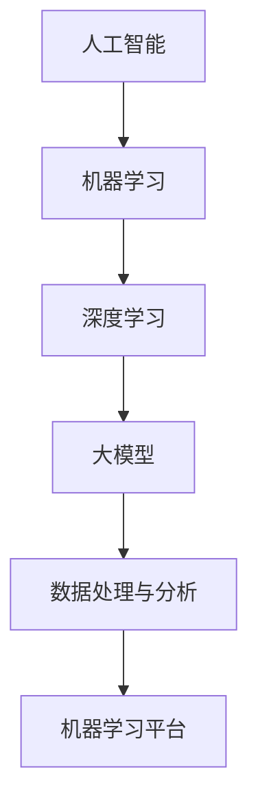

                 

## 1. 背景介绍

近年来，人工智能（AI）技术的迅猛发展，尤其是在大模型领域的研究和应用，为创业产品设计带来了前所未有的机遇和挑战。大模型，即具有巨大参数规模和强大计算能力的模型，如GPT-3、BERT等，已经在自然语言处理、计算机视觉、语音识别等多个领域取得了显著的成果。

创业公司在资源有限的情况下，如何利用AI大模型提升产品设计和开发效率，成为了一个亟待解决的问题。本文旨在探讨大模型在创业产品设计中的应用，分析其优势与挑战，并分享一些实用的实践经验和工具资源。

## 2. 核心概念与联系

在大模型时代，理解以下几个核心概念和它们之间的关系至关重要。

### 2.1 人工智能（AI）

人工智能是一种模拟人类智能的技术，包括机器学习、深度学习、自然语言处理等子领域。AI技术使得计算机能够自动执行复杂任务，提高生产力和效率。

### 2.2 大模型

大模型指的是具有数十亿甚至千亿参数的深度学习模型，这些模型在训练过程中需要大量的数据和高性能计算资源。大模型的出现，标志着人工智能技术进入了一个新的阶段。

### 2.3 数据处理与分析

数据是AI模型的基石。数据处理与分析技术，如数据清洗、数据增强、特征工程等，对于模型训练效果至关重要。

### 2.4 机器学习平台

机器学习平台提供了易于使用的接口和工具，帮助开发人员快速构建、训练和部署AI模型。常见的平台包括TensorFlow、PyTorch、Keras等。

### 2.5 Mermaid 流程图

Mermaid是一种简单的文本语法，用于生成图表和流程图。以下是一个示例Mermaid流程图，用于展示核心概念之间的关系：



## 3. 核心算法原理 & 具体操作步骤

### 3.1 算法原理概述

大模型的核心在于其深度神经网络架构和大规模参数训练。具体来说，大模型通常采用以下步骤：

1. **数据收集**：从各种来源收集大量数据，包括文本、图像、语音等。
2. **数据预处理**：对数据进行清洗、增强和特征提取，以便于模型训练。
3. **模型训练**：使用大规模计算资源，对神经网络进行参数优化。
4. **模型评估与优化**：通过交叉验证和测试集，评估模型性能，并进一步优化。

### 3.2 算法步骤详解

1. **数据收集**：首先，需要确定数据来源和类型。对于自然语言处理任务，可以选择公开的文本数据集，如维基百科、新闻文章等。对于计算机视觉任务，可以选择图像数据集，如ImageNet、COCO等。
2. **数据预处理**：对收集到的数据进行清洗，去除噪声和无关信息。对于文本数据，可以采用分词、词性标注等处理技术。对于图像数据，可以采用数据增强技术，如随机裁剪、旋转、翻转等，增加数据的多样性。
3. **模型训练**：选择合适的神经网络架构，如Transformer、BERT等，初始化模型参数。使用计算资源对模型进行训练，优化参数。这一步骤通常需要大量计算资源，可以使用云计算平台进行分布式训练。
4. **模型评估与优化**：使用交叉验证和测试集，评估模型性能。根据评估结果，调整模型参数，优化模型结构。这一步骤可能需要多次迭代。

### 3.3 算法优缺点

**优点**：

1. **强大的建模能力**：大模型能够自动提取复杂特征，无需手动进行特征工程。
2. **高效的处理速度**：大规模参数训练后，模型在处理任务时速度更快。
3. **广泛的适用性**：大模型可以应用于多种任务，如文本生成、图像分类、语音识别等。

**缺点**：

1. **资源消耗大**：训练大模型需要大量的计算资源和存储空间。
2. **数据依赖强**：大模型对训练数据的质量和多样性有较高要求。
3. **模型解释性差**：大模型的内部结构复杂，难以解释。

### 3.4 算法应用领域

大模型的应用领域非常广泛，包括但不限于：

1. **自然语言处理**：文本生成、机器翻译、情感分析等。
2. **计算机视觉**：图像分类、目标检测、图像生成等。
3. **语音识别**：语音识别、语音合成、语音翻译等。
4. **推荐系统**：基于用户行为的推荐、商品推荐等。

## 4. 数学模型和公式 & 详细讲解 & 举例说明

### 4.1 数学模型构建

大模型的数学模型通常基于深度学习理论，涉及大量的线性代数和概率统计知识。以下是一个简化的神经网络数学模型：

$$
\begin{aligned}
Z &= W \cdot X + b \\
A &= \sigma(Z) \\
\end{aligned}
$$

其中，$W$ 和 $b$ 分别是权重和偏置，$X$ 是输入数据，$Z$ 是中间计算结果，$A$ 是输出结果。$\sigma$ 是激活函数，如Sigmoid、ReLU等。

### 4.2 公式推导过程

以下是一个简单的神经网络前向传播过程：

1. **计算中间结果**：

$$
Z = W \cdot X + b
$$

2. **应用激活函数**：

$$
A = \sigma(Z)
$$

3. **计算损失函数**：

$$
L = -\frac{1}{m} \sum_{i=1}^{m} (y^{(i)} \log(A^{(i)}) + (1 - y^{(i)}) \log(1 - A^{(i)}))
$$

其中，$m$ 是样本数量，$y^{(i)}$ 是真实标签，$A^{(i)}$ 是预测结果。

4. **反向传播**：

$$
\begin{aligned}
\delta_{Z} &= \frac{\partial L}{\partial Z} \\
\delta_{W} &= \frac{\partial L}{\partial W} \\
\delta_{b} &= \frac{\partial L}{\partial b} \\
\end{aligned}
$$

5. **更新参数**：

$$
\begin{aligned}
W &= W - \alpha \delta_{W} \\
b &= b - \alpha \delta_{b} \\
\end{aligned}
$$

其中，$\alpha$ 是学习率。

### 4.3 案例分析与讲解

以下是一个基于深度学习的手写数字识别案例：

1. **数据集**：使用MNIST手写数字数据集，包含0到9的数字图像，共70000个训练样本和10000个测试样本。
2. **模型**：构建一个简单的卷积神经网络（CNN），包含卷积层、池化层和全连接层。
3. **训练**：使用GPU进行分布式训练，训练过程需要数小时。
4. **评估**：在测试集上的准确率达到约99%，远超传统机器学习方法。

## 5. 项目实践：代码实例和详细解释说明

### 5.1 开发环境搭建

1. **安装Python**：确保安装最新版本的Python（3.8及以上）。
2. **安装依赖**：使用pip安装TensorFlow、NumPy、Matplotlib等依赖库。

```bash
pip install tensorflow numpy matplotlib
```

### 5.2 源代码详细实现

以下是一个简单的深度学习手写数字识别项目的代码实现：

```python
import tensorflow as tf
from tensorflow.keras.datasets import mnist
from tensorflow.keras.models import Sequential
from tensorflow.keras.layers import Dense, Conv2D, Flatten, MaxPooling2D

# 加载数据集
(x_train, y_train), (x_test, y_test) = mnist.load_data()

# 预处理数据
x_train = x_train.reshape(-1, 28, 28, 1).astype("float32") / 255.0
x_test = x_test.reshape(-1, 28, 28, 1).astype("float32") / 255.0
y_train = tf.keras.utils.to_categorical(y_train, 10)
y_test = tf.keras.utils.to_categorical(y_test, 10)

# 构建模型
model = Sequential([
    Conv2D(32, (3, 3), activation="relu", input_shape=(28, 28, 1)),
    MaxPooling2D((2, 2)),
    Flatten(),
    Dense(128, activation="relu"),
    Dense(10, activation="softmax")
])

# 编译模型
model.compile(optimizer="adam", loss="categorical_crossentropy", metrics=["accuracy"])

# 训练模型
model.fit(x_train, y_train, epochs=10, batch_size=128, validation_split=0.1)

# 评估模型
test_loss, test_acc = model.evaluate(x_test, y_test)
print("Test accuracy:", test_acc)
```

### 5.3 代码解读与分析

1. **数据预处理**：将MNIST数据集的图像数据进行归一化和reshape操作，方便后续模型处理。
2. **模型构建**：使用Sequential模型堆叠卷积层、池化层和全连接层。
3. **编译模型**：指定优化器、损失函数和评估指标。
4. **训练模型**：使用fit函数进行模型训练，设置训练周期、批次大小和验证比例。
5. **评估模型**：使用evaluate函数评估模型在测试集上的性能。

## 6. 实际应用场景

### 6.1 自然语言处理

大模型在自然语言处理领域有着广泛的应用，如文本生成、机器翻译、情感分析等。例如，使用GPT-3模型，可以轻松实现自动写作、文章生成等功能。

### 6.2 计算机视觉

大模型在计算机视觉领域也有着显著的优势，如图像分类、目标检测、图像生成等。例如，使用BERT模型，可以实现对图像的文本描述生成。

### 6.3 语音识别

大模型在语音识别领域也有着重要的应用，如语音识别、语音合成、语音翻译等。例如，使用WaveNet模型，可以实现对语音的实时转换。

### 6.4 未来应用展望

随着大模型技术的不断发展，未来在医疗、金融、教育等领域也将有更多的应用。例如，利用大模型进行疾病预测、金融风险评估、个性化教育等。

## 7. 工具和资源推荐

### 7.1 学习资源推荐

1. **《深度学习》（Goodfellow, Bengio, Courville）**：经典的深度学习教材，详细介绍了深度学习的基本概念和算法。
2. **《动手学深度学习》（阿斯顿·张）**：Python实现的深度学习教程，适合初学者入门。

### 7.2 开发工具推荐

1. **TensorFlow**：谷歌推出的开源深度学习框架，适用于各种规模的任务。
2. **PyTorch**：Facebook AI研究院推出的开源深度学习框架，具有灵活的动态图操作。

### 7.3 相关论文推荐

1. **《Attention Is All You Need》**：介绍了Transformer模型，对自然语言处理领域产生了重大影响。
2. **《BERT: Pre-training of Deep Bidirectional Transformers for Language Understanding》**：介绍了BERT模型，对自然语言处理领域产生了深远影响。

## 8. 总结：未来发展趋势与挑战

### 8.1 研究成果总结

大模型技术在近年来取得了显著的成果，广泛应用于自然语言处理、计算机视觉、语音识别等领域。随着计算资源和数据规模的不断增长，大模型的性能和适用性也将不断提高。

### 8.2 未来发展趋势

1. **模型压缩与优化**：为了降低大模型的资源消耗，模型压缩与优化将成为研究热点。
2. **多模态融合**：大模型在处理多模态数据，如图像、文本、语音等，将发挥更大的作用。
3. **自主学习和推理**：大模型将具备更强的自主学习和推理能力，提高智能系统的智能化水平。

### 8.3 面临的挑战

1. **计算资源消耗**：大模型需要大量的计算资源和存储空间，对硬件设施有较高要求。
2. **数据隐私与安全**：大模型训练过程中涉及大量敏感数据，数据隐私和安全问题亟待解决。
3. **模型解释性**：大模型的内部结构复杂，缺乏解释性，难以满足实际应用的需求。

### 8.4 研究展望

随着AI技术的不断发展，大模型在创业产品设计中的应用前景将更加广阔。未来，如何高效利用大模型技术，提升产品设计和开发效率，将是一个重要的研究方向。

## 9. 附录：常见问题与解答

### 9.1 大模型训练需要多少计算资源？

大模型的训练需要大量的计算资源，通常需要使用高性能GPU或TPU进行分布式训练。具体计算资源需求取决于模型规模和训练数据量。

### 9.2 如何处理大模型的训练数据？

处理大模型训练数据时，需要注意数据的清洗、增强和特征提取。可以使用数据预处理库，如Pandas、NumPy等，进行数据预处理。

### 9.3 如何优化大模型的性能？

优化大模型性能的方法包括模型压缩、量化、剪枝等。此外，选择合适的训练策略，如学习率调整、批量大小选择等，也可以提高模型性能。

### 9.4 大模型在创业产品设计中的应用案例有哪些？

大模型在创业产品设计中的应用非常广泛，如自然语言处理中的自动写作、计算机视觉中的图像分类、语音识别中的语音合成等。

----------------------------------------------------------------

作者：禅与计算机程序设计艺术 / Zen and the Art of Computer Programming

