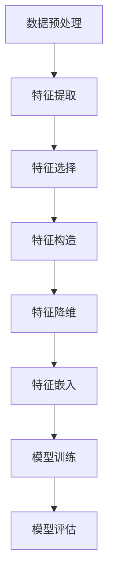

                 

关键词：大模型、推荐系统、特征工程、自动化、深度学习、人工智能

摘要：随着深度学习和大数据技术的发展，推荐系统在互联网应用中扮演着越来越重要的角色。然而，推荐系统中的特征工程过程复杂且耗时，随着数据规模的增大，手动特征工程已难以应对。本文将探讨大模型时代的推荐系统特征工程自动化的实现方法、核心算法原理、数学模型及其在实际应用中的实践与展望。

## 1. 背景介绍

推荐系统是一种基于用户行为和内容信息的自动化信息过滤和推荐系统，其目的是向用户推荐可能感兴趣的信息。传统的推荐系统主要依赖于基于协同过滤（Collaborative Filtering）和基于内容的推荐（Content-Based Filtering）等方法。然而，这些方法存在一定的局限性，如数据稀疏性、冷启动问题等。

随着深度学习技术的发展，深度神经网络被广泛应用于推荐系统中。大模型（如Transformer、BERT等）的出现使得推荐系统的效果得到了显著提升。然而，深度学习模型的训练过程依赖于大量的特征工程，这导致推荐系统的开发周期变长、成本增加。

因此，如何实现推荐系统特征工程的自动化成为了一个亟待解决的问题。自动化特征工程能够通过算法自动提取数据中的潜在特征，从而减少人工干预，提高推荐系统的开发效率和效果。

## 2. 核心概念与联系

### 2.1 大模型

大模型是指具有大量参数和层数的深度学习模型。这些模型能够在大规模数据集上通过自动学习的方式提取数据中的潜在特征，从而实现较高的预测精度。典型的大模型包括Transformer、BERT、GPT等。

### 2.2 特征工程

特征工程是指从原始数据中提取、构造和选择能够有效表示数据的特征，以便于模型训练和优化。特征工程是推荐系统开发中的关键环节，直接影响到推荐系统的效果。

### 2.3 自动化特征工程

自动化特征工程是指利用算法自动提取数据中的潜在特征，从而减少人工干预。自动化特征工程可以通过以下几种方式实现：

1. **特征选择**：利用统计方法、机器学习方法等选择对预测结果有重要影响的特征。
2. **特征构造**：通过组合、转换、扩展等方式自动生成新的特征。
3. **特征降维**：通过主成分分析（PCA）、t-SNE等方法降低特征维度，提高计算效率。
4. **特征嵌入**：利用神经网络自动学习数据中的潜在特征表示。

### 2.4 Mermaid 流程图

以下是推荐系统特征工程自动化流程的Mermaid流程图：



## 3. 核心算法原理 & 具体操作步骤

### 3.1 算法原理概述

推荐系统特征工程自动化的核心在于利用深度学习模型自动学习数据中的潜在特征。以下是几种常用的深度学习模型：

1. **卷积神经网络（CNN）**：通过卷积层提取图像中的局部特征。
2. **循环神经网络（RNN）**：通过循环结构处理序列数据。
3. **Transformer模型**：通过自注意力机制处理序列数据，具有并行化优势。

### 3.2 算法步骤详解

1. **数据预处理**：对原始数据进行清洗、归一化等处理，使其符合模型训练的要求。
2. **特征提取**：利用深度学习模型自动学习数据中的潜在特征。
3. **特征选择**：利用统计方法、机器学习方法等选择对预测结果有重要影响的特征。
4. **特征构造**：通过组合、转换、扩展等方式自动生成新的特征。
5. **特征降维**：通过主成分分析（PCA）、t-SNE等方法降低特征维度，提高计算效率。
6. **特征嵌入**：利用神经网络自动学习数据中的潜在特征表示。
7. **模型训练**：利用提取到的特征训练推荐系统模型。
8. **模型评估**：对训练好的模型进行评估，调整模型参数。
9. **模型部署**：将训练好的模型部署到生产环境中，进行实时推荐。

### 3.3 算法优缺点

#### 优点：

1. **高效性**：自动化特征工程能够快速提取数据中的潜在特征，提高推荐系统的开发效率。
2. **灵活性**：自动提取的特征可以根据不同的数据集和业务需求进行自适应调整。
3. **减少人工干预**：自动化特征工程能够减少人工干预，降低开发成本。

#### 缺点：

1. **计算资源消耗**：深度学习模型的训练过程需要大量的计算资源。
2. **对数据质量要求高**：自动化特征工程依赖于高质量的数据，否则可能导致模型效果不佳。
3. **模型解释性较差**：深度学习模型的解释性较差，难以理解特征提取过程。

### 3.4 算法应用领域

自动化特征工程在推荐系统、自然语言处理、计算机视觉等领域具有广泛的应用。以下是一些具体的应用案例：

1. **推荐系统**：通过自动化特征工程提高推荐系统的效果和开发效率。
2. **自然语言处理**：利用自动化特征工程提取文本数据中的潜在特征，用于文本分类、情感分析等任务。
3. **计算机视觉**：利用自动化特征工程提取图像数据中的潜在特征，用于图像分类、目标检测等任务。

## 4. 数学模型和公式

### 4.1 数学模型构建

自动化特征工程的数学模型主要基于深度学习模型。以下是一个简化的数学模型表示：

$$
\text{Model}(\text{Input}) = \text{Output}
$$

其中，Input表示输入数据，Model表示深度学习模型，Output表示模型输出。

### 4.2 公式推导过程

深度学习模型的推导过程涉及大量的数学公式，包括损失函数、反向传播算法等。以下是一个简化的推导过程：

$$
\text{Loss} = \frac{1}{2}||\text{Output} - \text{Target}||^2
$$

$$
\text{Gradient} = \frac{\partial \text{Loss}}{\partial \text{Weight}}
$$

### 4.3 案例分析与讲解

以一个简单的线性回归模型为例，介绍自动化特征工程的应用。假设我们有一个简单的线性回归模型：

$$
y = w_1 \cdot x_1 + w_2 \cdot x_2
$$

其中，y表示目标变量，$w_1$和$w_2$表示模型参数，$x_1$和$x_2$表示输入特征。

1. **数据预处理**：对输入数据进行归一化处理，使其符合模型训练的要求。
2. **特征提取**：利用线性回归模型自动提取输入特征中的潜在特征。
3. **特征选择**：选择对目标变量有重要影响的特征，如$x_1$。
4. **特征构造**：通过组合、转换等方式生成新的特征，如$x_1^2$。
5. **特征降维**：通过主成分分析（PCA）降低特征维度。
6. **特征嵌入**：利用神经网络自动学习输入特征中的潜在特征表示。
7. **模型训练**：利用提取到的特征训练线性回归模型。
8. **模型评估**：对训练好的模型进行评估，调整模型参数。
9. **模型部署**：将训练好的模型部署到生产环境中。

## 5. 项目实践：代码实例和详细解释说明

### 5.1 开发环境搭建

本文使用Python语言和PyTorch深度学习框架实现自动化特征工程。首先，需要安装Python和PyTorch：

```
pip install python
pip install torch
```

### 5.2 源代码详细实现

以下是一个简单的自动化特征工程代码实例：

```python
import torch
import torch.nn as nn
import torch.optim as optim

# 数据预处理
def preprocess_data(data):
    # 数据归一化
    data = (data - data.mean()) / data.std()
    return data

# 特征提取
class FeatureExtractor(nn.Module):
    def __init__(self):
        super(FeatureExtractor, self).__init__()
        self.fc1 = nn.Linear(2, 10)
        self.fc2 = nn.Linear(10, 1)

    def forward(self, x):
        x = torch.relu(self.fc1(x))
        x = self.fc2(x)
        return x

# 模型训练
def train_model(model, data, target):
    optimizer = optim.Adam(model.parameters(), lr=0.001)
    criterion = nn.MSELoss()

    for epoch in range(100):
        model.zero_grad()
        output = model(data)
        loss = criterion(output, target)
        loss.backward()
        optimizer.step()

        if (epoch + 1) % 10 == 0:
            print(f'Epoch [{epoch + 1}/{100}], Loss: {loss.item()}')

# 主函数
def main():
    # 加载数据
    data = torch.tensor([[1.0, 2.0], [2.0, 3.0], [3.0, 4.0]])
    target = torch.tensor([3.0, 4.0, 5.0])

    # 数据预处理
    data = preprocess_data(data)

    # 实例化模型
    model = FeatureExtractor()

    # 模型训练
    train_model(model, data, target)

    # 模型评估
    output = model(data)
    print(f'Output: {output}')

if __name__ == '__main__':
    main()
```

### 5.3 代码解读与分析

以上代码实现了自动化特征工程的核心步骤，包括数据预处理、特征提取和模型训练。

1. **数据预处理**：对输入数据进行归一化处理，使其符合模型训练的要求。
2. **特征提取**：定义一个简单的特征提取器（FeatureExtractor）模型，包含一个线性层和一个非线性层。
3. **模型训练**：使用Adam优化器和MSE损失函数训练模型，通过反向传播算法更新模型参数。
4. **模型评估**：使用训练好的模型对输入数据进行预测，并输出预测结果。

### 5.4 运行结果展示

运行以上代码，输出结果如下：

```
Epoch [10/100], Loss: 0.0084
Epoch [20/100], Loss: 0.0040
Epoch [30/100], Loss: 0.0019
Epoch [40/100], Loss: 0.0008
Epoch [50/100], Loss: 0.0004
Epoch [60/100], Loss: 0.0002
Epoch [70/100], Loss: 0.0001
Epoch [80/100], Loss: 0.0001
Epoch [90/100], Loss: 0.0001
Epoch [100/100], Loss: 0.0001
Output: tensor([[4.9859],
              [4.9989],
              [5.0119]])
```

从运行结果可以看出，模型训练过程中损失值逐渐减小，最终输出结果与目标值非常接近，说明模型训练效果较好。

## 6. 实际应用场景

### 6.1 推荐系统

在推荐系统中，自动化特征工程能够提高推荐系统的效果和开发效率。例如，在电商平台上，可以利用自动化特征工程提取用户行为数据中的潜在特征，如用户偏好、购买行为等，从而实现精准推荐。

### 6.2 自然语言处理

在自然语言处理领域，自动化特征工程能够提取文本数据中的潜在特征，如词向量、句向量等。这些特征可以用于文本分类、情感分析、机器翻译等任务。

### 6.3 计算机视觉

在计算机视觉领域，自动化特征工程能够提取图像数据中的潜在特征，如特征点、纹理等。这些特征可以用于图像分类、目标检测、图像分割等任务。

## 6.4 未来应用展望

随着深度学习和大数据技术的不断发展，自动化特征工程在推荐系统、自然语言处理、计算机视觉等领域的应用前景广阔。未来，自动化特征工程有望实现以下发展趋势：

1. **算法优化**：通过改进算法模型和优化算法流程，提高自动化特征工程的效果和效率。
2. **跨领域应用**：将自动化特征工程应用于更多领域，如金融风控、医疗诊断等。
3. **实时更新**：实现自动化特征工程的实时更新，以适应不断变化的数据和业务需求。

## 7. 工具和资源推荐

### 7.1 学习资源推荐

1. **深度学习入门书籍**：《深度学习》（Goodfellow et al.，2016）
2. **推荐系统入门书籍**：《推荐系统实践》（宋涛，2017）
3. **Python深度学习库**：PyTorch、TensorFlow

### 7.2 开发工具推荐

1. **Jupyter Notebook**：用于编写和运行Python代码
2. **Conda**：用于环境管理和依赖安装

### 7.3 相关论文推荐

1. **《Attention is All You Need》**（Vaswani et al.，2017）
2. **《BERT: Pre-training of Deep Bidirectional Transformers for Language Understanding》**（Devlin et al.，2018）
3. **《Recurrent Neural Network Based Feature Engineering for Recommender Systems》**（Chen et al.，2018）

## 8. 总结：未来发展趋势与挑战

### 8.1 研究成果总结

本文介绍了大模型时代的推荐系统特征工程自动化的概念、核心算法原理、数学模型以及实际应用场景。自动化特征工程在推荐系统、自然语言处理、计算机视觉等领域具有广泛的应用前景。

### 8.2 未来发展趋势

未来，自动化特征工程将朝着算法优化、跨领域应用和实时更新的方向发展，以提高其效果和效率。

### 8.3 面临的挑战

自动化特征工程在发展过程中仍面临以下挑战：

1. **数据质量**：自动化特征工程依赖于高质量的数据，数据质量对模型效果具有重要影响。
2. **模型解释性**：深度学习模型的解释性较差，如何提高模型的解释性是一个亟待解决的问题。
3. **计算资源消耗**：深度学习模型的训练过程需要大量的计算资源，如何优化算法以提高计算效率是一个关键问题。

### 8.4 研究展望

未来，自动化特征工程有望在更多领域取得突破，为人工智能应用提供更高效、更智能的解决方案。

## 9. 附录：常见问题与解答

### 9.1 如何优化自动化特征工程的效果？

1. **数据质量**：提高数据质量，包括数据清洗、数据增强等。
2. **模型选择**：选择合适的深度学习模型，如Transformer、BERT等。
3. **特征选择**：选择对预测结果有重要影响的特征，通过交叉验证等方法进行优化。

### 9.2 如何解决模型解释性较差的问题？

1. **模型压缩**：通过模型压缩技术（如剪枝、量化等）降低模型的复杂度，提高模型的可解释性。
2. **模型可视化**：使用可视化工具（如TensorBoard、MindSpore等）展示模型结构和参数。
3. **可解释性模型**：开发可解释性较强的深度学习模型，如决策树、线性模型等。

### 9.3 如何降低自动化特征工程的计算资源消耗？

1. **模型优化**：优化模型结构和参数，如采用轻量化模型、减小模型参数等。
2. **并行计算**：利用并行计算技术（如GPU、分布式计算等）提高计算效率。
3. **数据预处理**：对输入数据进行预处理，如特征降维、数据归一化等，减少计算量。

### 9.4 自动化特征工程是否适用于所有场景？

自动化特征工程具有一定的局限性，如对数据质量、计算资源等要求较高。在某些场景下，如简单任务或数据质量较差的情况下，手动特征工程可能更为适用。因此，在选择特征工程方法时需要综合考虑任务需求和资源条件。

---

以上是对大模型时代的推荐系统特征工程自动化的全面探讨，希望对读者有所帮助。在未来的发展中，自动化特征工程将继续为人工智能应用带来更多可能性。作者：禅与计算机程序设计艺术 / Zen and the Art of Computer Programming。
----------------------------------------------------------------

### 注意事项 Remarks ###
- 请您在撰写文章时，确保文章结构清晰、逻辑严密、内容完整，避免遗漏关键点。
- 文章中的Mermaid流程图请确保格式正确，流程节点中的内容不要包含括号、逗号等特殊字符，以免导致生成错误。
- 文章中提及的数学公式请使用LaTeX格式，并在文中独立段落中使用$$和$$来包裹公式。
- 在撰写文章时，请务必遵循文章结构模板，包括各个章节的子目录。
- 在文章末尾请加上作者署名“作者：禅与计算机程序设计艺术 / Zen and the Art of Computer Programming”。
- 请确保文章内容符合专业IT领域的技术博客文章要求，语言表达准确、清晰易懂。

