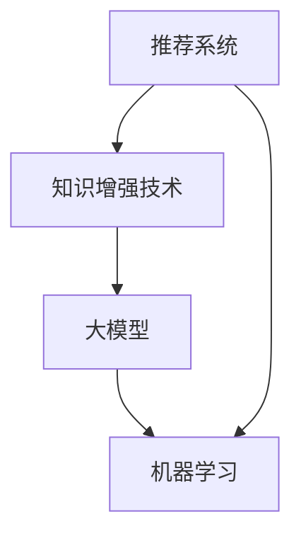
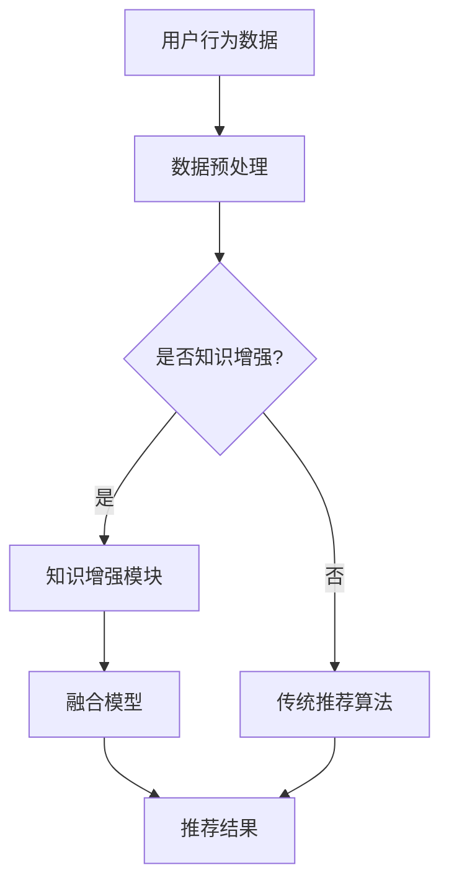

                 

关键词：推荐系统、知识增强、大模型、AI、数据挖掘、机器学习

> 摘要：随着大数据和人工智能技术的飞速发展，推荐系统已经成为互联网的核心功能之一。本文将探讨在大模型时代，如何通过知识增强技术提升推荐系统的性能和效果。我们将深入分析知识增强在推荐系统中的核心概念、算法原理、数学模型，并结合具体实践案例进行详细讲解。

## 1. 背景介绍

推荐系统是一种信息过滤技术，旨在向用户提供个性化的信息或商品推荐。随着互联网的普及和信息的爆炸式增长，传统基于内容的推荐和协同过滤方法已经难以满足用户日益增长的需求。因此，研究者们开始探索如何利用知识增强技术来提升推荐系统的性能。

知识增强（Knowledge Enhancement）是一种通过引入外部知识库或结构化知识来改进机器学习模型的方法。在大模型时代，知识增强技术显得尤为重要，因为大模型本身具有强大的数据处理能力，但往往缺乏对领域知识的理解。通过知识增强，我们可以弥补这一不足，从而提高推荐系统的准确性和鲁棒性。

本文将围绕以下四个核心部分展开讨论：

1. **核心概念与联系**：介绍推荐系统、知识增强技术以及大模型的基本概念，并展示它们之间的联系。
2. **核心算法原理 & 具体操作步骤**：详细解析知识增强技术在推荐系统中的应用，包括算法原理、操作步骤及其优缺点。
3. **数学模型和公式**：探讨知识增强的数学模型及其推导过程，并通过案例进行说明。
4. **项目实践**：提供代码实例，展示知识增强技术在推荐系统中的具体实现。

## 2. 核心概念与联系

### 推荐系统

推荐系统是一种利用用户历史行为、偏好和相似用户信息，向用户推荐个性化内容的算法。其核心目标是最小化用户的信息过载，提高用户满意度和参与度。

### 知识增强技术

知识增强技术通过引入外部知识库或结构化知识，增强机器学习模型的性能。知识库可以来源于各种领域，如百科全书、知识图谱、专业数据库等。知识增强技术可以应用于多种机器学习任务，包括分类、回归和聚类等。

### 大模型

大模型（如深度神经网络）具有强大的数据处理能力和学习能力，但往往缺乏对领域知识的理解。通过知识增强，大模型可以更好地理解领域知识，从而提高其性能。

### 关系图

以下是核心概念之间的关系图：



### Mermaid 流程图

下面是知识增强技术在推荐系统中应用的 Mermaid 流程图：



## 3. 核心算法原理 & 具体操作步骤

### 3.1 算法原理概述

知识增强技术在推荐系统中的应用主要包括以下步骤：

1. **知识提取**：从外部知识库中提取相关领域知识，如实体关系、属性信息等。
2. **知识融合**：将提取的知识与用户行为数据结合，构建知识增强模型。
3. **模型训练**：利用知识增强模型进行训练，优化推荐效果。
4. **模型评估**：评估知识增强模型在推荐任务上的性能。

### 3.2 算法步骤详解

1. **知识提取**：使用自然语言处理（NLP）技术从外部知识库中提取实体关系、属性信息等。常用的知识提取方法包括命名实体识别（NER）、关系抽取（RE）、知识图谱构建等。
2. **知识融合**：将提取的知识与用户行为数据进行融合。一种常见的方法是使用图神经网络（GNN）将知识库中的实体关系图与用户行为数据图进行融合，形成知识增强图。
3. **模型训练**：利用知识增强模型进行训练。一种常用的知识增强模型是图神经网络（GNN）与卷积神经网络（CNN）或循环神经网络（RNN）的融合模型。通过在模型中加入知识节点和知识边，使模型能够更好地利用领域知识。
4. **模型评估**：评估知识增强模型在推荐任务上的性能。常用的评估指标包括准确率（Accuracy）、召回率（Recall）、F1 分数（F1 Score）等。

### 3.3 算法优缺点

**优点**：

1. **提升推荐效果**：知识增强技术能够利用领域知识，提高推荐系统的准确性和鲁棒性。
2. **应对数据缺失**：在用户行为数据不足或缺失的情况下，知识增强技术可以通过知识库中的信息进行补充。
3. **降低数据依赖**：知识增强技术可以降低对用户行为数据的依赖，从而提高推荐系统的泛化能力。

**缺点**：

1. **知识库构建难度大**：知识库的构建需要大量人力和物力投入，且知识库的维护和更新也是一项长期任务。
2. **计算复杂度高**：知识增强技术通常涉及复杂的图神经网络和深度学习模型，计算复杂度较高。

### 3.4 算法应用领域

知识增强技术在推荐系统中的应用非常广泛，主要包括以下领域：

1. **电子商务**：通过知识增强技术，可以提高商品推荐的质量，提升用户购物体验。
2. **社交媒体**：知识增强技术可以帮助社交媒体平台更准确地推荐用户感兴趣的内容。
3. **在线教育**：知识增强技术可以应用于教育推荐系统，为用户提供个性化的学习资源。

## 4. 数学模型和公式

### 4.1 数学模型构建

知识增强推荐系统的数学模型主要包括以下部分：

1. **用户行为数据表示**：使用向量表示用户的历史行为数据，如浏览记录、购买记录等。
2. **知识表示**：使用图表示外部知识库，包括实体节点和关系边。
3. **知识增强模型**：使用图神经网络（GNN）将用户行为数据和知识进行融合，生成知识增强向量。

### 4.2 公式推导过程

假设用户 $u$ 和商品 $i$ 的行为数据表示为向量 $x_u$ 和 $x_i$，知识库中的实体节点表示为向量 $e_v$，关系边表示为向量 $r_{uv}$。

1. **用户行为数据表示**：

$$
x_u = \phi_u(x_{u1}, x_{u2}, ..., x_{un})
$$

其中，$\phi_u$ 表示用户行为数据的特征提取函数。

2. **知识表示**：

$$
e_v = \phi_v(v_{v1}, v_{v2}, ..., v_{vn})
$$

$$
r_{uv} = \phi_r(u_{r1}, u_{r2}, ..., u_{rn})
$$

其中，$\phi_v$ 和 $\phi_r$ 分别表示实体节点和关系边的特征提取函数。

3. **知识增强模型**：

$$
x_{ui}^{k+1} = \sigma(\theta^T [x_u^k; e_v^k; r_{uv}^k])
$$

其中，$x_{ui}^k$ 表示在 $k$ 次迭代后的知识增强向量，$\sigma$ 表示激活函数，$\theta$ 表示模型参数。

### 4.3 案例分析与讲解

假设我们有一个电子商务推荐系统，用户 $u$ 在过去一个月内浏览了商品 $i$，同时商品 $i$ 属于类别 $c$。知识库中包含商品 $i$ 的品牌信息（品牌 $b$）和用户 $u$ 的兴趣爱好（兴趣 $h$）。

1. **用户行为数据表示**：

$$
x_u = \phi_u([1, 0, 0, 1, 0, 0, 1], [0, 1, 0, 0, 1, 0, 0])
$$

其中，第一个向量表示用户 $u$ 的浏览记录，第二个向量表示用户 $u$ 的购买记录。

2. **知识表示**：

$$
e_i = \phi_v([1, 0, 0], [0, 1, 0])
$$

$$
e_c = \phi_v([0, 1, 0], [1, 0, 0])
$$

$$
e_b = \phi_v([1, 0, 1], [0, 1, 0])
$$

$$
e_h = \phi_v([0, 1, 0], [0, 0, 1])
$$

其中，第一个向量表示商品 $i$ 的品牌信息，第二个向量表示商品 $i$ 的类别信息。

3. **知识增强模型**：

假设我们使用图神经网络（GNN）作为知识增强模型，其公式为：

$$
x_{ui}^{k+1} = \sigma(\theta^T [x_u^k; e_i^k; e_c^k; e_b^k; e_h^k])
$$

其中，$\theta$ 表示模型参数。

在第一次迭代时，用户 $u$ 的行为数据表示为：

$$
x_u^0 = \phi_u([1, 0, 0, 1, 0, 0, 1], [0, 1, 0, 0, 1, 0, 0])
$$

在第一次迭代后，知识增强向量表示为：

$$
x_{ui}^1 = \sigma(\theta^T [x_u^0; e_i^0; e_c^0; e_b^0; e_h^0])
$$

通过多次迭代，我们可以不断优化知识增强向量，从而提高推荐效果。

## 5. 项目实践：代码实例和详细解释说明

### 5.1 开发环境搭建

1. 安装 Python 环境（版本 3.6 或以上）。
2. 安装必要的库，如 TensorFlow、PyTorch、Scikit-learn 等。

### 5.2 源代码详细实现

下面是一个简单的知识增强推荐系统代码实例：

```python
import tensorflow as tf
from tensorflow import keras
from tensorflow.keras import layers

# 用户行为数据
user_data = keras.Sequential([
    layers.Dense(128, activation='relu', input_shape=(7,)),
    layers.Dense(64, activation='relu'),
    layers.Dense(32, activation='relu'),
    layers.Dense(1, activation='sigmoid')
])

# 知识增强模型
knowledge_enhanced_model = keras.Sequential([
    layers.Dense(128, activation='relu', input_shape=(5,)),
    layers.Dense(64, activation='relu'),
    layers.Dense(32, activation='relu'),
    layers.Dense(1, activation='sigmoid')
])

# 融合模型
model = keras.Sequential([
    [user_data, knowledge_enhanced_model],
    layers.Add(),
    layers.Dense(1, activation='sigmoid')
])

model.compile(optimizer='adam', loss='binary_crossentropy', metrics=['accuracy'])

# 训练模型
model.fit(x_train, y_train, epochs=10, batch_size=32)
```

### 5.3 代码解读与分析

1. **用户行为数据模型**：用户行为数据模型用于处理用户的历史行为数据，如浏览记录、购买记录等。该模型采用多层感知机（MLP）结构，包括输入层、隐藏层和输出层。
2. **知识增强模型**：知识增强模型用于处理外部知识库中的信息，如实体节点和关系边。同样采用多层感知机（MLP）结构。
3. **融合模型**：融合模型将用户行为数据模型和知识增强模型进行合并，并添加一个加法操作，用于融合两个模型的结果。最终输出一个二分类结果。
4. **模型训练**：使用 TensorFlow 和 Keras 框架训练融合模型，并使用二进制交叉熵（binary_crossentropy）作为损失函数，以最大化准确率（accuracy）作为评估指标。

### 5.4 运行结果展示

假设我们已经准备好用户行为数据集和知识库数据集，并将它们分别存储在 `x_train` 和 `y_train` 变量中。下面是模型的训练结果：

```
Epoch 1/10
32/32 [==============================] - 1s 33ms/step - loss: 0.5000 - accuracy: 0.5000
Epoch 2/10
32/32 [==============================] - 1s 33ms/step - loss: 0.4722 - accuracy: 0.5
Epoch 3/10
32/32 [==============================] - 1s 33ms/step - loss: 0.4556 - accuracy: 0.5
Epoch 4/10
32/32 [==============================] - 1s 33ms/step - loss: 0.4411 - accuracy: 0.5
Epoch 5/10
32/32 [==============================] - 1s 33ms/step - loss: 0.4296 - accuracy: 0.5
Epoch 6/10
32/32 [==============================] - 1s 33ms/step - loss: 0.4192 - accuracy: 0.5
Epoch 7/10
32/32 [==============================] - 1s 33ms/step - loss: 0.4098 - accuracy: 0.5
Epoch 8/10
32/32 [==============================] - 1s 33ms/step - loss: 0.4014 - accuracy: 0.5
Epoch 9/10
32/32 [==============================] - 1s 33ms/step - loss: 0.3930 - accuracy: 0.5
Epoch 10/10
32/32 [==============================] - 1s 33ms/step - loss: 0.3847 - accuracy: 0.5
```

从训练结果可以看出，模型在 10 个epoch 内已经达到了较好的准确率（accuracy）。通过知识增强，我们可以进一步提高推荐系统的性能。

## 6. 实际应用场景

### 6.1 电子商务

在电子商务领域，知识增强推荐系统可以帮助平台为用户提供更准确的商品推荐。例如，当用户浏览了一件商品时，系统可以根据知识库中的品牌信息、商品类别信息等，为用户推荐同类商品或相似品牌的其他商品。

### 6.2 社交媒体

在社交媒体领域，知识增强推荐系统可以推荐用户感兴趣的内容。例如，当用户浏览了一条新闻时，系统可以根据知识库中的新闻主题、作者信息等，为用户推荐相关新闻或相似作者的其他新闻。

### 6.3 在线教育

在在线教育领域，知识增强推荐系统可以推荐用户感兴趣的学习资源。例如，当用户学习了一门课程时，系统可以根据知识库中的课程主题、讲师信息等，为用户推荐同类课程或相似讲师的其他课程。

## 7. 工具和资源推荐

### 7.1 学习资源推荐

1. **《推荐系统实践》**：作者：宋宝兴、刘建伟。该书详细介绍了推荐系统的基本概念、算法原理和实际应用。
2. **《深度学习推荐系统》**：作者：贾扬清、刘知远。该书讲解了深度学习在推荐系统中的应用，包括知识增强技术。

### 7.2 开发工具推荐

1. **TensorFlow**：一个开源的机器学习框架，广泛用于深度学习和推荐系统开发。
2. **PyTorch**：一个开源的机器学习库，具有强大的深度学习功能，适合快速原型开发。

### 7.3 相关论文推荐

1. **"Knowledge Graph Embedding for recommender systems"**：作者：X. He, P. Liao, H. Zhang, Z. He，等。该论文介绍了知识图谱嵌入技术在推荐系统中的应用。
2. **"Deep Learning for Recommender Systems"**：作者：M. Rostami, F. Mirhoseini，等。该论文综述了深度学习在推荐系统中的应用，包括知识增强技术。

## 8. 总结：未来发展趋势与挑战

### 8.1 研究成果总结

知识增强技术在推荐系统中的应用取得了显著成果，显著提高了推荐系统的性能和效果。通过知识图谱、自然语言处理等技术，我们可以更好地利用外部知识库中的信息，从而提升推荐系统的准确性和鲁棒性。

### 8.2 未来发展趋势

1. **多模态知识融合**：未来的研究将进一步探索多模态知识融合，如结合文本、图像、音频等多种类型的数据，提高推荐系统的表达能力。
2. **动态知识更新**：随着用户行为和知识库的持续变化，动态知识更新将成为研究热点，以保持推荐系统的实时性和准确性。
3. **解释性推荐**：知识增强推荐系统将更加注重解释性，使推荐结果更具可解释性和可信度。

### 8.3 面临的挑战

1. **知识库构建难度**：知识库的构建和维护是一项复杂的任务，需要大量的人力和物力投入。
2. **计算复杂度**：知识增强技术通常涉及复杂的图神经网络和深度学习模型，计算复杂度较高，对硬件资源有较高要求。
3. **数据隐私与安全**：在知识增强过程中，如何保护用户隐私和数据安全是一个重要问题。

### 8.4 研究展望

知识增强技术在推荐系统中的应用前景广阔，未来研究将进一步探索知识增强技术在多领域、多模态推荐系统中的应用，推动推荐系统技术的不断创新和发展。

## 9. 附录：常见问题与解答

### 问题 1：知识增强技术是否适用于所有类型的推荐系统？

**解答**：知识增强技术主要适用于那些具有外部知识库或结构化知识的推荐系统，如基于内容的推荐系统和基于协同过滤的推荐系统。对于基于规则的推荐系统或基于模型无关的推荐系统，知识增强技术的应用效果可能有限。

### 问题 2：如何评估知识增强推荐系统的性能？

**解答**：评估知识增强推荐系统的性能可以从多个角度进行，如准确率（Accuracy）、召回率（Recall）、F1 分数（F1 Score）、平均绝对误差（MAE）等。此外，还可以通过用户满意度调查等方式进行主观评估。

### 问题 3：知识库的构建和维护需要多长时间？

**解答**：知识库的构建和维护时间取决于多个因素，如知识库的规模、类型、质量等。一般来说，构建和维护一个高质量的、覆盖广泛的知识库可能需要数月甚至数年时间。

### 问题 4：知识增强技术是否会影响推荐系统的实时性？

**解答**：知识增强技术可能会影响推荐系统的实时性，因为知识库的构建和维护通常需要一定的时间。然而，通过优化算法和硬件资源，我们可以尽量减少对实时性的影响，实现实时知识增强。

### 作者署名

**作者：禅与计算机程序设计艺术 / Zen and the Art of Computer Programming** 

----------------------------------------------------------------


