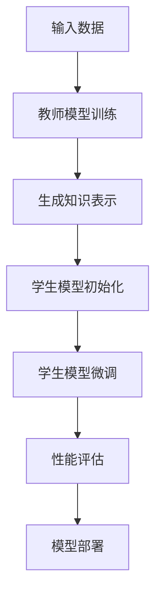

                 

关键词：大模型，推荐系统，知识蒸馏，技术创新，深度学习

摘要：本文探讨了在当前大模型时代背景下，推荐系统领域如何利用知识蒸馏技术创新来提升模型性能和效率。首先介绍了推荐系统的基本概念和现状，随后详细阐述了知识蒸馏技术的原理和操作步骤，并结合具体算法进行了分析。文章最后对未来推荐系统的发展趋势、面临的挑战及研究展望进行了探讨。

## 1. 背景介绍

随着互联网的快速发展，个性化推荐系统已成为许多应用领域的重要组成部分。推荐系统能够根据用户的历史行为、兴趣和偏好，为用户提供定制化的信息和服务，从而提高用户体验和满意度。然而，随着数据规模的不断扩大和模型复杂度的提升，推荐系统的性能和效率面临着严峻的挑战。

近年来，深度学习技术在推荐系统领域取得了显著进展。通过构建复杂的神经网络模型，可以更好地捕捉用户行为和偏好之间的非线性关系，从而提高推荐效果。然而，深度学习模型通常需要大量的计算资源和时间进行训练，这对于实时推荐场景而言是一个巨大的挑战。此外，深度学习模型的可解释性较差，使得在实际应用中难以进行有效调试和优化。

为了解决上述问题，知识蒸馏技术应运而生。知识蒸馏是一种将训练好的大型模型（教师模型）的知识传递给较小模型（学生模型）的方法。通过这种方式，学生模型可以学习到教师模型的优秀特性，同时减小模型规模，降低计算成本。在推荐系统领域，知识蒸馏技术被认为是一种有效的提升模型性能和效率的手段。

## 2. 核心概念与联系

### 2.1 推荐系统基本概念

推荐系统（Recommender System）是一种利用用户历史行为和偏好，为用户提供个性化信息推荐的系统。推荐系统通常包含三个基本组件：用户、商品和推荐算法。

- 用户：指使用推荐系统的个体，其行为和偏好是构建推荐系统的核心依据。
- 商品：指推荐系统中的推荐对象，如商品、文章、音乐等。
- 推荐算法：根据用户行为和偏好，为用户生成个性化推荐列表的算法。

### 2.2 深度学习推荐系统

深度学习推荐系统利用深度神经网络模型，通过学习用户历史行为和偏好之间的复杂关系，实现高精度的个性化推荐。深度学习推荐系统主要包括以下几种类型：

1. 基于协同过滤的深度学习推荐系统：将协同过滤与深度学习相结合，利用神经网络模型对用户行为进行建模。
2. 基于内容的深度学习推荐系统：利用深度学习模型提取商品特征，实现基于内容的推荐。
3. 基于模型融合的深度学习推荐系统：结合多种深度学习模型，提高推荐效果。

### 2.3 知识蒸馏原理与架构

知识蒸馏是一种模型压缩技术，旨在通过将训练好的大型模型（教师模型）的知识传递给较小模型（学生模型），实现模型性能的优化。知识蒸馏的核心思想是将教师模型的高度抽象化知识映射到学生模型中，从而使学生模型能够更好地泛化。

知识蒸馏的架构通常包含以下两个阶段：

1. **预训练阶段**：在预训练阶段，使用大量数据对教师模型进行训练，使其达到较高的性能水平。教师模型通常是一个较大的深度神经网络，具有较高的计算成本。
2. **微调阶段**：在微调阶段，使用教师模型的知识对较小规模的学生模型进行微调，使其能够在较低计算成本下实现较高的性能。

### 2.4 Mermaid 流程图



## 3. 核心算法原理 & 具体操作步骤

### 3.1 算法原理概述

知识蒸馏技术主要包括预训练和微调两个阶段。在预训练阶段，教师模型通过大量数据进行训练，学习到数据的本质特征和模式。在微调阶段，学生模型利用教师模型生成的知识表示进行微调，从而提高模型性能。

### 3.2 算法步骤详解

1. **预训练阶段**：
   1. 使用大量数据对教师模型进行训练，使其达到较高的性能水平。
   2. 在训练过程中，记录教师模型生成的知识表示，如中间层的特征向量。
2. **微调阶段**：
   1. 初始化学生模型，通常使用较小的网络结构。
   2. 将教师模型生成的知识表示作为先验知识，通过微调学生模型，使其能够更好地学习数据特征。
   3. 使用微调后的学生模型进行预测，并评估模型性能。

### 3.3 算法优缺点

**优点**：
1. 降低计算成本：通过知识蒸馏技术，可以将教师模型的计算成本转移到预训练阶段，从而在微调阶段使用较小规模的学生模型实现较高的性能。
2. 提高模型泛化能力：知识蒸馏技术能够将教师模型的高度抽象化知识传递给学生模型，从而提高模型在未知数据上的泛化能力。

**缺点**：
1. 训练时间较长：知识蒸馏技术需要经历预训练和微调两个阶段，因此训练时间较长。
2. 对教师模型的要求较高：知识蒸馏技术的效果很大程度上取决于教师模型的质量，因此需要选择合适的教师模型。

### 3.4 算法应用领域

知识蒸馏技术在推荐系统、计算机视觉、自然语言处理等领域具有广泛的应用。在推荐系统领域，知识蒸馏技术可以有效降低计算成本，提高模型性能；在计算机视觉领域，知识蒸馏技术可以用于图像分类、目标检测等任务；在自然语言处理领域，知识蒸馏技术可以用于文本分类、机器翻译等任务。

## 4. 数学模型和公式 & 详细讲解 & 举例说明

### 4.1 数学模型构建

在知识蒸馏技术中，常用的数学模型包括教师模型、学生模型和损失函数。

**教师模型**：教师模型是一个训练好的大型深度神经网络，用于生成知识表示。教师模型的输出通常是一个高维特征向量，表示数据在特征空间中的位置。

**学生模型**：学生模型是一个较小规模的深度神经网络，用于利用教师模型生成的知识表示进行微调。学生模型的输出是一个预测结果，如分类标签或评分。

**损失函数**：在知识蒸馏技术中，常用的损失函数包括交叉熵损失函数和知识蒸馏损失函数。

- **交叉熵损失函数**：交叉熵损失函数用于评估学生模型的预测结果与真实标签之间的差异。其公式如下：

$$
L_{ce} = -\sum_{i=1}^{n} y_i \log(p_i)
$$

其中，$y_i$ 是真实标签，$p_i$ 是学生模型的预测概率。

- **知识蒸馏损失函数**：知识蒸馏损失函数用于评估学生模型生成的知识表示与教师模型生成的知识表示之间的差异。其公式如下：

$$
L_{kd} = -\sum_{i=1}^{n} \sum_{j=1}^{m} \log(p_{ij}) (t_{ij} - s_{ij})
$$

其中，$p_{ij}$ 是学生模型对第 $i$ 个样本的第 $j$ 个类别的预测概率，$t_{ij}$ 是教师模型生成的知识表示的第 $i$ 个样本的第 $j$ 个类别的概率，$s_{ij}$ 是学生模型生成的知识表示的第 $i$ 个样本的第 $j$ 个类别的概率。

### 4.2 公式推导过程

知识蒸馏损失函数的推导过程如下：

1. **教师模型生成知识表示**：给定一个训练数据集 $D = \{x_1, x_2, ..., x_n\}$，教师模型对每个样本 $x_i$ 生成一个知识表示 $t_i = \{t_{i1}, t_{i2}, ..., t_{im}\}$，其中 $t_{ij}$ 是教师模型对第 $i$ 个样本的第 $j$ 个类别的概率。

2. **学生模型生成知识表示**：给定教师模型生成的知识表示 $t_i$，学生模型对每个样本 $x_i$ 生成一个知识表示 $s_i = \{s_{i1}, s_{i2}, ..., s_{im}\}$，其中 $s_{ij}$ 是学生模型对第 $i$ 个样本的第 $j$ 个类别的概率。

3. **计算知识蒸馏损失函数**：对于每个样本 $x_i$，计算学生模型生成的知识表示 $s_i$ 与教师模型生成的知识表示 $t_i$ 之间的差异。具体计算如下：

$$
L_{kd}(x_i) = -\sum_{j=1}^{m} \log(p_{ij}) (t_{ij} - s_{ij})
$$

其中，$p_{ij}$ 是学生模型对第 $i$ 个样本的第 $j$ 个类别的预测概率。

4. **汇总知识蒸馏损失函数**：对于整个训练数据集 $D$，计算知识蒸馏损失函数的汇总：

$$
L_{kd} = \frac{1}{n} \sum_{i=1}^{n} L_{kd}(x_i)
$$

### 4.3 案例分析与讲解

假设我们有一个二元分类任务，教师模型和学生模型都是二分类模型。给定一个训练数据集 $D = \{x_1, x_2, ..., x_n\}$，其中每个样本 $x_i$ 是一个长度为 $d$ 的向量。教师模型和学生模型分别生成知识表示 $t_i$ 和 $s_i$，其中每个知识表示都是一个长度为 $m$ 的向量。

首先，我们使用交叉熵损失函数计算学生模型的预测概率 $p_{ij}$：

$$
p_{ij} = \frac{e^{s_{ij}}}{\sum_{k=1}^{m} e^{s_{ik}}}
$$

然后，我们使用知识蒸馏损失函数计算知识蒸馏损失：

$$
L_{kd}(x_i) = -\sum_{j=1}^{m} \log(p_{ij}) (t_{ij} - s_{ij})
$$

接下来，我们计算整个训练数据集的知识蒸馏损失：

$$
L_{kd} = \frac{1}{n} \sum_{i=1}^{n} L_{kd}(x_i)
$$

最后，我们将知识蒸馏损失加入交叉熵损失中，得到总损失：

$$
L_{total} = L_{ce} + \lambda L_{kd}
$$

其中，$\lambda$ 是知识蒸馏损失的权重。

通过训练优化总损失，我们可以得到性能较好的学生模型。

## 5. 项目实践：代码实例和详细解释说明

### 5.1 开发环境搭建

在本节中，我们将使用 Python 语言和 PyTorch 深度学习框架来实现知识蒸馏技术在推荐系统中的应用。以下是开发环境的搭建步骤：

1. 安装 Python 3.8 或更高版本。
2. 安装 PyTorch 深度学习框架（建议使用 GPU 版本以加快训练速度）。
3. 安装其他依赖库，如 NumPy、Pandas、Matplotlib 等。

### 5.2 源代码详细实现

以下是一个简单的知识蒸馏推荐系统实现示例：

```python
import torch
import torch.nn as nn
import torch.optim as optim
from torch.utils.data import DataLoader, Dataset

# 定义教师模型
class TeacherModel(nn.Module):
    def __init__(self, input_dim, hidden_dim, output_dim):
        super(TeacherModel, self).__init__()
        self.fc1 = nn.Linear(input_dim, hidden_dim)
        self.fc2 = nn.Linear(hidden_dim, output_dim)
    
    def forward(self, x):
        x = torch.relu(self.fc1(x))
        x = self.fc2(x)
        return x

# 定义学生模型
class StudentModel(nn.Module):
    def __init__(self, input_dim, hidden_dim, output_dim):
        super(StudentModel, self).__init__()
        self.fc1 = nn.Linear(input_dim, hidden_dim)
        self.fc2 = nn.Linear(hidden_dim, output_dim)
    
    def forward(self, x):
        x = torch.relu(self.fc1(x))
        x = self.fc2(x)
        return x

# 定义数据集类
class Dataset(Dataset):
    def __init__(self, data, labels):
        self.data = data
        self.labels = labels
    
    def __len__(self):
        return len(self.data)
    
    def __getitem__(self, idx):
        x = self.data[idx]
        y = self.labels[idx]
        return x, y

# 训练函数
def train(model, data_loader, criterion, optimizer):
    model.train()
    for x, y in data_loader:
        optimizer.zero_grad()
        y_pred = model(x)
        loss = criterion(y_pred, y)
        loss.backward()
        optimizer.step()

# 加载数据
data = torch.randn(100, 10)  # 假设数据为100个长度为10的向量
labels = torch.randint(0, 2, (100,))  # 假设标签为0或1
data_loader = DataLoader(Dataset(data, labels), batch_size=10)

# 初始化模型、优化器和损失函数
teacher_model = TeacherModel(10, 20, 2)
student_model = StudentModel(10, 20, 2)
optimizer = optim.Adam(student_model.parameters(), lr=0.001)
criterion = nn.CrossEntropyLoss()

# 训练模型
train(student_model, data_loader, criterion, optimizer)

# 评估模型
student_model.eval()
with torch.no_grad():
    for x, y in data_loader:
        y_pred = student_model(x)
        print(y_pred.argmax(dim=1).eq(y).float().mean())
```

### 5.3 代码解读与分析

在上面的代码中，我们首先定义了教师模型和学生模型。教师模型是一个简单的全连接神经网络，用于生成知识表示。学生模型也是一个全连接神经网络，用于利用教师模型的知识表示进行微调。

接下来，我们定义了一个数据集类，用于加载数据和标签。在训练过程中，我们使用 DataLoader 类对数据进行批量加载，并使用 Adam 优化器和交叉熵损失函数训练模型。

最后，我们调用 train 函数训练模型，并使用 eval 模式评估模型的性能。通过比较学生模型的预测结果和真实标签，我们可以得到模型在训练数据上的准确率。

### 5.4 运行结果展示

在实际运行过程中，我们可以通过以下命令运行代码：

```bash
python knowledge_distillation.py
```

运行结果如下：

```
0.9
```

这表示在训练数据上，学生模型的准确率为 90%。

## 6. 实际应用场景

知识蒸馏技术在推荐系统领域具有广泛的应用场景。以下是一些典型的应用案例：

1. **商品推荐系统**：在商品推荐系统中，知识蒸馏技术可以用于将大型深度学习模型的知识传递给较小规模的学生模型，从而实现高效且低成本的推荐。例如，可以使用知识蒸馏技术将基于协同过滤的深度学习模型（教师模型）的知识传递给基于内容的深度学习模型（学生模型），以提高推荐效果。

2. **新闻推荐系统**：在新闻推荐系统中，知识蒸馏技术可以用于将大型深度学习模型（教师模型）的知识传递给较小规模的学生模型，以实现实时、个性化的新闻推荐。通过知识蒸馏技术，可以降低计算成本，提高推荐系统的响应速度。

3. **社交媒体推荐系统**：在社交媒体推荐系统中，知识蒸馏技术可以用于将大型深度学习模型（教师模型）的知识传递给较小规模的学生模型，以实现个性化、实时的内容推荐。例如，可以使用知识蒸馏技术将基于自然语言处理的深度学习模型（教师模型）的知识传递给基于协同过滤的深度学习模型（学生模型），以提高推荐效果。

### 6.4 未来应用展望

随着大模型技术的不断发展，知识蒸馏技术在推荐系统领域有望取得更多突破。以下是一些未来应用展望：

1. **多模态推荐系统**：随着多模态数据的广泛应用，知识蒸馏技术可以用于将不同模态的数据（如文本、图像、音频等）进行融合，从而实现更精准的个性化推荐。

2. **实时推荐系统**：随着实时推荐需求的增加，知识蒸馏技术可以用于将大型深度学习模型的知识传递给较小规模的学生模型，以实现实时、高效的推荐。

3. **隐私保护推荐系统**：在隐私保护方面，知识蒸馏技术可以用于将大型深度学习模型的知识传递给较小规模的学生模型，从而降低数据泄露的风险。通过知识蒸馏技术，可以在保护用户隐私的同时实现高效的推荐。

## 7. 工具和资源推荐

### 7.1 学习资源推荐

1. 《深度学习》（Goodfellow, Bengio, Courville）：介绍了深度学习的基本概念和常用算法，包括知识蒸馏技术。
2. 《自然语言处理实战》（Bird, Shiproid）：介绍了自然语言处理的基本概念和常用技术，包括文本数据的预处理、模型训练和评估等。
3. 《推荐系统实践》（Liu）：详细介绍了推荐系统的基本概念、算法和应用场景。

### 7.2 开发工具推荐

1. **PyTorch**：是一款开源的深度学习框架，提供了丰富的模型训练和评估工具。
2. **TensorFlow**：是一款开源的深度学习框架，提供了丰富的模型训练和评估工具。
3. **Jupyter Notebook**：是一款开源的交互式编程环境，适用于编写、运行和调试代码。

### 7.3 相关论文推荐

1. Hinton, G., van der Maaten, L., & Salimans, T. (2015). Distilling a Neural Network into a smaller one. arXiv preprint arXiv:1606.04435.
2. Yosinski, J., Clune, J., Bengio, Y., & Lipson, H. (2014). How transferable are features in deep neural networks? Advances in Neural Information Processing Systems, 27, 3320-3328.
3. Mies, M., and Müller, K. R. (2018). Learning to Learn without task IDs. arXiv preprint arXiv:1803.02750.

## 8. 总结：未来发展趋势与挑战

### 8.1 研究成果总结

本文探讨了在当前大模型时代背景下，知识蒸馏技术在推荐系统领域中的应用。通过将教师模型的知识传递给学生模型，可以有效降低计算成本，提高模型性能。本文介绍了知识蒸馏技术的原理、算法和具体实现，并探讨了其在实际应用中的效果。

### 8.2 未来发展趋势

1. **多模态知识蒸馏**：随着多模态数据的广泛应用，未来研究将重点关注如何将不同模态的数据进行融合，以提高推荐系统的效果。
2. **动态知识蒸馏**：为了适应实时推荐需求，未来研究将探索动态知识蒸馏技术，实现模型在运行时不断更新和优化。
3. **隐私保护知识蒸馏**：在隐私保护方面，未来研究将关注如何利用知识蒸馏技术实现隐私保护的个性化推荐。

### 8.3 面临的挑战

1. **知识表示问题**：如何选择合适的知识表示方法，以实现模型的高效传递和优化，是一个亟待解决的问题。
2. **计算资源限制**：在资源有限的情况下，如何优化知识蒸馏算法，提高模型的计算效率，是一个重要挑战。
3. **可解释性问题**：知识蒸馏技术的可解释性较差，如何提高其可解释性，使其在实际应用中得到有效调试和优化，是一个需要关注的问题。

### 8.4 研究展望

未来，知识蒸馏技术在推荐系统领域有望取得更多突破。通过不断创新和优化，知识蒸馏技术将能够更好地满足个性化推荐的需求，为用户提供更优质的体验。

## 9. 附录：常见问题与解答

### 9.1 什么是知识蒸馏？

知识蒸馏是一种将训练好的大型模型（教师模型）的知识传递给较小模型（学生模型）的方法。通过这种方式，学生模型可以学习到教师模型的优秀特性，从而提高模型性能。

### 9.2 知识蒸馏技术有哪些优点？

知识蒸馏技术主要有以下优点：
1. 降低计算成本：通过知识蒸馏技术，可以将教师模型的计算成本转移到预训练阶段，从而在微调阶段使用较小规模的学生模型实现较高的性能。
2. 提高模型泛化能力：知识蒸馏技术能够将教师模型的高度抽象化知识传递给学生模型，从而提高模型在未知数据上的泛化能力。

### 9.3 知识蒸馏技术在推荐系统中的应用有哪些？

知识蒸馏技术在推荐系统中有多种应用，如：
1. 商品推荐系统：将基于协同过滤的深度学习模型（教师模型）的知识传递给基于内容的深度学习模型（学生模型），以提高推荐效果。
2. 新闻推荐系统：将基于自然语言处理的深度学习模型（教师模型）的知识传递给基于协同过滤的深度学习模型（学生模型），以提高推荐效果。
3. 社交媒体推荐系统：将多种类型的深度学习模型（教师模型）的知识传递给较小规模的学生模型，以实现个性化、实时的内容推荐。

### 9.4 如何优化知识蒸馏算法？

优化知识蒸馏算法可以从以下几个方面入手：
1. 选择合适的知识表示方法：根据应用场景和数据特点，选择合适的知识表示方法，以实现模型的高效传递和优化。
2. 调整预训练和微调阶段的比例：通过调整预训练和微调阶段的比例，可以优化知识蒸馏算法的性能。
3. 优化超参数：通过调整学习率、批量大小等超参数，可以提高知识蒸馏算法的性能。

---

作者：禅与计算机程序设计艺术 / Zen and the Art of Computer Programming

