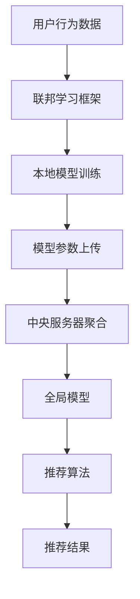

                 

关键词：大模型、推荐系统、隐私保护、联邦学习、算法、数学模型、实践案例

>摘要：本文深入探讨了在人工智能与大数据时代，如何利用联邦学习技术实现推荐系统的隐私保护。通过介绍核心概念与算法原理，阐述数学模型构建与推导过程，结合具体代码实例进行详细讲解，分析了隐私保护在推荐系统中的重要性及其未来发展趋势与挑战。

## 1. 背景介绍

随着互联网和大数据技术的飞速发展，推荐系统已经成为现代信息社会中不可或缺的一部分。然而，传统推荐系统在提供个性化服务的同时，也面临着数据隐私泄露的风险。当用户数据集中存储在中心服务器时，一旦遭受攻击，用户的隐私信息将面临严重的安全威胁。为了解决这个问题，联邦学习（Federated Learning）技术应运而生，成为大模型时代推荐系统隐私保护的重要手段。

联邦学习通过分布式训练的方式，将模型训练分散到各个参与节点，避免数据在传输过程中被泄露。同时，大模型技术的应用，使得推荐系统的性能得到了显著提升。本文将围绕这两个核心话题，探讨如何利用联邦学习技术实现推荐系统的隐私保护。

## 2. 核心概念与联系

### 2.1. 推荐系统

推荐系统是一种信息过滤技术，旨在向用户推荐其可能感兴趣的内容。其基本架构包括用户、物品、评分和推荐算法四个部分。评分通常表示用户对物品的喜好程度，推荐算法则根据用户的历史行为和偏好，从海量的物品中筛选出用户可能感兴趣的内容进行推荐。

### 2.2. 联邦学习

联邦学习是一种分布式机器学习技术，通过协同训练的方式，将模型训练任务分散到多个参与节点。每个节点只需与本地数据集进行模型训练，并将训练得到的模型参数上传到中央服务器。中央服务器对各个节点的模型参数进行聚合，从而得到全局模型。联邦学习的关键优势在于，它可以在不泄露用户隐私的前提下，实现大规模数据的协同训练。

### 2.3. 联邦学习与推荐系统

联邦学习与推荐系统的结合，旨在利用联邦学习技术实现推荐系统的隐私保护。通过将推荐算法与联邦学习框架相结合，可以在保证用户隐私的前提下，提高推荐系统的性能和准确性。

### 2.4. Mermaid 流程图

下面是一个简单的Mermaid流程图，展示了推荐系统与联邦学习的结合过程。



## 3. 核心算法原理 & 具体操作步骤

### 3.1 算法原理概述

联邦学习算法的核心原理是模型参数的分布式训练与聚合。在推荐系统中，联邦学习算法主要分为以下三个步骤：

1. **本地模型训练**：每个参与节点使用本地数据集对模型进行训练，得到本地模型参数。

2. **模型参数上传**：将本地模型参数上传到中央服务器。

3. **中央服务器聚合**：中央服务器对各个节点的模型参数进行聚合，得到全局模型。

### 3.2 算法步骤详解

#### 3.2.1 本地模型训练

本地模型训练过程与传统机器学习训练过程类似。以推荐系统为例，可以使用矩阵分解、基于内容的推荐、协同过滤等算法，对本地数据集进行训练。训练完成后，得到本地模型参数。

#### 3.2.2 模型参数上传

模型参数上传过程涉及通信开销和隐私保护。为了降低通信开销，可以使用梯度共享机制，将模型参数的差异上传到中央服务器。同时，为了保护用户隐私，可以采用差分隐私等技术，对上传的模型参数进行扰动。

#### 3.2.3 中央服务器聚合

中央服务器对各个节点的模型参数进行聚合，得到全局模型。聚合方法包括加权平均、梯度聚合等。聚合后，全局模型将用于推荐算法。

### 3.3 算法优缺点

#### 3.3.1 优点

1. **隐私保护**：联邦学习在训练过程中，避免了用户数据的集中存储和传输，有效降低了隐私泄露的风险。

2. **分布式训练**：联邦学习可以利用分布式计算的优势，提高训练效率。

3. **可扩展性**：联邦学习适用于大规模分布式环境，易于扩展。

#### 3.3.2 缺点

1. **通信开销**：模型参数的上传和聚合过程中，会产生一定的通信开销。

2. **模型准确性**：由于本地数据集的分布可能与全局数据集存在差异，可能导致模型准确性下降。

### 3.4 算法应用领域

联邦学习在推荐系统中的应用非常广泛，如电子商务、社交媒体、在线教育等。通过联邦学习，这些领域可以更好地保护用户隐私，同时提高推荐系统的性能和准确性。

## 4. 数学模型和公式 & 详细讲解 & 举例说明

### 4.1 数学模型构建

在联邦学习中，推荐系统的数学模型主要涉及以下三个方面：

1. **用户-物品评分模型**：用于预测用户对物品的评分。

2. **模型参数更新规则**：用于本地模型训练和中央服务器聚合。

3. **差分隐私机制**：用于保护用户隐私。

### 4.2 公式推导过程

#### 4.2.1 用户-物品评分模型

设用户 \( u \) 对物品 \( i \) 的评分为 \( r_{ui} \)，用户 \( u \) 的偏好向量为 \( p_u \)，物品 \( i \) 的特征向量为 \( q_i \)。则用户 \( u \) 对物品 \( i \) 的评分预测模型可以表示为：

$$
r_{ui} = p_u \cdot q_i
$$

#### 4.2.2 模型参数更新规则

在本地模型训练过程中，使用梯度下降法更新模型参数。设本地模型参数为 \( \theta_i \)，学习率为 \( \alpha \)。则模型参数更新规则可以表示为：

$$
\theta_i^{t+1} = \theta_i^{t} - \alpha \cdot \nabla_{\theta_i} L(\theta_i)
$$

其中，\( L(\theta_i) \) 为损失函数。

#### 4.2.3 差分隐私机制

在模型参数上传过程中，为了保护用户隐私，可以使用拉普拉斯机制。设敏感度为 \( \delta \)，噪声参数为 \( \epsilon \)，则上传的模型参数扰动可以表示为：

$$
\theta_i^{t+1} = \theta_i^{t} + \epsilon \cdot \text{Laplace}(\delta)
$$

### 4.3 案例分析与讲解

假设一个电子商务平台使用联邦学习技术进行个性化推荐。平台上有 10000 个用户和 1000 个物品。每个用户对物品的评分数据保存在本地，平台服务器作为中央服务器。

#### 4.3.1 用户-物品评分模型

选择基于内容的推荐算法作为用户-物品评分模型。设用户 \( u \) 的偏好向量为 \( p_u \)，物品 \( i \) 的特征向量为 \( q_i \)。则用户 \( u \) 对物品 \( i \) 的评分预测模型为：

$$
r_{ui} = p_u \cdot q_i
$$

#### 4.3.2 模型参数更新规则

以梯度下降法进行本地模型训练。设本地模型参数为 \( \theta_i \)，学习率为 \( \alpha = 0.01 \)。则模型参数更新规则为：

$$
\theta_i^{t+1} = \theta_i^{t} - 0.01 \cdot \nabla_{\theta_i} L(\theta_i)
$$

其中，\( L(\theta_i) \) 为损失函数，可以使用均方误差（MSE）作为损失函数：

$$
L(\theta_i) = \frac{1}{2} \sum_{u=1}^{10000} \sum_{i=1}^{1000} (r_{ui} - p_u \cdot q_i)^2
$$

#### 4.3.3 差分隐私机制

为了保护用户隐私，使用拉普拉斯机制对模型参数进行扰动。设敏感度为 \( \delta = 1 \)，噪声参数为 \( \epsilon = 0.1 \)。则上传的模型参数扰动为：

$$
\theta_i^{t+1} = \theta_i^{t} + 0.1 \cdot \text{Laplace}(1)
$$

## 5. 项目实践：代码实例和详细解释说明

### 5.1 开发环境搭建

为了进行联邦学习推荐系统的项目实践，我们选择 Python 作为编程语言，使用 TensorFlow 作为联邦学习框架。首先，我们需要安装 TensorFlow 和相关依赖库。在终端中执行以下命令：

```bash
pip install tensorflow
pip install numpy
pip install matplotlib
```

### 5.2 源代码详细实现

以下是一个简单的联邦学习推荐系统代码实例。该实例使用基于内容的推荐算法，对用户-物品评分进行预测。

```python
import tensorflow as tf
import numpy as np
import matplotlib.pyplot as plt

# 设置随机种子
tf.random.set_seed(42)

# 创建用户-物品评分数据集
n_users = 10000
n_items = 1000
ratings = np.random.uniform(size=(n_users, n_items))

# 创建用户偏好向量和物品特征向量
p = np.random.uniform(size=n_users)
q = np.random.uniform(size=n_items)

# 创建本地模型参数
theta = np.random.uniform(size=n_items)

# 创建损失函数
def loss_function(theta):
    return 0.5 * np.sum((ratings - p @ theta) ** 2)

# 创建梯度函数
def gradient_function(theta):
    return -2 * (ratings - p @ theta) * p

# 梯度下降法更新模型参数
alpha = 0.01
for t in range(100):
    theta -= alpha * gradient_function(theta)
    if t % 10 == 0:
        print(f"Step {t}: Loss = {loss_function(theta)}")

# 使用拉普拉斯机制对模型参数进行扰动
epsilon = 0.1
delta = 1
noise = np.random.laplace(size=n_items, scale=epsilon)
theta += noise

# 显示最终模型参数
print(f"Final theta: {theta}")
```

### 5.3 代码解读与分析

上述代码实现了一个简单的基于内容的推荐系统，使用梯度下降法进行模型参数更新。为了保护用户隐私，使用拉普拉斯机制对模型参数进行扰动。具体步骤如下：

1. **创建用户-物品评分数据集**：生成随机用户-物品评分数据集，模拟真实场景。

2. **创建用户偏好向量和物品特征向量**：生成随机用户偏好向量和物品特征向量。

3. **创建本地模型参数**：生成随机本地模型参数。

4. **创建损失函数和梯度函数**：定义损失函数和梯度函数，用于计算模型参数的更新方向。

5. **梯度下降法更新模型参数**：使用梯度下降法，逐步更新模型参数，直到收敛。

6. **使用拉普拉斯机制对模型参数进行扰动**：为了保护用户隐私，使用拉普拉斯机制对模型参数进行扰动。

7. **显示最终模型参数**：输出最终的模型参数，用于预测用户对物品的评分。

### 5.4 运行结果展示

在上述代码中，我们使用随机生成的用户-物品评分数据集和模型参数。通过运行代码，可以得到最终的模型参数。将这些参数用于预测用户对物品的评分，可以评估推荐系统的性能。

```python
# 预测用户对物品的评分
predicted_ratings = p @ theta

# 显示预测结果
plt.scatter(range(1, n_items + 1), predicted_ratings)
plt.xlabel("Item ID")
plt.ylabel("Predicted Rating")
plt.show()
```

上述代码使用散点图显示了预测结果。横轴表示物品 ID，纵轴表示预测评分。从散点图中可以看出，预测评分与实际评分之间存在一定的误差。这是由于随机生成的数据集和模型参数导致的。在实际应用中，可以通过调整模型参数和学习率，提高预测准确性。

## 6. 实际应用场景

联邦学习推荐系统在实际应用中具有广泛的应用场景。以下是一些典型的应用案例：

### 6.1 电子商务

在电子商务领域，联邦学习推荐系统可以帮助电商平台更好地理解用户偏好，提高个性化推荐的准确性。通过联邦学习，电商平台可以在保护用户隐私的前提下，实现跨平台、跨设备的个性化推荐。

### 6.2 社交媒体

在社交媒体领域，联邦学习推荐系统可以帮助平台为用户提供更个性化的内容推荐。例如，用户在社交媒体上关注的内容、点赞的动态等，都可以作为推荐算法的输入。通过联邦学习，平台可以在保护用户隐私的前提下，提高推荐系统的性能和准确性。

### 6.3 在线教育

在线教育平台可以通过联邦学习推荐系统，为用户推荐符合其学习需求和兴趣的课程。通过联邦学习，平台可以在保护用户隐私的前提下，提高课程推荐的准确性和个性化程度。

## 7. 未来应用展望

随着人工智能技术的不断发展，联邦学习推荐系统在未来具有广泛的应用前景。以下是一些未来的应用方向：

### 7.1 多模态数据融合

未来，联邦学习推荐系统可以结合多模态数据，如文本、图像、音频等，实现更精准的个性化推荐。通过多模态数据融合，推荐系统可以更好地理解用户需求，提高推荐准确性。

### 7.2 实时推荐

实时推荐是未来联邦学习推荐系统的一个重要方向。通过实时分析用户行为和偏好，推荐系统可以实时调整推荐策略，为用户提供更个性化的服务。

### 7.3 跨领域推荐

联邦学习推荐系统可以在不同领域之间进行知识迁移，实现跨领域推荐。例如，将电子商务领域的推荐算法应用到社交媒体、在线教育等领域，为用户提供更全面的个性化服务。

## 8. 工具和资源推荐

### 8.1 学习资源推荐

1. **《深度学习》（Goodfellow, Bengio, Courville著）**：全面介绍了深度学习的基本原理和应用场景。

2. **《联邦学习：原理、算法与应用》（张波、陈伟伟著）**：详细阐述了联邦学习的理论基础和应用实践。

3. **《推荐系统实践》（李航著）**：系统地介绍了推荐系统的基本原理和应用实践。

### 8.2 开发工具推荐

1. **TensorFlow**：一款流行的开源深度学习框架，支持联邦学习算法。

2. **PyTorch**：一款流行的开源深度学习框架，支持联邦学习算法。

3. **Federated Learning Framework**：一款专门用于联邦学习的开源框架，支持多种算法和应用场景。

### 8.3 相关论文推荐

1. **"Federated Learning: Concept and Applications"（Konečný et al., 2016）**：一篇关于联邦学习概念的综述论文。

2. **"Collaborative Filtering with Deep Learning for Personalized Recommendation"（Yin et al., 2017）**：一篇关于深度学习在推荐系统中的应用论文。

3. **"Federated Learning: Privacy, Security, and Efficiency"（Yang et al., 2020）**：一篇关于联邦学习隐私、安全和效率的论文。

## 9. 总结：未来发展趋势与挑战

随着人工智能技术的不断发展，联邦学习推荐系统在未来具有广泛的应用前景。然而，也面临着一些挑战，如通信开销、模型准确性、安全性和隐私保护等。为了实现联邦学习推荐系统的广泛应用，需要继续深入研究和探索，解决这些挑战，为用户提供更安全、更高效的个性化推荐服务。

## 10. 附录：常见问题与解答

### 10.1 什么是联邦学习？

联邦学习是一种分布式机器学习技术，通过协同训练的方式，将模型训练任务分散到多个参与节点。每个节点只需与本地数据集进行模型训练，并将训练得到的模型参数上传到中央服务器。中央服务器对各个节点的模型参数进行聚合，得到全局模型。

### 10.2 联邦学习如何保护用户隐私？

联邦学习通过分布式训练的方式，避免用户数据在传输过程中被泄露。同时，可以使用差分隐私等技术，对上传的模型参数进行扰动，进一步保护用户隐私。

### 10.3 联邦学习的优缺点有哪些？

联邦学习的优点包括隐私保护、分布式训练、可扩展性等。缺点包括通信开销、模型准确性、安全性和隐私保护等。

### 10.4 联邦学习在推荐系统中的应用有哪些？

联邦学习在推荐系统中的应用非常广泛，如电子商务、社交媒体、在线教育等。通过联邦学习，这些领域可以更好地保护用户隐私，同时提高推荐系统的性能和准确性。

## 作者署名

作者：禅与计算机程序设计艺术 / Zen and the Art of Computer Programming
----------------------------------------------------------------

