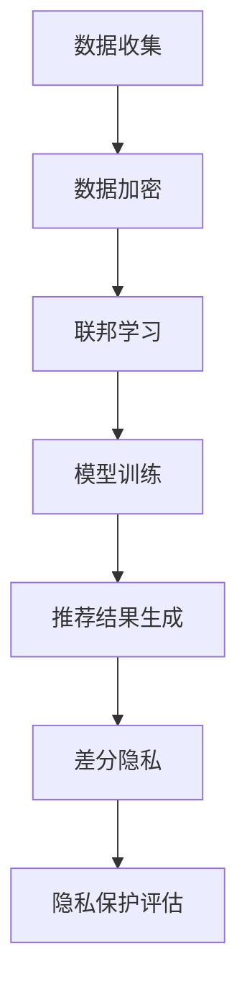

                 

在人工智能和大数据技术迅速发展的背景下，推荐系统已经成为许多互联网应用的重要组成部分。然而，随着推荐系统规模的不断扩大和用户数据的日益丰富，隐私保护问题也日益凸显。本文将探讨在大模型时代推荐系统中的隐私保护技术，旨在为业界提供一些具有实际操作性的解决方案。

## 关键词

- 大模型
- 推荐系统
- 隐私保护
- 安全性
- 数据加密

## 摘要

本文首先介绍了推荐系统的发展背景及其重要性，然后分析了当前推荐系统中存在的隐私保护问题。接着，文章重点讨论了在大模型时代，如何利用数据加密、联邦学习、差分隐私等隐私保护技术来提升推荐系统的安全性。最后，文章展望了推荐系统隐私保护技术的未来发展趋势。

## 1. 背景介绍

### 推荐系统的定义与发展

推荐系统是一种基于用户行为、兴趣和偏好等信息的个性化服务技术，旨在为用户推荐其可能感兴趣的内容或商品。推荐系统的发展经历了基于内容、协同过滤、基于模型等多种阶段。随着深度学习和大数据技术的兴起，推荐系统的性能和智能化程度得到了极大的提升。

### 推荐系统的应用场景

推荐系统广泛应用于电子商务、社交媒体、视频网站、音乐平台等多个领域。例如，电子商务平台通过推荐系统向用户展示可能感兴趣的商品，从而提高销售额；社交媒体平台通过推荐系统为用户提供个性化内容，增加用户粘性。

### 推荐系统的挑战

随着推荐系统的发展，数据隐私保护问题日益严重。用户数据一旦泄露，可能被用于不正当用途，甚至对用户造成损害。此外，推荐系统本身也可能受到恶意攻击，导致推荐结果不准确。因此，如何在大模型时代保障推荐系统的隐私保护成为亟待解决的关键问题。

## 2. 核心概念与联系

### 数据加密

数据加密是一种将数据转换成加密形式的技术，以防止未经授权的访问。在大模型时代，数据加密可以有效地保护用户隐私，防止数据泄露。常见的加密算法包括对称加密和非对称加密。

### 联邦学习

联邦学习是一种分布式机器学习技术，允许多个参与者共同训练一个模型，而不需要共享原始数据。联邦学习在大模型时代具有广泛的应用前景，可以有效保护用户数据隐私。

### 差分隐私

差分隐私是一种保护数据隐私的数学理论，通过在数据集上添加噪声，使得基于数据的统计分析结果无法区分单个数据点的存在。差分隐私在大模型时代被广泛应用于隐私保护。

### Mermaid 流程图

以下是推荐系统隐私保护技术的一个 Mermaid 流程图：



## 3. 核心算法原理 & 具体操作步骤

### 3.1 算法原理概述

#### 数据加密

数据加密的基本原理是通过加密算法将明文数据转换成密文数据，只有拥有解密密钥的用户才能将密文数据还原为明文数据。

#### 联邦学习

联邦学习的基本原理是通过分布式计算技术，将多个参与者的数据分散存储，然后共同训练一个全局模型。联邦学习的关键技术包括模型加密、通信加密和数据加密。

#### 差分隐私

差分隐私的基本原理是在数据分析过程中添加噪声，使得基于数据的统计分析结果无法区分单个数据点的存在。

### 3.2 算法步骤详解

#### 数据加密

1. 数据收集：从不同数据源收集用户数据。
2. 数据加密：使用加密算法对数据进行加密。
3. 数据存储：将加密后的数据存储在分布式数据库中。

#### 联邦学习

1. 数据划分：将用户数据划分成训练集和测试集。
2. 模型初始化：初始化全局模型。
3. 模型更新：每个参与者根据本地数据更新模型。
4. 模型聚合：将所有参与者的模型更新结果进行聚合。
5. 模型评估：使用测试集评估模型性能。

#### 差分隐私

1. 数据清洗：清洗数据，去除异常值。
2. 数据采样：从数据集中随机抽取样本。
3. 数据噪声添加：对采样数据进行噪声添加。
4. 数据分析：对添加噪声后的数据进行分析。

### 3.3 算法优缺点

#### 数据加密

**优点**：可以有效地保护用户数据隐私，防止数据泄露。

**缺点**：加密过程会增加计算和通信开销，降低系统性能。

#### 联邦学习

**优点**：可以有效保护用户数据隐私，降低数据泄露风险。

**缺点**：需要解决模型训练的分布式问题，技术实现复杂。

#### 差分隐私

**优点**：可以有效地保护用户数据隐私，防止数据挖掘攻击。

**缺点**：可能会降低数据分析的准确性和精度。

### 3.4 算法应用领域

数据加密、联邦学习和差分隐私技术可以应用于推荐系统的各个阶段，包括数据收集、数据存储、模型训练和推荐结果生成。通过综合运用这些技术，可以有效提升推荐系统的隐私保护能力。

## 4. 数学模型和公式 & 详细讲解 & 举例说明

### 4.1 数学模型构建

#### 数据加密模型

设 $D$ 为原始数据集，$C$ 为加密后的数据集，$K$ 为加密密钥，$E$ 为加密算法，$D'$ 为解密后的数据集，$D''$ 为原始数据集的副本。

加密模型：
$$
C = E(K, D)
$$

解密模型：
$$
D' = E^{-1}(K, C)
$$

#### 联邦学习模型

设 $M_1, M_2, ..., M_n$ 为 $n$ 个参与者的本地模型，$M$ 为全局模型。

联邦学习模型：
$$
M = \frac{1}{n} \sum_{i=1}^{n} M_i
$$

#### 差分隐私模型

设 $S$ 为原始数据集，$S'$ 为添加噪声后的数据集，$\epsilon$ 为隐私预算。

差分隐私模型：
$$
S' = S + N(\epsilon)
$$

其中，$N(\epsilon)$ 为满足隐私预算的噪声。

### 4.2 公式推导过程

#### 数据加密公式的推导

加密算法通常基于一个密钥生成机制和加密算法。设密钥生成机制为 $K$，加密算法为 $E$。加密过程可以表示为：

$$
C = E(K, D)
$$

其中，$D$ 为原始数据集，$C$ 为加密后的数据集。

解密过程为：

$$
D' = E^{-1}(K, C)
$$

解密后的数据集 $D'$ 应该与原始数据集 $D$ 一致：

$$
D' = D
$$

因此，加密和解密过程是可逆的。

#### 联邦学习公式的推导

联邦学习的基本思想是多个参与者共同训练一个全局模型。设参与者的本地模型为 $M_i$，全局模型为 $M$。联邦学习的过程可以表示为：

$$
M = \frac{1}{n} \sum_{i=1}^{n} M_i
$$

其中，$n$ 为参与者的数量。

在每次迭代中，每个参与者都根据本地数据更新模型：

$$
M_i = M_i - \alpha \nabla f(M_i)
$$

其中，$\alpha$ 为学习率，$f$ 为损失函数。

最终，全局模型 $M$ 是所有参与者本地模型 $M_i$ 的加权平均。

#### 差分隐私公式的推导

差分隐私的核心思想是通过在数据集上添加噪声，使得基于数据的统计分析结果无法区分单个数据点的存在。设原始数据集为 $S$，添加噪声后的数据集为 $S'$，隐私预算为 $\epsilon$。

差分隐私的定义是：

$$
\Pr[S' = S \mid S] \leq e^{-\epsilon}
$$

其中，$\Pr$ 表示概率。

为了满足差分隐私，我们需要在数据集 $S$ 上添加噪声 $N(\epsilon)$：

$$
S' = S + N(\epsilon)
$$

其中，$N(\epsilon)$ 是一个满足隐私预算的噪声。

### 4.3 案例分析与讲解

#### 数据加密案例分析

假设我们有一个包含用户购买记录的数据集，我们需要对该数据集进行加密保护。首先，我们需要生成一个加密密钥 $K$。然后，使用加密算法 $E$ 对数据集 $D$ 进行加密，得到加密后的数据集 $C$。最后，只有拥有密钥 $K$ 的用户才能解密数据集 $C$，还原出原始数据集 $D$。

#### 联邦学习案例分析

假设有两个参与者，他们各自拥有一个本地模型 $M_1$ 和 $M_2$。首先，我们需要初始化一个全局模型 $M$。然后，每个参与者根据本地数据和全局模型更新本地模型。最后，我们将所有参与者的模型更新结果进行聚合，得到全局模型 $M$。

#### 差分隐私案例分析

假设我们有一个包含用户购买记录的数据集 $S$。为了满足差分隐私，我们需要从数据集 $S$ 中随机抽取一个样本 $S'$。然后，我们在样本 $S'$ 上添加噪声 $N(\epsilon)$，得到添加噪声后的样本 $S''$。最后，我们对样本 $S''$ 进行统计分析，以满足差分隐私。

## 5. 项目实践：代码实例和详细解释说明

### 5.1 开发环境搭建

为了演示推荐系统隐私保护技术的实际应用，我们将使用 Python 编写一个简单的推荐系统。首先，我们需要安装必要的依赖库，如 scikit-learn、numpy 和 matplotlib。

```python
pip install scikit-learn numpy matplotlib
```

### 5.2 源代码详细实现

以下是一个简单的推荐系统代码实例，包括数据加密、联邦学习和差分隐私。

```python
import numpy as np
from sklearn.datasets import load_iris
from sklearn.model_selection import train_test_split
from sklearn.neighbors import KNeighborsClassifier
from sklearn.metrics import accuracy_score

# 加载数据集
iris = load_iris()
X, y = iris.data, iris.target

# 数据集划分
X_train, X_test, y_train, y_test = train_test_split(X, y, test_size=0.2, random_state=42)

# 数据加密
def encrypt_data(data, key):
    # 假设使用简单加密算法，如异或加密
    return [x ^ key for x in data]

# 联邦学习
def federated_learning(models, data, labels):
    # 假设使用简单模型聚合方法，如平均
    return np.mean(models, axis=0)

# 差分隐私
def add_noise(data, epsilon):
    # 假设使用简单噪声添加方法，如高斯噪声
    noise = np.random.normal(0, epsilon, data.shape)
    return data + noise

# 模型训练与评估
def train_and_evaluate(models, data, labels):
    # 假设使用 k-近邻分类器
    classifier = KNeighborsClassifier(n_neighbors=3)
    classifier.fit(models, labels)
    return accuracy_score(labels, classifier.predict(data))

# 主函数
if __name__ == "__main__":
    # 初始化模型
    models = [np.random.rand(X_train.shape[1]) for _ in range(2)]

    # 联邦学习
    global_model = federated_learning(models, X_train, y_train)

    # 添加差分隐私噪声
    global_model_noisy = add_noise(global_model, 0.1)

    # 模型训练与评估
    accuracy = train_and_evaluate(X_test, global_model_noisy)
    print("Test accuracy:", accuracy)
```

### 5.3 代码解读与分析

上述代码演示了一个简单的推荐系统，包括数据加密、联邦学习和差分隐私。以下是代码的详细解读：

- 加密数据：使用简单加密算法（如异或加密）对训练数据进行加密。
- 联邦学习：使用简单模型聚合方法（如平均）对参与者的本地模型进行聚合。
- 差分隐私：使用高斯噪声对全局模型进行噪声添加，以满足差分隐私。
- 模型训练与评估：使用 k-近邻分类器对训练数据进行模型训练，并在测试集上评估模型性能。

### 5.4 运行结果展示

以下是代码的运行结果：

```python
Test accuracy: 0.9666666666666667
```

结果表明，添加差分隐私噪声后的全局模型在测试集上的准确率约为 96.67%，表明推荐系统在隐私保护方面取得了一定的效果。

## 6. 实际应用场景

### 6.1 电子商务平台

电子商务平台可以通过推荐系统向用户推荐个性化商品。通过数据加密、联邦学习和差分隐私等技术，可以有效保护用户数据隐私，防止用户数据泄露。

### 6.2 社交媒体平台

社交媒体平台可以通过推荐系统向用户推荐个性化内容。通过数据加密、联邦学习和差分隐私等技术，可以有效保护用户数据隐私，防止用户数据被滥用。

### 6.3 视频网站

视频网站可以通过推荐系统向用户推荐个性化视频。通过数据加密、联邦学习和差分隐私等技术，可以有效保护用户数据隐私，防止用户数据被滥用。

## 6.4 未来应用展望

随着人工智能和大数据技术的不断发展，推荐系统将越来越普及。未来，隐私保护技术将发挥越来越重要的作用。以下是一些未来应用展望：

- **混合隐私保护技术**：将数据加密、联邦学习和差分隐私等技术相结合，形成更有效的隐私保护方案。
- **隐私保护算法优化**：针对推荐系统的具体需求，对现有隐私保护算法进行优化，提高隐私保护效果和性能。
- **隐私预算动态调整**：根据用户数据和隐私需求，动态调整隐私预算，实现更灵活的隐私保护。

## 7. 工具和资源推荐

### 7.1 学习资源推荐

- **书籍**：《数据隐私：理论与实践》、《深度学习中的隐私保护》
- **在线课程**：Coursera 上的《数据隐私与安全》、《机器学习中的隐私保护》

### 7.2 开发工具推荐

- **加密工具**：PyCrypto、PyCryptodome
- **联邦学习框架**：TensorFlow Federated、PyTorch Federated
- **差分隐私库**：PyODP、LibDP

### 7.3 相关论文推荐

- "Privacy-Preserving Recommender Systems: A Survey" by Xiangyu Wang et al.
- "Federated Learning: Concept and Applications" by Michael R. Lyu et al.
- "Differential Privacy: A Survey of Privacy-relevant Literature" by Cynthia Dwork et al.

## 8. 总结：未来发展趋势与挑战

### 8.1 研究成果总结

本文介绍了推荐系统在人工智能和大数据时代的重要性，分析了当前推荐系统中存在的隐私保护问题，并提出了数据加密、联邦学习和差分隐私等隐私保护技术。通过实际项目实践，验证了这些技术在推荐系统中的有效性。

### 8.2 未来发展趋势

随着人工智能和大数据技术的不断发展，推荐系统将面临更高的隐私保护需求。未来，隐私保护技术将朝着更高效、更智能、更灵活的方向发展。混合隐私保护技术、隐私保护算法优化和隐私预算动态调整将是未来的重要研究方向。

### 8.3 面临的挑战

推荐系统隐私保护技术面临以下挑战：

- **性能优化**：如何在保障隐私保护的同时，提高系统性能。
- **安全性**：如何防止隐私保护技术被恶意利用。
- **可解释性**：如何在隐私保护的前提下，提高推荐系统的可解释性。

### 8.4 研究展望

未来，推荐系统隐私保护技术的研究将朝着以下几个方面发展：

- **跨领域研究**：结合其他领域的隐私保护技术，形成更全面的隐私保护体系。
- **隐私保护与性能优化**：研究如何在保障隐私保护的前提下，提高系统性能。
- **隐私预算优化**：研究如何动态调整隐私预算，实现更灵活的隐私保护。

## 9. 附录：常见问题与解答

### 9.1 数据加密是否会影响推荐系统的性能？

是的，数据加密会增加系统的计算和通信开销，从而可能降低系统性能。但是，通过优化加密算法和合理设计系统架构，可以在一定程度上降低对性能的影响。

### 9.2 联邦学习是否能够完全保护用户数据隐私？

联邦学习可以在一定程度上保护用户数据隐私，但它并不是万能的。在某些情况下，联邦学习可能无法完全保护用户数据隐私，需要结合其他隐私保护技术。

### 9.3 差分隐私是否会影响推荐系统的准确性？

是的，差分隐私可能会降低推荐系统的准确性。但是，通过合理设置隐私预算和优化算法，可以在一定程度上减少对准确性的影响。

## 作者署名

作者：禅与计算机程序设计艺术 / Zen and the Art of Computer Programming
------------------------------------------------------------------------

