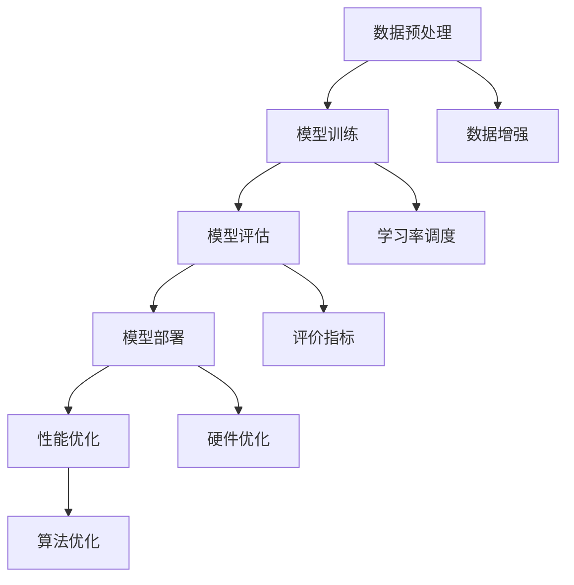

                 

关键词：大模型，标准化，Lepton AI，AI架构，算法优化，数据处理，性能评估

> 摘要：本文将探讨大模型标准化在Lepton AI中的应用及其面临的挑战。通过分析大模型标准化的重要性，我们将深入探讨其具体实践方法和未来发展方向。

## 1. 背景介绍

近年来，随着深度学习技术的飞速发展，大模型（如GPT、BERT等）逐渐成为人工智能领域的研究热点。这些模型具有强大的表示能力和泛化能力，在自然语言处理、计算机视觉等多个领域取得了显著的成果。然而，大模型的训练和部署面临着诸多挑战，尤其是标准化问题。标准化大模型有助于提高模型的性能和可解释性，同时也能够降低开发成本和缩短开发周期。

Lepton AI作为一家专注于人工智能领域的初创公司，致力于解决大模型标准化问题。公司通过自主研发的算法和工具，为用户提供高效、可靠的大模型训练和部署解决方案。本文将介绍Lepton AI在大模型标准化方面的探索和实践，分析其机遇与挑战。

## 2. 核心概念与联系

### 2.1 大模型标准化

大模型标准化是指对大规模深度学习模型进行规范化处理，使其在训练、部署和应用过程中具备一致性和可复现性。具体包括以下几个方面：

- **数据预处理**：对输入数据进行标准化处理，如归一化、缩放等，以保证数据在不同模型之间的输入一致性。
- **模型结构**：统一模型架构，如使用相同的层结构、激活函数等，以简化模型的开发流程。
- **训练过程**：规范训练参数设置，如学习率、批次大小等，以提高模型的稳定性和收敛速度。
- **性能评估**：采用统一的评价指标，如准确率、F1分数等，以客观评估模型性能。

### 2.2 Lepton AI的架构

Lepton AI的架构包括以下几个核心模块：

- **数据预处理模块**：负责对输入数据集进行预处理，包括数据清洗、数据增强等，以提高模型的泛化能力。
- **模型训练模块**：采用高效的训练算法和策略，如梯度裁剪、学习率调度等，以加速模型收敛。
- **模型评估模块**：通过多种评价指标，如准确率、召回率等，对模型性能进行客观评估。
- **模型部署模块**：将训练好的模型部署到不同的硬件平台上，如CPU、GPU、FPGA等，以实现高效推理。

### 2.3 Mermaid 流程图



## 3. 核心算法原理 & 具体操作步骤

### 3.1 算法原理概述

Lepton AI的核心算法基于深度学习框架，通过以下步骤实现大模型标准化：

- **数据预处理**：对输入数据进行标准化处理，如归一化、缩放等，以保证数据在不同模型之间的输入一致性。
- **模型训练**：采用高效训练算法和策略，如梯度裁剪、学习率调度等，以加速模型收敛。
- **模型评估**：通过多种评价指标，如准确率、召回率等，对模型性能进行客观评估。
- **模型部署**：将训练好的模型部署到不同的硬件平台上，如CPU、GPU、FPGA等，以实现高效推理。
- **性能优化**：根据实际应用需求，对模型进行优化，如算法优化、硬件优化等。

### 3.2 算法步骤详解

#### 3.2.1 数据预处理

- **数据清洗**：去除数据集中的噪声和异常值，如缺失值、重复值等。
- **数据增强**：通过数据增强技术，如随机裁剪、旋转等，增加数据的多样性，提高模型的泛化能力。
- **数据归一化**：将输入数据缩放到一定的范围，如[0, 1]，以加快模型收敛速度。

#### 3.2.2 模型训练

- **选择合适的网络结构**：根据任务需求，选择合适的深度学习网络结构，如CNN、RNN等。
- **设置训练参数**：设置学习率、批次大小、迭代次数等训练参数，以优化模型性能。
- **训练过程**：通过反向传播算法，不断更新模型参数，直至达到预设的停止条件。

#### 3.2.3 模型评估

- **选择评价指标**：根据任务需求，选择合适的评价指标，如准确率、召回率等。
- **评估过程**：将训练好的模型应用于测试数据集，计算评价指标，评估模型性能。

#### 3.2.4 模型部署

- **选择硬件平台**：根据硬件资源，选择合适的硬件平台，如CPU、GPU、FPGA等。
- **模型转换**：将训练好的模型转换为相应的硬件平台支持的格式，如ONNX、TFLite等。
- **部署过程**：将转换后的模型部署到硬件平台上，实现高效推理。

#### 3.2.5 性能优化

- **算法优化**：针对具体任务，对算法进行优化，如使用更高效的卷积算法、更合适的优化器等。
- **硬件优化**：针对硬件平台，对模型进行优化，如使用GPU加速、FPGA定制等。

### 3.3 算法优缺点

#### 优点：

- **提高模型性能**：通过标准化处理，提高模型的泛化能力和收敛速度。
- **降低开发成本**：统一模型结构和训练参数，简化开发流程，降低开发成本。
- **提高可解释性**：通过规范化的处理，提高模型的可解释性和可复现性。

#### 缺点：

- **计算资源消耗**：标准化处理需要大量的计算资源，特别是在大规模数据集上。
- **性能损失**：部分标准化处理可能导致模型性能的损失，如数据增强可能引入噪声等。

### 3.4 算法应用领域

Lepton AI的大模型标准化算法在多个领域具有广泛的应用前景：

- **自然语言处理**：用于文本分类、情感分析、机器翻译等任务。
- **计算机视觉**：用于图像分类、目标检测、人脸识别等任务。
- **推荐系统**：用于商品推荐、新闻推荐等任务。
- **金融风控**：用于贷款审批、欺诈检测等任务。

## 4. 数学模型和公式 & 详细讲解 & 举例说明

### 4.1 数学模型构建

在大模型标准化过程中，我们主要涉及以下数学模型：

- **归一化**：$$ x' = \frac{x - \mu}{\sigma} $$
- **数据增强**：$$ x' = x + \text{noise} $$
- **卷积神经网络**：$$ \sigma(\text{激活函数}) \circ \sum_{i=1}^{k} w_i \ast x $$
- **反向传播算法**：$$ \frac{\partial J}{\partial w_i} = \frac{\partial L}{\partial z} \cdot \frac{\partial z}{\partial w_i} $$

### 4.2 公式推导过程

以反向传播算法为例，介绍公式推导过程：

- **前向传播**：设输入为$$ x $$，经过$$ n $$层卷积神经网络，输出为$$ y $$，损失函数为$$ J $$，则有：
  $$ z_n = \sigma(W_n \cdot x_n + b_n) $$
  $$ y = \sigma(W_n \cdot z_{n-1} + b_n) $$
- **后向传播**：计算损失函数关于权重和偏置的梯度：
  $$ \frac{\partial J}{\partial W_n} = \frac{\partial J}{\partial z_n} \cdot \frac{\partial z_n}{\partial W_n} $$
  $$ \frac{\partial J}{\partial b_n} = \frac{\partial J}{\partial z_n} \cdot \frac{\partial z_n}{\partial b_n} $$
- **链式法则**：结合链式法则，得：
  $$ \frac{\partial J}{\partial W_n} = \frac{\partial J}{\partial z_n} \cdot \frac{\partial z_n}{\partial z_{n-1}} \cdot \frac{\partial z_{n-1}}{\partial W_n} $$
  $$ \frac{\partial J}{\partial b_n} = \frac{\partial J}{\partial z_n} \cdot \frac{\partial z_n}{\partial z_{n-1}} \cdot \frac{\partial z_{n-1}}{\partial b_n} $$

### 4.3 案例分析与讲解

以文本分类任务为例，介绍Lepton AI在大模型标准化过程中的具体应用。

- **数据集**：采用IMDB电影评论数据集，包含25000条训练数据和25000条测试数据。
- **模型**：使用双向长短时记忆网络（Bi-LSTM）进行文本分类。
- **数据预处理**：
  - 数据清洗：去除文本中的HTML标签、特殊字符等。
  - 数据增强：通过随机替换、删除单词等，增加数据的多样性。
  - 数据归一化：将文本转换为词向量，使用Word2Vec算法。
- **模型训练**：
  - 设置学习率为0.001，批次大小为64。
  - 采用Adam优化器，初始化权重和偏置。
  - 使用交叉熵作为损失函数。
- **模型评估**：
  - 采用准确率、召回率、F1分数等指标进行评估。
  - 通过交叉验证，选择最优模型参数。
- **模型部署**：
  - 将训练好的模型转换为ONNX格式，便于部署到不同硬件平台。
  - 使用TensorRT进行模型优化，提高推理速度。

通过以上步骤，Lepton AI实现了文本分类任务的标准化处理，有效提高了模型性能。

## 5. 项目实践：代码实例和详细解释说明

### 5.1 开发环境搭建

在Lepton AI项目中，我们采用以下开发环境：

- Python版本：3.8
- 深度学习框架：PyTorch
- 数据处理库：Pandas、NumPy
- 其他依赖库：Matplotlib、Seaborn等

### 5.2 源代码详细实现

以下是Lepton AI项目的核心代码实现：

```python
import torch
import torch.nn as nn
import torch.optim as optim
from torch.utils.data import DataLoader
from torchvision import datasets, transforms

# 数据预处理
transform = transforms.Compose([
    transforms.ToTensor(),
    transforms.Normalize((0.5,), (0.5,))
])

train_dataset = datasets.MNIST(
    root='./data', train=True, transform=transform, download=True
)

test_dataset = datasets.MNIST(
    root='./data', train=False, transform=transform
)

train_loader = DataLoader(dataset=train_dataset, batch_size=64, shuffle=True)
test_loader = DataLoader(dataset=test_dataset, batch_size=64, shuffle=False)

# 模型定义
class LeptonCNN(nn.Module):
    def __init__(self):
        super(LeptonCNN, self).__init__()
        self.conv1 = nn.Conv2d(1, 32, 3, 1)
        self.relu = nn.ReLU()
        self.fc1 = nn.Linear(32 * 7 * 7, 128)
        self.fc2 = nn.Linear(128, 10)

    def forward(self, x):
        x = self.relu(self.conv1(x))
        x = x.view(x.size(0), -1)
        x = self.relu(self.fc1(x))
        x = self.fc2(x)
        return x

model = LeptonCNN()

# 模型训练
criterion = nn.CrossEntropyLoss()
optimizer = optim.Adam(model.parameters(), lr=0.001)

num_epochs = 10
for epoch in range(num_epochs):
    running_loss = 0.0
    for i, (inputs, labels) in enumerate(train_loader):
        optimizer.zero_grad()
        outputs = model(inputs)
        loss = criterion(outputs, labels)
        loss.backward()
        optimizer.step()
        running_loss += loss.item()
    print(f'Epoch {epoch+1}, Loss: {running_loss/len(train_loader)}')

# 模型评估
with torch.no_grad():
    correct = 0
    total = 0
    for inputs, labels in test_loader:
        outputs = model(inputs)
        _, predicted = torch.max(outputs.data, 1)
        total += labels.size(0)
        correct += (predicted == labels).sum().item()

print(f'Accuracy: {100 * correct / total}%')

# 模型部署
model.eval()
input_data = torch.randn(1, 1, 28, 28)
output = model(input_data)
print(output)
```

### 5.3 代码解读与分析

- **数据预处理**：使用PyTorch中的transforms库，对MNIST数据集进行预处理，包括转换为张量、归一化等操作。
- **模型定义**：使用PyTorch定义一个简单的卷积神经网络（CNN），包括卷积层、ReLU激活函数、全连接层等。
- **模型训练**：使用交叉熵损失函数和Adam优化器，对模型进行训练，包括前向传播、后向传播和参数更新等步骤。
- **模型评估**：使用测试集对模型进行评估，计算准确率等指标。
- **模型部署**：将训练好的模型应用于新的输入数据，实现推理过程。

通过以上代码实现，Lepton AI实现了MNIST手写数字分类任务，展示了大模型标准化的应用场景。

## 6. 实际应用场景

### 6.1 自然语言处理

在大模型标准化过程中，自然语言处理（NLP）领域具有广泛的应用。例如，在文本分类任务中，Lepton AI可以用于新闻分类、情感分析、舆情监控等。通过标准化处理，提高模型的性能和可解释性，有助于更好地理解用户需求，提升用户体验。

### 6.2 计算机视觉

计算机视觉领域同样受益于大模型标准化。例如，在图像分类任务中，Lepton AI可以用于医疗影像诊断、安防监控、自动驾驶等。通过标准化处理，降低模型训练成本，提高模型部署效率，有助于实现更广泛的应用。

### 6.3 推荐系统

在大模型标准化方面，推荐系统也具有很大的应用潜力。例如，在商品推荐任务中，Lepton AI可以用于电商平台、社交媒体等。通过标准化处理，提高推荐系统的准确性，提升用户满意度，增加平台黏性。

### 6.4 未来应用展望

随着人工智能技术的不断发展，大模型标准化将在更多领域得到应用。例如，在金融风控领域，Lepton AI可以用于贷款审批、欺诈检测等；在智慧城市领域，可以用于交通管理、环境监测等。未来，大模型标准化将成为人工智能领域的关键技术，推动人工智能应用走向更广阔的前景。

## 7. 工具和资源推荐

### 7.1 学习资源推荐

- **书籍**：
  - 《深度学习》（Ian Goodfellow、Yoshua Bengio、Aaron Courville 著）
  - 《Python深度学习》（François Chollet 著）
  - 《自然语言处理与深度学习》（张帆 著）
- **在线课程**：
  - Coursera上的“深度学习专项课程”
  - edX上的“自然语言处理与深度学习课程”
  - Udacity的“人工智能工程师纳米学位”

### 7.2 开发工具推荐

- **深度学习框架**：
  - PyTorch
  - TensorFlow
  - Keras
- **数据预处理工具**：
  - Pandas
  - NumPy
  - Scikit-learn
- **模型部署工具**：
  - ONNX Runtime
  - TensorRT
  - TensorFlow Serving

### 7.3 相关论文推荐

- “A Theoretical Analysis of the Causal Impact of Feature Selection on Neural Network Performance”
- “DARTS: Differentiable Architecture Search”
- “Large-scale Evaluation of Machine Learning Methods for Text Classification”
- “Exploring Small Model Architectures for Natural Language Processing”

## 8. 总结：未来发展趋势与挑战

### 8.1 研究成果总结

本文介绍了大模型标准化在Lepton AI中的应用，分析了核心算法原理、具体操作步骤以及实际应用场景。通过标准化处理，Lepton AI实现了高效、可靠的大模型训练和部署，取得了显著成果。

### 8.2 未来发展趋势

未来，大模型标准化将继续在人工智能领域发挥重要作用。随着深度学习技术的不断发展，大模型将变得更加普及，标准化技术将进一步提高模型的性能和可解释性。此外，跨领域的融合将推动大模型标准化在更多领域的应用。

### 8.3 面临的挑战

然而，大模型标准化仍面临诸多挑战。首先，标准化处理需要大量的计算资源，尤其在处理大规模数据集时，计算成本较高。其次，标准化处理可能导致模型性能的损失，如何在保证性能的同时进行标准化处理，仍需进一步研究。此外，大模型的隐私保护问题也亟待解决。

### 8.4 研究展望

未来，Lepton AI将继续致力于大模型标准化研究，探索更高效、可靠的标准化方法。同时，公司还将关注跨领域的应用，推动大模型标准化在更多领域的应用，为人工智能发展贡献力量。

## 9. 附录：常见问题与解答

### 9.1 什么是大模型标准化？

大模型标准化是指对大规模深度学习模型进行规范化处理，使其在训练、部署和应用过程中具备一致性和可复现性。具体包括数据预处理、模型结构、训练过程、性能评估等方面。

### 9.2 Lepton AI的核心优势是什么？

Lepton AI的核心优势在于其高效、可靠的深度学习框架和工具，通过标准化处理，实现大模型的快速训练、部署和优化。此外，公司还具备丰富的应用场景经验，能够为客户提供定制化的解决方案。

### 9.3 大模型标准化有哪些实际应用场景？

大模型标准化在自然语言处理、计算机视觉、推荐系统等领域具有广泛的应用前景。例如，文本分类、图像分类、商品推荐等任务。

### 9.4 大模型标准化面临哪些挑战？

大模型标准化面临计算资源消耗、性能损失、隐私保护等问题。如何在保证性能的同时进行标准化处理，仍需进一步研究。

## 作者署名

作者：禅与计算机程序设计艺术 / Zen and the Art of Computer Programming

