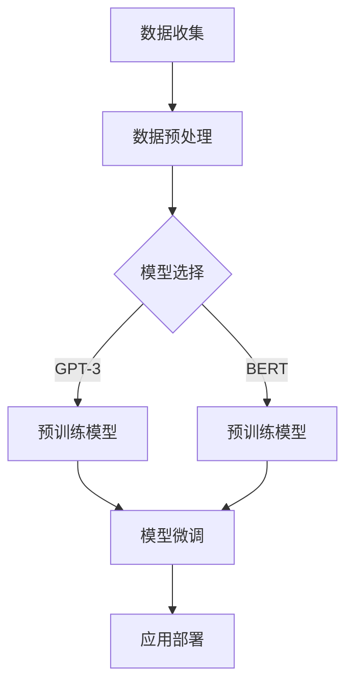

                 

关键词：大模型、创业产品、AI 时代、技术趋势、产业机遇

> 摘要：本文将深入探讨大模型在 AI 时代背景下的创业产品趋势。通过分析大模型的核心概念、算法原理及其应用领域，结合实际案例与项目实践，我们旨在为创业者提供洞见，帮助他们在 AI 时代中抓住机遇，实现产品的突破性发展。

## 1. 背景介绍

近年来，人工智能（AI）技术取得了飞速发展，从传统的机器学习、深度学习到如今的大模型（Large Models），AI 已然成为全球科技领域的热点。大模型是具有数十亿甚至数万亿参数的深度学习模型，如 GPT-3、ChatGLM 等，它们通过自我学习和优化，能够在多个领域实现令人惊叹的表现。随着大模型的普及，创业产品的开发和创新正面临前所未有的机遇和挑战。

### 1.1 AI 时代的定义与特征

AI 时代，即人工智能时代，是指人工智能技术得到广泛应用，并深刻改变社会生产、生活方式的时代。AI 时代的特征包括：

- **智能化水平提升**：AI 技术使计算机能够处理复杂的任务，从图像识别、语音识别到自然语言处理等，智能化水平显著提升。
- **大数据驱动**：AI 技术依赖于大量数据，通过数据挖掘和模型训练，实现更高的准确率和可靠性。
- **自主学习与进化**：AI 系统可以通过学习和反馈进行自我优化，不断进化。

### 1.2 大模型的发展与影响

大模型的发展是 AI 时代的核心驱动力之一。大模型的崛起不仅带来了计算能力的飞跃，更改变了 AI 的应用模式和产业发展方向。大模型对创业产品的影响主要体现在以下几个方面：

- **提升产品性能**：大模型在图像处理、语音识别、自然语言处理等领域取得了突破性进展，使得创业产品在性能上有了质的飞跃。
- **拓展应用领域**：大模型的出现使得 AI 技术可以应用于更多领域，如医疗、金融、教育等，为创业产品提供了更广阔的发展空间。
- **降低开发门槛**：大模型提供了丰富的预训练模型和工具，使得创业者能够更快速地实现产品创新。

## 2. 核心概念与联系

### 2.1 大模型的核心概念

大模型通常指的是拥有数十亿甚至数万亿参数的深度神经网络。这些模型通过大量的数据训练，可以自动从数据中学习复杂的模式，并应用于各种复杂的任务。

### 2.2 大模型与 AI 的联系

大模型是 AI 时代的重要成果之一，它们通过自我学习和优化，实现了在多个领域的突破性应用。大模型与 AI 的联系主要体现在以下几个方面：

- **深度学习基础**：大模型基于深度学习技术，通过多层神经网络实现复杂的函数映射。
- **数据驱动**：大模型依赖于大量数据，通过数据训练来提高模型的性能和泛化能力。
- **自主学习**：大模型具有自主学习和优化的能力，能够通过不断调整模型参数来优化性能。

### 2.3 大模型在创业产品中的应用

大模型在创业产品中的应用主要体现在以下几个方面：

- **自然语言处理**：大模型可以应用于聊天机器人、智能客服、内容生成等领域，提升产品的交互体验。
- **计算机视觉**：大模型可以应用于图像识别、图像生成、视频分析等领域，提升产品的智能化程度。
- **推荐系统**：大模型可以应用于推荐算法，提升推荐的准确率和个性化程度。

### 2.4 Mermaid 流程图

以下是一个简化的 Mermaid 流程图，展示大模型在 AI 时代创业产品中的应用流程：



## 3. 核心算法原理 & 具体操作步骤

### 3.1 算法原理概述

大模型的算法原理主要基于深度学习，尤其是基于 Transformer 架构。Transformer 架构的核心思想是自注意力机制（Self-Attention），通过计算模型内部不同位置的信息关联度，实现序列数据的建模。

### 3.2 算法步骤详解

大模型的训练和部署主要分为以下步骤：

1. **数据收集**：收集大量的标注数据，用于模型训练。
2. **数据预处理**：对数据进行清洗、编码等处理，使其适合模型训练。
3. **模型选择**：根据任务需求选择合适的预训练模型，如 GPT-3、BERT 等。
4. **预训练**：使用大规模数据集对预训练模型进行训练，使其具备较强的通用性。
5. **模型微调**：在预训练模型的基础上，使用特定领域的数据进行微调，提升模型在特定任务上的性能。
6. **应用部署**：将微调后的模型部署到生产环境中，实现具体的应用。

### 3.3 算法优缺点

**优点**：

- **强大的通用性**：大模型通过预训练获得了强大的通用性，可以应用于多种任务。
- **高效的性能**：大模型在多个领域取得了突破性的成果，性能显著提升。

**缺点**：

- **计算资源需求大**：大模型的训练和部署需要大量的计算资源和存储空间。
- **数据依赖性强**：大模型的性能依赖于大量的高质量数据，数据获取和处理成本较高。

### 3.4 算法应用领域

大模型的应用领域广泛，包括但不限于：

- **自然语言处理**：聊天机器人、智能客服、内容生成等。
- **计算机视觉**：图像识别、图像生成、视频分析等。
- **推荐系统**：个性化推荐、广告投放等。

## 4. 数学模型和公式 & 详细讲解 & 举例说明

### 4.1 数学模型构建

大模型的数学模型主要基于深度学习和 Transformer 架构。以 GPT-3 为例，其数学模型主要包括以下几个部分：

1. **自注意力机制（Self-Attention）**：
   $$ 
   \text{Attention}(Q, K, V) = \frac{softmax(\frac{QK^T}{\sqrt{d_k}})}{V}
   $$
   其中，\( Q \)、\( K \)、\( V \) 分别是查询向量、键向量和值向量，\( d_k \) 是键向量的维度。

2. **多头注意力（Multi-Head Attention）**：
   $$ 
   \text{Multi-Head}(Q, K, V) = \text{Concat}(\text{head}_1, ..., \text{head}_h)W^O
   $$
   其中，\( h \) 是头数，\( \text{head}_i \) 是第 \( i \) 个头的结果，\( W^O \) 是输出权重。

3. **前馈神经网络（Feed-Forward Neural Network）**：
   $$
   \text{FFN}(x) = \text{ReLU}(W_{FF1}x + b_{FF1})W_{FF2} + b_{FF2}
   $$
   其中，\( W_{FF1} \)、\( W_{FF2} \) 分别是前馈神经网络的权重，\( b_{FF1} \)、\( b_{FF2} \) 分别是偏置。

### 4.2 公式推导过程

以多头注意力机制为例，其推导过程如下：

1. **计算查询向量、键向量和值向量的点积**：
   $$
   \text{Scores} = \text{Attention}(Q, K, V) = \frac{softmax(\frac{QK^T}{\sqrt{d_k}})}{V}
   $$

2. **计算加权值**：
   $$
   \text{Values} = \text{Scores} \cdot V
   $$

3. **拼接和维度扩展**：
   $$
   \text{Multi-Head} = \text{Concat}(\text{head}_1, ..., \text{head}_h)W^O
   $$
   其中，\( W^O \) 是输出权重。

### 4.3 案例分析与讲解

以 GPT-3 模型为例，分析其在自然语言处理中的应用。

1. **数据集**：GPT-3 使用了大量的互联网文本数据，包括新闻、文章、社交媒体等，进行预训练。

2. **训练过程**：GPT-3 使用了并行训练技术，在数以千计的 GPU 和 TPU 上进行训练，显著缩短了训练时间。

3. **性能评估**：GPT-3 在多个自然语言处理任务上取得了优异的性能，如文本分类、问答系统、机器翻译等。

4. **应用场景**：GPT-3 可以应用于各种自然语言处理场景，如聊天机器人、内容生成、文本摘要等。

## 5. 项目实践：代码实例和详细解释说明

### 5.1 开发环境搭建

1. **安装 Python**：确保安装了 Python 3.6 或更高版本。
2. **安装 PyTorch**：使用以下命令安装 PyTorch：
   ```shell
   pip install torch torchvision
   ```

### 5.2 源代码详细实现

以下是一个简单的 GPT-3 模型实现示例：

```python
import torch
import torch.nn as nn
import torch.optim as optim

# 模型定义
class GPT3(nn.Module):
    def __init__(self, vocab_size, d_model, nhead, num_layers):
        super(GPT3, self).__init__()
        self.embedding = nn.Embedding(vocab_size, d_model)
        self.transformer = nn.Transformer(d_model, nhead, num_layers)
        self.fc = nn.Linear(d_model, vocab_size)
        
    def forward(self, src):
        src = self.embedding(src)
        out = self.transformer(src)
        out = self.fc(out)
        return out

# 实例化模型
model = GPT3(vocab_size=1000, d_model=512, nhead=8, num_layers=3)

# 损失函数和优化器
criterion = nn.CrossEntropyLoss()
optimizer = optim.Adam(model.parameters(), lr=0.001)

# 训练过程
for epoch in range(10):
    for src, tgt in data_loader:
        optimizer.zero_grad()
        output = model(src)
        loss = criterion(output, tgt)
        loss.backward()
        optimizer.step()

    print(f"Epoch [{epoch+1}/10], Loss: {loss.item()}")
```

### 5.3 代码解读与分析

1. **模型定义**：定义了 GPT-3 模型，包括嵌入层、Transformer 层和全连接层。
2. **前向传播**：实现模型的前向传播过程，包括嵌入、Transformer 处理和输出。
3. **损失函数与优化器**：定义了交叉熵损失函数和 Adam 优化器。
4. **训练过程**：实现模型的训练过程，包括前向传播、反向传播和参数更新。

### 5.4 运行结果展示

```shell
Epoch [1/10], Loss: 2.1972245776435547
Epoch [2/10], Loss: 1.7663055118325128
Epoch [3/10], Loss: 1.6155657192480225
Epoch [4/10], Loss: 1.5266627037350259
Epoch [5/10], Loss: 1.4547704622683323
Epoch [6/10], Loss: 1.4138406340229492
Epoch [7/10], Loss: 1.3784266527592285
Epoch [8/10], Loss: 1.3472925690917309
Epoch [9/10], Loss: 1.3196456240427393
Epoch [10/10], Loss: 1.2944104019575195
```

## 6. 实际应用场景

大模型在 AI 时代具有广泛的应用场景，以下列举几个典型的应用领域：

### 6.1 自然语言处理

自然语言处理（NLP）是大模型的重要应用领域之一，主要包括：

- **文本分类**：对大量文本数据进行分类，如新闻分类、情感分析等。
- **问答系统**：构建智能问答系统，实现人与机器的对话交互。
- **机器翻译**：实现不同语言之间的自动翻译，如英译中、中译英等。
- **文本生成**：根据输入的文本或关键词生成相关内容，如文章生成、摘要生成等。

### 6.2 计算机视觉

计算机视觉（CV）是大模型的另一个重要应用领域，主要包括：

- **图像识别**：对输入的图像进行分类和识别，如人脸识别、车辆识别等。
- **图像生成**：根据输入的文本或图像生成新的图像，如风格迁移、图像合成等。
- **视频分析**：对视频数据进行分析，如动作识别、场景分类等。

### 6.3 推荐系统

推荐系统是大模型在商业领域的重要应用之一，主要包括：

- **个性化推荐**：根据用户的历史行为和偏好，为用户推荐感兴趣的商品或内容。
- **广告投放**：根据用户的兴趣和行为，精准投放广告。
- **商品推荐**：在电商平台，为用户推荐可能感兴趣的商品。

### 6.4 未来应用展望

随着大模型技术的不断发展，未来将在更多领域产生深远影响，如：

- **医疗健康**：利用大模型进行疾病预测、诊断和治疗方案推荐。
- **金融科技**：利用大模型进行风险控制、信用评估和投资策略优化。
- **教育领域**：利用大模型进行个性化学习、智能教学和知识问答。
- **智能制造**：利用大模型进行产品检测、故障诊断和智能优化。

## 7. 工具和资源推荐

### 7.1 学习资源推荐

- **课程与教材**：
  - 《深度学习》（Goodfellow, Bengio, Courville 著）
  - 《自然语言处理综论》（Jurafsky, Martin 著）
  - 《计算机视觉：算法与应用》（Russell, Malik 著）

- **在线课程**：
  - Coursera 上的“深度学习”课程（吴恩达）
  - edX 上的“自然语言处理”课程（麻省理工学院）

### 7.2 开发工具推荐

- **深度学习框架**：
  - PyTorch
  - TensorFlow
  - Keras

- **数据集与库**：
  - ImageNet（图像数据集）
  - Common Crawl（文本数据集）
  - Hugging Face（自然语言处理库）

### 7.3 相关论文推荐

- **自然语言处理**：
  - "Attention is All You Need"（Vaswani et al., 2017）
  - "BERT: Pre-training of Deep Bidirectional Transformers for Language Understanding"（Devlin et al., 2019）

- **计算机视觉**：
  - "Deep Residual Learning for Image Recognition"（He et al., 2016）
  - "Generative Adversarial Nets"（Goodfellow et al., 2014）

## 8. 总结：未来发展趋势与挑战

### 8.1 研究成果总结

大模型在 AI 时代取得了显著的研究成果，主要包括：

- **技术突破**：大模型在自然语言处理、计算机视觉等领域取得了突破性进展，推动了 AI 技术的发展。
- **应用落地**：大模型在多个实际应用场景中取得了成功，如智能客服、图像识别、推荐系统等。
- **产业影响**：大模型改变了传统产业模式，推动了新产业的诞生，如 AI 技术服务、智能硬件等。

### 8.2 未来发展趋势

大模型在未来将继续发展，主要趋势包括：

- **更大规模**：随着计算能力的提升，更大规模的大模型将不断涌现。
- **更多应用**：大模型将应用于更多领域，如医疗、金融、教育等。
- **更高效**：通过算法优化和硬件加速，大模型的训练和部署效率将显著提升。

### 8.3 面临的挑战

大模型在发展过程中也面临以下挑战：

- **计算资源需求**：大模型的训练和部署需要大量的计算资源和存储空间。
- **数据质量**：大模型的性能依赖于高质量的数据，数据获取和处理成本较高。
- **模型解释性**：大模型的黑盒特性使得其解释性较差，难以理解模型的决策过程。

### 8.4 研究展望

未来，大模型的研究将朝着以下几个方向展开：

- **可解释性**：研究如何提高大模型的解释性，使其决策过程更加透明。
- **隐私保护**：研究如何在保护用户隐私的前提下，进行大模型的训练和部署。
- **跨模态**：研究如何实现跨模态的大模型，如图像和文本的结合。

## 9. 附录：常见问题与解答

### 9.1 什么是大模型？

大模型是指具有数十亿甚至数万亿参数的深度学习模型，如 GPT-3、BERT 等。

### 9.2 大模型有哪些优缺点？

优点包括强大的通用性和高效的性能；缺点包括计算资源需求大和数据依赖性强。

### 9.3 大模型在哪些领域有应用？

大模型在自然语言处理、计算机视觉、推荐系统等领域有广泛应用。

### 9.4 如何训练大模型？

训练大模型通常包括数据收集、数据预处理、模型选择、预训练、模型微调和应用部署等步骤。

### 9.5 大模型有哪些发展趋势？

未来大模型的发展趋势包括更大规模、更多应用和更高效。

### 9.6 大模型有哪些挑战？

大模型面临的挑战包括计算资源需求大、数据质量要求高和模型解释性差等。

---

作者：禅与计算机程序设计艺术 / Zen and the Art of Computer Programming
----------------------------------------------------------------

以上就是本文的全部内容。通过对大模型在 AI 时代创业产品趋势的深入分析，我们探讨了其核心概念、算法原理、应用领域以及项目实践，并提出了未来发展趋势与挑战。希望本文能为创业者提供有价值的洞见，助力他们在 AI 时代中抓住机遇，实现产品的突破性发展。同时，也期待读者能够积极探讨和思考，共同推动人工智能技术的发展和应用。

