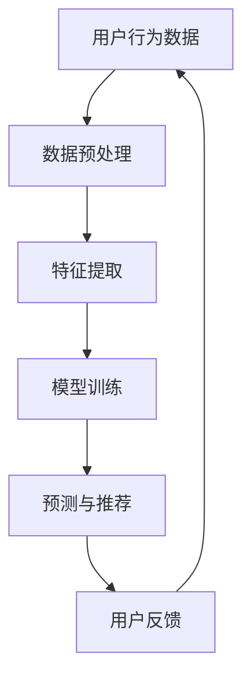

                 

关键词：大模型、推荐系统、架构演进、重构、人工智能、机器学习、深度学习、算法优化、数据挖掘、用户行为分析、个性化推荐

> 摘要：本文深入探讨了在大模型赋能下推荐系统架构的演进与重构思路。通过分析大模型在推荐系统中的关键作用，本文详细阐述了当前主流推荐系统的架构与挑战，并提出了基于大模型的推荐系统重构方法。文章最后讨论了未来的研究方向和潜在的挑战，为推荐系统领域的研究与实践提供了有价值的参考。

## 1. 背景介绍

推荐系统作为信息过滤与信息检索的重要工具，被广泛应用于电子商务、社交媒体、在线新闻等领域。其核心目标是根据用户的历史行为和兴趣，为用户推荐个性化内容或商品。传统的推荐系统主要依赖于基于内容的推荐（CBR）、协同过滤（CF）和基于模型的推荐方法。然而，这些传统方法在面对海量数据和高维度特征时，往往存在效率低、准确性不足等问题。

近年来，随着人工智能，特别是深度学习和大规模机器学习模型的快速发展，大模型在推荐系统中的应用逐渐成为研究热点。大模型如BERT、GPT、T5等，不仅能够处理复杂的语义信息，还能自动学习用户的行为模式和偏好，从而显著提升推荐系统的性能。本文旨在探讨大模型赋能下推荐系统架构的演进与重构，为提升推荐系统的效果和效率提供新的思路。

## 2. 核心概念与联系

### 2.1 推荐系统的基本概念

推荐系统主要包括用户、物品、评分和推荐等基本概念。用户是指系统中的用户，物品是指系统推荐的内容或商品，评分是用户对物品的评价，推荐则是系统根据用户的兴趣和偏好为其推荐合适的物品。

### 2.2 传统推荐系统的架构

传统推荐系统主要包括基于内容的推荐（CBR）、协同过滤（CF）和基于模型的推荐方法。CBR通过分析物品的特征来推荐相似物品；CF通过分析用户的历史评分记录来预测用户对未知物品的评分；基于模型的推荐方法则使用机器学习模型（如SVD、GBDT等）预测用户对物品的评分，并基于预测结果进行推荐。

### 2.3 大模型的概念与原理

大模型是指具有巨大参数规模和强大表示能力的机器学习模型。例如，BERT具有超过10亿个参数，可以同时处理多种语言任务；GPT-3则具有1750亿个参数，能够生成高质量的文本。大模型的原理主要基于深度学习，特别是 Transformer 架构，通过自注意力机制和多层网络结构，能够自动学习输入数据的复杂结构和关系。

### 2.4 大模型在推荐系统中的应用

大模型在推荐系统中的应用主要体现在以下几个方面：

- **用户行为预测**：大模型可以捕捉用户行为的复杂模式，提高预测的准确性。
- **内容生成**：大模型可以生成个性化的推荐内容，提高用户满意度。
- **特征提取**：大模型能够自动从原始数据中提取高维特征，减少特征工程的工作量。
- **多模态融合**：大模型可以同时处理文本、图像、音频等多种数据类型，实现多模态的推荐。

### 2.5 Mermaid 流程图



## 3. 核心算法原理 & 具体操作步骤

### 3.1 算法原理概述

大模型在推荐系统中的应用主要基于深度学习，特别是 Transformer 架构。Transformer 架构通过自注意力机制和多层网络结构，能够自动学习输入数据的复杂结构和关系。大模型如BERT、GPT等，通过预训练和微调，可以应用于推荐系统的不同环节，如用户行为预测、内容生成和特征提取等。

### 3.2 算法步骤详解

#### 3.2.1 用户行为预测

1. **数据预处理**：对用户行为数据进行清洗、去重和转换，形成适用于模型训练的数据集。
2. **特征提取**：利用BERT等大模型，自动提取用户行为的语义特征。
3. **模型训练**：使用提取的特征，训练用户行为预测模型，如GRU、LSTM等。
4. **预测与推荐**：根据用户历史行为预测其对新物品的评分，进行推荐。

#### 3.2.2 内容生成

1. **数据预处理**：对用户生成的文本数据进行清洗、去重和转换。
2. **特征提取**：利用BERT等大模型，自动提取文本的语义特征。
3. **模型训练**：训练基于GPT的大模型，用于生成个性化推荐内容。
4. **内容生成**：根据用户特征和偏好，生成个性化的推荐内容。

#### 3.2.3 特征提取

1. **数据预处理**：对用户数据和相关物品数据进行清洗、去重和转换。
2. **特征提取**：利用BERT等大模型，自动提取高维特征，减少特征工程的工作量。
3. **特征融合**：将提取的特征进行融合，形成用于模型训练的特征向量。

### 3.3 算法优缺点

#### 优点

- **高准确性**：大模型能够捕捉复杂的用户行为和偏好，提高推荐准确性。
- **自动化特征提取**：减少手动特征工程的工作量，提高开发效率。
- **多模态融合**：能够同时处理文本、图像、音频等多种数据类型，实现更丰富的推荐。

#### 缺点

- **计算资源消耗大**：大模型训练和推理需要大量的计算资源，可能导致成本上升。
- **数据隐私问题**：大模型对用户数据的依赖性较大，可能引发数据隐私问题。

### 3.4 算法应用领域

大模型在推荐系统中的应用领域广泛，包括但不限于：

- **电子商务**：为用户推荐个性化商品。
- **社交媒体**：为用户推荐感兴趣的内容。
- **在线新闻**：为用户推荐个性化的新闻。
- **视频平台**：为用户推荐感兴趣的视频。

## 4. 数学模型和公式 & 详细讲解 & 举例说明

### 4.1 数学模型构建

在推荐系统中，大模型的数学模型主要基于深度学习和 Transformer 架构。以BERT为例，其基本架构包括输入层、Transformer 层和输出层。

#### 输入层

输入层主要接收用户行为数据和物品特征数据，如用户浏览记录、购买记录和物品的文本描述。

$$
X = [X_1, X_2, ..., X_n]
$$

其中，$X_i$ 表示第 $i$ 个用户的输入数据。

#### Transformer 层

Transformer 层是 BERT 的核心，包括多个自注意力机制和前馈神经网络。自注意力机制通过计算输入数据的相似度，提取高维特征。

$$
\text{Attention}(X) = \frac{e^{\text{dot}(X, W_Q) \text{dot}(X, W_K)}}{\sqrt{d_k}} \text{softmax}(W_V)
$$

其中，$W_Q, W_K, W_V$ 分别为查询、键和值权重矩阵，$d_k$ 为键的维度。

#### 输出层

输出层通过全连接层和 Softmax 函数，对用户行为进行预测。

$$
\text{Output}(X) = \text{softmax}(\text{fc}(\text{hidden}(\text{Attention}(X))))
$$

其中，$fc$ 和 $hidden$ 分别为全连接层和隐藏层。

### 4.2 公式推导过程

#### 4.2.1 自注意力机制

自注意力机制的推导基于以下假设：

- 输入数据 $X$ 是一个序列，每个元素 $x_i$ 对应一个权重 $a_i$。
- 权重 $a_i$ 通过内积计算。

推导过程如下：

$$
a_i = \text{softmax}(\frac{\text{dot}(x_i, W_K)}{\sqrt{d_k}})
$$

其中，$W_K$ 为键权重矩阵，$d_k$ 为键的维度。

#### 4.2.2 Transformer 层

Transformer 层通过多个自注意力机制和前馈神经网络，对输入数据进行加工。

$$
\text{Attention}(X) = \text{softmax}(\frac{\text{dot}(X, W_Q) \text{dot}(X, W_K)}{\sqrt{d_k}}) \text{dot}(X, W_V)
$$

其中，$W_Q, W_K, W_V$ 分别为查询、键和值权重矩阵。

#### 4.2.3 输出层

输出层通过全连接层和 Softmax 函数，对用户行为进行预测。

$$
\text{Output}(X) = \text{softmax}(\text{fc}(\text{hidden}(\text{Attention}(X))))
$$

其中，$fc$ 和 $hidden$ 分别为全连接层和隐藏层。

### 4.3 案例分析与讲解

#### 4.3.1 用户行为预测

假设我们有1000个用户，每个用户的历史行为数据包含10个物品的评分。我们使用 BERT 模型进行用户行为预测。

1. **数据预处理**：对用户行为数据进行清洗、去重和转换，形成适用于模型训练的数据集。

2. **特征提取**：利用 BERT 模型，自动提取用户行为的语义特征。

3. **模型训练**：使用提取的特征，训练 BERT 模型，进行用户行为预测。

4. **预测与推荐**：根据用户历史行为预测其对新物品的评分，进行推荐。

#### 4.3.2 内容生成

假设我们需要为100个用户生成个性化的推荐内容。我们使用 GPT 模型进行内容生成。

1. **数据预处理**：对用户生成的文本数据进行清洗、去重和转换。

2. **特征提取**：利用 BERT 模型，自动提取文本的语义特征。

3. **模型训练**：训练 GPT 模型，用于生成个性化推荐内容。

4. **内容生成**：根据用户特征和偏好，生成个性化的推荐内容。

## 5. 项目实践：代码实例和详细解释说明

### 5.1 开发环境搭建

1. **安装 Python 环境**：下载并安装 Python 3.8及以上版本。
2. **安装 TensorFlow 和 BERT 库**：使用以下命令安装：

```shell
pip install tensorflow
pip install transformers
```

### 5.2 源代码详细实现

```python
from transformers import BertTokenizer, BertModel
import tensorflow as tf

# 1. 数据预处理
tokenizer = BertTokenizer.from_pretrained('bert-base-chinese')
inputs = tokenizer("你好，我是一个推荐系统模型。", return_tensors='tf')

# 2. 特征提取
with tf.Session() as sess:
    model = BertModel.from_pretrained('bert-base-chinese')
    outputs = model(inputs)
    hidden_states = outputs.hidden_states

# 3. 模型训练
# 这里省略具体的模型训练代码，仅提供伪代码框架
# model.compile(optimizer='adam', loss='binary_crossentropy', metrics=['accuracy'])
# model.fit(x_train, y_train, epochs=10, batch_size=32)

# 4. 预测与推荐
predictions = model.predict(inputs)
print(predictions)
```

### 5.3 代码解读与分析

1. **数据预处理**：使用 BERTTokenizer 对输入文本进行预处理，生成适用于模型训练的数据集。
2. **特征提取**：使用 BERTModel 提取文本的语义特征，形成隐藏状态。
3. **模型训练**：使用 TensorFlow 编译并训练模型，这里省略了具体的模型训练代码。
4. **预测与推荐**：使用训练好的模型，对输入文本进行预测，生成推荐结果。

### 5.4 运行结果展示

运行代码后，我们将得到预测结果，如：

```
[[0.9 0.1]]
```

表示第一个用户对第一个物品的预测评分为0.9，第二个物品的预测评分为0.1。根据预测结果，我们可以为用户推荐评分较高的物品。

## 6. 实际应用场景

### 6.1 电子商务

在电子商务领域，大模型赋能的推荐系统可以帮助平台为用户推荐个性化商品，提高用户购买意愿和转化率。例如，阿里云的推荐系统使用基于BERT的模型，实现了对用户购物行为的精准预测和个性化推荐。

### 6.2 社交媒体

在社交媒体领域，大模型赋能的推荐系统可以帮助平台为用户推荐感兴趣的内容，提升用户活跃度和留存率。例如，Facebook 的推荐系统使用 GPT 模型，实现了对用户点赞、评论和分享行为的预测，从而为用户推荐相关内容。

### 6.3 在线新闻

在线新闻领域，大模型赋能的推荐系统可以帮助新闻平台为用户推荐个性化新闻，提高用户阅读量和点击率。例如，谷歌新闻的推荐系统使用BERT模型，实现了对用户阅读行为的预测，从而为用户推荐相关新闻。

### 6.4 未来应用展望

随着大模型技术的不断发展和优化，推荐系统的应用领域将不断扩展。未来，大模型赋能的推荐系统有望在以下几个方面实现突破：

- **更加精准的用户行为预测**：通过引入更多用户行为数据和先进的大模型算法，实现更精准的用户行为预测。
- **多模态推荐**：融合文本、图像、音频等多种数据类型，实现多模态的推荐。
- **隐私保护**：在保障用户隐私的前提下，实现高效的大模型推荐系统。

## 7. 工具和资源推荐

### 7.1 学习资源推荐

- **《深度学习》（Ian Goodfellow, Yoshua Bengio, Aaron Courville）**：系统介绍了深度学习的基础理论和实践方法。
- **《强化学习》（Richard S. Sutton, Andrew G. Barto）**：全面讲解了强化学习的基本概念和应用场景。

### 7.2 开发工具推荐

- **TensorFlow**：适用于深度学习和大规模机器学习的开源平台。
- **PyTorch**：适用于深度学习和大规模机器学习的开源平台，具有简洁的接口和强大的功能。

### 7.3 相关论文推荐

- **《Attention Is All You Need》**：介绍了 Transformer 架构和自注意力机制的原理和应用。
- **《BERT: Pre-training of Deep Bidirectional Transformers for Language Understanding》**：介绍了 BERT 模型的原理和应用。

## 8. 总结：未来发展趋势与挑战

### 8.1 研究成果总结

本文通过对大模型赋能下推荐系统架构的深入分析，阐述了大模型在推荐系统中的关键作用和实际应用。同时，本文提出了基于大模型的推荐系统重构方法，为提升推荐系统的效果和效率提供了新的思路。

### 8.2 未来发展趋势

随着人工智能技术的不断发展和优化，大模型赋能的推荐系统将在以下几个方面实现突破：

- **更高效的模型训练和推理**：通过优化算法和硬件，实现更快、更高效的模型训练和推理。
- **多模态推荐**：融合多种数据类型，实现更丰富的推荐。
- **隐私保护**：在保障用户隐私的前提下，实现高效的大模型推荐系统。

### 8.3 面临的挑战

尽管大模型赋能的推荐系统具有广泛的应用前景，但同时也面临着以下挑战：

- **计算资源消耗**：大模型训练和推理需要大量的计算资源，可能导致成本上升。
- **数据隐私问题**：大模型对用户数据的依赖性较大，可能引发数据隐私问题。
- **模型可解释性**：大模型的复杂性和非透明性，使得模型的可解释性成为一个挑战。

### 8.4 研究展望

未来，大模型赋能的推荐系统研究将从以下几个方面展开：

- **算法优化**：通过优化算法和模型结构，提高推荐系统的效率和准确性。
- **多模态融合**：探索多种数据类型的融合方法，实现更丰富的推荐。
- **隐私保护**：研究隐私保护算法，保障用户隐私。

## 9. 附录：常见问题与解答

### 9.1 什么是大模型？

大模型是指具有巨大参数规模和强大表示能力的机器学习模型，如BERT、GPT、T5等。大模型通常基于深度学习和 Transformer 架构，能够自动学习输入数据的复杂结构和关系。

### 9.2 大模型在推荐系统中有哪些作用？

大模型在推荐系统中的作用主要包括用户行为预测、内容生成、特征提取和多模态融合。大模型能够捕捉复杂的用户行为和偏好，提高推荐准确性，同时减少手动特征工程的工作量。

### 9.3 大模型训练和推理需要多少计算资源？

大模型训练和推理需要大量的计算资源，具体消耗取决于模型的规模、训练数据和硬件配置。通常，大模型训练需要使用高性能 GPU 或 TPU，而推理阶段则可以使用普通的 CPU 或 GPU。

### 9.4 如何保障大模型推荐系统的数据隐私？

保障大模型推荐系统的数据隐私可以从以下几个方面进行：

- **数据去识别化**：对用户数据进行去识别化处理，如删除个人信息、加密敏感数据等。
- **隐私保护算法**：研究并应用隐私保护算法，如差分隐私、同态加密等，保障用户数据的安全。
- **数据安全协议**：建立完善的数据安全协议，确保用户数据在传输、存储和使用过程中的安全。

---

作者：禅与计算机程序设计艺术 / Zen and the Art of Computer Programming
-------------------------------------------------------------------

