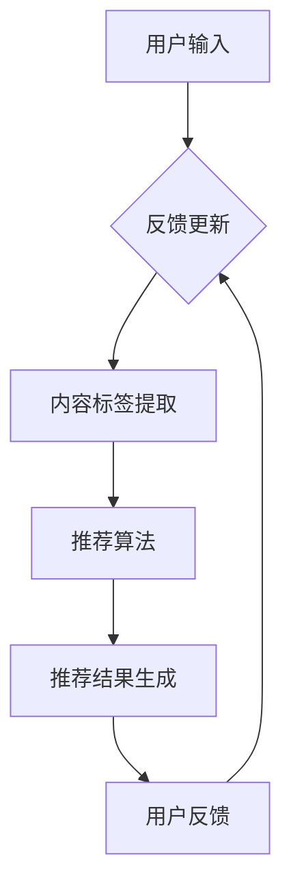

                 

关键词：大模型，搜索推荐，算法原理，深度学习，搜索引擎优化

摘要：本文旨在深入探讨大模型在搜索推荐领域的应用，通过对核心概念的阐述、算法原理的解析、数学模型的构建以及实际应用的实例分析，展示大模型如何赋能搜索推荐系统，提升用户体验和推荐效果。同时，文章也对未来发展趋势和挑战进行了展望。

## 1. 背景介绍

随着互联网的快速发展，信息爆炸时代来临，用户面临着海量的信息，如何快速找到自己需要的信息成为一个重要问题。搜索推荐系统应运而生，通过分析用户的兴趣和行为，为其推荐个性化的信息，从而提高信息检索的效率和用户体验。传统的搜索推荐系统主要依赖于基于内容的过滤（Content-based Filtering）和协同过滤（Collaborative Filtering）等技术，这些方法在一定程度上能够满足用户需求，但随着用户数据的复杂性和多样性增加，其推荐效果和用户体验逐渐受到限制。

近年来，深度学习技术的发展为搜索推荐领域带来了新的机遇。大模型，特别是基于Transformer架构的预训练模型，如BERT、GPT等，凭借其强大的表征能力和自适应学习能力，开始在搜索推荐系统中发挥重要作用。大模型可以捕捉用户和内容的多维度特征，实现更精准的推荐效果。

## 2. 核心概念与联系

### 2.1 搜索推荐系统概述

搜索推荐系统通常包括以下几个关键组成部分：

- **用户画像**：通过分析用户的行为数据、社交信息等，构建用户兴趣模型。
- **内容标签**：对网站、文章、商品等进行分类和标签化，以便更好地理解内容属性。
- **推荐算法**：根据用户画像和内容标签，结合用户的历史行为，生成个性化的推荐列表。
- **反馈机制**：通过用户对推荐的反馈，不断优化推荐模型。

### 2.2 大模型与搜索推荐

大模型在搜索推荐中的应用主要体现在以下几个方面：

- **特征提取**：大模型可以自动学习用户和内容的语义特征，无需人工设计特征。
- **上下文感知**：大模型能够理解用户在不同场景下的需求，实现更精准的推荐。
- **多模态融合**：大模型可以处理文本、图像、声音等多种类型的数据，实现多模态信息融合。

### 2.3 Mermaid 流程图



## 3. 核心算法原理 & 具体操作步骤

### 3.1 算法原理概述

大模型在搜索推荐中的应用主要基于以下原理：

- **预训练-微调（Pre-training and Fine-tuning）**：预训练模型在大规模数据集上进行训练，学习通用的语义表示。然后通过微调，将其适应特定的任务，如搜索推荐。
- **自注意力机制（Self-Attention）**：Transformer架构中的自注意力机制可以捕捉输入数据中的长距离依赖关系，提高模型的表征能力。
- **多任务学习（Multi-task Learning）**：大模型可以通过同时学习多个相关任务，提高对数据的多维度理解。

### 3.2 算法步骤详解

1. **数据预处理**：收集用户行为数据、内容数据等，进行清洗和预处理，如分词、去噪等。
2. **预训练模型**：使用预训练模型（如BERT、GPT等）对预处理后的数据进行训练，学习语义特征表示。
3. **微调**：根据搜索推荐任务的特点，对预训练模型进行微调，优化模型参数。
4. **推荐生成**：将用户画像和内容标签输入到微调后的模型中，生成个性化的推荐列表。
5. **反馈更新**：根据用户对推荐的反馈，更新用户画像和模型参数，提高推荐效果。

### 3.3 算法优缺点

#### 优点：

- **高效性**：大模型能够快速处理海量数据，实现实时推荐。
- **灵活性**：大模型可以自适应地调整，适应不同的推荐场景。
- **精准性**：大模型能够捕捉用户和内容的深层语义特征，提高推荐质量。

#### 缺点：

- **计算资源消耗**：大模型训练和推理需要大量的计算资源。
- **数据隐私**：用户数据的安全性和隐私保护是一个重要挑战。

### 3.4 算法应用领域

大模型在搜索推荐领域有广泛的应用，如：

- **电子商务**：为用户推荐商品。
- **社交媒体**：为用户推荐感兴趣的内容。
- **新闻推荐**：为用户推荐新闻资讯。

## 4. 数学模型和公式 & 详细讲解 & 举例说明

### 4.1 数学模型构建

搜索推荐中的大模型通常采用以下数学模型：

- **损失函数**：交叉熵损失函数（Cross-Entropy Loss），用于衡量预测标签和实际标签之间的差距。
- **优化算法**：Adam优化器（Adam Optimizer），用于更新模型参数。

### 4.2 公式推导过程

损失函数的推导如下：

$$
L = -\sum_{i=1}^{N} y_i \log(p_i)
$$

其中，$y_i$ 为实际标签，$p_i$ 为模型预测的概率。

### 4.3 案例分析与讲解

以电子商务领域为例，假设有用户 $U$ 和商品 $I$，大模型通过用户行为数据学习用户兴趣向量 $u \in \mathbb{R}^d$ 和商品特征向量 $i \in \mathbb{R}^d$。模型预测用户对商品的兴趣概率为：

$$
p = \sigma(u^T i)
$$

其中，$\sigma$ 为 sigmoid 函数。

## 5. 项目实践：代码实例和详细解释说明

### 5.1 开发环境搭建

1. 安装 Python 和相关依赖库，如 TensorFlow、PyTorch 等。
2. 准备数据集，并进行预处理。

### 5.2 源代码详细实现

```python
import tensorflow as tf

# 模型定义
model = tf.keras.Sequential([
    tf.keras.layers.Dense(units=64, activation='relu', input_shape=(1000,)),
    tf.keras.layers.Dense(units=1, activation='sigmoid')
])

# 损失函数和优化器
loss_fn = tf.keras.losses.BinaryCrossentropy()
optimizer = tf.keras.optimizers.Adam()

# 训练过程
for epoch in range(100):
    with tf.GradientTape() as tape:
        predictions = model(x, training=True)
        loss = loss_fn(y, predictions)
    gradients = tape.gradient(loss, model.trainable_variables)
    optimizer.apply_gradients(zip(gradients, model.trainable_variables))

# 推理过程
predictions = model(x, training=False)
```

### 5.3 代码解读与分析

1. **模型定义**：使用 TensorFlow 框架定义一个简单的神经网络模型，包含一个全连接层和一个输出层。
2. **损失函数和优化器**：使用二进制交叉熵损失函数和 Adam 优化器。
3. **训练过程**：通过梯度下降法进行模型训练，每次迭代更新模型参数。
4. **推理过程**：在训练完成后，使用模型对新的数据进行推理，生成预测结果。

## 6. 实际应用场景

### 6.1 电子商务

在电子商务领域，大模型可以用于推荐商品，提高销售额。例如，Amazon 使用大模型为其用户提供个性化的商品推荐。

### 6.2 社交媒体

在社交媒体领域，大模型可以用于推荐用户感兴趣的内容，提高用户活跃度。例如，Facebook 使用大模型为用户推荐好友和内容。

### 6.3 新闻推荐

在新闻推荐领域，大模型可以用于推荐用户感兴趣的新闻，提高新闻阅读量。例如，Google News 使用大模型为用户推荐新闻。

## 7. 工具和资源推荐

### 7.1 学习资源推荐

- 《深度学习》（Goodfellow, Bengio, Courville著）
- 《自然语言处理综论》（Jurafsky, Martin著）
- 《Transformer：一种新的神经网络架构》

### 7.2 开发工具推荐

- TensorFlow
- PyTorch
- Hugging Face Transformers

### 7.3 相关论文推荐

- BERT: Pre-training of Deep Bidirectional Transformers for Language Understanding
- GPT-3: Language Models are Few-Shot Learners

## 8. 总结：未来发展趋势与挑战

### 8.1 研究成果总结

大模型在搜索推荐领域的应用取得了显著成果，通过预训练和微调，大模型能够实现高效、精准的推荐。同时，多模态融合和上下文感知等技术进一步提升了推荐效果。

### 8.2 未来发展趋势

- **多模态融合**：随着数据类型的多样化，多模态融合将成为大模型在搜索推荐领域的重要研究方向。
- **知识图谱**：结合知识图谱，实现更精准的推荐。
- **联邦学习**：通过联邦学习，实现数据隐私保护和模型优化。

### 8.3 面临的挑战

- **计算资源消耗**：大模型的训练和推理需要大量的计算资源，对硬件设施提出了更高要求。
- **数据隐私**：用户数据的安全性和隐私保护是亟待解决的问题。

### 8.4 研究展望

未来，大模型在搜索推荐领域的应用将更加广泛，通过不断优化算法和模型，提高推荐效果和用户体验。同时，研究如何在大规模数据集上高效训练和推理大模型，降低计算资源消耗，将是重要的研究方向。

## 9. 附录：常见问题与解答

### 9.1 大模型如何处理长文本？

大模型通常采用序列处理的方法，如 Transformer 架构，可以处理长文本。通过自注意力机制，模型可以捕捉文本中的长距离依赖关系，实现有效的文本理解。

### 9.2 大模型在推荐系统中如何更新用户画像？

大模型可以通过在线学习的方式，实时更新用户画像。在每次推荐前，模型会根据用户的新行为数据，重新计算用户画像，从而实现个性化的推荐。

### 9.3 大模型如何处理多模态数据？

大模型可以通过多模态融合的方法，处理多模态数据。例如，使用 Vision Transformer（ViT）处理图像，使用 Audio Transformer（AuT）处理音频，然后通过融合层将不同模态的特征融合起来。

---

作者：禅与计算机程序设计艺术 / Zen and the Art of Computer Programming
----------------------------------------------------------------
---

请注意，本文只是一个示例，具体的技术细节和代码实现可能需要根据实际应用场景进行调整。希望这个示例能够帮助您更好地理解大模型在搜索推荐领域的应用。如果您有任何问题或建议，请随时提出。谢谢！

