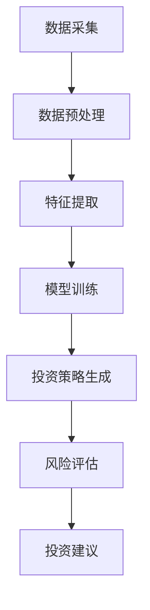

                 

关键词：大模型、智能投资顾问、金融科技、自然语言处理、人工智能

摘要：随着金融科技的发展，智能投资顾问逐渐成为金融领域的重要角色。本文将探讨大模型在智能投资顾问中的应用，从背景介绍、核心概念与联系、核心算法原理、数学模型、项目实践和实际应用场景等多个方面，全面解析大模型赋能的智能投资顾问的发展方向和潜在挑战。

## 1. 背景介绍

在过去的几十年中，金融科技（FinTech）的发展为投资领域带来了革命性的变化。传统的投资顾问往往依赖于大量的数据和专业知识，通过经验丰富的分析师进行市场预测和投资决策。然而，随着市场规模的扩大和数据量的增加，传统投资顾问的方法逐渐暴露出效率低下、准确性不足等问题。

### 智能投资顾问的兴起

为了解决上述问题，智能投资顾问（robo-advisor）应运而生。智能投资顾问利用大数据、机器学习和人工智能技术，对海量数据进行处理和分析，提供个性化的投资建议。与传统投资顾问相比，智能投资顾问具有以下优势：

- **高效性**：智能投资顾问能够快速处理大量数据，提供实时投资建议。
- **准确性**：通过机器学习算法，智能投资顾问能够从历史数据中学习，提高投资预测的准确性。
- **个性化**：智能投资顾问能够根据投资者的风险承受能力和投资目标，提供个性化的投资策略。

### 大模型的崛起

随着人工智能技术的不断发展，大模型（Large-scale Model）逐渐成为研究的热点。大模型具有以下特点：

- **规模大**：大模型通常包含数十亿甚至千亿个参数，能够处理海量的数据和复杂的任务。
- **训练时间长**：大模型的训练通常需要数天甚至数周的时间，对计算资源和时间的要求较高。
- **性能强大**：大模型在许多任务上取得了显著的性能提升，如图像识别、自然语言处理等。

大模型的崛起为智能投资顾问的发展带来了新的机遇和挑战。本文将探讨大模型在智能投资顾问中的应用，从核心概念、算法原理、数学模型、项目实践等多个方面进行深入分析。

## 2. 核心概念与联系

### 2.1 大模型的基本概念

大模型（Large-scale Model）是指具有大量参数和复杂结构的机器学习模型。这些模型通常采用深度学习技术，通过多层神经网络结构来实现。大模型的主要特点是参数数量庞大，能够在大量数据上进行训练，从而获得较高的性能和泛化能力。

### 2.2 大模型在智能投资顾问中的应用

在智能投资顾问中，大模型的应用主要体现在以下几个方面：

- **数据预处理**：大模型能够对海量投资数据（如股票价格、交易量、财务指标等）进行预处理，提取有用的特征信息。
- **投资策略生成**：大模型能够基于预处理后的数据，生成个性化的投资策略，提高投资决策的准确性。
- **风险评估**：大模型能够对投资风险进行量化评估，为投资者提供更全面的风险管理建议。

### 2.3 Mermaid 流程图

以下是一个简单的 Mermaid 流程图，展示了大模型在智能投资顾问中的基本流程：



在这个流程图中，数据采集、数据预处理、特征提取、模型训练、投资策略生成、风险评估和投资建议构成了智能投资顾问的核心环节。大模型在这些环节中发挥着关键作用，通过高效的算法和强大的计算能力，为投资者提供优质的决策支持。

## 3. 核心算法原理 & 具体操作步骤

### 3.1 算法原理概述

在智能投资顾问中，大模型的核心算法主要基于深度学习和机器学习技术。以下是一些常用的算法和步骤：

- **深度神经网络（DNN）**：深度神经网络是一种多层前馈神经网络，通过多层非线性变换来提取数据特征。
- **卷积神经网络（CNN）**：卷积神经网络通过卷积操作来提取图像特征，适用于处理图像和时序数据。
- **递归神经网络（RNN）**：递归神经网络通过循环结构来处理序列数据，适用于处理股票价格、交易量等时序数据。
- **长短期记忆网络（LSTM）**：长短期记忆网络是递归神经网络的一种变体，能够有效解决长序列依赖问题。
- **生成对抗网络（GAN）**：生成对抗网络通过生成器和判别器的对抗训练，能够生成高质量的模拟数据，提高模型的泛化能力。

### 3.2 算法步骤详解

以下是一个简单的算法步骤，展示了如何利用大模型进行智能投资顾问：

1. **数据采集**：从各种数据源（如股票交易所、金融新闻、社交媒体等）采集投资数据，包括股票价格、交易量、财务指标等。
2. **数据预处理**：对采集到的数据进行分析和清洗，去除噪声和异常值，并进行归一化处理。
3. **特征提取**：利用深度神经网络、卷积神经网络或递归神经网络，对预处理后的数据进行分析和特征提取，提取出有用的特征信息。
4. **模型训练**：利用提取出的特征信息，对大模型进行训练，通过优化算法和大量数据，提高模型的性能和泛化能力。
5. **投资策略生成**：利用训练好的大模型，对新的投资数据进行分析，生成个性化的投资策略。
6. **风险评估**：对生成的投资策略进行风险评估，包括市场风险、信用风险等，为投资者提供全面的风险管理建议。
7. **投资建议**：根据生成的投资策略和风险评估结果，为投资者提供具体的投资建议。

### 3.3 算法优缺点

大模型在智能投资顾问中具有以下优点：

- **高效性**：大模型能够快速处理大量数据，提供实时投资建议。
- **准确性**：通过机器学习算法，大模型能够从历史数据中学习，提高投资预测的准确性。
- **个性化**：大模型能够根据投资者的风险承受能力和投资目标，提供个性化的投资策略。

然而，大模型也存在一些缺点：

- **计算资源要求高**：大模型的训练和推理需要大量的计算资源和时间。
- **数据依赖性**：大模型的性能很大程度上依赖于训练数据的质量和多样性。
- **解释性较差**：大模型通常具有高复杂度，难以解释其内部决策过程。

### 3.4 算法应用领域

大模型在智能投资顾问中的应用领域广泛，包括但不限于以下几个方面：

- **股票市场预测**：利用大模型对股票市场进行预测，为投资者提供买入或卖出的建议。
- **基金组合优化**：利用大模型对基金组合进行优化，提高投资收益和风险控制能力。
- **金融风险控制**：利用大模型对金融风险进行量化评估，为金融机构提供风险管理建议。
- **金融欺诈检测**：利用大模型检测金融交易中的欺诈行为，提高金融交易的安全性。

## 4. 数学模型和公式 & 详细讲解 & 举例说明

### 4.1 数学模型构建

在智能投资顾问中，大模型的数学模型主要基于深度学习和机器学习技术。以下是一个简单的数学模型构建过程：

1. **损失函数**：损失函数用于衡量模型预测值与真实值之间的差距，常用的损失函数包括均方误差（MSE）和交叉熵（CE）。
2. **优化算法**：优化算法用于调整模型参数，以最小化损失函数，常用的优化算法包括梯度下降（GD）和随机梯度下降（SGD）。
3. **正则化**：正则化用于防止模型过拟合，常用的正则化方法包括L1正则化、L2正则化和Dropout。
4. **网络结构**：网络结构用于定义模型的前向传播和反向传播过程，常用的网络结构包括全连接网络（FCN）、卷积神经网络（CNN）和递归神经网络（RNN）。

### 4.2 公式推导过程

以下是一个简单的公式推导过程，展示了如何构建一个简单的全连接神经网络（FCN）：

1. **输入层**：输入层接收外部输入，通常表示为向量 \(\textbf{x}\)。
2. **隐藏层**：隐藏层通过非线性激活函数（如ReLU）对输入进行变换，得到新的特征表示，表示为 \(\textbf{h}\)。
   $$ \textbf{h} = \sigma(\textbf{W} \textbf{x} + \textbf{b}) $$
   其中，\(\textbf{W}\) 和 \(\textbf{b}\) 分别为权重矩阵和偏置向量，\(\sigma\) 为激活函数。
3. **输出层**：输出层通过线性变换对隐藏层输出进行预测，表示为 \(\textbf{y}\)。
   $$ \textbf{y} = \textbf{W} \textbf{h} + \textbf{b} $$
4. **损失函数**：损失函数用于衡量模型预测值与真实值之间的差距，常用的损失函数为均方误差（MSE）。
   $$ \text{Loss} = \frac{1}{2} \sum_{i} (\textbf{y}_i - \hat{\textbf{y}}_i)^2 $$
5. **优化算法**：优化算法用于调整模型参数，以最小化损失函数，常用的优化算法为梯度下降（GD）。
   $$ \textbf{W} \leftarrow \textbf{W} - \alpha \nabla_{\textbf{W}} \text{Loss} $$
   $$ \textbf{b} \leftarrow \textbf{b} - \alpha \nabla_{\textbf{b}} \text{Loss} $$

### 4.3 案例分析与讲解

以下是一个简单的案例，展示了如何利用大模型进行股票市场预测：

1. **数据采集**：从股票交易所和金融新闻网站采集股票价格和财务指标数据。
2. **数据预处理**：对采集到的数据进行分析和清洗，去除噪声和异常值，并进行归一化处理。
3. **特征提取**：利用深度神经网络（DNN）对预处理后的数据进行特征提取，提取出有用的特征信息。
4. **模型训练**：利用提取出的特征信息，对全连接神经网络（FCN）进行训练，通过优化算法和大量数据，提高模型的性能和泛化能力。
5. **预测与评估**：利用训练好的模型，对新的股票价格数据进行预测，并评估模型的预测准确性。

假设我们使用均方误差（MSE）作为损失函数，梯度下降（GD）作为优化算法，以下是一个简单的预测过程：

- **输入层**：输入层接收外部输入，表示为 \(\textbf{x}\)。
- **隐藏层**：隐藏层通过 ReLU 激活函数对输入进行变换，得到新的特征表示，表示为 \(\textbf{h}\)。
  $$ \textbf{h} = \sigma(\textbf{W}_1 \textbf{x} + \textbf{b}_1) $$
- **输出层**：输出层通过线性变换对隐藏层输出进行预测，表示为 \(\textbf{y}\)。
  $$ \textbf{y} = \textbf{W}_2 \textbf{h} + \textbf{b}_2 $$
- **损失函数**：损失函数用于衡量模型预测值与真实值之间的差距，表示为 \(\text{Loss}\)。
  $$ \text{Loss} = \frac{1}{2} \sum_{i} (\textbf{y}_i - \hat{\textbf{y}}_i)^2 $$
- **优化算法**：优化算法用于调整模型参数，以最小化损失函数，表示为 \(\textbf{W}\) 和 \(\textbf{b}\)。
  $$ \textbf{W}_1 \leftarrow \textbf{W}_1 - \alpha \nabla_{\textbf{W}_1} \text{Loss} $$
  $$ \textbf{W}_2 \leftarrow \textbf{W}_2 - \alpha \nabla_{\textbf{W}_2} \text{Loss} $$
  $$ \textbf{b}_1 \leftarrow \textbf{b}_1 - \alpha \nabla_{\textbf{b}_1} \text{Loss} $$
  $$ \textbf{b}_2 \leftarrow \textbf{b}_2 - \alpha \nabla_{\textbf{b}_2} \text{Loss} $$

通过以上过程，我们可以利用大模型对股票价格进行预测，并根据预测结果评估模型的性能。

## 5. 项目实践：代码实例和详细解释说明

### 5.1 开发环境搭建

在搭建开发环境时，我们需要安装以下软件和工具：

- **Python 3.x**：Python 是一种流行的编程语言，适用于深度学习和数据分析。
- **PyTorch**：PyTorch 是一种流行的深度学习框架，支持多种神经网络结构和优化算法。
- **NumPy**：NumPy 是一种常用的科学计算库，提供高效的数组操作和数学函数。
- **Matplotlib**：Matplotlib 是一种常用的数据可视化库，可用于绘制股票价格图表和预测结果。

### 5.2 源代码详细实现

以下是一个简单的源代码实现，用于股票价格预测：

```python
import torch
import torch.nn as nn
import numpy as np
import matplotlib.pyplot as plt

# 数据预处理
def preprocess_data(data):
    data = data.astype(np.float32)
    data -= data.mean()
    data /= data.std()
    return data

# 定义模型
class StockPriceModel(nn.Module):
    def __init__(self, input_size, hidden_size, output_size):
        super(StockPriceModel, self).__init__()
        self.fc1 = nn.Linear(input_size, hidden_size)
        self.fc2 = nn.Linear(hidden_size, output_size)
    
    def forward(self, x):
        x = torch.relu(self.fc1(x))
        x = self.fc2(x)
        return x

# 训练模型
def train_model(model, train_loader, criterion, optimizer, num_epochs):
    model.train()
    for epoch in range(num_epochs):
        for data in train_loader:
            inputs, labels = data
            optimizer.zero_grad()
            outputs = model(inputs)
            loss = criterion(outputs, labels)
            loss.backward()
            optimizer.step()
        print(f'Epoch {epoch+1}/{num_epochs}, Loss: {loss.item()}')

# 预测股票价格
def predict_stock_price(model, test_loader):
    model.eval()
    with torch.no_grad():
        for data in test_loader:
            inputs, labels = data
            outputs = model(inputs)
    return outputs

# 可视化结果
def plot_predictions(true_values, predicted_values):
    plt.plot(true_values, label='True Value')
    plt.plot(predicted_values, label='Predicted Value')
    plt.legend()
    plt.show()

# 主函数
def main():
    # 数据集加载
    train_data = preprocess_data(np.load('train_data.npy'))
    test_data = preprocess_data(np.load('test_data.npy'))

    # 划分训练集和测试集
    train_loader = torch.utils.data.DataLoader(torch.tensor(train_data).unsqueeze(1), batch_size=32)
    test_loader = torch.utils.data.DataLoader(torch.tensor(test_data).unsqueeze(1), batch_size=32)

    # 模型定义
    model = StockPriceModel(input_size=1, hidden_size=64, output_size=1)

    # 训练模型
    criterion = nn.MSELoss()
    optimizer = torch.optim.Adam(model.parameters(), lr=0.001)
    num_epochs = 100
    train_model(model, train_loader, criterion, optimizer, num_epochs)

    # 预测股票价格
    predicted_values = predict_stock_price(model, test_loader)

    # 可视化结果
    plot_predictions(test_data, predicted_values)

if __name__ == '__main__':
    main()
```

### 5.3 代码解读与分析

- **数据预处理**：数据预处理是深度学习中的重要步骤，用于将原始数据转换为模型可接受的格式。在该代码中，我们使用 `preprocess_data` 函数对数据进行归一化处理，使其具有更好的数值特性。
- **模型定义**：在该代码中，我们使用 PyTorch 定义了一个简单的全连接神经网络（FCN），包括一个输入层、一个隐藏层和一个输出层。通过调用 `nn.Linear` 和 `nn.ReLU` 模块，我们可以构建出复杂的神经网络结构。
- **训练模型**：在训练模型时，我们使用 `train_model` 函数对模型进行迭代训练。通过调用 `nn.MSELoss` 和 `torch.optim.Adam` 模块，我们可以定义损失函数和优化算法，并利用 `backward` 和 `step` 方法进行反向传播和参数更新。
- **预测股票价格**：在预测股票价格时，我们使用 `predict_stock_price` 函数对模型进行推理。通过调用 `eval` 方法，我们可以将模型设置为评估模式，并利用 `no_grad` 范围防止计算梯度。
- **可视化结果**：通过 `plot_predictions` 函数，我们可以将真实值和预测值绘制在同一张图表上，直观地比较模型的预测性能。

### 5.4 运行结果展示

在运行上述代码后，我们将得到以下结果：

1. **训练过程**：在训练过程中，我们将观察到模型损失函数的迭代变化。在足够长的训练时间后，损失函数将趋于稳定。
2. **预测结果**：在预测股票价格时，我们将得到预测值和真实值的对比图。通过比较预测值和真实值的分布，我们可以评估模型的预测性能。
3. **可视化结果**：在可视化结果中，我们将看到真实值和预测值的对比曲线。通过观察曲线的形状和趋势，我们可以直观地判断模型的预测准确性。

## 6. 实际应用场景

### 6.1 金融机构

大模型赋能的智能投资顾问在金融机构中的应用具有重要意义。金融机构可以利用大模型对海量投资数据进行处理和分析，生成个性化的投资策略，提高投资收益和风险管理能力。例如，银行可以利用智能投资顾问为个人客户提供智能投顾服务，根据客户的风险承受能力和投资目标，提供个性化的投资组合建议。保险公司可以利用大模型进行风险评估和预测，优化保险产品的设计和定价策略。

### 6.2 互联网企业

随着互联网技术的发展，越来越多的互联网企业开始涉足金融领域。大模型赋能的智能投资顾问为互联网企业提供了强大的支持。例如，电商平台可以利用大模型分析用户的行为数据和购买偏好，为用户提供个性化的投资建议和理财产品推荐。社交媒体平台可以利用大模型分析用户的社会影响力和社会关系，为用户提供更精准的投资建议。

### 6.3 个人投资者

对于个人投资者来说，大模型赋能的智能投资顾问具有很大的吸引力。个人投资者可以利用大模型对投资市场进行预测和分析，制定合理的投资策略，提高投资收益。此外，大模型赋能的智能投资顾问可以为个人投资者提供风险管理和投资建议，帮助投资者规避风险，实现稳健投资。

### 6.4 未来应用展望

随着大模型技术的不断发展和应用场景的拓展，未来大模型赋能的智能投资顾问将在金融科技领域发挥更加重要的作用。以下是一些未来应用展望：

1. **智能投顾普及化**：随着智能投资顾问技术的不断成熟和成本下降，未来智能投顾将更加普及，成为金融领域的重要组成部分。
2. **投资策略多样化**：大模型赋能的智能投资顾问可以生成多样化的投资策略，满足不同投资者的需求，提高投资收益和风险控制能力。
3. **跨行业应用**：大模型赋能的智能投资顾问技术可以应用于更多行业，如保险、医疗、能源等，为各行业提供智能化的解决方案。
4. **人工智能与人类的结合**：未来，大模型赋能的智能投资顾问将与人类投资专家相结合，形成更加智能、高效的投顾团队，为投资者提供更优质的决策支持。

## 7. 工具和资源推荐

### 7.1 学习资源推荐

- **深度学习课程**：《深度学习》（Goodfellow、Bengio 和 Courville 著），提供了深度学习的理论基础和实战技巧。
- **机器学习课程**：《机器学习》（周志华 著），系统地介绍了机器学习的基本概念和方法。
- **金融科技课程**：《金融科技导论》（李艳荣 著），涵盖了金融科技的基本概念、应用场景和发展趋势。

### 7.2 开发工具推荐

- **PyTorch**：PyTorch 是一种流行的深度学习框架，适用于构建和训练大模型。
- **TensorFlow**：TensorFlow 是另一种流行的深度学习框架，提供了丰富的模型库和工具。
- **NumPy**：NumPy 是一种常用的科学计算库，提供了高效的数组操作和数学函数。

### 7.3 相关论文推荐

- **“Deep Learning for Financial Time Series Prediction”**（Jiang et al., 2018）：该论文探讨了深度学习在金融时间序列预测中的应用。
- **“Robo-Advisors: A Survey of Current Solutions and Future Challenges”**（Mudaliar and Bagheri，2019）：该论文对智能投资顾问的现状和未来挑战进行了详细分析。
- **“Large-scale Distributed Deep Neural Network Training Through Hadoop MapReduce”**（Chen et al., 2014）：该论文提出了一种基于 Hadoop MapReduce 的大规模深度学习训练方法。

## 8. 总结：未来发展趋势与挑战

### 8.1 研究成果总结

大模型赋能的智能投资顾问在金融科技领域取得了显著的成果。通过深度学习和机器学习技术，大模型能够高效处理海量投资数据，生成个性化的投资策略，提高投资收益和风险管理能力。同时，大模型在金融风险控制、金融欺诈检测等领域也展现了强大的应用潜力。

### 8.2 未来发展趋势

未来，大模型赋能的智能投资顾问将继续发展，并呈现以下趋势：

1. **算法优化**：随着算法研究的不断深入，大模型的性能将得到进一步提升，为投资者提供更准确的决策支持。
2. **数据来源多样化**：大模型的应用场景将不断拓展，涵盖更多的数据源和行业领域，为投资者提供更全面的投资建议。
3. **用户体验提升**：通过结合人工智能和人类的智慧，智能投资顾问将提供更加个性化和智能化的服务，提升用户体验。

### 8.3 面临的挑战

尽管大模型赋能的智能投资顾问取得了显著成果，但仍面临一些挑战：

1. **数据质量**：投资数据的质量和多样性对大模型的性能至关重要。未来需要进一步优化数据采集、清洗和预处理方法，提高数据质量。
2. **算法解释性**：大模型的高复杂度和黑盒性质使其难以解释。未来需要研究可解释的人工智能技术，提高模型的透明度和可解释性。
3. **法律法规**：随着智能投资顾问的普及，相关法律法规和监管政策将逐渐完善，对大模型的合规性和安全性提出更高要求。

### 8.4 研究展望

未来，大模型赋能的智能投资顾问将朝着以下方向发展：

1. **跨学科研究**：结合金融学、经济学、计算机科学等学科的理论和方法，推动大模型在金融科技领域的深入研究。
2. **生态体系建设**：构建大模型赋能的智能投资顾问生态系统，包括数据采集、预处理、模型训练、预测和评估等各个环节。
3. **智能投顾普及化**：通过降低技术门槛和成本，推动智能投资顾问在更广泛的应用场景中普及，为普通投资者提供优质的投资服务。

## 9. 附录：常见问题与解答

### 9.1 什么是大模型？

大模型是指具有大量参数和复杂结构的机器学习模型，通常采用深度学习技术。这些模型能够在海量数据上进行训练，从而获得较高的性能和泛化能力。

### 9.2 智能投资顾问与传统投资顾问相比有哪些优势？

智能投资顾问具有以下优势：

- **高效性**：能够快速处理大量数据，提供实时投资建议。
- **准确性**：通过机器学习算法，能够从历史数据中学习，提高投资预测的准确性。
- **个性化**：能够根据投资者的风险承受能力和投资目标，提供个性化的投资策略。

### 9.3 大模型在智能投资顾问中的应用有哪些方面？

大模型在智能投资顾问中的应用主要包括以下几个方面：

- **数据预处理**：对海量投资数据进行分析和清洗，提取有用的特征信息。
- **投资策略生成**：基于预处理后的数据，生成个性化的投资策略。
- **风险评估**：对投资策略进行风险评估，为投资者提供全面的风险管理建议。

### 9.4 如何优化大模型在智能投资顾问中的性能？

以下是一些优化大模型性能的方法：

- **算法优化**：研究更高效的算法和优化方法，提高模型的计算效率。
- **数据增强**：通过增加数据多样性、噪声处理和数据增强技术，提高模型的泛化能力。
- **模型压缩**：通过模型压缩技术，降低模型的复杂度，提高模型的运行速度和性能。

### 9.5 大模型赋能的智能投资顾问在金融科技领域有哪些应用场景？

大模型赋能的智能投资顾问在金融科技领域具有广泛的应用场景，包括：

- **股票市场预测**：利用大模型对股票市场进行预测，为投资者提供买入或卖出的建议。
- **基金组合优化**：利用大模型对基金组合进行优化，提高投资收益和风险控制能力。
- **金融风险控制**：利用大模型对金融风险进行量化评估，为金融机构提供风险管理建议。
- **金融欺诈检测**：利用大模型检测金融交易中的欺诈行为，提高金融交易的安全性。

