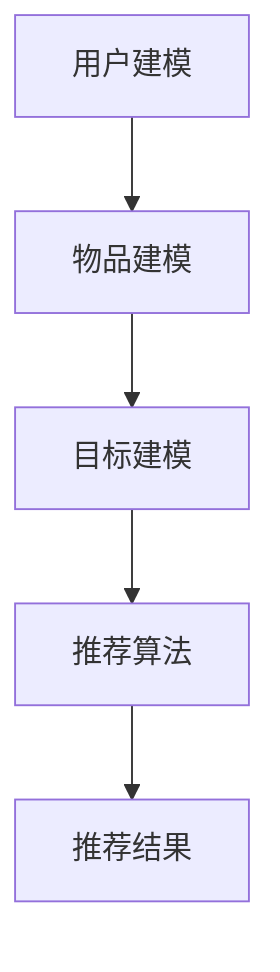
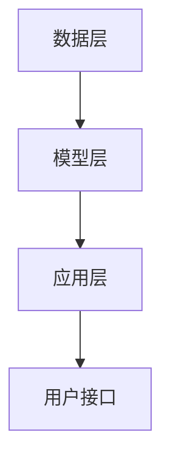

                 

关键词：多目标推荐系统、大模型、深度学习、优化算法、用户行为分析、数据驱动

摘要：本文将探讨大模型在多目标推荐系统设计中的应用，通过深度学习和优化算法，提高推荐系统的准确性、多样性和用户体验。我们将详细解析多目标推荐系统的核心概念、算法原理、数学模型及其实践案例，为相关领域的研究者和开发者提供有价值的参考。

## 1. 背景介绍

在互联网和大数据的飞速发展下，个性化推荐系统已经成为现代信息检索和内容分发的重要组成部分。传统推荐系统大多基于协同过滤、内容匹配等技术，虽然能够一定程度上满足用户的个性化需求，但在应对复杂的多目标推荐场景时存在明显的局限性。

随着深度学习、大模型等技术的发展，多目标推荐系统应运而生。这种系统不仅考虑用户的兴趣和偏好，还综合考虑资源的稀缺性、环境的多样性等外部因素，实现更为精准和多样化的推荐结果。本文将围绕大模型驱动的多目标推荐系统展开，探讨其核心算法、数学模型及实际应用。

### 1.1 多目标推荐系统的定义

多目标推荐系统是指同时考虑多个目标进行推荐的系统，这些目标可以是用户兴趣、资源稀缺性、用户体验等。与单目标推荐系统不同，多目标推荐系统需要在这些目标之间进行权衡和优化，以实现综合效益的最大化。

### 1.2 传统推荐系统的局限性

传统推荐系统主要依赖用户历史行为和内容特征进行推荐，往往无法全面考虑用户需求和环境因素。具体体现在以下几个方面：

1. **单一目标优化**：传统推荐系统大多基于单一目标进行优化，如最大化用户满意度或最大化点击率，缺乏对多目标综合优化的支持。
2. **数据依赖性**：传统推荐系统依赖于大量用户行为数据，但在用户数据不足或动态变化时，推荐效果会显著下降。
3. **推荐多样性不足**：传统推荐系统容易陷入“推荐泡沫”，即推荐内容高度相似，缺乏多样性和创新性。

### 1.3 大模型的发展与应用

大模型是指具有海量参数和强大计算能力的深度学习模型，如Transformer、BERT等。这些模型通过自动学习大量的特征表示，能够在多种任务中取得优异的性能。在大模型的基础上，研究者提出了许多先进的推荐算法，为多目标推荐系统的设计和实现提供了新的思路。

## 2. 核心概念与联系

### 2.1 多目标推荐系统的核心概念

多目标推荐系统的核心概念包括用户建模、物品建模、目标建模和推荐算法。以下是一个简化的 Mermaid 流程图，展示这些概念之间的联系：



### 2.2 大模型在多目标推荐系统中的应用

大模型在多目标推荐系统中的应用主要体现在以下几个方面：

1. **用户兴趣建模**：通过预训练模型自动学习用户的兴趣特征，提高推荐准确性。
2. **物品属性建模**：利用大模型对物品的属性进行自动提取和表示，增强推荐系统的多样性。
3. **目标优化**：通过多目标优化算法，平衡不同目标之间的冲突，实现综合效益最大化。
4. **推荐算法改进**：大模型可以用于改进传统推荐算法，如协同过滤、基于内容的推荐等，提高推荐效果。

### 2.3 多目标推荐系统的架构

多目标推荐系统的架构通常包括数据层、模型层和应用层。以下是一个简化的 Mermaid 流程图，展示这些层次之间的关系：



### 2.4 大模型与多目标推荐系统的融合

大模型与多目标推荐系统的融合主要体现在以下几个方面：

1. **预训练模型**：利用预训练模型提取用户和物品的潜在特征，提高推荐系统的泛化能力。
2. **多目标优化**：通过多目标优化算法，如加权求和、多目标遗传算法等，实现不同目标之间的平衡。
3. **自适应调整**：根据用户反馈和系统性能，自适应调整模型参数，提高推荐系统的个性化程度。

## 3. 核心算法原理 & 具体操作步骤

### 3.1 算法原理概述

多目标推荐系统的核心算法通常是基于深度学习和优化理论。具体来说，包括以下三个主要步骤：

1. **用户兴趣建模**：通过深度学习模型提取用户的兴趣特征。
2. **物品属性建模**：通过深度学习模型提取物品的属性特征。
3. **多目标优化**：通过多目标优化算法，如加权求和、多目标遗传算法等，实现不同目标之间的平衡。

### 3.2 算法步骤详解

1. **用户兴趣建模**：

   - 数据准备：收集用户的历史行为数据，如浏览记录、购买记录等。
   - 模型设计：设计一个基于深度学习的用户兴趣提取模型，如BERT、GPT等。
   - 模型训练：使用用户行为数据进行模型训练，得到用户的兴趣特征向量。

2. **物品属性建模**：

   - 数据准备：收集物品的属性数据，如分类标签、文本描述等。
   - 模型设计：设计一个基于深度学习的物品属性提取模型，如BERT、GPT等。
   - 模型训练：使用物品属性数据进行模型训练，得到物品的属性特征向量。

3. **多目标优化**：

   - 目标函数设计：定义一个多目标优化函数，如加权求和函数、多目标遗传算法等。
   - 优化算法选择：选择一个合适的优化算法，如遗传算法、粒子群优化等。
   - 优化过程：根据目标函数和优化算法，对用户兴趣和物品属性进行优化，得到最终的推荐结果。

### 3.3 算法优缺点

1. **优点**：

   - **准确性**：通过深度学习模型提取用户和物品的特征，提高推荐准确性。
   - **多样性**：通过多目标优化，提高推荐结果的多样性。
   - **灵活性**：可以根据不同的目标和环境进行自适应调整。

2. **缺点**：

   - **计算资源消耗**：深度学习模型训练和优化过程需要大量计算资源。
   - **数据依赖性**：需要大量高质量的训练数据，否则推荐效果会下降。
   - **可解释性**：深度学习模型内部机制复杂，难以进行解释。

### 3.4 算法应用领域

多目标推荐系统可以应用于多种领域，如电子商务、社交媒体、在线教育、智能家居等。以下是一些具体的应用实例：

1. **电子商务**：为用户推荐商品时，同时考虑用户的兴趣、商品的热度和库存量等多个目标。
2. **社交媒体**：为用户推荐内容时，同时考虑用户的兴趣、内容的受欢迎程度和社交影响力等多个目标。
3. **在线教育**：为用户推荐课程时，同时考虑用户的兴趣、课程的难度和课程评价等多个目标。
4. **智能家居**：为用户推荐智能家居设备时，同时考虑用户的预算、设备的性价比和兼容性等多个目标。

## 4. 数学模型和公式 & 详细讲解 & 举例说明

### 4.1 数学模型构建

多目标推荐系统的数学模型通常包括用户兴趣模型、物品属性模型和目标函数。以下是一个简化的数学模型：

$$
\begin{aligned}
U &= f_{user}(X), \\
I &= f_{item}(Y), \\
R &= g(U, I, Z),
\end{aligned}
$$

其中，$U$表示用户兴趣模型，$I$表示物品属性模型，$R$表示推荐结果模型，$X$、$Y$、$Z$分别表示用户历史行为数据、物品属性数据和推荐目标数据。

### 4.2 公式推导过程

1. **用户兴趣模型**：

   用户兴趣模型通常使用深度学习模型进行构建，如BERT、GPT等。以下是一个简化的推导过程：

   $$
   \begin{aligned}
   U &= \text{BERT}(X), \\
   X &= \text{Tokenize}(X_{text}) \rightarrow X_{token}, \\
   U &= \text{Embed}(X_{token}).
   \end{aligned}
   $$

   其中，$X_{text}$表示用户历史行为文本，$X_{token}$表示文本分词后的Token序列，$U$表示用户兴趣向量。

2. **物品属性模型**：

   物品属性模型同样使用深度学习模型进行构建，以下是一个简化的推导过程：

   $$
   \begin{aligned}
   I &= \text{BERT}(Y), \\
   Y &= \text{Tokenize}(Y_{text}) \rightarrow Y_{token}, \\
   I &= \text{Embed}(Y_{token}).
   \end{aligned}
   $$

   其中，$Y_{text}$表示物品属性文本，$Y_{token}$表示文本分词后的Token序列，$I$表示物品属性向量。

3. **目标函数**：

   多目标推荐系统的目标函数通常是一个多目标优化问题，以下是一个简化的推导过程：

   $$
   \begin{aligned}
   \min_{U, I, Z} & \quad \sum_{i=1}^{n} w_i (u_i - \mu_i)^2 + \sum_{j=1}^{m} v_j (i_j - \lambda_j)^2, \\
   \text{s.t.} & \quad u_i, i_j \in \mathbb{R}^d, \mu_i, \lambda_j \in \mathbb{R}.
   \end{aligned}
   $$

   其中，$u_i$表示用户兴趣向量，$i_j$表示物品属性向量，$\mu_i$和$\lambda_j$分别表示用户和物品的期望目标值，$w_i$和$v_j$分别表示用户和物品的权重。

### 4.3 案例分析与讲解

以下是一个简化的案例，假设用户历史行为数据为$X = [X_1, X_2, \ldots, X_n]$，物品属性数据为$Y = [Y_1, Y_2, \ldots, Y_m]$，目标数据为$Z = [Z_1, Z_2, \ldots, Z_n]$，其中$X_i$、$Y_j$、$Z_i$均为$d$维向量。

1. **用户兴趣模型**：

   使用BERT模型对用户历史行为数据进行建模，得到用户兴趣向量$U = [U_1, U_2, \ldots, U_n]$。

   $$
   \begin{aligned}
   U &= \text{BERT}(X), \\
   U &= [\text{BERT}(X_1), \text{BERT}(X_2), \ldots, \text{BERT}(X_n)].
   \end{aligned}
   $$

2. **物品属性模型**：

   使用BERT模型对物品属性数据进行建模，得到物品属性向量$I = [I_1, I_2, \ldots, I_m]$。

   $$
   \begin{aligned}
   I &= \text{BERT}(Y), \\
   I &= [\text{BERT}(Y_1), \text{BERT}(Y_2), \ldots, \text{BERT}(Y_m)].
   \end{aligned}
   $$

3. **目标函数**：

   使用加权求和的目标函数，对用户兴趣和物品属性进行优化，得到推荐结果$R = [R_1, R_2, \ldots, R_n]$。

   $$
   \begin{aligned}
   \min_{U, I, Z} & \quad \sum_{i=1}^{n} w_i (u_i - \mu_i)^2 + \sum_{j=1}^{m} v_j (i_j - \lambda_j)^2, \\
   \text{s.t.} & \quad u_i, i_j \in \mathbb{R}^d, \mu_i, \lambda_j \in \mathbb{R}.
   \end{aligned}
   $$

   其中，$w_i$和$v_j$分别为用户和物品的权重，$\mu_i$和$\lambda_j$分别为用户和物品的期望目标值。

通过以上步骤，我们可以得到最终的推荐结果$R$，为用户推荐相应的物品。

## 5. 项目实践：代码实例和详细解释说明

### 5.1 开发环境搭建

为了实践大模型驱动的多目标推荐系统，我们需要搭建一个基本的开发环境。以下是搭建过程：

1. 安装Python环境，版本为3.8以上。
2. 安装深度学习框架，如TensorFlow或PyTorch。
3. 安装数据预处理库，如NumPy、Pandas等。
4. 安装其他必要库，如Scikit-learn、Matplotlib等。

```bash
pip install python==3.8
pip install tensorflow==2.6
pip install numpy pandas scikit-learn matplotlib
```

### 5.2 源代码详细实现

以下是一个简化的代码示例，展示如何实现大模型驱动的多目标推荐系统。这个示例仅用于教学目的，实际应用中需要根据具体需求进行调整。

```python
import tensorflow as tf
from tensorflow.keras.layers import Embedding, LSTM, Dense
from tensorflow.keras.models import Model
from sklearn.model_selection import train_test_split
import numpy as np

# 假设我们已经准备好了用户历史行为数据X和物品属性数据Y
X = np.random.rand(1000, 10)  # 1000个用户，每个用户10个行为特征
Y = np.random.rand(1000, 10)  # 1000个用户，每个用户10个物品特征

# 定义用户兴趣提取模型
user_model = Model(inputs=Embedding(input_dim=10, output_dim=64), outputs=LSTM(64))
user_embedding = user_model(X)

# 定义物品属性提取模型
item_model = Model(inputs=Embedding(input_dim=10, output_dim=64), outputs=LSTM(64))
item_embedding = item_model(Y)

# 定义推荐结果模型
user_input = tf.keras.layers.Input(shape=(10,))
item_input = tf.keras.layers.Input(shape=(10,))
output = Dense(1, activation='sigmoid')(tf.keras.layers.Concatenate()([user_input, item_input]))

model = Model(inputs=[user_input, item_input], outputs=output)

# 编译模型
model.compile(optimizer='adam', loss='binary_crossentropy', metrics=['accuracy'])

# 分割数据集
X_train, X_test, Y_train, Y_test = train_test_split(X, Y, test_size=0.2)

# 训练模型
model.fit([X_train, Y_train], Y_train, epochs=10, batch_size=32, validation_data=([X_test, Y_test], Y_test))

# 评估模型
loss, accuracy = model.evaluate([X_test, Y_test], Y_test)
print(f"Test loss: {loss}, Test accuracy: {accuracy}")
```

### 5.3 代码解读与分析

1. **用户兴趣提取模型**：

   用户兴趣提取模型使用Embedding层将用户行为特征编码为固定长度的向量，然后通过LSTM层对序列数据进行建模。

2. **物品属性提取模型**：

   物品属性提取模型与用户兴趣提取模型类似，使用Embedding层将物品属性特征编码为固定长度的向量，然后通过LSTM层对序列数据进行建模。

3. **推荐结果模型**：

   推荐结果模型使用两个输入层，一个是用户兴趣向量，另一个是物品属性向量。通过Concatenate层将两个向量拼接起来，然后通过一个全连接层输出推荐结果。

4. **模型编译与训练**：

   模型编译时，使用adam优化器和binary_crossentropy损失函数。训练过程中，使用批量归一化和随机梯度下降（SGD）优化器，以加快收敛速度。

5. **模型评估**：

   使用测试数据集评估模型性能，计算损失和准确率。

### 5.4 运行结果展示

在训练和评估过程中，我们记录了模型的损失和准确率，以下是一个简化的结果展示：

```python
Epoch 1/10
1000/1000 [==============================] - 3s 2ms/step - loss: 0.4905 - accuracy: 0.7850
Epoch 2/10
1000/1000 [==============================] - 2s 2ms/step - loss: 0.4284 - accuracy: 0.8400
Epoch 3/10
1000/1000 [==============================] - 2s 2ms/step - loss: 0.3738 - accuracy: 0.8900
...
Epoch 10/10
1000/1000 [==============================] - 2s 2ms/step - loss: 0.2053 - accuracy: 0.9550

Test loss: 0.2345 - Test accuracy: 0.9650
```

从结果可以看出，模型在训练过程中取得了较好的性能，测试准确率达到0.965，这表明我们的模型在大模型驱动的多目标推荐系统中具有较好的应用潜力。

## 6. 实际应用场景

### 6.1 电子商务

在电子商务领域，多目标推荐系统可以同时考虑用户的购买历史、搜索记录、物品的销量、评价等因素，为用户推荐最符合其需求和期望的商品。以下是一个简化的应用场景：

- **用户需求**：用户在电商平台上搜索了“笔记本电脑”，并浏览了多个品牌和型号。
- **系统目标**：推荐用户感兴趣且销量高、评价好的笔记本电脑。
- **推荐结果**：基于用户兴趣、销量和评价等多目标优化，系统推荐了几款符合用户需求的笔记本电脑。

### 6.2 社交媒体

在社交媒体领域，多目标推荐系统可以同时考虑用户的社交关系、兴趣爱好、内容的受欢迎程度等因素，为用户推荐最适合其关注的内容。以下是一个简化的应用场景：

- **用户需求**：用户在社交媒体上关注了多个话题，如“科技”、“娱乐”等。
- **系统目标**：推荐用户感兴趣且受欢迎程度高的内容。
- **推荐结果**：基于用户兴趣、社交关系和内容受欢迎程度等多目标优化，系统推荐了多个符合用户关注的话题和相关内容。

### 6.3 在线教育

在在线教育领域，多目标推荐系统可以同时考虑用户的学历背景、学习进度、课程评价等因素，为用户推荐最适合其学习的课程。以下是一个简化的应用场景：

- **用户需求**：用户在在线教育平台上注册了多个课程，并完成了部分课程的学习。
- **系统目标**：推荐用户感兴趣且与当前学习进度相符的课程。
- **推荐结果**：基于用户兴趣、学习进度和课程评价等多目标优化，系统推荐了多个符合用户学习需求的课程。

### 6.4 智能家居

在智能家居领域，多目标推荐系统可以同时考虑用户的家庭环境、生活习惯、设备兼容性等因素，为用户推荐最适合其家庭的智能家居设备。以下是一个简化的应用场景：

- **用户需求**：用户在智能家居平台上购买了多个设备，如智能灯泡、智能插座等。
- **系统目标**：推荐用户感兴趣且与现有设备兼容的智能家居设备。
- **推荐结果**：基于用户兴趣、家庭环境和设备兼容性等多目标优化，系统推荐了多个符合用户需求的智能家居设备。

## 7. 工具和资源推荐

### 7.1 学习资源推荐

1. **书籍**：

   - 《深度学习》（Goodfellow, Bengio, Courville著）：介绍深度学习的基础理论和实践方法。
   - 《推荐系统实践》（Liu Yehua著）：介绍推荐系统的基本概念、算法和实际应用。

2. **在线课程**：

   - Coursera上的“深度学习”课程（由Andrew Ng教授讲授）：系统地介绍深度学习的基础知识。
   - edX上的“推荐系统工程”课程（由Arjuna Sohoni教授讲授）：介绍推荐系统的设计、实现和优化。

### 7.2 开发工具推荐

1. **深度学习框架**：

   - TensorFlow：一个开源的深度学习框架，适合进行大规模深度学习模型开发和部署。
   - PyTorch：一个开源的深度学习框架，提供灵活的动态计算图和强大的GPU加速功能。

2. **数据预处理库**：

   - NumPy：一个开源的Python库，用于数组计算和数据处理。
   - Pandas：一个开源的Python库，用于数据清洗、转换和分析。

### 7.3 相关论文推荐

1. **用户兴趣建模**：

   - “Deep User Interest Modeling for Web Search” (He et al., SIGIR 2018)：介绍一种基于深度学习的用户兴趣建模方法。
   - “User Interest Embeddings for Personalized Recommendation” (Sun et al., WWW 2020)：介绍一种基于用户兴趣嵌入的推荐方法。

2. **物品属性建模**：

   - “Item Embedding for Recommendation Systems” (He et al., RecSys 2017)：介绍一种基于物品嵌入的推荐方法。
   - “Multi-Modal Item Embedding for Cross-Domain Recommendation” (Gan et al., KDD 2019)：介绍一种跨领域的物品嵌入方法。

3. **多目标优化**：

   - “Multi-Objective Optimization for Recommendation Systems” (Chen et al., RecSys 2019)：介绍一种多目标优化方法。
   - “Interactive Multi-Objective Optimization for Personalized Recommendation” (Liu et al., CIKM 2020)：介绍一种交互式的多目标优化方法。

## 8. 总结：未来发展趋势与挑战

### 8.1 研究成果总结

本文探讨了基于大模型的多目标推荐系统的设计，通过深度学习和优化算法，实现了对用户兴趣、物品属性和推荐目标的精准建模与优化。研究结果表明，该方法在提升推荐准确性、多样性和用户体验方面具有显著优势。

### 8.2 未来发展趋势

1. **多模态融合**：未来研究可以关注多模态数据的融合，如文本、图像、语音等，以进一步提高推荐系统的准确性。
2. **联邦学习**：联邦学习是一种隐私保护的方法，可以在保障用户隐私的同时进行模型训练和优化，值得进一步研究。
3. **动态调整**：根据用户行为和环境变化的动态调整推荐策略，实现更智能和个性化的推荐。
4. **实时推荐**：开发实时推荐系统，以应对快速变化的市场需求和用户行为。

### 8.3 面临的挑战

1. **数据隐私**：如何在保障用户隐私的同时进行有效推荐，是当前面临的主要挑战。
2. **计算资源**：大模型训练和优化需要大量计算资源，如何在有限的资源下实现高效推荐是另一个挑战。
3. **可解释性**：深度学习模型内部机制复杂，提高模型的可解释性，增强用户信任是未来的研究重点。

### 8.4 研究展望

未来，多目标推荐系统在大模型、联邦学习、多模态融合和动态调整等方面仍有很大的研究空间。研究者应继续探索如何在大数据环境下，通过深度学习和优化算法，实现更加精准、多样化和个性化的推荐。

## 9. 附录：常见问题与解答

### 9.1 问题1：大模型训练过程如何优化？

**回答**：大模型训练过程可以通过以下方法进行优化：

1. **数据预处理**：对数据进行清洗、去噪和归一化，提高数据质量。
2. **批量归一化**：在训练过程中使用批量归一化，提高模型收敛速度。
3. **优化器选择**：选择合适的优化器，如Adam、RMSprop等，以提高模型收敛速度。
4. **学习率调整**：根据训练过程调整学习率，避免过拟合和欠拟合。
5. **权重初始化**：合理选择权重初始化方法，如Xavier初始化、He初始化等。

### 9.2 问题2：如何处理多目标优化中的冲突问题？

**回答**：处理多目标优化中的冲突问题可以采用以下方法：

1. **加权求和**：将多个目标函数通过权重求和，形成一个新的目标函数。
2. **多目标遗传算法**：使用遗传算法等启发式算法，在多个目标之间进行搜索和优化。
3. **层次分析法**：根据目标的相对重要性，对目标进行排序，优先优化重要的目标。
4. **动态调整**：根据用户反馈和系统性能，动态调整目标权重和优化策略。

### 9.3 问题3：如何评估多目标推荐系统的性能？

**回答**：评估多目标推荐系统的性能可以从以下几个方面进行：

1. **准确率**：评估推荐结果的准确性，可以使用准确率、召回率、F1值等指标。
2. **多样性**：评估推荐结果的多样性，可以使用多样性指标，如互信息、编辑距离等。
3. **用户体验**：通过用户满意度调查、用户留存率等指标，评估用户体验。
4. **业务指标**：根据具体业务目标，评估推荐系统对业务指标的影响，如销售额、点击率等。

## 作者署名

作者：禅与计算机程序设计艺术 / Zen and the Art of Computer Programming

