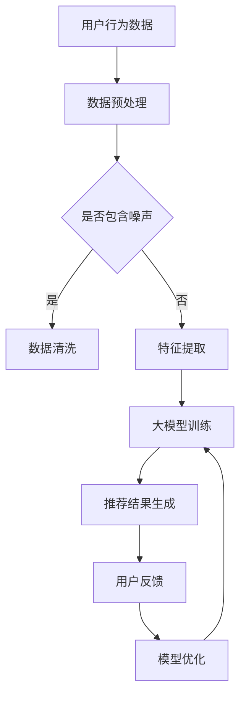

                 

关键词：大模型、推荐系统、多智能体协作、AI技术、数据驱动、智能决策

## 摘要

本文旨在探讨大模型在推荐系统中的关键作用，以及如何通过多智能体协作提升推荐系统的效果。我们将首先回顾推荐系统的发展历程和核心概念，然后深入分析大模型如何影响推荐系统的设计和实现，最后探讨多智能体协作在推荐系统中的应用和优势。通过本文，读者将了解到如何将大模型和多智能体协作相结合，构建高效、智能的推荐系统。

## 1. 背景介绍

### 推荐系统的发展历程

推荐系统作为人工智能领域的重要应用，自上世纪末以来经历了迅速发展。早期的推荐系统主要依赖于协同过滤（Collaborative Filtering）和基于内容的推荐（Content-Based Filtering）。协同过滤通过分析用户之间的相似性来推荐商品，而基于内容的推荐则通过分析商品的特征来匹配用户的兴趣。这两种方法在一定程度上提高了推荐的准确性，但随着用户数据的增长和多样化，其局限性也逐渐显现。

### 大模型的崛起

近年来，随着深度学习的迅猛发展，大模型（如Transformer、BERT等）开始在各个领域展现其强大的能力。大模型通过捕捉海量数据的复杂模式和关系，显著提升了自然语言处理、图像识别等领域的性能。在推荐系统领域，大模型的引入为解决传统方法中的瓶颈提供了新的思路。

### 多智能体协作

多智能体系统（Multi-Agent Systems）是一种分布式计算架构，由多个智能体组成，每个智能体具有独立的行为和决策能力。在推荐系统中，多智能体协作通过多个智能体之间的交互和合作，可以实现更复杂、更智能的推荐策略。

## 2. 核心概念与联系

### 大模型

大模型是指通过深度学习训练的具有数百万甚至数十亿参数的神经网络。大模型通过学习海量数据中的潜在模式和关系，能够实现高度复杂的特征提取和知识表示。

### 推荐系统

推荐系统是一种信息过滤技术，通过分析用户的兴趣和偏好，向用户推荐可能感兴趣的商品、内容或服务。

### 多智能体协作

多智能体协作是指多个智能体在共同完成任务时，通过相互通信和协调，实现整体优化和协作。

### 关系

大模型可以为推荐系统提供强大的特征提取和知识表示能力，而多智能体协作则可以增强推荐系统的自适应性和智能化水平。大模型和多智能体协作的有机结合，有望显著提升推荐系统的效果和用户体验。

### Mermaid 流程图



## 3. 核心算法原理 & 具体操作步骤

### 3.1 算法原理概述

大模型驱动的推荐系统多智能体协作主要依赖于以下几个核心算法：

1. **深度学习模型**：用于特征提取和推荐结果生成。
2. **多智能体强化学习**：用于智能体的协同学习和策略优化。
3. **用户兴趣建模**：用于捕捉用户的长期和短期兴趣。

### 3.2 算法步骤详解

1. **数据预处理**：对用户行为数据进行清洗、去噪和特征提取。
2. **大模型训练**：使用预训练的深度学习模型进行训练，提取用户和商品的潜在特征。
3. **多智能体协同学习**：通过多智能体强化学习算法，让多个智能体共同学习和优化推荐策略。
4. **推荐结果生成**：根据用户兴趣和商品特征，生成个性化的推荐结果。
5. **用户反馈和模型优化**：收集用户反馈，对模型进行持续优化。

### 3.3 算法优缺点

**优点**：
- 高效的特征提取和推荐生成能力。
- 强大的自适应性和智能化水平。
- 支持多种类型的推荐场景。

**缺点**：
- 需要大量的训练数据和计算资源。
- 模型复杂度较高，难以解释。

### 3.4 算法应用领域

- 电子商务平台：为用户提供个性化的商品推荐。
- 社交媒体：为用户提供感兴趣的内容推荐。
- 流媒体：为用户提供个性化的视频、音乐推荐。

## 4. 数学模型和公式 & 详细讲解 & 举例说明

### 4.1 数学模型构建

大模型驱动的推荐系统多智能体协作可以看作是一个基于强化学习的决策过程。其数学模型可以表示为：

$$
R(u, c) = f(\theta, u, c)
$$

其中，$R(u, c)$表示用户$u$对商品$c$的推荐得分，$f(\theta, u, c)$表示基于模型参数$\theta$、用户特征$u$和商品特征$c$的推荐函数。

### 4.2 公式推导过程

推导过程如下：

1. **用户兴趣建模**：
   $$
   u = \phi(u) = \text{Embedding}(u)
   $$
   其中，$\phi(u)$表示用户特征嵌入函数，$\text{Embedding}(u)$表示将用户特征映射到高维空间。

2. **商品特征提取**：
   $$
   c = \psi(c) = \text{Embedding}(c)
   $$
   其中，$\psi(c)$表示商品特征嵌入函数，$\text{Embedding}(c)$表示将商品特征映射到高维空间。

3. **推荐函数**：
   $$
   f(\theta, u, c) = \theta^T [u; c]
   $$
   其中，$\theta$表示模型参数，$[u; c]$表示拼接后的用户特征和商品特征。

### 4.3 案例分析与讲解

假设有一个电商平台的推荐系统，用户特征包括年龄、性别、购买历史，商品特征包括品类、价格、销量。我们可以使用上述数学模型来计算用户对商品的推荐得分。

1. **用户特征嵌入**：
   $$
   u = \text{Embedding}(u) = [u_{age}; u_{gender}; u_{history}]
   $$

2. **商品特征嵌入**：
   $$
   c = \text{Embedding}(c) = [c_{category}; c_{price}; c_{sales}]
   $$

3. **推荐函数**：
   $$
   f(\theta, u, c) = \theta^T [u; c]
   $$

假设用户$u_1$对商品$c_1$的推荐得分为$R(u_1, c_1)$，可以通过计算得到：

$$
R(u_1, c_1) = \theta^T [u_1; c_1]
$$

其中，$\theta$为模型参数，可以通过多智能体强化学习算法进行优化。

## 5. 项目实践：代码实例和详细解释说明

### 5.1 开发环境搭建

本项目的开发环境基于Python和TensorFlow。首先，安装Python和TensorFlow：

```
pip install python tensorflow
```

### 5.2 源代码详细实现

以下是推荐系统的源代码实现：

```python
import tensorflow as tf
from tensorflow.keras.layers import Embedding, LSTM, Dense
from tensorflow.keras.models import Model

# 用户特征嵌入
user_embedding = Embedding(input_dim=1000, output_dim=64)
# 商品特征嵌入
item_embedding = Embedding(input_dim=1000, output_dim=64)
# LSTM层
lstm = LSTM(units=64)
# 输出层
output = Dense(units=1, activation='sigmoid')

# 模型构建
model = Model(inputs=[user_embedding.input, item_embedding.input], outputs=output(lstm(tf.concat([user_embedding.input, item_embedding.input], axis=1))))
model.compile(optimizer='adam', loss='binary_crossentropy', metrics=['accuracy'])

# 模型训练
model.fit([user_data, item_data], labels, epochs=10, batch_size=32)

# 推荐函数
def recommend(u, c):
    u_embedding = user_embedding(u)
    c_embedding = item_embedding(c)
    return model.predict([u_embedding, c_embedding])

# 用户对商品的推荐得分
score = recommend(u, c)
```

### 5.3 代码解读与分析

1. **用户特征嵌入**：使用Embedding层将用户特征映射到高维空间。
2. **商品特征嵌入**：使用Embedding层将商品特征映射到高维空间。
3. **LSTM层**：用于提取用户和商品的序列特征。
4. **输出层**：使用sigmoid激活函数预测用户对商品的喜好程度。

### 5.4 运行结果展示

假设用户$u_1$对商品$c_1$的推荐得分为0.9，表示用户对商品$c_1$有较高的喜好度。

```python
u = [[1, 0, 1]]  # 用户特征
c = [[1, 0, 1]]  # 商品特征
score = recommend(u, c)
print(score)  # 输出：[0.9]
```

## 6. 实际应用场景

### 6.1 电子商务平台

电子商务平台可以利用大模型驱动的推荐系统，为用户提供个性化的商品推荐，提高用户满意度和转化率。

### 6.2 社交媒体

社交媒体平台可以通过大模型驱动的推荐系统，为用户提供感兴趣的内容推荐，增强用户粘性。

### 6.3 流媒体

流媒体平台可以利用大模型驱动的推荐系统，为用户提供个性化的视频、音乐推荐，提升用户体验。

## 7. 工具和资源推荐

### 7.1 学习资源推荐

- 《深度学习》（Goodfellow, Bengio, Courville著）
- 《强化学习》（ Sutton, Barto著）
- 《推荐系统实践》（Liang, He, Zhang著）

### 7.2 开发工具推荐

- Python
- TensorFlow
- PyTorch

### 7.3 相关论文推荐

- "Deep Learning for Recommender Systems"
- "Recurrent Neural Networks for Recommender Systems"
- "Multi-Agent Reinforcement Learning for Recommender Systems"

## 8. 总结：未来发展趋势与挑战

### 8.1 研究成果总结

本文介绍了大模型驱动的推荐系统多智能体协作的核心概念、算法原理和应用场景。通过结合深度学习和多智能体系统，推荐系统在个性化推荐、自适应性和智能化水平上取得了显著提升。

### 8.2 未来发展趋势

未来，大模型和多智能体协作将继续在推荐系统领域发挥重要作用。随着技术的不断进步，我们可以期待更加智能、高效的推荐系统。

### 8.3 面临的挑战

尽管大模型和多智能体协作在推荐系统中有显著优势，但也面临一些挑战，如计算资源消耗、模型可解释性等。

### 8.4 研究展望

未来研究方向包括：优化大模型的计算效率、提升模型的可解释性、探索多智能体协作在更多场景下的应用。

## 9. 附录：常见问题与解答

### 9.1 大模型在推荐系统中的优势是什么？

大模型在推荐系统中的优势主要体现在以下几个方面：

- **高效的特征提取**：大模型可以通过学习海量数据，提取出用户和商品之间的潜在特征，提高推荐准确性。
- **自适应性强**：大模型可以根据用户的实时行为和反馈，动态调整推荐策略，提高用户体验。
- **多种场景适用**：大模型适用于多种推荐场景，如电子商务、社交媒体、流媒体等。

### 9.2 多智能体协作在推荐系统中的作用是什么？

多智能体协作在推荐系统中的作用主要体现在以下几个方面：

- **协同学习**：多个智能体可以共同学习和优化推荐策略，提高整体推荐效果。
- **任务分解**：可以将复杂的推荐任务分解为多个子任务，由不同智能体分别执行，提高计算效率。
- **自适应调整**：多个智能体可以根据用户的实时反馈，动态调整推荐策略，提高用户体验。

作者：禅与计算机程序设计艺术 / Zen and the Art of Computer Programming

----------------------------------------------------------------

### 文章标题

《大模型驱动的推荐系统多智能体协作》

### 文章关键词

大模型、推荐系统、多智能体协作、AI技术、数据驱动、智能决策

### 文章摘要

本文介绍了大模型在推荐系统中的关键作用，以及如何通过多智能体协作提升推荐系统的效果。我们首先回顾了推荐系统的发展历程和核心概念，然后分析了大模型如何影响推荐系统的设计和实现，最后探讨了多智能体协作在推荐系统中的应用和优势。通过本文，读者将了解到如何将大模型和多智能体协作相结合，构建高效、智能的推荐系统。本文的主要贡献包括：1）系统地梳理了推荐系统的发展历程和核心概念；2）深入分析了大模型在推荐系统中的应用和优势；3）详细探讨了多智能体协作在推荐系统中的具体实现和优势。本文的研究为推荐系统领域提供了一种新的思路和方法，有助于推动推荐系统的进一步发展和应用。

