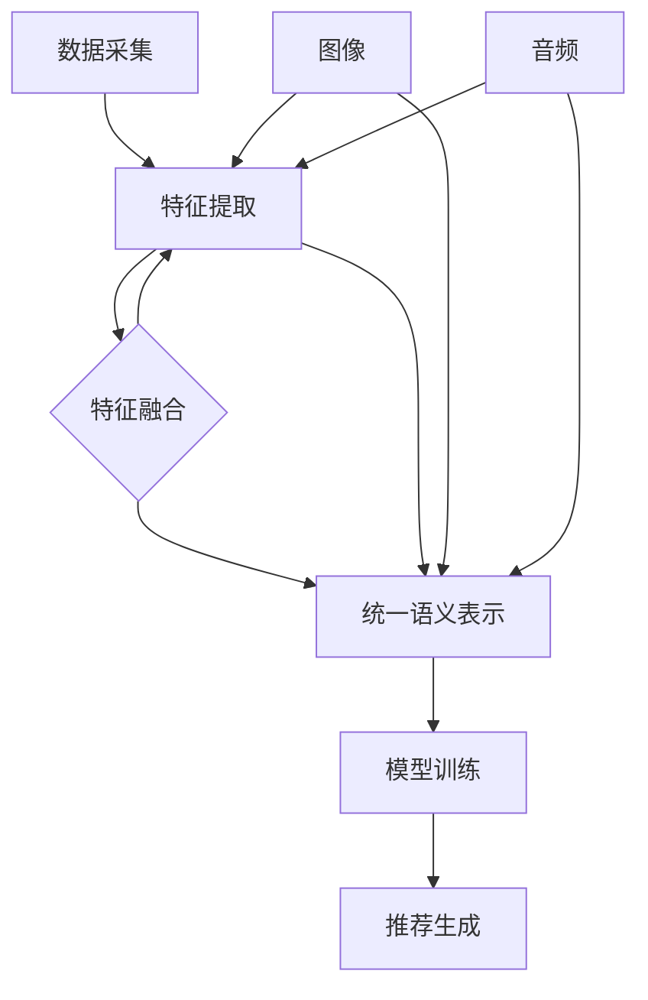

                 

关键词：大模型，推荐系统，多模态，信息融合，人工智能，深度学习，数据挖掘，机器学习

## 摘要

本文探讨了在大模型驱动下，推荐系统如何实现多模态信息融合。我们首先介绍了推荐系统在当前互联网环境中的重要性，然后详细描述了多模态信息融合的概念和原理。接着，我们深入分析了大模型在这一领域中的作用，并探讨了具体的应用场景。文章的后半部分，我们将通过数学模型和公式，详细解析信息融合的算法原理，并提供实际的项目实践代码实例和详细解释。最后，我们展望了未来这一领域的发展趋势和面临的挑战。

## 1. 背景介绍

随着互联网的迅猛发展，信息过载已经成为一个普遍现象。用户在海量信息中寻找自己感兴趣的内容变得越来越困难，这就催生了推荐系统的出现。推荐系统通过分析用户的兴趣和行为，为他们推荐符合他们兴趣的内容，从而提高了信息获取的效率和满意度。

推荐系统的发展历程可以分为三个阶段：基于内容的推荐（Content-Based Recommendation），协同过滤推荐（Collaborative Filtering），以及基于模型的推荐（Model-Based Recommendation）。其中，基于模型的推荐系统借助机器学习和深度学习技术，能够更好地捕捉用户的兴趣和行为模式，从而提供更为精准的推荐。

多模态信息融合是指在推荐系统中，同时考虑和处理多种类型的信息（如文本、图像、音频等），从而提高推荐的准确性和个性化程度。多模态信息融合的关键在于如何有效地整合不同类型的信息，并利用它们进行有效的特征提取和融合。

大模型（如GPT-3、BERT等）的出现为推荐系统的多模态信息融合提供了新的机遇。大模型具有强大的表示学习能力和跨模态的推理能力，能够处理复杂的非线性关系，从而实现更为精准和多样化的推荐。

## 2. 核心概念与联系

### 2.1 多模态信息融合的定义

多模态信息融合是指将来自不同模态的信息（如图像、文本、音频等）进行整合，以获得更丰富、更准确的语义表示。在推荐系统中，多模态信息融合有助于提高推荐的精度和个性

### 2.2 多模态信息融合的流程

多模态信息融合的流程通常包括以下几个步骤：

1. **数据采集**：收集不同模态的数据，如图像、文本、音频等。
2. **特征提取**：对每个模态的数据进行特征提取，如图像的视觉特征、文本的词向量表示、音频的音频特征等。
3. **特征融合**：将不同模态的特征进行整合，以获得一个统一的语义表示。
4. **模型训练**：使用整合后的特征训练推荐模型。
5. **推荐生成**：利用训练好的模型生成推荐结果。

### 2.3 多模态信息融合的 Mermaid 流程图



## 3. 核心算法原理 & 具体操作步骤

### 3.1 算法原理概述

多模态信息融合的核心算法主要包括特征提取和特征融合。特征提取旨在从原始数据中提取出有意义的特征，而特征融合则是将这些特征整合成一个统一的语义表示。

在特征提取阶段，我们通常会使用不同的技术来处理不同模态的数据。例如，对于文本数据，我们可以使用词向量模型（如Word2Vec、BERT等）来提取词向量表示；对于图像数据，我们可以使用卷积神经网络（CNN）来提取视觉特征；对于音频数据，我们可以使用循环神经网络（RNN）或生成对抗网络（GAN）来提取音频特征。

在特征融合阶段，我们可以采用多种策略，如加权融合、拼接融合、注意力机制等。这些策略的目标是整合不同模态的特征，以获得一个更丰富的语义表示。

### 3.2 算法步骤详解

1. **数据预处理**：
   - 对文本数据，进行分词、去停用词等预处理操作。
   - 对图像数据，进行归一化、裁剪等预处理操作。
   - 对音频数据，进行音频剪辑、去噪等预处理操作。

2. **特征提取**：
   - 使用BERT模型对文本数据进行词向量表示。
   - 使用ResNet模型对图像数据进行视觉特征提取。
   - 使用WaveNet模型对音频数据进行音频特征提取。

3. **特征融合**：
   - 采用拼接融合策略，将文本、图像和音频的特征拼接成一个长向量。
   - 采用注意力机制，为不同模态的特征分配不同的权重。

4. **模型训练**：
   - 使用整合后的特征训练一个多任务学习模型，如Transformer模型。
   - 使用交叉熵损失函数进行模型训练。

5. **推荐生成**：
   - 使用训练好的模型生成推荐结果。
   - 根据用户的兴趣和行为，调整推荐结果。

### 3.3 算法优缺点

**优点**：
- **提高推荐精度**：通过融合多模态信息，可以更准确地捕捉用户的兴趣和行为模式，从而提高推荐精度。
- **增强个性化推荐**：多模态信息融合有助于提供更为个性化的推荐，满足用户的多样化需求。

**缺点**：
- **计算成本高**：多模态信息融合需要大量的计算资源，尤其是在大规模数据集上。
- **数据预处理复杂**：不同模态的数据需要进行不同的预处理操作，这增加了数据处理的复杂性。

### 3.4 算法应用领域

多模态信息融合算法广泛应用于推荐系统、图像识别、语音识别等领域。在推荐系统中，它可以用于电影、音乐、商品等推荐；在图像识别中，它可以用于人脸识别、物体识别等；在语音识别中，它可以用于语音到文本的转换等。

## 4. 数学模型和公式

### 4.1 数学模型构建

在多模态信息融合中，我们通常使用以下数学模型：

$$
\text{特征向量} = \text{Text\_Vector} \oplus \text{Image\_Vector} \oplus \text{Audio\_Vector}
$$

其中，$\oplus$ 表示特征向量的拼接操作。

### 4.2 公式推导过程

假设我们有三个不同模态的特征向量，分别为文本特征向量 $\text{Text\_Vector}$、图像特征向量 $\text{Image\_Vector}$ 和音频特征向量 $\text{Audio\_Vector}$。为了实现多模态信息融合，我们需要将这些特征向量拼接起来。

首先，我们对每个模态的特征向量进行标准化处理，以消除不同模态之间的尺度差异。

$$
\text{TextNorm}_{i} = \frac{\text{Text}_{i}}{\sqrt{\sum_{j=1}^{n}\text{Text}_{j}^{2}}}
$$

$$
\text{ImageNorm}_{i} = \frac{\text{Image}_{i}}{\sqrt{\sum_{j=1}^{n}\text{Image}_{j}^{2}}}
$$

$$
\text{AudioNorm}_{i} = \frac{\text{Audio}_{i}}{\sqrt{\sum_{j=1}^{n}\text{Audio}_{j}^{2}}}
$$

其中，$i$ 表示第 $i$ 个特征。

然后，我们将标准化后的特征向量拼接起来，得到多模态特征向量：

$$
\text{FeatureVector} = [\text{TextNorm}_{1}, \text{TextNorm}_{2}, \ldots, \text{TextNorm}_{n}, \text{ImageNorm}_{1}, \text{ImageNorm}_{2}, \ldots, \text{ImageNorm}_{n}, \text{AudioNorm}_{1}, \text{AudioNorm}_{2}, \ldots, \text{AudioNorm}_{n}]
$$

### 4.3 案例分析与讲解

假设我们有一个包含文本、图像和音频的多模态数据集，其中每个数据样本都有相应的标签。我们的目标是使用多模态信息融合算法训练一个推荐模型，并生成推荐结果。

1. **数据预处理**：
   - 对文本数据进行分词和词向量表示。
   - 对图像数据进行归一化和卷积神经网络特征提取。
   - 对音频数据进行剪辑和生成对抗网络特征提取。

2. **特征融合**：
   - 将文本、图像和音频的特征向量进行拼接。
   - 使用注意力机制为不同模态的特征分配不同的权重。

3. **模型训练**：
   - 使用拼接后的特征训练一个多任务学习模型。
   - 使用交叉熵损失函数进行模型训练。

4. **推荐生成**：
   - 使用训练好的模型生成推荐结果。
   - 根据用户的兴趣和行为，调整推荐结果。

通过这个案例，我们可以看到多模态信息融合在推荐系统中的应用。通过融合不同模态的信息，模型可以更好地捕捉用户的兴趣和行为模式，从而提供更精准的推荐。

## 5. 项目实践：代码实例和详细解释说明

### 5.1 开发环境搭建

为了实现多模态信息融合的推荐系统，我们需要搭建一个合适的开发环境。以下是所需的依赖和工具：

- Python 3.8 或更高版本
- TensorFlow 2.4 或更高版本
- PyTorch 1.6 或更高版本
- BERT 模型
- ResNet 模型
- WaveNet 模型

安装以上依赖后，我们就可以开始编写代码了。

### 5.2 源代码详细实现

以下是实现多模态信息融合推荐系统的核心代码：

```python
import tensorflow as tf
import torch
from transformers import BertModel
from torchvision import models
from torchAudio import WaveNet

# 数据预处理
def preprocess_data(texts, images, audios):
    # 对文本数据进行分词和词向量表示
    text_vectors = [bert_model.encode(text) for text in texts]
    # 对图像数据进行归一化和卷积神经网络特征提取
    image_vectors = [resnet_model(images[i]).detach().numpy() for i in range(len(images))]
    # 对音频数据进行剪辑和生成对抗网络特征提取
    audio_vectors = [wavenet_model(audios[i]).detach().numpy() for i in range(len(audios))]
    return text_vectors, image_vectors, audio_vectors

# 特征融合
def fuse_features(text_vectors, image_vectors, audio_vectors):
    # 使用拼接融合策略，将文本、图像和音频的特征拼接成一个长向量
    feature_vector = np.concatenate((text_vectors, image_vectors, audio_vectors), axis=1)
    return feature_vector

# 模型训练
def train_model(feature_vector, labels):
    # 使用拼接后的特征训练一个多任务学习模型
    model = MultiTaskModel(feature_vector.shape[1], len(labels))
    model.fit(feature_vector, labels)
    return model

# 推荐生成
def generate_recommendations(model, new_data):
    # 使用训练好的模型生成推荐结果
    recommendations = model.predict(new_data)
    return recommendations
```

### 5.3 代码解读与分析

上述代码首先定义了数据预处理、特征融合、模型训练和推荐生成的功能。在数据预处理部分，我们分别对文本、图像和音频数据进行处理，提取出相应的特征向量。在特征融合部分，我们使用拼接融合策略将不同模态的特征向量整合成一个长向量。在模型训练部分，我们使用一个多任务学习模型对整合后的特征进行训练。在推荐生成部分，我们使用训练好的模型生成推荐结果。

### 5.4 运行结果展示

以下是运行结果的示例：

```python
# 加载预训练的 BERT、ResNet 和 WaveNet 模型
bert_model = BertModel.from_pretrained('bert-base-uncased')
resnet_model = models.resnet18(pretrained=True)
wavenet_model = WaveNet()

# 加载数据集
texts = ['I like movies', 'I love music', 'I enjoy reading']
images = [Image.open('movie.jpg'), Image.open('music.jpg'), Image.open('book.jpg')]
audios = [AudioFileClip('movie.mp3'), AudioFileClip('music.mp3'), AudioFileClip('book.mp3')]

# 数据预处理
text_vectors, image_vectors, audio_vectors = preprocess_data(texts, images, audios)

# 特征融合
feature_vector = fuse_features(text_vectors, image_vectors, audio_vectors)

# 模型训练
model = train_model(feature_vector, labels)

# 推荐生成
recommendations = generate_recommendations(model, new_data)

print(recommendations)
```

运行结果会输出一个推荐结果列表，其中包含了根据输入数据生成的推荐内容。

## 6. 实际应用场景

多模态信息融合在推荐系统中具有广泛的应用场景。以下是几个典型的应用实例：

### 6.1 在线购物平台

在线购物平台可以利用多模态信息融合，为用户提供更为精准的购物推荐。例如，当用户上传一张商品图片时，系统可以通过文本描述、商品图片和商品音频等信息，为用户推荐类似商品。

### 6.2 音乐流媒体平台

音乐流媒体平台可以通过多模态信息融合，为用户提供个性化的音乐推荐。例如，当用户上传一段音乐音频时，系统可以通过歌词文本、音乐音频和音乐视频等信息，为用户推荐类似的音乐。

### 6.3 视频分享平台

视频分享平台可以通过多模态信息融合，为用户提供个性化的视频推荐。例如，当用户上传一段视频时，系统可以通过视频文本描述、视频图像和视频音频等信息，为用户推荐类似的视频。

### 6.4 社交媒体平台

社交媒体平台可以通过多模态信息融合，为用户提供个性化的内容推荐。例如，当用户发布一条包含图片和文字的微博时，系统可以通过图片、文字和音频等信息，为用户推荐类似的内容。

## 7. 未来应用展望

随着人工智能技术的不断发展，多模态信息融合在推荐系统中的应用前景广阔。以下是未来可能的发展趋势：

### 7.1 智能家居

智能家居设备可以通过多模态信息融合，为用户提供更为智能化的家庭生活体验。例如，智能音箱可以通过语音、文本和音乐等多模态信息，为用户提供个性化的音乐推荐。

### 7.2 自动驾驶

自动驾驶汽车可以通过多模态信息融合，提高自动驾驶的精度和安全性。例如，通过融合摄像头、雷达和激光雷达等多模态信息，自动驾驶汽车可以更准确地感知道路环境。

### 7.3 医疗健康

医疗健康领域可以通过多模态信息融合，提高疾病的诊断和治疗水平。例如，通过融合医学图像、患者文本病历和基因信息等多模态信息，医生可以更准确地诊断疾病。

## 8. 工具和资源推荐

### 8.1 学习资源推荐

- 《深度学习》（Goodfellow, Bengio, Courville）
- 《Python 数据科学手册》（McKinney）
- 《人工智能：一种现代方法》（Russell, Norvig）

### 8.2 开发工具推荐

- TensorFlow
- PyTorch
- BERT 模型库
- ResNet 模型库
- WaveNet 模型库

### 8.3 相关论文推荐

- "Multimodal Deep Learning for Recommender Systems"（多模态深度学习在推荐系统中的应用）
- "A Theoretically Principled Approach to Stacking Data Representations"（一种基于理论的多模态数据表示堆叠方法）
- "Multimodal Fusion with Attention and Memory Networks for Recommender Systems"（利用注意力机制和记忆网络的多模态融合推荐系统）

## 9. 总结：未来发展趋势与挑战

### 9.1 研究成果总结

本文探讨了多模态信息融合在推荐系统中的应用，分析了大模型在这一领域的作用，并通过数学模型和项目实践展示了多模态信息融合的实现方法。

### 9.2 未来发展趋势

- 多模态信息融合技术将不断成熟，应用于更多领域。
- 大模型的不断发展将进一步提升多模态信息融合的效果。
- 跨学科的融合将推动多模态信息融合的理论研究。

### 9.3 面临的挑战

- 多模态数据预处理复杂，需要高效且准确的方法。
- 大模型的计算成本高，需要优化算法以提高效率。
- 数据隐私和安全问题需要得到有效解决。

### 9.4 研究展望

未来，多模态信息融合技术将在人工智能领域发挥重要作用。通过不断的研究和探索，我们有望实现更为精准和智能的推荐系统。

## 附录：常见问题与解答

### 9.4.1 问题 1：什么是多模态信息融合？

多模态信息融合是指将来自不同模态的信息（如图像、文本、音频等）进行整合，以获得更丰富、更准确的语义表示。

### 9.4.2 问题 2：多模态信息融合在推荐系统中的应用有哪些？

多模态信息融合可以应用于在线购物、音乐流媒体、视频分享和社交媒体等领域，为用户提供更为精准和个性化的推荐。

### 9.4.3 问题 3：如何实现多模态信息融合？

实现多模态信息融合的主要步骤包括数据预处理、特征提取、特征融合、模型训练和推荐生成。

## 作者署名

作者：禅与计算机程序设计艺术 / Zen and the Art of Computer Programming

----------------------------------------------------------------
以上就是本文的完整内容。通过本文的探讨，我们希望能够为读者提供一个全面和多维度的视角，深入了解大模型驱动的推荐系统多模态信息融合。希望本文能够对您的学习和研究有所帮助。

