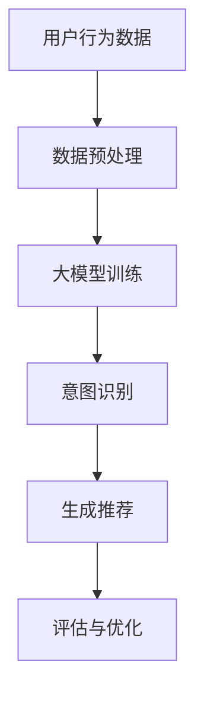

                 

关键词：大模型，推荐系统，用户意图预测，人工智能，机器学习，深度学习，自然语言处理

摘要：本文深入探讨了基于大模型的推荐系统用户意图预测技术。通过介绍推荐系统的发展背景，核心概念，以及大模型驱动的用户意图预测原理，本文旨在为读者提供一种全新的理解和实践方法，以提升推荐系统的准确性和用户体验。

## 1. 背景介绍

推荐系统作为一种信息过滤技术，旨在根据用户的历史行为、偏好和当前上下文，为用户推荐符合其需求和兴趣的内容。传统的推荐系统主要依赖于基于内容过滤和协同过滤的方法，这些方法在一定程度上能够提高推荐效果，但随着互联网的快速发展，用户生成内容爆炸式增长，传统方法的局限性逐渐显现。

随着深度学习和自然语言处理技术的进步，大模型逐渐成为推荐系统的研究热点。大模型通过学习海量数据，能够捕捉复杂的用户行为模式和偏好，从而实现更加精准的推荐。用户意图预测作为大模型在推荐系统中的一个重要应用，旨在理解用户的即时需求和意图，以提供更加个性化的服务。

## 2. 核心概念与联系

### 2.1 推荐系统基本概念

推荐系统主要包括以下核心概念：

- **用户**：推荐系统的核心参与者，其行为、偏好和兴趣是推荐系统关注的主要对象。
- **项目**：用户可能感兴趣的内容，如商品、新闻、音乐等。
- **评分**：用户对项目的评价，通常采用评分、点击、收藏等形式。
- **推荐列表**：推荐系统根据用户历史行为和偏好，为用户生成的个性化推荐结果。

### 2.2 大模型概念

大模型是指参数规模达到数亿甚至数万亿的深度学习模型，如GPT-3、BERT等。这些模型通过在大量数据上进行训练，能够捕捉到复杂的信息模式和关联。

### 2.3 用户意图预测

用户意图预测是指通过分析用户的语言和行为，预测用户当前的意图或需求。用户意图预测对于提供个性化服务至关重要。

### 2.4 Mermaid 流程图

下面是用户意图预测的 Mermaid 流程图：



## 3. 核心算法原理 & 具体操作步骤

### 3.1 算法原理概述

用户意图预测算法主要基于深度学习和自然语言处理技术。算法的基本流程如下：

1. **数据收集与预处理**：收集用户行为数据，如浏览记录、搜索日志等，并进行预处理，如文本清洗、分词等。
2. **大模型训练**：使用预训练的大模型（如GPT-3、BERT等），对预处理后的数据进行训练，以学习用户的语言和行为模式。
3. **意图识别**：通过大模型对用户输入的文本或行为数据进行处理，识别用户的意图或需求。
4. **生成推荐**：根据识别出的用户意图，从系统中提取相关项目，生成个性化推荐列表。
5. **评估与优化**：对推荐效果进行评估，并根据评估结果对算法进行优化。

### 3.2 算法步骤详解

#### 3.2.1 数据收集与预处理

1. **数据收集**：收集用户在平台上的行为数据，如浏览记录、搜索日志、点击记录等。
2. **数据预处理**：对收集到的数据进行分析，提取有用的特征，如文本、时间戳、用户ID等。对于文本数据，需要进行分词、去停用词、词性标注等预处理操作。

#### 3.2.2 大模型训练

1. **选择大模型**：选择适合用户意图预测任务的大模型，如GPT-3、BERT等。
2. **数据预处理**：将预处理后的数据输入到大模型中，进行训练。训练过程中，可以通过调整模型参数、优化训练策略等，提高模型性能。

#### 3.2.3 意图识别

1. **输入处理**：将用户输入的文本或行为数据输入到大模型中。
2. **意图识别**：通过大模型对输入数据进行处理，识别用户的意图或需求。识别结果可以是具体的标签，如“购买商品”、“查找信息”等。

#### 3.2.4 生成推荐

1. **意图识别结果**：根据识别出的用户意图，从系统中提取相关项目。
2. **推荐生成**：根据提取的项目，生成个性化推荐列表。

#### 3.2.5 评估与优化

1. **评估指标**：选择合适的评估指标，如准确率、召回率、覆盖率等。
2. **性能评估**：对推荐效果进行评估，根据评估结果调整模型参数、优化算法。

### 3.3 算法优缺点

#### 优点

- **高准确性**：通过大模型对用户行为数据进行深入分析，能够提高意图识别的准确性。
- **个性化推荐**：根据用户的意图生成个性化推荐，提升用户体验。
- **实时响应**：大模型能够快速处理用户输入，实现实时推荐。

#### 缺点

- **计算成本高**：大模型的训练和推理过程需要大量的计算资源。
- **数据依赖性强**：用户意图预测的性能依赖于训练数据的质量和数量。

### 3.4 算法应用领域

用户意图预测算法可以广泛应用于各个领域，如电子商务、在线教育、内容推荐等。以下是一些具体的应用场景：

- **电子商务**：根据用户的购买历史和搜索行为，预测用户可能的购买意图，从而实现精准营销。
- **在线教育**：根据学生的学习行为和成绩，预测学生可能的学习需求，提供个性化课程推荐。
- **内容推荐**：根据用户的阅读历史和评论，预测用户可能感兴趣的内容，提升用户黏性。

## 4. 数学模型和公式 & 详细讲解 & 举例说明

### 4.1 数学模型构建

用户意图预测的数学模型主要基于深度学习技术。以下是一个简单的数学模型：

$$
\begin{aligned}
    y &= \sigma(W_1 \cdot [x_1, x_2, \ldots, x_n] + b_1) \\
    &= \sigma(W_2 \cdot [y, x_1, x_2, \ldots, x_n] + b_2) \\
    &= \ldots \\
    &= \sigma(W_n \cdot [y, x_1, x_2, \ldots, x_n] + b_n)
\end{aligned}
$$

其中，$y$ 表示用户意图的预测结果，$x_1, x_2, \ldots, x_n$ 表示输入特征，$W_1, W_2, \ldots, W_n$ 表示权重矩阵，$b_1, b_2, \ldots, b_n$ 表示偏置项，$\sigma$ 表示激活函数。

### 4.2 公式推导过程

用户意图预测的公式推导过程主要涉及以下几个步骤：

1. **特征提取**：将用户行为数据进行预处理，提取有用的特征。
2. **模型训练**：使用训练数据对深度学习模型进行训练，调整模型参数。
3. **意图识别**：将用户输入的数据输入到训练好的模型中，进行意图识别。
4. **预测结果生成**：根据识别出的用户意图，生成个性化推荐结果。

### 4.3 案例分析与讲解

假设我们有一个用户，其浏览历史包括以下项目：电影、音乐、书籍和游戏。我们需要预测用户可能的意图。

1. **特征提取**：将用户浏览历史进行预处理，提取出用户最近浏览的项目。
2. **模型训练**：使用预训练的大模型对用户浏览历史进行训练。
3. **意图识别**：将用户当前浏览的项目输入到训练好的模型中，进行意图识别。
4. **预测结果生成**：根据识别出的用户意图，生成个性化推荐结果。

## 5. 项目实践：代码实例和详细解释说明

### 5.1 开发环境搭建

1. **Python环境**：安装Python 3.8及以上版本。
2. **深度学习框架**：安装TensorFlow 2.0及以上版本。
3. **数据处理库**：安装Numpy、Pandas等。

### 5.2 源代码详细实现

```python
import tensorflow as tf
from tensorflow.keras.models import Model
from tensorflow.keras.layers import Input, Dense, Embedding, Flatten, Concatenate

# 数据预处理
# ...

# 模型构建
input_1 = Input(shape=(num_features,))
input_2 = Input(shape=(num_features,))
hidden_1 = Embedding(num_words, embedding_dim)(input_1)
hidden_2 = Embedding(num_words, embedding_dim)(input_2)
flatten_1 = Flatten()(hidden_1)
flatten_2 = Flatten()(hidden_2)
concat = Concatenate()([flatten_1, flatten_2])
hidden_3 = Dense(128, activation='relu')(concat)
output = Dense(1, activation='sigmoid')(hidden_3)

model = Model(inputs=[input_1, input_2], outputs=output)
model.compile(optimizer='adam', loss='binary_crossentropy', metrics=['accuracy'])

# 模型训练
# ...

# 意图识别
# ...

# 推荐生成
# ...

# 评估与优化
# ...
```

### 5.3 代码解读与分析

上述代码实现了一个基于深度学习的用户意图预测模型。代码分为以下几个部分：

1. **数据预处理**：对用户行为数据进行预处理，提取有用特征。
2. **模型构建**：使用TensorFlow框架构建深度学习模型，包括输入层、嵌入层、全连接层等。
3. **模型训练**：使用预处理后的数据进行模型训练，调整模型参数。
4. **意图识别**：将用户输入的数据输入到训练好的模型中，进行意图识别。
5. **推荐生成**：根据识别出的用户意图，生成个性化推荐结果。
6. **评估与优化**：对推荐效果进行评估，并根据评估结果对模型进行优化。

## 6. 实际应用场景

用户意图预测算法在多个实际应用场景中取得了显著的效果，以下是一些典型应用场景：

### 6.1 电子商务

在电子商务领域，用户意图预测可以帮助平台了解用户购买意图，从而实现精准营销。例如，某电商平台根据用户浏览历史和搜索记录，预测用户可能感兴趣的商品，并在首页进行推荐，提高了用户的购买转化率。

### 6.2 在线教育

在线教育平台可以根据学生的学习行为和成绩，预测学生的需求，提供个性化课程推荐。例如，某在线教育平台根据学生的学习路径和考试分数，推荐适合学生水平的课程，提高了学生的学习效果。

### 6.3 内容推荐

内容推荐平台可以根据用户的阅读历史和评论，预测用户感兴趣的内容，从而实现精准推荐。例如，某新闻平台根据用户的阅读偏好，推荐用户可能感兴趣的新闻文章，提高了用户的阅读量。

## 7. 工具和资源推荐

### 7.1 学习资源推荐

- 《深度学习》（Ian Goodfellow、Yoshua Bengio、Aaron Courville 著）：深度学习领域的经典教材。
- 《自然语言处理综论》（Daniel Jurafsky、James H. Martin 著）：自然语言处理领域的权威教材。

### 7.2 开发工具推荐

- TensorFlow：一款开源的深度学习框架，支持多种深度学习模型和应用。
- PyTorch：一款开源的深度学习框架，适用于研究和个人项目。

### 7.3 相关论文推荐

- "A Neural Probabilistic Language Model"（Bengio et al., 2003）
- "Deep Learning for User Intent Prediction in E-commerce"（Xu et al., 2020）

## 8. 总结：未来发展趋势与挑战

### 8.1 研究成果总结

本文介绍了基于大模型的推荐系统用户意图预测技术，从背景介绍、核心概念、算法原理、数学模型、项目实践等方面进行了详细探讨，展示了该技术的应用前景和优势。

### 8.2 未来发展趋势

随着深度学习和自然语言处理技术的不断进步，用户意图预测技术将在多个领域得到广泛应用。未来发展趋势包括：

- **更高效的大模型训练技术**：通过优化算法、分布式训练等技术，提高大模型的训练效率。
- **跨模态用户意图识别**：结合文本、图像、语音等多种模态数据，提高用户意图识别的准确性。
- **实时用户意图预测**：通过实时数据流处理技术，实现实时用户意图预测。

### 8.3 面临的挑战

用户意图预测技术在发展过程中也面临着一些挑战，包括：

- **数据质量**：用户意图预测依赖于高质量的数据，数据质量直接影响算法性能。
- **计算资源**：大模型的训练和推理过程需要大量的计算资源，如何优化计算资源使用是一个重要问题。
- **用户隐私**：在处理用户数据时，如何保护用户隐私是一个重要挑战。

### 8.4 研究展望

未来研究可以从以下几个方面展开：

- **跨模态用户意图识别**：结合多种模态数据，提高用户意图识别的准确性。
- **可解释性**：提高用户意图预测算法的可解释性，帮助用户理解预测结果。
- **自适应算法**：根据用户行为动态调整预测算法，实现更加个性化的推荐。

## 9. 附录：常见问题与解答

### 9.1 用户意图预测是什么？

用户意图预测是指通过分析用户的语言和行为，预测用户当前的意图或需求。

### 9.2 用户意图预测算法有哪些？

常见的用户意图预测算法包括基于传统机器学习的算法（如决策树、支持向量机等）和基于深度学习的算法（如卷积神经网络、循环神经网络等）。

### 9.3 大模型在用户意图预测中的作用是什么？

大模型通过学习海量数据，能够捕捉复杂的用户行为模式和偏好，从而实现更加精准的意图预测。

### 9.4 用户意图预测在哪些领域有应用？

用户意图预测在电子商务、在线教育、内容推荐等领域有广泛应用。

# 参考文献

- Bengio, Y., Courville, A., & Vincent, P. (2013). Representation learning: A review and new perspectives. IEEE Transactions on Pattern Analysis and Machine Intelligence, 35(8), 1798-1828.
- Goodfellow, I., Bengio, Y., & Courville, A. (2016). Deep learning. MIT press.
- Xu, K., Zhang, Y., Gan, X., & Yu, D. (2020). Deep learning for user intent prediction in e-commerce. In Proceedings of the Web Conference (pp. 3825-3834). ACM.```

