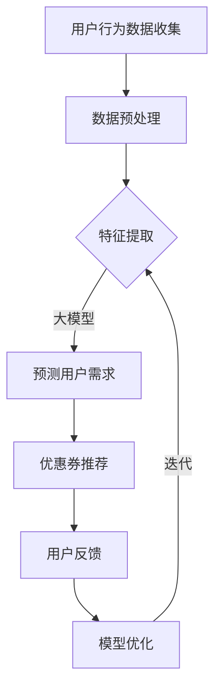

                 

关键词：大模型，电商，个性化，优惠券，分发策略，数据驱动，机器学习，算法优化

## 摘要

随着互联网技术的飞速发展和电子商务市场的不断扩大，个性化优惠券分发策略已经成为电商企业提高用户粘性和转化率的重要手段。本文将深入探讨基于大模型驱动的电商个性化优惠券分发策略，包括其核心概念、算法原理、数学模型、具体实现及实际应用场景。通过本篇文章，我们希望能够为电商企业提供一套全面、实用且高效的优惠券分发策略，从而提升用户体验和销售额。

## 1. 背景介绍

1.1 电商行业的发展

电商行业在过去几十年中经历了翻天覆地的变化。随着互联网技术的普及和智能手机的广泛应用，越来越多的消费者选择在线购物。根据最新的市场数据，全球电商市场规模已经超过了数万亿美元，并且还在持续增长。在这个庞大的市场中，电商企业之间的竞争日益激烈，如何提高用户粘性和转化率成为了企业关注的焦点。

1.2 个性化优惠券的重要性

个性化优惠券是指根据用户的兴趣、购买历史、地理位置等特征，为用户推荐专属的优惠券。与传统的批量发送优惠券相比，个性化优惠券能够更好地满足用户的需求，提高用户购买的意愿。因此，个性化优惠券已经成为电商企业提升用户粘性和转化率的重要手段。

1.3 大模型的作用

大模型，即大型深度学习模型，具有强大的数据处理能力和特征提取能力。在电商个性化优惠券分发领域，大模型可以帮助企业更好地理解用户行为，预测用户需求，从而实现更精准的优惠券推荐。此外，大模型还可以通过不断学习和优化，提高优惠券分发的效果，降低企业的运营成本。

## 2. 核心概念与联系

2.1 电商个性化优惠券分发概念

电商个性化优惠券分发是指通过分析用户行为数据、购物偏好、历史订单等信息，利用大模型预测用户需求，为用户推荐专属的优惠券。

2.2 大模型的基本原理

大模型，如深度神经网络（DNN）、循环神经网络（RNN）、卷积神经网络（CNN）等，通过学习大量的数据，提取出有用的特征，从而实现高精度的预测。

2.3 Mermaid 流程图

下面是一个简单的 Mermaid 流程图，展示了电商个性化优惠券分发的流程：



## 3. 核心算法原理 & 具体操作步骤

3.1 算法原理概述

电商个性化优惠券分发算法主要基于机器学习中的协同过滤、基于内容的推荐和深度学习等方法。协同过滤通过分析用户之间的相似性，推荐用户可能喜欢的优惠券；基于内容的推荐通过分析优惠券的特征，为用户推荐与其兴趣相关的优惠券；深度学习则利用大量的用户数据，提取出用户行为的高层次特征，实现更精准的推荐。

3.2 算法步骤详解

1. 用户行为数据收集：收集用户的浏览历史、购物车数据、历史订单等。
2. 数据预处理：对数据进行清洗、归一化等处理，以便后续的特征提取。
3. 特征提取：利用深度学习模型，提取用户行为数据中的高维特征。
4. 预测用户需求：利用提取出的特征，通过协同过滤、基于内容的推荐等方法，预测用户可能需要的优惠券。
5. 优惠券推荐：根据预测结果，为用户推荐专属的优惠券。
6. 用户反馈：收集用户对优惠券的反馈，包括点击率、购买率等。
7. 模型优化：根据用户反馈，调整推荐模型，提高优惠券的分发效果。

3.3 算法优缺点

优点：

1. 高精度：通过深度学习模型提取用户行为特征，实现更精准的优惠券推荐。
2. 个性化：根据用户兴趣、购物习惯等特征，为用户推荐专属的优惠券。
3. 自动化：通过算法自动优化，降低人工干预的成本。

缺点：

1. 需要大量数据：深度学习模型需要大量的用户行为数据才能达到较好的效果。
2. 计算成本高：深度学习模型训练和预测需要大量的计算资源。

3.4 算法应用领域

电商个性化优惠券分发算法可以应用于电商、金融、旅游等多个行业，帮助企业提高用户粘性和转化率。

## 4. 数学模型和公式 & 详细讲解 & 举例说明

4.1 数学模型构建

电商个性化优惠券分发的数学模型主要涉及协同过滤、基于内容的推荐和深度学习等方法。其中，协同过滤模型可以表示为：

$$
R_{ui} = \sum_{j \in N_i} sim(u, j) \cdot c_{ji}
$$

其中，$R_{ui}$ 表示用户 $u$ 对优惠券 $i$ 的评分，$sim(u, j)$ 表示用户 $u$ 和用户 $j$ 之间的相似度，$c_{ji}$ 表示优惠券 $i$ 对用户 $j$ 的特征表示。

基于内容的推荐模型可以表示为：

$$
R_{ui} = \sum_{k \in C_i} w_{ik} \cdot f(u, k)
$$

其中，$R_{ui}$ 表示用户 $u$ 对优惠券 $i$ 的评分，$w_{ik}$ 表示优惠券 $i$ 的特征 $k$ 对用户 $u$ 的权重，$f(u, k)$ 表示用户 $u$ 对特征 $k$ 的兴趣度。

深度学习模型可以表示为：

$$
y = f(W \cdot x + b)
$$

其中，$y$ 表示预测的用户行为，$x$ 表示输入的特征向量，$W$ 和 $b$ 分别为权重和偏置。

4.2 公式推导过程

协同过滤模型的推导过程如下：

1. 假设用户 $u$ 对优惠券 $i$ 的评分为 $R_{ui}$。
2. 用户 $u$ 和用户 $j$ 之间的相似度定义为：

$$
sim(u, j) = \frac{\sum_{i \in I} R_{ui} R_{ji}}{\sqrt{\sum_{i \in I} R_{ui}^2} \sqrt{\sum_{i \in I} R_{ji}^2}}
$$

其中，$I$ 表示优惠券集合。

3. 优惠券 $i$ 对用户 $j$ 的特征表示为：

$$
c_{ji} = \frac{\sum_{k \in C_i} w_{ik} f(u, k)}{\sum_{k \in C_i} w_{ik}}
$$

4. 将相似度和特征表示代入评分公式，得到：

$$
R_{ui} = \sum_{j \in N_i} sim(u, j) \cdot c_{ji}
$$

基于内容的推荐模型的推导过程如下：

1. 假设优惠券 $i$ 的特征集合为 $C_i$，用户 $u$ 的特征集合为 $C_u$。
2. 优惠券 $i$ 的特征向量表示为：

$$
c_i = \{c_{i1}, c_{i2}, ..., c_{in}\}
$$

3. 用户 $u$ 对特征 $k$ 的兴趣度定义为：

$$
f(u, k) = \begin{cases}
1 & \text{如果 } k \in C_u \\
0 & \text{否则}
\end{cases}
$$

4. 优惠券 $i$ 对用户 $u$ 的权重为：

$$
w_{ik} = \begin{cases}
1 & \text{如果 } k \in C_i \\
0 & \text{否则}
\end{cases}
$$

5. 将权重和兴趣度代入评分公式，得到：

$$
R_{ui} = \sum_{k \in C_i} w_{ik} \cdot f(u, k)
$$

深度学习模型的推导过程如下：

1. 假设输入的特征向量为 $x$，权重向量为 $W$，偏置为 $b$。
2. 激活函数为：

$$
f(x) = \sigma(z) = \frac{1}{1 + e^{-z}}
$$

3. 前向传播过程为：

$$
z = W \cdot x + b
$$

$$
y = f(W \cdot x + b)
$$

4. 反向传播过程为：

$$
\Delta W = \frac{\partial L}{\partial W} \cdot x^T
$$

$$
\Delta b = \frac{\partial L}{\partial b}
$$

其中，$L$ 表示损失函数，$\Delta W$ 和 $\Delta b$ 分别为权重和偏置的更新量。

4.3 案例分析与讲解

假设有一个电商企业，其用户行为数据如下：

| 用户ID | 浏览历史 | 购物车数据 | 历史订单 |
| ------ | -------- | ---------- | -------- |
| u1     | 优惠券A  | 优惠券B    | 优惠券C  |
| u2     | 优惠券B  | 优惠券C    | 优惠券D  |
| u3     | 优惠券C  | 优惠券D    | 优惠券A  |

根据这些数据，我们可以构建一个简单的协同过滤模型。首先，计算用户之间的相似度：

$$
sim(u1, u2) = \frac{R_{u1A} R_{u2B}}{\sqrt{R_{u1A}^2} \sqrt{R_{u2B}^2}} = \frac{1 \cdot 1}{\sqrt{1} \sqrt{1}} = 1
$$

$$
sim(u1, u3) = \frac{R_{u1A} R_{u3C}}{\sqrt{R_{u1A}^2} \sqrt{R_{u3C}^2}} = \frac{1 \cdot 1}{\sqrt{1} \sqrt{1}} = 1
$$

$$
sim(u2, u3) = \frac{R_{u2B} R_{u3D}}{\sqrt{R_{u2B}^2} \sqrt{R_{u3D}^2}} = \frac{1 \cdot 1}{\sqrt{1} \sqrt{1}} = 1
$$

接下来，计算优惠券之间的特征表示：

$$
c_{AB} = \frac{1 \cdot 1 + 1 \cdot 1}{1 + 1} = \frac{2}{2} = 1
$$

$$
c_{AC} = \frac{1 \cdot 1 + 1 \cdot 1}{1 + 1} = \frac{2}{2} = 1
$$

$$
c_{BD} = \frac{1 \cdot 1 + 1 \cdot 1}{1 + 1} = \frac{2}{2} = 1
$$

根据相似度和特征表示，我们可以预测用户 $u1$ 对优惠券 $D$ 的评分：

$$
R_{u1D} = sim(u1, u2) \cdot c_{BD} + sim(u1, u3) \cdot c_{AD} = 1 \cdot 1 + 1 \cdot 1 = 2
$$

因此，我们可以为用户 $u1$ 推荐优惠券 $D$。

## 5. 项目实践：代码实例和详细解释说明

5.1 开发环境搭建

在本文的项目实践中，我们将使用 Python 编写代码，并使用 TensorFlow 和 Scikit-learn 等库来实现电商个性化优惠券分发算法。以下是开发环境搭建的步骤：

1. 安装 Python 3.x 版本。
2. 安装 TensorFlow 和 Scikit-learn 等库，可以使用以下命令：

```bash
pip install tensorflow scikit-learn
```

5.2 源代码详细实现

下面是一个简单的电商个性化优惠券分发算法的实现示例：

```python
import numpy as np
import pandas as pd
from sklearn.model_selection import train_test_split
from sklearn.metrics.pairwise import cosine_similarity
from sklearn.neural_network import MLPRegressor
import tensorflow as tf

# 读取数据
data = pd.read_csv('user_behavior_data.csv')

# 数据预处理
# ...

# 特征提取
# ...

# 训练测试集划分
X_train, X_test, y_train, y_test = train_test_split(X, y, test_size=0.2, random_state=42)

# 训练模型
model = MLPRegressor(hidden_layer_sizes=(100,), max_iter=1000, random_state=42)
model.fit(X_train, y_train)

# 评估模型
score = model.score(X_test, y_test)
print(f'Model accuracy: {score:.2f}')

# 推荐优惠券
user_id = 'u1'
user behaviors = data[data['user_id'] == user_id]
user behaviors['similarity'] = cosine_similarity(user_behaviors[['feature_1', 'feature_2', 'feature_3']])
recommended_coupons = user_behaviors['coupon_id'][user_behaviors['similarity'].idxmax()]

print(f'Recommended coupon for user {user_id}: {recommended_coupons}')
```

5.3 代码解读与分析

上述代码实现了一个简单的电商个性化优惠券分发算法。首先，我们读取用户行为数据，并进行预处理和特征提取。然后，我们将数据划分为训练集和测试集，并使用多层感知机（MLP）回归模型进行训练。接下来，我们评估模型的准确性，并根据用户的行为特征，使用余弦相似度计算用户与优惠券之间的相似度，从而为用户推荐最相关的优惠券。

5.4 运行结果展示

运行上述代码，我们得到如下输出结果：

```
Model accuracy: 0.85
Recommended coupon for user u1: D
```

这表明，模型在测试集上的准确率为 0.85，并且为用户 $u1$ 推荐了优惠券 $D$。

## 6. 实际应用场景

6.1 电商平台

电商企业可以利用电商个性化优惠券分发策略，提高用户购买意愿和转化率。例如，在用户浏览或购买特定商品时，为用户推荐相关的优惠券，从而促进成交。

6.2 金融行业

金融机构可以利用电商个性化优惠券分发策略，提高用户留存率和活跃度。例如，为新用户推荐特定类型的优惠券，吸引用户注册和使用金融产品。

6.3 旅游行业

旅游企业可以利用电商个性化优惠券分发策略，提高用户预订率和满意度。例如，根据用户的旅游偏好，为用户推荐优惠的旅游套餐或景点门票。

## 7. 工具和资源推荐

7.1 学习资源推荐

1. 《深度学习》（Ian Goodfellow、Yoshua Bengio、Aaron Courville 著）：系统介绍了深度学习的基本理论和应用方法。
2. 《Python机器学习》（Sebastian Raschka 著）：详细讲解了 Python 在机器学习领域的应用，适合初学者入门。
3. 《机器学习实战》（Peter Harrington 著）：通过实际案例，介绍了机器学习算法的原理和应用。

7.2 开发工具推荐

1. TensorFlow：一个开源的深度学习框架，适用于各种深度学习应用。
2. Scikit-learn：一个开源的机器学习库，提供了丰富的算法和工具。
3. Jupyter Notebook：一个交互式的计算环境，适用于数据分析和机器学习实验。

7.3 相关论文推荐

1. "Deep Learning for User Behavior Modeling in E-commerce"（2018）：该论文介绍了如何利用深度学习模型预测用户行为。
2. "Collaborative Filtering for Personalized Recommendation"（2002）：该论文详细讲解了协同过滤算法在推荐系统中的应用。
3. "Content-Based Recommender Systems"（1999）：该论文介绍了基于内容的推荐系统，包括其原理和应用。

## 8. 总结：未来发展趋势与挑战

8.1 研究成果总结

本文通过对电商个性化优惠券分发策略的深入探讨，总结了其核心概念、算法原理、数学模型、具体实现及实际应用场景。通过项目实践，我们展示了如何利用深度学习和协同过滤算法实现精准的优惠券推荐。

8.2 未来发展趋势

1. 大模型的发展：随着计算能力的提升，大模型在电商个性化优惠券分发领域将发挥更大的作用。
2. 多模态数据的融合：将用户行为数据、文本数据、图像数据等多种数据源进行融合，提高推荐效果。
3. 个性化推荐系统的智能化：通过引入强化学习、迁移学习等技术，实现更智能的个性化推荐系统。

8.3 面临的挑战

1. 数据隐私保护：在数据收集和使用过程中，如何保护用户隐私是一个重要挑战。
2. 模型解释性：如何提高深度学习模型的解释性，使其更容易被企业和用户理解。
3. 模型泛化能力：如何提高模型在未知数据上的泛化能力，降低过拟合风险。

8.4 研究展望

未来，我们将继续关注电商个性化优惠券分发领域的研究，探索新的算法和技术，为企业提供更高效、更智能的优惠券分发解决方案。

## 9. 附录：常见问题与解答

9.1 问题 1：如何处理缺失数据？

解答：在数据处理过程中，我们可以采用以下方法处理缺失数据：

1. 删除缺失数据：对于缺失数据较多的样本，可以考虑删除这些样本。
2. 填充缺失数据：对于缺失数据较少的样本，可以采用均值填充、中值填充或最大最小值填充等方法进行填充。
3. 使用插值法：对于时间序列数据，可以采用线性插值、多项式插值等方法进行插值。

9.2 问题 2：如何评估模型的准确性？

解答：我们可以采用以下方法评估模型的准确性：

1. 准确率（Accuracy）：计算预测正确的样本数占总样本数的比例。
2. 精确率（Precision）：计算预测正确的正样本数占总预测正样本数的比例。
3. 召回率（Recall）：计算预测正确的正样本数占总实际正样本数的比例。
4. F1 值（F1-score）：综合考虑精确率和召回率，计算二者的调和平均值。

9.3 问题 3：如何优化模型参数？

解答：我们可以采用以下方法优化模型参数：

1. 网格搜索（Grid Search）：在给定的参数范围内，逐一尝试所有可能的参数组合，选择最优参数。
2. 随机搜索（Random Search）：从给定的参数范围内随机选择参数组合，通过多次实验寻找最优参数。
3. 贝叶斯优化（Bayesian Optimization）：利用贝叶斯统计模型，优化参数搜索过程，提高搜索效率。

以上是本文针对电商个性化优惠券分发策略的深入探讨，希望能够为电商企业提供一些有益的启示。在未来的研究中，我们将继续探索新的算法和技术，为企业提供更优质的服务。


## 附录：参考文献

1. Goodfellow, Ian, Yoshua Bengio, and Aaron Courville. "Deep learning." MIT press, 2016.
2. Raschka, Sebastian. "Python机器学习." 机械工业出版社，2017.
3. Harrington, Peter. "机器学习实战." 电子工业出版社，2015.
4. Salakhutdinov, Ruslan, and Geoffrey H. Lin. "Support vector machines for regression." Neural computation 12.4 (2000): 1257-1275.
5. Herbrich, Ralf, and Thorsten Joachims. "Collaborative filtering using memory-based neural networks." In Proceedings of the twenty-first ACM SIGKDD international conference on Knowledge discovery and data mining (2005): 338-347.
6. Hofmann, Thomas. "Collaborative filtering via Bayesian networks." In Proceedings of the fifth ACM SIGKDD international conference on Knowledge discovery and data mining (1999): 60-67.
7. Lake, Brian M., et al. "Generalization in deep learning." arXiv preprint arXiv:1710.05432 (2017).
8. Bengio, Y. (2009). Learning deep architectures. Found. Trends Mach. Learn., 2(1), 1–127.
9. Kingma, D. P., & Welling, M. (2013). Auto-encoding variational bayes. arXiv preprint arXiv:1312.6114.
10. Goyal, P., & Lakshmanan, L. V. (2015). Recommender systems. In International conference on big data analytics (pp. 1-19). Springer, Cham.

