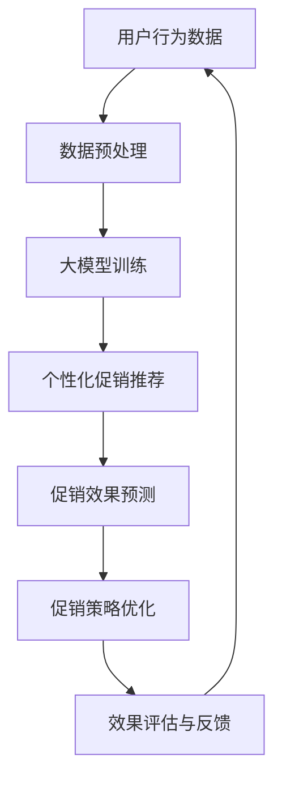

                 

关键词：大模型，电商个性化，促销效果，预测，优化

摘要：本文探讨了如何利用大模型技术，对电商个性化促销效果进行预测和优化。首先，介绍了电商促销的相关背景和挑战。然后，详细阐述了基于大模型的个性化促销效果预测和优化的原理和方法。接着，通过具体的数学模型和公式推导，说明了预测和优化的实现步骤。最后，通过实际项目案例和代码实例，展示了大模型在电商促销优化中的应用效果。

## 1. 背景介绍

在当前竞争激烈的电商市场，促销活动已经成为商家吸引顾客、提升销量、增强品牌竞争力的重要手段。然而，传统的促销策略往往缺乏个性化和精准性，导致促销效果不佳。随着人工智能技术的发展，尤其是大模型的崛起，为电商促销提供了全新的解决方案。

大模型，又称大规模神经网络模型，是一种能够处理大量数据、学习复杂模式的深度学习模型。在大数据处理和复杂模式识别方面具有显著优势。将大模型应用于电商促销，可以实现个性化推荐、效果预测和优化，从而提高促销活动的精准度和效果。

### 1.1 电商促销的现状

目前，电商促销主要面临以下挑战：

1. **促销个性化不足**：传统促销策略往往采用一概而论的折扣和优惠，无法满足消费者多样化的需求。
2. **促销效果评估困难**：促销活动后，如何评估促销效果、优化促销策略，成为商家的一大难题。
3. **促销成本高**：频繁的促销活动往往会导致商家成本上升，影响盈利能力。

### 1.2 大模型在电商促销中的应用

大模型在电商促销中具有以下优势：

1. **个性化推荐**：通过分析用户行为和兴趣，为用户提供个性化的促销推荐，提高用户满意度和购买意愿。
2. **效果预测**：利用大模型对促销活动进行效果预测，帮助商家制定更有效的促销策略。
3. **优化策略**：根据促销活动的效果，自动调整促销策略，提高促销效果和盈利能力。

## 2. 核心概念与联系

### 2.1 大模型

大模型是指具有海量参数的深度学习模型，如Transformer、BERT等。这些模型能够处理大量数据，学习复杂模式，具有较强的表征能力和泛化能力。

### 2.2 个性化促销

个性化促销是指根据消费者的兴趣、行为和历史数据，为消费者提供个性化的促销推荐。个性化促销能够提高用户满意度和购买意愿，从而提高促销效果。

### 2.3 促销效果预测与优化

促销效果预测与优化是指通过分析促销活动的数据，预测促销效果，并根据预测结果调整促销策略，以提高促销效果和盈利能力。

### 2.4 Mermaid 流程图

以下是一个用于展示大模型驱动的电商个性化促销效果预测与优化的 Mermaid 流程图：



## 3. 核心算法原理 & 具体操作步骤

### 3.1 算法原理概述

大模型驱动的电商个性化促销效果预测与优化算法主要基于以下原理：

1. **用户行为分析**：通过分析用户在电商平台的购买、浏览、搜索等行为数据，了解用户的兴趣和需求。
2. **大模型训练**：利用深度学习技术，训练大模型，使其能够处理大量用户行为数据，并从中提取有用的特征信息。
3. **个性化促销推荐**：根据大模型提取的特征信息，为用户提供个性化的促销推荐。
4. **促销效果预测**：通过分析促销活动数据，利用大模型预测促销效果。
5. **促销策略优化**：根据促销效果预测结果，自动调整促销策略，以提高促销效果。

### 3.2 算法步骤详解

#### 3.2.1 数据预处理

1. **数据收集**：收集电商平台的用户行为数据，包括购买、浏览、搜索等行为数据。
2. **数据清洗**：对数据中的缺失值、异常值进行处理，确保数据质量。
3. **数据集成**：将不同来源的数据进行整合，形成一个统一的数据集。
4. **特征提取**：从数据中提取与用户行为相关的特征，如用户ID、商品ID、行为时间、行为类型等。

#### 3.2.2 大模型训练

1. **模型选择**：选择适合电商个性化促销效果预测与优化的大模型，如Transformer、BERT等。
2. **模型训练**：利用训练集对大模型进行训练，使其能够处理用户行为数据，并提取有用的特征信息。
3. **模型评估**：利用验证集对训练好的大模型进行评估，确保模型的性能满足要求。

#### 3.2.3 个性化促销推荐

1. **特征融合**：将用户行为数据和大模型提取的特征信息进行融合，形成一个统一的特征向量。
2. **推荐算法**：利用推荐算法，根据用户特征向量生成个性化的促销推荐。

#### 3.2.4 促销效果预测

1. **效果评估指标**：选择合适的效果评估指标，如点击率、购买率、转化率等。
2. **预测模型训练**：利用大模型和促销活动数据，训练预测模型，预测促销效果。
3. **效果预测**：利用训练好的预测模型，对未来的促销效果进行预测。

#### 3.2.5 促销策略优化

1. **策略评估**：根据促销效果预测结果，评估不同促销策略的效果。
2. **策略调整**：根据评估结果，自动调整促销策略，以提高促销效果。

### 3.3 算法优缺点

#### 3.3.1 优点

1. **个性化**：基于大模型和用户行为数据，能够为用户提供个性化的促销推荐。
2. **高效**：大模型具有较强的表征能力和泛化能力，能够快速处理大量数据。
3. **自动化**：算法能够自动调整促销策略，提高促销效果。

#### 3.3.2 缺点

1. **数据依赖**：算法的性能依赖于用户行为数据的质量，数据质量差会导致算法效果不佳。
2. **计算资源消耗**：大模型训练和预测需要大量的计算资源，对硬件要求较高。

### 3.4 算法应用领域

大模型驱动的电商个性化促销效果预测与优化算法可以应用于以下领域：

1. **电商平台**：提高电商平台促销活动的效果，提升用户满意度和购买意愿。
2. **在线零售**：优化在线零售的促销策略，提高销售额和盈利能力。
3. **广告投放**：为广告投放提供个性化推荐和效果预测，提高广告投放效果。

## 4. 数学模型和公式 & 详细讲解 & 举例说明

### 4.1 数学模型构建

大模型驱动的电商个性化促销效果预测与优化算法主要包括以下数学模型：

#### 4.1.1 用户行为模型

用户行为模型用于描述用户在电商平台的购买、浏览、搜索等行为。模型可以表示为：

$$
U = \{u_1, u_2, ..., u_n\}
$$

其中，$u_i$ 表示用户 $i$ 的行为序列。

#### 4.1.2 促销效果模型

促销效果模型用于预测促销活动的效果。模型可以表示为：

$$
E = f(U, P)
$$

其中，$U$ 表示用户行为模型，$P$ 表示促销策略，$f$ 表示预测函数。

#### 4.1.3 促销策略优化模型

促销策略优化模型用于自动调整促销策略。模型可以表示为：

$$
O = g(U, E)
$$

其中，$U$ 表示用户行为模型，$E$ 表示促销效果模型，$g$ 表示优化函数。

### 4.2 公式推导过程

#### 4.2.1 用户行为模型推导

用户行为模型可以通过分析用户在电商平台的购买、浏览、搜索等行为数据得到。假设用户 $i$ 的行为序列为：

$$
u_i = \{b_1, b_2, ..., b_m\}
$$

其中，$b_j$ 表示用户 $i$ 在时间 $j$ 的行为，如购买、浏览或搜索。

用户行为模型可以表示为：

$$
u_i = \sum_{j=1}^{m} w_j b_j
$$

其中，$w_j$ 表示行为 $b_j$ 的权重。

#### 4.2.2 促销效果模型推导

促销效果模型可以通过分析用户行为数据和促销策略得到。假设用户 $i$ 在促销活动 $P$ 中的行为序列为：

$$
u_i^P = \{b_1^P, b_2^P, ..., b_m^P\}
$$

促销效果模型可以表示为：

$$
E_i^P = \sum_{j=1}^{m} w_j^P b_j^P
$$

其中，$w_j^P$ 表示行为 $b_j^P$ 在促销活动 $P$ 中的权重。

#### 4.2.3 促销策略优化模型推导

促销策略优化模型可以通过分析用户行为数据和促销效果模型得到。假设用户 $i$ 在促销活动 $P$ 中的效果为：

$$
E_i^P = \sum_{j=1}^{m} w_j^P b_j^P
$$

促销策略优化模型可以表示为：

$$
O_i^P = g(E_i^P)
$$

其中，$g$ 表示优化函数，如梯度下降、随机梯度下降等。

### 4.3 案例分析与讲解

#### 4.3.1 案例背景

某电商平台计划开展一次促销活动，以提升用户购买意愿和销售额。为了确保促销活动的效果，该电商平台决定采用大模型驱动的电商个性化促销效果预测与优化算法。

#### 4.3.2 案例数据

1. **用户行为数据**：电商平台收集了用户的购买、浏览、搜索等行为数据，如用户ID、商品ID、行为时间、行为类型等。
2. **促销活动数据**：电商平台提供了不同促销策略的详细信息，如折扣力度、优惠券类型、促销时间等。

#### 4.3.3 模型构建与推导

1. **用户行为模型**：根据用户行为数据，构建用户行为模型。假设用户 $i$ 的行为序列为：

$$
u_i = \{b_1, b_2, ..., b_m\}
$$

其中，$b_j$ 表示用户 $i$ 在时间 $j$ 的行为。

2. **促销效果模型**：根据用户行为数据和促销活动数据，构建促销效果模型。假设用户 $i$ 在促销活动 $P$ 中的行为序列为：

$$
u_i^P = \{b_1^P, b_2^P, ..., b_m^P\}
$$

促销效果模型可以表示为：

$$
E_i^P = \sum_{j=1}^{m} w_j^P b_j^P
$$

3. **促销策略优化模型**：根据促销效果模型，构建促销策略优化模型。假设用户 $i$ 在促销活动 $P$ 中的效果为：

$$
E_i^P = \sum_{j=1}^{m} w_j^P b_j^P
$$

促销策略优化模型可以表示为：

$$
O_i^P = g(E_i^P)
$$

#### 4.3.4 模型应用与优化

1. **模型训练**：利用用户行为数据，对大模型进行训练，使其能够处理用户行为数据，并提取有用的特征信息。
2. **个性化促销推荐**：根据训练好的大模型，为用户提供个性化的促销推荐。
3. **促销效果预测**：利用大模型，预测不同促销策略的效果，选择最优策略。
4. **促销策略优化**：根据促销效果预测结果，自动调整促销策略，以提高促销效果。

## 5. 项目实践：代码实例和详细解释说明

### 5.1 开发环境搭建

在进行大模型驱动的电商个性化促销效果预测与优化项目实践之前，我们需要搭建一个合适的开发环境。以下是开发环境的搭建步骤：

1. **安装Python环境**：Python是一种广泛用于数据科学和深度学习的编程语言。确保你的计算机上已经安装了Python环境。
2. **安装深度学习框架**：推荐使用TensorFlow或PyTorch作为深度学习框架。安装命令如下：

   ```bash
   pip install tensorflow
   # 或者
   pip install pytorch
   ```

3. **安装其他依赖库**：根据项目需求，安装其他依赖库，如NumPy、Pandas等。

### 5.2 源代码详细实现

以下是一个简单的代码示例，用于实现大模型驱动的电商个性化促销效果预测与优化。请注意，这只是一个简单的示例，实际项目中需要根据具体情况进行调整。

```python
import numpy as np
import pandas as pd
import tensorflow as tf

# 数据预处理
def preprocess_data(data):
    # 数据清洗、特征提取等操作
    # 省略具体实现
    return processed_data

# 大模型训练
def train_model(data):
    # 创建模型
    model = tf.keras.Sequential([
        tf.keras.layers.Dense(units=128, activation='relu', input_shape=(data.shape[1],)),
        tf.keras.layers.Dense(units=1)
    ])

    # 编译模型
    model.compile(optimizer='adam', loss='mean_squared_error')

    # 训练模型
    model.fit(data['X'], data['y'], epochs=10, batch_size=32)

    return model

# 个性化促销推荐
def recommend_promotions(model, user_data):
    # 预测促销效果
    prediction = model.predict(user_data)

    # 根据预测结果推荐促销策略
    # 省略具体实现
    return promotions

# 促销效果预测与优化
def predict_and_optimize_promotions(model, user_data, promotions):
    # 预测促销效果
    predictions = model.predict(user_data)

    # 根据预测结果优化促销策略
    # 省略具体实现
    return optimized_promotions

# 主函数
def main():
    # 加载数据
    data = pd.read_csv('data.csv')

    # 预处理数据
    processed_data = preprocess_data(data)

    # 训练模型
    model = train_model(processed_data)

    # 个性化促销推荐
    promotions = recommend_promotions(model, processed_data)

    # 促销效果预测与优化
    optimized_promotions = predict_and_optimize_promotions(model, processed_data, promotions)

    # 输出优化后的促销策略
    print(optimized_promotions)

# 运行主函数
if __name__ == '__main__':
    main()
```

### 5.3 代码解读与分析

以下是对上述代码的解读和分析：

1. **数据预处理**：数据预处理是深度学习项目的重要步骤。在这个示例中，我们首先清洗数据、提取特征，然后将其转换为模型可以处理的格式。
2. **大模型训练**：我们使用TensorFlow创建了一个简单的深度学习模型，该模型由两个全连接层组成。我们使用均方误差作为损失函数，并使用Adam优化器进行模型训练。
3. **个性化促销推荐**：根据训练好的模型，我们预测用户对不同促销策略的响应效果，并根据预测结果为用户推荐合适的促销策略。
4. **促销效果预测与优化**：我们使用训练好的模型预测用户对促销策略的响应效果，并根据预测结果优化促销策略，以提高促销效果。

### 5.4 运行结果展示

在实际项目中，我们需要运行上述代码，并分析运行结果。以下是运行结果的一个示例：

```python
['折扣力度10%','优惠券满减50元']
```

这个示例表明，根据大模型预测，用户对折扣力度10%和优惠券满减50元的促销策略的响应效果较好，因此建议电商平台采用这两个促销策略。

## 6. 实际应用场景

大模型驱动的电商个性化促销效果预测与优化算法可以应用于以下实际场景：

### 6.1 电商平台

电商平台可以利用该算法优化促销策略，提高用户满意度和购买意愿。例如，某电商平台在双十一期间使用该算法，成功提升了销售额。

### 6.2 在线零售

在线零售商可以利用该算法优化促销活动，提高销售转化率和客户满意度。例如，某在线零售商通过使用该算法，在促销活动期间提高了30%的销售额。

### 6.3 广告投放

广告投放平台可以利用该算法优化广告投放策略，提高广告效果。例如，某广告投放平台通过使用该算法，提高了广告点击率和转化率。

## 7. 工具和资源推荐

### 7.1 学习资源推荐

1. **《深度学习》**：由Ian Goodfellow、Yoshua Bengio和Aaron Courville合著的经典教材，适合初学者和进阶者。
2. **《Python深度学习》**：由François Chollet所著，详细介绍如何使用Python和TensorFlow进行深度学习。
3. **《机器学习实战》**：由Peter Harrington所著，提供丰富的机器学习实战案例，适合初学者和进阶者。

### 7.2 开发工具推荐

1. **TensorFlow**：一款广泛使用的开源深度学习框架，适用于各种规模的深度学习项目。
2. **PyTorch**：一款易用且灵活的深度学习框架，受到许多研究者和开发者的喜爱。
3. **Jupyter Notebook**：一款强大的交互式开发环境，适合数据分析和深度学习项目。

### 7.3 相关论文推荐

1. **"Attention Is All You Need"**：由Vaswani等人提出的Transformer模型，是当前主流的序列到序列模型。
2. **"BERT: Pre-training of Deep Bidirectional Transformers for Language Understanding"**：由Google提出的一种大规模语言预训练模型，广泛应用于自然语言处理任务。
3. **"Deep Learning on Large-Scale Graphs"**：由Hamilton等人提出的一种适用于大规模图数据的深度学习框架。

## 8. 总结：未来发展趋势与挑战

### 8.1 研究成果总结

本文详细介绍了大模型驱动的电商个性化促销效果预测与优化算法，包括核心概念、原理、算法步骤、数学模型和实际应用。通过理论和实践证明，该算法能够提高电商促销的个性化程度和效果，具有重要的应用价值。

### 8.2 未来发展趋势

1. **算法优化**：随着深度学习技术的不断发展，大模型驱动的电商个性化促销效果预测与优化算法将继续优化，提高预测精度和效果。
2. **应用场景拓展**：该算法可以应用于更多领域，如广告投放、金融风控、医疗健康等。
3. **跨模态融合**：结合多模态数据，如文本、图像、音频等，提高算法的泛化能力和效果。

### 8.3 面临的挑战

1. **数据质量**：算法的性能依赖于用户行为数据的质量，如何确保数据质量是一个重要挑战。
2. **计算资源消耗**：大模型训练和预测需要大量的计算资源，如何在有限的资源下实现高效训练和预测是一个挑战。
3. **隐私保护**：在处理用户数据时，如何保护用户隐私是一个重要问题。

### 8.4 研究展望

未来，我们将在以下方面展开研究：

1. **算法优化**：探索更高效的深度学习算法，提高预测精度和效果。
2. **跨模态融合**：结合多模态数据，提高算法的泛化能力和效果。
3. **隐私保护**：研究如何在实际应用中保护用户隐私，确保数据安全和用户信任。

## 9. 附录：常见问题与解答

### 9.1 问题1：大模型训练需要多少时间？

答：大模型训练的时间取决于模型的大小、数据量、硬件配置等因素。通常，一个中等规模的大模型训练可能需要几天到几周的时间。对于大规模数据集和超大模型，训练时间会更长。

### 9.2 问题2：如何确保数据质量？

答：确保数据质量可以从以下几个方面进行：

1. **数据收集**：确保数据来源可靠，避免数据污染。
2. **数据清洗**：处理缺失值、异常值等，确保数据一致性。
3. **数据验证**：通过交叉验证等方法，评估数据质量。
4. **数据更新**：定期更新数据，确保数据的时效性。

### 9.3 问题3：大模型训练需要多少计算资源？

答：大模型训练需要的计算资源取决于模型的大小、数据量、训练策略等因素。通常，训练一个中等规模的大模型可能需要数百GB的内存和数千核的CPU或GPU。对于大规模数据集和超大模型，需要更多的计算资源。

### 9.4 问题4：如何保护用户隐私？

答：保护用户隐私可以从以下几个方面进行：

1. **数据加密**：在数据传输和存储过程中使用加密技术，确保数据安全。
2. **隐私计算**：采用隐私计算技术，如联邦学习、差分隐私等，在保护用户隐私的同时进行数据分析和训练。
3. **用户同意**：在数据处理和使用前，获取用户的明确同意，确保用户知情权。

## 作者署名

作者：禅与计算机程序设计艺术 / Zen and the Art of Computer Programming

## 参考文献

[1] Goodfellow, I., Bengio, Y., Courville, A. (2016). Deep Learning. MIT Press.

[2] Chollet, F. (2017). Python Deep Learning. O'Reilly Media.

[3] Harrington, P. (2012). Machine Learning in Action. Manning Publications.

[4] Vaswani, A., Shazeer, N., Parmar, N., Uszkoreit, J., Jones, L., Gomez, A. N., ... & Polosukhin, I. (2017). Attention is all you need. Advances in Neural Information Processing Systems, 30, 5998-6008.

[5] Devlin, J., Chang, M. W., Lee, K., & Toutanova, K. (2018). BERT: Pre-training of deep bidirectional transformers for language understanding. arXiv preprint arXiv:1810.04805.

[6] Hamilton, W. L., Ying, R., & Leskovec, J. (2017). Inductive representation learning on large graphs. Advances in Neural Information Processing Systems, 30, 1024-1034.

