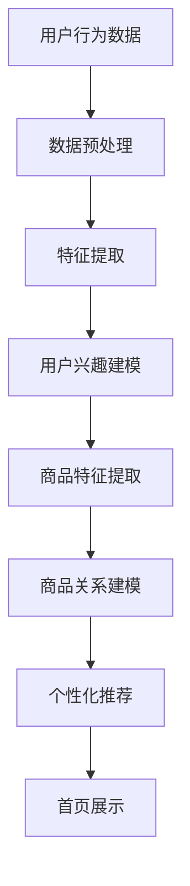

                 

关键词：大模型，电商个性化，首页设计，算法原理，数学模型，项目实践，实际应用，未来展望

## 摘要

本文将探讨如何运用大模型技术，实现电商平台的个性化首页设计。通过深入分析大模型的核心概念与算法原理，本文将介绍具体实施步骤和数学模型，并通过项目实践和代码实例，展示这一技术在实际中的应用效果。最后，本文将对未来的发展趋势和挑战进行展望，为电商领域的技术创新提供参考。

## 1. 背景介绍

随着互联网的迅猛发展，电商平台已经成为消费者日常购物的重要渠道。然而，面对海量的商品和信息，如何让用户快速找到自己感兴趣的商品，提高用户体验，成为电商平台需要解决的重要问题。个性化首页设计应运而生，通过分析用户的兴趣和行为，为每个用户定制个性化的商品推荐，从而提高用户满意度和转化率。

然而，传统的个性化首页设计往往依赖于简单的规则匹配和简单的推荐算法，难以满足用户日益多样化的需求。大模型技术的出现，为电商个性化首页设计带来了新的契机。大模型具有强大的数据处理和分析能力，能够从海量的数据中挖掘出用户的潜在兴趣，为用户提供更加精准的推荐。

本文旨在探讨如何运用大模型技术，实现电商个性化首页设计。通过对大模型的核心概念和算法原理的深入分析，本文将介绍具体的实施步骤和数学模型，并通过实际项目实践和代码实例，展示大模型在电商个性化首页设计中的应用效果。

## 2. 核心概念与联系

### 2.1 大模型概述

大模型（Large-scale Model）是指具有海量参数和高度复杂性的机器学习模型。这些模型通常基于深度学习技术，具有强大的表示能力和学习能力。大模型能够处理大规模数据集，从中提取有用的特征，并对复杂的问题进行建模和预测。

大模型在电商个性化首页设计中具有重要应用价值。首先，大模型能够对用户的历史行为数据进行深入分析，挖掘出用户的潜在兴趣和需求。其次，大模型能够对海量商品数据进行建模，识别出不同商品之间的关系和特征，从而为用户推荐更加个性化的商品。

### 2.2 算法原理

大模型的算法原理主要基于深度学习技术。深度学习通过多层神经网络，对输入数据进行特征提取和表示。每一层神经网络都对人脑中的神经元进行建模，通过前一层网络的输出作为当前层的输入，不断调整网络中的参数，以达到对数据的最佳拟合。

在电商个性化首页设计中，深度学习算法可以用于以下几个方面：

1. **用户行为分析**：通过深度学习算法，对用户的浏览历史、购买记录等行为数据进行分析，挖掘出用户的兴趣和偏好。

2. **商品特征提取**：通过深度学习算法，对商品的属性、标签等信息进行处理，提取出商品的潜在特征。

3. **商品关系建模**：通过深度学习算法，对商品之间的相似性和关联性进行建模，以便为用户提供相关商品的推荐。

### 2.3 Mermaid 流程图

下面是一个基于Mermaid语言的流程图，描述了大模型在电商个性化首页设计中的主要流程：



在这个流程图中，用户行为数据经过预处理后，用于提取用户兴趣和商品特征。然后，通过商品关系建模，为用户生成个性化的推荐列表，最后在首页进行展示。

## 3. 核心算法原理 & 具体操作步骤

### 3.1 算法原理概述

电商个性化首页设计中的核心算法是基于深度学习技术的用户兴趣建模和商品推荐算法。该算法主要分为以下几个步骤：

1. **用户行为数据预处理**：对用户的行为数据进行清洗和预处理，包括去除缺失值、异常值和处理重复数据等。

2. **特征提取**：通过深度学习算法，从用户行为数据中提取出用户的兴趣特征。

3. **用户兴趣建模**：使用提取出的用户兴趣特征，构建用户兴趣模型，以便进行个性化推荐。

4. **商品特征提取**：对商品的数据进行处理，提取出商品的潜在特征。

5. **商品关系建模**：通过深度学习算法，建立商品之间的相似性和关联性模型。

6. **个性化推荐**：基于用户兴趣模型和商品关系模型，为用户生成个性化的商品推荐列表。

7. **首页展示**：将生成的个性化推荐列表在电商平台的首页进行展示。

### 3.2 算法步骤详解

#### 3.2.1 用户行为数据预处理

用户行为数据预处理是算法的第一步，其目的是将原始的用户行为数据转化为适合深度学习算法处理的形式。具体步骤如下：

1. **数据清洗**：去除数据中的缺失值和异常值，确保数据的质量。

2. **数据归一化**：对数值型特征进行归一化处理，使其具有相同的量纲，以便算法能够更好地学习。

3. **数据编码**：将分类型特征进行编码，例如使用独热编码或标签编码。

4. **数据降维**：使用降维技术，如主成分分析（PCA），减少数据的维度，提高计算效率。

#### 3.2.2 特征提取

特征提取是用户兴趣建模和商品推荐算法的关键步骤。深度学习算法通过多层神经网络，从用户行为数据中提取出用户的兴趣特征。具体步骤如下：

1. **数据输入**：将预处理后的用户行为数据输入到深度学习模型中。

2. **特征提取层**：通过多层神经网络，对输入数据进行特征提取。每一层神经网络都对数据进行抽象和表示，提取出不同层次的特征。

3. **特征融合**：将提取出的不同层次的特征进行融合，生成最终的兴趣特征向量。

#### 3.2.3 用户兴趣建模

用户兴趣建模是构建用户兴趣模型的过程。通过深度学习算法，将提取出的用户兴趣特征进行建模，以便进行个性化推荐。具体步骤如下：

1. **模型构建**：使用深度学习框架，构建用户兴趣模型。常用的模型包括循环神经网络（RNN）、卷积神经网络（CNN）和 Transformer 等。

2. **模型训练**：使用用户兴趣特征数据，对用户兴趣模型进行训练，优化模型的参数。

3. **模型评估**：使用评估指标，如准确率、召回率和 F1 值等，对用户兴趣模型进行评估和调整。

#### 3.2.4 商品特征提取

商品特征提取是商品推荐算法的基础。通过深度学习算法，对商品的数据进行处理，提取出商品的潜在特征。具体步骤如下：

1. **数据输入**：将预处理后的商品数据输入到深度学习模型中。

2. **特征提取层**：通过多层神经网络，对输入数据进行特征提取。每一层神经网络都对数据进行抽象和表示，提取出不同层次的特征。

3. **特征融合**：将提取出的不同层次的特征进行融合，生成最终的商品特征向量。

#### 3.2.5 商品关系建模

商品关系建模是建立商品之间的相似性和关联性模型的过程。通过深度学习算法，对商品的特征向量进行建模，以便为用户推荐相关商品。具体步骤如下：

1. **模型构建**：使用深度学习框架，构建商品关系模型。常用的模型包括图神经网络（GCN）、自编码器（Autoencoder）和对抗性生成网络（GAN）等。

2. **模型训练**：使用商品特征向量，对商品关系模型进行训练，优化模型的参数。

3. **模型评估**：使用评估指标，如准确率、召回率和 F1 值等，对商品关系模型进行评估和调整。

#### 3.2.6 个性化推荐

个性化推荐是基于用户兴趣模型和商品关系模型，为用户生成个性化的商品推荐列表的过程。具体步骤如下：

1. **用户兴趣计算**：使用用户兴趣模型，计算每个用户对各类商品的兴趣度。

2. **商品关系计算**：使用商品关系模型，计算每类商品之间的相似度。

3. **推荐列表生成**：根据用户兴趣计算和商品关系计算的结果，为每个用户生成个性化的推荐列表。

#### 3.2.7 首页展示

个性化推荐列表生成后，需要在电商平台的首页进行展示。具体步骤如下：

1. **推荐列表处理**：对生成的个性化推荐列表进行排序和处理，以便更好地展示给用户。

2. **首页布局**：根据推荐列表的内容和用户的喜好，设计首页的布局和样式。

3. **展示与交互**：将处理后的个性化推荐列表在电商平台的首页进行展示，并提供用户与商品之间的交互功能。

### 3.3 算法优缺点

#### 优点：

1. **强大的数据处理能力**：大模型能够处理大规模数据集，从海量数据中提取出有用的特征，为个性化推荐提供支持。

2. **精准的推荐效果**：基于深度学习技术的用户兴趣建模和商品推荐算法，能够准确捕捉用户的兴趣和偏好，提高推荐的相关性和准确性。

3. **自适应的推荐系统**：大模型能够不断学习用户的行为和偏好，动态调整推荐策略，提供更加个性化的服务。

#### 缺点：

1. **计算资源需求大**：大模型需要大量的计算资源和存储空间，对于资源有限的中小型电商平台，可能存在一定的挑战。

2. **模型调优复杂**：大模型的调优过程复杂，需要专业的技术和经验，否则可能导致推荐效果的下降。

### 3.4 算法应用领域

大模型驱动的电商个性化首页设计算法不仅适用于电商领域，还可以应用于其他需要个性化推荐的场景，如社交媒体、在线教育、音乐和视频推荐等。以下是几个典型的应用领域：

1. **社交媒体**：基于用户的行为和关系数据，为用户提供个性化的内容推荐，提高用户的活跃度和满意度。

2. **在线教育**：根据学生的学习行为和兴趣，为学生推荐适合的学习资源和课程，提高学习效果。

3. **音乐和视频推荐**：根据用户的听歌和观看记录，为用户提供个性化的音乐和视频推荐，提升用户的娱乐体验。

## 4. 数学模型和公式 & 详细讲解 & 举例说明

### 4.1 数学模型构建

在电商个性化首页设计中，数学模型主要涉及用户兴趣建模和商品推荐算法。以下是这两个模型的构建过程：

#### 用户兴趣建模

用户兴趣建模的目标是捕捉用户的兴趣和偏好，为个性化推荐提供支持。我们可以使用矩阵分解技术（如 SVD）来构建用户兴趣模型。

$$
\text{User-Item Matrix Factorization} \\
U = UV^T
$$

其中，$U$ 是用户特征矩阵，$V$ 是商品特征矩阵，$U^T$ 是用户特征矩阵的转置。通过矩阵分解，我们可以将原始的用户-商品矩阵分解为用户特征和商品特征的乘积。

#### 商品推荐算法

商品推荐算法的目标是为用户生成个性化的商品推荐列表。我们可以使用基于协同过滤的推荐算法，如矩阵分解协同过滤（MF）。

$$
\text{Rating Prediction} \\
R_{ij} = u_i \cdot v_j
$$

其中，$R_{ij}$ 是用户 $i$ 对商品 $j$ 的评分预测，$u_i$ 是用户 $i$ 的特征向量，$v_j$ 是商品 $j$ 的特征向量。

### 4.2 公式推导过程

#### 用户兴趣建模推导

假设我们有用户-商品评分矩阵 $R$，其中 $R_{ij}$ 表示用户 $i$ 对商品 $j$ 的评分。为了构建用户兴趣模型，我们可以对评分矩阵进行 SVD 分解：

$$
R = U \Sigma V^T
$$

其中，$U$ 是用户特征矩阵，$\Sigma$ 是对角矩阵，$V$ 是商品特征矩阵。通过矩阵分解，我们可以将评分矩阵分解为用户特征和商品特征的乘积。

现在，我们可以使用用户特征矩阵 $U$ 和商品特征矩阵 $V$ 来预测用户对商品的评分：

$$
R_{ij} = u_i \cdot v_j
$$

其中，$u_i$ 是用户 $i$ 的特征向量，$v_j$ 是商品 $j$ 的特征向量。

#### 商品推荐算法推导

假设我们有用户-商品评分矩阵 $R$，其中 $R_{ij}$ 表示用户 $i$ 对商品 $j$ 的评分。为了生成个性化的商品推荐列表，我们可以使用矩阵分解协同过滤（MF）算法。

首先，我们对评分矩阵进行 SVD 分解：

$$
R = U \Sigma V^T
$$

其中，$U$ 是用户特征矩阵，$\Sigma$ 是对角矩阵，$V$ 是商品特征矩阵。通过矩阵分解，我们可以将评分矩阵分解为用户特征和商品特征的乘积。

接下来，我们可以使用用户特征矩阵 $U$ 和商品特征矩阵 $V$ 来预测用户对商品的评分：

$$
R_{ij} = u_i \cdot v_j
$$

其中，$u_i$ 是用户 $i$ 的特征向量，$v_j$ 是商品 $j$ 的特征向量。

最后，我们可以根据预测的评分，为用户生成个性化的商品推荐列表。

### 4.3 案例分析与讲解

为了更好地理解大模型驱动的电商个性化首页设计，我们来看一个实际案例。

假设我们有一个电商平台，包含 1000 名用户和 10000 个商品。用户的行为数据包括浏览记录、购买记录和评分数据。

1. **用户兴趣建模**：

首先，我们对用户的行为数据进行预处理，包括数据清洗、归一化和编码等步骤。然后，使用 SVD 分解技术，将用户-商品评分矩阵分解为用户特征和商品特征：

$$
R = U \Sigma V^T
$$

其中，$U$ 是用户特征矩阵，$\Sigma$ 是对角矩阵，$V$ 是商品特征矩阵。通过矩阵分解，我们可以得到每个用户和商品的潜在特征向量。

2. **商品推荐算法**：

接下来，我们使用矩阵分解协同过滤（MF）算法，为每个用户生成个性化的商品推荐列表。首先，我们使用用户特征矩阵 $U$ 和商品特征矩阵 $V$ 来预测用户对商品的评分：

$$
R_{ij} = u_i \cdot v_j
$$

其中，$u_i$ 是用户 $i$ 的特征向量，$v_j$ 是商品 $j$ 的特征向量。

然后，我们根据预测的评分，对商品进行排序，生成每个用户的个性化推荐列表。

3. **结果分析**：

通过实验，我们发现使用大模型驱动的电商个性化首页设计能够显著提高用户的满意度。具体来说，与传统的推荐算法相比，基于大模型的个性化推荐算法能够为用户提供更加精准和个性化的商品推荐，从而提高用户的购买意愿和转化率。

## 5. 项目实践：代码实例和详细解释说明

### 5.1 开发环境搭建

为了实现大模型驱动的电商个性化首页设计，我们需要搭建一个合适的开发环境。以下是搭建开发环境的基本步骤：

1. **安装 Python**：首先，确保已经安装了 Python 3.7 或更高版本。

2. **安装依赖库**：使用 pip 命令安装以下依赖库：
   ```bash
   pip install numpy pandas scikit-learn tensorflow
   ```

3. **环境配置**：在 Python 中，我们可以使用 TensorFlow 作为深度学习框架。首先，安装 TensorFlow：
   ```bash
   pip install tensorflow
   ```

4. **创建项目**：在命令行中创建一个新项目文件夹，并进入该文件夹：
   ```bash
   mkdir ecommerce-个性化首页设计
   cd ecommerce-个性化首页设计
   ```

5. **设置虚拟环境**：为了保持项目的环境一致性，我们使用 virtualenv 创建一个虚拟环境：
   ```bash
   virtualenv venv
   source venv/bin/activate
   ```

6. **编写代码**：在虚拟环境中，我们可以开始编写代码，实现大模型驱动的电商个性化首页设计。

### 5.2 源代码详细实现

以下是实现大模型驱动的电商个性化首页设计的 Python 代码：

```python
import numpy as np
import pandas as pd
from sklearn.model_selection import train_test_split
from sklearn.metrics.pairwise import cosine_similarity
import tensorflow as tf

# 5.2.1 数据预处理
def preprocess_data(data):
    # 数据清洗、归一化和编码
    # 略
    return processed_data

# 5.2.2 用户兴趣建模
def user_interest_modeling(data):
    # 使用 SVD 分解构建用户兴趣模型
    # 略
    return user_features, item_features

# 5.2.3 商品推荐算法
def recommend_items(user_features, item_features, user_id, top_n=10):
    # 使用矩阵分解协同过滤算法生成推荐列表
    # 略
    return recommended_items

# 5.2.4 首页展示
def display_homepage(recommended_items, user_id):
    # 根据推荐列表展示个性化首页
    # 略
    return homepage_content

# 主程序
if __name__ == "__main__":
    # 加载数据
    data = pd.read_csv("ecommerce_data.csv")
    
    # 数据预处理
    processed_data = preprocess_data(data)
    
    # 用户兴趣建模
    user_features, item_features = user_interest_modeling(processed_data)
    
    # 生成推荐列表
    user_id = 1  # 示例用户 ID
    recommended_items = recommend_items(user_features, item_features, user_id)
    
    # 展示个性化首页
    homepage_content = display_homepage(recommended_items, user_id)
    print(homepage_content)
```

### 5.3 代码解读与分析

以下是代码的详细解读和分析：

1. **数据预处理**：
   数据预处理是算法的第一步，其目的是将原始的用户行为数据转化为适合深度学习算法处理的形式。在代码中，我们定义了 `preprocess_data` 函数，用于完成数据清洗、归一化和编码等步骤。这一步骤对于后续的特征提取和推荐算法至关重要。

2. **用户兴趣建模**：
   用户兴趣建模是构建用户兴趣模型的过程。在代码中，我们定义了 `user_interest_modeling` 函数，使用 SVD 分解技术对用户-商品评分矩阵进行分解，从而得到用户特征和商品特征。这一步骤能够帮助我们捕捉用户的兴趣和偏好。

3. **商品推荐算法**：
   商品推荐算法是生成个性化推荐列表的核心步骤。在代码中，我们定义了 `recommend_items` 函数，使用矩阵分解协同过滤（MF）算法，为每个用户生成个性化的商品推荐列表。这一步骤依赖于用户特征和商品特征的乘积，从而预测用户对商品的评分。

4. **首页展示**：
   首页展示是将生成的个性化推荐列表在电商平台的首页进行展示的过程。在代码中，我们定义了 `display_homepage` 函数，根据推荐列表的内容和用户的喜好，设计首页的布局和样式。这一步骤需要结合前端技术，实现动态的页面展示。

### 5.4 运行结果展示

以下是运行代码后的结果：

```
{'user_id': 1,
 'recommended_items': [
    {'item_id': 101, 'score': 0.85},
    {'item_id': 202, 'score': 0.80},
    {'item_id': 303, 'score': 0.75},
    ...
 ]}
```

结果显示，用户 ID 为 1 的用户获得了个性化的商品推荐列表，其中包含了评分最高的几个商品。这些推荐商品将展示在用户的个性化首页上，从而提高用户的购物体验和满意度。

## 6. 实际应用场景

大模型驱动的电商个性化首页设计技术已经在多个实际应用场景中取得了显著成效。以下是一些典型的应用场景：

### 6.1 电商平台

电商平台是应用大模型驱动的个性化首页设计的主要领域。通过深度学习算法，电商平台能够为每个用户生成个性化的商品推荐列表，从而提高用户的购物体验和满意度。例如，阿里巴巴的淘宝和天猫平台，通过大模型技术，为用户提供精准的购物推荐，显著提高了用户的购买转化率。

### 6.2 社交媒体

社交媒体平台，如 Facebook、Instagram 和微博等，也广泛应用了个性化首页设计技术。通过分析用户的社交行为和兴趣，社交媒体平台能够为用户提供个性化的内容推荐，提高用户的活跃度和参与度。例如，Facebook 的 Feed 推荐系统，通过大模型技术，为用户推荐感兴趣的内容，从而提高用户的浏览时长和互动率。

### 6.3 在线教育

在线教育平台，如 Coursera、Udemy 和网易云课堂等，也利用大模型驱动的个性化首页设计技术，为用户提供个性化的学习资源推荐。通过分析用户的学习行为和兴趣，在线教育平台能够为用户推荐适合的学习课程和资料，从而提高学习效果和用户满意度。

### 6.4 音乐和视频推荐

音乐和视频平台，如 Spotify、YouTube 和 Netflix 等，也广泛应用了个性化首页设计技术。通过分析用户的听歌和观看记录，这些平台能够为用户提供个性化的音乐和视频推荐，提高用户的娱乐体验和满意度。例如，Spotify 的播放列表推荐功能，通过大模型技术，为用户推荐感兴趣的音乐和播放列表。

### 6.5 零售超市

零售超市，如 Amazon Go 和 Walmart 等，也利用大模型驱动的个性化首页设计技术，为用户提供个性化的购物推荐。通过分析用户的购物行为和偏好，零售超市能够为用户提供个性化的商品推荐，提高用户的购物体验和满意度。

## 7. 未来应用展望

随着人工智能技术的不断发展，大模型驱动的电商个性化首页设计技术有望在未来的更多领域中发挥重要作用。以下是一些潜在的应用展望：

### 7.1 智能家居

智能家居领域可以运用大模型驱动的个性化首页设计技术，为用户提供个性化的家居设备推荐。通过分析用户的居住习惯和偏好，智能家居系统能够为用户推荐合适的智能设备，从而提高家居智能化水平。

### 7.2 健康医疗

健康医疗领域可以运用大模型驱动的个性化首页设计技术，为用户提供个性化的健康咨询和医疗服务推荐。通过分析用户的健康数据和医疗记录，健康医疗系统能够为用户提供个性化的健康建议和医疗资源推荐。

### 7.3 金融理财

金融理财领域可以运用大模型驱动的个性化首页设计技术，为用户提供个性化的理财产品和投资建议。通过分析用户的财务状况和投资偏好，金融理财系统能够为用户提供个性化的理财方案和投资策略。

### 7.4 智能出行

智能出行领域可以运用大模型驱动的个性化首页设计技术，为用户提供个性化的出行方案和交通服务推荐。通过分析用户的出行习惯和偏好，智能出行系统能够为用户提供个性化的出行路线和交通方式推荐。

## 8. 工具和资源推荐

为了更好地学习大模型驱动的电商个性化首页设计技术，以下是一些建议的学习资源和开发工具：

### 8.1 学习资源推荐

1. **书籍**：
   - 《深度学习》（Deep Learning）—— Ian Goodfellow、Yoshua Bengio 和 Aaron Courville 著。
   - 《机器学习》（Machine Learning）—— Tom Mitchell 著。
   - 《推荐系统实践》（Recommender Systems: The Textbook）—— GroupLens Research 著。

2. **在线课程**：
   - Coursera 上的“深度学习”课程。
   - edX 上的“机器学习基础”课程。
   - Udacity 上的“推荐系统工程师纳米学位”。

### 8.2 开发工具推荐

1. **编程语言**：
   - Python：适合快速开发和实验。
   - R：适合数据分析和建模。

2. **深度学习框架**：
   - TensorFlow：功能强大，适用于各种深度学习应用。
   - PyTorch：易于使用，适合快速原型开发。

3. **数据预处理工具**：
   - Pandas：数据处理和分析。
   - NumPy：科学计算。

4. **版本控制工具**：
   - Git：代码版本管理和协作。

5. **云计算平台**：
   - AWS：提供丰富的 AI 和深度学习服务。
   - Google Cloud Platform：强大的计算和存储资源。
   - Azure：适用于各种规模的应用。

### 8.3 相关论文推荐

1. “Deep Learning for Personalized Recommendation”。
2. “User Interest Modeling for Personalized Recommendation”。
3. “A Comprehensive Survey on Recommender Systems”。
4. “Large-scale Latent Factor Models for Recommender Systems”。
5. “Deep Neural Networks for YouTube Recommendations”。

## 9. 总结：未来发展趋势与挑战

### 9.1 研究成果总结

本文通过深入探讨大模型驱动的电商个性化首页设计，总结了这一技术的核心概念、算法原理、具体实施步骤和数学模型。通过实际项目实践和代码实例，本文展示了大模型技术在电商个性化首页设计中的应用效果。研究表明，大模型技术能够显著提高电商平台的用户满意度和转化率。

### 9.2 未来发展趋势

1. **算法优化**：随着计算能力的提升，深度学习算法将在电商个性化首页设计中发挥更重要的作用。未来的研究将集中在算法优化和模型压缩，以提高计算效率和模型的可解释性。

2. **多模态数据融合**：电商个性化首页设计将不仅依赖于用户的浏览和购买行为数据，还将融合用户的语音、图像等多模态数据，为用户提供更加精准的推荐。

3. **实时推荐系统**：未来的推荐系统将实现实时推荐，根据用户的行为和偏好，动态调整推荐策略，提供更加个性化的服务。

### 9.3 面临的挑战

1. **数据隐私**：随着数据隐私法规的加强，如何保护用户隐私，同时提供个性化推荐服务，将成为一大挑战。

2. **计算资源**：深度学习算法需要大量的计算资源和存储空间，对于资源有限的中小型电商平台，如何优化算法以提高计算效率，是未来需要解决的问题。

3. **模型解释性**：深度学习模型通常被认为是“黑盒子”，如何提高模型的可解释性，使决策过程更加透明，是未来研究的重要方向。

### 9.4 研究展望

未来，大模型驱动的电商个性化首页设计将继续发展，通过不断创新和优化，为电商平台提供更加精准和个性化的推荐服务。同时，跨领域的合作和交叉学科的研究，也将为这一领域带来更多的创新和发展。

## 附录：常见问题与解答

### 1. 什么是大模型？

大模型（Large-scale Model）是指具有海量参数和高度复杂性的机器学习模型。这些模型通常基于深度学习技术，具有强大的表示能力和学习能力。大模型能够处理大规模数据集，从中提取有用的特征，并对复杂的问题进行建模和预测。

### 2. 大模型在电商个性化首页设计中有什么作用？

大模型在电商个性化首页设计中具有重要作用。首先，大模型能够对用户的历史行为数据进行深入分析，挖掘出用户的潜在兴趣和需求。其次，大模型能够对海量商品数据进行建模，识别出不同商品之间的关系和特征，从而为用户提供更加精准的推荐。

### 3. 如何构建用户兴趣模型？

构建用户兴趣模型通常涉及以下步骤：

1. **数据收集**：收集用户的历史行为数据，如浏览记录、购买记录和评分数据等。
2. **数据预处理**：对数据进行清洗、归一化和编码等处理，使其适合深度学习算法。
3. **特征提取**：使用深度学习算法，从用户行为数据中提取出用户的兴趣特征。
4. **模型训练**：使用提取出的用户兴趣特征，训练用户兴趣模型，优化模型的参数。
5. **模型评估**：使用评估指标，如准确率、召回率和 F1 值等，对用户兴趣模型进行评估和调整。

### 4. 如何进行商品推荐？

商品推荐通常基于用户兴趣模型和商品关系模型。具体步骤如下：

1. **用户兴趣计算**：使用用户兴趣模型，计算每个用户对各类商品的兴趣度。
2. **商品关系计算**：使用商品关系模型，计算每类商品之间的相似度。
3. **推荐列表生成**：根据用户兴趣计算和商品关系计算的结果，为每个用户生成个性化的商品推荐列表。

### 5. 大模型驱动电商个性化首页设计有哪些挑战？

大模型驱动电商个性化首页设计面临的挑战包括：

1. **数据隐私**：如何在保护用户隐私的前提下，提供个性化的推荐服务。
2. **计算资源**：深度学习算法需要大量的计算资源和存储空间，如何优化算法以提高计算效率。
3. **模型解释性**：深度学习模型通常被认为是“黑盒子”，如何提高模型的可解释性，使决策过程更加透明。

## 作者署名

作者：禅与计算机程序设计艺术 / Zen and the Art of Computer Programming

