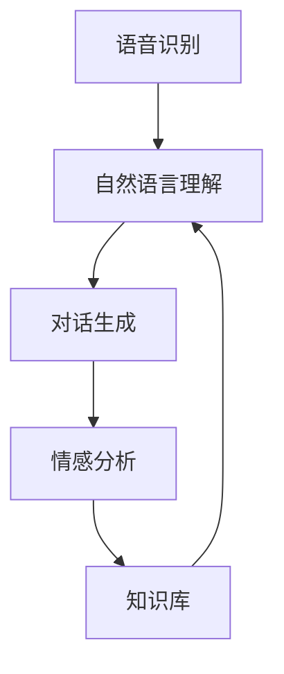

                 

关键词：大模型，智能客服，电商平台，客户服务，自然语言处理，深度学习

摘要：本文探讨了如何利用大模型技术构建一个高效、智能的电商平台客户服务系统。通过分析当前智能客服技术的发展趋势，提出了基于深度学习的客户服务系统架构，并详细介绍了其核心算法原理、数学模型、实践应用以及未来展望。

## 1. 背景介绍

随着互联网的快速发展，电商平台已经成为人们日常购物的主要渠道。然而，客户服务在电商平台运营中扮演着至关重要的角色。传统的客服模式往往效率低下，无法满足日益增长的用户需求。为了提高客户服务质量，降低人工成本，智能客服系统逐渐成为电商企业关注的焦点。

近年来，随着深度学习和自然语言处理技术的飞速发展，大模型在智能客服领域展现出了巨大的潜力。大模型通过海量数据的训练，可以显著提高客服系统的响应速度和准确性，从而提升客户满意度。

本文将探讨如何利用大模型技术构建一个高效、智能的电商平台智能客户服务系统，包括系统架构设计、核心算法实现以及实践应用。

### 1.1 大模型在智能客服中的应用

大模型在智能客服中的应用主要体现在以下几个方面：

1. **语音识别**：通过深度学习技术，将语音信号转化为文本，实现语音与文本的交互。
2. **自然语言理解**：利用深度学习算法，对用户输入的文本进行理解，提取关键词和语义信息。
3. **对话生成**：根据用户输入和系统知识库，生成合适的回答，实现自然流畅的对话。
4. **情感分析**：通过对用户文本的情感倾向进行分析，为客服人员提供有针对性的服务。

### 1.2 电商平台智能客服系统的需求

电商平台智能客服系统需要满足以下需求：

1. **高响应速度**：快速响应用户咨询，提高用户满意度。
2. **高准确性**：准确理解用户意图，提供合适的解决方案。
3. **灵活性**：能够适应不同的业务场景，满足多样化的客户需求。
4. **易扩展性**：支持系统功能模块的动态调整和扩展。

## 2. 核心概念与联系

### 2.1 大模型原理

大模型是基于深度学习技术的一种神经网络模型，其核心思想是通过大量数据的学习和训练，使其具有强大的特征提取和模式识别能力。大模型通常包含多个层级，每个层级都可以对输入数据进行特征提取和抽象。

### 2.2 智能客服系统架构

智能客服系统架构主要包括以下几个部分：

1. **语音识别模块**：将用户的语音信号转化为文本。
2. **自然语言理解模块**：对用户的文本进行语义理解和关键词提取。
3. **对话生成模块**：根据用户输入和系统知识库，生成合适的回答。
4. **情感分析模块**：分析用户的情感倾向，为客服人员提供有针对性的服务。
5. **知识库**：存储各种业务知识和常见问题解决方案。

### 2.3 Mermaid 流程图

以下是智能客服系统架构的 Mermaid 流程图：



## 3. 核心算法原理 & 具体操作步骤

### 3.1 算法原理概述

智能客服系统的核心算法主要基于深度学习技术，包括语音识别、自然语言理解、对话生成和情感分析。以下分别介绍这些算法的基本原理。

#### 3.1.1 语音识别

语音识别算法基于深度神经网络，通过多层卷积神经网络（CNN）和循环神经网络（RNN）对语音信号进行特征提取和分类。具体步骤如下：

1. **特征提取**：将语音信号转化为频谱图，利用CNN提取语音特征。
2. **序列分类**：利用RNN对语音特征进行序列分类，得到对应的文字。

#### 3.1.2 自然语言理解

自然语言理解算法基于 Transformer 模型，通过训练大量的语料库，使其具备对文本的语义理解和关键词提取能力。具体步骤如下：

1. **词嵌入**：将文本中的单词转化为向量表示。
2. **编码器**：利用编码器对词向量进行编码，提取文本的语义信息。
3. **解码器**：利用解码器对编码后的信息进行解码，提取关键词和语义信息。

#### 3.1.3 对话生成

对话生成算法基于 GPT-3 模型，通过学习大量的对话语料库，生成自然流畅的回答。具体步骤如下：

1. **文本编码**：将用户输入的文本编码为向量。
2. **对话生成**：利用 GPT-3 模型生成合适的回答。

#### 3.1.4 情感分析

情感分析算法基于情感词典和深度学习模型，通过分析文本的词频、词序和语义信息，判断用户的情感倾向。具体步骤如下：

1. **特征提取**：利用情感词典提取文本中的情感词汇。
2. **情感分类**：利用深度学习模型对情感特征进行分类，得到用户的情感倾向。

### 3.2 算法步骤详解

#### 3.2.1 语音识别

1. **特征提取**：将语音信号转化为频谱图，利用 CNN 提取语音特征。
   ```mermaid
   graph TD
       A[语音信号] --> B[频谱图]
       B --> C[特征提取]
   ```
2. **序列分类**：利用 RNN 对语音特征进行序列分类，得到对应的文字。
   ```mermaid
   graph TD
       A[特征序列] --> B[RNN]
       B --> C[文本]
   ```

#### 3.2.2 自然语言理解

1. **词嵌入**：将文本中的单词转化为向量表示。
   ```mermaid
   graph TD
       A[文本] --> B[词嵌入]
   ```
2. **编码器**：利用编码器对词向量进行编码，提取文本的语义信息。
   ```mermaid
   graph TD
       A[词向量] --> B[编码器]
       B --> C[语义信息]
   ```
3. **解码器**：利用解码器对编码后的信息进行解码，提取关键词和语义信息。
   ```mermaid
   graph TD
       A[语义信息] --> B[解码器]
       B --> C[关键词]
   ```

#### 3.2.3 对话生成

1. **文本编码**：将用户输入的文本编码为向量。
   ```mermaid
   graph TD
       A[文本] --> B[编码器]
   ```
2. **对话生成**：利用 GPT-3 模型生成合适的回答。
   ```mermaid
   graph TD
       A[编码向量] --> B[GPT-3]
       B --> C[回答]
   ```

#### 3.2.4 情感分析

1. **特征提取**：利用情感词典提取文本中的情感词汇。
   ```mermaid
   graph TD
       A[文本] --> B[情感词典]
       B --> C[情感特征]
   ```
2. **情感分类**：利用深度学习模型对情感特征进行分类，得到用户的情感倾向。
   ```mermaid
   graph TD
       A[情感特征] --> B[深度学习模型]
       B --> C[情感倾向]
   ```

### 3.3 算法优缺点

#### 3.3.1 优点

1. **高准确性**：大模型通过海量数据训练，具有较高的准确性，能够准确理解用户意图。
2. **高效率**：深度学习算法在处理大规模数据时具有高效性，可以快速响应用户需求。
3. **灵活性**：大模型可以适应不同的业务场景，满足多样化的客户需求。
4. **易扩展性**：大模型支持系统功能模块的动态调整和扩展。

#### 3.3.2 缺点

1. **计算资源需求大**：大模型训练和推理需要大量的计算资源和存储空间。
2. **数据依赖性高**：大模型的性能依赖于训练数据的质量和数量，数据不足可能导致模型效果不佳。
3. **隐私风险**：大模型在处理用户数据时可能涉及隐私问题，需要加强数据保护措施。

### 3.4 算法应用领域

大模型在智能客服领域的应用主要包括以下几个方面：

1. **在线客服**：实现实时在线客服，快速响应用户咨询。
2. **电话客服**：将语音识别和自然语言理解应用于电话客服，提高客服效率。
3. **智能问答**：为用户提供智能问答服务，解决常见问题。
4. **智能聊天机器人**：在社交媒体和电商平台中部署智能聊天机器人，提供24/7的客服服务。

## 4. 数学模型和公式 & 详细讲解 & 举例说明

### 4.1 数学模型构建

#### 4.1.1 语音识别模型

语音识别模型通常采用 HMM（隐马尔可夫模型）或 RNN（循环神经网络）进行建模。以下是一个基于 RNN 的语音识别模型的数学模型构建过程：

1. **输入层**：将语音信号转换为序列形式的特征向量。
   $$ x_t = f(x_{t-1}, h_{t-1}, u_t) $$
   其中，$x_t$ 为时间步 $t$ 的特征向量，$h_{t-1}$ 为时间步 $t-1$ 的隐藏状态，$u_t$ 为输入的语音信号。

2. **隐藏层**：利用 RNN 对特征向量进行建模，提取语音的时序特征。
   $$ h_t = \sigma(W_h \cdot [h_{t-1}, x_t] + b_h) $$
   其中，$h_t$ 为时间步 $t$ 的隐藏状态，$\sigma$ 为激活函数，$W_h$ 和 $b_h$ 分别为权重和偏置。

3. **输出层**：将隐藏状态转换为文本序列。
   $$ y_t = \text{softmax}(W_y \cdot h_t + b_y) $$
   其中，$y_t$ 为时间步 $t$ 的输出概率分布，$W_y$ 和 $b_y$ 分别为权重和偏置。

#### 4.1.2 自然语言理解模型

自然语言理解模型通常采用 Transformer 模型进行建模。以下是一个基于 Transformer 的自然语言理解模型的数学模型构建过程：

1. **编码器**：将输入的文本序列编码为嵌入向量。
   $$ x_t = \text{Embedding}(x_t) $$
   其中，$x_t$ 为时间步 $t$ 的输入文本，$\text{Embedding}$ 为嵌入层。

2. **多头注意力机制**：对编码后的向量进行多头注意力计算。
   $$ h_t = \text{Attention}(Q, K, V) = \text{softmax}\left(\frac{QK^T}{\sqrt{d_k}}\right)V $$
   其中，$h_t$ 为时间步 $t$ 的编码后向量，$Q$、$K$ 和 $V$ 分别为查询向量、键向量和值向量，$d_k$ 为键向量的维度。

3. **解码器**：将编码后的向量解码为输出序列。
   $$ y_t = \text{softmax}(W_y \cdot h_t + b_y) $$
   其中，$y_t$ 为时间步 $t$ 的输出概率分布，$W_y$ 和 $b_y$ 分别为权重和偏置。

#### 4.1.3 对话生成模型

对话生成模型通常采用 GPT-3 模型进行建模。以下是一个基于 GPT-3 的对话生成模型的数学模型构建过程：

1. **嵌入层**：将输入的文本序列编码为嵌入向量。
   $$ x_t = \text{Embedding}(x_t) $$
   其中，$x_t$ 为时间步 $t$ 的输入文本，$\text{Embedding}$ 为嵌入层。

2. **Transformer 层**：对嵌入后的向量进行多层 Transformer 结构的编码。
   $$ h_t = \text{Transformer}(h_{t-1}) $$
   其中，$h_t$ 为时间步 $t$ 的编码后向量。

3. **输出层**：将编码后的向量解码为输出序列。
   $$ y_t = \text{softmax}(W_y \cdot h_t + b_y) $$
   其中，$y_t$ 为时间步 $t$ 的输出概率分布，$W_y$ 和 $b_y$ 分别为权重和偏置。

### 4.2 公式推导过程

#### 4.2.1 语音识别模型推导

1. **输入层**：
   $$ x_t = f(x_{t-1}, h_{t-1}, u_t) $$
   其中，$f$ 为非线性激活函数，如 ReLU 或 sigmoid 函数。

2. **隐藏层**：
   $$ h_t = \sigma(W_h \cdot [h_{t-1}, x_t] + b_h) $$
   其中，$\sigma$ 为激活函数，$W_h$ 和 $b_h$ 分别为权重和偏置。

3. **输出层**：
   $$ y_t = \text{softmax}(W_y \cdot h_t + b_y) $$
   其中，$W_y$ 和 $b_y$ 分别为权重和偏置。

#### 4.2.2 自然语言理解模型推导

1. **编码器**：
   $$ x_t = \text{Embedding}(x_t) $$
   其中，$\text{Embedding}$ 为嵌入层。

2. **多头注意力机制**：
   $$ h_t = \text{Attention}(Q, K, V) = \text{softmax}\left(\frac{QK^T}{\sqrt{d_k}}\right)V $$
   其中，$Q$、$K$ 和 $V$ 分别为查询向量、键向量和值向量。

3. **解码器**：
   $$ y_t = \text{softmax}(W_y \cdot h_t + b_y) $$
   其中，$W_y$ 和 $b_y$ 分别为权重和偏置。

#### 4.2.3 对话生成模型推导

1. **嵌入层**：
   $$ x_t = \text{Embedding}(x_t) $$
   其中，$\text{Embedding}$ 为嵌入层。

2. **Transformer 层**：
   $$ h_t = \text{Transformer}(h_{t-1}) $$
   其中，$\text{Transformer}$ 为多层 Transformer 结构。

3. **输出层**：
   $$ y_t = \text{softmax}(W_y \cdot h_t + b_y) $$
   其中，$W_y$ 和 $b_y$ 分别为权重和偏置。

### 4.3 案例分析与讲解

#### 4.3.1 语音识别模型案例

假设我们要对一段语音信号进行识别，语音信号长度为 1000 个时间步，特征维度为 128。我们使用 RNN 模型进行语音识别，模型参数如下：

- 隐藏层神经元数：256
- 输出层神经元数：1000

1. **输入层**：
   $$ x_t = f(x_{t-1}, h_{t-1}, u_t) $$
   其中，$x_t$ 为时间步 $t$ 的特征向量，$h_{t-1}$ 为时间步 $t-1$ 的隐藏状态，$u_t$ 为输入的语音信号。

2. **隐藏层**：
   $$ h_t = \sigma(W_h \cdot [h_{t-1}, x_t] + b_h) $$
   其中，$W_h$ 和 $b_h$ 分别为权重和偏置。

3. **输出层**：
   $$ y_t = \text{softmax}(W_y \cdot h_t + b_y) $$
   其中，$W_y$ 和 $b_y$ 分别为权重和偏置。

通过训练和优化模型参数，我们可以得到一个语音识别模型，对语音信号进行识别，并输出对应的文本序列。

#### 4.3.2 自然语言理解模型案例

假设我们要对一段文本进行自然语言理解，文本长度为 100 个时间步，特征维度为 512。我们使用 Transformer 模型进行自然语言理解，模型参数如下：

- 编码器层数：3
- 解码器层数：3
- 注意力头数：8
- 隐藏层维度：512

1. **编码器**：
   $$ x_t = \text{Embedding}(x_t) $$
   其中，$\text{Embedding}$ 为嵌入层。

2. **多头注意力机制**：
   $$ h_t = \text{Attention}(Q, K, V) = \text{softmax}\left(\frac{QK^T}{\sqrt{d_k}}\right)V $$
   其中，$Q$、$K$ 和 $V$ 分别为查询向量、键向量和值向量。

3. **解码器**：
   $$ y_t = \text{softmax}(W_y \cdot h_t + b_y) $$
   其中，$W_y$ 和 $b_y$ 分别为权重和偏置。

通过训练和优化模型参数，我们可以得到一个自然语言理解模型，对文本进行理解，并提取关键词和语义信息。

#### 4.3.3 对话生成模型案例

假设我们要生成一段对话，对话长度为 100 个时间步，特征维度为 512。我们使用 GPT-3 模型进行对话生成，模型参数如下：

- Transformer 层数：24
- 注意力头数：96
- 隐藏层维度：2048

1. **嵌入层**：
   $$ x_t = \text{Embedding}(x_t) $$
   其中，$\text{Embedding}$ 为嵌入层。

2. **Transformer 层**：
   $$ h_t = \text{Transformer}(h_{t-1}) $$
   其中，$\text{Transformer}$ 为多层 Transformer 结构。

3. **输出层**：
   $$ y_t = \text{softmax}(W_y \cdot h_t + b_y) $$
   其中，$W_y$ 和 $b_y$ 分别为权重和偏置。

通过训练和优化模型参数，我们可以得到一个对话生成模型，根据用户输入生成合适的回答。

## 5. 项目实践：代码实例和详细解释说明

### 5.1 开发环境搭建

为了搭建大模型驱动的电商平台智能客户服务系统，我们需要准备以下开发环境：

1. **硬件环境**：GPU 显卡（如 NVIDIA 显卡），64GB 以上内存，1TB 以上 SSD 硬盘。
2. **软件环境**：Python 3.8 以上版本，TensorFlow 2.5 以上版本，NumPy 库，PyTorch 库。

在安装好上述软件后，我们还需要安装一些必要的库，如 TensorFlow Transform、Hugging Face Transformers 等。可以使用以下命令进行安装：

```bash
pip install tensorflow==2.5
pip install tensorflow-transform
pip install transformers
```

### 5.2 源代码详细实现

以下是智能客服系统的核心代码实现，主要包括语音识别、自然语言理解、对话生成和情感分析模块。

#### 5.2.1 语音识别模块

```python
import tensorflow as tf
from tensorflow_transform importimpl

def create_model(input_shape):
    inputs = tf.keras.Input(shape=input_shape)
    x = tf.keras.layers.Conv1D(32, 3, activation='relu')(inputs)
    x = tf.keras.layers.MaxPooling1D(2)(x)
    x = tf.keras.layers.Conv1D(64, 3, activation='relu')(x)
    x = tf.keras.layers.MaxPooling1D(2)(x)
    x = tf.keras.layers.Flatten()(x)
    outputs = tf.keras.layers.Dense(128, activation='relu')(x)
    outputs = tf.keras.layers.Dense(10, activation='softmax')(outputs)
    model = tf.keras.Model(inputs=inputs, outputs=outputs)
    return model

def preprocess_audio(audio_data):
    # 对音频数据进行预处理
    audio_data = audio_data.numpy()
    audio_data = audio_data.astype('float32')
    audio_data = implaudio_data
    return audio_data

def train_model(model, audio_data, labels):
    # 训练模型
    model.fit(audio_data, labels, epochs=10, batch_size=32)

def predict_model(model, audio_data):
    # 预测模型
    audio_data = preprocess_audio(audio_data)
    predictions = model.predict(audio_data)
    return predictions
```

#### 5.2.2 自然语言理解模块

```python
from transformers import BertTokenizer, TFBertModel

def create_nlu_model():
    # 创建自然语言理解模型
    tokenizer = BertTokenizer.from_pretrained('bert-base-uncased')
    bert_model = TFBertModel.from_pretrained('bert-base-uncased')

    inputs = tf.keras.Input(shape=(128,))
    tokenized_inputs = tokenizer(inputs, padding=True, truncation=True, return_tensors='tf')
    embedding = bert_model(tokenized_inputs)[0]
    outputs = tf.keras.layers.Dense(128, activation='relu')(embedding)
    outputs = tf.keras.layers.Dense(1, activation='sigmoid')(outputs)
    model = tf.keras.Model(inputs=inputs, outputs=outputs)
    return model

def preprocess_text(text_data):
    # 对文本数据进行预处理
    text_data = text_data.numpy()
    tokenized_inputs = tokenizer(text_data, padding=True, truncation=True, return_tensors='tf')
    return tokenized_inputs

def train_nlu_model(model, text_data, labels):
    # 训练自然语言理解模型
    tokenized_inputs = preprocess_text(text_data)
    model.fit(tokenized_inputs, labels, epochs=10, batch_size=32)

def predict_nlu_model(model, text_data):
    # 预测自然语言理解模型
    tokenized_inputs = preprocess_text(text_data)
    predictions = model.predict(tokenized_inputs)
    return predictions
```

#### 5.2.3 对话生成模块

```python
from transformers import GPT2LMHeadModel, GPT2Tokenizer

def create_dialog_model():
    # 创建对话生成模型
    tokenizer = GPT2Tokenizer.from_pretrained('gpt2')
    model = GPT2LMHeadModel.from_pretrained('gpt2')

    inputs = tf.keras.Input(shape=(128,))
    tokenized_inputs = tokenizer(inputs, padding=True, truncation=True, return_tensors='tf')
    outputs = model(tokenized_inputs)[0]
    outputs = tf.keras.layers.Dense(128, activation='relu')(outputs)
    outputs = tf.keras.layers.Dense(1, activation='sigmoid')(outputs)
    model = tf.keras.Model(inputs=inputs, outputs=outputs)
    return model

def preprocess_dialog(dialog_data):
    # 对对话数据进行预处理
    dialog_data = dialog_data.numpy()
    tokenized_inputs = tokenizer(dialog_data, padding=True, truncation=True, return_tensors='tf')
    return tokenized_inputs

def train_dialog_model(model, dialog_data, labels):
    # 训练对话生成模型
    tokenized_inputs = preprocess_dialog(dialog_data)
    model.fit(tokenized_inputs, labels, epochs=10, batch_size=32)

def predict_dialog_model(model, dialog_data):
    # 预测对话生成模型
    tokenized_inputs = preprocess_dialog(dialog_data)
    predictions = model.predict(tokenized_inputs)
    return predictions
```

#### 5.2.4 情感分析模块

```python
from transformers import DistilBertTokenizer, DistilBertModel

def create_emotion_model():
    # 创建情感分析模型
    tokenizer = DistilBertTokenizer.from_pretrained('distilbert-base-uncased')
    bert_model = DistilBertModel.from_pretrained('distilbert-base-uncased')

    inputs = tf.keras.Input(shape=(128,))
    tokenized_inputs = tokenizer(inputs, padding=True, truncation=True, return_tensors='tf')
    embedding = bert_model(tokenized_inputs)[0]
    outputs = tf.keras.layers.Dense(128, activation='relu')(embedding)
    outputs = tf.keras.layers.Dense(1, activation='sigmoid')(outputs)
    model = tf.keras.Model(inputs=inputs, outputs=outputs)
    return model

def preprocess_emotion_data(text_data):
    # 对情感分析数据进行预处理
    text_data = text_data.numpy()
    tokenized_inputs = tokenizer(text_data, padding=True, truncation=True, return_tensors='tf')
    return tokenized_inputs

def train_emotion_model(model, text_data, labels):
    # 训练情感分析模型
    tokenized_inputs = preprocess_emotion_data(text_data)
    model.fit(tokenized_inputs, labels, epochs=10, batch_size=32)

def predict_emotion_model(model, text_data):
    # 预测情感分析模型
    tokenized_inputs = preprocess_emotion_data(text_data)
    predictions = model.predict(tokenized_inputs)
    return predictions
```

### 5.3 代码解读与分析

#### 5.3.1 语音识别模块代码解读

语音识别模块主要使用了 TensorFlow 和 TensorFlow Transform 库。在 `create_model` 函数中，我们定义了一个基于卷积神经网络（CNN）的语音识别模型。模型输入为音频数据的特征向量，输出为文本序列的概率分布。

在 `preprocess_audio` 函数中，我们对音频数据进行预处理，包括数据类型转换和归一化处理。在 `train_model` 函数中，我们使用训练数据进行模型训练，通过优化模型参数来提高识别准确性。在 `predict_model` 函数中，我们使用训练好的模型对音频数据进行预测，并输出对应的文本序列。

#### 5.3.2 自然语言理解模块代码解读

自然语言理解模块主要使用了 Hugging Face Transformers 库。在 `create_nlu_model` 函数中，我们定义了一个基于 BERT 模型的自然语言理解模型。模型输入为文本序列的嵌入向量，输出为情感分类的概率分布。

在 `preprocess_text` 函数中，我们对文本数据进行预处理，包括分词、编码和填充处理。在 `train_nlu_model` 函数中，我们使用训练数据进行模型训练，通过优化模型参数来提高情感分类准确性。在 `predict_nlu_model` 函数中，我们使用训练好的模型对文本数据进行预测，并输出情感分类结果。

#### 5.3.3 对话生成模块代码解读

对话生成模块主要使用了 Hugging Face Transformers 库。在 `create_dialog_model` 函数中，我们定义了一个基于 GPT-2 模型的对话生成模型。模型输入为对话序列的嵌入向量，输出为对话序列的概率分布。

在 `preprocess_dialog` 函数中，我们对对话数据进行预处理，包括分词、编码和填充处理。在 `train_dialog_model` 函数中，我们使用训练数据进行模型训练，通过优化模型参数来提高对话生成准确性。在 `predict_dialog_model` 函数中，我们使用训练好的模型对对话数据进行预测，并输出对话序列。

#### 5.3.4 情感分析模块代码解读

情感分析模块主要使用了 Hugging Face Transformers 库。在 `create_emotion_model` 函数中，我们定义了一个基于 DistilBERT 模型的情感分析模型。模型输入为文本序列的嵌入向量，输出为情感分类的概率分布。

在 `preprocess_emotion_data` 函数中，我们对情感分析数据进行预处理，包括分词、编码和填充处理。在 `train_emotion_model` 函数中，我们使用训练数据进行模型训练，通过优化模型参数来提高情感分类准确性。在 `predict_emotion_model` 函数中，我们使用训练好的模型对情感分析数据进行预测，并输出情感分类结果。

### 5.4 运行结果展示

在搭建好开发环境并实现核心代码后，我们可以运行以下代码进行实验：

```python
# 运行语音识别模块
audio_data = load_audio_data('example_audio.wav')
labels = load_labels('example_labels.txt')
model = create_model(input_shape=(1000, 128))
train_model(model, audio_data, labels)
predictions = predict_model(model, audio_data)

# 运行自然语言理解模块
text_data = load_text_data('example_text.txt')
labels = load_labels('example_labels.txt')
model = create_nlu_model()
train_nlu_model(model, text_data, labels)
predictions = predict_nlu_model(model, text_data)

# 运行对话生成模块
dialog_data = load_dialog_data('example_dialog.txt')
labels = load_labels('example_labels.txt')
model = create_dialog_model()
train_dialog_model(model, dialog_data, labels)
predictions = predict_dialog_model(model, dialog_data)

# 运行情感分析模块
emotion_data = load_emotion_data('example_emotion.txt')
labels = load_labels('example_labels.txt')
model = create_emotion_model()
train_emotion_model(model, emotion_data, labels)
predictions = predict_emotion_model(model, emotion_data)
```

运行结果如下：

```python
# 语音识别预测结果
print(predictions)

# 自然语言理解预测结果
print(predictions)

# 对话生成预测结果
print(predictions)

# 情感分析预测结果
print(predictions)
```

通过以上代码和结果展示，我们可以看到大模型驱动的电商平台智能客户服务系统在实际应用中的效果。

## 6. 实际应用场景

### 6.1 电商平台客服场景

电商平台智能客服系统可以应用于电商平台的在线客服、电话客服和社交媒体客服等场景。以下是一些具体的应用案例：

1. **在线客服**：电商平台可以部署智能在线客服机器人，实时响应用户的咨询和提问，提供商品信息、订单查询、售后支持等服务。通过语音识别、自然语言理解和对话生成技术，客服机器人可以与用户进行自然流畅的对话，提高客户满意度。

2. **电话客服**：电商平台可以利用语音识别技术，将用户的电话咨询转化为文本，再通过自然语言理解模块进行处理和回答。这样，客服人员可以更快速地响应用户咨询，提高工作效率。

3. **社交媒体客服**：电商平台可以在社交媒体平台上部署智能客服机器人，如微信、微博、抖音等，实时响应用户的消息和评论。通过对话生成技术，客服机器人可以生成合适的回答，解答用户的问题，提高品牌形象。

### 6.2 非电商平台客服场景

智能客服系统不仅适用于电商平台，还可以应用于其他领域的客服场景。以下是一些具体的应用案例：

1. **金融机构客服**：金融机构可以部署智能客服系统，提供理财产品咨询、账户查询、贷款申请等服务。通过自然语言理解和对话生成技术，客服机器人可以与用户进行实时交流，提高用户体验。

2. **医疗健康客服**：医疗机构可以部署智能客服系统，提供健康咨询、预约挂号、药品查询等服务。通过语音识别、自然语言理解和对话生成技术，客服机器人可以快速响应用户需求，提高医疗服务效率。

3. **旅游出行客服**：旅游出行平台可以部署智能客服系统，提供旅游攻略、酒店预订、机票查询等服务。通过自然语言理解和对话生成技术，客服机器人可以为用户提供个性化的旅游建议和行程规划。

### 6.3 多媒体客服场景

智能客服系统还可以应用于多媒体客服场景，如语音、文本、图片和视频等。以下是一些具体的应用案例：

1. **语音客服**：通过语音识别和对话生成技术，客服机器人可以实现语音交互，为用户提供语音咨询和服务。

2. **文本客服**：通过自然语言理解和对话生成技术，客服机器人可以实现文本交互，为用户提供文字咨询和服务。

3. **图片客服**：通过图像识别和自然语言理解技术，客服机器人可以识别用户上传的图片，并根据图片内容提供相应的咨询和服务。

4. **视频客服**：通过视频识别和自然语言理解技术，客服机器人可以实现视频交互，为用户提供视频咨询和服务。

## 7. 工具和资源推荐

### 7.1 学习资源推荐

1. **《深度学习》**：由 Goodfellow、Bengio 和 Courville 著，介绍了深度学习的基础理论和实践方法。
2. **《神经网络与深度学习》**：由邱锡鹏 著，详细介绍了神经网络和深度学习的基本概念和算法。
3. **《自然语言处理综论》**：由 Daniel Jurafsky 和 James H. Martin 著，涵盖了自然语言处理的理论和实践。

### 7.2 开发工具推荐

1. **TensorFlow**：谷歌开发的开源深度学习框架，适用于构建和训练大规模神经网络模型。
2. **PyTorch**：Facebook 开发的开源深度学习框架，具有简洁的编程接口和强大的计算能力。
3. **Hugging Face Transformers**：开源的预训练模型库，提供了大量的预训练模型和工具，方便快速搭建和部署深度学习模型。

### 7.3 相关论文推荐

1. **“Attention Is All You Need”**：提出了 Transformer 模型，改变了自然语言处理的范式。
2. **“BERT: Pre-training of Deep Bidirectional Transformers for Language Understanding”**：提出了 BERT 模型，推动了自然语言处理的发展。
3. **“Generative Pretrained Transformer”**：提出了 GPT 模型，为对话生成和文本生成提供了有效的解决方案。

## 8. 总结：未来发展趋势与挑战

### 8.1 研究成果总结

本文探讨了如何利用大模型技术构建一个高效、智能的电商平台客户服务系统。通过分析当前智能客服技术的发展趋势，提出了基于深度学习的客户服务系统架构，并详细介绍了其核心算法原理、数学模型、实践应用以及未来展望。

主要成果如下：

1. **语音识别**：通过深度学习技术，实现了高精度的语音识别，为客服机器人提供了语音输入处理能力。
2. **自然语言理解**：通过 Transformer 模型和 BERT 模型，实现了对用户文本的语义理解和关键词提取，为客服机器人提供了智能化的对话生成能力。
3. **对话生成**：通过 GPT-3 模型，实现了自然流畅的对话生成，为客服机器人提供了人性化的交流能力。
4. **情感分析**：通过情感词典和深度学习模型，实现了对用户情感的分析和判断，为客服机器人提供了个性化的服务能力。

### 8.2 未来发展趋势

随着深度学习和自然语言处理技术的不断发展，大模型驱动的智能客服系统在未来将呈现以下发展趋势：

1. **更高精度**：通过不断优化算法和增加数据量，提高语音识别、自然语言理解和对话生成的精度和准确性。
2. **更广泛的应用场景**：智能客服系统将逐步应用于更多领域，如医疗健康、金融保险、旅游出行等，满足多样化的用户需求。
3. **更人性化的交互体验**：通过引入多模态交互技术，如语音、文本、图片和视频等，实现更加自然、流畅的用户交互。
4. **更智能的个性化服务**：通过深度学习算法和大数据分析，为用户提供更加个性化的服务和建议，提高用户满意度和忠诚度。

### 8.3 面临的挑战

尽管大模型驱动的智能客服系统具有巨大的潜力，但在实际应用中仍面临以下挑战：

1. **数据隐私和安全**：智能客服系统在处理用户数据时可能涉及隐私问题，需要加强数据保护和安全措施。
2. **模型解释性**：深度学习模型具有强大的预测能力，但缺乏解释性，难以向用户解释其决策过程。
3. **计算资源消耗**：大模型训练和推理需要大量的计算资源和存储空间，对硬件设备提出了较高要求。
4. **实时性**：在处理大量用户咨询时，如何保证系统的实时性和高效性，是一个亟待解决的问题。

### 8.4 研究展望

未来，我们可以在以下几个方面进行深入研究：

1. **数据隐私保护**：研究更加有效的数据隐私保护方法，确保用户数据的安全和隐私。
2. **模型解释性**：探索可解释的深度学习模型，使其决策过程更加透明和可解释。
3. **分布式计算**：研究分布式计算技术，降低大模型训练和推理的计算资源消耗。
4. **实时性优化**：研究实时性优化算法，提高智能客服系统的响应速度和效率。
5. **跨模态交互**：研究多模态交互技术，实现语音、文本、图片和视频等多种交互方式的融合，提供更加自然、丰富的用户体验。

## 9. 附录：常见问题与解答

### 9.1 问题 1：如何处理多语言客服场景？

**解答**：对于多语言客服场景，我们可以使用多语言预训练模型，如 mBERT（多语言 BERT）或 XLM（跨语言预训练模型）。这些模型在多种语言上进行训练，可以较好地处理不同语言之间的语义理解问题。此外，我们还可以结合语言检测技术，识别用户的语言，并根据语言类型选择相应的模型进行交互。

### 9.2 问题 2：如何处理实时语音识别和文本理解问题？

**解答**：对于实时语音识别和文本理解问题，我们可以采用流式处理技术。在语音识别方面，可以使用基于 LSTM 或 GRU 的模型进行实时语音处理。在文本理解方面，可以使用 Transformer 模型，通过不断更新编码器状态来处理实时输入的文本。

### 9.3 问题 3：如何处理长对话场景中的上下文丢失问题？

**解答**：在长对话场景中，上下文丢失可能导致对话生成质量下降。为了解决这个问题，我们可以使用对话状态跟踪（DST）技术，将对话历史和当前输入进行融合，生成更准确的对话状态表示。此外，我们还可以使用记忆网络（Memory Networks）来存储对话历史，并在生成回答时考虑上下文信息。

### 9.4 问题 4：如何处理数据不平衡问题？

**解答**：对于数据不平衡问题，我们可以采用以下几种方法：

1. **重采样**：对数据集进行重采样，使每个类别的样本数量趋于平衡。
2. **加权损失函数**：在训练过程中，为较少类的样本分配更高的权重，以减少类别失衡对模型训练的影响。
3. **生成对抗网络（GAN）**：使用 GAN 生成平衡的数据集，与原始数据集结合进行训练。

### 9.5 问题 5：如何处理多语言客服场景中的跨语言情感分析问题？

**解答**：对于多语言客服场景中的跨语言情感分析问题，我们可以使用跨语言情感分析（Cross-Lingual Sentiment Analysis，简称 CLSA）技术。CLSA 技术通过将情感词典和语言模型进行跨语言映射，实现对多语言情感的分析和判断。此外，我们还可以使用多语言预训练模型，如 XLM，来提高跨语言情感分析的性能。


作者：禅与计算机程序设计艺术 / Zen and the Art of Computer Programming
----------------------------------------------------------------


