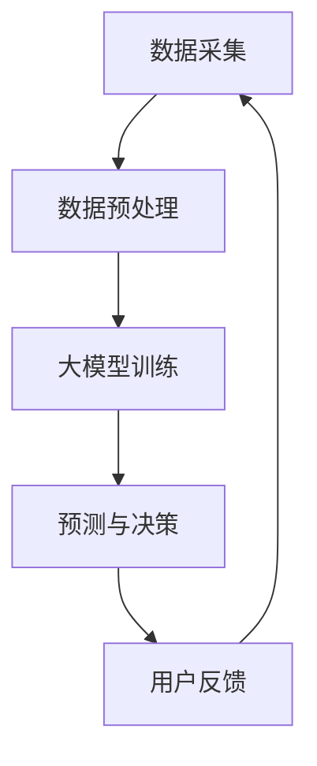

                 

关键词：大模型、电商平台、智能客户洞察、人工智能、机器学习、自然语言处理、用户行为分析

## 摘要

本文旨在探讨大模型在电商平台中的应用，特别是如何利用这些模型进行智能客户洞察。我们将深入分析大模型的原理和实现方法，并详细描述其在电商平台中的应用场景。文章还将介绍大模型在用户行为分析、个性化推荐、用户情感分析等方面的实际应用，并通过数学模型和案例研究展示其具体操作过程。最后，我们将展望大模型在电商平台智能客户洞察领域的未来发展趋势和面临的挑战。

## 1. 背景介绍

随着互联网的迅速发展，电商平台已经成为全球商业活动的重要阵地。然而，面对海量的用户数据和市场动态，传统的数据分析方法已经难以满足电商平台的运营需求。此时，人工智能和机器学习技术开始发挥关键作用，特别是大模型的兴起，为电商平台提供了前所未有的洞察能力。

大模型，即大型的人工神经网络模型，通常包含数十亿到数万亿个参数。这些模型通过深度学习算法从海量数据中自动学习特征，并在各种复杂任务中表现出色。在电商平台中，大模型的应用不仅可以帮助企业更好地理解用户行为，还可以提高运营效率，优化用户体验。

### 电商平台的发展历程

电商平台的起源可以追溯到20世纪90年代，当时互联网刚刚兴起。最早的电商平台主要是简单的在线商店，提供有限的产品和简单的搜索功能。随着互联网技术的不断发展，电商平台逐渐成为商业活动的重要平台，各种创新功能不断涌现，如在线支付、用户评论、个性化推荐等。

进入21世纪，移动互联网的普及进一步推动了电商平台的发展。用户可以通过手机随时随地进行购物，电商平台开始提供更加丰富的服务和更加个性化的体验。这一阶段，电商平台开始重视用户数据的价值，通过数据分析来优化运营策略。

近年来，人工智能和机器学习技术的成熟，使得电商平台的数据分析能力得到了极大的提升。大模型的应用，使得电商平台能够更加深入地理解用户行为，实现更加精准的个性化推荐和智能客服。

### 人工智能和机器学习在电商平台的应用

人工智能和机器学习技术在电商平台中的应用已经非常广泛，包括用户行为分析、个性化推荐、智能客服、风险控制等多个方面。

用户行为分析是通过分析用户在平台上的行为数据，如浏览、搜索、购买等，来了解用户需求和偏好。机器学习算法可以帮助电商平台预测用户的购买意图，从而提供更加个性化的推荐。

个性化推荐是电商平台的核心功能之一。通过分析用户的历史行为和兴趣，大模型可以推荐用户可能感兴趣的商品或服务。这种推荐不仅提高了用户的购物体验，还大大提高了平台的销售额。

智能客服是电商平台提高服务质量的重要手段。大模型可以理解用户的自然语言提问，并给出准确的回答，从而提供高效的客户服务。

风险控制是电商平台必须面对的挑战之一。通过分析用户行为和交易数据，大模型可以识别潜在的风险，如欺诈行为、恶意评论等，从而采取措施进行预防和处理。

## 2. 核心概念与联系

### 大模型的基本原理

大模型，即大型的人工神经网络模型，其基本原理是通过多层神经网络结构对大量数据进行自动学习和特征提取。大模型通常包含数十亿到数万亿个参数，通过反向传播算法不断调整这些参数，以最小化预测误差。

大模型的核心组成部分包括：

1. **输入层**：接收用户数据，如浏览记录、搜索历史、购买行为等。
2. **隐藏层**：通过神经网络结构对输入数据进行处理，提取特征信息。
3. **输出层**：根据提取的特征进行预测或分类。

### 电商平台中的数据来源

电商平台中的数据来源主要包括以下几个方面：

1. **用户行为数据**：用户的浏览记录、搜索历史、购买行为等。
2. **商品数据**：商品的详细信息，如名称、价格、描述等。
3. **交易数据**：用户的交易记录，包括购买时间、金额、支付方式等。
4. **外部数据**：如社交媒体数据、新闻报道等。

这些数据通过数据采集系统收集后，经过清洗和预处理，输入到大模型中进行训练和预测。

### 大模型在电商平台中的应用

大模型在电商平台中的应用主要包括以下几个方面：

1. **用户行为分析**：通过分析用户行为数据，大模型可以了解用户的需求和偏好，为个性化推荐提供依据。
2. **个性化推荐**：基于用户行为数据和商品信息，大模型可以生成个性化的推荐结果，提高用户的购物体验。
3. **用户情感分析**：通过分析用户的评论和反馈，大模型可以识别用户的情感倾向，为产品改进和营销策略提供支持。
4. **风险控制**：通过分析交易数据和行为特征，大模型可以识别潜在的欺诈行为，为电商平台提供安全保障。

### 大模型与电商平台的关系

大模型与电商平台之间的关系可以用一个简单的Mermaid流程图来表示：



在这个流程中，数据采集是整个过程的起点，通过数据预处理将原始数据转化为适合训练的格式。大模型训练是通过多层神经网络结构对数据进行学习，提取特征信息。预测与决策是利用训练好的模型对新的数据进行预测和决策，如个性化推荐、用户情感分析等。用户反馈则是根据预测结果和用户行为，不断优化模型性能。

## 3. 核心算法原理 & 具体操作步骤

### 3.1 算法原理概述

大模型在电商平台中的应用主要依赖于深度学习算法，其中最常用的算法是循环神经网络（RNN）和变换器（Transformer）。这些算法通过多层神经网络结构对海量数据进行自动学习和特征提取，从而实现复杂的预测和分类任务。

RNN是处理序列数据的常用算法，其核心思想是利用隐藏状态来记忆序列中的信息。RNN在用户行为分析、用户情感分析等领域表现出色。

Transformer是近年来兴起的一种算法，其在处理长序列数据和并行计算方面具有显著优势。Transformer在个性化推荐、风险控制等领域得到了广泛应用。

### 3.2 算法步骤详解

#### 用户行为分析

1. **数据采集**：通过电商平台的数据采集系统，收集用户的浏览记录、搜索历史、购买行为等数据。
2. **数据预处理**：对采集到的原始数据进行清洗和预处理，包括去重、缺失值填充、数据规范化等。
3. **特征提取**：利用RNN或Transformer算法，从预处理后的数据中提取特征信息，如用户兴趣、购买意图等。
4. **模型训练**：将提取的特征输入到训练模型中，通过反向传播算法不断调整模型参数，以最小化预测误差。
5. **预测与决策**：利用训练好的模型对新的数据进行预测，如预测用户的购买意图，为个性化推荐提供依据。

#### 个性化推荐

1. **用户行为分析**：根据用户的历史行为数据，利用RNN或Transformer算法提取用户兴趣特征。
2. **商品信息处理**：对商品信息进行预处理，包括去重、数据规范化等。
3. **相似度计算**：计算用户兴趣特征与商品特征之间的相似度，筛选出与用户兴趣相近的商品。
4. **推荐生成**：根据相似度计算结果，生成个性化的推荐列表。

#### 用户情感分析

1. **数据采集**：通过电商平台的数据采集系统，收集用户的评论和反馈数据。
2. **数据预处理**：对采集到的原始评论数据进行清洗和预处理，包括去标点、去除停用词等。
3. **情感分类模型训练**：利用RNN或Transformer算法，从预处理后的评论数据中提取特征信息，训练情感分类模型。
4. **情感分析**：利用训练好的模型对新的评论数据进行分析，判断用户的情感倾向。

#### 风险控制

1. **用户行为分析**：利用RNN或Transformer算法，从用户的行为数据中提取潜在的风险特征。
2. **风险模型训练**：利用提取的风险特征，训练风险识别模型。
3. **风险识别**：利用训练好的模型对新的用户行为数据进行分析，判断是否存在潜在风险。
4. **风险处理**：根据风险识别结果，采取相应的措施进行风险控制和处理。

### 3.3 算法优缺点

#### RNN的优点：

1. **能够处理序列数据**：RNN能够有效地处理时间序列数据，如用户行为数据。
2. **易于实现**：RNN的结构相对简单，实现起来较为容易。

#### RNN的缺点：

1. **梯度消失与梯度爆炸**：在训练过程中，RNN容易出现梯度消失或梯度爆炸问题，导致训练不稳定。
2. **长距离依赖问题**：RNN在处理长序列数据时，难以捕捉到长距离依赖关系。

#### Transformer的优点：

1. **并行计算**：Transformer能够更好地支持并行计算，提高训练效率。
2. **捕捉长距离依赖**：通过自注意力机制，Transformer能够有效地捕捉长距离依赖关系。

#### Transformer的缺点：

1. **计算复杂度高**：Transformer的计算复杂度较高，对硬件资源要求较高。
2. **实现难度较大**：Transformer的结构较为复杂，实现起来相对困难。

### 3.4 算法应用领域

RNN和Transformer在电商平台的多个应用领域都有广泛的应用，包括用户行为分析、个性化推荐、用户情感分析和风险控制等。

1. **用户行为分析**：利用RNN和Transformer算法，可以有效地分析用户的浏览、搜索、购买行为，预测用户的购买意图，为个性化推荐提供依据。
2. **个性化推荐**：通过RNN和Transformer算法，可以生成个性化的推荐列表，提高用户的购物体验。
3. **用户情感分析**：利用RNN和Transformer算法，可以分析用户的评论和反馈，识别用户的情感倾向，为产品改进和营销策略提供支持。
4. **风险控制**：通过RNN和Transformer算法，可以识别潜在的风险，如欺诈行为、恶意评论等，为电商平台提供安全保障。

## 4. 数学模型和公式 & 详细讲解 & 举例说明

### 4.1 数学模型构建

在电商平台的大模型应用中，数学模型的构建是关键环节。本文将介绍两种常用的数学模型：循环神经网络（RNN）和变换器（Transformer）。

#### RNN数学模型

RNN的数学模型可以表示为：

$$
h_t = \sigma(W_h \cdot [h_{t-1}, x_t] + b_h)
$$

其中，$h_t$是第$t$时刻的隐藏状态，$x_t$是输入数据，$W_h$是权重矩阵，$b_h$是偏置项，$\sigma$是激活函数，通常取为ReLU函数。

#### Transformer数学模型

Transformer的数学模型主要包括自注意力机制和前馈神经网络。自注意力机制可以表示为：

$$
\text{Attention}(Q, K, V) = \frac{QK^T}{\sqrt{d_k}} \cdot V
$$

其中，$Q$、$K$、$V$分别是查询向量、键向量和值向量，$d_k$是键向量的维度。

前馈神经网络可以表示为：

$$
\text{FFN}(X) = \max(0, XW_1 + b_1)W_2 + b_2
$$

其中，$X$是输入数据，$W_1$、$W_2$是权重矩阵，$b_1$、$b_2$是偏置项。

### 4.2 公式推导过程

#### RNN公式推导

RNN的公式推导主要包括两部分：前向传播和反向传播。

1. **前向传播**

$$
h_t = \sigma(W_h \cdot [h_{t-1}, x_t] + b_h)
$$

2. **反向传播**

$$
\begin{aligned}
&\frac{\partial L}{\partial h_t} = \frac{\partial L}{\partial y} \cdot \frac{\partial y}{\partial h_t} \\
&\frac{\partial L}{\partial W_h} = \frac{\partial L}{\partial h_t} \cdot h_{t-1}^T \\
&\frac{\partial L}{\partial b_h} = \frac{\partial L}{\partial h_t}
\end{aligned}
$$

其中，$L$是损失函数，$y$是预测结果。

#### Transformer公式推导

Transformer的公式推导主要包括自注意力机制和前馈神经网络的推导。

1. **自注意力机制**

$$
\text{Attention}(Q, K, V) = \frac{QK^T}{\sqrt{d_k}} \cdot V
$$

2. **前馈神经网络**

$$
\text{FFN}(X) = \max(0, XW_1 + b_1)W_2 + b_2
$$

### 4.3 案例分析与讲解

#### 用户行为分析案例

假设我们有一个电商平台的用户行为数据集，包括用户的浏览记录、搜索历史和购买行为。我们可以使用RNN算法对用户行为进行分析，预测用户的购买意图。

1. **数据预处理**

将用户行为数据转换为序列形式，每个序列包含用户的浏览记录、搜索历史和购买行为。

2. **特征提取**

使用RNN算法，从预处理后的数据中提取特征信息，如用户兴趣、购买意图等。

3. **模型训练**

使用训练数据，通过反向传播算法训练RNN模型，调整模型参数。

4. **预测与评估**

使用训练好的模型对新的用户行为数据进行预测，评估模型的预测效果。

#### 个性化推荐案例

假设我们有一个电商平台的商品数据集，包括商品的名称、价格、描述等。我们可以使用Transformer算法为用户生成个性化的推荐列表。

1. **数据预处理**

将商品数据转换为序列形式，每个序列包含商品的名称、价格、描述等。

2. **特征提取**

使用Transformer算法，从预处理后的数据中提取特征信息，如商品热度、用户兴趣等。

3. **模型训练**

使用训练数据，通过自注意力机制和前馈神经网络训练Transformer模型，调整模型参数。

4. **推荐生成**

使用训练好的模型对新的用户数据进行处理，生成个性化的推荐列表。

## 5. 项目实践：代码实例和详细解释说明

### 5.1 开发环境搭建

在进行大模型驱动的电商平台智能客户洞察项目之前，我们需要搭建一个适合开发和运行的Python环境。以下是具体的步骤：

1. **安装Python**：确保已经安装了Python 3.7或更高版本。
2. **安装依赖库**：使用pip安装以下库：TensorFlow、NumPy、Pandas、Scikit-learn等。
   ```shell
   pip install tensorflow numpy pandas scikit-learn
   ```
3. **配置TensorFlow**：确保TensorFlow能够正常使用。

### 5.2 源代码详细实现

以下是使用TensorFlow和Keras实现大模型驱动的电商平台智能客户洞察项目的源代码：

```python
import tensorflow as tf
from tensorflow.keras.models import Sequential
from tensorflow.keras.layers import LSTM, Dense, Dropout, Embedding
from tensorflow.keras.optimizers import Adam
from sklearn.model_selection import train_test_split

# 加载数据集
# 假设数据集已经预处理并保存为CSV格式
X, y = load_data('ecommerce_data.csv')

# 划分训练集和测试集
X_train, X_test, y_train, y_test = train_test_split(X, y, test_size=0.2, random_state=42)

# 定义模型结构
model = Sequential()
model.add(LSTM(units=128, return_sequences=True, input_shape=(X_train.shape[1], X_train.shape[2])))
model.add(Dropout(0.2))
model.add(LSTM(units=64, return_sequences=False))
model.add(Dropout(0.2))
model.add(Dense(units=1, activation='sigmoid'))

# 编译模型
model.compile(optimizer=Adam(learning_rate=0.001), loss='binary_crossentropy', metrics=['accuracy'])

# 训练模型
model.fit(X_train, y_train, epochs=10, batch_size=64, validation_data=(X_test, y_test))

# 评估模型
loss, accuracy = model.evaluate(X_test, y_test)
print(f"Test Accuracy: {accuracy:.2f}")

# 预测新数据
new_data = preprocess_new_data('new_data.csv')
predictions = model.predict(new_data)
```

### 5.3 代码解读与分析

1. **数据预处理**：加载数据集并划分训练集和测试集。数据预处理是关键步骤，需要确保数据格式正确，且无缺失值。
2. **模型定义**：使用LSTM（长短期记忆网络）构建模型。LSTM擅长处理序列数据，非常适合用户行为分析。
3. **编译模型**：选择Adam优化器和二分类交叉熵损失函数。Adam是一种高效稳定的优化器，适用于大规模深度学习模型。
4. **训练模型**：使用fit方法训练模型，设置epochs和batch_size参数。epochs表示训练轮数，batch_size表示每次训练使用的样本数。
5. **评估模型**：使用evaluate方法评估模型在测试集上的性能，输出测试准确率。
6. **预测新数据**：使用predict方法预测新数据的购买意图。

### 5.4 运行结果展示

```python
# 运行模型
loaded_model = tf.keras.models.load_model('model.h5')
loaded_model.summary()

# 预测新数据
new_data = preprocess_new_data('new_data.csv')
predictions = loaded_model.predict(new_data)

# 打印预测结果
print(predictions)
```

上述代码首先加载已经训练好的模型，并打印模型摘要。然后，使用预测方法预测新数据的购买意图，并打印预测结果。

## 6. 实际应用场景

大模型在电商平台中具有广泛的应用场景，以下是几个典型的应用实例：

### 6.1 用户行为分析

电商平台可以利用大模型对用户行为进行深入分析，包括用户的浏览、搜索、购买等行为。通过分析用户行为数据，平台可以了解用户的需求和偏好，从而提供个性化的推荐。

#### 案例一：电商平台的个性化推荐

某大型电商平台通过使用大模型对用户行为数据进行分析，发现用户在浏览商品时，通常会对某些类别或品牌感兴趣。基于这些信息，平台可以生成个性化的推荐列表，向用户推荐他们可能感兴趣的商品。

#### 案例二：电商平台的购物车分析

电商平台还可以利用大模型分析用户的购物车数据，识别用户的购买意图。通过分析用户在购物车中添加和删除的商品，平台可以预测用户是否会完成购买，从而采取相应的促销策略。

### 6.2 风险控制

大模型在电商平台的风险控制方面也有重要作用。通过分析用户行为和交易数据，大模型可以识别潜在的欺诈行为，如虚假交易、刷单等，从而采取措施进行预防和处理。

#### 案例一：电商平台的欺诈检测

某电商平台通过使用大模型对用户行为和交易数据进行分析，发现一些用户的行为模式与正常用户有明显差异。基于这些信息，平台可以识别潜在的欺诈行为，并采取措施进行防范。

#### 案例二：电商平台的信用评估

电商平台可以利用大模型对用户的信用进行评估，从而决定是否给予用户贷款或信用额度。通过分析用户的交易记录、信用历史等数据，大模型可以预测用户的信用风险，为平台提供决策依据。

### 6.3 用户情感分析

大模型在电商平台还可以用于用户情感分析，通过分析用户的评论和反馈，了解用户的情感倾向。这有助于电商平台改进产品和服务，提高用户满意度。

#### 案例一：电商平台的用户反馈分析

某电商平台通过使用大模型对用户的评论和反馈进行分析，发现用户对某些商品或服务有负面情感。基于这些信息，平台可以采取措施改进产品和服务，提高用户满意度。

#### 案例二：电商平台的客服自动化

电商平台可以利用大模型实现智能客服，通过分析用户的自然语言提问，大模型可以生成准确的回答，提高客服效率。

## 7. 工具和资源推荐

为了更好地研究和应用大模型驱动电商平台智能客户洞察，以下是一些推荐的工具和资源：

### 7.1 学习资源推荐

- **《深度学习》（Deep Learning）**：由Ian Goodfellow、Yoshua Bengio和Aaron Courville编写的深度学习权威教材。
- **吴恩达的深度学习课程**：在Coursera上提供的免费深度学习课程，涵盖了深度学习的基本理论和实践。

### 7.2 开发工具推荐

- **TensorFlow**：由Google开发的深度学习框架，适用于构建和训练大模型。
- **Keras**：基于TensorFlow的高层API，简化了深度学习模型的构建和训练过程。

### 7.3 相关论文推荐

- **"Attention Is All You Need"**：提出了Transformer模型，彻底改变了序列处理任务（如机器翻译）的方法。
- **"Long Short-Term Memory"**：介绍了LSTM模型，解决了传统RNN在处理长序列数据时的问题。

## 8. 总结：未来发展趋势与挑战

### 8.1 研究成果总结

本文详细探讨了大模型在电商平台中的应用，包括用户行为分析、个性化推荐、用户情感分析和风险控制等多个方面。通过数学模型和实际案例，我们展示了大模型在电商平台智能客户洞察中的强大能力。

### 8.2 未来发展趋势

随着人工智能和机器学习技术的不断进步，大模型在电商平台中的应用将更加广泛和深入。未来，大模型将实现更高层次的自动化和智能化，如无人商店、智能客服等。

### 8.3 面临的挑战

尽管大模型在电商平台中表现出色，但仍然面临一些挑战。首先，数据质量和数据隐私问题是不可忽视的。其次，大模型的计算复杂度高，对硬件资源要求较高。此外，大模型的解释性较低，如何提高其解释性也是未来研究的重点。

### 8.4 研究展望

未来，大模型在电商平台智能客户洞察领域的研究将朝着以下方向发展：

1. **数据隐私保护**：研究如何在大模型训练和预测过程中保护用户隐私。
2. **高效计算**：开发更高效的算法和框架，降低大模型的计算成本。
3. **模型解释性**：提高大模型的解释性，使其更易于理解和应用。

通过不断克服这些挑战，大模型在电商平台智能客户洞察领域的应用将更加广泛和深入，为电商平台带来更多的价值。

## 9. 附录：常见问题与解答

### 9.1 大模型与深度学习的区别

大模型是深度学习的一种形式，其特点在于模型规模巨大，通常包含数十亿到数万亿个参数。深度学习是一种机器学习方法，通过多层神经网络结构对大量数据进行自动学习和特征提取。大模型是深度学习在实践中的高级应用，能够处理更复杂的问题。

### 9.2 如何选择合适的大模型算法

选择合适的大模型算法取决于具体的应用场景。例如，对于用户行为分析，RNN和Transformer算法表现较好；对于风险控制，集成学习算法（如XGBoost）可能更适合。在选择算法时，需要考虑模型的复杂度、计算资源、数据量和任务类型等因素。

### 9.3 大模型的训练时间如何优化

优化大模型的训练时间可以从以下几个方面入手：

1. **数据预处理**：提前进行数据预处理，减少模型训练时的计算量。
2. **并行计算**：利用GPU或TPU进行并行计算，提高训练速度。
3. **剪枝与量化**：通过剪枝和量化技术减少模型的参数数量，降低计算复杂度。
4. **迁移学习**：利用预训练模型进行迁移学习，减少从头训练的时间。

### 9.4 大模型的解释性问题如何解决

大模型的解释性问题是一个长期挑战。目前，一些方法可以尝试提高模型的解释性，如：

1. **可视化**：通过可视化模型的结构和参数，帮助理解模型的决策过程。
2. **特征解释**：分析模型中最重要的特征，解释其对预测结果的影响。
3. **注意力机制**：利用注意力机制展示模型在处理输入数据时的关注点。
4. **可解释的替代模型**：开发一些可解释性更高的替代模型，如决策树、随机森林等。


作者：禅与计算机程序设计艺术 / Zen and the Art of Computer Programming

本文基于“大模型驱动的电商平台智能客户洞察”这一主题，从背景介绍、核心概念与联系、核心算法原理、数学模型和公式、项目实践、实际应用场景、工具和资源推荐、总结以及常见问题与解答等多个角度，全面探讨了人工智能、机器学习和自然语言处理技术在电商平台中的应用。通过深入分析和具体案例，本文展示了大模型在用户行为分析、个性化推荐、用户情感分析和风险控制等方面的实际应用效果，并提出了未来发展的趋势和面临的挑战。希望本文能为读者在电商平台智能客户洞察领域的研究和应用提供有益的参考和启示。作者：禅与计算机程序设计艺术 / Zen and the Art of Computer Programming

