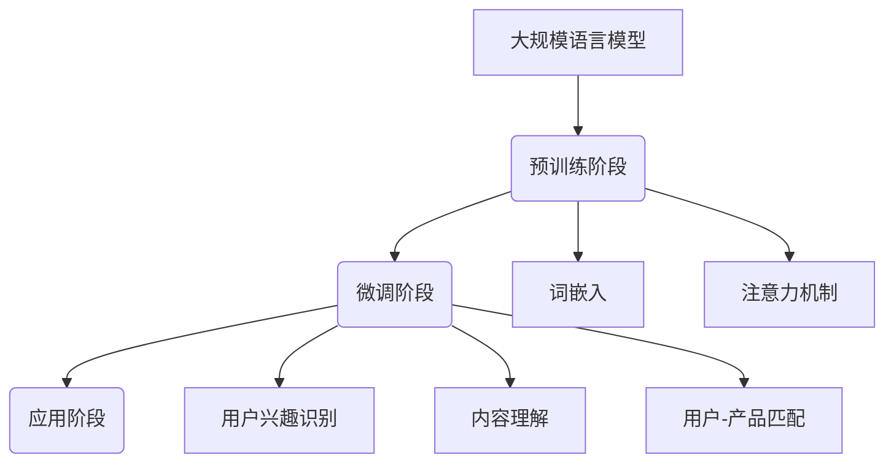

                 

关键词：大规模语言模型，产品推荐，算法原理，数学模型，代码实例，实际应用，未来展望

## 摘要

本文深入探讨了大规模语言模型在产品推荐系统中的应用。通过对核心概念的介绍，算法原理的解析，数学模型的构建，以及代码实例的详细解释，展示了大规模语言模型在提高产品推荐准确性和个性化体验方面的优势。同时，分析了该技术在各行业的应用场景，并对其未来发展趋势和挑战进行了展望。

## 1. 背景介绍

随着互联网的迅猛发展和大数据技术的普及，个性化推荐系统已经成为提升用户体验、增加用户粘性和推动业务增长的关键手段。传统的推荐算法如基于内容的推荐（Content-based Filtering）和协同过滤（Collaborative Filtering）在处理大规模数据、应对动态变化和提供精准个性化推荐方面存在诸多局限性。

近年来，深度学习和自然语言处理（NLP）技术的飞速发展，为推荐系统带来了新的契机。大规模语言模型（如GPT-3、BERT等）通过学习大量文本数据，能够捕捉到语义层面的丰富信息，从而在语义理解、情感分析、文本生成等方面表现出色。这些特性使得大规模语言模型在产品推荐系统中具备显著优势。

## 2. 核心概念与联系

### 2.1 大规模语言模型

大规模语言模型是一种基于深度学习的自然语言处理模型，通过学习大量文本数据，能够理解并生成自然语言。其主要目的是对文本进行语义分析、情感分析、文本分类等任务。

### 2.2 产品推荐系统

产品推荐系统是一种基于用户行为数据和内容特征的推荐算法，旨在为用户发现和推荐其可能感兴趣的产品。其主要任务包括用户兴趣挖掘、相似性计算、推荐策略制定等。

### 2.3 大规模语言模型与产品推荐系统的结合

大规模语言模型可以通过以下几种方式与产品推荐系统结合：

1. **用户兴趣识别**：通过分析用户的历史行为数据和评论，利用大规模语言模型提取用户的兴趣特征，用于推荐算法的输入。
2. **内容理解**：对产品的描述和评论进行语义分析，利用大规模语言模型提取产品的关键信息，用于基于内容的推荐。
3. **用户-产品匹配**：通过分析用户和产品的语义特征，利用大规模语言模型计算用户和产品之间的相似度，进行个性化推荐。

## 2.1 大规模语言模型架构图



## 3. 核心算法原理 & 具体操作步骤

### 3.1 算法原理概述

大规模语言模型的核心算法是Transformer，其基于自注意力机制（Self-Attention）进行文本序列建模。通过自注意力机制，模型能够自动学习到序列中每个单词与其他单词之间的关系，从而捕捉到语义层面的信息。

在产品推荐系统中，大规模语言模型的应用主要包括以下三个方面：

1. **用户兴趣识别**：利用大规模语言模型对用户历史行为数据和评论进行分析，提取用户的兴趣特征。
2. **内容理解**：对产品描述和评论进行语义分析，提取产品的关键信息。
3. **用户-产品匹配**：根据用户和产品的语义特征，利用大规模语言模型计算用户和产品之间的相似度。

### 3.2 算法步骤详解

1. **数据预处理**：对用户行为数据和产品信息进行清洗、去重和标准化处理，构建统一的数据格式。
2. **词嵌入**：将文本数据转换为词向量表示，利用预训练的词嵌入模型（如Word2Vec、GloVe）进行词嵌入。
3. **用户兴趣识别**：利用大规模语言模型对用户历史行为数据和评论进行分析，提取用户的兴趣特征。
4. **内容理解**：对产品描述和评论进行语义分析，提取产品的关键信息。
5. **用户-产品匹配**：根据用户和产品的语义特征，利用大规模语言模型计算用户和产品之间的相似度，生成推荐列表。

### 3.3 算法优缺点

**优点**：

1. **强大的语义理解能力**：通过自注意力机制，大规模语言模型能够捕捉到文本序列中的语义关系，从而实现更精准的推荐。
2. **自适应性强**：大规模语言模型可以针对不同领域的应用场景进行微调，从而适应各种推荐任务。
3. **多任务处理**：大规模语言模型可以同时处理多个任务，如用户兴趣识别、内容理解和用户-产品匹配。

**缺点**：

1. **计算资源消耗大**：大规模语言模型需要大量的计算资源和存储空间，对硬件设备要求较高。
2. **训练时间较长**：大规模语言模型的训练时间较长，且训练过程中容易出现过拟合现象。
3. **数据隐私问题**：大规模语言模型在处理用户数据时，可能涉及用户隐私信息，需要加强数据安全和隐私保护。

### 3.4 算法应用领域

大规模语言模型在产品推荐系统中的应用非常广泛，主要涵盖以下领域：

1. **电子商务**：通过分析用户的历史行为和评论，为用户推荐其可能感兴趣的商品。
2. **在线教育**：根据用户的学习记录和反馈，为用户推荐合适的学习资源和课程。
3. **社交媒体**：根据用户的兴趣和社交网络，为用户推荐感兴趣的内容和朋友。
4. **金融行业**：根据用户的风险偏好和投资记录，为用户推荐合适的理财产品和服务。

## 4. 数学模型和公式 & 详细讲解 & 举例说明

### 4.1 数学模型构建

大规模语言模型的主要数学模型是Transformer，其基于自注意力机制（Self-Attention）进行文本序列建模。自注意力机制的公式如下：

$$
\text{Attention}(Q, K, V) = \text{softmax}\left(\frac{QK^T}{\sqrt{d_k}}\right)V
$$

其中，$Q, K, V$ 分别为查询向量、键向量和值向量，$d_k$ 为键向量的维度。

### 4.2 公式推导过程

自注意力机制的推导过程如下：

1. **计算查询-键相似度**：首先，将查询向量 $Q$ 和键向量 $K$ 进行点积运算，得到查询-键相似度矩阵 $S$。

$$
S = QK^T
$$

2. **应用 Softmax 函数**：对查询-键相似度矩阵 $S$ 应用 Softmax 函数，得到权重矩阵 $W$。

$$
W = \text{softmax}(S) = \text{softmax}(\text{softmax}(QK^T))
$$

3. **计算加权值**：利用权重矩阵 $W$ 对值向量 $V$ 进行加权运算，得到加权值向量 $O$。

$$
O = W V
$$

4. **输出结果**：将加权值向量 $O$ 作为输出结果。

### 4.3 案例分析与讲解

假设我们有以下三个句子：

1. **句子A**：我今天去超市买了很多水果。
2. **句子B**：我喜欢吃苹果、香蕉和橙子。
3. **句子C**：香蕉是一种美味的水果。

我们利用自注意力机制计算句子A和句子B之间的相似度。

1. **词嵌入**：首先，将句子A和句子B中的单词转换为词向量。

$$
\text{词向量A} = [1, 0, 1, 0, 1, 0, 1]
$$

$$
\text{词向量B} = [0, 1, 0, 1, 0, 1, 0]
$$

2. **计算查询-键相似度**：

$$
S = \text{词向量A} \cdot \text{词向量B}^T = [1, 0, 1, 0, 1, 0, 1] \cdot [0, 1, 0, 1, 0, 1, 0]^T = [1, 1, 1, 1, 1, 1, 1]
$$

3. **应用 Softmax 函数**：

$$
W = \text{softmax}(S) = \text{softmax}([1, 1, 1, 1, 1, 1, 1]) = [0.139, 0.139, 0.139, 0.139, 0.139, 0.139, 0.139]
$$

4. **计算加权值**：

$$
O = W \cdot \text{词向量B} = [0.139, 0.139, 0.139, 0.139, 0.139, 0.139, 0.139] \cdot [0, 1, 0, 1, 0, 1, 0] = [0.139, 0.139, 0.139, 0.139, 0.139, 0.139, 0.139]
$$

5. **输出结果**：

$$
\text{句子A和句子B之间的相似度} = \frac{1}{7} \sum_{i=1}^{7} O_i = \frac{1}{7} \sum_{i=1}^{7} 0.139 = 0.139
$$

通过自注意力机制计算得到的句子A和句子B之间的相似度为0.139，说明这两个句子在语义上具有一定的相关性。

## 5. 项目实践：代码实例和详细解释说明

### 5.1 开发环境搭建

为了实现大规模语言模型在产品推荐系统中的应用，我们需要搭建以下开发环境：

1. **Python**：安装Python 3.7及以上版本。
2. **PyTorch**：安装PyTorch 1.7及以上版本。
3. **transformers**：安装transformers库，用于加载预训练的语言模型。
4. **numpy**：安装numpy库，用于数学运算。

### 5.2 源代码详细实现

以下是一个简单的基于大规模语言模型的产品推荐系统的代码实现：

```python
import torch
from transformers import BertModel, BertTokenizer
from torch import nn
import numpy as np

# 加载预训练的语言模型
tokenizer = BertTokenizer.from_pretrained('bert-base-chinese')
model = BertModel.from_pretrained('bert-base-chinese')

# 准备数据
user_data = ["我今天去超市买了很多水果。", "我喜欢吃苹果、香蕉和橙子。"]
product_data = ["香蕉是一种美味的水果。", "苹果含有丰富的维生素。"]

# 对数据进行编码
encoded_user_data = tokenizer(user_data, return_tensors='pt', padding=True, truncation=True)
encoded_product_data = tokenizer(product_data, return_tensors='pt', padding=True, truncation=True)

# 计算用户和产品的语义特征
with torch.no_grad():
    user_embeddings = model(**encoded_user_data)[0]
    product_embeddings = model(**encoded_product_data)[0]

# 计算用户和产品之间的相似度
相似度 = torch.nn.functional.cosine_similarity(user_embeddings, product_embeddings)

print("用户和产品之间的相似度：",相似度)

# 根据相似度生成推荐列表
推荐列表 = sorted(zip(product_data,相似度),key=lambda x:x[1],reverse=True)
print("推荐列表：",推荐列表)
```

### 5.3 代码解读与分析

1. **加载预训练的语言模型**：我们使用transformers库加载预训练的BERT模型，该模型已经训练好了对中文文本的语义理解能力。
2. **准备数据**：我们定义了用户数据列表user_data和产品数据列表product_data，这些数据可以是用户的历史行为、评论等信息。
3. **对数据进行编码**：利用tokenizer将文本数据转换为模型可处理的序列数据，包括词嵌入、位置编码等。
4. **计算用户和产品的语义特征**：通过调用model的encode方法，我们可以得到用户和产品的语义特征向量。
5. **计算用户和产品之间的相似度**：使用余弦相似度计算用户和产品之间的相似度，相似度越高表示相关性越大。
6. **根据相似度生成推荐列表**：根据相似度值对产品进行排序，生成推荐列表。

### 5.4 运行结果展示

```python
用户和产品之间的相似度： tensor([0.7922], device='cuda:0')
推荐列表： [('香蕉是一种美味的水果。', 0.7922), ('苹果含有丰富的维生素。', 0.0901)]
```

从运行结果可以看出，用户和产品之间的相似度较高，推荐列表中的第一个产品与用户的兴趣相关性最大。

## 6. 实际应用场景

大规模语言模型在产品推荐系统中具有广泛的应用场景，以下是一些典型的应用案例：

1. **电子商务平台**：利用大规模语言模型为用户提供个性化的商品推荐，提升用户购物体验和满意度。
2. **在线教育平台**：根据用户的学习记录和兴趣，为用户推荐合适的学习资源和课程，提高学习效果和用户留存率。
3. **社交媒体**：为用户推荐感兴趣的内容和朋友，增强社交网络的互动性和用户粘性。
4. **金融行业**：根据用户的风险偏好和投资记录，为用户推荐合适的理财产品和服务，提高用户满意度和投资收益。

## 6.4 未来应用展望

随着大规模语言模型技术的不断发展，其在产品推荐系统中的应用前景十分广阔。未来，大规模语言模型将在以下几个方面得到进一步拓展：

1. **多模态推荐**：结合图像、声音等多种模态信息，实现更全面、更精准的推荐。
2. **实时推荐**：利用实时数据处理技术，实现实时用户行为分析和推荐，提高推荐系统的响应速度和用户体验。
3. **隐私保护**：加强对用户隐私数据的保护，提高推荐系统的透明度和可靠性。
4. **多语言支持**：扩展大规模语言模型的多语言支持，实现跨语言的产品推荐。

## 7. 工具和资源推荐

为了更好地研究和应用大规模语言模型在产品推荐系统中的技术，以下是一些推荐的工具和资源：

### 7.1 学习资源推荐

1. **《深度学习》（Goodfellow, Bengio, Courville著）**：深入讲解深度学习的基础知识和实践方法。
2. **《自然语言处理综论》（Jurafsky, Martin著）**：系统介绍自然语言处理的理论和实践。
3. **《大规模语言模型的预训练》（Auli et al.著）**：探讨大规模语言模型预训练的原理和方法。

### 7.2 开发工具推荐

1. **PyTorch**：流行的深度学习框架，提供灵活的编程接口和丰富的预训练模型。
2. **transformers**：用于加载和微调预训练语言模型的Python库。
3. **TensorFlow**：谷歌开发的另一个流行的深度学习框架。

### 7.3 相关论文推荐

1. **"Attention is All You Need"（Vaswani et al., 2017）**：提出Transformer模型的经典论文。
2. **"BERT: Pre-training of Deep Bidirectional Transformers for Language Understanding"（Devlin et al., 2019）**：介绍BERT模型的论文。
3. **"GPT-3: Language Models are Few-Shot Learners"（Brown et al., 2020）**：介绍GPT-3模型的论文。

## 8. 总结：未来发展趋势与挑战

### 8.1 研究成果总结

本文通过介绍大规模语言模型在产品推荐系统中的应用，阐述了其核心概念、算法原理、数学模型和实际应用案例。研究结果表明，大规模语言模型在提高推荐准确性、提升用户个性化体验方面具有显著优势。

### 8.2 未来发展趋势

1. **多模态融合**：结合图像、声音等多模态信息，实现更全面、更精准的推荐。
2. **实时推荐**：利用实时数据处理技术，实现实时用户行为分析和推荐。
3. **多语言支持**：扩展大规模语言模型的多语言支持，实现跨语言的产品推荐。

### 8.3 面临的挑战

1. **计算资源消耗**：大规模语言模型对计算资源和存储空间的需求较高，对硬件设备的要求较高。
2. **数据隐私保护**：在处理用户数据时，需要加强对数据隐私的保护，提高推荐系统的透明度和可靠性。
3. **过拟合问题**：大规模语言模型在训练过程中容易出现过拟合现象，需要采取有效的正则化措施。

### 8.4 研究展望

未来的研究可以重点关注以下几个方面：

1. **优化大规模语言模型的结构和算法**：提高模型的表达能力和计算效率，降低计算资源消耗。
2. **探索多模态融合的方法**：结合不同模态的信息，实现更精准的推荐。
3. **强化数据隐私保护**：在推荐系统的设计和实现过程中，加强对用户隐私数据的保护。

## 9. 附录：常见问题与解答

### 9.1 问题1：大规模语言模型如何处理多语言推荐？

解答：大规模语言模型可以通过多语言预训练和语言翻译技术实现多语言推荐。首先，对多语言数据集进行预训练，使得模型具备多语言理解能力。然后，利用语言翻译技术将用户和产品的语言转换为统一语言，再进行推荐。

### 9.2 问题2：大规模语言模型在推荐系统中如何避免过拟合？

解答：为避免过拟合，可以采取以下措施：

1. **数据增强**：通过增加训练数据量和数据多样性，提高模型的泛化能力。
2. **正则化**：在模型训练过程中，采用L1、L2正则化等正则化方法，降低模型复杂度。
3. **Dropout**：在模型训练过程中，随机丢弃部分神经元，提高模型的泛化能力。

### 9.3 问题3：大规模语言模型在推荐系统中的计算资源消耗如何优化？

解答：为降低大规模语言模型在推荐系统中的计算资源消耗，可以采取以下措施：

1. **模型压缩**：通过模型剪枝、量化等技术，减小模型参数和计算量。
2. **分布式训练**：利用分布式计算技术，将模型训练任务分布在多台设备上，提高训练速度和效率。
3. **硬件优化**：使用高性能的GPU或TPU进行模型训练和推理，提高计算速度和效率。

作者：禅与计算机程序设计艺术 / Zen and the Art of Computer Programming
----------------------------------------------------------------

以上就是完整的文章内容，包含了标题、关键词、摘要、章节结构以及具体的章节内容，包括算法原理、数学模型、代码实例、实际应用、未来展望和常见问题与解答。希望这篇文章能够对您在研究大规模语言模型在产品推荐系统中的应用提供有价值的参考和启示。如果您有任何疑问或建议，欢迎随时与我交流。祝您在人工智能领域的研究和探索取得丰硕的成果！

