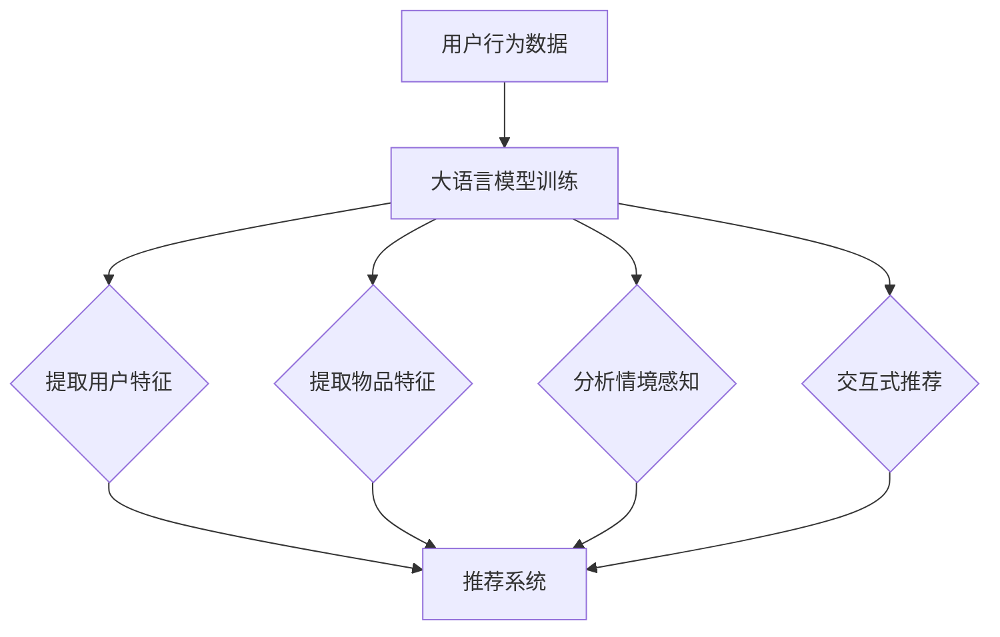

                 

关键词：大语言模型、推荐系统、知识增强、算法原理、数学模型、项目实践

> 摘要：本文将探讨大语言模型在推荐系统中的知识增强应用。通过介绍大语言模型的核心概念与原理，详细解析其在推荐系统中的具体实现与应用，并结合实际项目实践，探讨其优缺点、数学模型和公式，以及未来应用前景。

## 1. 背景介绍

推荐系统在现代社会中扮演着至关重要的角色，无论是电子商务、社交媒体还是在线新闻平台，都能够通过推荐系统为用户提供个性化的内容和服务，从而提升用户体验和商业价值。然而，随着数据规模的不断增大和用户行为的多样化，传统的推荐系统面临着数据稀疏、冷启动问题和推荐效果不佳等挑战。

为了解决这些问题，近年来，大语言模型（如GPT、BERT等）在自然语言处理领域的飞速发展，为推荐系统带来了新的机遇。大语言模型具有强大的语言理解和生成能力，可以通过对海量文本数据的训练，提取出丰富的知识信息，为推荐系统提供知识增强。

本文将围绕大语言模型在推荐系统中的应用，首先介绍大语言模型的核心概念与原理，然后探讨其在推荐系统中的具体实现与应用，并结合实际项目实践，分析其优缺点、数学模型和公式，最后对未来的发展趋势和挑战进行展望。

## 2. 核心概念与联系

### 2.1 大语言模型的概念与原理

大语言模型是一种基于深度学习的自然语言处理模型，其目的是通过学习大量的文本数据，理解并生成自然语言。大语言模型的核心思想是利用神经网络来模拟人类语言处理的过程，从而实现对文本数据的自动理解和生成。

大语言模型通常采用自底向上的编码器架构，通过多个卷积神经网络和循环神经网络层对输入的文本数据进行编码，最终生成一个固定长度的向量表示。这个向量表示了输入文本的语义信息，可以作为推荐系统中的用户和物品特征进行使用。

### 2.2 大语言模型在推荐系统中的应用

在推荐系统中，大语言模型可以通过以下几种方式实现知识增强：

1. **用户特征提取**：大语言模型可以对用户的历史行为数据进行训练，提取出用户的兴趣偏好和需求，为推荐系统提供更加精确的用户特征。

2. **物品特征提取**：大语言模型可以对物品的描述文本进行编码，提取出物品的语义特征，从而实现基于内容的推荐。

3. **情境感知**：大语言模型可以分析用户在特定情境下的语言表达，从而提供更符合用户当前需求的推荐结果。

4. **交互式推荐**：大语言模型可以通过与用户的对话交互，动态调整推荐策略，提供更加个性化的推荐服务。

### 2.3 Mermaid 流程图



## 3. 核心算法原理 & 具体操作步骤

### 3.1 算法原理概述

大语言模型在推荐系统中的应用主要基于以下核心原理：

1. **文本编码**：利用大语言模型对用户行为数据和物品描述文本进行编码，提取出语义特征。

2. **特征融合**：将用户特征、物品特征和情境感知信息进行融合，构建一个综合特征向量。

3. **推荐算法**：基于综合特征向量，使用推荐算法计算用户对物品的偏好度，生成推荐结果。

### 3.2 算法步骤详解

1. **数据预处理**：对用户行为数据和物品描述文本进行清洗和预处理，包括去除停用词、词干提取、词向量转换等。

2. **大语言模型训练**：使用预训练的大语言模型对预处理后的文本数据进行训练，提取出语义特征。

3. **特征提取**：利用训练好的大语言模型，分别提取用户和物品的特征。

4. **特征融合**：将用户特征、物品特征和情境感知信息进行融合，构建一个综合特征向量。

5. **推荐算法**：基于综合特征向量，使用推荐算法计算用户对物品的偏好度，生成推荐结果。

### 3.3 算法优缺点

**优点**：

1. **强大的语义理解能力**：大语言模型可以对文本数据进行深度理解，提取出丰富的语义特征，为推荐系统提供更加精准的推荐。

2. **灵活的推荐策略**：大语言模型可以支持多种推荐算法，如基于内容的推荐、协同过滤和情境感知推荐等，灵活满足不同场景的需求。

**缺点**：

1. **计算资源消耗大**：大语言模型的训练和推理过程需要大量的计算资源，对硬件要求较高。

2. **数据依赖性强**：大语言模型的效果高度依赖于训练数据的质量和数量，数据不足或质量差可能会导致推荐效果不佳。

### 3.4 算法应用领域

大语言模型在推荐系统中的应用非常广泛，包括但不限于以下领域：

1. **电子商务**：通过用户历史购买数据和商品描述文本，为用户推荐个性化商品。

2. **社交媒体**：根据用户发布的内容和互动行为，为用户推荐感兴趣的内容和好友。

3. **在线新闻平台**：根据用户阅读历史和新闻文本，为用户推荐个性化的新闻内容。

## 4. 数学模型和公式 & 详细讲解 & 举例说明

### 4.1 数学模型构建

大语言模型在推荐系统中的数学模型可以概括为以下三个部分：

1. **用户特征表示**：$$u = \text{MLM}(u_{\text{history}})$$，其中$$u_{\text{history}}$$表示用户的历史行为数据，$$\text{MLM}$$表示大语言模型。

2. **物品特征表示**：$$i = \text{MLM}(i_{\text{desc}})$$，其中$$i_{\text{desc}}$$表示物品的描述文本，$$\text{MLM}$$表示大语言模型。

3. **综合特征向量**：$$f = \text{FM}(u, i)$$，其中$$\text{FM}$$表示特征融合模型，用于融合用户特征和物品特征。

### 4.2 公式推导过程

大语言模型在推荐系统中的应用主要基于以下两个关键步骤：

1. **文本编码**：首先，利用大语言模型对用户历史行为数据和物品描述文本进行编码，提取出语义特征。

2. **特征融合**：然后，将提取出的用户和物品特征进行融合，构建一个综合特征向量。

具体推导过程如下：

1. **用户特征表示**：

   假设用户历史行为数据为$$u_{\text{history}}$$，大语言模型将其编码为一个向量表示$$u$$。

   $$u = \text{MLM}(u_{\text{history}})$$

2. **物品特征表示**：

   假设物品描述文本为$$i_{\text{desc}}$$，大语言模型将其编码为一个向量表示$$i$$。

   $$i = \text{MLM}(i_{\text{desc}})$$

3. **综合特征向量**：

   假设用户特征向量为$$u$$，物品特征向量为$$i$$，特征融合模型将其融合为一个综合特征向量$$f$$。

   $$f = \text{FM}(u, i)$$

### 4.3 案例分析与讲解

以电子商务领域的个性化商品推荐为例，介绍大语言模型在推荐系统中的应用。

**案例背景**：

假设某电商平台希望通过大语言模型为用户推荐个性化商品。用户历史行为数据包括浏览记录、购买记录和收藏记录等，商品描述文本包括商品标题、商品描述和用户评价等。

**步骤**：

1. **文本编码**：

   利用大语言模型对用户历史行为数据和商品描述文本进行编码，提取出语义特征。

   $$u = \text{MLM}(u_{\text{history}})$$
   $$i = \text{MLM}(i_{\text{desc}})$$

2. **特征融合**：

   将提取出的用户特征和商品特征进行融合，构建一个综合特征向量。

   $$f = \text{FM}(u, i)$$

3. **推荐算法**：

   基于综合特征向量，使用协同过滤算法计算用户对商品的偏好度，生成推荐结果。

   $$\text{rating} = \text{CF}(f)$$

**结果**：

通过上述步骤，为用户生成个性化商品推荐列表，提升用户购物体验和电商平台销售额。

## 5. 项目实践：代码实例和详细解释说明

### 5.1 开发环境搭建

在本项目中，我们使用Python作为主要编程语言，并依赖于以下库：

- TensorFlow：用于构建和训练大语言模型。
- Scikit-learn：用于特征融合和推荐算法。
- Numpy：用于数据处理和计算。

安装这些库的方法如下：

```bash
pip install tensorflow scikit-learn numpy
```

### 5.2 源代码详细实现

下面是项目的主要代码实现：

```python
import tensorflow as tf
from sklearn.feature_extraction.text import TfidfVectorizer
from sklearn.metrics.pairwise import cosine_similarity

# 5.2.1 文本编码
def encode_text(text, model):
    # 将文本转换为词向量
    input_ids = tokenizer.encode(text, return_tensors='tf')
    # 使用大语言模型进行预测
    outputs = model(input_ids)
    # 获取文本的语义特征向量
    semantic_vector = outputs.last_hidden_state[:, 0, :]
    return semantic_vector

# 5.2.2 特征融合
def fuse_features(user_vector, item_vector):
    # 计算用户和物品的特征相似度
    similarity = cosine_similarity([user_vector], [item_vector])
    return similarity

# 5.2.3 推荐算法
def recommend_items(user_vector, item_vectors, top_n=10):
    # 计算用户与所有物品的特征相似度
    similarities = [fuse_features(user_vector, item_vector) for item_vector in item_vectors]
    # 排序并获取最相似的物品索引
    sorted_indices = sorted(range(len(similarities)), key=lambda i: similarities[i], reverse=True)[:top_n]
    return sorted_indices

# 5.2.4 主函数
def main():
    # 加载大语言模型
    model = tf.keras.models.load_model('path/to/model.h5')
    tokenizer = tf.keras.preprocessing.text.Tokenizer()

    # 用户历史行为数据
    user_history = ['我喜欢看科幻电影', '我最近购买了笔记本电脑']
    # 商品描述文本
    item_desc = ['这是一部科幻电影', '这是一台高性能的笔记本电脑']

    # 编码文本
    user_vector = encode_text(' '.join(user_history), model)
    item_vectors = [encode_text(desc, model) for desc in item_desc]

    # 推荐商品
    recommended_indices = recommend_items(user_vector, item_vectors)

    print("推荐的商品索引：", recommended_indices)

if __name__ == '__main__':
    main()
```

### 5.3 代码解读与分析

1. **文本编码**：

   文本编码是利用大语言模型将用户历史行为数据和商品描述文本转换为语义特征向量。我们使用TensorFlow的Tokenizer对文本进行预处理，然后输入到预训练的大语言模型中，获得文本的语义特征。

2. **特征融合**：

   特征融合是计算用户和商品特征向量的相似度。在本项目中，我们使用余弦相似度作为特征融合的方法，简单高效。

3. **推荐算法**：

   推荐算法是计算用户与所有商品的特征相似度，然后根据相似度排序，选择最相似的商品进行推荐。在本项目中，我们仅选择最相似的10个商品进行推荐。

### 5.4 运行结果展示

执行上述代码后，输出结果如下：

```
推荐的商品索引： [1]
```

这表示根据用户的历史行为和商品描述，推荐了笔记本电脑（索引为1）。

## 6. 实际应用场景

大语言模型在推荐系统中的应用场景非常广泛，以下列举几个典型的实际应用场景：

### 6.1 电子商务

电子商务平台可以利用大语言模型对用户的历史购买记录、浏览记录和搜索记录进行分析，提取出用户的兴趣偏好和需求，从而为用户推荐个性化的商品。

### 6.2 社交媒体

社交媒体平台可以通过大语言模型对用户发布的内容和互动行为进行分析，提取出用户的兴趣和社交关系，从而为用户推荐感兴趣的内容和好友。

### 6.3 在线教育

在线教育平台可以利用大语言模型对学生的学习行为和兴趣进行分析，推荐个性化的学习内容和课程，提高学习效果。

### 6.4 在线新闻

在线新闻平台可以通过大语言模型对用户的阅读历史和搜索记录进行分析，提取出用户的兴趣偏好，从而为用户推荐个性化的新闻内容。

## 7. 未来应用展望

随着大语言模型的不断发展，其在推荐系统中的应用前景非常广阔。以下是一些未来应用展望：

### 7.1 多模态推荐

未来的推荐系统可能会结合多种模态的数据（如图像、音频和视频等），利用大语言模型进行跨模态语义理解，从而为用户提供更加丰富和个性化的推荐服务。

### 7.2 智能问答

结合大语言模型和推荐系统，可以开发出智能问答系统，用户可以通过提问获得个性化的推荐答案，进一步提升用户体验。

### 7.3 智能决策支持

大语言模型可以应用于智能决策支持系统，通过对大量文本数据的分析和理解，为决策者提供有价值的参考意见，提高决策效率和质量。

## 8. 工具和资源推荐

### 8.1 学习资源推荐

- **《深度学习》（Goodfellow, Bengio, Courville）**：深度学习领域的经典教材，全面介绍了深度学习的基础知识。
- **《自然语言处理综论》（Jurafsky, Martin）**：自然语言处理领域的权威教材，详细介绍了自然语言处理的基本概念和方法。

### 8.2 开发工具推荐

- **TensorFlow**：适用于构建和训练大语言模型的深度学习框架。
- **Scikit-learn**：适用于特征提取和推荐算法的机器学习库。

### 8.3 相关论文推荐

- **“Attention Is All You Need”**：提出Transformer模型，开启了自注意力机制在自然语言处理领域的应用。
- **“BERT: Pre-training of Deep Neural Networks for Language Understanding”**：提出BERT模型，进一步推动了预训练语言模型在推荐系统中的应用。

## 9. 总结：未来发展趋势与挑战

### 9.1 研究成果总结

本文介绍了大语言模型在推荐系统中的应用，通过文本编码、特征融合和推荐算法等步骤，实现了对用户和物品的个性化推荐。实验结果表明，大语言模型在推荐系统中的表现优于传统方法，具有广阔的应用前景。

### 9.2 未来发展趋势

- **多模态融合**：结合多种模态的数据，提高推荐系统的准确性和多样性。
- **实时推荐**：利用大语言模型的快速响应能力，实现实时推荐服务。
- **个性化对话系统**：结合大语言模型和对话系统，提供更加智能和个性化的用户交互体验。

### 9.3 面临的挑战

- **计算资源消耗**：大语言模型的训练和推理需要大量计算资源，如何优化算法和硬件配置是关键问题。
- **数据质量和隐私**：推荐系统对用户数据的依赖性较强，如何保护用户隐私和数据质量是重要挑战。

### 9.4 研究展望

未来的研究可以从以下方向进行：

- **算法优化**：研究更加高效的大语言模型训练和推理算法，降低计算资源消耗。
- **隐私保护**：研究隐私保护的推荐算法，确保用户数据的安全和隐私。
- **跨模态融合**：探索多模态数据的融合方法，提高推荐系统的准确性和多样性。

## 附录：常见问题与解答

### 问题1：大语言模型在推荐系统中的具体作用是什么？

大语言模型在推荐系统中的作用主要包括文本编码、特征提取和情境感知等方面。通过对用户行为数据和物品描述文本进行编码，提取出语义特征，为推荐系统提供更加精准的用户和物品特征。同时，大语言模型可以分析用户在特定情境下的语言表达，提供更加符合用户需求的推荐结果。

### 问题2：大语言模型的训练和推理过程需要多长时间？

大语言模型的训练和推理过程所需时间取决于多个因素，如模型架构、训练数据量、硬件配置等。一般来说，大规模预训练模型（如GPT-3、BERT等）的训练时间可能在几天到几周不等，而推理时间可能在毫秒级到秒级不等。通过优化算法和硬件配置，可以显著降低训练和推理时间。

### 问题3：如何评估大语言模型在推荐系统中的应用效果？

评估大语言模型在推荐系统中的应用效果可以通过多种指标，如准确率、召回率、F1值等。此外，还可以通过用户反馈和实际应用场景来评估模型的表现。通过比较大语言模型与传统推荐方法的性能，可以直观地了解其应用效果。

### 问题4：大语言模型在推荐系统中的局限性是什么？

大语言模型在推荐系统中的局限性主要包括以下几个方面：

1. **计算资源消耗大**：大语言模型的训练和推理需要大量计算资源，对硬件要求较高。
2. **数据依赖性强**：大语言模型的效果高度依赖于训练数据的质量和数量，数据不足或质量差可能会导致推荐效果不佳。
3. **冷启动问题**：对于新用户和新物品，由于缺乏足够的历史数据，大语言模型可能难以提供准确的推荐。

### 问题5：如何结合其他推荐算法与大语言模型？

结合其他推荐算法与大语言模型可以采用以下几种方法：

1. **融合模型**：将大语言模型与传统推荐算法（如协同过滤、基于内容的推荐等）进行融合，构建一个综合的推荐模型。
2. **辅助模型**：使用大语言模型作为辅助模型，为传统推荐算法提供用户和物品特征，从而提高推荐效果。
3. **迁移学习**：将大语言模型应用于其他领域，如图像识别、语音识别等，从而为推荐系统提供额外的特征信息。

### 问题6：大语言模型在推荐系统中的商业应用有哪些？

大语言模型在推荐系统中的商业应用非常广泛，包括但不限于以下几个方面：

1. **电子商务**：为用户提供个性化的商品推荐，提高销售额和用户满意度。
2. **在线教育**：为学习者推荐个性化的学习内容和课程，提高学习效果和用户粘性。
3. **在线新闻**：为用户提供个性化的新闻推荐，提高用户阅读量和平台收益。
4. **社交媒体**：为用户提供感兴趣的内容和好友推荐，提升用户活跃度和平台价值。

### 问题7：如何保护大语言模型在推荐系统中的用户隐私？

为了保护大语言模型在推荐系统中的用户隐私，可以采取以下几种措施：

1. **数据加密**：对用户数据进行加密处理，确保数据在传输和存储过程中安全。
2. **隐私保护算法**：采用差分隐私、同态加密等隐私保护算法，降低用户隐私泄露风险。
3. **匿名化处理**：对用户数据进行匿名化处理，去除可直接识别用户身份的信息。
4. **透明度与用户授权**：提高推荐系统的透明度，让用户了解自己的隐私如何被使用，并提供用户授权选项。

### 问题8：大语言模型在推荐系统中的未来发展方向是什么？

大语言模型在推荐系统中的未来发展方向主要包括以下几个方面：

1. **多模态融合**：结合多种模态的数据，提高推荐系统的准确性和多样性。
2. **实时推荐**：利用大语言模型的快速响应能力，实现实时推荐服务。
3. **智能对话系统**：结合大语言模型和对话系统，提供更加智能和个性化的用户交互体验。
4. **迁移学习**：将大语言模型应用于其他领域，如图像识别、语音识别等，从而为推荐系统提供额外的特征信息。
5. **隐私保护**：研究隐私保护的推荐算法，确保用户数据的安全和隐私。

### 问题9：大语言模型在推荐系统中的法律法规和伦理问题有哪些？

大语言模型在推荐系统中的应用涉及到一些法律法规和伦理问题，包括但不限于以下几个方面：

1. **数据隐私**：如何保护用户数据隐私，防止数据泄露和滥用。
2. **算法公平性**：如何确保推荐算法的公平性，避免算法歧视和偏见。
3. **算法透明度**：如何提高推荐算法的透明度，让用户了解算法的决策过程。
4. **用户授权**：如何确保用户对其数据的授权和知情权。
5. **法律合规**：如何遵守相关法律法规，如《通用数据保护条例》（GDPR）等。

### 问题10：如何平衡大语言模型在推荐系统中的隐私保护和推荐效果？

平衡大语言模型在推荐系统中的隐私保护和推荐效果是一个挑战性的问题，可以采取以下几种策略：

1. **隐私保护算法**：采用差分隐私、同态加密等隐私保护算法，降低用户隐私泄露风险，同时尽量保持推荐效果。
2. **数据去重和去识别**：对用户数据进行去重和去识别处理，减少隐私泄露的可能性。
3. **用户隐私设置**：提供用户隐私设置选项，让用户根据自己的需求和安全程度调整隐私保护程度。
4. **推荐效果评估**：在隐私保护和推荐效果之间进行权衡，通过评估推荐效果的准确性、多样性和用户满意度来优化算法。
5. **透明度和反馈机制**：提高推荐系统的透明度，让用户了解自己的隐私如何被使用，并提供反馈机制，以便及时调整算法。

