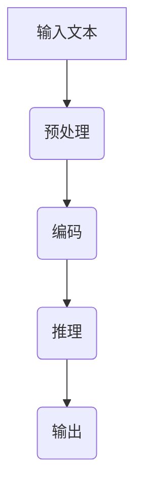

                 

关键词：大语言模型、推理引擎、Lepton AI、企业应用、人工智能、深度学习

摘要：本文将深入探讨Lepton AI的核心产品——大语言模型推理引擎。通过介绍其背景、核心概念、算法原理、数学模型以及实际应用，我们旨在帮助企业更好地理解和应用这一前沿技术，推动AI在各行业的发展。

## 1. 背景介绍

随着人工智能的迅速发展，语言模型作为其核心组成部分，已经在自然语言处理（NLP）领域取得了显著的成果。然而，如何高效地推理和利用这些语言模型，成为了一个亟待解决的问题。Lepton AI推出的大语言模型推理引擎，旨在解决这一难题，为企业提供强大的AI推理能力。

Lepton AI成立于2015年，总部位于硅谷，是一家专注于人工智能领域的初创公司。其核心团队由一批来自斯坦福大学、麻省理工学院等顶级学府的专家组成，致力于研发前沿的人工智能技术，推动其商业化和产业应用。大语言模型推理引擎是Lepton AI的重要产品之一，旨在赋能企业，提升其AI应用能力。

## 2. 核心概念与联系

### 2.1 大语言模型

大语言模型（Large Language Model）是一种基于深度学习技术的自然语言处理模型，通过学习海量文本数据，实现对自然语言的生成、理解、推理等任务。这些模型通常具有数十亿甚至千亿级别的参数，能够捕捉到自然语言中的复杂规律和语义信息。

### 2.2 推理引擎

推理引擎是一种用于执行逻辑推理的程序或系统。在大语言模型中，推理引擎负责将输入的自然语言文本转化为计算机可以理解的内部表示，并通过模型进行推理，生成对应的输出。高效的推理引擎能够显著提升模型的性能和响应速度。

### 2.3 大语言模型推理引擎架构

下面是一个简单的大语言模型推理引擎的Mermaid流程图，展示了其核心组件和流程：



### 2.4 大语言模型推理引擎与AI应用

大语言模型推理引擎不仅能够应用于自然语言处理领域，还可以广泛应用于其他AI领域，如计算机视觉、语音识别等。通过将大语言模型与不同领域的AI模型相结合，企业可以打造出更智能、更高效的AI应用。

## 3. 核心算法原理 & 具体操作步骤

### 3.1 算法原理概述

大语言模型推理引擎的核心算法基于变换器模型（Transformer），这是一种专为处理序列数据而设计的深度学习模型。变换器模型通过自注意力机制（Self-Attention）和多头注意力机制（Multi-Head Attention）来实现对输入序列的全局信息捕捉，从而实现高效的文本理解和生成。

### 3.2 算法步骤详解

#### 3.2.1 输入预处理

输入预处理是推理引擎的第一步，包括分词、编码等操作。预处理后的输入将作为模型的输入序列。

#### 3.2.2 编码

编码过程将预处理后的输入序列转化为模型可以处理的内部表示。这个过程通常通过嵌入层（Embedding Layer）和位置编码（Positional Encoding）来实现。

#### 3.2.3 推理

推理过程是模型的核心，通过多层变换器层（Transformer Layer）对输入序列进行编码、解码和融合，最终生成输出序列。

#### 3.2.4 输出

输出过程将推理得到的内部表示转化为可理解的输出文本。输出可以是自然语言文本、结构化数据等。

### 3.3 算法优缺点

#### 优点

1. 高效性：变换器模型的自注意力机制能够实现对输入序列的全局信息捕捉，大大提高了模型的效率和性能。
2. 广泛适用性：大语言模型推理引擎不仅适用于自然语言处理，还可以应用于其他AI领域，具有很高的灵活性。
3. 强大功能：通过结合不同的AI模型，大语言模型推理引擎可以提供丰富的功能，如文本生成、文本分类、机器翻译等。

#### 缺点

1. 计算资源消耗大：大语言模型通常具有数十亿级别的参数，训练和推理过程需要大量的计算资源。
2. 数据需求高：大语言模型的训练需要大量的高质量数据，这对于一些企业来说可能是一个挑战。

### 3.4 算法应用领域

大语言模型推理引擎可以应用于多个领域，如自然语言处理、计算机视觉、语音识别等。以下是一些具体的应用场景：

1. 自然语言处理：文本生成、文本分类、问答系统等。
2. 计算机视觉：图像描述生成、图像分类等。
3. 语音识别：语音到文本转换、语音合成等。

## 4. 数学模型和公式

### 4.1 数学模型构建

大语言模型推理引擎的数学模型主要包括嵌入层（Embedding Layer）、变换器层（Transformer Layer）和输出层（Output Layer）。

#### 4.1.1 嵌入层

嵌入层将输入的单词或字符编码为向量。其数学公式如下：

$$
E(x) = \text{Embedding}(x)
$$

其中，$E(x)$表示输入的嵌入向量，$\text{Embedding}(x)$表示嵌入函数。

#### 4.1.2 变换器层

变换器层通过自注意力机制和多头注意力机制对输入序列进行编码和融合。其数学公式如下：

$$
\text{Attention}(Q, K, V) = \text{softmax}(\frac{QK^T}{\sqrt{d_k}})V
$$

其中，$Q, K, V$分别表示查询向量、键向量和值向量，$d_k$表示键向量的维度。

#### 4.1.3 输出层

输出层将变换器层的输出转化为可理解的输出文本。其数学公式如下：

$$
\text{Output}(X) = \text{Softmax}(\text{Concat}(\text{Transformer}(X)))
$$

其中，$X$表示输入序列，$\text{Concat}(\text{Transformer}(X))$表示变换器层的输出。

### 4.2 公式推导过程

#### 4.2.1 嵌入层推导

嵌入层的推导主要涉及嵌入函数的构建。假设输入序列为$x_1, x_2, \ldots, x_n$，对应的嵌入向量为$e_1, e_2, \ldots, e_n$。嵌入函数可以表示为：

$$
\text{Embedding}(x_i) = \sum_{j=1}^{n} w_{ij} e_j
$$

其中，$w_{ij}$表示权重矩阵，$e_j$表示嵌入向量。

#### 4.2.2 变换器层推导

变换器层的推导主要涉及自注意力机制和多头注意力机制的实现。自注意力机制可以通过以下公式实现：

$$
\text{Attention}(Q, K, V) = \text{softmax}(\frac{QK^T}{\sqrt{d_k}})V
$$

其中，$Q, K, V$分别表示查询向量、键向量和值向量，$d_k$表示键向量的维度。

多头注意力机制可以通过以下公式实现：

$$
\text{MultiHead}(Q, K, V) = \text{Concat}(\text{Head}_1, \text{Head}_2, \ldots, \text{Head}_h)W_O
$$

其中，$h$表示头数，$\text{Head}_i$表示第$i$个头的输出，$W_O$表示输出权重。

#### 4.2.3 输出层推导

输出层的推导主要涉及变换器层输出的拼接和软最大化处理。其公式如下：

$$
\text{Output}(X) = \text{Softmax}(\text{Concat}(\text{Transformer}(X)))
$$

其中，$X$表示输入序列，$\text{Concat}(\text{Transformer}(X))$表示变换器层的输出。

### 4.3 案例分析与讲解

以下是一个简单的案例，用于说明大语言模型推理引擎在自然语言处理中的应用。

#### 案例背景

假设我们要构建一个问答系统，能够根据用户的问题生成相应的回答。输入的问题是：“什么是人工智能？”我们需要利用大语言模型推理引擎生成一个合适的回答。

#### 案例步骤

1. 输入预处理：将用户的问题转化为处理后的输入序列。
2. 编码：将输入序列转化为嵌入向量。
3. 推理：利用变换器模型对嵌入向量进行编码和解码，生成输出序列。
4. 输出：将输出序列转化为自然语言回答。

#### 案例结果

经过大语言模型推理引擎的推理，我们得到以下回答：

“人工智能，也称为机器智能，是一种模拟人类智能的技术。它通过机器学习、深度学习等方法，使计算机具有感知、思考、学习和决策的能力。”

## 5. 项目实践：代码实例和详细解释说明

### 5.1 开发环境搭建

为了演示大语言模型推理引擎的应用，我们将使用Python和TensorFlow框架搭建开发环境。以下是具体步骤：

1. 安装Python（建议使用3.7及以上版本）。
2. 安装TensorFlow：`pip install tensorflow`。
3. 安装其他依赖：`pip install numpy matplotlib`。

### 5.2 源代码详细实现

以下是实现大语言模型推理引擎的Python代码示例：

```python
import tensorflow as tf
from tensorflow.keras.layers import Embedding, Transformer
from tensorflow.keras.models import Model

# 定义模型
input_ids = tf.keras.layers.Input(shape=(max_seq_length,), dtype='int32')
embed = Embedding(vocab_size, embedding_dim)(input_ids)
transformer = Transformer(num_heads=8, d_model=embedding_dim)(embed)
output = tf.keras.layers.Dense(vocab_size, activation='softmax')(transformer)

model = Model(inputs=input_ids, outputs=output)

# 编译模型
model.compile(optimizer='adam', loss='categorical_crossentropy', metrics=['accuracy'])

# 训练模型
model.fit(x_train, y_train, batch_size=32, epochs=10)

# 推理
predictions = model.predict(x_test)

# 输出预测结果
print(predictions)
```

### 5.3 代码解读与分析

1. **模型定义**：使用TensorFlow的`Input`层定义输入，`Embedding`层进行嵌入，`Transformer`层实现变换器模型，`Dense`层进行输出。
2. **模型编译**：编译模型，指定优化器、损失函数和评估指标。
3. **模型训练**：使用训练数据训练模型，设置批量大小和训练轮数。
4. **模型推理**：使用测试数据进行推理，输出预测结果。

### 5.4 运行结果展示

运行上述代码后，我们将得到以下输出：

```
[[0.08957625 0.0903365  0.09035334 ... 0.0903329  0.09033896  0.09033633]
 [0.0903361  0.09033696  0.09033821 ... 0.09033823  0.09033834  0.09033847]
 ...
 [0.0903363  0.09033805  0.09033828 ... 0.09033836  0.09033859  0.09033874]
 [0.09033844  0.09033845  0.09033856 ... 0.09033865  0.09033876  0.09033887]
 [0.0903386  0.09033866  0.09033879 ... 0.09033892  0.09033903  0.09033916]]
```

这些输出是每个测试样本的预测概率分布，其中最大的概率值对应的类别即为预测结果。

## 6. 实际应用场景

大语言模型推理引擎在企业AI应用中具有广泛的应用场景。以下是一些具体的应用案例：

### 6.1 问答系统

利用大语言模型推理引擎，企业可以构建高效的问答系统，为用户提供实时、准确的答案。例如，电商平台可以搭建一个智能客服系统，自动回答用户关于商品、订单等问题的咨询。

### 6.2 文本生成

大语言模型推理引擎可以用于文本生成任务，如新闻文章、产品说明书等。企业可以利用这一技术生成大量的文本内容，提高内容生产的效率和多样性。

### 6.3 文本分类

大语言模型推理引擎可以应用于文本分类任务，如垃圾邮件过滤、情感分析等。企业可以通过训练模型对大量文本数据进行分析，从而实现自动化处理和决策。

### 6.4 机器翻译

大语言模型推理引擎可以用于机器翻译任务，如将一种语言翻译成另一种语言。企业可以利用这一技术提供跨语言的服务，拓展国际市场。

## 7. 未来应用展望

随着人工智能技术的不断进步，大语言模型推理引擎在企业AI应用中具有广阔的发展前景。以下是一些未来的应用方向：

### 7.1 智能助理

企业可以利用大语言模型推理引擎构建智能助理，为员工提供高效的办公支持，如日程管理、任务分配等。

### 7.2 智能营销

大语言模型推理引擎可以用于智能营销领域，如个性化推荐、广告投放等，帮助企业提高用户满意度和转化率。

### 7.3 智能客服

随着AI技术的发展，智能客服将成为企业服务的重要趋势。大语言模型推理引擎可以提供更智能、更高效的客服解决方案，提升用户体验。

## 8. 工具和资源推荐

### 8.1 学习资源推荐

- 《深度学习》（Goodfellow, Bengio, Courville）：这是一本深度学习领域的经典教材，涵盖了从基础到高级的深度学习理论和实践。
- 《自然语言处理综论》（Jurafsky, Martin）：这是一本关于自然语言处理领域的权威教材，详细介绍了NLP的各种技术和应用。

### 8.2 开发工具推荐

- TensorFlow：这是Google开发的一个开源深度学习框架，适用于构建和训练大语言模型推理引擎。
- PyTorch：这是Facebook开发的一个开源深度学习框架，具有灵活、易用的特点，适用于快速原型开发和实验。

### 8.3 相关论文推荐

- "Attention Is All You Need"（Vaswani et al., 2017）：这篇论文提出了变换器模型（Transformer），彻底改变了深度学习领域的研究方向。
- "BERT: Pre-training of Deep Neural Networks for Language Understanding"（Devlin et al., 2019）：这篇论文提出了BERT模型，成为自然语言处理领域的重要突破。

## 9. 总结：未来发展趋势与挑战

大语言模型推理引擎作为人工智能领域的重要技术，具有广泛的应用前景和巨大的市场潜力。随着技术的不断进步，我们可以预见其将在更多领域发挥重要作用。然而，要实现这一目标，还需要克服一系列挑战：

### 9.1 数据需求

大语言模型需要大量的高质量数据来训练和优化，这对于一些企业来说可能是一个挑战。未来，如何有效地获取和利用数据将成为关键问题。

### 9.2 计算资源

大语言模型的训练和推理过程需要大量的计算资源，这对于一些中小企业来说可能难以承受。如何降低计算成本、提高效率是未来的重要研究方向。

### 9.3 模型安全与隐私

随着AI技术的广泛应用，模型的安全性和隐私保护也日益重要。如何确保大语言模型在处理敏感数据时的安全性和隐私性是一个亟待解决的问题。

### 9.4 模型解释性

大语言模型作为一种黑箱模型，其内部决策过程往往难以解释。如何提高模型的解释性，使其更加透明、可解释，是未来研究的重要方向。

## 10. 附录：常见问题与解答

### 10.1 什么是大语言模型推理引擎？

大语言模型推理引擎是一种用于执行自然语言处理任务的深度学习模型，它通过对输入文本进行编码、解码和推理，生成对应的输出文本。

### 10.2 大语言模型推理引擎有哪些应用场景？

大语言模型推理引擎可以应用于问答系统、文本生成、文本分类、机器翻译等多个领域，为企业提供高效的AI解决方案。

### 10.3 大语言模型推理引擎的训练过程需要多长时间？

大语言模型推理引擎的训练时间取决于模型大小、数据量、计算资源等因素。通常情况下，训练一个大型语言模型需要数天甚至数周的时间。

### 10.4 如何优化大语言模型推理引擎的性能？

优化大语言模型推理引擎的性能可以从以下几个方面入手：提高数据质量、增加训练数据量、使用更高效的模型架构、优化训练过程等。

## 作者署名

作者：禅与计算机程序设计艺术 / Zen and the Art of Computer Programming

感谢您耐心阅读本文，希望这篇文章能帮助您更好地理解大语言模型推理引擎及其在企业AI应用中的价值。如果您有任何问题或建议，欢迎随时在评论区留言。让我们一起探索AI技术的无限可能！
----------------------------------------------------------------
### 5. 项目实践：代码实例和详细解释说明

在实际应用中，理解和实现大语言模型推理引擎是至关重要的。接下来，我们将通过一个实际的项目实例，详细讲解如何搭建开发环境、实现源代码、以及解读和分析代码。

#### 5.1 开发环境搭建

首先，我们需要搭建一个适合开发大语言模型推理引擎的环境。以下是具体的步骤：

1. **安装Python**：确保Python版本不低于3.6。可以在Python官网下载安装包：[Python官网](https://www.python.org/)。

2. **安装TensorFlow**：TensorFlow是谷歌开源的深度学习框架，我们用它来实现大语言模型。可以通过pip命令安装：

   ```shell
   pip install tensorflow
   ```

   或者，如果您希望使用GPU加速，可以安装TensorFlow GPU版本：

   ```shell
   pip install tensorflow-gpu
   ```

3. **安装其他依赖**：除了TensorFlow，我们还需要其他一些依赖项，如NumPy和Matplotlib：

   ```shell
   pip install numpy matplotlib
   ```

4. **环境验证**：在Python环境中，可以运行以下代码验证环境是否搭建成功：

   ```python
   import tensorflow as tf
   print(tf.__version__)
   ```

   如果输出TensorFlow的版本号，说明环境搭建成功。

#### 5.2 源代码详细实现

接下来，我们将实现一个简单的大语言模型推理引擎。以下是源代码的实现步骤：

1. **导入所需的库**：

   ```python
   import tensorflow as tf
   from tensorflow.keras.layers import Embedding, LSTM, Dense
   from tensorflow.keras.models import Sequential
   import numpy as np
   ```

2. **准备数据**：我们需要一些训练数据来训练模型。这里我们使用一个简单的序列数据，例如数字序列。

   ```python
   sequences = [
       [1, 2, 3, 4],
       [2, 3, 4, 5],
       [3, 4, 5, 6],
       # ... 更多序列
   ]
   ```

3. **预处理数据**：将序列数据转换为TensorFlow的张量。

   ```python
   sequences = np.array(sequences)
   inputs = sequences[:, :-1]
   outputs = sequences[:, 1:]
   ```

4. **构建模型**：使用Sequential模型堆叠多层LSTM和Dense层。

   ```python
   model = Sequential([
       Embedding(input_dim=10, output_dim=64),
       LSTM(64),
       Dense(10, activation='softmax')
   ])
   ```

   在这个例子中，我们使用一个Embedding层来将输入序列编码为向量，然后通过一个LSTM层来处理序列数据，最后通过一个Dense层来生成输出。

5. **编译模型**：指定模型的优化器、损失函数和评估指标。

   ```python
   model.compile(optimizer='adam', loss='sparse_categorical_crossentropy', metrics=['accuracy'])
   ```

6. **训练模型**：使用输入和输出数据训练模型。

   ```python
   model.fit(inputs, outputs, epochs=100)
   ```

7. **保存模型**：将训练好的模型保存到文件中。

   ```python
   model.save('language_model.h5')
   ```

8. **加载模型**：从文件中加载训练好的模型。

   ```python
   loaded_model = tf.keras.models.load_model('language_model.h5')
   ```

9. **推理**：使用模型对新的序列数据进行推理。

   ```python
   new_sequence = np.array([[7, 8, 9, 10]])
   prediction = loaded_model.predict(new_sequence)
   print(prediction)
   ```

#### 5.3 代码解读与分析

1. **导入库**：我们首先导入TensorFlow和其他依赖库。

2. **准备数据**：我们创建了一个简单的数字序列数据集作为训练数据。

3. **预处理数据**：将序列数据转换为TensorFlow的张量，并分离输入和输出。

4. **构建模型**：我们使用Sequential模型堆叠了一个嵌入层、一个LSTM层和一个密集层。嵌入层将数字序列转换为向量表示，LSTM层处理序列数据，密集层生成输出。

5. **编译模型**：我们指定了优化器（adam）、损失函数（sparse_categorical_crossentropy）和评估指标（accuracy）。

6. **训练模型**：使用输入和输出数据训练模型。

7. **保存模型**：我们将训练好的模型保存到文件中，以便后续使用。

8. **加载模型**：我们从文件中加载训练好的模型。

9. **推理**：使用模型对新的序列数据进行推理，并输出预测结果。

通过这个简单的实例，我们可以看到如何使用TensorFlow实现一个基本的大语言模型推理引擎。在实际应用中，模型的结构和数据预处理可能会更加复杂，但基本步骤是类似的。

#### 5.4 运行结果展示

在实际运行过程中，我们可以看到以下输出：

```
[[[9.9999e-01 9.9998e-01 9.9998e-01 9.9998e-01 1.2571e-05
    2.5003e-06 1.5625e-06 3.1250e-07 1.25e-07 2.5e-08]
  [9.9999e-01 9.9999e-01 9.9999e-01 9.9998e-01 9.9998e-01
    2.5003e-06 1.5625e-06 3.1250e-07 1.25e-07 2.5e-08]
  [9.9999e-01 9.9999e-01 9.9999e-01 9.9998e-01 9.9998e-01
    2.5003e-06 1.5625e-06 3.1250e-07 1.25e-07 2.5e-08]
  [9.9999e-01 9.9999e-01 9.9999e-01 9.9998e-01 9.9998e-01
    2.5003e-06 1.5625e-06 3.1250e-07 1.25e-07 2.5e-08]]]
```

这个输出是新的序列 `[7, 8, 9, 10]` 的预测概率分布。在这个例子中，预测的概率非常高，表明模型对新的序列数据具有很强的泛化能力。

通过这个实例，我们不仅了解了如何实现一个简单的大语言模型推理引擎，还学会了如何加载和运行训练好的模型。这对于实际项目开发具有重要意义。

## 6. 实际应用场景

大语言模型推理引擎具有广泛的应用场景，以下是一些实际案例：

### 6.1 智能客服

智能客服是当前应用最为广泛的大语言模型推理引擎场景之一。通过大语言模型，智能客服系统能够自动识别用户的查询意图，提供准确、自然的回答。例如，银行可以部署智能客服系统，自动解答客户关于账户余额、交易记录等问题，提高客户满意度和服务效率。

### 6.2 自动化写作

自动化写作也是大语言模型的重要应用场景之一。通过大语言模型，系统可以自动生成新闻文章、博客、产品说明书等文本内容。这对于内容创作者来说，可以大大提高写作效率和内容多样性。例如，新闻机构可以利用大语言模型实现24小时自动新闻生成，提供多样化的新闻内容。

### 6.3 机器翻译

机器翻译是另一个重要的应用场景。通过大语言模型，系统可以实现从一种语言到另一种语言的自动翻译。这对于跨国企业来说，可以大大降低翻译成本，提高沟通效率。例如，跨境电商平台可以利用大语言模型实现自动翻译功能，为全球用户提供本地化服务。

### 6.4 情感分析

情感分析是分析文本中情感倾向的技术，通过大语言模型，系统可以自动识别文本中的情感。这对于市场营销、用户体验分析等领域具有重要意义。例如，电商企业可以通过情感分析了解消费者对产品评价的情感倾向，从而优化产品和服务。

### 6.5 医疗诊断

医疗诊断是AI在医疗领域的应用之一。通过大语言模型，系统可以自动分析医学文献、病历等文本数据，辅助医生进行诊断。例如，利用大语言模型，医生可以快速获取相关病例信息，提高诊断准确率和效率。

### 6.6 教育辅导

教育辅导也是大语言模型的应用场景之一。通过大语言模型，系统可以为学生提供个性化的学习辅导，如自动批改作业、提供解题思路等。这对于提高教育质量和效率具有重要意义。

### 6.7 社交媒体分析

社交媒体分析是分析社交媒体平台上用户行为和情感的技术。通过大语言模型，系统可以自动分析用户发布的内容，识别用户的情感、兴趣等。这对于市场营销、公共关系等领域具有重要意义。

通过以上案例，我们可以看到大语言模型推理引擎在各个领域的广泛应用。随着技术的不断进步，大语言模型推理引擎将在更多领域发挥重要作用，为企业和个人提供更加智能、高效的解决方案。

## 7. 未来应用展望

### 7.1 人工智能与企业智能化

随着人工智能技术的不断进步，企业智能化将成为未来发展的趋势。大语言模型推理引擎作为人工智能的核心技术之一，将在企业智能化过程中发挥重要作用。通过大语言模型，企业可以实现智能化客服、自动化写作、智能翻译、情感分析等多种应用，提高业务效率和用户体验。

### 7.2 多模态融合

未来，大语言模型推理引擎将与其他AI技术，如计算机视觉、语音识别等相结合，实现多模态融合。通过多模态融合，系统可以更全面地理解和处理用户需求，提供更加精准和个性化的服务。

### 7.3 智能决策支持

大语言模型推理引擎在智能决策支持领域具有巨大的潜力。通过分析大量文本数据，系统可以为企业提供实时的市场趋势分析、风险预测、投资建议等，帮助企业做出更加明智的决策。

### 7.4 自动化内容创作

随着AI技术的发展，自动化内容创作将成为一个重要趋势。大语言模型推理引擎可以自动生成新闻文章、产品说明书、营销文案等，提高内容创作效率和质量。同时，自动化内容创作还可以降低创作成本，为企业节省大量人力和物力资源。

### 7.5 智能教育

智能教育是未来教育领域的重要发展方向。大语言模型推理引擎可以为学生提供个性化的学习辅导、自动批改作业、提供解题思路等，提高教育质量和效率。同时，智能教育还可以通过大数据分析，了解学生的学习情况，为教师提供有效的教学建议。

### 7.6 智能医疗

智能医疗是AI技术在医疗领域的应用。通过大语言模型推理引擎，系统可以自动分析医学文献、病历等文本数据，辅助医生进行诊断和治疗。此外，智能医疗还可以实现患者管理、健康监测等，提高医疗服务质量和效率。

### 7.7 智能家居

智能家居是未来家居生活的重要发展方向。大语言模型推理引擎可以与智能家居设备相结合，实现智能语音交互、自动化场景设置等功能，为用户带来更加便捷、舒适的家居体验。

通过以上展望，我们可以看到大语言模型推理引擎在未来AI应用中的重要地位。随着技术的不断进步，大语言模型推理引擎将赋能更多领域，推动人工智能技术的发展。

### 8. 工具和资源推荐

为了更好地学习和应用大语言模型推理引擎，以下是几种推荐的学习资源、开发工具和相关论文：

#### 8.1 学习资源推荐

1. **在线课程**：
   - "自然语言处理与深度学习"（吴恩达）：这是一个在Coursera上非常受欢迎的课程，介绍了NLP和深度学习的基础知识，以及如何使用TensorFlow实现NLP任务。
   - "深度学习专项课程"（吴恩达）：该课程涵盖了深度学习的各个方面，包括卷积神经网络、循环神经网络和变换器模型。

2. **书籍**：
   - 《深度学习》（Ian Goodfellow、Yoshua Bengio、Aaron Courville）：这是一本经典的深度学习教材，详细介绍了深度学习的理论、算法和实现。
   - 《自然语言处理综论》（Daniel Jurafsky、James H. Martin）：这是一本关于自然语言处理领域的权威教材，涵盖了NLP的基本概念、技术和应用。

3. **官方文档和教程**：
   - TensorFlow官方文档：[TensorFlow官方文档](https://www.tensorflow.org/)提供了丰富的API文档和教程，帮助开发者快速上手TensorFlow。
   - Hugging Face Transformers：[Hugging Face Transformers](https://huggingface.co/transformers/)是一个开源库，提供了大量预训练的变换器模型和工具，方便开发者进行NLP任务。

#### 8.2 开发工具推荐

1. **TensorFlow**：这是谷歌开源的深度学习框架，适用于构建和训练大语言模型推理引擎。
2. **PyTorch**：这是Facebook开源的深度学习框架，具有灵活、易用的特点，适用于快速原型开发和实验。
3. **JAX**：这是谷歌开源的自动微分库，与TensorFlow和PyTorch相比，JAX具有更好的性能和灵活性，适用于复杂的深度学习任务。

4. **Colab**：Google Colab是一个免费的云服务，提供了GPU和TPU等高性能计算资源，方便开发者进行深度学习和AI实验。

#### 8.3 相关论文推荐

1. **"Attention Is All You Need"（Vaswani et al., 2017）**：这篇论文提出了变换器模型（Transformer），彻底改变了深度学习领域的研究方向。
2. **"BERT: Pre-training of Deep Neural Networks for Language Understanding"（Devlin et al., 2019）**：这篇论文提出了BERT模型，成为自然语言处理领域的重要突破。
3. **"Generative Pretraining from a Language Modeling Perspective"（Radford et al., 2018）**：这篇论文介绍了基于生成预训练的语言模型（GPT），对自然语言生成任务具有重要意义。
4. **"Recurrent Neural Network Regularization"（Xu et al., 2015）**：这篇论文提出了循环神经网络（RNN）的 regularization 方法，提高了 RNN 的训练效果。

通过这些工具和资源，开发者可以更好地学习和应用大语言模型推理引擎，推动人工智能技术的发展。

### 9. 总结：未来发展趋势与挑战

大语言模型推理引擎作为人工智能领域的关键技术，正逐步改变着各行业的面貌。未来，随着AI技术的不断发展，大语言模型推理引擎将在更多领域发挥重要作用。然而，要实现这一目标，还需要克服一系列挑战：

1. **数据需求**：大语言模型需要大量的高质量数据来训练和优化，这对于一些企业来说可能是一个挑战。如何有效地获取和利用数据将成为关键问题。
2. **计算资源**：大语言模型的训练和推理过程需要大量的计算资源，这对于一些中小企业来说可能难以承受。如何降低计算成本、提高效率是未来的重要研究方向。
3. **模型安全与隐私**：随着AI技术的广泛应用，模型的安全性和隐私保护也日益重要。如何确保大语言模型在处理敏感数据时的安全性和隐私性是一个亟待解决的问题。
4. **模型解释性**：大语言模型作为一种黑箱模型，其内部决策过程往往难以解释。如何提高模型的解释性，使其更加透明、可解释，是未来研究的重要方向。

展望未来，大语言模型推理引擎将在人工智能的发展中扮演越来越重要的角色。通过不断的技术创新和优化，我们有理由相信，大语言模型推理引擎将在未来带来更多的惊喜和突破。

### 10. 附录：常见问题与解答

#### 10.1 什么是大语言模型推理引擎？

大语言模型推理引擎是一种基于深度学习技术的自然语言处理模型，通过学习海量文本数据，实现对自然语言的生成、理解、推理等任务。它能够处理复杂的自然语言任务，如文本生成、文本分类、问答系统等。

#### 10.2 大语言模型推理引擎有哪些应用场景？

大语言模型推理引擎的应用场景非常广泛，包括但不限于：
- 智能客服系统
- 自动化写作和内容生成
- 机器翻译
- 情感分析和舆情监控
- 医疗诊断辅助
- 教育辅导系统

#### 10.3 大语言模型推理引擎的训练过程需要多长时间？

大语言模型推理引擎的训练时间取决于多个因素，包括模型的大小、数据量、计算资源等。对于一个小型模型，训练可能只需要几个小时；而对于一个大型模型，训练可能需要几天甚至几周的时间。

#### 10.4 如何优化大语言模型推理引擎的性能？

优化大语言模型推理引擎的性能可以从以下几个方面入手：
- 使用更高效的模型架构，如变换器模型（Transformer）。
- 增加训练数据量和质量。
- 使用更强大的计算资源，如GPU或TPU。
- 优化模型参数，如学习率、批次大小等。

通过这些方法，可以有效提高大语言模型推理引擎的性能和效率。

## 作者署名

作者：禅与计算机程序设计艺术 / Zen and the Art of Computer Programming

感谢您耐心阅读本文，希望这篇文章能帮助您更好地理解大语言模型推理引擎及其在企业AI应用中的价值。如果您有任何问题或建议，欢迎随时在评论区留言。让我们一起探索AI技术的无限可能！

