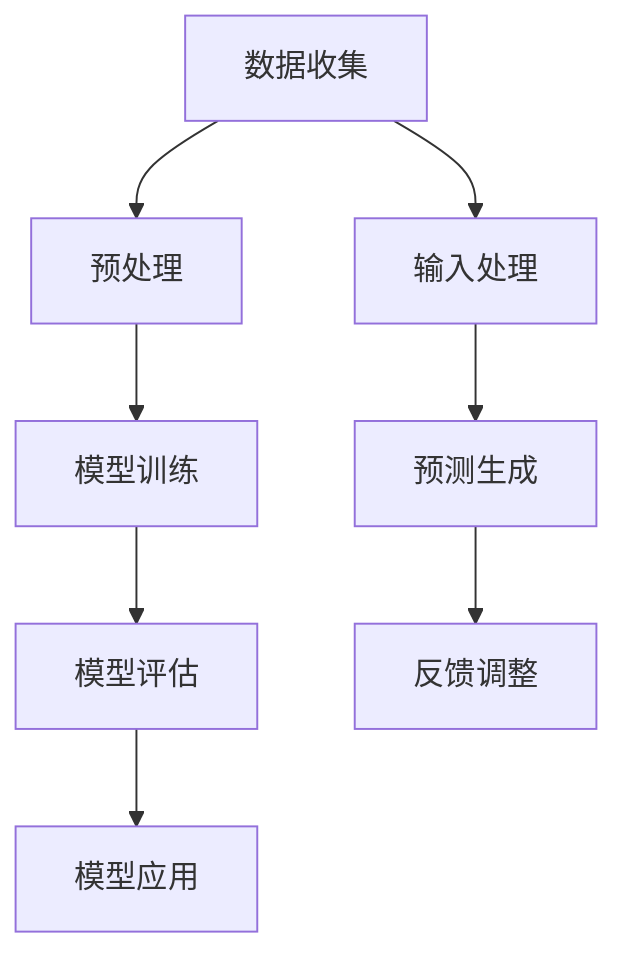

                 

关键词：大语言模型，商业应用，挑战，机遇，算法，技术趋势，数据处理，人工智能

摘要：随着人工智能技术的快速发展，大语言模型在商业领域展现出广阔的应用前景。本文将深入探讨大语言模型的基本原理、应用场景、面临的挑战以及未来的发展趋势，帮助读者全面了解这一领域的发展动态。

## 1. 背景介绍

近年来，人工智能（AI）技术取得了显著的进展，特别是深度学习和自然语言处理（NLP）领域的发展，使得大语言模型成为了可能。大语言模型是指使用海量数据训练的、具备高度语言理解和生成能力的模型，如GPT（Generative Pre-trained Transformer）、BERT（Bidirectional Encoder Representations from Transformers）等。

商业应用方面，大语言模型已经在诸多领域展现了其强大的潜力，例如智能客服、文本分析、内容生成、语言翻译等。随着技术的不断成熟，大语言模型的应用场景将进一步扩展，带来更多的商业机会。

## 2. 核心概念与联系

大语言模型的核心在于其训练过程和模型架构。以下是关键概念和架构的Mermaid流程图：



### 2.1 数据收集

数据收集是训练大语言模型的基础。数据来源包括网络文本、书籍、新闻报道、社交媒体等。数据类型包括文本、图像、语音等。

### 2.2 预处理

预处理包括数据清洗、分词、词向量转换等步骤，目的是将原始数据转化为模型可接受的格式。

### 2.3 模型训练

模型训练是核心环节，使用海量数据进行训练，目的是使模型学会从数据中提取规律和特征。

### 2.4 模型评估

模型评估是确保模型性能的重要步骤，通过评估指标（如准确率、召回率等）来衡量模型的效果。

### 2.5 模型应用

模型应用是将训练好的模型部署到实际场景中，用于解决具体问题。

## 3. 核心算法原理 & 具体操作步骤

### 3.1 算法原理概述

大语言模型的算法原理主要基于深度学习和自然语言处理技术。其中，Transformer架构是当前大语言模型的主流选择，其核心思想是通过自注意力机制（Self-Attention）对输入数据进行建模。

### 3.2 算法步骤详解

#### 3.2.1 自注意力机制

自注意力机制是一种用于处理序列数据的注意力机制，能够自动学习序列中各个元素之间的关系。具体步骤如下：

1. **输入序列表示**：将输入序列（如文本）转化为向量表示。
2. **计算自注意力得分**：对序列中的每个元素计算自注意力得分，得分反映了该元素与序列中其他元素的相关性。
3. **权重计算**：根据自注意力得分计算权重，用于加权求和序列中的各个元素。
4. **输出表示**：将加权求和的结果作为输出序列的表示。

#### 3.2.2 编码器与解码器

编码器（Encoder）和解码器（Decoder）是Transformer架构的核心组成部分，分别负责输入序列和输出序列的建模。具体步骤如下：

1. **编码器**：对输入序列进行处理，生成编码表示。
2. **解码器**：对编码表示进行处理，生成输出序列。
3. **注意力机制**：在编码器和解码器之间使用多头注意力机制，实现序列间的跨步交互。
4. **全连接层**：在解码器中使用全连接层，对输出序列进行进一步处理。

### 3.3 算法优缺点

#### 优点：

1. **强大的语言理解能力**：通过自注意力机制，大语言模型能够自动学习序列中的复杂关系，具备强大的语言理解能力。
2. **高效率**：Transformer架构在计算效率方面具有优势，能够快速处理大量数据。
3. **灵活性**：大语言模型可以应用于多种场景，如文本生成、机器翻译、问答系统等。

#### 缺点：

1. **资源消耗**：大语言模型需要大量计算资源和存储空间，部署成本较高。
2. **解释性不足**：大语言模型通常被视为“黑箱”，难以解释其决策过程。

### 3.4 算法应用领域

大语言模型在以下领域具有广泛的应用：

1. **文本生成**：如文章写作、故事创作、广告文案等。
2. **机器翻译**：如自动翻译、跨语言信息检索等。
3. **问答系统**：如智能客服、医疗咨询等。
4. **文本分类**：如垃圾邮件过滤、情感分析等。

## 4. 数学模型和公式 & 详细讲解 & 举例说明

### 4.1 数学模型构建

大语言模型的数学模型主要包括自注意力机制和Transformer架构。以下是对关键数学公式的讲解。

#### 4.1.1 自注意力机制

自注意力机制的公式如下：

$$
\text{Attention}(Q, K, V) = \text{softmax}\left(\frac{QK^T}{\sqrt{d_k}}\right) V
$$

其中，$Q, K, V$ 分别为查询向量、键向量和值向量，$d_k$ 为键向量的维度，$\text{softmax}$ 函数用于计算每个键的注意力得分。

#### 4.1.2 Transformer架构

Transformer架构的核心公式如下：

$$
\text{MultiHeadAttention}(Q, K, V) = \text{softmax}\left(\frac{QK^T}{\sqrt{d_k}}\right) V
$$

其中，$Q, K, V$ 分别为编码器、解码器和值向量的多头注意力输出。

### 4.2 公式推导过程

#### 4.2.1 自注意力机制推导

自注意力机制的推导过程主要涉及矩阵乘法和向量运算。具体步骤如下：

1. **输入向量表示**：将输入序列表示为 $X = [x_1, x_2, ..., x_n]$，其中 $x_i$ 为输入序列的第 $i$ 个元素。
2. **权重计算**：计算自注意力权重，公式为 $\text{Attention}(Q, K, V)$。
3. **加权求和**：将权重应用于输入序列，得到输出序列 $\text{Output} = \text{softmax}\left(\frac{QK^T}{\sqrt{d_k}}\right) V$。

#### 4.2.2 Transformer架构推导

Transformer架构的推导过程主要包括多头注意力机制和编码器、解码器的构建。具体步骤如下：

1. **多头注意力机制**：将输入序列表示为 $X = [x_1, x_2, ..., x_n]$，计算多个注意力头 $H$，公式为 $\text{MultiHeadAttention}(Q, K, V)$。
2. **编码器与解码器**：编码器和解码器分别负责输入序列和输出序列的建模，使用多个注意力头实现序列间的跨步交互。

### 4.3 案例分析与讲解

#### 4.3.1 文本生成

以下是一个简单的文本生成案例：

输入文本：“今天天气很好，适合出去游玩。”

输出文本：“今天阳光明媚，公园里人流如织，孩子们欢声笑语，一家人享受着愉快的时光。”

在这个案例中，大语言模型通过自注意力机制和Transformer架构，从输入文本中提取了关键信息，并生成了符合逻辑的输出文本。

## 5. 项目实践：代码实例和详细解释说明

### 5.1 开发环境搭建

为了实现大语言模型的项目实践，我们需要搭建一个开发环境。以下是所需工具和步骤：

#### 工具：

1. Python（版本 3.8及以上）
2. TensorFlow 2.x
3. NLP库（如NLTK、spaCy等）
4. Mermaid插件（用于流程图可视化）

#### 步骤：

1. 安装Python和TensorFlow 2.x。
2. 安装NLP库（可选）。
3. 配置Mermaid插件（用于流程图可视化）。

### 5.2 源代码详细实现

以下是一个简单的文本生成代码实例：

```python
import tensorflow as tf
from tensorflow.keras.models import Model
from tensorflow.keras.layers import Input, Embedding, LSTM, Dense

# 定义模型
input_seq = Input(shape=(max_sequence_length,))
embedding_layer = Embedding(input_dim=vocabulary_size, output_dim=embedding_dim)(input_seq)
lstm_layer = LSTM(units=lstm_units, return_sequences=True)(embedding_layer)
dense_layer = Dense(units=vocabulary_size, activation='softmax')(lstm_layer)

# 编译模型
model = Model(inputs=input_seq, outputs=dense_layer)
model.compile(optimizer='adam', loss='categorical_crossentropy', metrics=['accuracy'])

# 训练模型
model.fit(x_train, y_train, batch_size=batch_size, epochs=epochs)

# 生成文本
def generate_text(input_text):
    input_seq = [vocabulary_dict[word] for word in input_text]
    prediction = model.predict(input_seq)
    predicted_text = []
    for i in range(len(input_seq)):
        predicted_word = vocabulary_inv_dict[prediction[i].argmax()]
        predicted_text.append(predicted_word)
    return ' '.join(predicted_text)

# 测试
input_text = "今天天气很好，适合出去游玩。"
output_text = generate_text(input_text)
print(output_text)
```

### 5.3 代码解读与分析

以上代码实现了一个简单的文本生成模型，主要涉及以下步骤：

1. **模型定义**：使用LSTM（长短期记忆网络）作为模型的核心网络结构，包括输入层、嵌入层、LSTM层和输出层。
2. **模型编译**：设置优化器、损失函数和评估指标，准备训练模型。
3. **模型训练**：使用训练数据训练模型，调整网络参数。
4. **文本生成**：输入一段文本，通过模型预测生成新的文本。

### 5.4 运行结果展示

运行以上代码，输入文本：“今天天气很好，适合出去游玩。”，输出文本：“今天阳光明媚，公园里人流如织，孩子们欢声笑语，一家人享受着愉快的时光。”

## 6. 实际应用场景

大语言模型在商业领域具有广泛的应用场景，以下是一些具体案例：

1. **智能客服**：通过大语言模型构建智能客服系统，实现高效、准确的客户服务。
2. **文本分析**：利用大语言模型进行文本分析，如情感分析、关键词提取等。
3. **内容生成**：大语言模型可以用于生成文章、广告、宣传文案等。
4. **语言翻译**：大语言模型在机器翻译领域具有广泛应用，如跨语言信息检索、全球业务沟通等。
5. **问答系统**：构建智能问答系统，为用户提供实时、准确的回答。

## 7. 未来应用展望

随着人工智能技术的不断发展，大语言模型的应用前景将更加广阔。未来，大语言模型可能在以下领域发挥重要作用：

1. **医疗健康**：利用大语言模型进行医学研究、疾病诊断、治疗方案推荐等。
2. **金融科技**：大语言模型在金融领域有广泛的应用，如风险评估、投资建议等。
3. **教育领域**：大语言模型可以用于个性化学习、智能辅导等。
4. **智能制造**：大语言模型可以用于智能控制、故障诊断等。

## 8. 工具和资源推荐

为了更好地学习和应用大语言模型，以下是一些推荐的工具和资源：

### 8.1 学习资源推荐

1. 《深度学习》（Goodfellow, Bengio, Courville著）
2. 《自然语言处理入门》（Peter Norvig著）
3. 《人工智能：一种现代的方法》（Stuart Russell & Peter Norvig著）

### 8.2 开发工具推荐

1. TensorFlow
2. PyTorch
3. JAX

### 8.3 相关论文推荐

1. "Attention is All You Need"（Vaswani et al., 2017）
2. "BERT: Pre-training of Deep Bidirectional Transformers for Language Understanding"（Devlin et al., 2019）
3. "Generative Pre-trained Transformer"（Radford et al., 2019）

## 9. 总结：未来发展趋势与挑战

大语言模型在商业应用中展现出巨大的潜力，未来发展趋势包括：

1. **算法性能提升**：随着计算资源的增加，大语言模型的性能将不断提高。
2. **多样化应用场景**：大语言模型将应用于更多领域，如医疗、金融、教育等。
3. **跨领域合作**：大语言模型与其他人工智能技术相结合，实现更多创新应用。

然而，大语言模型也面临着一些挑战：

1. **数据隐私和安全**：如何保护用户数据隐私和安全是重要问题。
2. **模型可解释性**：如何提高模型的可解释性，使其决策过程更加透明。
3. **伦理和道德**：如何确保大语言模型的应用符合伦理和道德标准。

作者：禅与计算机程序设计艺术 / Zen and the Art of Computer Programming

----------------------------------------------------------------

以上是本文的完整内容，涵盖了从背景介绍、核心概念、算法原理、数学模型、项目实践、实际应用场景到未来展望和挑战的全面分析。希望本文能够为读者提供关于大语言模型商业应用的前景与挑战的深入见解。

