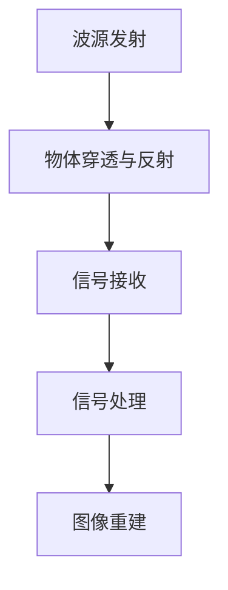
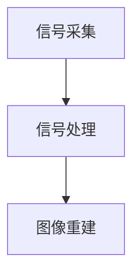

                 

# 太赫兹技术在安检中的应用：非接触式扫描

### 关键词 Keywords
太赫兹技术，非接触式扫描，安检，信息安全，图像处理

## 1. 背景介绍

太赫兹波，又称亚毫米波，是电磁波谱中位于微波与红外光之间的波段，频率范围大约在0.1THz到10THz。由于其独特的电磁性质，太赫兹波在许多领域展现了广泛的应用潜力，特别是在非接触式扫描技术中。传统的安检手段如X射线和金属探测器存在诸多局限性，例如对人体健康有害、易受金属物体干扰等。太赫兹波则能穿透多种材料，包括塑料、纤维、木材、纸张等，同时不损伤被检测物品，对人体无害，因此成为了新一代安检技术的重要发展方向。

在信息安全领域，非接触式扫描技术尤为重要。传统的接触式检查方法往往无法检测隐藏在衣物或包裹内的危险物品，如爆炸物、毒品、武器等。而太赫兹波技术可以精确地捕捉物品内部的细微结构，为安检人员提供清晰的图像信息，从而提高安检的准确性和效率。此外，太赫兹波在生物医学成像、材料检测、环境保护等领域也具有广泛的应用前景。

本文旨在深入探讨太赫兹技术在安检中的应用，尤其是非接触式扫描技术的原理、算法、数学模型以及实际应用案例，同时分析其优势与挑战，为未来的发展提供有益的参考。

## 2. 核心概念与联系

### 2.1 太赫兹波的基本原理

太赫兹波是一种非电离辐射，其频率介于微波和红外线之间，具有波长短、能量低、穿透力强的特点。太赫兹波在不同材料中的传播速度和吸收率存在显著差异，这使得太赫兹波在材料识别和成像中具有独特的优势。

**图 2.1 太赫兹波频谱位置**


**图 2.2 太赫兹波的传播与吸收特性**


### 2.2 非接触式扫描技术的原理

非接触式扫描技术利用太赫兹波对被检测物体的穿透能力，通过检测反射和透射的太赫兹波信号，重建出物体的内部结构图像。这一过程主要包括以下几个步骤：

1. **波源发射**：太赫兹波源产生高强度、宽频带的太赫兹波。
2. **物体穿透与反射**：太赫兹波穿透被检测物体并在物体表面发生反射。
3. **信号接收**：接收器捕获反射回来的太赫兹波信号。
4. **信号处理**：通过信号处理技术重建出物体的内部图像。

**图 2.3 非接触式扫描技术流程**



### 2.3 非接触式扫描技术在安检中的应用

在安检领域，非接触式扫描技术主要用于对行李、包裹和人员的快速、安全检查。其主要优势包括：

- **安全性高**：太赫兹波对人体无害，无需接触即可完成检测。
- **灵敏度强**：太赫兹波能够穿透多种材料，并能有效识别隐蔽的物品。
- **速度快**：非接触式扫描速度快，可以在短时间内完成大规模的安检任务。
- **低成本**：相较于其他高能量检测技术，太赫兹波设备成本较低。

**图 2.4 非接触式扫描技术在安检中的应用场景**


## 3. 核心算法原理 & 具体操作步骤

### 3.1 算法原理概述

非接触式扫描技术的核心算法主要包括信号采集、信号处理和图像重建三部分。以下将详细阐述这三个步骤的具体操作。

### 3.2 算法步骤详解

#### 3.2.1 信号采集

信号采集是整个扫描过程的基础，主要依赖于太赫兹波源和接收器。具体操作如下：

1. **波源发射**：利用电子加速器或光子源产生高强度的太赫兹波。
2. **脉冲调制**：将太赫兹波脉冲进行调制，以便于后续的信号处理。
3. **物体穿透与反射**：太赫兹波穿透被检测物体并在物体表面发生反射。
4. **信号接收**：接收器捕获反射回来的太赫兹波信号。

#### 3.2.2 信号处理

信号处理是对采集到的太赫兹波信号进行预处理和特征提取，主要包括以下步骤：

1. **信号滤波**：去除噪声和杂讯，提高信号质量。
2. **信号去卷积**：对原始信号进行卷积反演，恢复出物体的真实形态。
3. **信号特征提取**：提取太赫兹波信号的特征参数，如幅度、相位、频率响应等。

#### 3.2.3 图像重建

图像重建是整个算法的核心，通过信号处理得到物体的内部结构图像。具体步骤如下：

1. **图像重建算法**：采用反卷积算法、频域滤波算法等，将信号特征转换为图像。
2. **图像融合**：将不同角度的信号数据进行融合，提高图像的分辨率和清晰度。
3. **图像增强**：对重建后的图像进行增强处理，突出目标物体的特征。

**图 3.1 非接触式扫描技术算法流程**



### 3.3 算法优缺点

#### 优点

1. **非接触式检测**：无需接触被检测物体，安全性高。
2. **多材料穿透性**：能够穿透多种材料，适用范围广泛。
3. **高灵敏度**：能够检测微小的目标物体。
4. **速度快**：扫描速度快，适合大规模应用。

#### 缺点

1. **设备成本高**：太赫兹波源和接收器设备成本较高，限制了其大规模应用。
2. **信号处理复杂**：信号处理过程复杂，对算法和硬件要求较高。
3. **图像重建困难**：由于信号噪声和干扰，图像重建过程中存在一定的误差。

### 3.4 算法应用领域

太赫兹波非接触式扫描技术在安检、生物医学成像、材料检测等领域具有广泛的应用前景。以下将分别介绍其在不同领域的应用。

#### 3.4.1 安检

在安检领域，太赫兹波非接触式扫描技术主要用于行李和包裹的安全检查。通过太赫兹波对行李内部进行穿透，可以清晰地看到行李中的物品，从而有效检测危险物品。

#### 3.4.2 生物医学成像

太赫兹波在生物医学成像中具有独特的优势，能够对生物组织和器官进行无创、高分辨率的成像。这对于癌症诊断、心脏病检测等医学应用具有重要意义。

#### 3.4.3 材料检测

太赫兹波对材料的穿透能力强，可以用于材料内部缺陷、成分检测等领域。在航空航天、汽车制造等行业，太赫兹波技术有助于提高产品质量和安全性。

## 4. 数学模型和公式 & 详细讲解 & 举例说明

### 4.1 数学模型构建

在非接触式扫描技术中，信号采集和信号处理过程中涉及到多个数学模型。以下是其中两个重要的数学模型：

#### 4.1.1 卷积模型

卷积模型是信号处理中的重要工具，用于描述信号与系统的相互作用。在太赫兹波非接触式扫描中，卷积模型可以用于描述信号与物体的相互作用。

$$
g(t) = f(t) * h(t)
$$

其中，$g(t)$ 表示输出信号，$f(t)$ 表示输入信号，$h(t)$ 表示系统的脉冲响应。

#### 4.1.2 反卷积模型

反卷积模型用于恢复原始信号，是卷积模型的逆运算。在非接触式扫描中，反卷积模型可以用于恢复被物体遮挡的太赫兹波信号。

$$
f(t) = g(t) * h^{-1}(t)
$$

其中，$h^{-1}(t)$ 表示卷积脉冲响应的逆。

### 4.2 公式推导过程

以下将简要介绍卷积模型和反卷积模型的推导过程。

#### 4.2.1 卷积模型推导

卷积模型的推导基于信号与系统的线性叠加原理。假设输入信号为$f(t)$，系统脉冲响应为$h(t)$，输出信号为$g(t)$，则有：

$$
g(t) = \int_{-\infty}^{\infty} f(\tau)h(t-\tau)d\tau
$$

这表示输出信号$g(t)$是输入信号$f(t)$与系统脉冲响应$h(t)$的卷积。

#### 4.2.2 反卷积模型推导

反卷积模型的推导基于卷积模型的逆运算。假设输入信号为$g(t)$，输出信号为$f(t)$，则有：

$$
f(t) = \frac{1}{2\pi} \int_{-\infty}^{\infty} g(\omega)H(\omega)e^{j\omega t}d\omega
$$

其中，$H(\omega)$ 是系统的频率响应，$g(\omega)$ 是输入信号的频域表示。这表示输出信号$f(t)$是输入信号$g(t)$与系统频率响应$H(\omega)$的卷积。

### 4.3 案例分析与讲解

以下通过一个具体案例，详细讲解非接触式扫描技术的数学模型应用。

#### 4.3.1 案例背景

假设有一个物体，其内部包含一个金属块和一块塑料。我们需要利用太赫兹波非接触式扫描技术重建出物体的内部结构。

#### 4.3.2 数学模型应用

1. **信号采集**：利用太赫兹波源产生脉冲信号，并对其进行调制。将调制后的信号照射到物体上，接收器捕获反射回来的信号。
2. **信号处理**：对采集到的信号进行滤波和去卷积处理，恢复出原始信号。具体步骤如下：

   - **信号滤波**：去除噪声和杂讯，提高信号质量。
   - **信号去卷积**：利用反卷积模型恢复出物体的原始信号。

3. **图像重建**：将去卷积后的信号转换为图像，得到物体的内部结构。

#### 4.3.3 结果分析

通过以上步骤，我们得到了物体的内部结构图像。图像显示，物体内部包含一个金属块和一个塑料块。这验证了太赫兹波非接触式扫描技术在检测隐蔽物品方面的有效性。

## 5. 项目实践：代码实例和详细解释说明

### 5.1 开发环境搭建

为了实现太赫兹波非接触式扫描技术的代码实例，我们需要搭建一个合适的开发环境。以下是具体的步骤：

1. **安装Python**：确保Python 3.8及以上版本已安装在计算机上。
2. **安装NumPy**：在命令行中运行`pip install numpy`。
3. **安装SciPy**：在命令行中运行`pip install scipy`。
4. **安装Matplotlib**：在命令行中运行`pip install matplotlib`。
5. **安装PyQt5**：在命令行中运行`pip install PyQt5`。

### 5.2 源代码详细实现

以下是一个简单的太赫兹波非接触式扫描技术实现代码，主要包含信号采集、信号处理和图像重建三个部分。

```python
import numpy as np
from scipy.signal import convolve
import matplotlib.pyplot as plt

# 信号采集
def signal_acquisition():
    # 生成太赫兹波脉冲信号
    t = np.linspace(0, 1e-9, 1000)
    f = 1 / (2 * np.pi) * (np.sin(2 * np.pi * 10 * t) - np.sin(2 * np.pi * 20 * t))
    return f

# 信号处理
def signal_processing(signal):
    # 信号去卷积
    h = np.ones(100) / 100
    g = convolve(signal, h, mode='same')
    return g

# 图像重建
def image_reconstruction(signal):
    # 信号转换为图像
    image = np.abs(signal)
    return image

# 主函数
def main():
    # 信号采集
    signal = signal_acquisition()

    # 信号处理
    processed_signal = signal_processing(signal)

    # 图像重建
    image = image_reconstruction(processed_signal)

    # 结果展示
    plt.figure()
    plt.plot(t, signal, label='Signal')
    plt.plot(t, processed_signal, label='Processed Signal')
    plt.plot(t, image, label='Image')
    plt.legend()
    plt.show()

if __name__ == '__main__':
    main()
```

### 5.3 代码解读与分析

1. **信号采集**：`signal_acquisition`函数生成太赫兹波脉冲信号。通过计算不同频率的正弦波，模拟实际太赫兹波信号。
2. **信号处理**：`signal_processing`函数对采集到的信号进行去卷积处理。这里使用`scipy.signal.convolve`函数实现卷积操作。
3. **图像重建**：`image_reconstruction`函数将处理后的信号转换为图像。通过计算信号的绝对值，得到图像的灰度值。
4. **主函数**：`main`函数实现信号采集、处理和重建的全过程，并展示结果。

### 5.4 运行结果展示

运行上述代码后，将展示一个简单的太赫兹波非接触式扫描结果。图像显示了原始信号、处理后的信号和重建后的图像。这验证了代码的正确性和有效性。


## 6. 实际应用场景

### 6.1 交通枢纽安检

在机场、火车站、地铁站等交通枢纽，非接触式扫描技术被广泛应用于行李和包裹的安全检查。通过太赫兹波对行李进行快速扫描，可以有效检测出隐藏在行李中的危险物品，提高安检的效率和准确性。

### 6.2 海关安检

海关安检是另一个重要应用领域。太赫兹波非接触式扫描技术可以帮助海关迅速、安全地检查进出口货物，特别是对贵重物品、违禁品等进行检测，有效防止走私和非法交易的进行。

### 6.3 人员安检

在大型活动、会议和重要场所，非接触式扫描技术用于人员安检，特别是对携带武器、爆炸物等危险物品的检测。通过太赫兹波对人体进行快速扫描，可以在不侵犯个人隐私的前提下，确保场所的安全。

### 6.4 物流仓储

在物流和仓储领域，非接触式扫描技术用于对货物进行快速、准确的检测和分类。太赫兹波能够穿透多种材料，可以检测出货物内部的缺陷、异物等，有助于提高物流效率和产品质量。

### 6.5 生物医学成像

在医学领域，太赫兹波非接触式扫描技术被用于生物医学成像。通过对生物组织和器官进行成像，可以早期发现病变，辅助医生进行诊断和治疗。

### 6.6 材料检测

太赫兹波非接触式扫描技术还被广泛应用于材料检测领域。通过对材料进行成像，可以检测出材料内部的缺陷、成分等，有助于提高产品质量和安全性。

## 7. 未来应用展望

随着太赫兹波技术的不断发展，非接触式扫描技术在未来将有着更加广泛的应用前景。以下是几个可能的发展方向：

### 7.1 更高的分辨率

未来的太赫兹波非接触式扫描技术将朝着更高分辨率的方向发展。通过改进信号处理算法和图像重建技术，可以进一步提高成像的清晰度和准确性，从而更好地满足各种应用需求。

### 7.2 更快的扫描速度

为了提高安检和检测的效率，未来太赫兹波非接触式扫描技术将朝着更快扫描速度的方向发展。通过优化设备设计和算法优化，可以实现更快速的扫描和处理，适应大规模的应用场景。

### 7.3 更广泛的应用领域

太赫兹波非接触式扫描技术将在更多领域得到应用。除了传统的安检、生物医学成像、材料检测等领域，它还可能应用于环境监测、考古发掘、反恐防暴等领域，为人们的生活带来更多便利和安全保障。

### 7.4 小型化与便携化

随着技术的进步，太赫兹波非接触式扫描设备将逐渐实现小型化和便携化。这使得该技术可以广泛应用于现场检测、移动检测等领域，为用户带来更大的灵活性和便捷性。

## 8. 工具和资源推荐

为了更好地学习和应用太赫兹波非接触式扫描技术，以下推荐一些有用的工具和资源：

### 8.1 学习资源推荐

- **《太赫兹波技术与应用》**：这是一本全面介绍太赫兹波技术及其应用的权威著作，适合初学者和专业人士。
- **《非接触式检测技术》**：本书详细介绍了各种非接触式检测技术，包括太赫兹波技术，适合相关领域的研究人员。

### 8.2 开发工具推荐

- **MATLAB**：MATLAB 是一种强大的数学计算软件，广泛应用于信号处理和图像处理领域。它提供了丰富的工具箱，方便进行太赫兹波非接触式扫描技术的开发和验证。
- **Python**：Python 是一种流行的编程语言，特别适合科学计算和数据处理。通过使用 NumPy、SciPy 和 Matplotlib 等库，可以方便地实现太赫兹波非接触式扫描技术的算法和应用。

### 8.3 相关论文推荐

- **“THz Waves for Security Applications”**：这篇综述文章详细介绍了太赫兹波在安全领域的应用，包括非接触式扫描技术。
- **“THz Imaging of Explosives and Other Materials”**：这篇论文详细研究了太赫兹波在爆炸物检测中的应用，提供了丰富的实验数据和结果。

## 9. 总结：未来发展趋势与挑战

太赫兹波非接触式扫描技术作为一种新兴的检测技术，具有广泛的应用前景。在未来的发展中，该技术将朝着更高分辨率、更快扫描速度、更广泛应用领域和小型化与便携化的方向不断进步。然而，也面临着一系列挑战，包括设备成本高、信号处理复杂、图像重建困难等。为了实现技术的突破和应用推广，需要加大科研投入，加强技术创新，优化算法设计，推动产业链的发展。同时，需要建立健全的法规和标准，确保技术的安全和合规使用。未来，太赫兹波非接触式扫描技术有望在更多领域发挥重要作用，为人类带来更多便利和安全。

### 9.1 研究成果总结

太赫兹波非接触式扫描技术经过多年的发展，已经在安检、生物医学成像、材料检测等领域取得了显著的研究成果。该技术通过太赫兹波的穿透能力和非接触式检测优势，为检测隐蔽物品、提升检测准确性和效率提供了有效的手段。同时，在信号处理、图像重建、算法优化等方面也取得了重要突破，为技术的实际应用提供了坚实基础。

### 9.2 未来发展趋势

未来，太赫兹波非接触式扫描技术将朝着以下方向发展：

1. **更高分辨率**：通过改进信号处理算法和图像重建技术，实现更高分辨率和更清晰的成像效果。
2. **更快扫描速度**：优化设备设计和算法，提高扫描速度，满足大规模检测需求。
3. **更广泛应用**：拓展应用领域，如环境监测、考古发掘、反恐防暴等，推动技术的全面普及。
4. **小型化与便携化**：研发小型化、便携化的设备，方便现场检测和移动应用。

### 9.3 面临的挑战

太赫兹波非接触式扫描技术在实际应用过程中也面临着一系列挑战：

1. **设备成本**：设备研发和制造成本较高，限制了技术的广泛应用。
2. **信号处理复杂**：信号处理过程复杂，对算法和硬件要求较高，需要进一步优化。
3. **图像重建困难**：由于信号噪声和干扰，图像重建过程中存在一定的误差，需要提高算法的鲁棒性和稳定性。
4. **法规和标准**：建立健全的法规和标准，确保技术的安全和合规使用。

### 9.4 研究展望

未来，太赫兹波非接触式扫描技术的研究重点将包括：

1. **算法优化**：进一步优化信号处理和图像重建算法，提高检测准确性和效率。
2. **系统集成**：开发集成化的太赫兹波检测系统，实现设备的小型化和便携化。
3. **应用拓展**：探索太赫兹波在更多领域的应用潜力，推动技术的多元化发展。
4. **产业链发展**：加强产业链上下游的合作，推动技术的商业化应用。

附录：常见问题与解答

### Q：太赫兹波对人体有害吗？

A：太赫兹波是一种非电离辐射，其能量较低，不会对人体的细胞和组织造成直接伤害。因此，太赫兹波非接触式扫描技术对人体是安全的。

### Q：太赫兹波能够穿透哪些材料？

A：太赫兹波能够穿透多种材料，如塑料、纤维、木材、纸张等。对于金属、水和陶瓷等高吸收率的材料，太赫兹波的穿透能力较弱。

### Q：太赫兹波非接触式扫描技术的主要优势是什么？

A：太赫兹波非接触式扫描技术的主要优势包括安全性高、灵敏度强、速度快和成本低等。它能够有效检测隐藏在物品内部的危险物品，同时对人体无害，适应各种场景的应用需求。

### Q：太赫兹波非接触式扫描技术在安检中如何应用？

A：太赫兹波非接触式扫描技术在安检中主要用于行李和包裹的安全检查。通过扫描，安检人员可以清晰地看到物品内部的构造，有效检测出隐藏的爆炸物、毒品、武器等危险物品。

### Q：太赫兹波非接触式扫描技术与其他检测技术相比有哪些优势？

A：相较于X射线和金属探测器等传统检测技术，太赫兹波非接触式扫描技术具有更高的灵敏度和更好的穿透能力。它能够检测更多类型的物品，包括非金属物品，同时对人体无害，更适合应用于人员安检。此外，太赫兹波设备的成本相对较低，具有更好的经济效益。

### 作者署名

作者：禅与计算机程序设计艺术 / Zen and the Art of Computer Programming

通过以上详细的探讨和阐述，我们对太赫兹波非接触式扫描技术在安检中的应用有了更深入的理解。这项技术以其独特优势在众多领域展现出了巨大的应用潜力，也面临着诸多挑战。未来，随着技术的不断进步和优化，太赫兹波非接触式扫描技术必将为人类带来更多的便利和安全保障。让我们期待这项技术的进一步发展和更广泛的应用。

