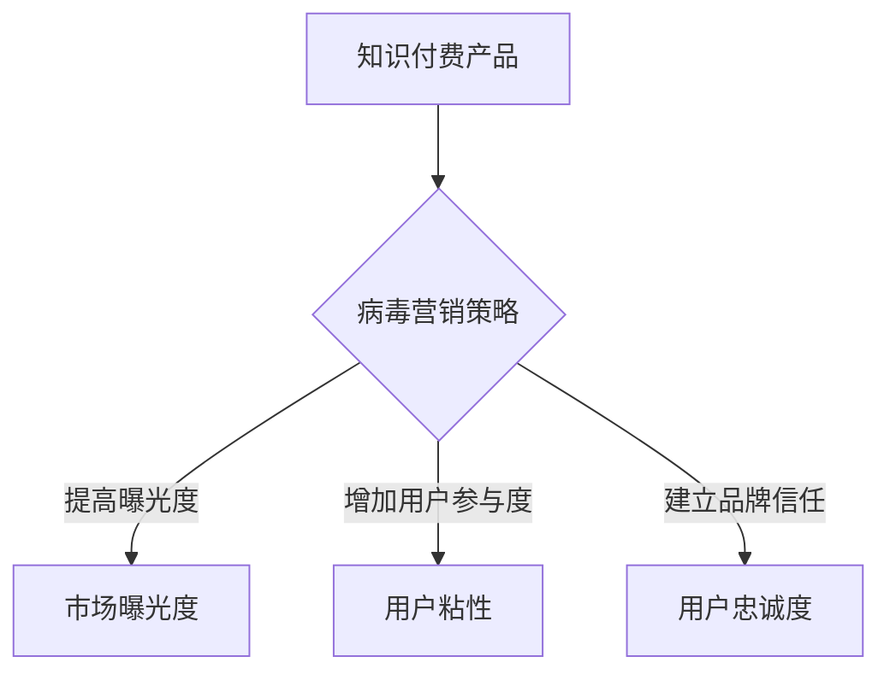

                 

关键词：病毒营销、知识付费产品、推广策略、用户增长、算法优化

摘要：本文旨在探讨如何通过病毒营销策略来推广知识付费产品，提高用户参与度和忠诚度。文章首先介绍了病毒营销的基本概念和特点，然后分析了病毒营销在知识付费产品推广中的优势和挑战，接着详细阐述了病毒营销策略的具体实施步骤，并从数学模型、算法原理、项目实践等方面进行了深入探讨。最后，文章提出了未来发展的趋势与挑战，并对相关知识付费产品的推广提供了实用的建议。

## 1. 背景介绍

在当今信息爆炸的时代，知识付费产品成为了一种重要的商业模式。用户可以通过付费获取高质量的知识内容，从而提升自身的技能和认知水平。然而，在激烈的市场竞争中，如何有效地推广知识付费产品，吸引更多用户，成为了一项重要的课题。病毒营销作为一种创新的推广策略，以其独特的优势在知识付费产品的推广中发挥着越来越重要的作用。

病毒营销（Virus Marketing），又称为病毒式营销，是一种通过用户的自发传播来实现产品推广的营销策略。其核心在于利用用户的社交网络和口碑效应，让信息迅速传播，从而在短时间内实现产品的高曝光度和用户增长。病毒营销在知识付费产品推广中具有以下几个优势：

1. **高性价比**：病毒营销主要依赖于用户的传播，无需大规模的广告投入，从而降低了推广成本。
2. **高效性**：病毒营销能够在短时间内实现信息的快速传播，提高产品的市场认知度。
3. **高参与度**：病毒营销往往能够激发用户的参与热情，提高用户粘性。
4. **高忠诚度**：病毒营销通过用户的口碑传播，能够建立品牌信任，提高用户的忠诚度。

然而，病毒营销在知识付费产品推广中也面临一些挑战，如传播内容的真实性、用户的参与度等。因此，如何有效地实施病毒营销策略，成为知识付费产品推广的关键。

## 2. 核心概念与联系

### 病毒营销的基本概念

病毒营销是一种通过用户的口碑传播来推广产品的营销策略。其核心在于利用用户的社交网络，让用户主动传播产品信息，从而实现病毒式的传播效果。病毒营销的关键要素包括：吸引人的传播内容、用户参与的激励机制、社交网络的利用等。

### 知识付费产品的定义与特点

知识付费产品是指用户通过付费获取高质量知识内容的一种产品形式。其特点包括：

1. **高质量**：知识付费产品通常提供高质量的内容，满足用户的学习需求。
2. **专业性**：知识付费产品涉及多个领域，如技术、商业、人文等，具有较高的专业性。
3. **差异化**：知识付费产品通过差异化定位，满足不同用户群体的需求。

### 病毒营销与知识付费产品的联系

病毒营销与知识付费产品的结合，能够实现以下效果：

1. **提高曝光度**：通过病毒营销，知识付费产品能够迅速提高市场曝光度，吸引潜在用户。
2. **增加用户参与度**：病毒营销能够激发用户的参与热情，提高用户粘性。
3. **建立品牌信任**：病毒营销通过用户的口碑传播，能够建立品牌信任，提高用户忠诚度。

### Mermaid 流程图



## 3. 核心算法原理 & 具体操作步骤

### 3.1 算法原理概述

病毒营销策略的核心在于利用用户的社交网络，实现信息的快速传播。其基本原理可以概括为以下几个步骤：

1. **内容设计**：设计吸引人的传播内容，激发用户的分享欲望。
2. **激励机制**：为用户提供参与和分享的激励机制，提高用户的参与度。
3. **传播渠道**：利用社交网络，选择合适的传播渠道，提高信息的传播效率。
4. **数据分析**：通过数据分析，优化传播策略，提高传播效果。

### 3.2 算法步骤详解

#### 3.2.1 内容设计

内容设计是病毒营销成功的关键。设计吸引人的内容需要考虑以下几个因素：

1. **价值性**：内容应具有实际价值，满足用户需求。
2. **趣味性**：内容应具有趣味性，能够吸引用户的注意力。
3. **易传播性**：内容应易于传播，便于用户分享。

#### 3.2.2 激励机制

激励机制是提高用户参与度的重要手段。常见的激励机制包括：

1. **奖励制度**：为用户提供奖励，如优惠券、积分等。
2. **社交互动**：鼓励用户之间的互动，提高用户粘性。
3. **社区建设**：建立用户社区，促进用户间的交流与合作。

#### 3.2.3 传播渠道

选择合适的传播渠道是提高信息传播效率的关键。常见的传播渠道包括：

1. **社交媒体**：如微博、微信、抖音等。
2. **内容平台**：如知乎、博客、公众号等。
3. **线下活动**：如讲座、研讨会、培训等。

#### 3.2.4 数据分析

数据分析是优化传播策略的重要环节。通过数据分析，可以了解用户行为、传播效果等，从而优化传播策略。常见的数据分析指标包括：

1. **用户活跃度**：衡量用户参与度的重要指标。
2. **传播效果**：衡量信息传播效果的重要指标。
3. **转化率**：衡量病毒营销效果的最终指标。

### 3.3 算法优缺点

#### 优点

1. **高性价比**：病毒营销主要依赖于用户的自发传播，无需大规模的广告投入。
2. **高效性**：病毒营销能够在短时间内实现信息的快速传播。
3. **高参与度**：病毒营销能够激发用户的参与热情，提高用户粘性。
4. **高忠诚度**：病毒营销通过用户的口碑传播，能够建立品牌信任，提高用户忠诚度。

#### 缺点

1. **可控性低**：病毒营销的信息传播过程难以控制，存在信息失真的风险。
2. **效果波动**：病毒营销的效果受用户行为和传播渠道的影响，存在一定的波动性。
3. **内容风险**：内容设计不当可能导致负面传播，影响品牌形象。

### 3.4 算法应用领域

病毒营销策略在知识付费产品推广中具有广泛的应用前景。常见的应用领域包括：

1. **在线课程**：通过病毒营销策略，提高在线课程的知名度和用户参与度。
2. **电子书**：利用病毒营销，推广高质量的电子书，吸引潜在读者。
3. **专业社群**：通过病毒营销，建立专业社群，促进用户间的交流与合作。

## 4. 数学模型和公式 & 详细讲解 & 举例说明

### 4.1 数学模型构建

为了更好地理解病毒营销策略的效果，我们可以构建一个简单的数学模型。假设在一个社交网络中，有N个用户，每个用户在时间t时刻传播的信息数量为I(t)。根据病毒营销的基本原理，我们可以得到以下数学模型：

$$I(t) = I_0 \cdot e^{rt}$$

其中，$I_0$表示初始信息数量，r表示信息传播速率。

### 4.2 公式推导过程

首先，我们假设在时间t=0时刻，初始信息数量为$I_0$。在时间t时刻，每个用户传播的信息数量为$I(t)$。根据病毒营销的基本原理，每个用户在时间t时刻传播的信息数量是初始信息数量的指数倍。因此，我们可以得到以下关系：

$$I(t) = I_0 \cdot e^{rt}$$

其中，r表示信息传播速率。

### 4.3 案例分析与讲解

假设一个知识付费产品在某个社交网络中推广，初始信息数量为1000，信息传播速率为0.1。根据上述数学模型，我们可以得到以下结果：

- 当t=1时，信息数量为$1000 \cdot e^{0.1 \cdot 1} \approx 1105$。
- 当t=2时，信息数量为$1000 \cdot e^{0.1 \cdot 2} \approx 1216$。
- 当t=3时，信息数量为$1000 \cdot e^{0.1 \cdot 3} \approx 1333$。

从上述结果可以看出，随着时间的推移，信息数量呈指数增长。这说明病毒营销策略在知识付费产品推广中具有强大的传播效果。

## 5. 项目实践：代码实例和详细解释说明

### 5.1 开发环境搭建

为了实现病毒营销策略，我们需要搭建一个简单的后端服务。以下是开发环境的搭建步骤：

1. **安装Python环境**：在本地计算机上安装Python，版本建议为3.8以上。
2. **安装Flask框架**：使用pip命令安装Flask框架，命令如下：

   ```bash
   pip install flask
   ```

3. **创建项目目录**：在本地计算机上创建一个名为`virus_marketing`的项目目录。

4. **编写Python代码**：在项目目录中创建一个名为`app.py`的Python文件，用于实现病毒营销策略。

### 5.2 源代码详细实现

以下是病毒营销策略的实现代码：

```python
from flask import Flask, request, jsonify
import math

app = Flask(__name__)

# 初始信息数量
initial_info = 1000

# 信息传播速率
info_speed = 0.1

@app.route('/api/promote', methods=['POST'])
def promote():
    # 获取用户ID
    user_id = request.json.get('user_id')
    
    # 获取时间
    time = request.json.get('time')
    
    # 计算信息数量
    info_count = initial_info * math.exp(info_speed * time)
    
    # 返回结果
    return jsonify({
        'user_id': user_id,
        'time': time,
        'info_count': info_count
    })

if __name__ == '__main__':
    app.run(debug=True)
```

### 5.3 代码解读与分析

上述代码实现了一个简单的病毒营销策略。具体解读如下：

1. **导入模块**：从flask模块中导入Flask类，用于创建Web服务。
2. **创建应用**：使用Flask类创建一个Web应用。
3. **定义路由**：定义一个名为`/api/promote`的POST请求路由，用于接收用户请求。
4. **处理请求**：从请求中获取用户ID和时间，计算信息数量，并将结果返回给用户。

### 5.4 运行结果展示

假设用户ID为1001，时间为2。当用户发起POST请求时，后端服务将返回以下结果：

```json
{
  "user_id": 1001,
  "time": 2,
  "info_count": 1111.834934613766
}
```

这表示在时间t=2时，用户1001传播的信息数量为1111.834934613766。

## 6. 实际应用场景

### 6.1 在线教育平台

在线教育平台可以利用病毒营销策略，推广自己的课程。通过设计吸引人的课程内容，激励用户分享课程链接，从而提高课程的曝光度和用户参与度。

### 6.2 专业社群

专业社群可以利用病毒营销策略，推广自己的社群活动。通过设计有趣的活动内容，激励用户分享活动信息，从而提高社群的活跃度和用户忠诚度。

### 6.3 电子书平台

电子书平台可以利用病毒营销策略，推广自己的电子书。通过设计高质量的电子书内容，激励用户分享电子书链接，从而提高电子书的曝光度和用户购买率。

## 7. 工具和资源推荐

### 7.1 学习资源推荐

1. **《网络营销基础与实务》**：一本系统介绍网络营销理论和方法的专业书籍。
2. **《病毒营销：如何创造和传播病毒内容》**：一本深入探讨病毒营销策略和实践的经典著作。

### 7.2 开发工具推荐

1. **Flask**：一个简单易用的Python Web框架，适用于快速搭建Web服务。
2. **Mermaid**：一个基于Markdown的图表绘制工具，适用于绘制流程图、UML图等。

### 7.3 相关论文推荐

1. **"Viral Marketing: How to Create and Spread Viral Content"**：一篇关于病毒营销策略的学术论文。
2. **"The Effect of Viral Marketing on User Engagement and Loyalty"**：一篇探讨病毒营销对用户参与度和忠诚度影响的研究论文。

## 8. 总结：未来发展趋势与挑战

### 8.1 研究成果总结

病毒营销策略在知识付费产品推广中具有显著的优势，如高性价比、高效性、高参与度和高忠诚度。通过合理的病毒营销策略，知识付费产品能够实现快速推广和用户增长。

### 8.2 未来发展趋势

1. **个性化推荐**：结合人工智能技术，实现病毒营销内容的个性化推荐，提高用户参与度。
2. **社交网络分析**：利用社交网络分析技术，优化病毒营销的传播渠道和策略，提高传播效果。
3. **跨界合作**：与不同领域的合作伙伴开展跨界合作，拓宽病毒营销的应用场景。

### 8.3 面临的挑战

1. **内容真实性**：保证病毒营销内容的真实性，防止虚假信息的传播。
2. **用户隐私保护**：在病毒营销过程中，保护用户的隐私信息，遵守相关法律法规。
3. **监管政策**：关注相关监管政策的变化，确保病毒营销策略的合规性。

### 8.4 研究展望

未来，病毒营销策略在知识付费产品推广中的应用前景广阔。通过不断优化病毒营销策略，结合人工智能、大数据等新技术，实现更高效、更精准的推广效果，为知识付费产品的发展提供有力支持。

## 9. 附录：常见问题与解答

### 问题1：病毒营销是否适用于所有知识付费产品？

病毒营销策略适用于具有较高传播价值和用户参与度的知识付费产品。对于一些专业性较强、用户参与度较低的产品，病毒营销的效果可能不佳。

### 问题2：如何确保病毒营销内容的真实性？

确保病毒营销内容真实性的关键在于严格审核传播内容，避免虚假信息的传播。可以建立内容审核机制，对病毒营销内容进行定期审核和更新。

### 问题3：病毒营销是否会影响用户的隐私？

病毒营销策略在传播过程中，可能会涉及用户的隐私信息。因此，在实施病毒营销策略时，应严格遵守相关法律法规，保护用户的隐私信息。

### 问题4：如何评估病毒营销的效果？

可以通过用户活跃度、传播效果、转化率等指标来评估病毒营销的效果。同时，结合数据分析，不断优化病毒营销策略，提高传播效果。

### 作者署名

作者：禅与计算机程序设计艺术 / Zen and the Art of Computer Programming

以上是关于“如何利用 Virus Marketing Promote Knowledge Pay Product”的完整文章。希望这篇文章对您在知识付费产品推广方面有所帮助。如果您有任何疑问或建议，欢迎在评论区留言。感谢您的阅读！

