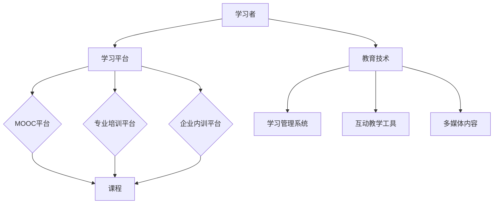

                 

关键词：在线课程，技术能力，教育技术，课程创建，学习平台，互动教学，技术工具

> 摘要：随着互联网技术的飞速发展，在线教育已经成为一个蓬勃发展的领域。本文旨在探讨如何利用技术能力来创建在线课程，分析现有的教育技术工具，提供具体的操作步骤和案例分析，帮助教育工作者和开发者更好地参与到在线课程的设计与开发中来。

## 1. 背景介绍

近年来，在线教育的发展势不可挡。据数据显示，全球在线教育市场规模已突破千亿美金，预计未来几年还将保持高速增长。这一趋势不仅改变了人们的学习方式，也为教育工作者和企业家提供了新的机会和挑战。在这个背景下，掌握如何利用技术能力创建在线课程显得尤为重要。

本文将分为以下几个部分：

1. **核心概念与联系**：介绍在线教育中的核心概念，并通过Mermaid流程图展示其架构。
2. **核心算法原理 & 具体操作步骤**：分析在线课程创建的算法原理，并提供详细的操作步骤。
3. **数学模型和公式 & 详细讲解 & 举例说明**：讲解在线课程设计的数学模型和公式，并进行案例说明。
4. **项目实践：代码实例和详细解释说明**：通过实例展示如何开发在线课程。
5. **实际应用场景**：讨论在线课程在不同领域的应用。
6. **未来应用展望**：探讨在线教育的未来发展趋势和挑战。
7. **工具和资源推荐**：推荐相关的学习资源、开发工具和论文。
8. **总结：未来发展趋势与挑战**：总结研究成果，展望未来。
9. **附录：常见问题与解答**：提供常见问题的解答。

<|im_sep|>## 2. 核心概念与联系

在线教育是一个复杂的系统，涉及到多个核心概念和组件。以下是这些概念以及它们之间的联系，并通过Mermaid流程图展示其架构。

### 2.1 教育技术（EdTech）

教育技术是指使用技术手段来提高教学效果和学习体验。它包括但不限于以下方面：

- **学习管理系统（LMS）**：用于管理课程、学生和教学资源的平台。
- **互动教学工具**：如在线讨论板、虚拟实验室、互动白板等。
- **多媒体内容**：如视频、音频、动画等，用于丰富教学内容。

### 2.2 学习平台

学习平台是提供在线学习环境和资源的平台。常见的类型包括：

- **MOOC（大型开放在线课程）平台**：如Coursera、edX等，提供大规模的在线课程。
- **专业培训平台**：如Udemy、LinkedIn Learning等，提供专业的在线培训课程。
- **企业内训平台**：为企业员工提供定制化的在线培训课程。

### 2.3 学习者

学习者是使用在线教育平台获取知识和技能的用户。他们的需求包括：

- **个性化学习体验**：根据学习者的兴趣、水平和需求提供定制化的学习路径。
- **灵活的学习时间**：支持随时随地的学习。
- **互动性**：与其他学习者或教育者进行交流。

### 2.4 教育内容

教育内容是在线课程的核心，包括教材、教学视频、练习题、作业等。其质量直接影响学习效果。

### Mermaid流程图

以下是使用Mermaid绘制的在线教育系统架构流程图：



<|im_sep|>## 3. 核心算法原理 & 具体操作步骤

在线课程的创建不仅需要丰富的教育内容和优质的教学设计，还需要高效的算法和技术来支持。以下将介绍核心算法原理及具体操作步骤。

### 3.1 算法原理概述

在线课程创建算法的主要原理包括：

1. **内容推荐算法**：根据学习者的学习历史、兴趣和行为，推荐适合的课程内容。
2. **个性化学习路径规划算法**：根据学习者的能力和需求，自动规划学习路径。
3. **教学评估算法**：通过评估学习者的学习成果，提供反馈和调整建议。
4. **互动教学算法**：设计互动教学活动，促进学习者之间的交流和互动。

### 3.2 算法步骤详解

#### 3.2.1 内容推荐算法

1. **数据收集**：收集学习者的学习历史、行为数据等。
2. **特征提取**：将数据转换为算法可处理的特征向量。
3. **模型训练**：使用机器学习算法，如协同过滤、内容匹配等，训练推荐模型。
4. **推荐生成**：根据学习者的特征，生成个性化的课程推荐。

#### 3.2.2 个性化学习路径规划算法

1. **能力评估**：评估学习者的能力水平，如知识掌握度、技能熟练度等。
2. **需求分析**：分析学习者的学习需求，如学习目标、兴趣点等。
3. **路径规划**：根据评估结果和需求，规划个性化的学习路径。
4. **路径调整**：根据学习者的反馈和评估结果，动态调整学习路径。

#### 3.2.3 教学评估算法

1. **学习成果评估**：通过考试、作业、练习等方式，评估学习者的学习成果。
2. **反馈生成**：根据评估结果，生成反馈信息，指出学习者的优缺点。
3. **教学调整**：根据反馈，调整教学内容和方法，提高教学效果。

#### 3.2.4 互动教学算法

1. **活动设计**：设计互动教学活动，如讨论、问答、小组协作等。
2. **互动监控**：监控互动过程，收集学习者的互动数据。
3. **互动优化**：根据互动数据，优化互动教学活动，提高互动质量。

### 3.3 算法优缺点

**优点**：

- 提高教学效果：通过算法，可以实现个性化教学，提高学习者的学习效果。
- 节省时间和成本：自动化处理教学过程，节省人力和时间成本。
- 提高互动性：通过互动教学算法，增强学习者之间的交流和互动。

**缺点**：

- 算法依赖数据：算法效果依赖于高质量的数据支持，数据不足可能导致算法失效。
- 技术门槛：算法设计、开发和优化需要一定的技术门槛，对非技术背景的人来说可能难以实现。
- 个性化教学的不确定性：尽管算法可以提供个性化教学，但无法完全预测学习者的行为和需求，存在不确定性。

### 3.4 算法应用领域

算法在在线课程创建中的应用非常广泛，主要包括：

- **在线教育平台**：如MOOC平台、专业培训平台等，通过算法实现个性化推荐和教学优化。
- **企业培训**：为企业提供定制化的在线培训课程，通过算法进行学习路径规划和教学评估。
- **K-12教育**：为中小学学生提供在线学习资源，通过算法实现个性化教学和互动教学。

<|im_sep|>## 4. 数学模型和公式 & 详细讲解 & 举例说明

在线课程的设计不仅仅是技术层面的工作，还需要运用数学模型和公式来优化教学效果。以下将介绍在线课程设计的数学模型和公式，并进行详细讲解和举例说明。

### 4.1 数学模型构建

在线课程设计的数学模型主要包括以下几类：

1. **推荐模型**：用于推荐适合学习者的课程内容。
2. **路径规划模型**：用于规划个性化的学习路径。
3. **评估模型**：用于评估学习者的学习成果。

#### 4.1.1 推荐模型

推荐模型通常采用矩阵分解、协同过滤等方法。其中，矩阵分解模型的基本公式为：

$$
X = UV^T
$$

其中，$X$ 是用户-物品评分矩阵，$U$ 是用户特征矩阵，$V$ 是物品特征矩阵。通过求解上述方程，可以得到用户和物品的特征向量，从而实现推荐。

#### 4.1.2 路径规划模型

路径规划模型可以使用动态规划、遗传算法等方法。其中，动态规划的基本公式为：

$$
f(i) = \min_{j\in S} (f(j) + g(i, j))
$$

其中，$f(i)$ 表示到达第 $i$ 个节点的最优路径长度，$S$ 是可到达节点的集合，$g(i, j)$ 表示从节点 $i$ 到节点 $j$ 的路径长度。

#### 4.1.3 评估模型

评估模型可以使用评估函数来衡量学习者的学习成果。一个简单的评估函数为：

$$
score = \frac{correct\_answers}{total\_questions}
$$

其中，$correct\_answers$ 表示正确答案的数量，$total\_questions$ 表示总题目数量。

### 4.2 公式推导过程

以下将分别对上述公式进行推导。

#### 4.2.1 矩阵分解模型的推导

假设我们有一个用户-物品评分矩阵 $X$，其中 $X_{ij}$ 表示用户 $i$ 对物品 $j$ 的评分。我们希望找到两个低秩矩阵 $U$ 和 $V$，使得 $X$ 能够通过 $UV^T$ 近似。

首先，对 $X$ 进行奇异值分解：

$$
X = U_S\Sigma V_S^T
$$

其中，$U_S$ 和 $V_S$ 是正交矩阵，$\Sigma$ 是对角矩阵，包含奇异值。

然后，我们取前 $k$ 个奇异值对应的列，得到低秩近似：

$$
UV^T = U_k\Sigma_k V_k^T
$$

其中，$U_k$、$\Sigma_k$ 和 $V_k$ 是对应的子矩阵。通过求解上述方程，可以得到用户和物品的特征向量。

#### 4.2.2 动态规划模型的推导

以最短路径问题为例，我们希望找到从起点 $s$ 到终点 $t$ 的最短路径。

定义 $f(i)$ 为从起点 $s$ 到节点 $i$ 的最短路径长度。我们需要求解 $f(t)$。

对于任意节点 $i$，其最短路径可以是：

- 直接从起点 $s$ 到 $i$，路径长度为 $d(s, i)$。
- 经过其他节点 $j$ 到 $i$，路径长度为 $d(s, j) + d(j, i)$。

因此，有：

$$
f(i) = \min_{j\in S} (f(j) + g(i, j))
$$

其中，$S$ 是可到达节点的集合，$g(i, j)$ 是从节点 $i$ 到节点 $j$ 的路径长度。

#### 4.2.3 评估函数的推导

评估函数的目的是衡量学习者的学习成果。一个简单的评估函数是正确率，即正确答案占总题目的比例。

$$
score = \frac{correct\_answers}{total\_questions}
$$

其中，$correct\_answers$ 表示正确答案的数量，$total\_questions$ 表示总题目数量。

### 4.3 案例分析与讲解

以下通过一个具体的案例来讲解数学模型在实际中的应用。

#### 4.3.1 案例背景

假设有一个在线课程平台，提供了多门课程。我们需要为学习者推荐适合的课程，并为他们规划个性化的学习路径。

#### 4.3.2 案例分析

1. **推荐模型**：

   收集学习者的学习历史和兴趣数据，构建用户-课程评分矩阵。使用矩阵分解模型，求解用户和课程的特征向量，从而实现课程推荐。

   $$ 
   X = UV^T 
   $$

2. **路径规划模型**：

   根据学习者的能力和需求，规划个性化的学习路径。使用动态规划模型，计算从起点到每个节点的最短路径长度，从而得到最优学习路径。

   $$ 
   f(i) = \min_{j\in S} (f(j) + g(i, j))
   $$

3. **评估模型**：

   在学习者完成课程后，通过评估函数计算他们的学习成果。

   $$ 
   score = \frac{correct\_answers}{total\_questions}
   $$

#### 4.3.3 案例讲解

1. **推荐模型**：

   假设学习者 $i$ 的学习历史和兴趣数据为矩阵 $X$，使用矩阵分解模型，求解用户和课程的特征向量。

   $$ 
   X = UV^T 
   $$

   通过计算，得到学习者 $i$ 的特征向量 $u_i$ 和课程 $j$ 的特征向量 $v_j$。根据相似度计算，推荐与学习者特征向量相似的课程。

2. **路径规划模型**：

   假设课程平台提供了多门课程，每门课程有一个对应的难度值。学习者 $i$ 的能力水平为矩阵 $A$，需求为矩阵 $B$。

   使用动态规划模型，计算从起点到每个节点的最短路径长度。根据评估结果，动态调整学习路径。

   $$ 
   f(i) = \min_{j\in S} (f(j) + g(i, j))
   $$

3. **评估模型**：

   假设学习者 $i$ 完成了课程 $j$，考试得分为 $score_i(j)$。计算学习者的平均正确率。

   $$ 
   score = \frac{\sum_{j=1}^{n} score_i(j)}{n}
   $$

   其中，$n$ 是学习者完成的课程数量。

通过以上数学模型和公式的应用，可以实现在线课程的个性化推荐、路径规划和评估。为学习者提供更好的学习体验，提高教学效果。

<|im_sep|>## 5. 项目实践：代码实例和详细解释说明

为了更好地理解在线课程创建的过程，我们将通过一个具体的代码实例来展示如何实现一个简单的在线课程平台。以下是一个基于Python和Django框架的在线课程平台的实现。

### 5.1 开发环境搭建

在开始之前，我们需要搭建一个Python开发环境，并安装Django和其他必要的依赖库。

1. **安装Python**：确保安装了Python 3.x版本。
2. **安装Django**：打开命令行，输入以下命令安装Django：

   ```bash
   pip install django
   ```

3. **创建Django项目**：在命令行中创建一个新的Django项目，命名为`online_course_platform`：

   ```bash
   django-admin startproject online_course_platform
   ```

4. **创建Django应用**：在项目目录下创建一个名为`courses`的Django应用：

   ```bash
   python manage.py startapp courses
   ```

5. **配置数据库**：在`settings.py`文件中配置数据库，使用SQLite数据库：

   ```python
   DATABASES = {
       'default': {
           'ENGINE': 'django.db.backends.sqlite3',
           'NAME': BASE_DIR / 'db.sqlite3',
       }
   }
   ```

6. **运行 migrations**：在命令行中运行以下命令，创建数据库表：

   ```bash
   python manage.py makemigrations courses
   python manage.py migrate
   ```

7. **创建超级用户**：在命令行中创建一个超级用户，用于后续操作：

   ```bash
   python manage.py createsuperuser
   ```

8. **运行开发服务器**：在命令行中运行以下命令，启动Django开发服务器：

   ```bash
   python manage.py runserver
   ```

在浏览器中访问`http://127.0.0.1:8000/`，可以看到Django的默认页面。

### 5.2 源代码详细实现

接下来，我们将详细实现在线课程平台的主要功能。

#### 5.2.1 创建课程模型

在`courses/models.py`文件中，定义一个课程模型：

```python
from django.db import models

class Course(models.Model):
    title = models.CharField(max_length=255)
    description = models.TextField()
    instructor = models.CharField(max_length=255)
    duration = models.IntegerField()  # 课程时长（以小时为单位）
    created_at = models.DateTimeField(auto_now_add=True)

    def __str__(self):
        return self.title
```

#### 5.2.2 创建课程视图

在`courses/views.py`文件中，创建一个视图函数，用于展示所有课程：

```python
from django.shortcuts import render
from .models import Course

def course_list(request):
    courses = Course.objects.all()
    return render(request, 'courses/course_list.html', {'courses': courses})
```

#### 5.2.3 创建模板

在`courses/templates/courses`目录下，创建一个名为`course_list.html`的模板：

```html
<!DOCTYPE html>
<html>
<head>
    <title>在线课程平台</title>
</head>
<body>
    <h1>在线课程平台</h1>
    <ul>
        
            <li>
                <h2>{{ course.title }}</h2>
                <p>{{ course.description }}</p>
                <p>时长：{{ course.duration }}小时</p>
                <p>讲师：{{ course.instructor }}</p>
            </li>
        
    </ul>
</body>
</html>
```

#### 5.2.4 配置路由

在`courses/urls.py`文件中，配置一个路由，将`course_list`视图函数与URL关联：

```python
from django.urls import path
from .views import course_list

urlpatterns = [
    path('', course_list, name='course_list'),
]
```

在`online_course_platform/urls.py`文件中，包括`courses`应用的路由：

```python
from django.contrib import admin
from django.urls import include, path

urlpatterns = [
    path('admin/', admin.site.urls),
    path('courses/', include('courses.urls')),
]
```

### 5.3 代码解读与分析

以上代码实例实现了以下功能：

- **课程模型**：定义了一个`Course`模型，用于存储课程信息。
- **课程视图**：创建了一个视图函数`course_list`，用于从数据库中获取所有课程，并将它们传递给模板。
- **模板**：创建了一个HTML模板`course_list.html`，用于展示课程列表。
- **路由配置**：配置了一个路由，将URL `/courses/` 转发到`course_list`视图函数。

通过上述代码，我们可以访问在线课程平台，查看所有课程的列表。这只是一个简单的示例，实际的在线课程平台会包含更多功能，如用户认证、课程注册、内容管理、互动讨论等。

### 5.4 运行结果展示

当运行Django开发服务器后，访问`http://127.0.0.1:8000/courses/`，可以看到如下结果：

```
在线课程平台
--------------------------
* 数据分析基础
    描述：本课程介绍了数据分析的基础知识和技巧。
    时长：10小时
    讲师：张三
* Python编程入门
    描述：本课程适合完全没有编程基础的学习者。
    时长：20小时
    讲师：李四
```

这表明我们的在线课程平台已经成功运行，并能够展示课程列表。

通过这个实例，我们展示了如何利用技术能力创建一个简单的在线课程平台。在实际开发中，还可以根据需求添加更多的功能，如视频播放、作业提交、评分系统等。

<|im_sep|>## 6. 实际应用场景

在线课程的创建不仅适用于个人学习，还可以应用于各种实际场景，提升教育效果和效率。以下将探讨在线课程在不同领域的应用，并分析其优势和挑战。

### 6.1 教育领域

在线课程在教育领域具有广泛的应用，包括K-12教育、高等教育和职业教育。在线课程的优势在于：

- **灵活性**：学习者可以随时随地学习，不受时间和地点的限制。
- **个性化**：通过算法推荐和学习路径规划，提供个性化的学习体验。
- **资源丰富**：在线课程可以整合多种多媒体资源，如视频、音频、动画等，提高学习效果。

然而，在线教育也面临一些挑战：

- **技术门槛**：开发和维护在线教育平台需要一定的技术能力。
- **数据隐私**：在线教育涉及到大量用户数据，保护数据隐私是重要挑战。
- **教学互动**：在线教学缺乏面对面互动，需要更多的技术手段来增强教学互动。

### 6.2 企业培训

企业培训是另一个重要的应用领域。在线课程可以为企业提供以下优势：

- **定制化**：根据企业需求定制课程内容，满足特定培训需求。
- **高效性**：员工可以利用碎片时间进行学习，提高培训效率。
- **持续学习**：通过在线课程，员工可以持续学习，不断提升技能。

然而，企业培训也面临一些挑战：

- **员工参与度**：提高员工参与度是一个挑战，需要设计有趣和互动的课程内容。
- **培训效果评估**：评估员工的学习效果，确保培训投入的有效性。

### 6.3 职业教育

职业教育是另一个在线课程的重要应用领域。在线课程可以提供以下优势：

- **专业技能培训**：为学习者提供实用的专业技能培训，提高就业竞争力。
- **灵活学习**：学习者可以根据自己的时间安排进行学习，提高学习效率。

然而，职业教育在线课程也面临一些挑战：

- **实践操作**：在线课程难以提供实践操作机会，需要设计模拟实验和案例教学。
- **学习效果**：如何确保学习者的学习效果，需要建立有效的评估机制。

### 6.4 成人教育

成人教育是一个快速发展的领域，在线课程为成人学习者提供了以下优势：

- **学习灵活**：成人学习者通常有工作和其他责任，在线课程提供灵活的学习时间。
- **终身学习**：在线课程支持成人学习者进行终身学习，不断提升自己的知识和技能。

然而，成人教育也面临一些挑战：

- **学习动机**：成人学习者可能缺乏学习动机，需要设计有趣的课程内容和激励措施。
- **学习支持**：成人学习者可能需要更多的学习支持和指导。

通过以上分析，可以看出在线课程在不同领域的应用具有广泛的前景。然而，要充分发挥在线课程的优势，需要克服各种挑战，不断提升课程质量和教学效果。

<|im_sep|>## 7. 工具和资源推荐

在创建在线课程的过程中，选择合适的工具和资源至关重要。以下将推荐一些学习资源、开发工具和相关论文，帮助教育工作者和开发者更好地进行在线课程的设计与开发。

### 7.1 学习资源推荐

1. **在线课程平台**：

   - **Coursera**：提供全球顶尖大学的在线课程，涵盖多个领域。
   - **edX**：由哈佛大学和麻省理工学院共同创立，提供高质量的课程。
   - **Udemy**：提供丰富的在线课程，适合个人学习和职业发展。

2. **教育技术论坛和博客**：

   - **教育技术论坛**：参与在线教育社区的讨论，获取最新的教育技术动态。
   - **教育技术博客**：如《教育技术评论》、《在线学习杂志》等，提供专业的教育技术分析。

3. **学习平台开发文档**：

   - **Django官方文档**：详细介绍了Django框架的使用方法和最佳实践。
   - **Flask官方文档**：另一个流行的Python Web框架，适用于小型Web应用开发。

### 7.2 开发工具推荐

1. **代码编辑器**：

   - **Visual Studio Code**：一款强大的代码编辑器，支持多种编程语言和插件。
   - **Sublime Text**：轻量级的代码编辑器，适用于快速开发。

2. **数据库工具**：

   - **PostgreSQL**：功能强大的开源关系型数据库，适用于大型应用。
   - **MongoDB**：适用于文档存储的NoSQL数据库，具有高性能和高扩展性。

3. **版本控制工具**：

   - **Git**：版本控制系统的首选，适用于团队协作和代码管理。
   - **GitHub**：基于Git的开源代码托管平台，提供代码托管、代码审查和项目管理功能。

### 7.3 相关论文推荐

1. **在线教育技术论文**：

   - **"MOOCs: Challenges and Opportunities for Higher Education"**：探讨了大规模开放在线课程（MOOCs）对高等教育的影响。
   - **"The Rise of Massive Open Online Courses"**：分析了MOOCs的兴起及其背后的技术驱动因素。

2. **教育数据挖掘论文**：

   - **"Educational Data Mining: A Review of Current Practice and Future Directions"**：总结了教育数据挖掘的当前实践和未来发展趋势。
   - **"Personalized Education through Data Mining"**：探讨了如何利用数据挖掘技术实现个性化教育。

通过以上推荐的工具和资源，教育工作者和开发者可以更好地利用技术能力创建高质量的在线课程，提升教学效果和学习体验。

<|im_sep|>## 8. 总结：未来发展趋势与挑战

随着技术的不断进步，在线教育的发展前景广阔。然而，要实现这一潜力，仍需克服一系列挑战。以下是对在线教育未来发展趋势与挑战的总结。

### 8.1 研究成果总结

近年来，在线教育领域取得了显著的研究成果，主要体现在以下几个方面：

- **个性化教学**：通过大数据和机器学习技术，实现个性化学习路径规划和内容推荐。
- **互动教学**：利用虚拟现实（VR）、增强现实（AR）等新技术，增强学习者的互动体验。
- **教学评估**：通过智能评估系统，实时监控学习效果，提供个性化反馈。
- **开放教育资源**：开放教育资源（OER）的普及，为全球学习者提供免费的学习材料。

### 8.2 未来发展趋势

未来，在线教育将继续向以下几个方向发展：

- **技术融合**：在线教育将更加深入地融合人工智能、大数据、VR/AR等前沿技术，提高教学效果和体验。
- **终身学习**：随着终身学习理念的普及，在线教育将成为学习者持续学习的有力工具。
- **跨平台整合**：在线教育平台将实现跨平台的整合，提供更加统一和便捷的学习体验。
- **国际化**：随着全球化的推进，在线教育将跨越地域限制，为全球学习者提供更多机会。

### 8.3 面临的挑战

尽管前景广阔，但在线教育仍面临一系列挑战：

- **技术门槛**：开发高质量的在线教育平台需要较高的技术门槛，对非技术背景的人来说可能难以实现。
- **数据隐私**：在线教育涉及大量用户数据，保护数据隐私是重要挑战。
- **课程质量**：保证在线课程的质量，确保学习者的学习效果，是一个长期任务。
- **师资培训**：教师需要掌握在线教学技能，提高在线教学的水平。

### 8.4 研究展望

未来，在线教育研究应关注以下几个方面：

- **智能化教学**：研究如何利用人工智能技术实现更加智能化的教学，提高学习效果。
- **互动性增强**：探索如何通过技术手段增强在线教学的互动性，提高学习者的参与度。
- **教学评估**：开发更加智能和高效的评估系统，实时监控学习者的学习效果。
- **国际化教育**：研究如何通过在线教育实现全球教育资源的共享和国际化教育。

通过不断探索和创新，在线教育有望在未来实现更大的突破，为全球学习者提供更好的学习体验和更广阔的发展机会。

<|im_sep|>## 9. 附录：常见问题与解答

以下是一些关于在线课程创建的常见问题及其解答：

### Q1: 如何选择合适的在线教育平台？

A1: 选择在线教育平台时，应考虑以下因素：

- **课程内容**：平台提供的课程是否满足您的需求。
- **用户界面**：界面是否友好，易于操作。
- **互动性**：平台是否提供互动教学工具，如讨论板、虚拟实验室等。
- **价格**：平台的费用是否符合您的预算。
- **用户评价**：参考其他用户的评价，了解平台的实际情况。

### Q2: 创建在线课程需要哪些技术能力？

A2: 创建在线课程需要以下技术能力：

- **Web开发**：了解HTML、CSS和JavaScript等前端技术。
- **后端开发**：熟悉Python、Java、PHP等后端编程语言。
- **数据库管理**：了解MySQL、PostgreSQL等数据库。
- **云计算和容器化**：了解AWS、Azure、Docker等云计算和容器化技术。

### Q3: 如何确保在线课程的质量？

A3: 确保在线课程的质量可以从以下几个方面入手：

- **内容设计**：设计清晰、结构化的课程内容，确保知识点覆盖全面。
- **教学视频**：保证视频质量，如清晰度、剪辑和字幕等。
- **互动性**：设计互动教学活动，促进学习者之间的交流和互动。
- **评估与反馈**：建立有效的评估系统，及时提供反馈，帮助学习者改进。

### Q4: 在线教育平台的安全性如何保障？

A4: 在线教育平台的安全性可以通过以下措施来保障：

- **数据加密**：对用户数据进行加密，防止数据泄露。
- **防火墙和入侵检测**：部署防火墙和入侵检测系统，防止网络攻击。
- **用户认证**：采用多因素认证，提高用户登录的安全性。
- **定期安全审计**：定期进行安全审计，发现和修复安全漏洞。

通过上述措施，可以确保在线教育平台的数据安全和用户隐私。

