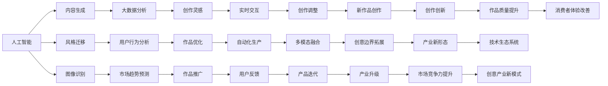

                 

# 如何利用技术能力进行创意产业革新

> 关键词：
技术革新,创意产业,人工智能,数据驱动,自动化,数字化转型,创新与创业,艺术与科技融合

## 1. 背景介绍

在过去的几十年中，全球经济社会经历了快速变革，信息技术的飞速发展，尤其是人工智能、大数据和物联网等技术的兴起，极大地改变了各行各业的运营模式和竞争格局。尤其是创意产业，传统的手工劳动方式已经被机器自动化、智能化技术所替代，创意过程也正逐步被数字化、数据化、算法化。本文将深入探讨技术如何助力创意产业的革新，从理论到实践，帮助读者更好地理解和掌握这一变革。

### 1.1 问题由来

创意产业，包括广告、影视、音乐、出版、游戏等多个领域，一直是经济发展的重要支柱。然而，随着市场竞争的加剧和技术的发展，传统的创意工作方式已经面临严峻挑战。一方面，创意作品生产周期长、成本高、见效慢，难以快速迭代和市场响应；另一方面，创意创作依赖人类智慧和灵感，难以量化和标准化。如何利用技术手段提升创意产业的生产效率和作品质量，成为当前需要解决的核心问题。

近年来，人工智能、大数据、机器学习等技术在创意产业中的应用日益广泛，展示了巨大的潜力和前景。例如，深度学习可以用于内容生成、风格迁移、图像识别等，大数据分析可以用于用户行为分析、市场趋势预测，自然语言处理可以用于智能写作、语音识别等。这些技术正在不断推动创意产业的数字化转型，提高生产效率，拓宽创作边界，促进产业升级。

### 1.2 问题核心关键点

1. **数据驱动的创意创作**：创意作品的创作越来越依赖于对海量数据的分析和学习。大数据分析可以帮助创作者从用户行为、市场趋势、社交媒体等多种渠道获取信息，指导创作方向和内容。

2. **人工智能辅助创作**：人工智能能够自动化完成许多繁琐的创作任务，如图像生成、文本生成、音乐生成等，为人类创作者提供更多时间和空间进行深度创作。

3. **实时交互与反馈**：通过实时交互系统，创作者可以即时接收用户反馈，及时调整作品内容和风格，提升作品的市场接受度。

4. **自动化生产流程**：通过自动化工具和平台，创作者可以高效完成创作流程，从素材收集、数据分析到作品发布，减少人工干预，提高效率。

5. **多模态数据融合**：将文字、图像、声音等多模态数据融合，创作出更具表现力和感染力的作品，拓展创意产业的边界。

### 1.3 问题研究意义

技术助力创意产业的革新，不仅能够提升生产效率，降低成本，还能为创作者提供更多创意灵感和创作工具，拓宽创作边界，推动产业升级。具体意义如下：

1. **提升生产效率**：技术可以自动化完成许多繁琐的任务，如素材处理、排版设计、数据分析等，让创作者有更多时间专注于创意和思考。

2. **降低创作成本**：技术降低了创意作品的制作门槛，使得更多人有机会参与创作，推动创意产业的发展。

3. **拓宽创作边界**：技术支持创作者探索新的创作领域和工具，打破传统创作的边界，推动创新。

4. **促进产业升级**：技术驱动的创意产业更具竞争力，能更快适应市场需求，提升产品质量和市场接受度。

## 2. 核心概念与联系

### 2.1 核心概念概述

本节将介绍几个关键概念及其相互关系，帮助读者理解技术如何助力创意产业的革新。

1. **人工智能（AI）**：通过学习算法，人工智能可以模拟人类的思考和行为，自动完成各种任务。在创意产业中，AI可用于内容生成、风格迁移、图像识别等。

2. **大数据（Big Data）**：大数据分析可以帮助创作者从海量数据中挖掘出有价值的信息，指导创作方向和内容。

3. **数据驱动（Data-Driven）**：创意作品的创作越来越依赖于对数据的分析和学习，从市场趋势、用户反馈到创作灵感，数据驱动的方法能提供更多决策依据。

4. **自动化（Automation）**：自动化工具和平台能够高效完成创意流程，减少人工干预，提高生产效率。

5. **数字化转型（Digital Transformation）**：创意产业的数字化转型，使得创作过程和产品发布都通过数字化的方式进行，提高了灵活性和效率。

这些概念之间存在紧密的联系，共同构成了技术助力创意产业革新的基础框架。

### 2.2 核心概念原理和架构的 Mermaid 流程图



这个流程图展示了人工智能、大数据、数据驱动、自动化、数字化转型等关键概念之间的联系，以及它们如何共同推动创意产业的革新。

## 3. 核心算法原理 & 具体操作步骤

### 3.1 算法原理概述

技术助力创意产业的革新，通常涉及多种算法和技术的组合使用。下面详细介绍几个关键算法的原理和操作步骤。

### 3.2 算法步骤详解

#### 3.2.1 数据预处理

**数据清洗**：去除数据中的噪声和异常值，保证数据质量。

**数据标注**：为数据添加标签，便于机器学习模型的训练。

**数据增强**：通过数据扩充和变换，提高模型的泛化能力，减少过拟合。

#### 3.2.2 模型训练

**选择模型**：根据任务选择合适的模型，如卷积神经网络(CNN)、循环神经网络(RNN)、生成对抗网络(GAN)等。

**模型训练**：使用训练数据对模型进行迭代优化，调整模型参数，提高预测准确性。

**模型评估**：使用验证集评估模型的性能，避免过拟合，调整模型结构。

#### 3.2.3 模型部署

**模型保存**：将训练好的模型保存为文件，便于后续使用。

**模型部署**：将模型部署到实际应用中，如Web应用、移动应用等。

**模型监控**：实时监控模型性能，及时调整和优化。

### 3.3 算法优缺点

#### 3.3.1 数据驱动的创意创作

**优点**：
1. **精准指导**：大数据分析可以提供精准的市场和用户需求，指导创作者方向和内容。
2. **实时反馈**：实时数据分析和反馈，帮助创作者即时调整和优化作品。

**缺点**：
1. **隐私风险**：数据收集和分析过程中可能涉及用户隐私，需严格遵守数据保护法规。
2. **数据偏见**：数据质量参差不齐，可能引入偏见和错误信息。

#### 3.3.2 人工智能辅助创作

**优点**：
1. **高效创作**：AI可以自动化完成许多繁琐的创作任务，提升创作效率。
2. **多样化创作**：AI生成的作品更具多样性和创新性，拓宽创作边界。

**缺点**：
1. **作品质量参差不齐**：AI生成的作品质量参差不齐，可能难以满足高标准要求。
2. **依赖技术**：过度依赖AI可能削弱人类创作者的灵感和创造力。

#### 3.3.3 实时交互与反馈

**优点**：
1. **即时调整**：实时交互系统帮助创作者即时接收用户反馈，调整创作内容。
2. **提升用户体验**：实时反馈和调整提升作品的市场接受度，提升用户满意度。

**缺点**：
1. **技术复杂性**：实时交互系统技术复杂，开发和维护成本高。
2. **用户隐私**：用户反馈和数据可能涉及隐私，需严格保护。

#### 3.3.4 自动化生产流程

**优点**：
1. **提升效率**：自动化工具和平台高效完成创意流程，减少人工干预。
2. **降低成本**：自动化流程降低制作成本，使得更多人有机会参与创作。

**缺点**：
1. **技术门槛**：自动化流程需要掌握相关技术，对创作者有一定门槛。
2. **灵活性降低**：自动化流程可能降低创作的灵活性和个性化。

### 3.4 算法应用领域

#### 3.4.1 广告创意

**数据驱动**：通过分析用户行为数据、市场趋势，指导广告创意方向和内容。

**AI辅助**：使用生成对抗网络(GAN)生成创意广告素材，提升创作效率和多样性。

**实时交互**：通过A/B测试实时调整广告创意和投放策略，优化广告效果。

#### 3.4.2 影视制作

**数据驱动**：通过分析观众反馈数据、市场趋势，指导影视制作方向和内容。

**AI辅助**：使用深度学习生成剧本、角色设计、特效等，提升制作效率和创新性。

**实时交互**：通过观众投票和反馈实时调整剧情和角色设定，提升观众满意度。

#### 3.4.3 音乐创作

**数据驱动**：通过分析用户听歌行为数据，指导音乐创作方向和风格。

**AI辅助**：使用生成模型生成旋律、歌词，提升创作效率和多样性。

**实时交互**：通过在线平台实时接收用户反馈，调整音乐创作方向和风格。

## 4. 数学模型和公式 & 详细讲解

### 4.1 数学模型构建

**问题描述**：
假设有一款广告应用，需要根据用户行为数据生成创意广告内容，并实时接收用户反馈，优化广告效果。

**模型构建**：
1. **数据收集**：收集用户浏览、点击、评论等行为数据。
2. **数据清洗**：去除数据中的噪声和异常值。
3. **数据标注**：为数据添加标签，如点击率、转化率、满意度等。
4. **模型选择**：选择生成对抗网络(GAN)模型进行广告内容生成。
5. **模型训练**：使用收集到的用户行为数据，训练生成对抗网络。
6. **模型评估**：使用验证集评估模型效果，调整模型参数。
7. **模型部署**：将训练好的模型部署到实际应用中，实时接收用户反馈，优化广告效果。

**公式推导**：
设广告内容为 $x$，用户反馈为 $y$，生成对抗网络模型为 $G(x)$，判别器模型为 $D(x)$。

**损失函数**：
$$
\mathcal{L} = \mathcal{L}_{\text{real}} + \mathcal{L}_{\text{fake}} + \mathcal{L}_{\text{disc}} + \mathcal{L}_{\text{gen}}
$$

**生成器损失函数**：
$$
\mathcal{L}_{\text{gen}} = \mathbb{E}_{x}[\log D(G(x))]
$$

**判别器损失函数**：
$$
\mathcal{L}_{\text{disc}} = \mathbb{E}_{x}[\log D(x)] + \mathbb{E}_{z}[\log (1 - D(G(z))]]
$$

**生成器和判别器联合损失函数**：
$$
\mathcal{L}_{\text{real}} = \mathbb{E}_{x}[\log D(x)]
$$
$$
\mathcal{L}_{\text{fake}} = \mathbb{E}_{z}[\log (1 - D(G(z)))]
$$

### 4.2 公式推导过程

**生成器和判别器**：
1. **生成器**：接收随机噪声 $z$，生成广告内容 $x$。
2. **判别器**：接收广告内容 $x$，判断其真实性，输出概率。

**损失函数**：
1. **生成器损失**：希望生成的广告内容尽可能欺骗判别器，生成器希望判别器误判生成广告内容为真实内容。
2. **判别器损失**：希望准确判断广告内容的真实性，判别器希望生成广告内容看起来非常真实。
3. **联合损失**：综合生成器和判别器的损失，实现双方的对抗和平衡。

### 4.3 案例分析与讲解

**案例描述**：
一家广告公司需要快速生成创意广告内容，并进行实时优化。

**解决方案**：
1. **数据收集**：收集用户浏览、点击、评论等行为数据。
2. **数据清洗**：去除数据中的噪声和异常值。
3. **数据标注**：为数据添加标签，如点击率、转化率、满意度等。
4. **模型选择**：选择生成对抗网络(GAN)模型进行广告内容生成。
5. **模型训练**：使用收集到的用户行为数据，训练生成对抗网络。
6. **模型评估**：使用验证集评估模型效果，调整模型参数。
7. **模型部署**：将训练好的模型部署到实际应用中，实时接收用户反馈，优化广告效果。

**算法实现**：
1. **数据预处理**：使用Python的Pandas库进行数据清洗和标注。
2. **模型训练**：使用TensorFlow框架实现生成对抗网络，并进行模型训练。
3. **模型评估**：使用Keras库进行模型评估，调整模型参数。
4. **模型部署**：将训练好的模型部署到Web应用中，实时接收用户反馈，优化广告效果。

## 5. 项目实践：代码实例和详细解释说明

### 5.1 开发环境搭建

**环境准备**：
1. **Python环境**：安装Anaconda，创建独立的Python环境。
2. **TensorFlow**：安装TensorFlow，用于实现生成对抗网络。
3. **Pandas**：安装Pandas库，用于数据清洗和标注。
4. **Keras**：安装Keras库，用于模型评估和部署。

### 5.2 源代码详细实现

**代码实现**：
```python
import tensorflow as tf
import pandas as pd
from keras import models, layers

# 数据收集和清洗
df = pd.read_csv('user_data.csv')
df = df.dropna()

# 数据标注
df['label'] = df['click_rate'].astype(int)

# 生成器和判别器定义
def make_generator_model():
    model = models.Sequential()
    model.add(layers.Dense(256, input_dim=100, activation='relu'))
    model.add(layers.Dense(512, activation='relu'))
    model.add(layers.Dense(1024, activation='relu'))
    model.add(layers.Dense(784, activation='sigmoid'))
    return model

def make_discriminator_model():
    model = models.Sequential()
    model.add(layers.Dense(1024, input_dim=784, activation='relu'))
    model.add(layers.Dropout(0.5))
    model.add(layers.Dense(512, activation='relu'))
    model.add(layers.Dropout(0.5))
    model.add(layers.Dense(1, activation='sigmoid'))
    return model

# 生成器和判别器实例化
generator = make_generator_model()
discriminator = make_discriminator_model()

# 联合训练
for epoch in range(epochs):
    # 生成样本
    noise = np.random.normal(0, 1, (batch_size, 100))
    generated_images = generator.predict(noise)

    # 真实样本和生成样本混合
    real_images = real_images[:batch_size]
    combined_images = np.concatenate([real_images, generated_images])

    # 标签数据
    labels = np.concatenate([np.ones((batch_size, 1)), np.zeros((batch_size, 1))])

    # 训练判别器
    discriminator.train_on_batch(combined_images, labels)

    # 训练生成器
    noise = np.random.normal(0, 1, (batch_size, 100))
    generated_images = generator.predict(noise)
    labels = np.ones((batch_size, 1))
    generator.train_on_batch(noise, labels)
```

**代码解读**：
1. **数据预处理**：使用Pandas库进行数据清洗和标注，去除噪声和异常值，为模型训练提供高质量数据。
2. **模型定义**：使用TensorFlow框架定义生成器和判别器模型，包含多个全连接层和激活函数。
3. **联合训练**：使用TensorFlow框架进行联合训练，在每个epoch内交替训练生成器和判别器，提高模型的生成能力和判别能力。

### 5.3 代码解读与分析

**代码分析**：
1. **数据预处理**：使用Pandas库进行数据清洗和标注，去除噪声和异常值，为模型训练提供高质量数据。
2. **模型定义**：使用TensorFlow框架定义生成器和判别器模型，包含多个全连接层和激活函数。
3. **联合训练**：使用TensorFlow框架进行联合训练，在每个epoch内交替训练生成器和判别器，提高模型的生成能力和判别能力。

## 6. 实际应用场景

### 6.1 广告创意

**应用场景**：
一家广告公司需要快速生成创意广告内容，并进行实时优化。

**技术应用**：
1. **数据驱动**：通过分析用户行为数据、市场趋势，指导广告创意方向和内容。
2. **AI辅助**：使用生成对抗网络(GAN)生成创意广告素材，提升创作效率和多样性。
3. **实时交互**：通过A/B测试实时调整广告创意和投放策略，优化广告效果。

### 6.2 影视制作

**应用场景**：
一家影视公司需要快速生成电影剧本、角色设计、特效等，并进行实时优化。

**技术应用**：
1. **数据驱动**：通过分析观众反馈数据、市场趋势，指导影视制作方向和内容。
2. **AI辅助**：使用深度学习生成剧本、角色设计、特效等，提升制作效率和创新性。
3. **实时交互**：通过在线平台实时接收观众反馈，调整剧情和角色设定，提升观众满意度。

### 6.3 音乐创作

**应用场景**：
一家音乐公司需要快速生成音乐旋律、歌词，并进行实时优化。

**技术应用**：
1. **数据驱动**：通过分析用户听歌行为数据，指导音乐创作方向和风格。
2. **AI辅助**：使用生成模型生成旋律、歌词，提升创作效率和多样性。
3. **实时交互**：通过在线平台实时接收用户反馈，调整音乐创作方向和风格。

## 7. 工具和资源推荐

### 7.1 学习资源推荐

**推荐资源**：
1. **《深度学习》（Ian Goodfellow）**：全面介绍深度学习理论和算法，适合初学者和进阶者。
2. **Coursera《深度学习专项课程》**：由深度学习领域顶级专家讲授，涵盖从理论到实践的全方位知识。
3. **Kaggle平台**：数据科学竞赛平台，提供大量开源数据集和代码，适合实践和项目训练。
4. **PyTorch官方文档**：深度学习框架TensorFlow和PyTorch的官方文档，提供详细的API和代码示例。

### 7.2 开发工具推荐

**推荐工具**：
1. **TensorFlow**：谷歌开源的深度学习框架，支持多种平台和硬件设备，适合复杂模型训练。
2. **PyTorch**：Facebook开源的深度学习框架，支持动态图计算，适合研究和实验。
3. **Keras**：高级神经网络API，支持多种深度学习框架，简单易用。
4. **Pandas**：数据处理和分析库，支持大规模数据清洗和标注。
5. **Jupyter Notebook**：交互式编程环境，支持代码编写、数据处理和模型训练。

### 7.3 相关论文推荐

**推荐论文**：
1. **《生成对抗网络》（Ian Goodfellow）**：介绍生成对抗网络的基本原理和算法，适合深入学习。
2. **《大规模深度学习》（Ian Goodfellow）**：介绍大规模深度学习模型的训练和优化方法，适合理论和实践结合。
3. **《深度学习与人工智能》（Daphne Koller）**：介绍深度学习理论和应用，涵盖从算法到实战的全方位知识。

## 8. 总结：未来发展趋势与挑战

### 8.1 研究成果总结

技术助力创意产业的革新，已经成为当前研究的热点和实践的焦点。本文系统介绍了数据驱动、AI辅助、实时交互与反馈等关键技术，并通过代码实例展示了技术的应用方法。这些技术的综合应用，已经在广告、影视、音乐等多个领域取得了显著效果，推动了创意产业的数字化转型。

### 8.2 未来发展趋势

未来，技术助力创意产业的革新将呈现以下几个趋势：
1. **AI创作取代人类创作**：随着AI技术的发展，越来越多的创作任务将由AI自动化完成，提升创作效率和多样性。
2. **数据驱动和人工创作结合**：数据驱动和人工创作相结合，形成人机协同创作模式，提升创作质量和创新性。
3. **实时交互和用户反馈优化**：实时交互和用户反馈系统的完善，将进一步优化创作过程和作品质量。
4. **多模态数据的融合**：将文字、图像、声音等多模态数据融合，创作出更具表现力和感染力的作品，拓展创意产业的边界。
5. **技术生态系统的完善**：开源工具和平台的普及，将降低技术门槛，促进创意产业的快速迭代和创新。

### 8.3 面临的挑战

技术助力创意产业的革新，也面临以下挑战：
1. **技术复杂性**：技术应用需要掌握相关知识和工具，对创作者有一定门槛。
2. **数据隐私和安全性**：数据收集和处理过程中可能涉及用户隐私，需严格保护。
3. **创作质量和创新性**：过度依赖AI可能削弱人类创作者的灵感和创造力。
4. **算法偏见和歧视**：AI算法可能引入偏见和歧视，需注意算法公平性和公正性。

### 8.4 研究展望

未来，技术助力创意产业的革新需要在以下几个方面进行深入研究：
1. **AI创作的质量和多样性**：提高AI创作的准确性和创新性，减少作品的重复和标准化。
2. **数据隐私和伦理**：制定相关规范和标准，保护用户隐私，确保创作过程的伦理和公正。
3. **技术生态系统的完善**：开发更多开源工具和平台，降低技术门槛，促进创意产业的普及和创新。

## 9. 附录：常见问题与解答

**Q1: 什么是生成对抗网络（GAN）？**

A: 生成对抗网络（GAN）是一种生成模型，由生成器和判别器两个部分组成。生成器接收随机噪声，生成逼真的人工数据，判别器则对生成数据和真实数据进行区分。通过对抗训练，生成器和判别器不断提升能力，最终生成器的生成结果越来越逼真。

**Q2: 数据驱动的创意创作有哪些优点和缺点？**

A: 数据驱动的创意创作具有以下优点：
1. 精准指导：大数据分析可以提供精准的市场和用户需求，指导创意方向和内容。
2. 实时反馈：实时数据分析和反馈，帮助创作者即时调整和优化作品。

数据驱动的创意创作也存在以下缺点：
1. 数据质量问题：数据质量参差不齐，可能引入偏见和错误信息。
2. 隐私风险：数据收集和分析过程中可能涉及用户隐私，需严格遵守数据保护法规。

**Q3: 如何使用AI辅助创意创作？**

A: 使用AI辅助创意创作，可以自动化完成许多繁琐的创作任务，提升创作效率和多样性。具体步骤如下：
1. 数据收集和清洗：收集和处理相关的数据。
2. 模型选择和训练：选择适合的任务模型，如GAN、RNN、CNN等，进行模型训练。
3. 创作过程：使用训练好的模型生成创意内容，如广告、电影剧本、音乐等。
4. 创作调整：根据用户反馈和市场趋势，实时调整创作方向和内容。

**Q4: 如何保护用户隐私和数据安全？**

A: 保护用户隐私和数据安全是技术应用过程中必须严格遵守的原则。具体措施包括：
1. 数据匿名化：对用户数据进行匿名处理，去除敏感信息。
2. 数据加密：对传输和存储的数据进行加密处理，防止数据泄露。
3. 用户同意：在使用用户数据前，需获得用户同意，并明确告知数据用途。
4. 法律法规遵守：严格遵守相关的法律法规，如GDPR、CCPA等。

**Q5: 如何应对技术复杂性和技术门槛？**

A: 应对技术复杂性和技术门槛，可以从以下几个方面入手：
1. 学习资源：通过学习相关的书籍、在线课程、论文等，掌握必要的技术知识。
2. 实践项目：通过实践项目积累经验，逐步提高技术水平。
3. 开源工具：使用开源工具和平台，降低技术门槛，加速项目开发。
4. 团队协作：组建技术团队，分工合作，共同应对技术挑战。

---

作者：禅与计算机程序设计艺术 / Zen and the Art of Computer Programming

