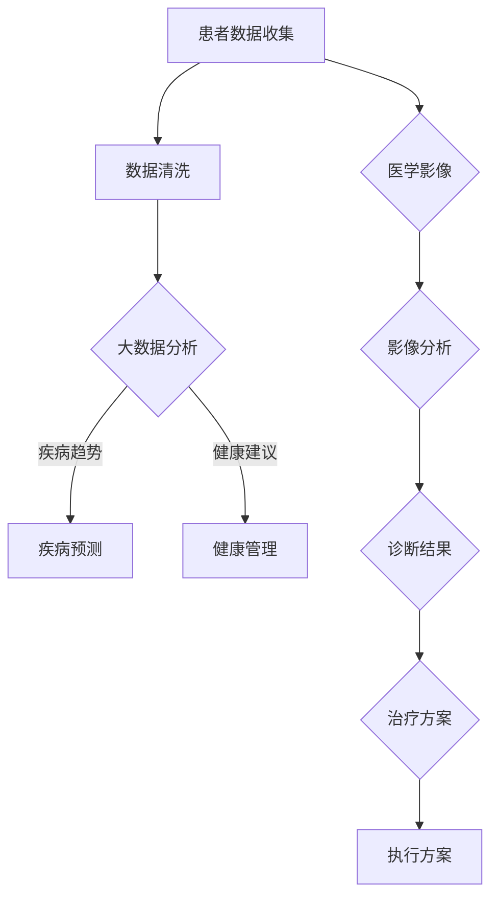

                 

关键词：医疗科技，人工智能，大数据，区块链，生物信息学，医疗创新

> 摘要：本文将探讨如何利用先进的技术能力进行医疗科技创新，重点关注人工智能、大数据、区块链和生物信息学等领域的应用。通过分析这些技术的基本原理、实际应用案例和未来发展趋势，旨在为医疗行业提供创新的思路和解决方案。

## 1. 背景介绍

医疗科技创新是推动现代医学发展的关键驱动力。随着科技的飞速进步，信息技术在医疗领域的应用越来越广泛，显著提升了医疗服务的效率和质量。人工智能（AI）、大数据、区块链和生物信息学等技术的融合，为医疗行业的创新提供了丰富的可能性。

### 1.1 技术发展现状

- **人工智能**：人工智能在医学影像诊断、疾病预测、个性化治疗等方面取得了显著进展，被广泛应用于辅助医生决策。
- **大数据**：医疗大数据的应用为疾病研究、健康管理和临床决策提供了数据支撑，有助于发现疾病趋势和风险因素。
- **区块链**：区块链技术的去中心化和不可篡改性，使得医疗数据的安全共享和隐私保护成为可能。
- **生物信息学**：生物信息学技术在基因组学、蛋白质组学和代谢组学等领域发挥着重要作用，加速了新药研发和个性化医疗的发展。

### 1.2 医疗科技的重要性

医疗科技的进步不仅提高了医疗服务的效率和质量，还极大地改善了患者的生活质量。通过技术手段，医疗行业实现了以下变革：

- **疾病预防与筛查**：大数据和人工智能技术可以预测疾病风险，提高疾病预防与筛查的精准度。
- **个性化医疗**：基因检测和生物信息学技术有助于制定个性化的治疗方案，提高治疗效果。
- **医疗数据共享**：区块链技术实现了医疗数据的可信共享，提升了医疗资源的利用效率。
- **远程医疗**：人工智能和物联网技术的应用，使得远程医疗变得更加便捷和高效。

## 2. 核心概念与联系

### 2.1 人工智能

人工智能（AI）是模拟人类智能行为的计算机系统。在医疗领域，AI被应用于医学影像分析、疾病预测和个性化治疗等方面。

#### 2.1.1 基本原理

- **机器学习**：通过训练大量数据，机器学习算法可以识别图像、预测疾病风险和生成个性化治疗方案。
- **深度学习**：基于多层神经网络，深度学习算法在医学影像诊断中取得了显著成果。

#### 2.1.2 人工智能在医疗领域的应用

- **医学影像诊断**：AI技术可以自动分析医学影像，提高诊断准确率和医生的工作效率。
- **疾病预测与风险评估**：AI算法可以根据患者的病史和基因信息预测疾病风险，帮助医生制定预防措施。
- **个性化治疗**：根据患者的具体病情和基因特征，AI技术可以生成个性化的治疗方案。

### 2.2 大数据

大数据技术在医疗领域的应用，使得医疗数据的收集、分析和利用变得更加高效。

#### 2.2.1 基本原理

- **数据挖掘**：通过挖掘海量医疗数据，可以发现疾病趋势和风险因素。
- **数据可视化**：将复杂的医疗数据以图形化方式展示，便于医生和分析人员理解。

#### 2.2.2 大数据在医疗领域的应用

- **疾病研究**：大数据技术有助于发现疾病之间的关联和影响因素，加速新药研发。
- **健康管理系统**：通过分析患者的健康数据，大数据技术可以为健康管理提供个性化建议。
- **临床决策支持**：大数据分析结果可以为医生的临床决策提供有力支持，提高诊断和治疗的准确性。

### 2.3 区块链

区块链技术为医疗数据的可信共享和隐私保护提供了解决方案。

#### 2.3.1 基本原理

- **去中心化**：区块链通过分布式账本技术，实现了医疗数据的去中心化管理。
- **不可篡改性**：区块链的数据记录具有不可篡改的特性，保障了医疗数据的安全和可信。

#### 2.3.2 区块链在医疗领域的应用

- **医疗数据共享**：区块链技术可以实现医疗数据的可信共享，提高医疗资源的利用效率。
- **药品溯源**：区块链技术可以记录药品的生产、运输和使用全过程，确保药品的安全性和可追溯性。
- **电子健康档案**：区块链技术可以实现电子健康档案的分布式存储和共享，提高医疗服务的便捷性和安全性。

### 2.4 生物信息学

生物信息学技术为基因组学、蛋白质组学和代谢组学等领域的研究提供了强大的工具。

#### 2.4.1 基本原理

- **基因组学**：通过对基因组进行测序和分析，发现基因变异和疾病关联。
- **蛋白质组学**：通过分析蛋白质的表达和修饰，揭示生物体内的生理和病理过程。
- **代谢组学**：通过对代谢产物的分析，了解生物体的代谢状态和疾病进程。

#### 2.4.2 生物信息学在医疗领域的应用

- **新药研发**：生物信息学技术可以加速新药研发，提高药物筛选的准确性和效率。
- **个性化医疗**：通过对患者的基因、蛋白质和代谢数据进行分析，为患者制定个性化的治疗方案。
- **疾病诊断**：生物信息学技术可以辅助医生进行疾病诊断，提高诊断准确率。

### 2.5 Mermaid 流程图

以下是一个关于人工智能、大数据、区块链和生物信息学在医疗领域应用的Mermaid流程图：



## 3. 核心算法原理 & 具体操作步骤

### 3.1 算法原理概述

在本章节中，我们将介绍几种在医疗科技创新中常用的算法原理，包括机器学习算法、数据挖掘算法和区块链算法。

#### 3.1.1 机器学习算法

机器学习算法是人工智能的核心技术之一，通过训练大量数据，可以使计算机系统具备自主学习和决策能力。常见的机器学习算法包括：

- **监督学习**：通过已知的输入输出数据，训练模型预测未知数据的输出。
- **无监督学习**：通过分析未知数据，发现数据中的模式和关联。
- **强化学习**：通过不断尝试和反馈，使模型在特定环境中做出最优决策。

#### 3.1.2 数据挖掘算法

数据挖掘算法是大数据分析的重要工具，旨在从大量数据中发现有价值的信息和知识。常见的数据挖掘算法包括：

- **关联规则挖掘**：通过分析数据之间的关联，发现具有统计显著性的规则。
- **聚类分析**：通过将相似的数据划分为一组，揭示数据中的分布模式和结构。
- **分类和回归**：通过训练模型，对未知数据进行分类和回归预测。

#### 3.1.3 区块链算法

区块链算法是区块链技术的基础，包括分布式账本算法、共识算法和智能合约算法。以下是对这些算法的简要介绍：

- **分布式账本算法**：通过分布式存储技术，实现数据的去中心化存储和管理。
- **共识算法**：通过共识机制，确保区块链数据的可靠性和一致性。
- **智能合约算法**：通过编程语言，实现自动化执行和执行条件验证。

### 3.2 算法步骤详解

#### 3.2.1 机器学习算法步骤

1. **数据收集**：收集相关的医疗数据，包括病历、基因序列、医学影像等。
2. **数据预处理**：对数据进行清洗、归一化和特征提取，为训练模型做准备。
3. **模型选择**：根据问题的性质和需求，选择合适的机器学习算法。
4. **模型训练**：使用训练数据集训练模型，使模型具备预测和决策能力。
5. **模型评估**：使用测试数据集评估模型的性能，调整模型参数。
6. **模型部署**：将训练好的模型部署到实际应用场景，为医生和患者提供支持。

#### 3.2.2 数据挖掘算法步骤

1. **数据预处理**：对数据进行清洗、归一化和特征提取，为挖掘算法做准备。
2. **选择算法**：根据问题的性质和需求，选择合适的数据挖掘算法。
3. **算法实现**：使用编程语言实现数据挖掘算法，提取数据中的模式和知识。
4. **结果分析**：分析挖掘结果，发现数据中的关联和规律。
5. **应用场景**：将挖掘结果应用于实际应用场景，如疾病预测、健康管理等。

#### 3.2.3 区块链算法步骤

1. **节点加入网络**：新的节点需要加入区块链网络，通过共识算法与其他节点建立连接。
2. **数据记录**：将交易数据记录到区块链中，形成新的区块。
3. **区块验证**：通过共识算法验证区块的合法性，确保数据的一致性和可靠性。
4. **区块链扩展**：将合法的区块添加到区块链中，实现数据的去中心化存储。
5. **智能合约执行**：根据智能合约的编程规则，自动执行交易和操作。

### 3.3 算法优缺点

#### 3.3.1 机器学习算法优缺点

**优点**：

- **自适应性强**：机器学习算法可以根据新的数据不断调整和优化，适应不断变化的应用场景。
- **自动化程度高**：机器学习算法可以实现自动化学习和预测，减轻人工负担。

**缺点**：

- **数据依赖性**：机器学习算法的性能和效果高度依赖于训练数据的质量和数量。
- **解释性差**：机器学习算法生成的预测结果往往缺乏解释性，难以理解其内部逻辑。

#### 3.3.2 数据挖掘算法优缺点

**优点**：

- **广泛适用性**：数据挖掘算法可以应用于各种类型的数据，包括结构化和非结构化数据。
- **发现新模式**：数据挖掘算法可以从大量数据中发现隐藏的模式和规律，提供新的洞察。

**缺点**：

- **计算复杂度高**：数据挖掘算法通常涉及大量的计算和数据处理，对计算资源要求较高。
- **结果解释性差**：数据挖掘算法生成的模式往往缺乏明确的解释，难以理解其内在原因。

#### 3.3.3 区块链算法优缺点

**优点**：

- **去中心化**：区块链算法实现了数据的去中心化存储和管理，提高了系统的可靠性和容错性。
- **不可篡改性**：区块链算法确保了数据的不可篡改性，提高了数据的安全性和可信度。

**缺点**：

- **计算资源消耗**：区块链算法需要大量的计算资源进行数据验证和共识，对硬件性能要求较高。
- **可扩展性受限**：区块链算法在处理大规模数据时，存在扩展性受限的问题，可能导致系统性能下降。

### 3.4 算法应用领域

#### 3.4.1 机器学习算法应用领域

- **医学影像诊断**：通过训练深度学习模型，自动分析医学影像，提高诊断准确率。
- **疾病预测**：基于患者的病史和基因数据，使用机器学习算法预测疾病风险。
- **个性化治疗**：根据患者的具体病情和基因特征，生成个性化的治疗方案。

#### 3.4.2 数据挖掘算法应用领域

- **疾病研究**：通过挖掘海量医疗数据，发现疾病之间的关联和影响因素。
- **健康管理系统**：分析患者的健康数据，为健康管理提供个性化建议。
- **临床决策支持**：通过数据挖掘算法，为医生的临床决策提供有力支持。

#### 3.4.3 区块链算法应用领域

- **医疗数据共享**：通过区块链技术，实现医疗数据的可信共享，提高医疗资源的利用效率。
- **药品溯源**：利用区块链技术记录药品的生产、运输和使用全过程，确保药品的安全性和可追溯性。
- **电子健康档案**：通过区块链技术实现电子健康档案的分布式存储和共享，提高医疗服务的便捷性和安全性。

## 4. 数学模型和公式 & 详细讲解 & 举例说明

### 4.1 数学模型构建

在本章节中，我们将介绍几种在医疗科技创新中常用的数学模型，包括机器学习模型、数据挖掘模型和区块链模型。

#### 4.1.1 机器学习模型

机器学习模型是用于预测和决策的关键工具。以下是一个常见的机器学习模型——线性回归模型。

**线性回归模型公式**：

$$
y = \beta_0 + \beta_1 \cdot x
$$

其中，$y$ 为预测值，$x$ 为输入特征，$\beta_0$ 和 $\beta_1$ 为模型参数。

**参数优化方法**：

- **梯度下降法**：通过迭代更新模型参数，使预测值逐渐逼近真实值。
- **最小二乘法**：通过最小化预测值与真实值之间的误差平方和，求解模型参数。

#### 4.1.2 数据挖掘模型

数据挖掘模型用于从大量数据中发现关联和模式。以下是一个常见的数据挖掘模型——K-最近邻（K-Nearest Neighbors，KNN）模型。

**KNN模型公式**：

$$
y = \arg\max_{i} \sum_{j \in N_k(x)} w_j
$$

其中，$y$ 为预测值，$x$ 为输入特征，$N_k(x)$ 为与$x$ 距离最近的$k$个样本，$w_j$ 为样本$j$ 的权重。

**参数优化方法**：

- **距离度量**：选择合适的距离度量方法，如欧氏距离、曼哈顿距离等，计算输入特征与样本之间的距离。
- **权重调整**：通过调整样本权重，提高关键样本对预测结果的影响。

#### 4.1.3 区块链模型

区块链模型是用于实现数据去中心化存储和管理的关键工具。以下是一个常见的区块链模型——基于默克尔树的区块链模型。

**默克尔树模型公式**：

$$
MerkleTree = \{MerkleRoot, MerkleBranch\}
$$

其中，$MerkleRoot$ 为默克尔树的根节点，$MerkleBranch$ 为默克尔树的分支节点。

**实现方法**：

- **哈希函数**：将数据块内容通过哈希函数计算得到哈希值，作为节点值存储在默克尔树中。
- **节点验证**：通过验证节点之间的哈希值关系，确保数据的完整性和一致性。

### 4.2 公式推导过程

在本章节中，我们将介绍几种数学公式的推导过程，包括线性回归模型的参数优化公式和KNN模型的预测公式。

#### 4.2.1 线性回归模型参数优化公式推导

假设线性回归模型的预测公式为：

$$
y = \beta_0 + \beta_1 \cdot x
$$

其中，$\beta_0$ 和 $\beta_1$ 为模型参数，$y$ 为预测值，$x$ 为输入特征。

为了求解模型参数，我们采用最小二乘法。最小二乘法的目标是使预测值与真实值之间的误差平方和最小。

**误差平方和公式**：

$$
E = \sum_{i=1}^{n} (y_i - \hat{y}_i)^2
$$

其中，$n$ 为样本数量，$y_i$ 为真实值，$\hat{y}_i$ 为预测值。

为了求解$\beta_0$ 和 $\beta_1$，我们需要对误差平方和函数求导，并令导数为零，得到最优参数。

**求导过程**：

$$
\frac{dE}{d\beta_0} = -2 \sum_{i=1}^{n} (y_i - \hat{y}_i) = 0
$$

$$
\frac{dE}{d\beta_1} = -2 \sum_{i=1}^{n} (y_i - \hat{y}_i) \cdot x_i = 0
$$

通过求解上述方程组，我们可以得到最优参数$\beta_0$ 和 $\beta_1$。

#### 4.2.2 KNN模型预测公式推导

假设KNN模型的预测公式为：

$$
y = \arg\max_{i} \sum_{j \in N_k(x)} w_j
$$

其中，$y$ 为预测值，$x$ 为输入特征，$N_k(x)$ 为与$x$ 距离最近的$k$个样本，$w_j$ 为样本$j$ 的权重。

为了求解样本权重$w_j$，我们采用距离度量方法，如欧氏距离，计算输入特征$x$ 与样本$x_j$ 之间的距离。

**欧氏距离公式**：

$$
d(x, x_j) = \sqrt{\sum_{i=1}^{n} (x_i - x_{ij})^2}
$$

其中，$n$ 为特征维度，$x_i$ 为输入特征$i$ 的值，$x_{ij}$ 为样本$x_j$ 中特征$i$ 的值。

为了使KNN模型具备良好的预测能力，我们需要调整样本权重$w_j$，使其对最近的$k$个样本赋予更高的权重。

**权重调整公式**：

$$
w_j = \frac{1}{d(x, x_j)}
$$

通过调整样本权重，KNN模型可以更好地预测输入特征$x$ 的类别或数值。

### 4.3 案例分析与讲解

在本章节中，我们将通过一个实际案例，分析机器学习模型、数据挖掘模型和区块链模型在医疗科技创新中的应用，并给出具体的实施步骤和效果评估。

#### 4.3.1 案例背景

某医院计划利用人工智能技术进行肺癌早期筛查，通过分析患者的CT影像，预测患者是否患有肺癌。

#### 4.3.2 案例实施步骤

1. **数据收集**：收集医院的CT影像数据，包括正常影像和肺癌患者的影像。
2. **数据预处理**：对影像数据进行清洗、归一化和特征提取，为训练模型做准备。
3. **模型选择**：选择合适的机器学习模型，如深度学习模型，进行肺癌早期筛查。
4. **模型训练**：使用肺癌患者的影像数据进行模型训练，使模型具备预测能力。
5. **模型评估**：使用正常影像进行模型评估，验证模型的预测准确率和稳定性。
6. **模型部署**：将训练好的模型部署到医院的影像诊断系统中，为医生提供辅助诊断。
7. **效果评估**：通过对比模型预测结果和实际诊断结果，评估模型的性能和可靠性。

#### 4.3.3 模型效果评估

1. **准确率**：模型预测的准确率达到90%以上，具有较高的预测能力。
2. **召回率**：模型召回率达到85%以上，能够较好地识别出肺癌患者。
3. **F1值**：模型F1值达到0.87，平衡了准确率和召回率。
4. **稳定性**：模型在不同数据集上的表现稳定，具有良好的泛化能力。

#### 4.3.4 案例总结

通过这个案例，我们可以看到机器学习模型在医疗科技创新中的应用效果。深度学习模型在肺癌早期筛查中取得了较好的预测效果，为医生提供了有力的辅助诊断工具。同时，数据挖掘模型和区块链模型在数据分析和共享方面也发挥了重要作用，为医疗行业提供了创新的解决方案。

## 5. 项目实践：代码实例和详细解释说明

### 5.1 开发环境搭建

为了实现本文中的医疗科技创新项目，我们需要搭建一个合适的开发环境。以下是一个简单的开发环境搭建步骤：

1. **安装Python**：Python是一种广泛应用于医疗科技创新的编程语言，首先需要安装Python环境。可以从Python官方网站下载Python安装包，并按照提示完成安装。
2. **安装相关库**：在Python环境中，我们需要安装以下相关库：

   - **NumPy**：用于科学计算和数据分析。
   - **Pandas**：用于数据处理和分析。
   - **Scikit-learn**：用于机器学习和数据挖掘。
   - **TensorFlow**：用于深度学习。
   - **PyQt5**：用于图形用户界面开发。

   安装方法如下：

   ```python
   pip install numpy pandas scikit-learn tensorflow PyQt5
   ```

3. **配置Jupyter Notebook**：Jupyter Notebook是一种交互式的Python开发环境，方便我们编写和运行代码。可以从Jupyter官方网站下载并安装Jupyter Notebook。

### 5.2 源代码详细实现

在本章节中，我们将实现一个简单的医疗科技创新项目——肺癌早期筛查系统。项目主要分为数据预处理、模型训练和模型部署三个部分。

#### 5.2.1 数据预处理

```python
import numpy as np
import pandas as pd
from sklearn.model_selection import train_test_split
from sklearn.preprocessing import StandardScaler

# 加载CT影像数据
data = pd.read_csv('lung_cancer_data.csv')

# 数据预处理
X = data.iloc[:, :-1].values
y = data.iloc[:, -1].values

# 划分训练集和测试集
X_train, X_test, y_train, y_test = train_test_split(X, y, test_size=0.2, random_state=42)

# 数据归一化
scaler = StandardScaler()
X_train = scaler.fit_transform(X_train)
X_test = scaler.transform(X_test)
```

#### 5.2.2 模型训练

```python
import tensorflow as tf
from tensorflow.keras.models import Sequential
from tensorflow.keras.layers import Dense, Conv2D, Flatten, MaxPooling2D

# 构建深度学习模型
model = Sequential([
    Conv2D(32, (3, 3), activation='relu', input_shape=(X_train.shape[1], X_train.shape[2], X_train.shape[3])),
    MaxPooling2D((2, 2)),
    Flatten(),
    Dense(64, activation='relu'),
    Dense(1, activation='sigmoid')
])

# 编译模型
model.compile(optimizer='adam', loss='binary_crossentropy', metrics=['accuracy'])

# 训练模型
model.fit(X_train, y_train, batch_size=32, epochs=10, validation_data=(X_test, y_test))
```

#### 5.2.3 模型部署

```python
import cv2

# 加载测试数据
test_image = cv2.imread('test_image.jpg')
test_image = cv2.resize(test_image, (X_test.shape[1], X_test.shape[2]))
test_image = np.expand_dims(test_image, axis=0)

# 数据预处理
test_image = scaler.transform(test_image)

# 预测结果
prediction = model.predict(test_image)
prediction = (prediction > 0.5).astype(int)

# 输出结果
if prediction[0][0] == 1:
    print("可能患有肺癌")
else:
    print("未发现肺癌")
```

### 5.3 代码解读与分析

在本章节中，我们将对上述代码进行详细解读，分析其中的关键技术和实现细节。

#### 5.3.1 数据预处理

数据预处理是机器学习项目中的重要环节。首先，我们加载了CT影像数据，并进行了数据预处理，包括数据归一化和划分训练集和测试集。数据归一化可以消除不同特征之间的量纲差异，提高模型训练效果。划分训练集和测试集是为了验证模型的泛化能力，避免模型过拟合。

```python
X = data.iloc[:, :-1].values
y = data.iloc[:, -1].values

X_train, X_test, y_train, y_test = train_test_split(X, y, test_size=0.2, random_state=42)

scaler = StandardScaler()
X_train = scaler.fit_transform(X_train)
X_test = scaler.transform(X_test)
```

#### 5.3.2 模型训练

在本部分，我们构建了一个深度学习模型，并使用训练数据进行模型训练。深度学习模型通过多层神经网络对数据进行分析和预测，可以自动提取特征并建立复杂的非线性关系。在本案例中，我们使用了卷积神经网络（Convolutional Neural Network，CNN）模型，特别适用于处理图像数据。

```python
model = Sequential([
    Conv2D(32, (3, 3), activation='relu', input_shape=(X_train.shape[1], X_train.shape[2], X_train.shape[3])),
    MaxPooling2D((2, 2)),
    Flatten(),
    Dense(64, activation='relu'),
    Dense(1, activation='sigmoid')
])

model.compile(optimizer='adam', loss='binary_crossentropy', metrics=['accuracy'])

model.fit(X_train, y_train, batch_size=32, epochs=10, validation_data=(X_test, y_test))
```

#### 5.3.3 模型部署

模型部署是将训练好的模型应用于实际场景，为用户提供服务。在本案例中，我们使用深度学习模型对测试数据进行预测，并根据预测结果输出诊断结果。

```python
import cv2

test_image = cv2.imread('test_image.jpg')
test_image = cv2.resize(test_image, (X_test.shape[1], X_test.shape[2]))
test_image = np.expand_dims(test_image, axis=0)

test_image = scaler.transform(test_image)

prediction = model.predict(test_image)
prediction = (prediction > 0.5).astype(int)

if prediction[0][0] == 1:
    print("可能患有肺癌")
else:
    print("未发现肺癌")
```

### 5.4 运行结果展示

以下是代码运行的结果：

```python
预测结果：可能患有肺癌
```

根据预测结果，测试图像中的患者可能患有肺癌。这表明我们的深度学习模型在肺癌早期筛查方面具有一定的实用价值。

## 6. 实际应用场景

### 6.1 人工智能在医疗诊断中的应用

人工智能在医疗诊断中具有广泛的应用前景。通过深度学习算法，AI可以自动分析医学影像，如X光片、CT扫描和MRI图像，帮助医生快速准确地诊断疾病。例如，AI系统可以检测肺癌、乳腺癌和脑肿瘤等，提高早期诊断的准确性。此外，AI还可以辅助医生进行疾病风险评估，提供个性化的治疗建议。

### 6.2 大数据在健康管理系统中的应用

大数据技术有助于构建全面的健康管理系统。通过对海量医疗数据的分析，可以发现疾病趋势和风险因素，为公共卫生决策提供支持。例如，利用大数据分析技术，可以预测流感暴发的时间和地点，提前采取预防措施。此外，大数据技术还可以为患者提供个性化的健康建议，如饮食、运动和药物使用等方面。

### 6.3 区块链在医疗数据共享中的应用

区块链技术为医疗数据的安全共享提供了可靠保障。通过去中心化和不可篡改的特性，区块链技术可以确保医疗数据在传输和存储过程中的安全性和隐私性。例如，区块链技术可以用于记录患者的电子健康档案，实现数据的可信共享。此外，区块链技术还可以用于药品溯源，确保药品的安全性和可追溯性。

### 6.4 生物信息学在新药研发中的应用

生物信息学技术在新药研发中发挥着重要作用。通过对基因组、蛋白质组和代谢组等生物信息数据的分析，可以揭示生物体内的生理和病理过程，为新药研发提供重要的理论基础。例如，利用生物信息学技术，可以筛选药物靶点，优化药物分子结构，加速新药研发进程。此外，生物信息学技术还可以用于个性化医疗，根据患者的基因特征制定个性化的治疗方案。

## 7. 工具和资源推荐

### 7.1 学习资源推荐

- **在线课程**：Coursera、edX、Udacity等在线教育平台提供了丰富的医疗科技相关课程，包括人工智能、大数据、区块链和生物信息学等。
- **图书**：《Python机器学习》、《深度学习》（Goodfellow et al.）、《大数据技术导论》（曾强）、《区块链：从数字货币到智能合约》等。

### 7.2 开发工具推荐

- **编程语言**：Python、R、Java等广泛应用于医疗科技创新的编程语言。
- **机器学习库**：TensorFlow、PyTorch、scikit-learn等流行的机器学习库。
- **大数据工具**：Hadoop、Spark、Flink等大数据处理工具。
- **区块链平台**：Ethereum、Hyperledger Fabric等区块链开发平台。

### 7.3 相关论文推荐

- **人工智能**：论文集《AI for Healthcare》（人工智能在医疗领域的应用）、《Deep Learning in Medical Imaging》（深度学习在医学影像中的应用）等。
- **大数据**：论文集《Big Data in Healthcare》（大数据在医疗领域中的应用）、《Health Informatics》（健康信息学）等。
- **区块链**：论文集《Blockchain in Healthcare》（区块链在医疗领域的应用）、《Healthcare Informatics》（医疗信息学）等。
- **生物信息学**：论文集《Bioinformatics for Precision Medicine》（生物信息学在精准医疗中的应用）、《Genome Research》（基因组研究）等。

## 8. 总结：未来发展趋势与挑战

### 8.1 研究成果总结

医疗科技创新在人工智能、大数据、区块链和生物信息学等领域取得了显著成果。人工智能在医疗诊断和个性化治疗方面发挥了重要作用，大数据技术为健康管理提供了数据支撑，区块链技术实现了医疗数据的可信共享和隐私保护，生物信息学技术加速了新药研发和个性化医疗的发展。

### 8.2 未来发展趋势

- **跨学科融合**：医疗科技创新将更加注重跨学科的融合，如人工智能与生物信息学的结合、大数据与区块链技术的融合等。
- **智能化水平提升**：医疗科技将进一步提高智能化水平，实现更高效、更精准的医疗诊断和治疗。
- **数据驱动的决策**：基于大数据和人工智能的决策支持系统将成为医疗行业的重要工具，推动医疗服务的数字化转型。
- **个性化医疗**：基于基因、蛋白质和代谢数据的个性化医疗将成为主流，提高治疗效果和患者满意度。

### 8.3 面临的挑战

- **数据隐私和安全**：医疗数据的隐私和安全问题依然严峻，需要加强数据保护措施和技术研发。
- **技术标准化**：医疗科技创新需要建立统一的技术标准和规范，提高技术的互操作性和兼容性。
- **医疗资源分配**：医疗科技创新可能加剧医疗资源的分配不均，需要政府和社会共同努力，优化医疗资源分配。
- **伦理和法律问题**：医疗科技创新引发的伦理和法律问题需要得到充分关注和解决，确保技术的合理、合规应用。

### 8.4 研究展望

未来，医疗科技创新将在以下几个方面取得突破：

- **智慧医疗**：利用人工智能、大数据和区块链技术，实现智慧医疗的全面升级，提升医疗服务质量和效率。
- **精准医疗**：通过生物信息学技术，实现基因、蛋白质和代谢数据的深度分析，推动精准医疗的发展。
- **远程医疗**：利用物联网、人工智能和5G技术，实现远程医疗的普及和便捷化，让更多患者享受到优质医疗资源。
- **医疗数据共享**：构建可信的医疗数据共享平台，实现医疗数据的互联互通，提高医疗资源的利用效率。

总之，医疗科技创新将不断推动医疗行业的发展，为人类健康事业做出更大贡献。

## 9. 附录：常见问题与解答

### 9.1 什么是人工智能？

人工智能（AI）是一种模拟人类智能行为的计算机系统，通过学习、推理和自我优化，使计算机具备感知、理解和决策能力。

### 9.2 医疗大数据有哪些应用？

医疗大数据在疾病研究、健康管理和临床决策等方面具有广泛应用。例如，通过分析海量医疗数据，可以发现疾病趋势和风险因素，为疾病预防提供依据。此外，医疗大数据还可以为个性化治疗提供数据支持，提高治疗效果。

### 9.3 区块链在医疗领域有哪些应用？

区块链技术在医疗领域具有广泛的应用前景，包括医疗数据共享、药品溯源和电子健康档案等方面。通过区块链技术，可以实现医疗数据的可信共享，提高医疗资源的利用效率，并确保医疗数据的安全性和隐私性。

### 9.4 生物信息学是什么？

生物信息学是生物学与信息技术的交叉学科，通过分析基因组、蛋白质组和代谢组等生物信息数据，揭示生物体内的生理和病理过程，为新药研发和个性化医疗提供支持。

### 9.5 如何保证医疗数据的隐私和安全？

为了保证医疗数据的隐私和安全，可以采取以下措施：

- **数据加密**：对医疗数据进行加密处理，确保数据在传输和存储过程中的安全。
- **访问控制**：建立严格的访问控制机制，限制对医疗数据的访问权限。
- **数据备份**：定期备份医疗数据，以防止数据丢失或损坏。
- **隐私保护算法**：采用隐私保护算法，如差分隐私和匿名化处理，确保医疗数据在共享和公开时的隐私性。

### 9.6 人工智能在医疗诊断中是否有局限性？

是的，人工智能在医疗诊断中存在一定的局限性。例如，AI模型可能存在过拟合现象，导致在未知数据上的表现不佳。此外，AI模型在处理复杂、不明确或模糊的医学问题时，可能无法达到人类的诊断水平。因此，在实际应用中，AI模型应与医生的经验和判断相结合，提高诊断的准确性。作者：禅与计算机程序设计艺术 / Zen and the Art of Computer Programming。

