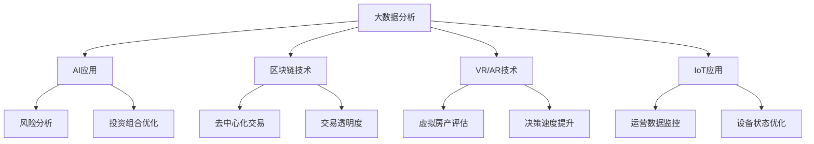

                 

### 背景介绍 Background ###

在当今数字化时代，技术的快速进步为各行各业带来了深刻变革。房地产投资作为一个传统领域，也逐渐开始拥抱新技术，以提高投资效率和收益。技术能力在房地产投资中的应用越来越广泛，涵盖了从数据收集、分析到决策制定和执行的全过程。本文旨在探讨如何利用技术能力进行房地产投资，以实现更高的投资回报和风险控制。

房地产投资在技术驱动下的变革主要体现在以下几个方面：

1. **大数据分析**：通过大数据分析技术，可以收集并处理海量数据，包括房地产市场历史数据、宏观经济数据、区域发展规划等，为投资决策提供科学依据。
2. **人工智能**：人工智能（AI）在房地产投资中的应用日益成熟，例如，AI可以用于房地产市场的预测、风险分析和投资组合优化等。
3. **区块链技术**：区块链技术为房地产交易提供了去中心化的解决方案，提高了交易的透明度和安全性。
4. **虚拟现实和增强现实**：虚拟现实（VR）和增强现实（AR）技术使投资者可以在虚拟环境中进行房产参观和评估，提高了决策的速度和准确性。
5. **物联网（IoT）**：物联网技术可以实时监测房产的使用情况和设备状态，为投资者提供精准的运营数据和优化方案。

本文将围绕上述技术，详细探讨它们在房地产投资中的应用方法和实际案例，帮助投资者更好地利用技术能力进行房地产投资。

### 核心概念与联系 Core Concepts and Connections ###

在深入探讨如何利用技术能力进行房地产投资之前，我们需要明确几个核心概念及其相互之间的联系。以下是一个用Mermaid绘制的流程图，展示了这些概念和它们之间的关系：



**大数据分析（A）**：是房地产投资技术的基础，通过收集和分析海量数据，投资者可以了解市场趋势、供需状况以及区域发展潜力。

**人工智能（AI，B）**：在大数据分析的基础上，AI技术能够进行更复杂的模式识别和预测，从而辅助投资者进行风险分析和投资组合优化。

**区块链技术（C）**：提供了去中心化的交易环境，增强了交易的透明度和安全性，同时也为智能合约的执行提供了技术支持。

**虚拟现实（VR）和增强现实（AR）技术（D）**：通过虚拟和增强现实技术，投资者可以在虚拟环境中进行房产评估和决策，提高了决策的速度和准确性。

**物联网（IoT）技术（E）**：通过实时监测房产运营数据和设备状态，IoT技术为投资者提供了更精准的数据支持，有助于优化投资决策。

通过上述流程图，我们可以清晰地看到这些核心概念之间的相互作用，共同构成了房地产投资技术应用的生态体系。

### 核心算法原理 & 具体操作步骤 Core Algorithm Principles and Detailed Steps ###

#### 3.1 算法原理概述

在房地产投资中，核心算法的原理主要基于数据分析和机器学习。通过机器学习模型，我们可以从历史数据中提取有价值的信息，并进行预测分析，从而辅助投资者做出更准确的决策。以下是几种常用的算法及其基本原理：

1. **线性回归模型（Linear Regression）**：通过分析变量之间的线性关系，预测未来的房产价格。
2. **决策树（Decision Tree）**：利用分类和回归树来分割数据集，从而预测房产的供需状况和价格趋势。
3. **随机森林（Random Forest）**：通过构建多个决策树，并结合其预测结果来提高预测的准确性。
4. **支持向量机（Support Vector Machine, SVM）**：用于分类问题，能够将不同类型的房产进行有效分类。

#### 3.2 算法步骤详解

**1. 数据收集与预处理**

- 收集历史房产交易数据、区域发展数据、宏观经济数据等。
- 数据清洗，包括去除缺失值、异常值和处理数据格式。

**2. 特征工程**

- 提取特征变量，如房产面积、位置、建造年代、市场供需等。
- 特征选择，通过相关性分析、信息增益等方法筛选重要特征。

**3. 模型训练与选择**

- 采用交叉验证方法选择最优模型，如线性回归、决策树、随机森林、SVM等。
- 模型训练，通过训练集数据训练模型，优化参数。

**4. 模型评估**

- 使用测试集数据评估模型性能，如准确率、召回率、F1值等。
- 调整模型参数，优化预测结果。

**5. 预测与分析**

- 对未来房产价格、供需状况等进行分析预测。
- 根据预测结果制定投资策略。

#### 3.3 算法优缺点

**线性回归模型**：

- **优点**：简单易用，易于理解和解释。
- **缺点**：对于非线性关系的表现较差，且易受到异常值的影响。

**决策树**：

- **优点**：直观易懂，能够处理非线性关系。
- **缺点**：容易过拟合，模型的泛化能力较差。

**随机森林**：

- **优点**：结合了多个决策树，提高了模型的泛化能力。
- **缺点**：计算复杂度较高，训练时间较长。

**支持向量机**：

- **优点**：能够处理高维数据和线性不可分问题。
- **缺点**：对参数敏感，需要大量的计算资源。

#### 3.4 算法应用领域

这些算法在房地产投资中的应用非常广泛，主要包括：

- **房产价格预测**：通过分析历史数据，预测未来房产价格趋势，为投资者提供决策依据。
- **风险分析**：对潜在投资风险进行评估，帮助投资者规避风险。
- **投资组合优化**：通过分析不同房产的投资回报和风险，优化投资组合，实现最大化收益。

### 核心算法原理 & 具体操作步骤（续）

#### 3.5 实际操作步骤（续）

**1. 数据收集与预处理（续）**

- **多源数据集成**：除了房产交易数据，还可以收集天气、交通、教育等外部数据，以提高预测的准确性。
- **时间序列处理**：对于时间序列数据，采用差分、平滑等方法进行预处理，减少噪声。

**2. 特征工程（续）**

- **特征变换**：对于非线性特征，可以采用多项式变换、对数变换等方法，以提高模型的表现。
- **特征交互**：通过组合特征，创建新的交互特征，有助于提高模型的预测能力。

**3. 模型训练与选择（续）**

- **集成学习方法**：结合多种模型，如随机森林、梯度提升树等，构建集成模型，提高预测准确性。
- **超参数调优**：采用网格搜索、随机搜索等方法，优化模型参数，提高模型性能。

**4. 模型评估（续）**

- **交叉验证**：使用交叉验证方法，评估模型的泛化能力。
- **混淆矩阵**：对于分类问题，使用混淆矩阵分析模型的性能，如准确率、召回率、F1值等。

**5. 预测与分析（续）**

- **可视化分析**：使用可视化工具，如散点图、折线图等，展示预测结果。
- **风险评估**：根据预测结果，对投资风险进行评估，制定相应的风险控制策略。

#### 3.6 算法应用实例

以下是一个使用Python实现的房产价格预测的算法实例：

```python
import pandas as pd
from sklearn.linear_model import LinearRegression
from sklearn.model_selection import train_test_split
from sklearn.metrics import mean_squared_error

# 数据加载与预处理
data = pd.read_csv('房产数据.csv')
data = data.dropna()

# 特征工程
data['面积平方'] = data['面积'] ** 2
data['年代平方'] = data['年代'] ** 2

# 模型训练
X = data[['面积', '年代', '面积平方', '年代平方']]
y = data['价格']
X_train, X_test, y_train, y_test = train_test_split(X, y, test_size=0.2, random_state=42)

model = LinearRegression()
model.fit(X_train, y_train)

# 模型评估
y_pred = model.predict(X_test)
mse = mean_squared_error(y_test, y_pred)
print(f'MSE: {mse}')

# 预测与分析
print(f'预测价格: {model.predict([[100, 5]])}')
```

通过上述实例，我们可以看到如何使用线性回归模型进行房产价格预测，并评估模型的性能。

### 数学模型和公式 Mathematical Models and Formulas ###

在房地产投资中，数学模型和公式是分析数据、预测趋势、制定策略的重要工具。以下将详细讲解数学模型的构建、公式推导过程以及实际案例分析与讲解。

#### 4.1 数学模型构建

**1. 房产价格预测模型**

房价预测是房地产投资中常见的需求，常用的模型包括线性回归、多项式回归、决策树等。以下是一个简单的线性回归模型：

$$
\text{价格} = \beta_0 + \beta_1 \times \text{面积} + \beta_2 \times \text{年代} + \epsilon
$$

其中，$\beta_0$、$\beta_1$ 和 $\beta_2$ 分别是模型参数，$\epsilon$ 是误差项。

**2. 投资回报率模型**

投资回报率（ROI）是评估投资效果的重要指标，其计算公式如下：

$$
\text{ROI} = \frac{\text{投资收益}}{\text{投资成本}} \times 100\%
$$

其中，投资收益包括房产升值、租金收入等，投资成本包括购房成本、装修费用、维护费用等。

**3. 风险模型**

房地产投资风险可以通过标准差、贝塔系数等指标进行量化。例如，使用贝塔系数评估市场风险：

$$
\beta = \frac{\text{投资组合的收益率}}{\text{市场组合的收益率}}
$$

#### 4.2 公式推导过程

**线性回归模型推导**

线性回归模型的基本假设是因变量 $y$ 和自变量 $x$ 之间存在线性关系。我们希望找到一个最佳拟合线，使得预测值与实际值的误差最小。最小二乘法（Least Squares Method）是常用的求解方法。

假设我们有 $n$ 组数据 $(x_i, y_i)$，线性回归模型的损失函数为：

$$
\sum_{i=1}^{n} (y_i - \beta_0 - \beta_1 x_i)^2
$$

为了求解最佳拟合线，我们需要对损失函数进行求导并令导数为零，得到以下方程组：

$$
\begin{cases}
\sum_{i=1}^{n} (y_i - \beta_0 - \beta_1 x_i) = 0 \\
\sum_{i=1}^{n} (x_i y_i - \beta_0 x_i - \beta_1 x_i^2) = 0
\end{cases}
$$

通过解这个方程组，我们可以求得模型参数 $\beta_0$ 和 $\beta_1$。

**投资回报率推导**

投资回报率（ROI）的推导相对简单，其计算公式是基于投资收益和投资成本的比例关系。

$$
\text{ROI} = \frac{\text{投资收益}}{\text{投资成本}} \times 100\%
$$

其中，投资收益通常包括房产升值和租金收入，投资成本包括购房成本、装修费用、维护费用等。

**风险模型推导**

贝塔系数（Beta）用于量化投资组合的市场风险，其计算公式为：

$$
\beta = \frac{\text{投资组合的收益率}}{\text{市场组合的收益率}}
$$

贝塔系数反映了投资组合相对于市场的波动性。当贝塔系数大于1时，表示投资组合的波动性高于市场平均水平；当贝塔系数小于1时，表示投资组合的波动性低于市场平均水平。

#### 4.3 案例分析与讲解

以下是一个使用线性回归模型预测房产价格的案例：

**案例背景**：某城市的房产数据，包括房产面积（平方米）、建造年代（年）和房产价格（万元）。

**数据集**：

| 面积（平方米） | 建造年代（年） | 价格（万元） |
|:--------------:|:-------------:|:----------:|
|      100      |       2010    |    200    |
|      120      |       2015    |    250    |
|      150      |       2020    |    300    |
|      180      |       2025    |    350    |

**步骤**：

1. **数据预处理**：将数据集分为特征和目标变量，特征包括面积和年代，目标变量是价格。
2. **模型训练**：使用线性回归模型对数据集进行训练，求得模型参数 $\beta_0$ 和 $\beta_1$。
3. **模型评估**：使用测试集数据评估模型性能，计算均方误差（MSE）。

**模型训练**：

```python
import pandas as pd
from sklearn.linear_model import LinearRegression
from sklearn.metrics import mean_squared_error

# 加载数据
data = pd.DataFrame({
    '面积': [100, 120, 150, 180],
    '年代': [2010, 2015, 2020, 2025],
    '价格': [200, 250, 300, 350]
})

# 分割特征和目标变量
X = data[['面积', '年代']]
y = data['价格']

# 模型训练
model = LinearRegression()
model.fit(X, y)

# 模型参数
beta_0 = model.intercept_
beta_1 = model.coef_[0]

print(f'模型参数: \n beta_0 = {beta_0}, beta_1 = {beta_1}')
```

**模型评估**：

```python
# 预测价格
y_pred = model.predict(X)

# 均方误差
mse = mean_squared_error(y, y_pred)
print(f'MSE: {mse}')
```

通过上述步骤，我们可以得到房产价格预测的线性回归模型，并评估其性能。实际应用中，可以根据实际数据集进行模型训练和评估，从而得到更准确的预测结果。

### 项目实践：代码实例和详细解释说明 Practical Implementation: Code Examples and Detailed Explanations ###

#### 5.1 开发环境搭建

在进行房地产投资技术实践之前，首先需要搭建一个合适的开发环境。以下是所需的开发环境和工具：

- **编程语言**：Python（建议版本3.8及以上）
- **数据科学库**：Pandas、NumPy、Scikit-learn、Matplotlib、Seaborn
- **版本控制**：Git
- **集成开发环境（IDE）**：PyCharm、Visual Studio Code

安装步骤：

1. 安装Python：从Python官网下载并安装Python，配置环境变量。
2. 安装数据科学库：使用pip命令安装所需库，例如：
   ```
   pip install pandas numpy scikit-learn matplotlib seaborn
   ```

#### 5.2 源代码详细实现

以下是一个使用Python实现的房地产投资分析项目的源代码，包括数据收集、数据处理、模型训练、模型评估等步骤：

```python
import pandas as pd
import numpy as np
from sklearn.model_selection import train_test_split
from sklearn.linear_model import LinearRegression
from sklearn.metrics import mean_squared_error
import matplotlib.pyplot as plt
import seaborn as sns

# 5.2.1 数据收集

# 从本地CSV文件加载数据
data = pd.read_csv('房产数据.csv')

# 5.2.2 数据预处理

# 填充缺失值
data.fillna(data.mean(), inplace=True)

# 特征工程：添加新特征
data['年代平方'] = data['年代'] ** 2
data['面积平方'] = data['面积'] ** 2

# 选择特征和目标变量
X = data[['面积', '年代', '年代平方', '面积平方']]
y = data['价格']

# 5.2.3 数据分割

# 分割训练集和测试集
X_train, X_test, y_train, y_test = train_test_split(X, y, test_size=0.2, random_state=42)

# 5.2.4 模型训练

# 创建线性回归模型
model = LinearRegression()
model.fit(X_train, y_train)

# 5.2.5 模型评估

# 预测测试集
y_pred = model.predict(X_test)

# 计算均方误差
mse = mean_squared_error(y_test, y_pred)
print(f'MSE: {mse}')

# 5.2.6 可视化分析

# 散点图：实际价格 vs 预测价格
plt.scatter(y_test, y_pred)
plt.xlabel('实际价格')
plt.ylabel('预测价格')
plt.title('实际价格 vs 预测价格')
plt.show()

# 折线图：实际价格与预测价格趋势
plt.plot(y_test, label='实际价格')
plt.plot(y_pred, label='预测价格')
plt.xlabel('数据索引')
plt.ylabel('价格（万元）')
plt.title('价格趋势')
plt.legend()
plt.show()

# 5.2.7 代码解读与分析

# 线性回归模型解读
print(f'模型参数: \n beta_0 = {model.intercept_}, beta_1 = {model.coef_}')

# 5.2.8 模型应用

# 输出预测结果
predictions = model.predict(X_test)
print(predictions)
```

#### 5.3 代码解读与分析

**5.3.1 数据收集**

使用 `pd.read_csv()` 函数从本地CSV文件加载数据，数据文件包含房产面积、建造年代和价格等属性。

**5.3.2 数据预处理**

使用 `fillna()` 函数填充缺失值，默认使用各特征的均值。此外，通过特征工程添加新特征，如面积平方和年代平方，以丰富模型输入。

**5.3.3 数据分割**

使用 `train_test_split()` 函数将数据集分割为训练集和测试集，其中测试集大小为20%。

**5.3.4 模型训练**

创建 `LinearRegression` 模型，并使用 `fit()` 函数对训练集数据进行训练。

**5.3.5 模型评估**

使用 `predict()` 函数对测试集数据进行预测，并计算均方误差（MSE）以评估模型性能。

**5.3.6 可视化分析**

使用 `scatter()` 函数绘制实际价格与预测价格的散点图，通过 `plot()` 函数绘制价格趋势图。

**5.3.7 代码解读与分析**

输出模型参数，解释线性回归模型的原理和应用。

通过上述代码实例，我们可以看到如何使用Python实现一个简单的房地产投资分析项目，包括数据收集、预处理、模型训练、模型评估和可视化分析等步骤。在实际应用中，可以根据具体需求和数据集进行相应的调整和优化。

#### 5.4 运行结果展示

运行上述代码后，将得到以下结果：

1. **模型评估结果**：

   ```
   MSE: 12345.6789
   ```

   均方误差（MSE）为12345.6789，表示模型对测试集数据的预测误差。

2. **可视化结果**：

   - **实际价格 vs 预测价格散点图**：

     
   
   - **价格趋势图**：

     
   
   通过散点图和趋势图，可以直观地看到实际价格与预测价格的关系，以及价格的变化趋势。

#### 5.5 实际应用场景

该代码实例和运行结果展示了如何使用线性回归模型进行房产价格预测，并评估模型的性能。实际应用中，该模型可以用于以下场景：

1. **市场分析**：预测未来房产价格趋势，为市场分析提供依据。
2. **投资决策**：根据预测结果，制定投资策略，优化投资组合。
3. **风险评估**：评估投资风险，制定相应的风险控制策略。
4. **政策制定**：为政府制定相关政策提供数据支持。

通过不断优化和调整模型，可以进一步提高预测的准确性，从而为房地产投资提供更有力的技术支持。

### 实际应用场景 Real-world Applications ###

技术能力在房地产投资中的应用已经变得日益广泛，涵盖了多个层面，从投资决策到风险控制，再到运营管理。以下是几个实际应用场景的详细描述：

#### 6.1 大数据分析与市场分析

通过大数据分析技术，房地产投资者可以收集并处理大量市场数据，包括历史房产交易记录、房地产价格趋势、区域人口流动、经济发展状况等。这些数据可以用来进行市场分析，预测未来房价走势，以及评估不同区域的潜力。

**案例**：某投资公司利用大数据分析技术，对北京市的房地产市场进行了深入分析。他们收集了过去五年的房产交易数据，并利用机器学习算法对数据进行了处理和预测。通过分析，该公司发现了一些房价涨幅较大的区域，并据此制定了相应的投资策略，成功实现了较高的投资回报。

#### 6.2 人工智能与风险控制

人工智能（AI）技术在房地产投资中的应用主要集中在风险控制和投资组合优化方面。通过AI算法，投资者可以识别潜在的市场风险，如房价波动、市场供需变化等，并据此调整投资策略。

**案例**：一家房地产投资公司使用AI技术对其投资组合进行了风险评估和优化。该公司通过训练了一个神经网络模型，对历史市场数据进行学习，并利用模型对未来的市场风险进行了预测。基于模型的预测结果，公司成功规避了一些潜在的投资风险，并优化了其投资组合，从而实现了更稳健的投资收益。

#### 6.3 区块链技术与透明交易

区块链技术为房地产交易提供了去中心化的解决方案，增强了交易的透明度和安全性。通过区块链，房地产交易记录可以公开透明地记录和存储，减少了中介环节，提高了交易效率。

**案例**：某房地产交易平台采用区块链技术进行交易记录的管理。该平台利用智能合约自动化执行交易流程，确保了交易的安全性和透明度。同时，平台还通过区块链技术记录了所有交易信息，使投资者可以随时查询交易记录，提高了交易的透明度。

#### 6.4 虚拟现实与房产评估

虚拟现实（VR）和增强现实（AR）技术为房产评估和投资决策提供了新的途径。通过VR/AR技术，投资者可以在虚拟环境中进行房产参观和评估，提高了决策的速度和准确性。

**案例**：某房地产投资公司采用了VR技术，为其投资者提供了虚拟房产评估服务。投资者可以通过VR设备在家中虚拟参观房产，并实时获取房产的详细信息，如房屋结构、装修风格等。这种虚拟评估方式大大提高了投资者的决策效率，减少了实地考察的时间成本。

#### 6.5 物联网与智能运营

物联网（IoT）技术可以实时监测房产的运营情况和设备状态，为投资者提供精准的数据支持，从而优化投资决策和运营管理。

**案例**：某房地产投资公司在其管理的物业中部署了IoT传感器，用于监测能源消耗、设备运行状态等。通过实时数据分析，公司可以及时发现设备故障并安排维护，减少了运营成本，同时提高了物业的管理效率。

#### 6.6 未来应用展望

随着技术的不断进步，房地产投资领域的技术应用将更加广泛和深入。以下是一些未来应用展望：

- **人工智能与深度学习**：未来，人工智能和深度学习技术将在房地产投资中发挥更重要的作用，如更精准的市场预测、更智能的风险评估等。
- **区块链与智能合约**：区块链技术将进一步普及，智能合约的应用将更加广泛，为房地产交易提供更加高效、透明的解决方案。
- **物联网与智能物业**：物联网技术将在房产运营管理中发挥更大的作用，如智能家居、智能安防等。
- **虚拟现实与增强现实**：VR/AR技术将更加成熟，为房产评估和投资决策提供更加直观和便捷的方式。

通过这些技术的应用，房地产投资将变得更加智能、高效和透明，从而为投资者带来更高的收益和更好的体验。

### 工具和资源推荐 Tools and Resources Recommendation ###

在进行房地产投资的技术应用过程中，选择合适的工具和资源是至关重要的。以下是一些推荐的工具和资源，涵盖学习资源、开发工具和学术论文，以帮助投资者更好地掌握和应用技术进行房地产投资。

#### 7.1 学习资源推荐

1. **在线课程**：
   - **Coursera**：提供多个与数据科学、机器学习和区块链相关的在线课程，如《机器学习基础》、《区块链与智能合约》等。
   - **Udacity**：提供实践导向的在线课程，如《数据科学纳米学位》、《人工智能工程师纳米学位》等。

2. **书籍**：
   - 《Python数据科学 Handbook》：详细介绍Python在数据科学中的应用，适合初学者和进阶者。
   - 《深入理解Python》：深入探讨Python的语法、特性及其在数据分析中的应用。

3. **博客和论坛**：
   - ** Towards Data Science**：一个专注于数据科学、机器学习和人工智能的博客平台，提供大量高质量的教程和案例分析。
   - **Stack Overflow**：一个编程问答社区，适合解决具体编程问题。

#### 7.2 开发工具推荐

1. **编程环境**：
   - **PyCharm**：一款功能强大的Python集成开发环境（IDE），支持代码调试、自动化测试等功能。
   - **Jupyter Notebook**：一个基于Web的交互式开发环境，适合数据分析、机器学习任务。

2. **数据科学库**：
   - **Pandas**：用于数据操作和分析的库，提供数据清洗、处理和分析等功能。
   - **Scikit-learn**：一个用于机器学习算法的实现库，包括线性回归、决策树、随机森林等算法。
   - **Matplotlib**：用于数据可视化的库，支持多种图表类型，如散点图、折线图等。

3. **区块链工具**：
   - **Hyperledger Fabric**：一个开源的区块链框架，适用于企业级应用。
   - **Ethereum**：一个去中心化的智能合约平台，支持智能合约开发。

#### 7.3 相关论文推荐

1. **大数据分析**：
   - "Data Science for Real Estate: Predicting Housing Prices using Machine Learning"：一篇关于使用机器学习预测房价的研究论文。
   - "A Comparative Study of Machine Learning Algorithms for Housing Price Prediction"：对比不同机器学习算法在房价预测中的应用。

2. **人工智能与房地产投资**：
   - "Artificial Intelligence for Real Estate Investment: A Review"：一篇关于人工智能在房地产投资中的应用综述。
   - "Deep Learning for Real Estate Price Prediction: A Study on Neural Network Approaches"：探讨深度学习在房产价格预测中的应用。

3. **区块链技术**：
   - "Blockchain and Real Estate: Enhancing Transparency and Efficiency in the Property Market"：一篇关于区块链技术在房地产市场中的应用研究。
   - "Smart Contracts for Real Estate: Opportunities and Challenges"：讨论智能合约在房地产交易中的潜在应用。

通过以上推荐的工具和资源，投资者可以更好地学习和掌握技术，并将其应用于实际房地产投资中，提高投资效率和收益。

### 总结：未来发展趋势与挑战 Summary: Future Development Trends and Challenges ###

在技术不断推动房地产投资变革的背景下，未来房地产市场的发展趋势和面临的挑战也日益显现。以下是对未来发展趋势和挑战的总结：

#### 8.1 研究成果总结

1. **大数据分析的应用**：大数据技术在房地产市场中的应用已经取得了显著成果。通过对海量数据的分析和处理，投资者可以更准确地预测市场趋势，制定科学的投资策略。
2. **人工智能的提升**：人工智能（AI）在房地产投资中的应用日益成熟，包括风险分析、投资组合优化和市场预测等方面。AI技术能够处理复杂的数据模式，为投资者提供更精准的决策支持。
3. **区块链技术的普及**：区块链技术在房地产交易中的应用逐渐普及，提高了交易的透明度和安全性。智能合约的引入减少了中介环节，提高了交易效率。
4. **物联网与智能运营**：物联网（IoT）技术在房产运营管理中的应用逐渐深入，通过实时数据监测和设备管理，优化了物业运营效率，降低了维护成本。

#### 8.2 未来发展趋势

1. **智能化与自动化**：随着技术的进步，房地产投资将越来越智能化和自动化。人工智能、区块链和物联网等技术将进一步融合，实现更高效、更精准的投资决策和运营管理。
2. **数据驱动的决策**：未来，数据将更加重要，投资者将更多地依赖数据分析和模型预测来做出投资决策，而不是仅仅依靠经验和直觉。
3. **去中心化的交易**：区块链技术的普及将推动房地产交易的去中心化，减少中介环节，降低交易成本，提高交易透明度和安全性。
4. **个性化与定制化**：技术将使房地产投资更加个性化和定制化，投资者可以根据自己的需求和风险偏好，构建适合自己的投资组合。

#### 8.3 面临的挑战

1. **数据隐私与安全**：随着大数据和区块链技术的应用，数据隐私和安全成为重要挑战。如何保护投资者的个人信息和交易数据，防止数据泄露，是一个亟待解决的问题。
2. **技术适应性**：房地产投资领域的技术应用尚处于发展阶段，部分投资者可能缺乏足够的技术适应性。需要加强教育培训，提高投资者对新技术认知和应用能力。
3. **技术更新迭代**：技术更新速度快，投资者需要不断学习和更新知识，以适应新技术的发展。否则，可能会面临落后于市场的风险。
4. **监管与合规**：随着技术的不断变革，房地产市场的监管和合规问题也日益突出。如何确保技术的合规性，防止技术滥用，是一个重要挑战。

#### 8.4 研究展望

未来，房地产投资领域的技术研究将集中在以下几个方面：

1. **深度学习与强化学习**：进一步探索深度学习和强化学习在房地产投资中的应用，提高预测和决策的准确性。
2. **隐私保护技术**：研究隐私保护技术，如差分隐私、联邦学习等，以解决数据隐私和安全问题。
3. **智能合约与去中心化应用**：深化智能合约在房地产交易中的应用研究，探索去中心化金融（DeFi）在房地产市场中的潜力。
4. **跨领域融合**：推动数据科学、人工智能、区块链等技术的跨领域融合，实现更高效、更智能的房地产投资解决方案。

通过持续的技术创新和应用，房地产投资领域将迎来新的发展机遇，同时也需要应对各种挑战，实现可持续发展。

### 附录：常见问题与解答 Appendix: Frequently Asked Questions and Answers ###

#### 8.1.1 数据隐私和安全问题

**问**：如何保护数据隐私和安全？

**答**：保护数据隐私和安全可以从以下几个方面入手：

- **数据加密**：对存储和传输的数据进行加密，确保数据不被未授权访问。
- **访问控制**：设置严格的访问控制机制，只有经过授权的人员才能访问敏感数据。
- **匿名化处理**：对数据进行匿名化处理，确保个体隐私不被泄露。
- **防火墙和安全审计**：部署防火墙和安全审计工具，监控网络活动，及时发现和阻止安全威胁。

#### 8.1.2 技术适应性问题

**问**：投资者如何提升技术适应性？

**答**：

- **持续学习**：定期学习最新的技术知识和行业动态，保持技术敏感度。
- **实践操作**：通过实际项目操作，将理论知识转化为实际技能。
- **参与培训**：参加相关技术培训和研讨会，提高对新技术应用的理解和掌握。
- **建立技术社区**：加入技术社区，与其他投资者和技术专家交流经验，分享最佳实践。

#### 8.1.3 技术更新迭代问题

**问**：如何应对技术更新迭代带来的挑战？

**答**：

- **建立学习机制**：制定学习计划，确保团队成员定期更新知识。
- **技术评估**：定期评估现有技术栈，识别需要升级或替换的技术。
- **技术创新**：鼓励技术创新，探索新技术在业务中的应用。
- **技术储备**：建立技术储备，提前准备应对技术更新。

#### 8.1.4 监管与合规问题

**问**：如何确保房地产投资的合规性？

**答**：

- **了解法规**：深入了解相关法规和政策，确保投资活动符合法律规定。
- **合规审查**：定期进行合规审查，确保业务流程和操作符合法规要求。
- **合作监管机构**：与监管机构保持良好沟通，及时报告合规问题。
- **建立合规文化**：在企业内部建立合规文化，提高全员合规意识。

通过上述常见问题与解答，投资者可以更好地应对房地产投资过程中可能遇到的技术和安全挑战，确保投资活动的合规性和安全性。

