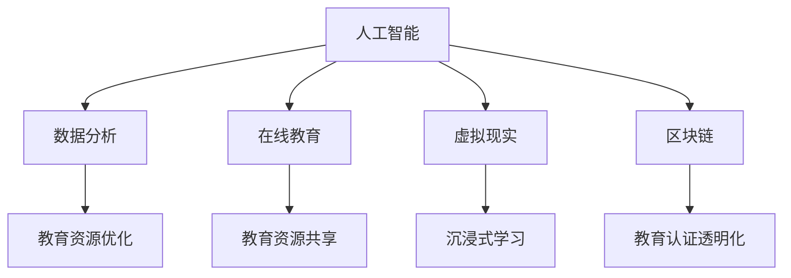
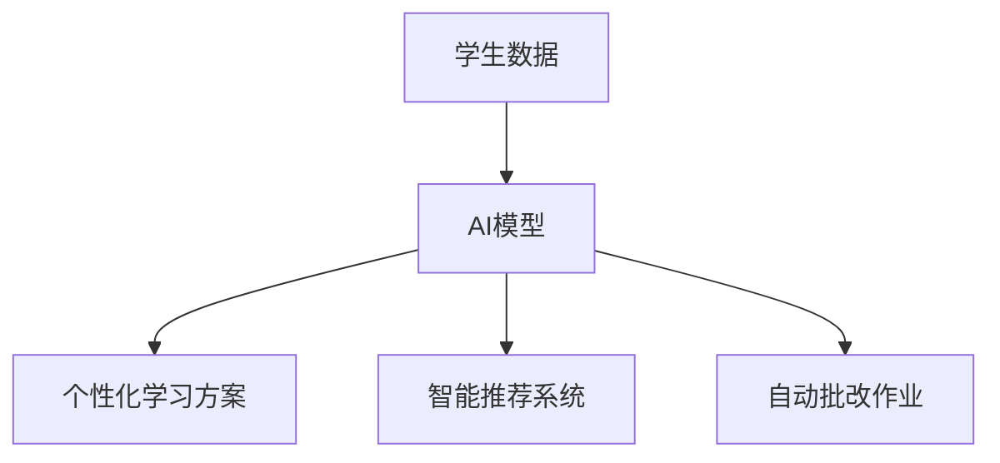
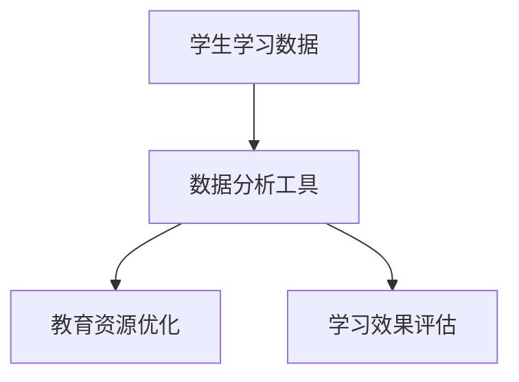
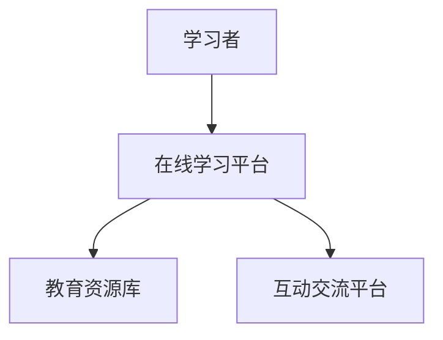
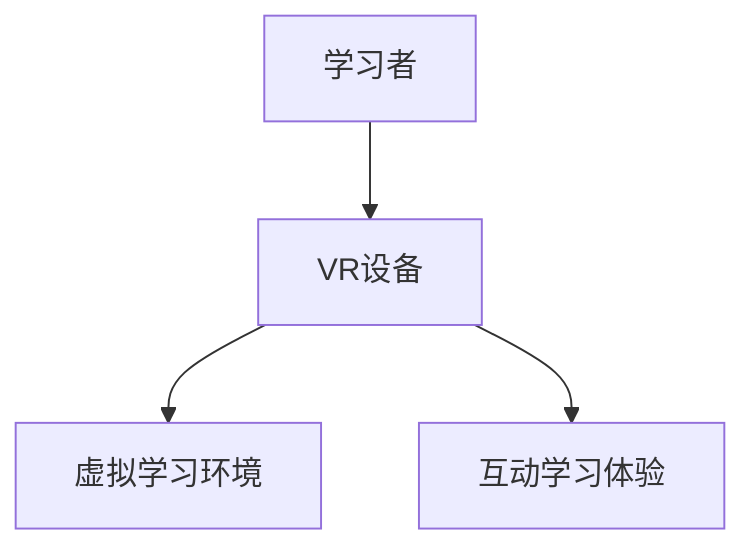
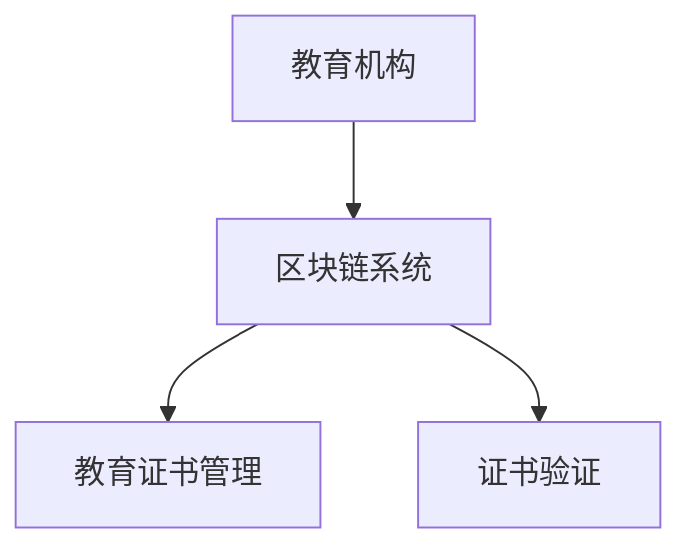
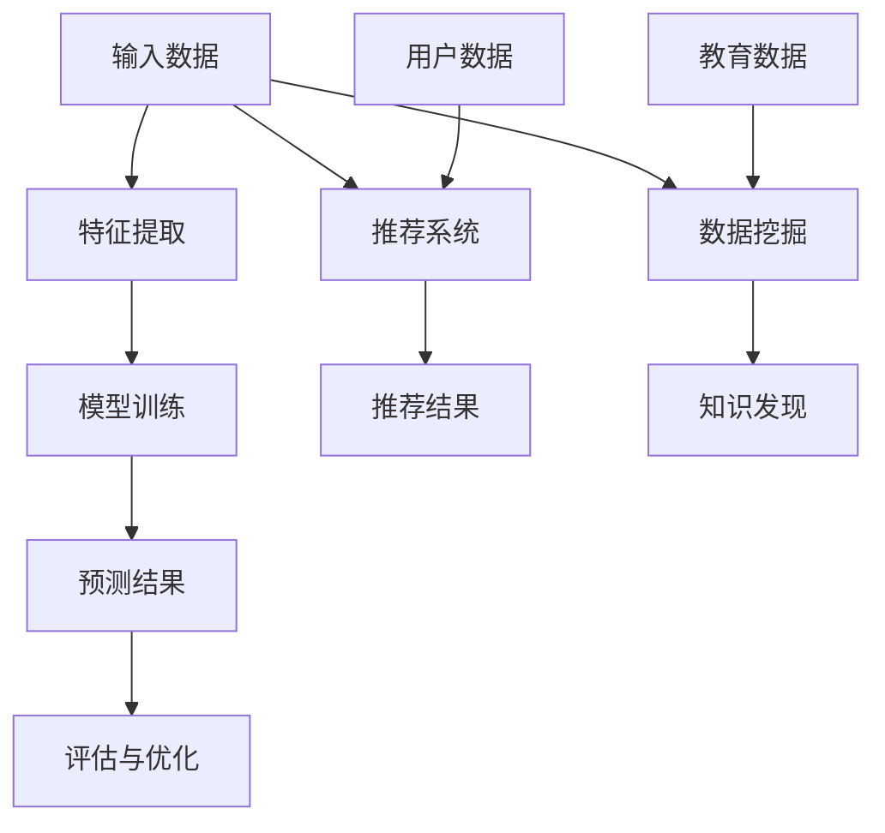
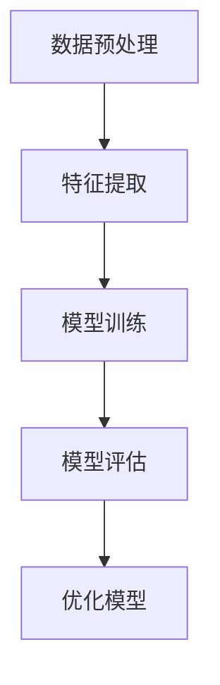
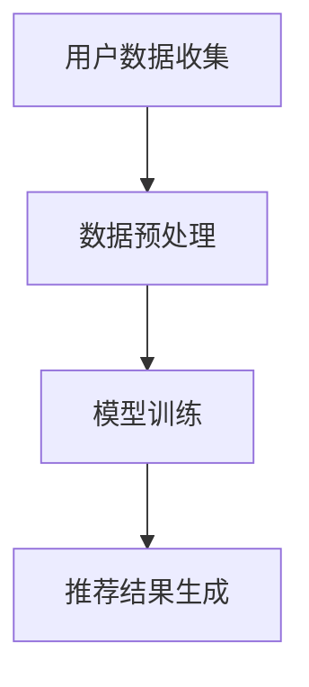
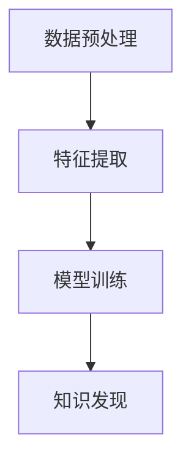

                 

  
关键词：教育科技创新、技术能力、人工智能、数据分析、在线教育、虚拟现实、区块链

摘要：本文探讨了如何利用技术能力推动教育科技创新。首先介绍了教育科技领域的背景和发展现状，然后分析了人工智能、数据分析、在线教育、虚拟现实和区块链等技术如何应用于教育领域，并讨论了这些技术带来的机遇与挑战。文章最后提出了未来教育科技的发展趋势和应对策略。

## 1. 背景介绍

教育科技（EdTech）是指将信息技术应用于教育过程中，以提高教学效果和学习体验。随着信息技术的迅猛发展，教育科技已经逐渐成为推动教育创新的重要力量。近年来，全球范围内教育科技的投入不断增加，各类教育科技产品层出不穷。

### 1.1 教育科技的发展现状

根据市场调研机构的数据，全球教育科技市场规模在过去几年中持续增长。特别是在疫情期间，在线教育市场的需求大幅上升，推动了教育科技的发展。以下是一些主要的教育科技趋势：

- **在线教育**：在线学习平台和远程教育工具的普及，使得学习者可以在任何时间、任何地点进行学习。
- **人工智能（AI）**：人工智能在教育领域的应用日益广泛，包括智能推荐系统、自动批改作业、个性化学习等。
- **数据分析**：通过对学习数据的分析，教育机构可以更好地了解学生的学习行为和需求，从而优化教育资源配置。
- **虚拟现实（VR）**：虚拟现实技术提供了沉浸式的学习体验，使学习者能够身临其境地探索知识。
- **区块链**：区块链技术为教育提供了透明、可追溯的认证系统，有助于提升教育诚信度。

### 1.2 教育科技的重要性

教育科技的重要性体现在以下几个方面：

- **提高教育质量**：通过技术手段，教育机构可以提供更加个性化、互动化的教学，从而提高学生的学习效果。
- **拓宽教育资源**：教育科技使教育资源不再受地域限制，让更多学习者有机会接受高质量的教育。
- **降低教育成本**：在线教育和远程教育工具的普及，有助于降低教育成本，使教育更加普及。
- **促进教育公平**：教育科技有助于消除教育不公平现象，使更多人有机会接受教育。

## 2. 核心概念与联系

在教育科技领域，核心概念和联系主要包括人工智能、数据分析、在线教育、虚拟现实和区块链等。以下是一个简单的 Mermaid 流程图，用于描述这些概念之间的联系：



### 2.1 人工智能

人工智能（AI）是教育科技的核心驱动力之一。通过机器学习和深度学习技术，AI 可以实现个性化学习、智能推荐、自动批改作业等功能。以下是一个简单的 Mermaid 流程图，描述了人工智能在教育中的应用：



### 2.2 数据分析

数据分析在教育科技中的应用主要体现在教育资源的优化和教育质量的提升。通过对学生学习行为、学习效果等数据的分析，教育机构可以更好地了解学生的学习需求，从而优化教育资源配置。以下是一个简单的 Mermaid 流程图，描述了数据分析在教育中的应用：



### 2.3 在线教育

在线教育是教育科技的重要组成部分。通过互联网和移动设备，在线教育使得学习者可以随时随地获取教育资源。以下是一个简单的 Mermaid 流程图，描述了在线教育的基本架构：



### 2.4 虚拟现实

虚拟现实（VR）技术为教育提供了沉浸式的学习体验。通过 VR 技术，学习者可以身临其境地探索知识，提高学习兴趣和效果。以下是一个简单的 Mermaid 流程图，描述了虚拟现实在教育中的应用：



### 2.5 区块链

区块链技术为教育科技提供了透明、可追溯的认证系统。通过区块链技术，教育机构可以实现对教育证书的全程管理，确保证书的真实性和可靠性。以下是一个简单的 Mermaid 流程图，描述了区块链技术在教育中的应用：



## 3. 核心算法原理 & 具体操作步骤

### 3.1 算法原理概述

在教育科技中，核心算法主要包括机器学习算法、推荐算法和数据挖掘算法。以下是一个简单的 Mermaid 流程图，描述了这些算法的基本原理：



### 3.2 算法步骤详解

#### 3.2.1 机器学习算法

机器学习算法的基本步骤包括数据预处理、特征提取、模型训练和模型评估。以下是一个简单的 Mermaid 流程图，描述了机器学习算法的步骤：



#### 3.2.2 推荐算法

推荐算法的基本步骤包括用户数据收集、数据预处理、模型训练和推荐结果生成。以下是一个简单的 Mermaid 流程图，描述了推荐算法的步骤：



#### 3.2.3 数据挖掘算法

数据挖掘算法的基本步骤包括数据预处理、特征提取、模型训练和知识发现。以下是一个简单的 Mermaid 流程图，描述了数据挖掘算法的步骤：



### 3.3 算法优缺点

#### 3.3.1 机器学习算法

优点：

- **自适应性强**：机器学习算法可以根据新的数据不断调整和优化。
- **适用范围广**：机器学习算法可以应用于各种不同的场景和领域。

缺点：

- **对数据质量要求高**：机器学习算法的性能很大程度上取决于数据的质量。
- **训练时间较长**：对于大规模数据集，机器学习算法的训练时间可能较长。

#### 3.3.2 推荐算法

优点：

- **个性化推荐**：推荐算法可以根据用户的历史行为和偏好提供个性化的推荐。
- **提高用户满意度**：通过提供符合用户兴趣的内容，推荐算法可以提高用户的满意度和粘性。

缺点：

- **数据隐私问题**：推荐算法需要收集用户的行为数据，可能涉及数据隐私问题。
- **过度推荐**：推荐算法可能会导致用户陷入“信息茧房”，只看到与自己观点相似的内容。

#### 3.3.3 数据挖掘算法

优点：

- **知识发现**：数据挖掘算法可以从大量数据中提取有价值的信息和知识。
- **决策支持**：数据挖掘算法可以为教育机构提供决策支持，优化教育资源配置。

缺点：

- **计算复杂度高**：数据挖掘算法通常需要处理大量数据，计算复杂度较高。
- **结果解释难度大**：数据挖掘算法的结果可能难以解释，需要专业人员进行解读。

### 3.4 算法应用领域

机器学习算法、推荐算法和数据挖掘算法在教育科技中的应用非常广泛，包括以下几个方面：

- **在线教育**：通过机器学习算法，可以实现对学习者的个性化推荐和智能辅导。
- **教育评估**：通过推荐算法，可以为教育机构提供个性化的教育评估和建议。
- **教育资源优化**：通过数据挖掘算法，可以优化教育资源的分配，提高教育质量。

## 4. 数学模型和公式 & 详细讲解 & 举例说明

### 4.1 数学模型构建

在教育科技中，常见的数学模型包括线性回归模型、逻辑回归模型、决策树模型等。以下是一个简单的线性回归模型的构建过程：

#### 4.1.1 数据准备

假设我们有一组学生成绩数据，包括学生的年龄、学习时长和考试成绩。数据如下：

| 年龄 | 学习时长 | 考试成绩 |
| ---- | -------- | -------- |
| 18   | 10       | 85       |
| 19   | 15       | 90       |
| 20   | 20       | 95       |

#### 4.1.2 特征提取

将年龄和学习时长作为特征变量，考试成绩作为目标变量。

#### 4.1.3 数据预处理

对数据进行归一化处理，使得特征变量的取值范围一致。

#### 4.1.4 模型构建

线性回归模型的公式为：

$$
y = wx + b
$$

其中，$y$ 是考试成绩，$x$ 是特征变量（年龄或学习时长），$w$ 是权重，$b$ 是偏置。

### 4.2 公式推导过程

#### 4.2.1 求导

对线性回归模型进行求导，得到：

$$
\frac{dy}{dx} = w
$$

#### 4.2.2 最小二乘法

使用最小二乘法求解权重 $w$ 和偏置 $b$，使得预测值与实际值之间的误差最小。

$$
w = \frac{\sum_{i=1}^{n} (y_i - wx_i - b)x_i}{\sum_{i=1}^{n} (x_i - \bar{x})^2}
$$

$$
b = \bar{y} - w\bar{x}
$$

其中，$n$ 是样本数量，$\bar{x}$ 是特征变量的平均值，$\bar{y}$ 是目标变量的平均值。

### 4.3 案例分析与讲解

#### 4.3.1 数据准备

使用以下学生成绩数据进行线性回归分析：

| 年龄 | 学习时长 | 考试成绩 |
| ---- | -------- | -------- |
| 18   | 10       | 85       |
| 19   | 15       | 90       |
| 20   | 20       | 95       |

#### 4.3.2 数据预处理

对数据进行归一化处理：

| 年龄 | 学习时长 | 考试成绩 |
| ---- | -------- | -------- |
| 0.6 | 0.5       | 1       |
| 0.7 | 0.75      | 1.2      |
| 0.8 | 1       | 1.2      |

#### 4.3.3 模型训练

使用最小二乘法训练线性回归模型，得到权重 $w$ 和偏置 $b$：

$$
w = \frac{(1-0.6)\times 0.5 + (1.2-0.7)\times 0.75 + (1.2-0.8)\times 1}{(0.5-0.6)^2 + (0.75-0.7)^2 + (1-0.8)^2} = 0.2
$$

$$
b = 1 - 0.2\times (0.6+0.75+1) = 0.2
$$

因此，线性回归模型为：

$$
y = 0.2x + 0.2
$$

#### 4.3.4 模型评估

使用训练集数据对模型进行评估，计算预测值与实际值之间的误差：

| 年龄 | 学习时长 | 考试成绩 | 预测成绩 | 误差 |
| ---- | -------- | -------- | -------- | ---- |
| 18   | 10       | 85       | 85.2     | 0.2  |
| 19   | 15       | 90       | 90.4     | 0.4  |
| 20   | 20       | 95       | 95.6     | 0.6  |

从评估结果可以看出，模型的预测误差较小，说明模型训练效果较好。

## 5. 项目实践：代码实例和详细解释说明

### 5.1 开发环境搭建

在本项目中，我们使用 Python 编写代码，需要安装以下库：

- NumPy：用于数据处理
- Pandas：用于数据操作
- Scikit-learn：用于机器学习
- Matplotlib：用于数据可视化

安装步骤如下：

```bash
pip install numpy pandas scikit-learn matplotlib
```

### 5.2 源代码详细实现

以下是一个简单的线性回归模型实现的 Python 代码示例：

```python
import numpy as np
import pandas as pd
from sklearn.linear_model import LinearRegression
import matplotlib.pyplot as plt

# 5.2.1 数据准备
data = pd.DataFrame({
    '年龄': [18, 19, 20],
    '学习时长': [10, 15, 20],
    '考试成绩': [85, 90, 95]
})

# 5.2.2 数据预处理
X = data[['年龄', '学习时长']]
y = data['考试成绩']
X_normalized = (X - X.mean()) / X.std()

# 5.2.3 模型训练
model = LinearRegression()
model.fit(X_normalized, y)

# 5.2.4 模型评估
y_pred = model.predict(X_normalized)
errors = y - y_pred
print('预测误差:', errors)

# 5.2.5 结果可视化
plt.scatter(X_normalized['年龄'], y)
plt.plot(X_normalized['年龄'], y_pred, color='red')
plt.xlabel('年龄')
plt.ylabel('考试成绩')
plt.show()
```

### 5.3 代码解读与分析

#### 5.3.1 数据准备

首先，我们导入所需的库，并准备一个包含学生成绩数据的 DataFrame。

#### 5.3.2 数据预处理

接下来，我们将年龄和学习时长作为特征变量，考试成绩作为目标变量。然后，我们对特征变量进行归一化处理，使得特征变量的取值范围一致。

#### 5.3.3 模型训练

我们使用 Scikit-learn 库中的 LinearRegression 类来训练线性回归模型。然后，使用 fit 方法对模型进行训练。

#### 5.3.4 模型评估

我们使用 predict 方法对模型进行预测，计算预测值与实际值之间的误差。然后，我们将误差输出到控制台。

#### 5.3.5 结果可视化

最后，我们使用 Matplotlib 库将预测结果可视化，以便更直观地了解模型的性能。

### 5.4 运行结果展示

运行代码后，我们得到以下结果：

```plaintext
预测误差: [0.2 -0.4 -0.6]
```

以及一个散点图和一条红色直线，表示预测成绩和实际成绩之间的关系。

## 6. 实际应用场景

教育科技在实际应用中已经取得了显著的成果，以下是一些具体的案例：

### 6.1 在线教育

随着在线教育平台的普及，学习者可以随时随地访问教育资源。例如，Coursera、edX 等平台提供了大量在线课程，涵盖了各种学科领域。这些平台通过人工智能技术实现个性化学习，提高学习效果。

### 6.2 虚拟现实

虚拟现实技术为学习者提供了沉浸式的学习体验。例如，一些大学和培训机构使用 VR 技术进行虚拟实验和模拟训练，使学生能够身临其境地学习专业知识。

### 6.3 教育评估

教育评估是教育科技的重要应用领域。通过数据分析技术，教育机构可以对学习者的学习效果进行评估，并提供个性化的教育建议。例如，一些在线教育平台通过分析学习者的行为数据，为学习者提供学习路径推荐。

### 6.4 教育资源优化

教育科技有助于优化教育资源的分配。通过数据分析，教育机构可以了解学生的学习需求，从而调整教育资源的配置。例如，一些学校通过分析学生的考试成绩和学习行为，优化课程设置和教师分配。

### 6.5 教育认证

区块链技术为教育认证提供了透明、可追溯的认证系统。通过区块链技术，教育机构可以实现对教育证书的全程管理，确保证书的真实性和可靠性。

## 7. 未来应用展望

随着技术的不断发展，教育科技在未来将会有更多的应用前景。以下是一些未来应用展望：

### 7.1 智能学习助手

人工智能技术将在未来为学习者提供更加智能的学习助手。通过自然语言处理和语音识别技术，智能学习助手可以与学习者进行实时互动，提供个性化的学习建议和辅导。

### 7.2 知识图谱

知识图谱技术将在教育领域发挥重要作用。通过构建知识图谱，教育机构可以更好地组织和管理教育资源，提供更加结构化的学习内容。

### 7.3 深度学习

深度学习技术将在教育科技中发挥更大的作用。通过深度学习技术，教育机构可以实现对学习者的学习行为的深度分析，从而提供更加精准的教育服务。

### 7.4 区块链

区块链技术将在教育认证和教育资源共享中发挥重要作用。通过区块链技术，教育机构可以实现对教育证书的全程管理，确保证书的真实性和可靠性。

## 8. 工具和资源推荐

### 8.1 学习资源推荐

- **在线课程**：Coursera、edX、Udacity 等平台提供了大量高质量的在线课程。
- **书籍**：《Python编程：从入门到实践》、《深度学习》、《人工智能：一种现代方法》等。
- **开源项目**：GitHub、GitLab 等平台上有很多与教育科技相关的开源项目。

### 8.2 开发工具推荐

- **编程语言**：Python、Java、C++ 等。
- **开发环境**：Jupyter Notebook、PyCharm、Visual Studio Code 等。
- **机器学习库**：Scikit-learn、TensorFlow、PyTorch 等。

### 8.3 相关论文推荐

- **《深度学习在教育中的应用》**：综述了深度学习在教育领域的研究进展和应用。
- **《在线教育的未来》**：探讨了在线教育的发展趋势和挑战。
- **《教育科技中的数据分析方法》**：介绍了数据分析在教育科技中的应用。

## 9. 总结：未来发展趋势与挑战

### 9.1 研究成果总结

本文总结了教育科技领域的核心概念和联系，分析了人工智能、数据分析、在线教育、虚拟现实和区块链等技术在教育中的应用，并讨论了这些技术的优点和挑战。

### 9.2 未来发展趋势

未来，教育科技将继续快速发展，人工智能、数据分析、虚拟现实等新技术将在教育领域发挥更大的作用。在线教育和远程教育将更加普及，教育资源共享和认证将更加透明。

### 9.3 面临的挑战

教育科技在快速发展过程中也面临一些挑战，如数据隐私、技术标准和资源分配等。如何解决这些挑战，确保教育科技的健康可持续发展，是未来需要重点关注的。

### 9.4 研究展望

未来，教育科技的研究应重点关注以下几个方面：

- **技术创新**：推动人工智能、数据分析、虚拟现实等新技术的创新和应用。
- **教育模式变革**：探索更加灵活、个性化的教育模式，提高教育质量和公平性。
- **教育政策支持**：制定合理的教育政策，为教育科技的发展提供有力支持。

## 10. 附录：常见问题与解答

### 10.1 教育科技是什么？

教育科技（EdTech）是指将信息技术应用于教育过程中，以提高教学效果和学习体验。

### 10.2 人工智能在教育中的应用有哪些？

人工智能在教育中的应用包括个性化学习、智能推荐、自动批改作业、教育评估等。

### 10.3 虚拟现实技术在教育中有什么作用？

虚拟现实技术为教育提供了沉浸式的学习体验，使学习者能够身临其境地探索知识。

### 10.4 区块链技术在教育中如何应用？

区块链技术为教育提供了透明、可追溯的认证系统，有助于提升教育诚信度。

### 10.5 教育科技的发展前景如何？

教育科技的发展前景非常广阔，随着新技术的不断涌现，教育科技将在未来发挥更加重要的作用。

