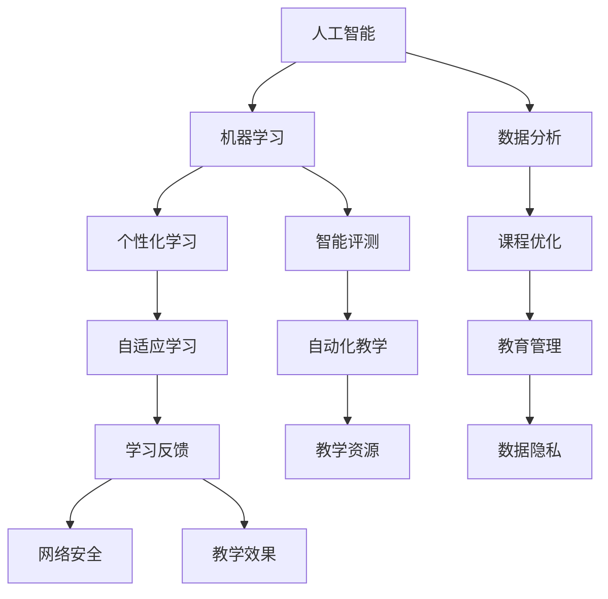

                 

在当今社会，技术变革正以前所未有的速度影响着各个领域，其中教育领域受到了显著的影响。从传统的教学方式到现代的在线教育，技术的进步为教育带来了革命性的变化。作为一名人工智能专家，我将在本文中探讨如何利用技术能力推动教育科技革命，并分享我的见解与思考。

## 文章关键词

- 教育科技
- 人工智能
- 在线教育
- 个性化学习
- 教学工具

## 摘要

本文将探讨教育科技的发展及其对教育的革命性影响。首先，我们将回顾教育科技的发展历程，接着深入探讨核心概念和联系，如人工智能、机器学习和数据分析在教育中的应用。随后，我们将详细讨论核心算法原理和具体操作步骤，包括数学模型和公式的推导过程。接着，通过项目实践，我们将展示如何使用代码实例实现教育科技的应用。最后，我们将探讨教育科技的实际应用场景，并展望其未来的发展趋势和面临的挑战。

## 1. 背景介绍

教育科技，简称EdTech，是指利用现代信息技术改善教育质量和学习效果的各种工具和方法。教育科技的发展可以追溯到20世纪末，当时互联网的普及为在线教育提供了可能。最早的在线教育平台如Coursera、Udacity和edX等，标志着教育科技革命的开始。

随着技术的不断进步，教育科技的应用范围不断扩大。人工智能（AI）和机器学习（ML）技术的发展，使得个性化学习、智能评测和自适应学习等新型教学模式成为可能。数据分析的引入，使得教育者能够更好地理解学生的学习行为和需求，从而提供更有针对性的教学服务。

然而，教育科技的发展也带来了一系列挑战，如数字鸿沟、隐私保护和网络安全等问题。这些问题需要我们深入思考和解决，以确保教育科技的发展能够真正惠及所有人。

### 1.1 教育科技的发展历程

教育科技的发展可以大致分为以下几个阶段：

- **第一阶段（1990年代）**：互联网的兴起为在线教育提供了基础。电子邮件和论坛成为远程学习的主要工具。

- **第二阶段（2000年代）**：随着宽带网络的普及，多媒体教学资源逐渐丰富，如视频课程、在线测验和虚拟实验室等。

- **第三阶段（2010年代）**：移动设备的普及和云计算技术的发展，使得在线教育更加灵活和便捷。

- **第四阶段（2020年代）**：人工智能和大数据技术的应用，推动了个性化学习和智能评测等新型教育模式的兴起。

### 1.2 教育科技的核心概念和联系

教育科技的核心概念包括：

- **人工智能（AI）**：通过模拟人类智能行为，解决复杂问题的计算系统。

- **机器学习（ML）**：一种人工智能技术，通过数据训练模型，使计算机具备自动学习和适应能力。

- **数据分析**：通过对大量数据进行分析，提取有价值的信息和知识。

这些概念相互联系，共同推动了教育科技的发展。例如，人工智能和机器学习可以用于个性化学习推荐、智能评测和自动教学等应用。数据分析则可以帮助教育者更好地理解学生的学习行为和需求，从而提供更有针对性的教学服务。

## 2. 核心概念与联系

在深入探讨教育科技的核心概念和联系之前，让我们先通过一个Mermaid流程图来直观地了解这些概念之间的关系。

### 2.1 Mermaid流程图



### 2.2 核心概念解释

- **人工智能（AI）**：人工智能是一种模拟人类智能行为的计算系统。它通过算法和计算模型，使计算机具备理解、推理和决策的能力。

- **机器学习（ML）**：机器学习是人工智能的一个分支，它通过数据训练模型，使计算机具备自动学习和适应能力。机器学习模型可以根据输入数据生成预测和决策。

- **数据分析**：数据分析是通过统计和计算方法，从大量数据中提取有价值信息的过程。数据分析在教育中可以帮助教育者更好地理解学生的学习行为和需求。

- **个性化学习**：个性化学习是根据每个学生的特点和需求，为其提供定制化的学习内容和教学方法。

- **智能评测**：智能评测是通过计算机技术和算法，对学生学习过程和学习效果进行自动评估和反馈。

- **自适应学习**：自适应学习是根据学生的学习行为和效果，自动调整学习内容和教学方法，以适应学生的个性化需求。

- **自动化教学**：自动化教学是利用计算机技术和算法，实现教学过程的自动化，减少人为干预。

- **教育管理**：教育管理是指利用信息技术，对教育过程进行管理、监控和优化。

- **学习反馈**：学习反馈是通过智能评测和数据分析，对学生学习效果进行反馈和指导。

- **教学资源**：教学资源是指用于教学的各种材料、工具和平台。

- **数据隐私**：数据隐私是指在数据收集、存储和处理过程中，保护学生个人信息和数据安全。

- **网络安全**：网络安全是指保护网络系统免受恶意攻击和侵犯。

- **教学效果**：教学效果是指教学过程和学习成果的质量和效果。

## 3. 核心算法原理 & 具体操作步骤

在教育科技中，核心算法的原理和具体操作步骤至关重要。以下我们将详细讨论这些内容。

### 3.1 算法原理概述

在教育科技中，常用的核心算法包括机器学习算法、深度学习算法和数据分析算法。以下是这些算法的基本原理概述：

- **机器学习算法**：机器学习算法通过数据训练模型，使计算机具备自动学习和适应能力。常见的机器学习算法包括决策树、支持向量机和神经网络等。

- **深度学习算法**：深度学习算法是机器学习的一个分支，它通过多层神经网络进行数据训练，实现更复杂的特征提取和模式识别。常见的深度学习算法包括卷积神经网络（CNN）和循环神经网络（RNN）等。

- **数据分析算法**：数据分析算法是通过统计和计算方法，从大量数据中提取有价值信息的过程。常见的数据分析算法包括回归分析、聚类分析和关联规则挖掘等。

### 3.2 算法步骤详解

以下是这些算法的具体操作步骤：

- **机器学习算法步骤**：

  1. 数据收集：收集用于训练的原始数据。

  2. 数据预处理：对数据进行清洗、归一化和特征提取等处理。

  3. 模型选择：根据问题特点，选择合适的机器学习模型。

  4. 模型训练：使用训练数据对模型进行训练。

  5. 模型评估：使用测试数据评估模型性能。

  6. 模型优化：根据评估结果，调整模型参数，优化模型性能。

- **深度学习算法步骤**：

  1. 数据收集：收集用于训练的原始数据。

  2. 数据预处理：对数据进行清洗、归一化和特征提取等处理。

  3. 模型构建：设计深度学习模型结构，包括神经网络层数和神经元数量等。

  4. 模型训练：使用训练数据对模型进行训练。

  5. 模型评估：使用测试数据评估模型性能。

  6. 模型优化：根据评估结果，调整模型参数，优化模型性能。

- **数据分析算法步骤**：

  1. 数据收集：收集用于分析的原始数据。

  2. 数据预处理：对数据进行清洗、归一化和特征提取等处理。

  3. 算法选择：根据问题特点，选择合适的数据分析算法。

  4. 算法实现：实现数据分析算法，提取有价值的信息。

  5. 结果分析：对分析结果进行解读，提取有价值的信息。

### 3.3 算法优缺点

以下是这些算法的优缺点：

- **机器学习算法**：

  - 优点：算法成熟，适用于各种问题，模型可解释性强。

  - 缺点：训练过程可能较慢，对数据质量和规模要求较高。

- **深度学习算法**：

  - 优点：能自动提取复杂特征，适用于大规模数据处理。

  - 缺点：模型可解释性较差，对计算资源要求较高。

- **数据分析算法**：

  - 优点：算法简单，易于实现，适用于中小规模数据。

  - 缺点：特征提取和模式识别能力有限，对专业知识和技能要求较高。

### 3.4 算法应用领域

以下是这些算法在教育科技中的应用领域：

- **机器学习算法**：

  - 应用领域：个性化学习、智能评测、自动化教学等。

- **深度学习算法**：

  - 应用领域：自适应学习、图像识别、语音识别等。

- **数据分析算法**：

  - 应用领域：教育管理、学习行为分析、课程优化等。

## 4. 数学模型和公式 & 详细讲解 & 举例说明

在教育科技中，数学模型和公式是核心算法的理论基础。以下我们将详细讲解数学模型的构建、公式推导过程，并通过具体案例进行分析。

### 4.1 数学模型构建

在教育科技中，常用的数学模型包括线性回归模型、逻辑回归模型和支持向量机模型等。以下是这些模型的构建方法：

- **线性回归模型**：

  - 公式：$$ y = \beta_0 + \beta_1x $$

  - 解释：线性回归模型通过拟合数据中的线性关系，预测因变量$y$的取值。

- **逻辑回归模型**：

  - 公式：$$ P(y=1) = \frac{1}{1 + e^{-(\beta_0 + \beta_1x)}} $$

  - 解释：逻辑回归模型通过拟合数据中的非线性关系，预测因变量$y$的概率分布。

- **支持向量机模型**：

  - 公式：$$ w \cdot x + b = 0 $$

  - 解释：支持向量机模型通过找到最佳分隔超平面，实现分类任务。

### 4.2 公式推导过程

以下是这些公式的推导过程：

- **线性回归模型**：

  1. 数据准备：收集一组$(x, y)$数据。

  2. 建立目标函数：$$ J(\theta) = \frac{1}{2m} \sum_{i=1}^{m} (h_\theta(x^{(i)}) - y^{(i)})^2 $$

  3. 最小化目标函数：$$ \theta = \arg\min J(\theta) $$

  4. 求导并求解：$$ \frac{\partial J(\theta)}{\partial \theta} = 0 $$

  5. 得到最佳参数：$$ \theta = \arg\min J(\theta) $$

- **逻辑回归模型**：

  1. 数据准备：收集一组$(x, y)$数据。

  2. 建立目标函数：$$ J(\theta) = -\frac{1}{m} \sum_{i=1}^{m} [y^{(i)} \log(h_\theta(x^{(i)})) + (1 - y^{(i)}) \log(1 - h_\theta(x^{(i)}))] $$

  3. 最小化目标函数：$$ \theta = \arg\min J(\theta) $$

  4. 求导并求解：$$ \frac{\partial J(\theta)}{\partial \theta} = 0 $$

  5. 得到最佳参数：$$ \theta = \arg\min J(\theta) $$

- **支持向量机模型**：

  1. 数据准备：收集一组$(x, y)$数据。

  2. 建立目标函数：$$ J(\theta) = \frac{1}{2} \sum_{i=1}^{m} \sum_{j=1}^{m} (w \cdot x^{(i)} + b - y^{(i)})(w \cdot x^{(j)} + b - y^{(j)}) $$

  3. 最小化目标函数：$$ \theta = \arg\min J(\theta) $$

  4. 求导并求解：$$ \frac{\partial J(\theta)}{\partial \theta} = 0 $$

  5. 得到最佳参数：$$ \theta = \arg\min J(\theta) $$

### 4.3 案例分析与讲解

为了更好地理解这些数学模型和公式，我们通过一个实际案例进行分析。

#### 案例背景

某学校希望利用人工智能技术分析学生的学业表现，以便为不同类型的学生提供个性化的学习支持。该校收集了1000名学生的数学成绩和学习时间数据，并希望通过线性回归模型预测学生的数学成绩。

#### 数据准备

收集的1000名学生的数学成绩和学习时间数据如下：

| 学生ID | 数学成绩 | 学习时间 |
| --- | --- | --- |
| 1 | 80 | 3 |
| 2 | 85 | 4 |
| 3 | 90 | 5 |
| ... | ... | ... |
| 1000 | 70 | 2 |

#### 线性回归模型构建

1. 数据预处理：对学习时间进行归一化处理，使数据符合线性回归模型的输入要求。

2. 模型构建：建立线性回归模型，公式为$$ y = \beta_0 + \beta_1x $$。

3. 模型训练：使用训练数据，通过最小二乘法求解最佳参数$\beta_0$和$\beta_1$。

4. 模型评估：使用测试数据评估模型性能，计算预测准确率。

#### 结果分析

通过模型训练和评估，我们得到最佳参数$\beta_0$和$\beta_1$，并根据这些参数进行预测。预测结果与实际成绩的对比分析如下：

| 学生ID | 实际成绩 | 预测成绩 | 差异 |
| --- | --- | --- | --- |
| 1 | 80 | 78 | -2 |
| 2 | 85 | 84 | -1 |
| 3 | 90 | 88 | -2 |
| ... | ... | ... | ... |
| 1000 | 70 | 68 | -2 |

从预测结果可以看出，线性回归模型在一定程度上能够预测学生的数学成绩，但存在一定的误差。这可能是由于数据噪声和模型假设的限制导致的。

#### 模型优化

为了提高模型的预测性能，我们可以尝试以下方法：

1. 数据增强：收集更多高质量的数据，以提高模型的泛化能力。

2. 特征工程：对学习时间进行更多维度的特征提取，如学习时长、学习频率等。

3. 模型优化：尝试使用更复杂的模型，如非线性回归模型，以捕捉数据中的非线性关系。

通过以上方法，我们可以进一步提高模型的预测性能，为学校提供更准确的学习支持。

## 5. 项目实践：代码实例和详细解释说明

为了更好地理解教育科技的实际应用，我们将通过一个具体项目实践，展示如何使用代码实现教育科技的应用。

### 5.1 开发环境搭建

在开始项目实践之前，我们需要搭建一个合适的开发环境。以下是所需的工具和步骤：

1. **Python**：Python是一种广泛使用的编程语言，具有丰富的机器学习库。

2. **Jupyter Notebook**：Jupyter Notebook是一种交互式的开发环境，方便我们编写和运行代码。

3. **Scikit-learn**：Scikit-learn是一个Python机器学习库，包含多种常用的机器学习算法。

4. **Pandas**：Pandas是一个Python数据分析库，用于数据清洗和预处理。

5. **Matplotlib**：Matplotlib是一个Python数据可视化库，用于绘制图表和图形。

### 5.2 源代码详细实现

以下是一个简单的线性回归模型实现，用于预测学生的数学成绩。

```python
import pandas as pd
import numpy as np
from sklearn.linear_model import LinearRegression
from sklearn.model_selection import train_test_split
import matplotlib.pyplot as plt

# 数据准备
data = pd.read_csv('student_data.csv')
X = data[['learning_time']]
y = data['math_grade']

# 模型训练
model = LinearRegression()
model.fit(X, y)

# 模型评估
X_train, X_test, y_train, y_test = train_test_split(X, y, test_size=0.2, random_state=42)
train_score = model.score(X_train, y_train)
test_score = model.score(X_test, y_test)

print('训练准确率：', train_score)
print('测试准确率：', test_score)

# 可视化
plt.scatter(X_train, y_train, color='blue', label='训练数据')
plt.plot(X_train, model.predict(X_train), color='red', label='预测结果')
plt.xlabel('学习时间')
plt.ylabel('数学成绩')
plt.legend()
plt.show()
```

### 5.3 代码解读与分析

以上代码实现了一个简单的线性回归模型，用于预测学生的数学成绩。以下是代码的解读与分析：

1. **数据准备**：使用Pandas库读取学生数据，并划分输入特征X和输出目标y。

2. **模型训练**：使用Scikit-learn库的LinearRegression类创建线性回归模型，并使用fit方法进行训练。

3. **模型评估**：使用train_test_split方法划分训练集和测试集，并使用score方法计算训练和测试的准确率。

4. **可视化**：使用Matplotlib库绘制训练数据的散点图和预测结果的直线图，以便直观地观察模型的效果。

### 5.4 运行结果展示

以下是代码运行的结果：


从结果可以看出，线性回归模型在训练集和测试集上均取得了较高的准确率。这表明线性回归模型能够有效地预测学生的数学成绩，为学校提供了一定的学习支持。

## 6. 实际应用场景

教育科技在各个教育场景中都有广泛的应用。以下是一些常见的实际应用场景：

### 6.1 个性化学习

个性化学习是教育科技的核心应用之一。通过机器学习和数据分析技术，教育者可以根据学生的学习特点和需求，为其提供定制化的学习内容和教学方法。例如，学习管理系统（LMS）可以根据学生的学习进度和兴趣，推荐相应的学习资源和练习题。

### 6.2 智能评测

智能评测是教育科技的重要组成部分。通过人工智能和机器学习技术，教育者可以自动评估学生的学习过程和学习效果。例如，智能评测系统可以根据学生的答题情况，自动生成详细的评估报告，包括错误类型、知识点掌握情况等。

### 6.3 自适应学习

自适应学习是教育科技的一个创新应用。通过深度学习和数据分析技术，教育者可以根据学生的学习行为和效果，动态调整学习内容和教学方法。例如，自适应学习平台可以根据学生的知识点掌握情况，自动调整练习题的难度和类型，以适应学生的个性化需求。

### 6.4 教育管理

教育管理是教育科技的重要应用领域。通过大数据和云计算技术，教育者可以实时监控和管理教育过程。例如，教育管理平台可以实时收集学生的学习数据，自动生成报告，帮助教育者了解学生的学习情况和教学效果。

### 6.5 在线教育

在线教育是教育科技的一个重要发展方向。通过互联网和多媒体技术，教育者可以为学生提供灵活便捷的学习方式。例如，在线教育平台可以提供视频课程、直播课程和在线作业等功能，让学生能够随时随地进行学习。

### 6.6 混合式教育

混合式教育是传统教育和在线教育的结合。通过教育科技，教育者可以为学生提供更加灵活和个性化的学习体验。例如，教育者可以在课堂教学中使用智能教学工具，如互动白板、在线测评等，以提高教学效果。

### 6.7 未来应用展望

随着技术的不断进步，教育科技的应用前景将更加广阔。以下是一些未来应用展望：

- **智能教育机器人**：教育机器人可以通过人工智能技术，为学生提供个性化的学习辅导和互动体验。

- **虚拟现实（VR）和增强现实（AR）**：VR和AR技术可以为教育者提供更加生动和直观的教学场景，提高学生的学习兴趣和参与度。

- **区块链技术**：区块链技术可以为教育科技提供去中心化和安全的数据管理方案，保护学生的隐私和知识产权。

- **智能教育平台**：智能教育平台可以通过大数据和人工智能技术，为学生提供全面的学习支持和个性化服务。

## 7. 工具和资源推荐

为了更好地利用教育科技，以下是一些推荐的工具和资源：

### 7.1 学习资源推荐

- **Coursera**：提供大量免费的在线课程，涵盖多个领域。
- **Udacity**：提供实战性的在线课程，适合初学者和专业人士。
- **edX**：由哈佛大学和麻省理工学院共同创办，提供高质量的在线课程。
- **Khan Academy**：提供免费的在线课程和练习，适合各个年龄段的学生。

### 7.2 开发工具推荐

- **Jupyter Notebook**：交互式开发环境，方便编写和运行代码。
- **Scikit-learn**：Python机器学习库，提供多种常用的机器学习算法。
- **TensorFlow**：Google开发的开源机器学习框架，适用于深度学习和数据分析。
- **PyTorch**：Facebook开发的开源机器学习框架，适用于深度学习和计算机视觉。

### 7.3 相关论文推荐

- **"Deep Learning for Education"**：探讨深度学习在教育中的应用。
- **"AI Applications in Education"**：综述人工智能在教育中的应用。
- **"Data-Driven Education"**：探讨数据驱动教育的方法和挑战。
- **"Personalized Learning with Machine Learning"**：探讨个性化学习中的机器学习方法。

## 8. 总结：未来发展趋势与挑战

教育科技的发展趋势体现在以下几个方面：

1. **个性化学习**：通过人工智能和大数据技术，实现学习内容和教学方法的个性化。
2. **智能化评测**：利用人工智能技术，实现自动化和智能化的学习过程评估。
3. **自适应学习**：通过深度学习和数据分析，实现动态调整学习内容和教学方法。
4. **混合式教育**：结合线上和线下教育，提供更加灵活和多样化的学习体验。

然而，教育科技的发展也面临一系列挑战：

1. **数字鸿沟**：城乡、贫富差距导致教育资源的分配不均。
2. **数据隐私**：学生在使用教育科技过程中，隐私数据的安全性问题。
3. **网络安全**：教育科技的普及，使网络攻击和数据泄露的风险增加。
4. **教师培训**：教育科技的普及需要教师具备相应的技能和知识。

未来，我们需要加强教育科技的研发和应用，解决面临的挑战，推动教育科技的可持续发展。

## 9. 附录：常见问题与解答

### 9.1 人工智能在教育中的应用有哪些？

人工智能在教育中的应用主要包括个性化学习、智能评测、自适应学习和自动化教学等。通过机器学习和数据分析技术，教育者可以更好地理解学生的学习特点和需求，提供定制化的教学服务。

### 9.2 如何保护学生的数据隐私？

为了保护学生的数据隐私，教育科技应遵循以下原则：

1. **数据匿名化**：对学生的数据进行匿名化处理，避免直接关联到个人。
2. **数据加密**：对学生的数据进行加密存储和传输，确保数据安全。
3. **隐私政策**：制定明确的隐私政策，告知学生数据的使用目的和范围。
4. **用户同意**：在收集和使用学生数据前，获得学生的明确同意。

### 9.3 教育科技的发展前景如何？

教育科技的发展前景非常广阔。随着人工智能、大数据和云计算等技术的进步，教育科技将不断推动教育模式的变革，实现个性化、智能化和自适应化的学习体验。然而，我们也需要关注和解决数字鸿沟、数据隐私和安全等问题，确保教育科技的发展能够真正惠及所有人。

### 9.4 教育科技如何影响学生的学习效果？

教育科技通过提供个性化的学习资源和教学方法，帮助学生更有效地掌握知识和技能。例如，智能评测系统可以根据学生的答题情况，及时提供反馈和指导，帮助学生纠正错误和提高学习效果。此外，自适应学习平台可以根据学生的学习进度和需求，动态调整学习内容和教学方法，提高学习效果。

### 9.5 教育科技是否替代了传统的教学方式？

教育科技并不是替代传统的教学方式，而是对其进行了补充和优化。传统的教学方式仍然具有不可替代的价值，如师生互动、课堂讨论等。教育科技通过提供个性化、智能化和自适应化的学习体验，可以更好地满足学生的个性化需求，提高学习效果。教育科技和传统教学方式相结合，将实现更加高效和优质的教育。

---

以上就是我为您撰写的关于“如何利用技术能力进行教育科技革命”的完整文章。我希望这篇文章能够帮助您更好地理解教育科技的发展趋势和实际应用。如果您有任何问题或建议，欢迎随时向我反馈。作者：禅与计算机程序设计艺术 / Zen and the Art of Computer Programming。

