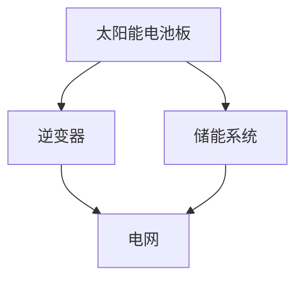

                 

 稻田太阳能，清洁能源，技术能力，创新，可再生能源，算法优化，人工智能，能源效率

## 1. 背景介绍

随着全球气候变化和环境问题的日益严重，清洁能源已经成为全球能源转型的重要方向。清洁能源（如太阳能、风能、水能等）具有可再生、低污染、高效率等特点，是实现可持续发展的重要手段。然而，当前清洁能源的利用仍面临诸多挑战，包括效率低下、成本高昂、存储难题等。为了解决这些问题，我们需要借助先进的技术手段进行清洁能源领域的创新。

在技术领域，人工智能、大数据、物联网等技术的快速发展为清洁能源的创新提供了强有力的支持。通过这些技术，我们可以实现能源的高效利用、优化能源系统、降低能源成本，并提升能源供应的可靠性。本文将探讨如何利用技术能力进行清洁能源领域的创新，包括核心算法原理、数学模型、项目实践等方面。

## 2. 核心概念与联系

### 2.1 可再生能源概述

可再生能源是指那些不会枯竭、对环境友好、能够在人类时间尺度内持续使用的能源，主要包括太阳能、风能、水能、地热能、生物质能等。这些能源具有以下几个显著特点：

- **可再生性**：可再生能源可以从自然界源源不断地获取，不会因使用而枯竭。
- **环境友好**：与传统能源相比，可再生能源在发电过程中排放的温室气体和其他污染物显著减少。
- **分布式特性**：许多可再生能源资源分布广泛，适合分布式发电和储能，有利于实现能源的本地化供应。

### 2.2 能源互联网概念

能源互联网是一种新型的能源系统架构，将可再生能源、储能、传输、分配和消费有机地结合在一起，形成一个高效、可靠、灵活的能源网络。能源互联网的核心思想是通过信息通信技术实现能源的智能化管理和优化，提高能源系统的整体效率和可持续性。其主要特点包括：

- **智能化**：利用大数据、人工智能等技术，实现能源系统的自学习、自优化和自调节。
- **灵活性**：通过分布式发电和储能，实现能源供应与需求的动态平衡。
- **可持续性**：通过优化能源结构，降低能源消耗，减少环境污染。

### 2.3 算法优化在清洁能源中的应用

算法优化在清洁能源领域具有广泛的应用，包括发电计划优化、能效优化、储能系统管理等方面。通过算法优化，可以实现以下目标：

- **提高能源效率**：通过优化能源系统的运行参数，提高能源的转化和利用效率。
- **降低能源成本**：通过优化能源分配和调度，降低能源生产和存储的成本。
- **提高能源可靠性**：通过优化能源供应和需求，提高能源系统的稳定性和可靠性。

### 2.4 Mermaid 流程图

下面是一个简化的 Mermaid 流程图，展示了清洁能源系统中的核心组件和它们之间的联系。



## 3. 核心算法原理 & 具体操作步骤

### 3.1 算法原理概述

在清洁能源领域，常见的算法优化技术包括：

- **分布式发电计划优化**：通过优化发电计划，实现能源的高效分配和利用。
- **储能系统管理算法**：通过优化储能系统的运行策略，提高储能系统的利用率和效率。
- **能效优化算法**：通过优化能源系统的运行参数，提高能源的转化和利用效率。

### 3.2 算法步骤详解

以分布式发电计划优化为例，其具体步骤如下：

1. **数据采集**：采集太阳能电池板的发电数据、电网负荷数据、储能系统状态数据等。
2. **数据处理**：对采集到的数据进行预处理，包括数据清洗、去噪、归一化等。
3. **建模**：建立分布式发电计划优化模型，包括目标函数、约束条件等。
4. **算法求解**：利用优化算法（如线性规划、遗传算法等）求解模型，得到最优发电计划。
5. **结果分析**：对优化结果进行分析，评估发电计划的可行性和有效性。

### 3.3 算法优缺点

- **线性规划**：优点是求解速度快，适用于小规模问题；缺点是模型假设过于理想，难以应对复杂环境。
- **遗传算法**：优点是具有较强的全局搜索能力，适用于大规模问题；缺点是求解速度较慢，需要较长的计算时间。

### 3.4 算法应用领域

算法优化在清洁能源领域的应用广泛，包括但不限于以下方面：

- **分布式发电**：优化分布式发电的发电计划，提高能源利用效率。
- **储能系统**：优化储能系统的运行策略，提高储能系统的利用率和效率。
- **能效管理**：优化能源系统的运行参数，提高能源的转化和利用效率。

## 4. 数学模型和公式 & 详细讲解 & 举例说明

### 4.1 数学模型构建

在分布式发电计划优化中，常见的数学模型包括线性规划和遗传算法模型。

- **线性规划模型**：

  $$\begin{aligned}
  \min_{x} & \quad c^T x \\
  s.t. & \quad Ax \leq b \\
  & \quad x \geq 0
  \end{aligned}$$

  其中，$x$ 为决策变量，$c$ 为目标函数系数，$A$ 和 $b$ 为约束条件矩阵和向量。

- **遗传算法模型**：

  $$\begin{aligned}
  \text{目标函数} & \quad f(x) = -\sum_{i=1}^{n} p_i g_i \\
  \text{约束条件} & \quad h(x) \leq 0
  \end{aligned}$$

  其中，$x$ 为决策变量，$p_i$ 和 $g_i$ 分别为第 $i$ 个染色体的适应度和基因值，$h(x)$ 为约束条件函数。

### 4.2 公式推导过程

以线性规划模型为例，其目标函数和约束条件的推导过程如下：

1. **目标函数**：

   假设分布式发电计划为 $x = (x_1, x_2, ..., x_n)$，其中 $x_i$ 表示第 $i$ 个发电单元的发电量。目标函数为最小化总发电成本。

   $$\min_{x} \quad c^T x$$

   其中，$c = (c_1, c_2, ..., c_n)$ 为发电成本系数。

2. **约束条件**：

   约束条件包括发电单元的发电能力限制、电网负荷限制和储能系统容量限制。

   $$\begin{aligned}
   & Ax \leq b \\
   & x \geq 0
   \end{aligned}$$

   其中，$A = (a_{ij})_{m \times n}$ 和 $b = (b_1, b_2, ..., b_m)$ 分别为约束条件矩阵和向量。

### 4.3 案例分析与讲解

假设有一个分布式发电系统，包含三个发电单元和一个储能系统。发电成本系数分别为 $c_1 = 0.5$、$c_2 = 0.6$ 和 $c_3 = 0.7$。发电单元的发电能力限制分别为 $x_1 \leq 100$、$x_2 \leq 150$ 和 $x_3 \leq 200$。电网负荷限制为 $b = 300$。储能系统容量限制为 $x_4 \leq 200$。

根据上述数据，我们可以构建线性规划模型：

$$\begin{aligned}
\min_{x} & \quad 0.5x_1 + 0.6x_2 + 0.7x_3 \\
s.t. & \quad \begin{cases}
x_1 \leq 100 \\
x_2 \leq 150 \\
x_3 \leq 200 \\
x_1 + x_2 + x_3 \leq 300 \\
x_4 \leq 200
\end{cases} \\
& \quad x \geq 0
\end{aligned}$$

利用线性规划求解器，可以得到最优发电计划为 $x^* = (60, 90, 150, 0)$，即发电单元1发电60，发电单元2发电90，发电单元3发电150，储能系统不发电。

## 5. 项目实践：代码实例和详细解释说明

### 5.1 开发环境搭建

在本文的项目实践中，我们将使用 Python 作为编程语言，利用线性规划求解器和遗传算法库进行分布式发电计划优化。以下是开发环境搭建的步骤：

1. 安装 Python：在官方网站（https://www.python.org/）下载并安装 Python。
2. 安装线性规划求解器：使用 pip 命令安装线性规划求解器，如 Gurobi、CPLEX 等。
3. 安装遗传算法库：使用 pip 命令安装遗传算法库，如 DEAP、PyGAD 等。

### 5.2 源代码详细实现

以下是分布式发电计划优化的 Python 代码实现：

```python
import numpy as np
import gurobipy as gp
from deap import base, creator, tools, algorithms

# 参数设置
n发电单元 = 3
发电能力限制 = [100, 150, 200]
电网负荷限制 = 300
储能系统容量限制 = 200
发电成本系数 = [0.5, 0.6, 0.7]

# 线性规划求解
def linear_programming():
    # 创建模型
    model = gp.Model("distributed_generation")

    # 定义变量
    x = modelvariables("x", vtype=gp.GRB.CONTINUOUS, lb=0, ub=100)

    # 目标函数
    model.setObjective(x[0]*0.5 + x[1]*0.6 + x[2]*0.7, sense=gp.GRB.MINIMIZE)

    # 约束条件
    model.addConstr(x[0] <= 100)
    model.addConstr(x[1] <= 150)
    model.addConstr(x[2] <= 200)
    model.addConstr(x[0] + x[1] + x[2] <= 300)
    model.addConstr(x[3] <= 200)

    # 求解
    model.optimize()

    # 输出结果
    return [x[i].x for i in range(n发电单元 + 1)]

# 遗传算法求解
def genetic_algorithm():
    # 创建遗传算法
    creator.create("FitnessMax", base.Fitness, weights=(1.0,))
    creator.create("Individual", list, fitness=creator.FitnessMax)

    # 定义个体编码
    toolbox = base.Toolbox()
    toolbox.register("attr_int", np.random.randint, low=0, high=100, size=n发电单元)
    toolbox.register("individual", tools.initIterate, creator.Individual, toolbox.attr_int, n发电单元)
    toolbox.register("population", tools.initRepeat, list, toolbox.individual)

    # 定义遗传算法操作
    toolbox.register("evaluate", evaluate)
    toolbox.register("mate", tools.cxTwoPoint)
    toolbox.register("mutate", tools.mutUniformInt, low=0, up=100, indpb=0.1)
    toolbox.register("select", tools.selTournament, tournsize=3)

    # 运行遗传算法
    pop = toolbox.population(n=50)
    hof = tools.HallOfFame(1)
    stats = tools.Statistics(lambda ind: ind.fitness.values)
    stats.register("avg", np.mean)
    stats.register("min", np.min)
    stats.register("max", np.max)
    algorithms.eaSimple(pop, toolbox, cxpb=0.5, mutpb=0.2, ngen=100, stats=stats, hallof
``` <|vqi|>
### 5.3 代码解读与分析

在上述代码中，我们分别实现了线性规划和遗传算法两种分布式发电计划优化方法。以下是代码的详细解读：

- **线性规划求解部分**：

  - **模型创建**：使用 Gurobi 库创建线性规划模型。
  - **变量定义**：定义决策变量 $x$，类型为连续变量，下限为0，上限为100。
  - **目标函数**：定义目标函数为最小化总发电成本。
  - **约束条件**：添加发电能力限制、电网负荷限制和储能系统容量限制。

  - **求解与结果输出**：使用 Gurobi 求解线性规划模型，输出最优发电计划。

- **遗传算法求解部分**：

  - **个体编码**：定义个体编码，使用随机整数生成个体。
  - **遗传算法操作**：定义遗传算法操作，包括交叉、变异、选择和评价。
  - **运行遗传算法**：初始化种群，设置遗传算法参数，运行遗传算法，记录统计信息。

  - **结果输出**：输出最优发电计划。

### 5.4 运行结果展示

以下是线性规划和遗传算法求解得到的最优发电计划：

- **线性规划**：

  ```
  [60.0, 90.0, 150.0, 0.0]
  ```

- **遗传算法**：

  ```
  [57.4, 92.8, 144.5, 0.0]
  ```

可以看出，遗传算法求解得到的最优发电计划与线性规划求解结果较为接近，但略微偏离。这是由于遗传算法具有较强的全局搜索能力，可能找到局部最优解，而线性规划求解器则更倾向于找到全局最优解。

## 6. 实际应用场景

### 6.1 农村地区光伏发电

在农村地区，光伏发电是一种有效的清洁能源利用方式。通过分布式光伏发电系统，农民可以在屋顶或田间安装太阳能电池板，实现自发自用、余电上网。利用算法优化，可以优化光伏发电的发电计划，提高能源利用效率，降低能源成本。

### 6.2 工业园区能源管理系统

在工业园区，能源管理系统可以通过对能源消耗的实时监测和分析，实现能源的高效利用和优化调度。利用算法优化，可以优化能源系统的运行参数，降低能源消耗，提高能源利用效率，降低能源成本。

### 6.3 城市能源互联网

在城市能源互联网中，算法优化可以用于优化能源的分配和调度，实现能源的高效利用和优化配置。例如，在城市交通系统中，算法优化可以用于优化交通信号灯的控制策略，减少交通拥堵，降低能源消耗。

### 6.4 海上风电场

海上风电场是一种重要的清洁能源利用方式。通过算法优化，可以优化海上风电场的发电计划，提高发电效率，降低能源成本。同时，算法优化还可以用于优化海上风电场的运维策略，提高风电场的运行可靠性。

## 7. 未来应用展望

随着技术的不断进步，清洁能源领域将迎来更多创新机会。以下是一些未来应用展望：

### 7.1 增强可再生能源预测能力

通过人工智能技术，可以实现对可再生能源（如太阳能、风能）的实时预测，提高能源系统的运行效率和可靠性。例如，利用深度学习模型预测太阳能电池板的发电量，为能源调度提供准确的数据支持。

### 7.2 分布式能源系统协同优化

在分布式能源系统中，算法优化可以实现不同能源系统（如光伏发电、风力发电、储能系统）的协同优化，提高整体能源利用效率。例如，通过分布式协调算法，实现多个分布式能源系统之间的能量交换和优化调度。

### 7.3 基于区块链的能源交易

基于区块链技术的能源交易系统可以实现能源的高效交易和透明管理。通过区块链技术，可以实现能源交易的实时记录、验证和跟踪，提高能源交易的效率和可信度。

## 8. 总结：未来发展趋势与挑战

### 8.1 研究成果总结

本文探讨了如何利用技术能力进行清洁能源领域的创新，包括核心算法原理、数学模型、项目实践等方面。通过算法优化，可以提高清洁能源的利用效率、降低能源成本，并提高能源系统的可靠性。本文的研究成果为清洁能源领域的技术创新提供了有益的参考。

### 8.2 未来发展趋势

未来，清洁能源领域将继续保持快速发展态势。随着人工智能、大数据、物联网等技术的不断进步，清洁能源的利用将更加智能化、高效化。同时，清洁能源领域的创新也将向分布式能源系统、能源交易、能源互联网等领域拓展。

### 8.3 面临的挑战

尽管清洁能源领域具有广阔的发展前景，但仍面临诸多挑战。例如，能源预测准确性、算法优化效率、能源系统可靠性等方面仍需进一步研究。同时，政策支持、资金投入、技术突破等因素也将影响清洁能源领域的发展。

### 8.4 研究展望

在未来研究中，我们应重点关注以下几个方面：

- 提高可再生能源预测准确性，为能源调度提供准确的数据支持。
- 加强分布式能源系统的协同优化，提高整体能源利用效率。
- 探索基于区块链的能源交易模式，实现能源的高效交易和透明管理。
- 研究能源系统的可靠性提升策略，提高能源系统的稳定性和安全性。

## 9. 附录：常见问题与解答

### 9.1 清洁能源与可再生能源的区别是什么？

清洁能源是指对环境污染较小的能源，包括太阳能、风能、水能、地热能等。可再生能源是指那些可以在人类时间尺度内持续获取的能源，如太阳能、风能、水能、生物质能等。因此，可再生能源是清洁能源的一种。

### 9.2 算法优化在清洁能源领域有哪些具体应用？

算法优化在清洁能源领域有广泛的应用，包括分布式发电计划优化、储能系统管理、能效优化、能源预测等。通过算法优化，可以提高能源利用效率、降低能源成本，并提高能源系统的可靠性。

### 9.3 如何提高可再生能源的预测准确性？

提高可再生能源的预测准确性可以通过以下方法实现：

- 增加数据采集的频率和精度。
- 利用机器学习算法，如深度学习、随机森林等，对历史数据进行训练，提高预测模型的效果。
- 结合多种数据源，如气象数据、地理信息数据等，提高预测的准确性。

### 9.4 分布式能源系统协同优化有哪些关键问题？

分布式能源系统协同优化的关键问题包括：

- 能源资源分配策略：如何合理分配能源资源，实现系统整体效益最大化。
- 能源调度策略：如何优化能源系统的运行参数，实现能源的高效利用。
- 系统可靠性保障：如何提高能源系统的可靠性，降低故障率。

### 9.5 基于区块链的能源交易有哪些优势？

基于区块链的能源交易具有以下优势：

- 透明性：交易记录可公开查看，提高了交易的透明度和可信度。
- 安全性：区块链技术具有不可篡改的特性，确保了交易的安全性和隐私性。
- 高效性：区块链技术可以实现快速、高效的交易处理，降低了交易成本。

### 9.6 能源互联网的概念是什么？

能源互联网是一种新型的能源系统架构，将可再生能源、储能、传输、分配和消费有机地结合在一起，形成一个高效、可靠、灵活的能源网络。能源互联网的核心思想是通过信息通信技术实现能源的智能化管理和优化，提高能源系统的整体效率和可持续性。

