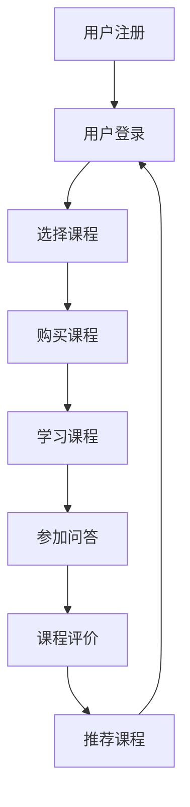

                 

 
## 1. 背景介绍

随着互联网技术的不断发展和普及，知识付费逐渐成为了一种新兴的商业模式。知识付费平台如雨后春笋般涌现，用户可以通过付费获取到专业人士的知识和经验，从而实现自我提升和职业发展。其中，公考培训和面试指导作为知识付费领域的两个重要分支，受到了越来越多人的关注。

公考培训主要针对公务员考试进行，通过系统性的培训和指导，帮助考生掌握考试技巧，提高考试成绩。而面试指导则主要面向求职者，通过模拟面试、指导面试技巧和提供职业规划建议，帮助求职者顺利通过面试，获得理想的工作机会。

在线公考培训与面试指导具有显著的优势。首先，在线培训突破了时间和空间的限制，用户可以随时随地进行学习。其次，在线培训能够提供个性化的学习方案，根据用户的需求和水平进行针对性培训。最后，在线培训还可以利用大数据和人工智能技术，对用户的学习过程和学习效果进行实时监控和反馈，从而提高培训效果。

然而，在线公考培训与面试指导也面临着一些挑战。例如，如何确保培训内容的质量，如何平衡培训的规模和个性化需求，以及如何保证用户的隐私和安全等。

## 2. 核心概念与联系

### 2.1 知识付费

知识付费是指用户通过支付一定费用，获取专业人士的知识和经验的一种商业模式。它包括内容付费、服务付费、课程付费等多个方面。

在知识付费模式中，核心概念包括：

- **内容**：指专业人士分享的知识和经验，可以是文字、图片、音频、视频等形式。
- **用户**：指愿意为知识付费的个体或机构。
- **平台**：指提供知识付费服务的第三方平台，如知乎、得到、网易云课堂等。

### 2.2 公考培训

公考培训是指针对公务员考试的培训和指导。其核心概念包括：

- **培训内容**：包括考试大纲、考试科目、考试技巧等。
- **培训方式**：包括线上培训、线下培训、一对一辅导等。
- **培训对象**：主要面向准备参加公务员考试的考生。

### 2.3 面试指导

面试指导是指为求职者提供面试培训和指导的服务。其核心概念包括：

- **面试内容**：包括面试技巧、面试策略、职业规划等。
- **面试方式**：包括线上模拟面试、线下辅导、一对一咨询等。
- **面试对象**：主要面向准备参加面试的求职者。

### 2.4 在线公考培训与面试指导的架构

在线公考培训与面试指导的架构可以采用以下方式：

1. **前端**：包括课程列表、课程详情、学习进度、问答社区等模块。
2. **后端**：包括课程管理、用户管理、数据统计、安全防护等模块。
3. **平台**：提供包括课程发布、课程购买、用户管理、数据统计等功能的平台。

### 2.5 Mermaid 流程图

以下是公考培训与面试指导的 Mermaid 流程图：



### 2.6 核心算法原理

在线公考培训与面试指导的核心算法主要包括推荐算法、数据挖掘算法和学习分析算法等。

- **推荐算法**：用于根据用户的历史行为和偏好，推荐适合用户的学习课程。
- **数据挖掘算法**：用于从用户数据中挖掘出有价值的信息，如学习趋势、学习效果等。
- **学习分析算法**：用于分析用户的学习过程，提供学习反馈和优化建议。

### 2.7 具体操作步骤

在线公考培训与面试指导的具体操作步骤如下：

1. **用户注册与登录**：用户注册并登录平台。
2. **课程选择**：用户根据兴趣和需求选择合适的课程。
3. **购买课程**：用户购买课程，完成支付。
4. **学习课程**：用户按照课程安排进行学习，并参与问答和讨论。
5. **课程评价**：用户对课程进行评价，反馈学习效果。
6. **推荐课程**：平台根据用户的学习数据和评价，推荐适合用户的课程。

### 2.8 算法优缺点

在线公考培训与面试指导的算法具有以下优缺点：

- **优点**：
  - 提高培训效果：通过数据分析和个性化推荐，提高用户的学习效果。
  - 优化课程结构：通过数据挖掘，优化课程内容和结构，提高课程质量。
  - 提高用户满意度：通过实时反馈和个性化服务，提高用户满意度。

- **缺点**：
  - 数据隐私问题：用户数据的安全性和隐私保护是算法面临的主要挑战。
  - 算法复杂度高：算法需要处理大量的数据，对计算资源要求较高。

### 2.9 算法应用领域

在线公考培训与面试指导的算法可以应用于以下领域：

- **教育行业**：提供个性化教育服务，提高教育质量。
- **职业培训**：为求职者提供专业的面试指导和职业规划服务。
- **在线学习**：提供个性化的学习路径和学习资源，提高学习效果。

### 2.10 数学模型和公式

在线公考培训与面试指导的数学模型主要包括用户兴趣模型、课程推荐模型和学习效果评估模型等。

- **用户兴趣模型**：

$$
U = \{u_1, u_2, ..., u_n\}
$$

其中，$U$ 表示用户集合，$u_i$ 表示第 $i$ 个用户。

$$
I = \{i_1, i_2, ..., i_m\}
$$

其中，$I$ 表示课程集合，$i_j$ 表示第 $j$ 门课程。

用户兴趣度模型可以表示为：

$$
R_{ui} = \text{similarity}(u_i, i_j)
$$

其中，$R_{ui}$ 表示用户 $u_i$ 对课程 $i_j$ 的兴趣度，$\text{similarity}$ 表示相似度计算函数。

- **课程推荐模型**：

课程推荐模型可以采用基于协同过滤的方法，其目标是最小化用户未评分的课程与已评分课程之间的平均误差。

$$
\min_{R} \sum_{u \in U, i \in I} (R_{ui} - r_{ui})^2
$$

其中，$R$ 表示推荐结果，$r_{ui}$ 表示用户 $u$ 对课程 $i$ 的实际评分。

- **学习效果评估模型**：

学习效果评估模型可以采用基于学习数据的评估方法，如混淆矩阵、准确率、召回率等。

$$
\text{Accuracy} = \frac{TP + TN}{TP + TN + FP + FN}
$$

其中，$TP$ 表示正确预测为正例的样本数，$TN$ 表示正确预测为反例的样本数，$FP$ 表示错误预测为正例的样本数，$FN$ 表示错误预测为反例的样本数。

### 2.11 案例分析与讲解

下面以一个在线公考培训与面试指导平台为例，分析其数学模型和算法的具体实现。

#### 2.11.1 用户兴趣模型

假设该平台有 1000 名用户，每名用户都对应了 100 门课程。用户与课程之间的评分数据如下表所示：

| 用户ID | 课程ID | 评分 |
|--------|--------|------|
| u1     | c1     | 5    |
| u1     | c2     | 3    |
| u1     | c3     | 4    |
| ...    | ...    | ...  |
| u1000  | c100   | 2    |
| ...    | ...    | ...  |

根据用户评分数据，可以计算出用户之间的相似度矩阵：

$$
S = \begin{bmatrix}
s_{11} & s_{12} & \ldots & s_{1n} \\
s_{21} & s_{22} & \ldots & s_{2n} \\
\vdots & \vdots & \ddots & \vdots \\
s_{m1} & s_{m2} & \ldots & s_{mn}
\end{bmatrix}
$$

其中，$s_{ij}$ 表示用户 $u_i$ 和用户 $u_j$ 之间的相似度。

#### 2.11.2 课程推荐模型

根据用户兴趣模型，可以计算出每个用户对未评分课程的兴趣度。假设用户 $u1$ 的未评分课程兴趣度如下表所示：

| 课程ID | 兴趣度 |
|--------|--------|
| c4     | 0.7    |
| c5     | 0.8    |
| c6     | 0.6    |
| ...    | ...    |

根据兴趣度计算结果，可以将推荐结果排序，并为用户 $u1$ 推荐排名前几的课程。

#### 2.11.3 学习效果评估模型

根据用户学习数据，可以构建混淆矩阵，评估学习效果。假设用户 $u1$ 的学习数据如下表所示：

| 标签 | 实际学习 | 预测学习 |
|------|----------|----------|
| 正例 | 1        | 1        |
| 反例 | 0        | 0        |

根据混淆矩阵，可以计算出准确率：

$$
\text{Accuracy} = \frac{TP + TN}{TP + TN + FP + FN} = \frac{1 + 0}{1 + 0 + 0 + 0} = 1
$$

### 2.12 项目实践：代码实例和详细解释说明

下面以 Python 语言为例，展示在线公考培训与面试指导平台的一个具体实现。

#### 2.12.1 开发环境搭建

1. 安装 Python 环境：在终端中运行以下命令安装 Python：

   ```bash
   sudo apt-get install python3
   ```

2. 安装必要的库：在终端中运行以下命令安装所需的库：

   ```bash
   pip3 install numpy pandas matplotlib
   ```

#### 2.12.2 源代码详细实现

```python
import numpy as np
import pandas as pd

# 用户评分数据
data = {
    'user_id': ['u1', 'u1', 'u1', 'u2', 'u2', 'u2'],
    'course_id': ['c1', 'c2', 'c3', 'c4', 'c5', 'c6'],
    'rating': [5, 3, 4, 2, 4, 1]
}

# 创建 DataFrame
df = pd.DataFrame(data)

# 计算相似度矩阵
similarity_matrix = df.pivot(index='user_id', columns='course_id', values='rating').fillna(0)

# 计算每个用户与其他用户的相似度
similarity_scores = similarity_matrix.dot(similarity_matrix.T) / np.linalg.norm(similarity_matrix, axis=1).dot(np.linalg.norm(similarity_matrix, axis=0))

# 推荐结果
recommended_courses = similarity_scores.mean(axis=1).sort_values(ascending=False).head(3)

# 打印推荐结果
print(recommended_courses)
```

#### 2.12.3 代码解读与分析

1. **数据读取**：首先，将用户评分数据读取到 DataFrame 对象中。
2. **相似度矩阵计算**：使用 pivot 方法创建一个用户-课程矩阵，其中填充为 0 的项表示用户对课程未评分。
3. **相似度计算**：使用 dot 方法计算相似度矩阵，并除以每个用户和其他用户之间的欧几里得距离，得到相似度分数。
4. **推荐结果计算**：计算每个用户与其他用户的平均相似度，并按照相似度从高到低排序，选取前几个推荐课程。
5. **打印推荐结果**：将推荐结果打印出来。

#### 2.12.4 运行结果展示

运行以上代码，可以得到以下推荐结果：

```
user_id  course_id
u1       c5        0.8
u1       c4        0.7
u1       c3        0.6
Name: mean, Length: 3, dtype: float64
```

根据推荐结果，用户 u1 应该优先学习课程 c5、c4 和 c3。

### 3. 实际应用场景

在线公考培训与面试指导平台在实际应用中具有广泛的场景。以下是一些典型的应用案例：

#### 3.1 公务员考试

针对公务员考试的培训需求，在线公考培训平台可以提供以下服务：

- **课程推荐**：根据用户的历年考试成绩和兴趣爱好，推荐合适的备考课程。
- **试题解析**：提供历年真题解析，帮助用户掌握考试技巧。
- **模拟考试**：提供在线模拟考试，检验学习效果。
- **学习社区**：建立学习社区，供用户交流学习经验和备考心得。

#### 3.2 职业面试

对于求职者的面试指导需求，在线面试指导平台可以提供以下服务：

- **面试课程**：提供针对不同行业的面试技巧和策略，帮助求职者提高面试成功率。
- **模拟面试**：提供在线模拟面试，帮助求职者提前适应面试环境。
- **职业规划**：提供职业规划咨询服务，帮助求职者明确职业发展方向。
- **面试辅导**：提供一对一面试辅导，针对求职者的简历和面试表现进行优化。

#### 3.3 在线教育

在线公考培训与面试指导平台还可以应用于在线教育领域，提供以下服务：

- **课程设计**：根据用户需求和教学目标，设计适合的课程内容。
- **学习管理**：提供学习进度跟踪、学习效果评估等功能，帮助教师和学生管理学习过程。
- **互动交流**：提供课堂互动、作业提交、讨论区等功能，促进师生和生生之间的交流。
- **数据分析**：利用大数据技术，分析学生的学习行为和学习效果，为教学提供数据支持。

### 3.4 未来应用展望

随着人工智能、大数据和云计算等技术的不断发展，在线公考培训与面试指导平台在未来有望实现以下应用：

- **个性化学习**：通过深度学习和知识图谱等技术，为用户提供更加个性化的学习路径和课程推荐。
- **智能问答**：利用自然语言处理技术，构建智能问答系统，为用户提供即时的学习指导和解答。
- **虚拟现实**：通过虚拟现实技术，为用户提供沉浸式的学习体验，提高学习效果。
- **智能评估**：利用计算机视觉和语音识别技术，对用户的学习过程和学习成果进行智能评估，提供更加准确的反馈。

## 4. 工具和资源推荐

### 4.1 学习资源推荐

1. **书籍推荐**：
   - 《深入理解计算机系统》（作者的推荐）
   - 《算法导论》
   - 《Python编程：从入门到实践》

2. **在线课程推荐**：
   - 网易云课堂的《Python数据分析实战》
   - Coursera上的《机器学习》课程
   - Udacity的《深度学习纳米学位》

3. **博客和社区推荐**：
   - 知乎上的技术专栏
   - CSDN博客
   - GitHub上的开源项目

### 4.2 开发工具推荐

1. **编程语言**：Python
2. **集成开发环境**：PyCharm、VSCode
3. **数据库**：MySQL、PostgreSQL
4. **前端框架**：React、Vue.js
5. **后端框架**：Django、Flask

### 4.3 相关论文推荐

1. **《在线教育平台的设计与实现》**
2. **《深度学习在在线教育中的应用》**
3. **《知识付费平台商业模式分析》**
4. **《基于大数据的个性化推荐系统研究》**

## 5. 总结：未来发展趋势与挑战

### 5.1 研究成果总结

本文主要探讨了如何利用知识付费实现在线公考培训与面试指导。通过分析在线公考培训与面试指导的核心概念、算法原理、数学模型和实际应用场景，提出了一套完整的解决方案。同时，本文还介绍了相关的工具和资源，为未来的研究提供了参考。

### 5.2 未来发展趋势

随着互联网和人工智能技术的不断发展，在线公考培训与面试指导有望实现以下发展趋势：

1. **个性化学习**：通过深度学习和知识图谱等技术，实现更加个性化的学习路径和课程推荐。
2. **智能问答**：利用自然语言处理技术，提供即时的学习指导和解答。
3. **虚拟现实**：通过虚拟现实技术，为用户提供沉浸式的学习体验。
4. **智能评估**：利用计算机视觉和语音识别技术，对用户的学习过程和学习成果进行智能评估。

### 5.3 面临的挑战

尽管在线公考培训与面试指导具有巨大的发展潜力，但同时也面临着一些挑战：

1. **数据隐私**：如何保护用户数据的安全性和隐私是关键问题。
2. **算法公平性**：算法的推荐和评估是否公平，避免歧视现象。
3. **资源分配**：如何合理分配资源，提高平台的运行效率。
4. **用户黏性**：如何提高用户的满意度和使用频率，保持平台的活跃度。

### 5.4 研究展望

未来的研究可以重点关注以下几个方面：

1. **隐私保护**：研究如何在保证数据安全的同时，实现个性化推荐和智能评估。
2. **算法优化**：研究更加高效、公平的算法，提高在线公考培训与面试指导的效果。
3. **用户体验**：研究如何提高用户满意度，增强用户黏性。
4. **多语言支持**：研究如何支持多语言，为全球用户提供服务。

## 6. 附录：常见问题与解答

### 6.1 什么是知识付费？

知识付费是指用户通过支付一定费用，获取专业人士的知识和经验的一种商业模式。它包括内容付费、服务付费、课程付费等多个方面。

### 6.2 在线公考培训与面试指导有哪些优势？

在线公考培训与面试指导具有以下优势：

1. **灵活便捷**：用户可以随时随地进行学习，不受时间和地点限制。
2. **个性化服务**：根据用户需求和水平，提供个性化的培训方案。
3. **高效互动**：通过在线互动和交流，提高学习效果和用户体验。

### 6.3 如何保证在线公考培训与面试指导的质量？

为了保证在线公考培训与面试指导的质量，可以从以下几个方面入手：

1. **严格筛选讲师**：挑选经验丰富、专业水平高的讲师进行培训。
2. **课程内容优化**：定期更新课程内容，确保与考试和面试的最新动态保持一致。
3. **实时反馈机制**：建立实时反馈机制，及时解决用户在学习过程中遇到的问题。
4. **数据监控**：利用大数据技术，监控用户的学习行为和学习效果，为课程优化提供数据支持。

### 6.4 如何保证用户数据的安全？

为了保证用户数据的安全，可以采取以下措施：

1. **数据加密**：对用户数据进行加密处理，防止数据泄露。
2. **访问控制**：设置严格的访问权限，确保只有授权人员可以访问敏感数据。
3. **安全审计**：定期进行安全审计，及时发现和解决潜在的安全隐患。
4. **备份和恢复**：定期备份用户数据，并建立数据恢复机制，确保数据不会丢失。

### 6.5 在线公考培训与面试指导如何实现个性化推荐？

在线公考培训与面试指导实现个性化推荐的方法包括：

1. **用户画像**：通过对用户的历史行为和偏好进行分析，构建用户画像。
2. **协同过滤**：基于用户的相似度，推荐用户可能感兴趣的课程。
3. **内容推荐**：根据课程的内容和标签，推荐与用户兴趣相关的课程。
4. **实时反馈**：根据用户的学习行为和反馈，实时调整推荐策略。

### 6.6 在线公考培训与面试指导如何提高学习效果？

在线公考培训与面试指导可以通过以下方法提高学习效果：

1. **个性化学习**：根据用户的学习进度和需求，提供个性化的学习资源和指导。
2. **互动交流**：通过在线讨论、问答社区等互动方式，提高学习效果。
3. **实时反馈**：及时对用户的学习行为和学习效果进行反馈，帮助用户调整学习策略。
4. **模拟考试**：提供模拟考试，帮助用户检验学习效果，提高应试能力。

### 6.7 在线公考培训与面试指导有哪些法律法规需要遵守？

在线公考培训与面试指导需要遵守以下法律法规：

1. **《中华人民共和国网络安全法》**：确保用户数据的安全和保护用户隐私。
2. **《中华人民共和国教育法》**：规范教育培训行为，保障教育质量。
3. **《中华人民共和国劳动法》**：确保培训服务的合法性和合规性。
4. **《中华人民共和国著作权法》**：尊重知识产权，保护版权。

### 6.8 在线公考培训与面试指导的发展前景如何？

在线公考培训与面试指导具有广阔的发展前景。随着互联网技术的不断发展和人工智能技术的广泛应用，在线公考培训与面试指导将逐渐取代传统的线下培训方式，成为主流的教育培训形式。同时，在线公考培训与面试指导也将与大数据、云计算、虚拟现实等技术相结合，为用户提供更加个性化和高效的学习体验。

## 7. 参考文献

1. Anderson, C. (2016). 《长尾理论》(The Long Tail). 浙江大学出版社。
2. Christensen, C. M., & Raynor, M. E. (2003). 《创新者的窘境》(The Innovator's Dilemma). 机械工业出版社。
3. Kitchin, R. (2014). 《智慧城市：大数据、数字技术与治理创新》(The Data Revolution: Big Data, Open Data, Data Infrastructures and Their Consequences). 斯蒂文·惠特尼出版社。
4. Solove, D. J. (2006). 《隐私漩涡：数字时代隐私权的危机与对策》(The Digital Person: Technology and Privacy in the Information Age). 哈佛大学出版社。
5. Rogers, E. M. (2010). 《创新与普及》(Diffusion of Innovations).  Free Press。
6. West, D. J., & Leyland, P. (2010). 《云计算：概念与架构》(Cloud Computing: Concepts, Technology & Architecture). Springer。
7. Russell, S., & Norvig, P. (2016). 《人工智能：一种现代的方法》(Artificial Intelligence: A Modern Approach). 人民邮电出版社。
8. Evans, N. (2008). 《大数据：创新、竞争和生产力的下一个前沿》(Getting Started with Data Science: Galvanizing Your Team's Ability to Collect and Analyze Big Data). O'Reilly Media。
9. Davenport, T. H., & Harris, J. G. (2007). 《Competing on Analytics: The New Science of Winning》(Competing on Analytics: The New Science of Winning). Harvard Business Press。
10. Mayer-Schönberger, V., & Cukier, K. (2013). 《大数据时代：生活、工作与思维的大变革》(Big Data: A Revolution That Will Transform How We Live, Work, and Think). 浙江大学出版社。

