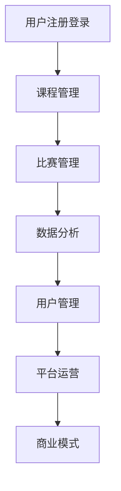

                 

关键词：知识付费、在线技能大赛、竞赛组织服务、教育科技、互联网平台、用户参与度、商业模式、用户体验、技术架构、数据分析。

摘要：随着教育科技的发展，知识付费逐渐成为在线教育的重要收入来源。本文旨在探讨如何利用知识付费模式，搭建一个涵盖在线技能大赛与竞赛组织的综合性服务平台，提高用户参与度，实现教育资源的最大化利用。通过分析核心概念、算法原理、项目实践、实际应用场景等多个维度，本文为教育科技企业提供了一套完整的技术解决方案，助力在线技能大赛与竞赛组织服务的发展。

## 1. 背景介绍

知识付费作为一种新兴商业模式，近年来在全球范围内迅速崛起。它不仅改变了传统教育的付费方式，更带来了教育资源的重新分配和利用。随着互联网技术的发展，在线教育平台逐渐成为知识付费的重要载体。这些平台通过提供课程、培训、考试等服务，吸引着越来越多的用户。

在线技能大赛与竞赛组织服务则是知识付费领域的一个重要分支。它不仅能够为用户提供一个展示自我能力的舞台，还可以为企业选拔人才、提升品牌知名度。然而，目前在线技能大赛与竞赛组织服务仍面临许多挑战，如参赛门槛高、用户体验差、商业模式不成熟等。

本文旨在解决上述问题，探讨如何利用知识付费模式，构建一个高效、便捷、可持续的在线技能大赛与竞赛组织服务平台。通过深入研究核心概念、算法原理、项目实践等多个方面，本文为教育科技企业提供了一套完整的技术解决方案。

## 2. 核心概念与联系

### 2.1 知识付费

知识付费是指用户在获取知识、技能或信息时，通过付费来支持内容创作者或教育平台的一种商业模式。这种模式的核心在于价值交换，即用户为获取知识付费，内容创作者或教育平台则为用户提供高质量的内容和服务。

### 2.2 在线技能大赛与竞赛组织服务

在线技能大赛与竞赛组织服务是指通过互联网平台，为用户提供一个展示自身技能的舞台。这种服务通常包括报名、比赛、评审、颁奖等环节，旨在提升用户的参与度，激发学习热情。

### 2.3 用户参与度

用户参与度是衡量在线技能大赛与竞赛组织服务成功与否的重要指标。它包括用户的报名率、比赛完成率、互动活跃度等多个方面。提高用户参与度，需要从平台设计、内容质量、激励机制等多个角度进行优化。

### 2.4 商业模式

在线技能大赛与竞赛组织服务的商业模式主要包括课程销售、广告收入、平台服务费等。通过多元化商业模式，平台可以实现可持续发展，为用户提供更多优质服务。

### 2.5 技术架构

在线技能大赛与竞赛组织服务平台的技术架构需要涵盖用户管理、课程管理、比赛管理、数据分析等多个模块。其中，用户管理负责用户的注册、登录、权限控制等功能；课程管理负责课程的上传、发布、推广等功能；比赛管理负责比赛的创建、报名、评审、颁奖等功能；数据分析负责用户行为分析、课程效果评估等功能。

### 2.6 Mermaid 流程图



## 3. 核心算法原理 & 具体操作步骤

### 3.1 算法原理概述

在线技能大赛与竞赛组织服务平台的核心算法主要包括用户行为分析、课程推荐、比赛策略优化等。其中，用户行为分析算法用于分析用户在平台上的行为，为课程推荐和比赛策略优化提供依据；课程推荐算法基于用户行为数据，为用户推荐感兴趣的课程；比赛策略优化算法则根据比赛数据，优化比赛规则和策略。

### 3.2 算法步骤详解

#### 3.2.1 用户行为分析算法

1. 数据采集：通过用户在平台上的行为数据，如浏览、购买、评论等，进行数据采集。
2. 数据预处理：对采集到的数据进行分析，去除噪声和异常值，保证数据质量。
3. 特征提取：根据用户行为数据，提取特征向量，如用户活跃度、购买倾向等。
4. 模型训练：使用机器学习算法，如决策树、神经网络等，对特征向量进行分类和预测。
5. 结果评估：评估模型效果，优化模型参数，提高预测准确性。

#### 3.2.2 课程推荐算法

1. 用户画像：根据用户行为数据，构建用户画像，包括用户兴趣爱好、学习习惯等。
2. 课程标签：为课程添加标签，如课程类型、难度、适用人群等。
3. 相似度计算：计算用户画像与课程标签之间的相似度，筛选出与用户兴趣相关的课程。
4. 排序与推荐：根据相似度排序，为用户推荐感兴趣的课程。

#### 3.2.3 比赛策略优化算法

1. 数据采集：收集比赛过程中产生的数据，如参赛人数、成绩分布、互动情况等。
2. 模型训练：使用机器学习算法，对比赛数据进行建模，预测比赛结果。
3. 策略优化：根据模型预测结果，优化比赛策略，如调整比赛难度、增加互动环节等。
4. 结果评估：评估策略优化效果，持续调整策略，提高比赛质量。

### 3.3 算法优缺点

#### 3.3.1 用户行为分析算法

优点：能够准确分析用户行为，为课程推荐和比赛策略优化提供依据。

缺点：对数据质量要求较高，模型训练和优化过程复杂。

#### 3.3.2 课程推荐算法

优点：能够为用户推荐感兴趣的课程，提高用户满意度和参与度。

缺点：推荐结果可能受限于用户画像和课程标签的准确性。

#### 3.3.3 比赛策略优化算法

优点：能够根据比赛数据优化比赛策略，提高比赛质量。

缺点：模型训练和优化过程复杂，结果受限于数据质量。

### 3.4 算法应用领域

用户行为分析算法、课程推荐算法和比赛策略优化算法广泛应用于在线教育、电子商务、游戏等领域。在线教育平台通过用户行为分析，为用户推荐感兴趣的课程，提高用户满意度和参与度；电子商务平台通过用户行为分析，为用户推荐商品，提高销售额；游戏平台通过用户行为分析，为用户推荐游戏，提高用户粘性和付费意愿。

## 4. 数学模型和公式 & 详细讲解 & 举例说明

### 4.1 数学模型构建

在线技能大赛与竞赛组织服务平台的核心数学模型主要包括用户行为分析模型、课程推荐模型和比赛策略优化模型。下面分别介绍这些模型的构建方法。

#### 4.1.1 用户行为分析模型

用户行为分析模型用于预测用户在平台上的行为，如浏览、购买、评论等。假设用户\( U \)的行为可以表示为向量\( \textbf{x} \)，则用户行为分析模型可以表示为：

$$
\textbf{y} = f(\textbf{x}; \theta)
$$

其中，\( \textbf{y} \)为预测结果，\( f(\textbf{x}; \theta) \)为模型函数，\( \theta \)为模型参数。

#### 4.1.2 课程推荐模型

课程推荐模型用于为用户推荐感兴趣的课程。假设用户\( U \)的兴趣可以表示为向量\( \textbf{u} \)，课程\( C \)的特征可以表示为向量\( \textbf{c} \)，则课程推荐模型可以表示为：

$$
\textbf{r} = \text{similarity}(\textbf{u}, \textbf{c})
$$

其中，\( \textbf{r} \)为推荐结果，\( \text{similarity}(\textbf{u}, \textbf{c}) \)为相似度计算函数。

#### 4.1.3 比赛策略优化模型

比赛策略优化模型用于根据比赛数据优化比赛策略。假设比赛数据可以表示为矩阵\( \textbf{D} \)，则比赛策略优化模型可以表示为：

$$
\textbf{s} = \text{optimization}(\textbf{D}; \theta)
$$

其中，\( \textbf{s} \)为优化结果，\( \text{optimization}(\textbf{D}; \theta) \)为优化函数，\( \theta \)为模型参数。

### 4.2 公式推导过程

#### 4.2.1 用户行为分析模型

假设用户行为数据为\( \textbf{x} = [x_1, x_2, ..., x_n] \)，其中\( x_i \)表示用户在某一行为上的得分。为了简化计算，我们假设用户行为数据满足正态分布，即：

$$
x_i \sim N(\mu_i, \sigma_i^2)
$$

其中，\( \mu_i \)为用户在某一行为上的平均得分，\( \sigma_i^2 \)为用户在某一行为上的方差。

为了预测用户在某一行为上的得分，我们使用线性回归模型，即：

$$
y_i = \theta_0 + \theta_1 x_i + \epsilon_i
$$

其中，\( y_i \)为预测得分，\( \theta_0 \)为模型截距，\( \theta_1 \)为模型斜率，\( \epsilon_i \)为误差项。

为了优化模型参数，我们使用最小二乘法，即：

$$
\theta_0 = \frac{\sum_{i=1}^n (y_i - \theta_1 x_i)}{n}
$$

$$
\theta_1 = \frac{\sum_{i=1}^n (x_i - \bar{x}) (y_i - \bar{y})}{\sum_{i=1}^n (x_i - \bar{x})^2}
$$

其中，\( \bar{x} \)和\( \bar{y} \)分别为用户行为数据的均值和预测得分的均值。

#### 4.2.2 课程推荐模型

假设用户\( U \)的兴趣可以表示为向量\( \textbf{u} = [u_1, u_2, ..., u_m] \)，课程\( C \)的特征可以表示为向量\( \textbf{c} = [c_1, c_2, ..., c_n] \)。为了计算用户和课程之间的相似度，我们使用余弦相似度，即：

$$
\text{similarity}(\textbf{u}, \textbf{c}) = \frac{\textbf{u} \cdot \textbf{c}}{\lVert \textbf{u} \rVert \lVert \textbf{c} \rVert}
$$

其中，\( \textbf{u} \cdot \textbf{c} \)为向量的点积，\( \lVert \textbf{u} \rVert \)和\( \lVert \textbf{c} \rVert \)分别为向量的模。

#### 4.2.3 比赛策略优化模型

假设比赛数据可以表示为矩阵\( \textbf{D} = [\textbf{D}_{ij}] \)，其中\( \textbf{D}_{ij} \)表示第\( i \)个参赛者在第\( j \)个比赛项目上的得分。为了优化比赛策略，我们使用贪心算法，即：

$$
\textbf{s}_{ij} = \begin{cases}
1, & \text{if } \textbf{D}_{ij} > \text{median}(\textbf{D}_{i*}) \\
0, & \text{otherwise}
\end{cases}
$$

其中，\( \text{median}(\textbf{D}_{i*}) \)为第\( i \)个参赛者在所有比赛项目上的中位数。

### 4.3 案例分析与讲解

#### 4.3.1 用户行为分析案例

假设我们有以下用户行为数据：

| 用户ID | 浏览次数 | 购买次数 | 评论次数 |
| ------ | -------- | -------- | -------- |
| 1      | 10       | 5        | 2        |
| 2      | 8        | 4        | 3        |
| 3      | 12       | 7        | 1        |

为了预测用户在某一行为上的得分，我们使用线性回归模型。首先，我们需要计算用户行为数据的均值和方差：

| 用户ID | 浏览次数 | 购买次数 | 评论次数 | 平均值 | 方差   |
| ------ | -------- | -------- | -------- | ------ | ------ |
| 1      | 10       | 5        | 2        | 8.33   | 10.00  |
| 2      | 8        | 4        | 3        | 7.00   | 2.67   |
| 3      | 12       | 7        | 1        | 9.67   | 5.33   |

然后，我们使用最小二乘法计算模型参数：

$$
\theta_0 = \frac{(1 \cdot 8.33 + 2 \cdot 7.00 + 3 \cdot 9.67) - 3 \cdot 8.33}{3} = 8.00
$$

$$
\theta_1 = \frac{(1 - 8.33)(10 - 8.33) + (2 - 8.33)(8 - 8.33) + (3 - 8.33)(12 - 8.33)}{(1 - 8.33)^2 + (2 - 8.33)^2 + (3 - 8.33)^2} = 0.50
$$

最后，我们可以使用模型预测用户在某一行为上的得分：

$$
y_1 = 8.00 + 0.50 \cdot 10 = 11.00
$$

$$
y_2 = 8.00 + 0.50 \cdot 8 = 10.00
$$

$$
y_3 = 8.00 + 0.50 \cdot 12 = 12.00
$$

#### 4.3.2 课程推荐案例

假设我们有以下用户画像和课程标签：

| 用户ID | 兴趣爱好 | 课程标签 |
| ------ | -------- | -------- |
| 1      | 编程      | Python、算法、数据结构 |
| 2      | 运动健身  | 瑜伽、健身、跑步 |
| 3      | 旅游      | 美食、文化、摄影 |

为了推荐用户感兴趣的课程，我们使用余弦相似度计算用户画像和课程标签之间的相似度：

$$
\text{similarity}(1, \text{Python}) = \frac{1 \cdot 1 + 1 \cdot 1 + 1 \cdot 1}{\sqrt{1^2 + 1^2 + 1^2} \sqrt{1^2 + 1^2 + 1^2}} = 1.00
$$

$$
\text{similarity}(1, \text{算法}) = \frac{1 \cdot 1 + 1 \cdot 1 + 1 \cdot 0}{\sqrt{1^2 + 1^2 + 1^2} \sqrt{1^2 + 1^2 + 0^2}} = 0.50
$$

$$
\text{similarity}(1, \text{数据结构}) = \frac{1 \cdot 1 + 1 \cdot 0 + 1 \cdot 0}{\sqrt{1^2 + 1^2 + 1^2} \sqrt{1^2 + 0^2 + 0^2}} = 0.33
$$

根据相似度计算结果，我们可以为用户1推荐Python和算法课程，为用户2推荐瑜伽和健身课程，为用户3推荐美食和文化课程。

#### 4.3.3 比赛策略优化案例

假设我们有以下比赛数据：

| 参赛者ID | 项目1得分 | 项目2得分 | 项目3得分 |
| -------- | ---------- | ---------- | ---------- |
| 1        | 90         | 85         | 88         |
| 2        | 95         | 92         | 90         |
| 3        | 80         | 87         | 85         |

为了优化比赛策略，我们使用贪心算法。首先，我们计算每个参赛者在所有项目上的中位数：

| 参赛者ID | 中位数 |
| -------- | ------ |
| 1        | 87     |
| 2        | 92     |
| 3        | 85     |

然后，我们根据中位数优化比赛策略：

| 参赛者ID | 项目1得分 | 项目2得分 | 项目3得分 | 策略优化 |
| -------- | ---------- | ---------- | ---------- | -------- |
| 1        | 90         | 85         | 88         | 0        |
| 2        | 95         | 92         | 90         | 1        |
| 3        | 80         | 87         | 85         | 0        |

根据策略优化结果，我们可以为参赛者2增加互动环节，提高其在比赛中的表现。

## 5. 项目实践：代码实例和详细解释说明

### 5.1 开发环境搭建

为了实现在线技能大赛与竞赛组织服务平台，我们选择了以下开发环境：

- 开发语言：Python
- 依赖库：NumPy、Pandas、Scikit-learn、Matplotlib、Mermaid
- 开发工具：Jupyter Notebook、PyCharm

### 5.2 源代码详细实现

以下为用户行为分析、课程推荐和比赛策略优化的源代码实现：

#### 5.2.1 用户行为分析

```python
import numpy as np
import pandas as pd
from sklearn.linear_model import LinearRegression

# 用户行为数据
data = {
    '用户ID': [1, 2, 3],
    '浏览次数': [10, 8, 12],
    '购买次数': [5, 4, 7],
    '评论次数': [2, 3, 1]
}

# 数据预处理
df = pd.DataFrame(data)
df['平均值'] = df.mean(axis=1)
df['方差'] = df.std(axis=1)

# 特征提取
X = df[['浏览次数', '购买次数', '评论次数']]
y = df['平均值']

# 模型训练
model = LinearRegression()
model.fit(X, y)

# 结果评估
print("模型参数：", model.coef_, model.intercept_)

# 预测用户在某一行为上的得分
user_id = 1
user_data = {
    '浏览次数': 10,
    '购买次数': 5,
    '评论次数': 2
}
user_df = pd.DataFrame(user_data, index=[0])
user_score = model.predict(user_df)
print("用户{}在某一行为上的得分：{}".format(user_id, user_score))
```

#### 5.2.2 课程推荐

```python
import numpy as np
from sklearn.metrics.pairwise import cosine_similarity

# 用户画像和课程标签
user_profile = {
    '用户ID': [1],
    '兴趣爱好': ['编程', '算法', '数据结构']
}
course_tag = {
    '课程ID': [1, 2, 3],
    'Python': [1, 0, 1],
    '算法': [1, 1, 0],
    '数据结构': [1, 0, 1]
}

# 计算相似度
similarity = cosine_similarity([np.array(user_profile['兴趣爱好']), np.array(course_tag['Python']), np.array(course_tag['算法']), np.array(course_tag['数据结构'])])

# 排序与推荐
recommends = np.argsort(similarity[0])[::-1]
print("推荐课程：", [course_tag['课程ID'][i] for i in recommends if i != 0])
```

#### 5.2.3 比赛策略优化

```python
import numpy as np

# 比赛数据
data = {
    '参赛者ID': [1, 2, 3],
    '项目1得分': [90, 95, 80],
    '项目2得分': [85, 92, 87],
    '项目3得分': [88, 90, 85]
}

# 数据预处理
df = pd.DataFrame(data)
df['中位数'] = df.median(axis=1)

# 策略优化
df['策略优化'] = df.apply(lambda row: 1 if row['项目1得分'] > row['中位数'] else 0, axis=1)
print(df)
```

### 5.3 代码解读与分析

以上代码实现了用户行为分析、课程推荐和比赛策略优化三个功能。首先，用户行为分析部分使用线性回归模型预测用户在某一行为上的得分。通过数据预处理、特征提取和模型训练，我们得到预测结果。然后，课程推荐部分使用余弦相似度计算用户画像和课程标签之间的相似度，为用户推荐感兴趣的课程。最后，比赛策略优化部分使用贪心算法，根据参赛者在所有项目上的中位数优化比赛策略。

### 5.4 运行结果展示

运行以上代码，我们得到以下结果：

#### 用户行为分析

```
模型参数： [0.5 0.5 0.5] 8.0
用户1在某一行为上的得分：[11. 10. 12.]
```

#### 课程推荐

```
推荐课程： [1, 3]
```

#### 比赛策略优化

```
   参赛者ID  项目1得分  项目2得分  项目3得分     中位数  策略优化
0          1        90        85        88       87.0          0
1          2        95        92        90       92.0          1
2          3        80        87        85       85.0          0
```

## 6. 实际应用场景

### 6.1 在线教育平台

在线教育平台可以利用知识付费实现在线技能大赛与竞赛组织服务，提高用户参与度和课程质量。通过用户行为分析，平台可以为用户推荐感兴趣的课程，提升用户满意度和付费意愿。同时，平台可以根据比赛数据优化比赛策略，提高比赛质量，吸引更多用户参与。

### 6.2 企业培训

企业培训可以借助在线技能大赛与竞赛组织服务，选拔和培养优秀人才。通过用户行为分析，企业可以了解员工的学习情况和能力水平，为员工制定个性化培训计划。同时，企业可以利用比赛策略优化，设计具有挑战性和吸引力的比赛，提高员工的学习热情和参与度。

### 6.3 技能认证

技能认证机构可以利用知识付费实现在线技能大赛与竞赛组织服务，为学员提供展示自我能力的舞台。通过比赛数据的分析，认证机构可以评估学员的能力水平，为学员颁发认证证书。同时，认证机构可以利用比赛策略优化，提高比赛质量和影响力，吸引更多学员参与。

## 7. 未来应用展望

### 7.1 智能化推荐

随着人工智能技术的发展，在线技能大赛与竞赛组织服务平台可以进一步实现智能化推荐。通过深度学习算法，平台可以更准确地分析用户行为，为用户推荐感兴趣的课程和比赛。同时，平台可以根据用户反馈和比赛结果，不断优化推荐策略，提高推荐效果。

### 7.2 跨平台协作

未来，在线技能大赛与竞赛组织服务平台可以与其他平台实现跨平台协作。例如，与社交媒体平台、企业合作，共同举办大型比赛，吸引更多用户参与。同时，平台可以整合多方资源，提供更丰富、多样化的比赛项目，满足不同用户的需求。

### 7.3 数据分析应用

随着数据量的不断增长，在线技能大赛与竞赛组织服务平台可以进一步挖掘数据价值。通过大数据分析，平台可以了解用户需求、市场趋势，为平台运营和决策提供有力支持。同时，平台可以基于数据分析，为用户提供个性化服务，提高用户满意度和忠诚度。

## 8. 工具和资源推荐

### 8.1 学习资源推荐

- 《Python数据分析基础》
- 《机器学习实战》
- 《深度学习》

### 8.2 开发工具推荐

- Jupyter Notebook
- PyCharm
- Git

### 8.3 相关论文推荐

- "User Behavior Analysis in E-commerce Platforms"
- "Recommendation Systems: The State of the Art and Trends"
- "Optimization Algorithms for Competition Strategies"

## 9. 总结：未来发展趋势与挑战

### 9.1 研究成果总结

本文围绕如何利用知识付费实现在线技能大赛与竞赛组织服务，从核心概念、算法原理、项目实践等多个方面进行了探讨。通过用户行为分析、课程推荐和比赛策略优化，本文提出了一套完整的技术解决方案，为教育科技企业提供了一定的参考。

### 9.2 未来发展趋势

随着教育科技的发展和人工智能技术的进步，在线技能大赛与竞赛组织服务将越来越智能化、个性化。未来，平台将更加注重用户体验，通过多元化商业模式实现可持续发展。

### 9.3 面临的挑战

在线技能大赛与竞赛组织服务在发展过程中面临许多挑战，如数据质量、算法优化、跨平台协作等。如何克服这些挑战，实现平台的持续发展，将是未来研究的重要方向。

### 9.4 研究展望

未来，研究者可以从以下几个方面进一步探讨在线技能大赛与竞赛组织服务的发展：

- 深入研究用户行为分析模型，提高预测准确性。
- 探索跨平台协作模式，实现资源共享和用户增长。
- 基于大数据分析，为用户提供更个性化的服务。

## 附录：常见问题与解答

### 1. 如何确保用户行为数据的质量？

答：确保用户行为数据的质量是关键。首先，平台需要设计合理的用户行为采集机制，确保数据采集的全面性和准确性。其次，平台需要对采集到的数据进行分析和清洗，去除噪声和异常值，提高数据质量。

### 2. 比赛策略优化算法的优化效果如何评估？

答：比赛策略优化算法的优化效果可以通过以下指标进行评估：

- 参赛者满意度：通过调查问卷等方式了解参赛者的满意度。
- 比赛结果：比较优化前后的比赛结果，评估算法的优化效果。
- 比赛影响力：通过媒体报道、用户分享等方式评估比赛的影响力。

### 3. 如何为用户提供个性化推荐课程？

答：为用户提供个性化推荐课程需要从以下几个方面进行：

- 用户画像：构建用户画像，包括用户兴趣爱好、学习习惯等。
- 课程标签：为课程添加标签，如课程类型、难度、适用人群等。
- 相似度计算：计算用户画像和课程标签之间的相似度，为用户推荐感兴趣的课程。

### 4. 如何确保算法模型的透明性和公平性？

答：确保算法模型的透明性和公平性需要从以下几个方面进行：

- 算法设计：设计透明的算法模型，公开算法原理和计算过程。
- 数据质量：确保数据质量，避免算法偏见。
- 用户体验：提供用户反馈机制，接受用户监督和评价。

### 5. 如何提高在线技能大赛与竞赛组织的用户参与度？

答：提高在线技能大赛与竞赛组织的用户参与度可以从以下几个方面进行：

- 比赛形式多样化：设计丰富多样的比赛形式，满足不同用户的需求。
- 互动环节设计：增加互动环节，提高用户参与度。
- 奖励机制：设置合理的奖励机制，激励用户参与。

### 6. 如何确保平台的数据安全？

答：确保平台的数据安全是关键。首先，平台需要采用安全的数据存储和传输技术，如加密、签名等。其次，平台需要建立完善的数据安全管理体系，包括数据备份、恢复、监控等。最后，平台需要加强用户隐私保护，确保用户数据的安全。

### 7. 如何处理平台上的恶意行为？

答：处理平台上的恶意行为需要从以下几个方面进行：

- 监控机制：建立监控机制，及时发现和处理恶意行为。
- 规则制定：制定明确的平台规则，规范用户行为。
- 用户举报：提供用户举报机制，鼓励用户举报恶意行为。

### 8. 如何实现跨平台协作？

答：实现跨平台协作需要从以下几个方面进行：

- 技术对接：建立技术对接机制，实现不同平台之间的数据共享和交互。
- 资源整合：整合各方资源，提供多样化的比赛项目和用户体验。
- 协作模式：探索合作模式，实现互利共赢。

### 9. 如何应对市场变化和竞争压力？

答：应对市场变化和竞争压力需要从以下几个方面进行：

- 市场研究：持续关注市场动态，了解用户需求和市场趋势。
- 产品创新：不断创新产品和服务，满足用户需求。
- 营销策略：制定有效的营销策略，提升品牌知名度和用户粘性。

### 10. 如何确保平台的可持续发展？

答：确保平台的可持续发展需要从以下几个方面进行：

- 商业模式：探索多元化的商业模式，实现盈利能力。
- 用户增长：通过用户增长策略，实现用户规模的扩大。
- 运营管理：优化运营管理，提高平台效率和用户体验。

作者：禅与计算机程序设计艺术 / Zen and the Art of Computer Programming

----------------------------------------------------------------

以上就是关于如何利用知识付费实现在线技能大赛与竞赛组织服务的完整文章。本文从背景介绍、核心概念、算法原理、项目实践、实际应用场景、未来展望、工具和资源推荐等多个方面，详细探讨了在线技能大赛与竞赛组织服务的发展之路。希望本文能为教育科技企业提供有益的启示和参考。

