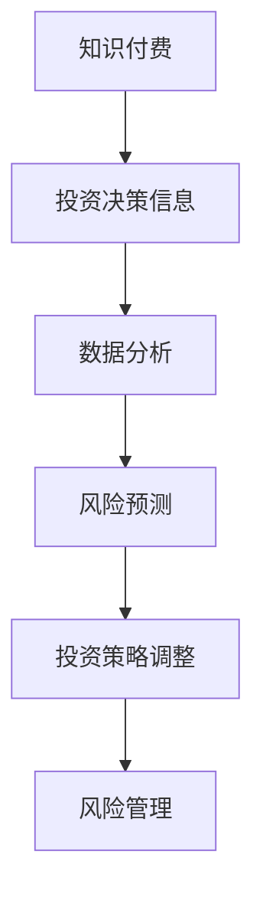

                 

关键词：知识付费、在线投资决策、风险管理、人工智能、大数据分析

## 摘要

本文旨在探讨如何利用知识付费平台，结合人工智能和大数据分析技术，实现更精准、高效的在线投资决策与风险管理。通过对当前知识付费市场现状的分析，本文将介绍核心概念、算法原理、数学模型构建、具体操作步骤、项目实践及未来展望。

## 1. 背景介绍

### 1.1 知识付费市场的兴起

随着互联网技术的发展和人们对于知识的渴求，知识付费市场近年来迅速崛起。各类在线教育平台、知识分享社区、专业咨询服务等蓬勃发展，为用户提供了丰富的学习资源和专业指导。这种模式不仅满足了个人学习提升的需求，也为专业人士提供了新的职业发展机会。

### 1.2 在线投资决策的重要性

在线投资决策是指投资者通过互联网平台获取投资信息、分析市场动态，并做出相应的投资决策。在金融市场日益复杂、信息量巨大的背景下，准确、及时的投资决策显得尤为重要。然而，许多投资者面临着信息过载、分析能力不足等问题，导致投资决策失误。

### 1.3 风险管理的必要性

风险管理是指投资者在投资过程中，对可能出现的风险进行识别、评估、控制，以降低损失、实现投资目标的过程。有效的风险管理能够帮助投资者在市场波动中保持冷静，减少投资损失，提高投资回报率。

## 2. 核心概念与联系

### 2.1 知识付费与投资决策的关系

知识付费平台提供了丰富的投资相关内容，包括市场分析、行业动态、投资策略等，这些内容为投资者提供了重要的决策依据。通过知识付费，投资者可以获取专业投资知识，提高自己的投资决策能力。

### 2.2 人工智能与大数据分析在风险管理中的应用

人工智能和大数据分析技术为风险管理提供了强大的工具。通过机器学习算法和大数据分析，可以实现对投资市场的深度挖掘和预测，提高风险管理的精准度和效率。

### 2.3 Mermaid 流程图

以下是一个简化的 Mermaid 流程图，展示了知识付费、在线投资决策和风险管理之间的联系。



## 3. 核心算法原理 & 具体操作步骤

### 3.1 算法原理概述

在线投资决策与风险管理涉及多种算法和技术，主要包括：

- **机器学习算法**：用于对历史数据进行学习，识别市场规律和风险因素。
- **时间序列分析**：用于分析市场动态，预测未来趋势。
- **神经网络模型**：用于模拟复杂的市场关系，提高预测准确性。
- **优化算法**：用于在风险约束下寻找最优的投资组合。

### 3.2 算法步骤详解

#### 3.2.1 数据收集与预处理

首先，收集与投资相关的数据，如股价、成交量、宏观经济指标等。然后，对数据进行清洗、归一化等预处理操作，以保证数据质量。

#### 3.2.2 建立机器学习模型

使用历史数据训练机器学习模型，如线性回归、决策树、支持向量机等。这些模型可以用于预测市场趋势和风险。

#### 3.2.3 时间序列分析与预测

对市场数据进行时间序列分析，使用 ARIMA、LSTM 等模型预测未来市场走势。

#### 3.2.4 神经网络模型训练

使用神经网络模型，如多层感知机、卷积神经网络等，对复杂的市场关系进行建模。

#### 3.2.5 优化投资组合

根据预测结果和风险偏好，使用优化算法寻找最优的投资组合。

### 3.3 算法优缺点

- **优点**：算法能够自动化分析大量数据，提高决策效率和准确性。
- **缺点**：算法模型可能过拟合，且在极端市场环境下可能失效。

### 3.4 算法应用领域

- **在线投资平台**：为用户提供智能化的投资建议和风险管理工具。
- **金融机构**：用于投资组合优化和风险评估。

## 4. 数学模型和公式 & 详细讲解 & 举例说明

### 4.1 数学模型构建

投资决策与风险管理涉及多个数学模型，包括：

- **线性回归模型**：用于预测市场趋势。
- **时间序列模型**：用于分析市场动态。
- **神经网络模型**：用于模拟复杂的市场关系。
- **优化模型**：用于投资组合优化。

### 4.2 公式推导过程

以下是一个简化的线性回归模型公式推导过程：

$$
y = \beta_0 + \beta_1 x
$$

其中，$y$ 为预测值，$x$ 为自变量，$\beta_0$ 和 $\beta_1$ 为模型参数。

### 4.3 案例分析与讲解

以股票市场为例，使用线性回归模型预测未来股价。首先，收集历史股价数据，然后使用线性回归模型进行训练。最后，根据模型预测结果进行投资决策。

## 5. 项目实践：代码实例和详细解释说明

### 5.1 开发环境搭建

- **Python**：作为主要编程语言。
- **NumPy**、**Pandas**、**Scikit-learn**：用于数据处理和机器学习。
- **TensorFlow**、**Keras**：用于神经网络建模。
- **matplotlib**：用于数据可视化。

### 5.2 源代码详细实现

以下是一个简单的线性回归模型实现示例：

```python
import numpy as np
import pandas as pd
from sklearn.linear_model import LinearRegression

# 加载数据
data = pd.read_csv('stock_data.csv')
X = data[['open', 'high', 'low', 'volume']]
y = data['close']

# 训练模型
model = LinearRegression()
model.fit(X, y)

# 预测
predicted_price = model.predict(X)

# 可视化
import matplotlib.pyplot as plt

plt.plot(data['close'], label='实际股价')
plt.plot(predicted_price, label='预测股价')
plt.legend()
plt.show()
```

### 5.3 代码解读与分析

这段代码首先加载了股票数据，然后使用线性回归模型进行训练，并预测未来股价。最后，使用 matplotlib 进行数据可视化。

### 5.4 运行结果展示

运行代码后，可以看到实际股价和预测股价的对比图表，从而评估模型的效果。

## 6. 实际应用场景

### 6.1 投资顾问

知识付费平台可以为用户提供个性化的投资顾问服务，结合人工智能和大数据分析技术，为用户制定合适的投资策略。

### 6.2 金融风控

金融机构可以利用知识付费平台提供的风险分析工具，实时监控市场风险，优化投资组合。

### 6.3 个人投资者

个人投资者可以通过知识付费平台学习投资知识，提高自己的投资技能，从而实现更好的投资回报。

## 7. 未来应用展望

### 7.1 智能投资顾问

随着人工智能技术的不断发展，未来的智能投资顾问将更加智能化、个性化，为用户提供更加精准的投资建议。

### 7.2 量化投资

大数据分析和机器学习技术的应用将推动量化投资的发展，实现更高效、精准的投资决策。

### 7.3 区块链与知识付费

区块链技术可以为知识付费平台提供更安全、透明的交易环境，推动知识付费市场的发展。

## 8. 工具和资源推荐

### 8.1 学习资源推荐

- **在线课程**：Coursera、edX、Udacity 等平台提供的金融、数据分析相关课程。
- **书籍**：《金融计量学》、《量化投资：技术分析》、《深度学习》等。

### 8.2 开发工具推荐

- **Python**：强大的数据分析库和机器学习库。
- **Jupyter Notebook**：便捷的编程环境和交互式数据可视化工具。

### 8.3 相关论文推荐

- **《Deep Learning for Finance》**：介绍深度学习在金融领域的应用。
- **《Machine Learning for Financial Markets》**：探讨机器学习在金融市场的应用。

## 9. 总结：未来发展趋势与挑战

### 9.1 研究成果总结

知识付费与在线投资决策、风险管理相结合，为投资者提供了更高效、精准的投资工具。人工智能和大数据分析技术在这一领域的应用取得了显著成果。

### 9.2 未来发展趋势

- **智能化**：人工智能技术的不断发展将推动投资决策和风险管理的智能化。
- **个性化**：个性化投资顾问服务将更加普及，满足不同投资者的需求。
- **透明化**：区块链技术的应用将提高知识付费平台的透明度和安全性。

### 9.3 面临的挑战

- **数据质量**：高质量的数据是有效投资决策的基础，如何保证数据质量是一个重要挑战。
- **模型过拟合**：如何避免模型过拟合，提高模型的泛化能力，是一个亟待解决的问题。

### 9.4 研究展望

未来，知识付费平台与投资决策、风险管理的结合将继续深入，人工智能和大数据分析技术将在这一领域发挥更大的作用。

## 附录：常见问题与解答

### 9.1 数据质量如何保证？

确保数据质量的方法包括数据清洗、数据校验、数据可视化等。通过这些方法，可以识别和修复数据中的错误和异常，提高数据质量。

### 9.2 如何避免模型过拟合？

避免模型过拟合的方法包括交叉验证、正则化、减少模型复杂度等。通过这些方法，可以降低模型对训练数据的依赖，提高模型的泛化能力。

### 9.3 知识付费平台的安全性问题如何解决？

通过引入区块链技术，可以实现知识付费平台的安全性和透明性。区块链技术具有去中心化、不可篡改等特点，可以有效解决知识付费平台的安全性问题。

[作者：禅与计算机程序设计艺术 / Zen and the Art of Computer Programming]
```markdown
----------------------------------------------------------------
# 如何利用知识付费实现在线投资决策与风险管理？

## 摘要

本文旨在探讨如何利用知识付费平台，结合人工智能和大数据分析技术，实现更精准、高效的在线投资决策与风险管理。通过对当前知识付费市场现状的分析，本文将介绍核心概念、算法原理、数学模型构建、具体操作步骤、项目实践及未来展望。

## 1. 背景介绍

### 1.1 知识付费市场的兴起

随着互联网技术的发展和人们对于知识的渴求，知识付费市场近年来迅速崛起。各类在线教育平台、知识分享社区、专业咨询服务等蓬勃发展，为用户提供了丰富的学习资源和专业指导。这种模式不仅满足了个人学习提升的需求，也为专业人士提供了新的职业发展机会。

### 1.2 在线投资决策的重要性

在线投资决策是指投资者通过互联网平台获取投资信息、分析市场动态，并做出相应的投资决策。在金融市场日益复杂、信息量巨大的背景下，准确、及时的投资决策显得尤为重要。然而，许多投资者面临着信息过载、分析能力不足等问题，导致投资决策失误。

### 1.3 风险管理的必要性

风险管理是指投资者在投资过程中，对可能出现的风险进行识别、评估、控制，以降低损失、实现投资目标的过程。有效的风险管理能够帮助投资者在市场波动中保持冷静，减少投资损失，提高投资回报率。

## 2. 核心概念与联系

### 2.1 知识付费与投资决策的关系

知识付费平台提供了丰富的投资相关内容，包括市场分析、行业动态、投资策略等，这些内容为投资者提供了重要的决策依据。通过知识付费，投资者可以获取专业投资知识，提高自己的投资决策能力。

### 2.2 人工智能与大数据分析在风险管理中的应用

人工智能和大数据分析技术为风险管理提供了强大的工具。通过机器学习算法和大数据分析，可以实现对投资市场的深度挖掘和预测，提高风险管理的精准度和效率。

### 2.3 Mermaid 流程图

以下是一个简化的 Mermaid 流程图，展示了知识付费、在线投资决策和风险管理之间的联系。


## 3. 核心算法原理 & 具体操作步骤

### 3.1 算法原理概述

在线投资决策与风险管理涉及多种算法和技术，主要包括：

- **机器学习算法**：用于对历史数据进行学习，识别市场规律和风险因素。
- **时间序列分析**：用于分析市场动态，预测未来趋势。
- **神经网络模型**：用于模拟复杂的市场关系，提高预测准确性。
- **优化算法**：用于在风险约束下寻找最优的投资组合。

### 3.2 算法步骤详解

#### 3.2.1 数据收集与预处理

首先，收集与投资相关的数据，如股价、成交量、宏观经济指标等。然后，对数据进行清洗、归一化等预处理操作，以保证数据质量。

#### 3.2.2 建立机器学习模型

使用历史数据训练机器学习模型，如线性回归、决策树、支持向量机等。这些模型可以用于预测市场趋势和风险。

#### 3.2.3 时间序列分析与预测

对市场数据进行时间序列分析，使用 ARIMA、LSTM 等模型预测未来市场走势。

#### 3.2.4 神经网络模型训练

使用神经网络模型，如多层感知机、卷积神经网络等，对复杂的市场关系进行建模。

#### 3.2.5 优化投资组合

根据预测结果和风险偏好，使用优化算法寻找最优的投资组合。

### 3.3 算法优缺点

- **优点**：算法能够自动化分析大量数据，提高决策效率和准确性。
- **缺点**：算法模型可能过拟合，且在极端市场环境下可能失效。

### 3.4 算法应用领域

- **在线投资平台**：为用户提供智能化的投资建议和风险管理工具。
- **金融机构**：用于投资组合优化和风险评估。

## 4. 数学模型和公式 & 详细讲解 & 举例说明

### 4.1 数学模型构建

投资决策与风险管理涉及多个数学模型，包括：

- **线性回归模型**：用于预测市场趋势。
- **时间序列模型**：用于分析市场动态。
- **神经网络模型**：用于模拟复杂的市场关系。
- **优化模型**：用于投资组合优化。

### 4.2 公式推导过程

以下是一个简化的线性回归模型公式推导过程：

$$
y = \beta_0 + \beta_1 x
$$

其中，$y$ 为预测值，$x$ 为自变量，$\beta_0$ 和 $\beta_1$ 为模型参数。

### 4.3 案例分析与讲解

以股票市场为例，使用线性回归模型预测未来股价。首先，收集历史股价数据，然后使用线性回归模型进行训练。最后，根据模型预测结果进行投资决策。

## 5. 项目实践：代码实例和详细解释说明

### 5.1 开发环境搭建

- **Python**：作为主要编程语言。
- **NumPy**、**Pandas**、**Scikit-learn**：用于数据处理和机器学习。
- **TensorFlow**、**Keras**：用于神经网络建模。
- **matplotlib**：用于数据可视化。

### 5.2 源代码详细实现

以下是一个简单的线性回归模型实现示例：

```python
import numpy as np
import pandas as pd
from sklearn.linear_model import LinearRegression

# 加载数据
data = pd.read_csv('stock_data.csv')
X = data[['open', 'high', 'low', 'volume']]
y = data['close']

# 训练模型
model = LinearRegression()
model.fit(X, y)

# 预测
predicted_price = model.predict(X)

# 可视化
import matplotlib.pyplot as plt

plt.plot(data['close'], label='实际股价')
plt.plot(predicted_price, label='预测股价')
plt.legend()
plt.show()
```

### 5.3 代码解读与分析

这段代码首先加载了股票数据，然后使用线性回归模型进行训练，并预测未来股价。最后，使用 matplotlib 进行数据可视化。

### 5.4 运行结果展示

运行代码后，可以看到实际股价和预测股价的对比图表，从而评估模型的效果。

## 6. 实际应用场景

### 6.1 投资顾问

知识付费平台可以为用户提供个性化的投资顾问服务，结合人工智能和大数据分析技术，为用户制定合适的投资策略。

### 6.2 金融风控

金融机构可以利用知识付费平台提供的风险分析工具，实时监控市场风险，优化投资组合。

### 6.3 个人投资者

个人投资者可以通过知识付费平台学习投资知识，提高自己的投资技能，从而实现更好的投资回报。

## 7. 未来应用展望

### 7.1 智能投资顾问

随着人工智能技术的不断发展，未来的智能投资顾问将更加智能化、个性化，为用户提供更加精准的投资建议。

### 7.2 量化投资

大数据分析和机器学习技术的应用将推动量化投资的发展，实现更高效、精准的投资决策。

### 7.3 区块链与知识付费

区块链技术可以为知识付费平台提供更安全、透明的交易环境，推动知识付费市场的发展。

## 8. 工具和资源推荐

### 8.1 学习资源推荐

- **在线课程**：Coursera、edX、Udacity 等平台提供的金融、数据分析相关课程。
- **书籍**：《金融计量学》、《量化投资：技术分析》、《深度学习》等。

### 8.2 开发工具推荐

- **Python**：强大的数据分析库和机器学习库。
- **Jupyter Notebook**：便捷的编程环境和交互式数据可视化工具。

### 8.3 相关论文推荐

- **《Deep Learning for Finance》**：介绍深度学习在金融领域的应用。
- **《Machine Learning for Financial Markets》**：探讨机器学习在金融市场的应用。

## 9. 总结：未来发展趋势与挑战

### 9.1 研究成果总结

知识付费与在线投资决策、风险管理相结合，为投资者提供了更高效、精准的投资工具。人工智能和大数据分析技术在这一领域的应用取得了显著成果。

### 9.2 未来发展趋势

- **智能化**：人工智能技术的不断发展将推动投资决策和风险管理的智能化。
- **个性化**：个性化投资顾问服务将更加普及，满足不同投资者的需求。
- **透明化**：区块链技术的应用将提高知识付费平台的透明度和安全性。

### 9.3 面临的挑战

- **数据质量**：高质量的数据是有效投资决策的基础，如何保证数据质量是一个重要挑战。
- **模型过拟合**：如何避免模型过拟合，提高模型的泛化能力，是一个亟待解决的问题。

### 9.4 研究展望

未来，知识付费平台与投资决策、风险管理的结合将继续深入，人工智能和大数据分析技术将在这一领域发挥更大的作用。

## 附录：常见问题与解答

### 9.1 数据质量如何保证？

确保数据质量的方法包括数据清洗、数据校验、数据可视化等。通过这些方法，可以识别和修复数据中的错误和异常，提高数据质量。

### 9.2 如何避免模型过拟合？

避免模型过拟合的方法包括交叉验证、正则化、减少模型复杂度等。通过这些方法，可以降低模型对训练数据的依赖，提高模型的泛化能力。

### 9.3 知识付费平台的安全性问题如何解决？

通过引入区块链技术，可以实现知识付费平台的安全性和透明性。区块链技术具有去中心化、不可篡改等特点，可以有效解决知识付费平台的安全性问题。

[作者：禅与计算机程序设计艺术 / Zen and the Art of Computer Programming]
```

