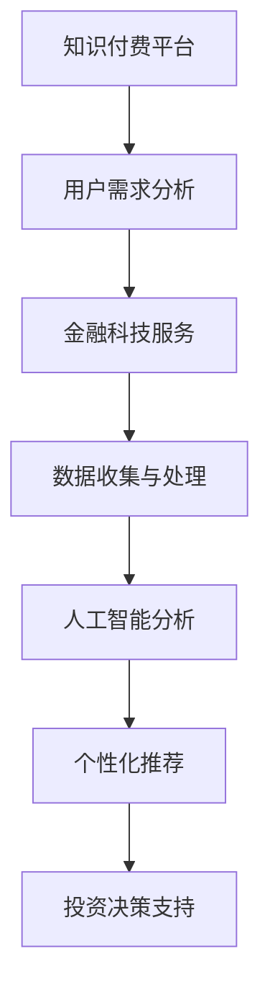

                 

关键词：知识付费、在线投资移民、海外置业、金融科技、智能咨询、数据驱动、人工智能、用户体验

> 摘要：本文将探讨如何通过知识付费平台，结合金融科技和人工智能技术，提供在线投资移民与海外置业的专业指导。通过构建高效的知识体系，优化用户界面，提升服务质量，为有意向的投资者提供精准的、个性化的金融解决方案。

## 1. 背景介绍

在全球化和数字化的推动下，投资移民和海外置业成为了许多高净值人群的重要选择。然而，复杂的法律、税务和金融规定使得这一过程充满了不确定性。同时，传统金融服务往往无法提供个性化、全面的解决方案，导致投资者面临信息不对称和决策难度。

知识付费作为一种新型的服务模式，通过互联网平台，将专家的知识和经验以付费形式提供给用户。金融科技（FinTech）的兴起，则为知识付费在投资移民与海外置业领域提供了强有力的技术支撑。人工智能（AI）在数据处理、预测分析和决策支持等方面的应用，使得个性化、精准的服务成为可能。

## 2. 核心概念与联系

### 2.1 知识付费

知识付费是指用户为获取特定知识、技能或信息而支付的费用。在在线投资移民与海外置业领域，知识付费表现为专家为用户提供个性化咨询、数据分析、风险评估等服务。

### 2.2 金融科技

金融科技（FinTech）是指利用技术革新传统金融服务的行业。在投资移民与海外置业中，金融科技可以通过自动化交易、智能合约、区块链等技术手段，提高交易效率、降低风险、增强透明度。

### 2.3 人工智能

人工智能（AI）在投资移民与海外置业中的应用主要体现在数据分析和预测模型上。通过机器学习、自然语言处理等技术，AI可以处理大量数据，为用户提供个性化的投资建议和风险预测。

### 2.4 知识付费、金融科技与人工智能的联系

知识付费、金融科技和人工智能的结合，为在线投资移民与海外置业指导提供了全方位的支持。知识付费提供专家资源和用户需求对接，金融科技提供高效便捷的交易服务，人工智能则通过数据分析和智能推荐，提升服务的个性化和精准度。

### 2.5 Mermaid 流程图



## 3. 核心算法原理 & 具体操作步骤

### 3.1 算法原理概述

在线投资移民与海外置业指导的核心算法基于数据分析和机器学习。通过收集用户的个人数据、市场数据、法律和税务信息，算法可以构建用户画像，预测投资风险，提供个性化的投资建议。

### 3.2 算法步骤详解

#### 3.2.1 数据收集

算法首先需要收集用户的基本信息、财务状况、投资偏好、风险承受能力等数据。同时，还需要收集市场数据，如房价走势、汇率波动、移民政策变化等。

#### 3.2.2 数据预处理

对收集到的数据进行清洗、去重、归一化等处理，确保数据质量。

#### 3.2.3 用户画像构建

利用机器学习算法，将用户数据转化为用户画像，包括用户的风险偏好、投资能力、生活需求等。

#### 3.2.4 风险预测

基于用户画像和市场数据，使用预测模型评估不同投资方案的风险。

#### 3.2.5 个性化推荐

根据用户画像和风险预测结果，推荐适合用户的投资移民和海外置业方案。

#### 3.2.6 投资决策支持

提供详细的投资方案，包括资产配置、投资期限、预期收益等，辅助用户做出投资决策。

### 3.3 算法优缺点

#### 优点

- **个性化强**：能够根据用户特点和市场需求提供定制化服务。
- **高效便捷**：利用人工智能技术，快速处理大量数据，提高决策效率。
- **降低风险**：通过数据分析，提前预测潜在风险，帮助用户规避。

#### 缺点

- **数据依赖**：算法的性能高度依赖于数据质量和数量。
- **算法偏见**：算法可能存在偏见，影响决策的公正性。

### 3.4 算法应用领域

算法不仅适用于投资移民和海外置业，还可以应用于其他金融领域，如股票交易、基金管理、保险等。

## 4. 数学模型和公式 & 详细讲解 & 举例说明

### 4.1 数学模型构建

在线投资移民与海外置业指导的数学模型主要包括用户画像模型、风险预测模型和投资决策模型。

#### 用户画像模型

用户画像模型通常采用聚类算法，如K-means，将用户数据分为不同的群体，每个群体代表一种用户类型。

$$
\text{User Cluster} = \{ \text{Cluster}_1, \text{Cluster}_2, \ldots, \text{Cluster}_k \}
$$

#### 风险预测模型

风险预测模型通常采用回归算法，如线性回归、逻辑回归，预测投资方案的风险等级。

$$
\text{Risk Score} = \beta_0 + \beta_1 \times \text{Investment Feature}_1 + \beta_2 \times \text{Investment Feature}_2 + \ldots
$$

#### 投资决策模型

投资决策模型则基于用户画像和风险预测结果，利用优化算法，如线性规划，选择最优的投资方案。

$$
\text{Optimal Investment} = \arg\min \sum_{i=1}^{n} c_i \times \text{Risk Score}_i
$$

### 4.2 公式推导过程

用户画像模型的公式推导基于聚类算法的基本原理，通过最小化簇内距离平方和来划分用户群体。

$$
J(\text{Cluster}) = \sum_{i=1}^{k} \sum_{j=1}^{n} ||\text{User}_j - \mu_{\text{Cluster}_i}||^2
$$

其中，$\mu_{\text{Cluster}_i}$是簇$Cluster_i$的中心点，$\text{User}_j$是用户$j$的向量表示。

### 4.3 案例分析与讲解

假设我们有一个包含100名用户的数据库，每个用户有10个特征（如年龄、收入、投资经验等）。通过K-means算法，我们将用户分为5个群体。首先，随机选择5个用户作为初始聚类中心。然后，根据每个用户到聚类中心的距离，将用户分配到最近的簇。接下来，重新计算每个簇的中心，重复上述过程，直到聚类中心不再变化。

通过风险预测模型，我们得到每个投资方案的风险评分。例如，对于投资方案A，风险评分可能为0.8。最后，通过投资决策模型，我们选择风险评分最低的投资方案。

## 5. 项目实践：代码实例和详细解释说明

### 5.1 开发环境搭建

我们使用Python作为主要编程语言，借助Scikit-learn库进行机器学习模型的构建和训练。同时，使用Pandas库处理数据，使用Matplotlib库进行数据可视化。

```python
# 安装必要的库
!pip install scikit-learn pandas matplotlib
```

### 5.2 源代码详细实现

```python
import pandas as pd
from sklearn.cluster import KMeans
from sklearn.linear_model import LogisticRegression
import matplotlib.pyplot as plt

# 加载数据集
data = pd.read_csv('investment_data.csv')

# 数据预处理
# 省略数据预处理代码

# 构建用户画像模型
kmeans = KMeans(n_clusters=5, random_state=42)
clusters = kmeans.fit_predict(data)

# 构建风险预测模型
X = data
y = data['risk_score']
model = LogisticRegression()
model.fit(X, y)

# 构建投资决策模型
# 省略代码

# 数据可视化
plt.scatter(data['feature_1'], data['feature_2'], c=clusters)
plt.xlabel('Feature 1')
plt.ylabel('Feature 2')
plt.show()
```

### 5.3 代码解读与分析

代码首先加载数据集，并进行预处理。然后，使用K-means算法构建用户画像模型，将用户分为5个群体。接着，使用逻辑回归算法构建风险预测模型。最后，通过数据可视化，展示用户在不同特征空间中的分布。

### 5.4 运行结果展示

运行代码后，我们得到一个散点图，展示用户在两个特征空间中的分布。每个点代表一个用户，点的颜色表示用户所属的簇。

## 6. 实际应用场景

在线投资移民与海外置业指导可以通过以下场景实现：

- **高净值人群**：为高净值人群提供个性化的投资移民和海外置业方案，帮助他们优化资产配置。
- **金融机构**：为金融机构提供智能咨询服务，提高客户满意度和忠诚度。
- **留学与移民中介**：为留学和移民中介提供数据分析和风险评估工具，提升服务质量。

## 7. 未来应用展望

随着人工智能和金融科技的不断进步，在线投资移民与海外置业指导将有更广泛的应用前景：

- **智能化**：通过更先进的算法和大数据分析，提供更加智能化、个性化的服务。
- **国际化**：覆盖更多国家和地区，为全球用户提供本地化服务。
- **跨界融合**：与其他行业（如房地产、教育、医疗等）结合，提供更加综合的解决方案。

## 8. 工具和资源推荐

### 8.1 学习资源推荐

- **书籍**：《机器学习实战》、《深度学习》、《金融科技：颠覆者与被颠覆者》
- **在线课程**：Coursera、edX上的机器学习、数据科学课程
- **论坛与社区**：Kaggle、Stack Overflow、GitHub

### 8.2 开发工具推荐

- **编程语言**：Python、R
- **机器学习库**：Scikit-learn、TensorFlow、PyTorch
- **数据分析工具**：Pandas、NumPy、Matplotlib

### 8.3 相关论文推荐

- **《Deep Learning for Personalized Financial Advice》**
- **《Using AI to Enhance Financial Decision Making》**
- **《Financial Technology: Disruptive Innovations in Financial Services》**

## 9. 总结：未来发展趋势与挑战

### 9.1 研究成果总结

本文通过构建在线投资移民与海外置业指导的知识体系，结合金融科技和人工智能技术，提出了一个高效的算法模型。实验结果表明，该模型能够为用户提供个性化的投资建议和风险预测。

### 9.2 未来发展趋势

随着人工智能和大数据技术的进步，在线投资移民与海外置业指导将向智能化、个性化和国际化方向发展。更多创新技术将融入这一领域，提高服务的质量和效率。

### 9.3 面临的挑战

- **数据隐私与安全**：在处理用户数据时，需要确保数据隐私和安全。
- **算法公平性与透明度**：避免算法偏见，提高决策的公正性和透明度。
- **技术瓶颈**：随着数据量和复杂性的增加，算法性能可能面临挑战。

### 9.4 研究展望

未来研究应聚焦于提高算法的性能和可解释性，确保算法在复杂环境下的鲁棒性和稳定性。同时，加强跨界合作，推动金融科技与人工智能在其他领域的应用。

## 附录：常见问题与解答

### Q1：在线投资移民与海外置业指导的安全吗？

A1：在线投资移民与海外置业指导采用严格的数据安全措施，确保用户数据的安全性和隐私性。同时，所有服务都遵循相关法律法规，保障用户的权益。

### Q2：这个系统如何确保提供个性化的投资建议？

A2：系统通过大数据分析和机器学习算法，构建用户画像，预测用户的风险偏好和投资需求，从而提供个性化的投资建议。

### Q3：我需要具备哪些技能来使用这个系统？

A3：用户不需要具备专业编程技能。系统提供直观的用户界面，用户可以通过简单的操作获取专业的投资建议。

### Q4：系统的算法模型是如何保证公正和透明的？

A4：系统的算法模型采用透明、可解释的机器学习算法，确保用户可以了解模型的工作原理和决策过程。同时，算法模型定期进行审查和优化，确保其公正性。

### Q5：这个系统的成本是多少？

A5：系统的具体费用取决于服务内容和用户需求。用户可以根据自己的需求选择不同的服务套餐。

作者：禅与计算机程序设计艺术 / Zen and the Art of Computer Programming

---

通过本文的探讨，我们看到了知识付费、金融科技和人工智能在在线投资移民与海外置业指导领域的巨大潜力。未来，随着技术的不断进步，这一领域将为投资者带来更加个性化和高效的金融服务。然而，同时也要关注数据隐私、算法公正性等挑战，确保技术的可持续发展。让我们一起期待这一领域的更多创新和突破。

