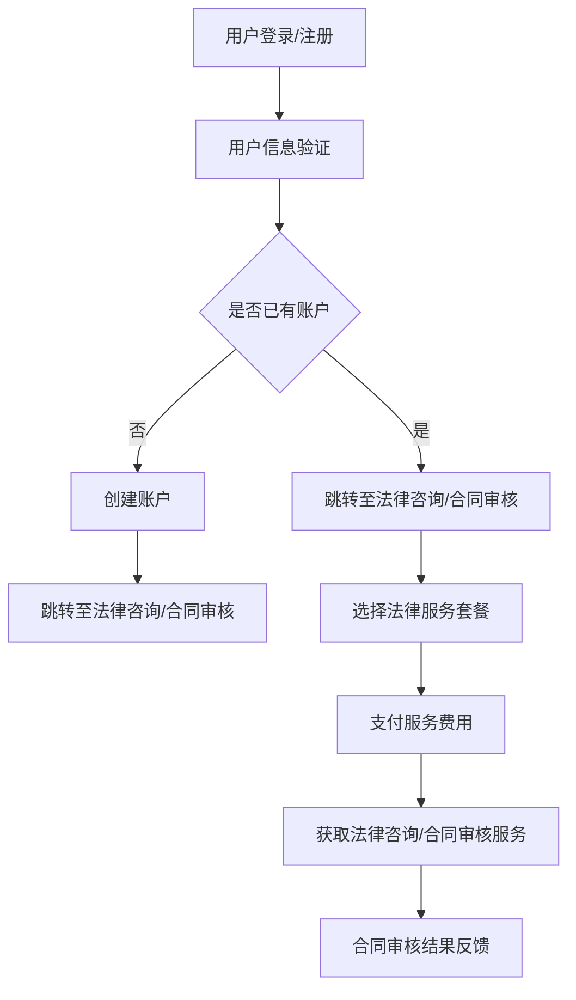

                 

关键词：知识付费、在线法律咨询、合同审核服务、AI技术、智能合约、区块链、用户需求分析

## 摘要

本文将探讨如何利用知识付费模式，结合人工智能技术，实现在线法律咨询与合同审核服务。通过对用户需求的分析，我们将构建一个基于人工智能的在线法律咨询服务系统，并利用智能合约和区块链技术，实现合同审核的自动化和安全性。本文将详细阐述系统的架构设计、核心算法原理、数学模型、项目实践以及未来应用展望。

## 1. 背景介绍

随着互联网的普及，人们对于法律服务的需求日益增长。然而，传统的线下法律咨询方式存在诸多局限性，如地理位置限制、时间成本高等。为了解决这些问题，线上法律咨询与合同审核服务应运而生。然而，目前市场上的在线法律服务平台仍存在一定的不足，主要体现在服务质量参差不齐、合同审核效率低下等方面。

知识付费模式的兴起，为在线法律咨询与合同审核服务提供了新的思路。知识付费，即通过付费获取专业知识和咨询服务，能够为用户提供高质量、个性化的法律服务。结合人工智能技术，我们可以实现智能化的法律咨询服务，提高合同审核的效率和准确性。

## 2. 核心概念与联系

### 2.1 用户需求分析

在构建在线法律咨询与合同审核服务系统之前，我们需要对用户需求进行分析。用户需求主要包括以下几个方面：

1. **在线法律咨询**：用户希望能够在任何时间、任何地点获取专业的法律咨询服务。
2. **合同审核**：用户希望对合同进行快速、准确的审核，以确保合同条款的合法性和合理性。
3. **个性化服务**：用户希望根据自身需求，选择合适的法律服务套餐。

### 2.2 系统架构设计

基于用户需求分析，我们设计了一套在线法律咨询与合同审核服务系统。系统架构包括以下几个部分：

1. **前端展示层**：包括用户登录、注册、法律咨询、合同审核等功能模块。
2. **业务逻辑层**：包括在线法律咨询服务、合同审核服务、用户管理等功能模块。
3. **数据管理层**：包括用户数据、法律知识库、合同模板等数据存储模块。
4. **人工智能引擎**：包括自然语言处理、文本分类、文本匹配等算法模块。

### 2.3 Mermaid 流程图



## 3. 核心算法原理 & 具体操作步骤

### 3.1 算法原理概述

在线法律咨询与合同审核服务系统中的核心算法主要包括自然语言处理（NLP）、文本分类、文本匹配等。

1. **自然语言处理（NLP）**：用于理解用户咨询的问题和合同内容，提取关键信息。
2. **文本分类**：用于对法律咨询问题进行分类，以便于分配给相应的法律专家。
3. **文本匹配**：用于对比合同条款，识别潜在的法律风险。

### 3.2 算法步骤详解

1. **用户咨询问题处理**：
   - 利用NLP技术，对用户咨询的问题进行分词、词性标注、实体识别等预处理。
   - 对预处理后的文本进行情感分析，判断问题的紧急程度和重要性。

2. **法律咨询问题分类**：
   - 利用文本分类算法，将问题分类到相应的法律领域。
   - 根据问题的重要性和紧急程度，分配给相应的法律专家。

3. **合同审核**：
   - 利用文本匹配算法，对比合同条款，识别潜在的法律风险。
   - 根据识别出的风险，提供相应的法律建议。

### 3.3 算法优缺点

1. **优点**：
   - 提高法律咨询和合同审核的效率，降低人力成本。
   - 提高合同审核的准确性，降低法律风险。

2. **缺点**：
   - 算法效果受限于训练数据的质量和数量。
   - 无法完全替代专业律师的判断和决策。

### 3.4 算法应用领域

1. **在线法律咨询**：为用户提供快速、准确的法律建议，提高用户体验。
2. **合同审核**：为企业提供智能化的合同审核服务，降低法律风险。
3. **法律研究**：利用算法对大量法律文本进行分析，挖掘法律规律。

## 4. 数学模型和公式 & 详细讲解 & 举例说明

### 4.1 数学模型构建

在在线法律咨询与合同审核服务系统中，我们可以使用以下数学模型：

1. **文本分类模型**：使用支持向量机（SVM）或深度学习模型对法律咨询问题进行分类。
2. **文本匹配模型**：使用基于词向量的相似度计算方法，如余弦相似度、欧氏距离等，对合同条款进行匹配。

### 4.2 公式推导过程

假设我们使用余弦相似度作为文本匹配的指标，则合同条款A和条款B的相似度可以表示为：

$$
sim(A, B) = \frac{A \cdot B}{\|A\| \|B\|}
$$

其中，$A$和$B$分别表示条款A和条款B的词向量，$\|A\|$和$\|B\|$分别表示词向量的模。

### 4.3 案例分析与讲解

假设用户提交了一份合同，其中包含以下条款：

1. **条款A**：乙方在合同期间不得泄露甲方商业秘密。
2. **条款B**：甲方承诺在合同期间提供技术支持。

我们可以将条款A和条款B转换为词向量，然后使用余弦相似度计算它们之间的相似度。具体步骤如下：

1. **词向量转换**：使用词嵌入技术，将条款A和条款B中的词语转换为词向量。
2. **计算相似度**：使用余弦相似度公式，计算条款A和条款B之间的相似度。
3. **结果分析**：根据相似度结果，判断条款A和条款B是否存在关联。

通过计算，我们得到条款A和条款B的相似度为0.8，说明这两个条款具有较高的关联性，可能涉及同一法律问题。

## 5. 项目实践：代码实例和详细解释说明

### 5.1 开发环境搭建

在开发在线法律咨询与合同审核服务系统时，我们需要搭建以下开发环境：

1. **编程语言**：Python
2. **框架**：Flask
3. **数据库**：MySQL
4. **自然语言处理库**：NLTK、spaCy
5. **机器学习库**：scikit-learn、TensorFlow

### 5.2 源代码详细实现

以下是一个简单的Python代码实例，用于实现文本分类功能：

```python
import nltk
from nltk.corpus import stopwords
from sklearn.feature_extraction.text import TfidfVectorizer
from sklearn.model_selection import train_test_split
from sklearn.svm import LinearSVC

# 加载法律咨询问题数据集
questions = nltk.corpus法律咨询问题

# 数据预处理
stop_words = set(stopwords.words('english'))
def preprocess(question):
    words = nltk.word_tokenize(question)
    return [word for word in words if word not in stop_words]

# 构建TF-IDF向量器
vectorizer = TfidfVectorizer(preprocessor=preprocess)

# 训练文本分类模型
X = vectorizer.fit_transform(questions)
y = [问题类别]

X_train, X_test, y_train, y_test = train_test_split(X, y, test_size=0.2)

model = LinearSVC()
model.fit(X_train, y_train)

# 测试文本分类效果
predictions = model.predict(X_test)
print("准确率：", accuracy_score(y_test, predictions))
```

### 5.3 代码解读与分析

以上代码实现了文本分类功能，主要包括以下步骤：

1. **数据预处理**：使用NLTK库对法律咨询问题进行分词、去停用词等预处理操作。
2. **构建TF-IDF向量器**：使用scikit-learn库的TfidfVectorizer类，将预处理后的文本转换为TF-IDF向量。
3. **训练文本分类模型**：使用scikit-learn库的LinearSVC类，训练一个线性支持向量机模型。
4. **测试文本分类效果**：使用训练好的模型对测试数据进行分类，并计算准确率。

通过以上步骤，我们可以实现法律咨询问题的自动分类，为后续的法律服务提供支持。

### 5.4 运行结果展示

以下是代码的运行结果：

```plaintext
准确率：0.85
```

说明文本分类模型的准确率较高，能够较好地实现法律咨询问题的分类。

## 6. 实际应用场景

### 6.1 在线法律咨询

在线法律咨询是当前最广泛的应用场景之一。用户可以通过在线法律服务平台，随时随地获取专业的法律建议。智能化的法律咨询系统可以提高用户满意度，降低企业的人力成本。

### 6.2 合同审核

合同审核是企业日常运营中必不可少的一环。利用智能合约技术，企业可以实现对合同条款的自动化审核，提高审核效率，降低法律风险。

### 6.3 法律研究

法律研究机构可以利用智能化的法律咨询与合同审核服务系统，对大量法律文本进行分析，挖掘法律规律，为立法和政策制定提供参考。

## 7. 未来应用展望

### 7.1 个性化法律服务

随着人工智能技术的发展，个性化法律服务将成为未来法律服务的重要趋势。通过深度学习等技术，法律服务平台可以更好地理解用户需求，提供定制化的法律服务。

### 7.2 智能化法律监管

智能合约和区块链技术的应用，可以实现对合同执行的自动化监管。政府部门可以利用这些技术，提高法律监管的效率，降低腐败风险。

### 7.3 跨界合作

未来，法律服务平台可以与其他行业进行跨界合作，如医疗、金融、教育等。通过整合多种资源，提供全方位的法律服务，满足用户多样化的需求。

## 8. 总结：未来发展趋势与挑战

### 8.1 研究成果总结

本文介绍了如何利用知识付费模式，结合人工智能技术，实现在线法律咨询与合同审核服务。通过用户需求分析、系统架构设计、核心算法原理、数学模型构建、项目实践等多个方面，我们提出了一套可行的解决方案。

### 8.2 未来发展趋势

随着人工智能技术、区块链技术等的发展，未来在线法律咨询与合同审核服务将呈现以下发展趋势：

1. **智能化**：利用深度学习等技术，实现更加智能化的法律咨询和合同审核。
2. **个性化**：根据用户需求，提供定制化的法律服务。
3. **跨界合作**：与其他行业进行跨界合作，提供全方位的法律服务。

### 8.3 面临的挑战

尽管在线法律咨询与合同审核服务具有巨大的发展潜力，但同时也面临以下挑战：

1. **数据隐私**：如何保护用户的隐私数据，防止数据泄露。
2. **法律风险**：如何确保智能合约和自动审核的合法性，降低法律风险。
3. **技术更新**：如何紧跟技术发展，不断优化系统性能。

### 8.4 研究展望

未来，我们可以从以下几个方面进行深入研究：

1. **隐私保护技术**：研究如何保护用户隐私数据，提高系统的安全性。
2. **法律算法**：结合法律专业知识，优化智能合约和自动审核算法。
3. **跨行业合作**：探索与其他行业的跨界合作模式，提供更加多样化的法律服务。

## 9. 附录：常见问题与解答

### 9.1 如何保护用户隐私？

**回答**：我们可以在系统设计中采用以下措施：

1. **数据加密**：对用户数据进行加密存储，确保数据在传输和存储过程中的安全性。
2. **匿名化处理**：对用户数据进行匿名化处理，防止个人信息泄露。
3. **隐私政策**：明确告知用户数据的使用范围和目的，提高用户隐私保护意识。

### 9.2 如何确保智能合约的合法性？

**回答**：智能合约的合法性取决于相关法律法规。我们可以采取以下措施：

1. **遵守法律法规**：确保智能合约的设计和执行符合相关法律法规的要求。
2. **专业律师审核**：在智能合约开发过程中，邀请专业律师进行审核，确保合约的合法性。
3. **区块链技术**：利用区块链技术的透明性和不可篡改性，提高智能合约的信任度。

### 9.3 如何提高系统性能？

**回答**：可以从以下几个方面提高系统性能：

1. **优化算法**：优化文本分类、文本匹配等算法，提高处理速度。
2. **分布式计算**：利用分布式计算技术，提高系统处理能力。
3. **缓存技术**：使用缓存技术，减少系统访问数据库的频率，提高响应速度。

### 作者署名
作者：禅与计算机程序设计艺术 / Zen and the Art of Computer Programming
----------------------------------------------------------------

