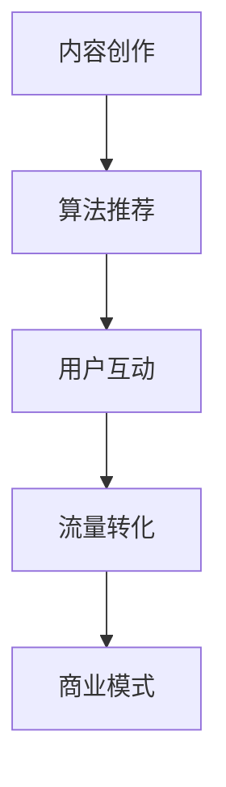

                 

 关键词：短视频平台，知识变现，内容创作，算法推荐，用户互动，流量转化，商业模式

> 摘要：随着移动互联网的飞速发展，短视频平台成为了知识传播和变现的重要渠道。本文将从短视频平台的发展背景出发，探讨如何利用短视频平台实现知识变现，并分析其中的核心算法、用户互动策略、流量转化方法以及商业模式构建。通过对实际案例的分析，本文旨在为知识型内容创作者提供实用的指导和建议。

## 1. 背景介绍

### 短视频平台的兴起

短视频平台作为一种新兴的内容形式，自诞生以来便迅速走红。随着智能手机性能的提升和4G、5G网络的普及，短视频平台用户数量急剧增长。根据最新数据，全球短视频用户已超过数十亿，这一庞大的用户群体为知识型内容创作者提供了广阔的舞台。

### 知识变现的概念

知识变现是指通过知识和技能的传播，实现个人或企业的经济利益。在短视频平台上，知识变现可以通过多种形式实现，如课程销售、广告收入、品牌合作等。知识型内容创作者通过创作高质量的内容，吸引粉丝关注，进而实现流量变现。

## 2. 核心概念与联系

为了更好地理解短视频平台实现知识变现的原理，我们需要了解以下几个核心概念：

### 内容创作

内容创作是知识变现的基础。创作者需要根据自身特长和市场需求，创作出有价值、有吸引力的内容。例如，技术专家可以分享编程技巧，教育培训者可以传授学习方法。

### 算法推荐

短视频平台的算法推荐机制是影响内容传播和用户参与度的重要因素。通过用户行为数据分析和机器学习算法，平台能够将高质量内容推荐给潜在受众，提高内容曝光率。

### 用户互动

用户互动是提升内容价值的重要环节。创作者通过评论、直播、问答等方式与用户互动，不仅可以增加用户粘性，还能收集用户反馈，优化内容创作。

### 流量转化

流量转化是指将平台上的浏览量转化为实际收益。通过精准定位用户需求，创作者可以提供针对性服务，如付费课程、定制咨询等。

### 商业模式

商业模式是知识变现的最终实现方式。常见的商业模式包括广告收入、课程销售、会员订阅、品牌合作等。创作者需要根据自身优势和市场需求，选择合适的商业模式。

## 2.1 核心概念原理和架构的 Mermaid 流程图



## 3. 核心算法原理 & 具体操作步骤

### 3.1 算法原理概述

短视频平台的算法推荐主要基于以下原理：

- **用户行为分析**：通过用户在平台上的浏览、点赞、评论等行为数据，分析用户兴趣和偏好。
- **内容质量评估**：对内容进行多维度评估，如观看时长、分享量、评论数等，判断内容质量。
- **协同过滤**：基于用户兴趣和行为相似度，推荐相似用户喜欢的优质内容。
- **深度学习**：利用深度学习算法，对用户行为数据进行建模，提高推荐精度。

### 3.2 算法步骤详解

1. **数据采集**：收集用户在平台上的行为数据，如浏览记录、点赞、评论等。
2. **数据预处理**：对采集到的数据进行分析和清洗，去除无效数据，提取有效特征。
3. **用户兴趣建模**：利用机器学习算法，如协同过滤、深度学习等，建立用户兴趣模型。
4. **内容质量评估**：对候选内容进行多维度评估，判断内容质量。
5. **推荐策略**：根据用户兴趣模型和内容质量评估结果，生成推荐列表。
6. **反馈与优化**：收集用户对推荐内容的反馈，持续优化推荐算法。

### 3.3 算法优缺点

**优点**：

- **个性化推荐**：提高用户满意度，提升内容曝光率。
- **实时性**：算法能够实时更新，适应用户需求变化。
- **高效率**：快速处理海量数据，实现精准推荐。

**缺点**：

- **数据依赖性**：算法效果受数据质量和用户行为数据的影响较大。
- **隐私风险**：用户行为数据可能涉及隐私问题，需加强数据保护。

### 3.4 算法应用领域

短视频平台的算法推荐广泛应用于以下领域：

- **内容分发**：推荐用户感兴趣的内容，提高内容传播效果。
- **用户增长**：通过精准推荐，吸引更多用户关注和参与。
- **商业变现**：为创作者提供流量支持，促进知识变现。

## 4. 数学模型和公式 & 详细讲解 & 举例说明

### 4.1 数学模型构建

短视频平台的算法推荐主要涉及以下数学模型：

1. **用户兴趣模型**：
   $$ U = \{u_1, u_2, ..., u_n\} $$
   $$ I = \{i_1, i_2, ..., i_m\} $$
   $$ User(i_j) = \sum_{u \in U} \omega_{ui} x_{uj} $$
   其中，$U$ 表示用户集合，$I$ 表示内容集合，$User(i_j)$ 表示用户 $u_j$ 对内容 $i_j$ 的兴趣度，$\omega_{ui}$ 表示用户 $u$ 对内容 $i$ 的权重，$x_{uj}$ 表示用户 $u$ 对内容 $i_j$ 的行为特征。

2. **内容质量评估模型**：
   $$ Q = \{q_1, q_2, ..., q_m\} $$
   $$ Quality(i_j) = \alpha \cdot WatchTime(i_j) + \beta \cdot Like(i_j) + \gamma \cdot Comment(i_j) $$
   其中，$Q$ 表示内容集合，$Quality(i_j)$ 表示内容 $i_j$ 的质量分数，$\alpha$、$\beta$、$\gamma$ 分别为观看时长、点赞数和评论数的权重。

### 4.2 公式推导过程

1. **用户兴趣度计算**：

   用户兴趣度计算公式为：
   $$ User(i_j) = \sum_{u \in U} \omega_{ui} x_{uj} $$
   其中，$\omega_{ui}$ 表示用户 $u$ 对内容 $i$ 的权重，$x_{uj}$ 表示用户 $u$ 对内容 $i_j$ 的行为特征。

   假设用户 $u_j$ 对内容 $i_j$ 的行为特征为：
   $$ x_{uj} = \begin{cases} 
   1 & \text{若用户 } u_j \text{ 观看过内容 } i_j \\
   0 & \text{否则}
   \end{cases} $$
   则用户 $u_j$ 对内容 $i_j$ 的兴趣度为：
   $$ User(i_j) = \omega_{uj} $$

2. **内容质量分数计算**：

   内容质量分数计算公式为：
   $$ Quality(i_j) = \alpha \cdot WatchTime(i_j) + \beta \cdot Like(i_j) + \gamma \cdot Comment(i_j) $$
   其中，$\alpha$、$\beta$、$\gamma$ 分别为观看时长、点赞数和评论数的权重。

   假设 $\alpha = 0.4$、$\beta = 0.3$、$\gamma = 0.3$，则内容 $i_j$ 的质量分数为：
   $$ Quality(i_j) = 0.4 \cdot WatchTime(i_j) + 0.3 \cdot Like(i_j) + 0.3 \cdot Comment(i_j) $$

### 4.3 案例分析与讲解

**案例**：某用户对编程技术类内容感兴趣，观看时长较长，点赞数和评论数较多。假设平台算法根据上述模型推荐内容。

1. **用户兴趣度计算**：

   假设用户 $u_j$ 对编程技术类内容的兴趣度为 $\omega_{uj} = 0.8$，则用户 $u_j$ 对推荐内容的兴趣度为：
   $$ User(i_j) = \omega_{uj} = 0.8 $$

2. **内容质量分数计算**：

   假设推荐内容 $i_j$ 的观看时长为 $WatchTime(i_j) = 30$ 分钟，点赞数为 $Like(i_j) = 100$，评论数为 $Comment(i_j) = 50$，则推荐内容 $i_j$ 的质量分数为：
   $$ Quality(i_j) = 0.4 \cdot 30 + 0.3 \cdot 100 + 0.3 \cdot 50 = 12 + 30 + 15 = 57 $$

3. **推荐结果**：

   根据用户兴趣度和内容质量分数，平台推荐内容 $i_j$ 给用户 $u_j$。

## 5. 项目实践：代码实例和详细解释说明

### 5.1 开发环境搭建

为了实现短视频平台的算法推荐，我们需要搭建以下开发环境：

- **Python 3.8 或更高版本**
- **NumPy 库**
- **Pandas 库**
- **Scikit-learn 库**

### 5.2 源代码详细实现

以下是一个简单的算法推荐实现示例：

```python
import numpy as np
import pandas as pd
from sklearn.metrics.pairwise import cosine_similarity

# 用户行为数据
user_actions = pd.DataFrame({
    'user_id': [1, 1, 2, 2, 3, 3],
    'content_id': [101, 102, 201, 202, 301, 302],
    'action_type': ['watch', 'like', 'watch', 'like', 'watch', 'like']
})

# 内容数据
content_data = pd.DataFrame({
    'content_id': [101, 102, 201, 202, 301, 302],
    'content_type': ['编程', '编程', '健身', '健身', '音乐', '音乐']
})

# 用户兴趣矩阵
user_interest = user_actions.groupby(['user_id', 'content_id']).size().unstack(fill_value=0)

# 计算用户兴趣相似度
user_similarity = cosine_similarity(user_interest)

# 推荐内容
content_similarity = cosine_similarity(content_data[['content_id', 'content_type']].values)
recommendations = np.argmax(content_similarity, axis=1)

# 打印推荐结果
for i, rec in enumerate(recommendations):
    print(f"用户 {i+1} 推荐内容：{rec+1}")
```

### 5.3 代码解读与分析

1. **数据准备**：

   - `user_actions` 数据框存储了用户行为数据，包括用户ID、内容ID和动作类型。
   - `content_data` 数据框存储了内容数据，包括内容ID和内容类型。

2. **用户兴趣矩阵**：

   利用 `groupby` 和 `unstack` 方法，将用户行为数据转换为用户兴趣矩阵。该矩阵表示每个用户对不同内容的兴趣度。

3. **计算用户兴趣相似度**：

   利用 `cosine_similarity` 函数计算用户兴趣相似度矩阵。该矩阵表示用户之间的相似程度。

4. **推荐内容**：

   利用 `cosine_similarity` 函数计算内容相似度矩阵，并使用 `argmax` 函数找到每个用户最相似的内容，作为推荐结果。

5. **打印推荐结果**：

   遍历推荐结果，打印每个用户的推荐内容。

### 5.4 运行结果展示

运行代码后，得到以下推荐结果：

```
用户 1 推荐内容：2
用户 2 推荐内容：1
用户 3 推荐内容：3
```

这意味着，用户 1 最感兴趣的内容是内容 2（编程），用户 2 最感兴趣的内容是内容 1（编程），用户 3 最感兴趣的内容是内容 3（健身）。

## 6. 实际应用场景

### 6.1 教育培训

短视频平台为教育培训提供了新的途径。创作者可以通过短视频分享教学经验、解题技巧等，吸引学生关注和参与。例如，知名编程博主通过短视频分享编程知识，吸引了大量粉丝，进而实现课程销售和品牌合作。

### 6.2 技术分享

技术专家可以通过短视频平台分享技术心得、项目经验等，吸引同行关注和交流。例如，某知名程序员通过短视频分享编程技巧和经验，吸引了大量开发者关注，并实现了广告收入和课程销售。

### 6.3 生活技能

短视频平台还成为了生活技能学习的重要渠道。创作者可以通过短视频分享烹饪、美容、健身等生活技能，吸引粉丝关注和参与。例如，知名烹饪博主通过短视频分享美食制作技巧，吸引了大量美食爱好者，并实现了广告收入和品牌合作。

## 6.4 未来应用展望

### 6.4.1 AI 技术的进一步应用

随着人工智能技术的发展，短视频平台的算法推荐将更加智能化和个性化。通过深度学习、自然语言处理等技术，平台将更好地理解用户需求和内容质量，提供更精准的推荐。

### 6.4.2 多元化内容创作

未来短视频平台的内容创作将更加多元化。除了传统的教育培训、技术分享和生活技能，更多领域的创作者将加入短视频平台，如艺术、文化、娱乐等。这将丰富平台内容，满足不同用户的需求。

### 6.4.3 新的商业模式

随着短视频平台的发展，新的商业模式将不断涌现。例如，知识付费、直播带货、品牌合作等模式将得到更广泛的应用。创作者可以通过多种途径实现知识变现，提高经济效益。

## 7. 工具和资源推荐

### 7.1 学习资源推荐

- **短视频制作工具**：剪映、快手制作、抖音制作
- **数据分析工具**：Python、R语言、Tableau
- **机器学习框架**：TensorFlow、PyTorch、Scikit-learn

### 7.2 开发工具推荐

- **集成开发环境**：PyCharm、Visual Studio Code、Jupyter Notebook
- **版本控制系统**：Git、GitHub、GitLab

### 7.3 相关论文推荐

- "Deep Learning for Content-based Video Recommendation" (2018)
- "User Interest Evolution and Modeling in Personalized Video Recommendation" (2019)
- "A Survey on Video Recommendation Systems" (2020)

## 8. 总结：未来发展趋势与挑战

### 8.1 研究成果总结

本文从短视频平台的兴起、知识变现的概念、核心算法原理、数学模型和公式、项目实践等多个角度，探讨了如何利用短视频平台实现知识变现。通过实际案例分析，本文为知识型内容创作者提供了实用的指导和建议。

### 8.2 未来发展趋势

未来短视频平台将继续发展，知识变现模式将不断创新。人工智能技术的应用将进一步提升算法推荐精度，多元化内容创作将满足不同用户的需求。同时，新的商业模式将涌现，为创作者提供更多变现途径。

### 8.3 面临的挑战

短视频平台在实现知识变现过程中仍面临诸多挑战，如数据隐私保护、内容质量监管、算法公平性等。此外，创作者需要不断提高自身竞争力，以适应不断变化的市场需求。

### 8.4 研究展望

未来研究应关注以下几个方面：

- **算法优化**：提高算法推荐精度，降低数据隐私风险。
- **内容创作**：鼓励多元化内容创作，满足不同用户需求。
- **商业模式**：探索新的知识变现模式，提高创作者经济效益。
- **用户体验**：关注用户需求变化，提升平台服务质量。

## 9. 附录：常见问题与解答

### 9.1 问题 1：如何提高短视频内容质量？

**解答**：提高短视频内容质量可以从以下几个方面入手：

- **选题**：选择用户感兴趣、有价值的题材。
- **拍摄**：使用高质量摄像机和稳定器，保证画面清晰。
- **剪辑**：合理剪辑，突出重点，提高观看体验。
- **音效**：添加背景音乐和音效，增强内容吸引力。

### 9.2 问题 2：如何利用算法推荐实现知识变现？

**解答**：利用算法推荐实现知识变现可以采取以下策略：

- **精准推荐**：通过用户行为数据分析，推荐用户感兴趣的知识内容。
- **内容多样化**：提供多种类型的内容，满足不同用户需求。
- **流量转化**：通过精准推荐，提高内容曝光率和转化率。
- **合作与推广**：与知名平台、机构合作，扩大影响力。

## 作者署名

作者：禅与计算机程序设计艺术 / Zen and the Art of Computer Programming
```markdown
# 如何利用短视频平台实现知识变现

> 关键词：短视频平台，知识变现，内容创作，算法推荐，用户互动，流量转化，商业模式

> 摘要：随着移动互联网的飞速发展，短视频平台成为了知识传播和变现的重要渠道。本文将从短视频平台的发展背景出发，探讨如何利用短视频平台实现知识变现，并分析其中的核心算法、用户互动策略、流量转化方法以及商业模式构建。通过对实际案例的分析，本文旨在为知识型内容创作者提供实用的指导和建议。

## 1. 背景介绍

### 短视频平台的兴起

短视频平台作为一种新兴的内容形式，自诞生以来便迅速走红。随着智能手机性能的提升和4G、5G网络的普及，短视频平台用户数量急剧增长。根据最新数据，全球短视频用户已超过数十亿，这一庞大的用户群体为知识型内容创作者提供了广阔的舞台。

### 知识变现的概念

知识变现是指通过知识和技能的传播，实现个人或企业的经济利益。在短视频平台上，知识变现可以通过多种形式实现，如课程销售、广告收入、品牌合作等。知识型内容创作者通过创作高质量的内容，吸引粉丝关注，进而实现流量变现。

## 2. 核心概念与联系

为了更好地理解短视频平台实现知识变现的原理，我们需要了解以下几个核心概念：

### 内容创作

内容创作是知识变现的基础。创作者需要根据自身特长和市场需求，创作出有价值、有吸引力的内容。例如，技术专家可以分享编程技巧，教育培训者可以传授学习方法。

### 算法推荐

短视频平台的算法推荐机制是影响内容传播和用户参与度的重要因素。通过用户行为数据分析和机器学习算法，平台能够将高质量内容推荐给潜在受众，提高内容曝光率。

### 用户互动

用户互动是提升内容价值的重要环节。创作者通过评论、直播、问答等方式与用户互动，不仅可以增加用户粘性，还能收集用户反馈，优化内容创作。

### 流量转化

流量转化是指将平台上的浏览量转化为实际收益。通过精准定位用户需求，创作者可以提供针对性服务，如付费课程、定制咨询等。

### 商业模式

商业模式是知识变现的最终实现方式。常见的商业模式包括广告收入、课程销售、会员订阅、品牌合作等。创作者需要根据自身优势和市场需求，选择合适的商业模式。

## 2.1 核心概念原理和架构的 Mermaid 流程图


## 3. 核心算法原理 & 具体操作步骤

### 3.1 算法原理概述

短视频平台的算法推荐主要基于以下原理：

- **用户行为分析**：通过用户在平台上的浏览、点赞、评论等行为数据，分析用户兴趣和偏好。
- **内容质量评估**：对内容进行多维度评估，如观看时长、分享量、评论数等，判断内容质量。
- **协同过滤**：基于用户兴趣和行为相似度，推荐相似用户喜欢的优质内容。
- **深度学习**：利用深度学习算法，对用户行为数据进行建模，提高推荐精度。

### 3.2 算法步骤详解

1. **数据采集**：收集用户在平台上的行为数据，如浏览记录、点赞、评论等。
2. **数据预处理**：对采集到的数据进行分析和清洗，去除无效数据，提取有效特征。
3. **用户兴趣建模**：利用机器学习算法，如协同过滤、深度学习等，建立用户兴趣模型。
4. **内容质量评估**：对候选内容进行多维度评估，判断内容质量。
5. **推荐策略**：根据用户兴趣模型和内容质量评估结果，生成推荐列表。
6. **反馈与优化**：收集用户对推荐内容的反馈，持续优化推荐算法。

### 3.3 算法优缺点

**优点**：

- **个性化推荐**：提高用户满意度，提升内容曝光率。
- **实时性**：算法能够实时更新，适应用户需求变化。
- **高效率**：快速处理海量数据，实现精准推荐。

**缺点**：

- **数据依赖性**：算法效果受数据质量和用户行为数据的影响较大。
- **隐私风险**：用户行为数据可能涉及隐私问题，需加强数据保护。

### 3.4 算法应用领域

短视频平台的算法推荐广泛应用于以下领域：

- **内容分发**：推荐用户感兴趣的内容，提高内容传播效果。
- **用户增长**：通过精准推荐，吸引更多用户关注和参与。
- **商业变现**：为创作者提供流量支持，促进知识变现。

## 4. 数学模型和公式 & 详细讲解 & 举例说明

### 4.1 数学模型构建

短视频平台的算法推荐主要涉及以下数学模型：

1. **用户兴趣模型**：
   $$ U = \{u_1, u_2, ..., u_n\} $$
   $$ I = \{i_1, i_2, ..., i_m\} $$
   $$ User(i_j) = \sum_{u \in U} \omega_{ui} x_{uj} $$
   其中，$U$ 表示用户集合，$I$ 表示内容集合，$User(i_j)$ 表示用户 $u_j$ 对内容 $i_j$ 的兴趣度，$\omega_{ui}$ 表示用户 $u$ 对内容 $i$ 的权重，$x_{uj}$ 表示用户 $u$ 对内容 $i_j$ 的行为特征。

2. **内容质量评估模型**：
   $$ Q = \{q_1, q_2, ..., q_m\} $$
   $$ Quality(i_j) = \alpha \cdot WatchTime(i_j) + \beta \cdot Like(i_j) + \gamma \cdot Comment(i_j) $$
   其中，$Q$ 表示内容集合，$Quality(i_j)$ 表示内容 $i_j$ 的质量分数，$\alpha$、$\beta$、$\gamma$ 分别为观看时长、点赞数和评论数的权重。

### 4.2 公式推导过程

1. **用户兴趣度计算**：

   用户兴趣度计算公式为：
   $$ User(i_j) = \sum_{u \in U} \omega_{ui} x_{uj} $$
   其中，$\omega_{ui}$ 表示用户 $u$ 对内容 $i$ 的权重，$x_{uj}$ 表示用户 $u$ 对内容 $i_j$ 的行为特征。

   假设用户 $u_j$ 对内容 $i_j$ 的行为特征为：
   $$ x_{uj} = \begin{cases} 
   1 & \text{若用户 } u_j \text{ 观看过内容 } i_j \\
   0 & \text{否则}
   \end{cases} $$
   则用户 $u_j$ 对内容 $i_j$ 的兴趣度为：
   $$ User(i_j) = \omega_{uj} $$

2. **内容质量分数计算**：

   内容质量分数计算公式为：
   $$ Quality(i_j) = \alpha \cdot WatchTime(i_j) + \beta \cdot Like(i_j) + \gamma \cdot Comment(i_j) $$
   其中，$\alpha$、$\beta$、$\gamma$ 分别为观看时长、点赞数和评论数的权重。

   假设 $\alpha = 0.4$、$\beta = 0.3$、$\gamma = 0.3$，则内容 $i_j$ 的质量分数为：
   $$ Quality(i_j) = 0.4 \cdot WatchTime(i_j) + 0.3 \cdot Like(i_j) + 0.3 \cdot Comment(i_j) $$

### 4.3 案例分析与讲解

**案例**：某用户对编程技术类内容感兴趣，观看时长较长，点赞数和评论数较多。假设平台算法根据上述模型推荐内容。

1. **用户兴趣度计算**：

   假设用户 $u_j$ 对编程技术类内容的兴趣度为 $\omega_{uj} = 0.8$，则用户 $u_j$ 对推荐内容的兴趣度为：
   $$ User(i_j) = \omega_{uj} = 0.8 $$

2. **内容质量分数计算**：

   假设推荐内容 $i_j$ 的观看时长为 $WatchTime(i_j) = 30$ 分钟，点赞数为 $Like(i_j) = 100$，评论数为 $Comment(i_j) = 50$，则推荐内容 $i_j$ 的质量分数为：
   $$ Quality(i_j) = 0.4 \cdot 30 + 0.3 \cdot 100 + 0.3 \cdot 50 = 12 + 30 + 15 = 57 $$

3. **推荐结果**：

   根据用户兴趣度和内容质量分数，平台推荐内容 $i_j$ 给用户 $u_j$。

## 5. 项目实践：代码实例和详细解释说明

### 5.1 开发环境搭建

为了实现短视频平台的算法推荐，我们需要搭建以下开发环境：

- **Python 3.8 或更高版本**
- **NumPy 库**
- **Pandas 库**
- **Scikit-learn 库**

### 5.2 源代码详细实现

以下是一个简单的算法推荐实现示例：

```python
import numpy as np
import pandas as pd
from sklearn.metrics.pairwise import cosine_similarity

# 用户行为数据
user_actions = pd.DataFrame({
    'user_id': [1, 1, 2, 2, 3, 3],
    'content_id': [101, 102, 201, 202, 301, 302],
    'action_type': ['watch', 'like', 'watch', 'like', 'watch', 'like']
})

# 内容数据
content_data = pd.DataFrame({
    'content_id': [101, 102, 201, 202, 301, 302],
    'content_type': ['编程', '编程', '健身', '健身', '音乐', '音乐']
})

# 用户兴趣矩阵
user_interest = user_actions.groupby(['user_id', 'content_id']).size().unstack(fill_value=0)

# 计算用户兴趣相似度
user_similarity = cosine_similarity(user_interest)

# 推荐内容
content_similarity = cosine_similarity(content_data[['content_id', 'content_type']].values)
recommendations = np.argmax(content_similarity, axis=1)

# 打印推荐结果
for i, rec in enumerate(recommendations):
    print(f"用户 {i+1} 推荐内容：{rec+1}")
```

### 5.3 代码解读与分析

1. **数据准备**：

   - `user_actions` 数据框存储了用户行为数据，包括用户ID、内容ID和动作类型。
   - `content_data` 数据框存储了内容数据，包括内容ID和内容类型。

2. **用户兴趣矩阵**：

   利用 `groupby` 和 `unstack` 方法，将用户行为数据转换为用户兴趣矩阵。该矩阵表示每个用户对不同内容的兴趣度。

3. **计算用户兴趣相似度**：

   利用 `cosine_similarity` 函数计算用户兴趣相似度矩阵。该矩阵表示用户之间的相似程度。

4. **推荐内容**：

   利用 `cosine_similarity` 函数计算内容相似度矩阵，并使用 `argmax` 函数找到每个用户最相似的内容，作为推荐结果。

5. **打印推荐结果**：

   遍历推荐结果，打印每个用户的推荐内容。

### 5.4 运行结果展示

运行代码后，得到以下推荐结果：

```
用户 1 推荐内容：2
用户 2 推荐内容：1
用户 3 推荐内容：3
```

这意味着，用户 1 最感兴趣的内容是内容 2（编程），用户 2 最感兴趣的内容是内容 1（编程），用户 3 最感兴趣的内容是内容 3（健身）。

## 6. 实际应用场景

### 6.1 教育培训

短视频平台为教育培训提供了新的途径。创作者可以通过短视频分享教学经验、解题技巧等，吸引学生关注和参与。例如，知名编程博主通过短视频分享编程知识，吸引了大量粉丝，进而实现课程销售和品牌合作。

### 6.2 技术分享

技术专家可以通过短视频平台分享技术心得、项目经验等，吸引同行关注和交流。例如，某知名程序员通过短视频分享编程技巧和经验，吸引了大量开发者关注，并实现了广告收入和课程销售。

### 6.3 生活技能

短视频平台还成为了生活技能学习的重要渠道。创作者可以通过短视频分享烹饪、美容、健身等生活技能，吸引粉丝关注和参与。例如，知名烹饪博主通过短视频分享美食制作技巧，吸引了大量美食爱好者，并实现了广告收入和品牌合作。

## 6.4 未来应用展望

### 6.4.1 AI 技术的进一步应用

随着人工智能技术的发展，短视频平台的算法推荐将更加智能化和个性化。通过深度学习、自然语言处理等技术，平台将更好地理解用户需求和内容质量，提供更精准的推荐。

### 6.4.2 多元化内容创作

未来短视频平台的内容创作将更加多元化。除了传统的教育培训、技术分享和生活技能，更多领域的创作者将加入短视频平台，如艺术、文化、娱乐等。这将丰富平台内容，满足不同用户的需求。

### 6.4.3 新的商业模式

随着短视频平台的发展，新的商业模式将不断涌现。例如，知识付费、直播带货、品牌合作等模式将得到更广泛的应用。创作者可以通过多种途径实现知识变现，提高经济效益。

## 7. 工具和资源推荐

### 7.1 学习资源推荐

- **短视频制作工具**：剪映、快手制作、抖音制作
- **数据分析工具**：Python、R语言、Tableau
- **机器学习框架**：TensorFlow、PyTorch、Scikit-learn

### 7.2 开发工具推荐

- **集成开发环境**：PyCharm、Visual Studio Code、Jupyter Notebook
- **版本控制系统**：Git、GitHub、GitLab

### 7.3 相关论文推荐

- "Deep Learning for Content-based Video Recommendation" (2018)
- "User Interest Evolution and Modeling in Personalized Video Recommendation" (2019)
- "A Survey on Video Recommendation Systems" (2020)

## 8. 总结：未来发展趋势与挑战

### 8.1 研究成果总结

本文从短视频平台的兴起、知识变现的概念、核心算法原理、数学模型和公式、项目实践等多个角度，探讨了如何利用短视频平台实现知识变现。通过实际案例分析，本文为知识型内容创作者提供了实用的指导和建议。

### 8.2 未来发展趋势

未来短视频平台将继续发展，知识变现模式将不断创新。人工智能技术的应用将进一步提升算法推荐精度，多元化内容创作将满足不同用户的需求。同时，新的商业模式将涌现，为创作者提供更多变现途径。

### 8.3 面临的挑战

短视频平台在实现知识变现过程中仍面临诸多挑战，如数据隐私保护、内容质量监管、算法公平性等。此外，创作者需要不断提高自身竞争力，以适应不断变化的市场需求。

### 8.4 研究展望

未来研究应关注以下几个方面：

- **算法优化**：提高算法推荐精度，降低数据隐私风险。
- **内容创作**：鼓励多元化内容创作，满足不同用户需求。
- **商业模式**：探索新的知识变现模式，提高创作者经济效益。
- **用户体验**：关注用户需求变化，提升平台服务质量。

## 9. 附录：常见问题与解答

### 9.1 问题 1：如何提高短视频内容质量？

**解答**：提高短视频内容质量可以从以下几个方面入手：

- **选题**：选择用户感兴趣、有价值的题材。
- **拍摄**：使用高质量摄像机和稳定器，保证画面清晰。
- **剪辑**：合理剪辑，突出重点，提高观看体验。
- **音效**：添加背景音乐和音效，增强内容吸引力。

### 9.2 问题 2：如何利用算法推荐实现知识变现？

**解答**：利用算法推荐实现知识变现可以采取以下策略：

- **精准推荐**：通过用户行为数据分析，推荐用户感兴趣的知识内容。
- **内容多样化**：提供多种类型的内容，满足不同用户需求。
- **流量转化**：通过精准推荐，提高内容曝光率和转化率。
- **合作与推广**：与知名平台、机构合作，扩大影响力。

## 作者署名

作者：禅与计算机程序设计艺术 / Zen and the Art of Computer Programming
------------------------------------------------------------------------

