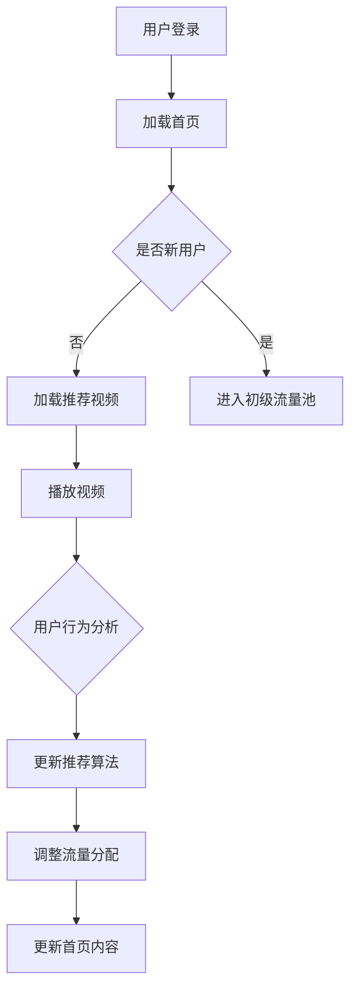
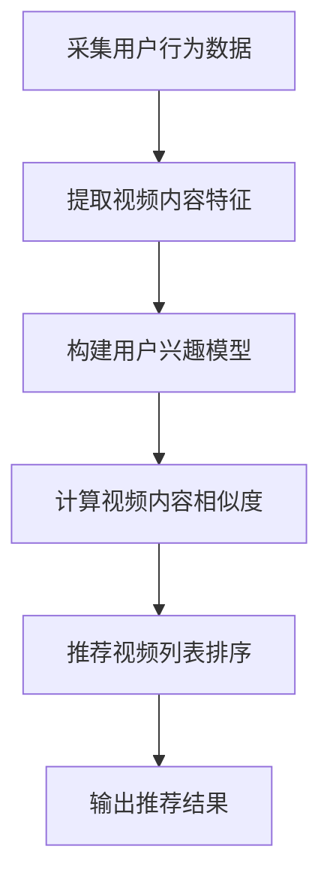

                 

关键词：短视频、流量、算法、平台、程序员

> 摘要：本文旨在探讨程序员如何利用短视频平台获取更多流量。通过介绍短视频平台的运作机制、算法原理以及具体的实践方法，帮助程序员提高视频内容的曝光率，吸引更多受众。

## 1. 背景介绍

在互联网时代，短视频逐渐成为信息传播的重要载体。随着抖音、快手等短视频平台的兴起，越来越多的人选择通过短视频来分享自己的生活、技术和创意。与此同时，各大短视频平台也逐渐成为了一种新的流量入口。对于程序员而言，这既是一个展示自己技术能力、扩大影响力的重要途径，也是获取更多职业机会的有力工具。

本文将围绕以下几个核心问题展开讨论：

- 短视频平台的流量机制如何运作？
- 程序员如何利用短视频平台提高曝光率？
- 短视频内容创作与推广有哪些技巧和方法？
- 程序员在短视频领域面临哪些挑战和机遇？

通过本文的探讨，希望为广大程序员提供一套行之有效的短视频运营策略，帮助他们在短视频平台上获得更多流量。

## 2. 核心概念与联系

为了更好地理解短视频平台的流量机制，我们首先需要了解以下几个核心概念：

### 2.1 用户行为分析

短视频平台通过对用户行为进行分析，了解用户的兴趣偏好、观看习惯等。用户行为数据包括：

- 观看时长：用户在平台上的平均观看时长。
- 观看次数：用户在一天内观看视频的次数。
- 点赞、评论、分享：用户对视频内容的互动行为。

### 2.2 内容推荐算法

短视频平台采用内容推荐算法，根据用户行为数据为用户推荐感兴趣的视频内容。常见的推荐算法包括：

- 协同过滤：基于用户的历史行为和喜好，为用户推荐相似的用户喜欢的内容。
- 协同过滤 + 内容分类：结合用户行为和视频内容标签，提高推荐效果。

### 2.3 流量池与流量分配

短视频平台将所有用户和视频分为不同的流量池，根据用户行为数据对流量池进行分配。流量池包括：

- 初级流量池：新用户和发布的新视频进入的流量池。
- 普通流量池：经过初级流量池筛选，有一定粉丝基础的用户和视频进入的流量池。
- 大流量池：在普通流量池中表现出色的用户和视频进入的流量池。

### 2.4 内容标签体系

短视频平台通过为视频内容打标签，帮助用户更好地发现感兴趣的内容。标签体系包括：

- 类别标签：如技术、生活、娱乐等。
- 关键词标签：如编程语言、算法、工具等。
- 用户标签：根据用户行为和兴趣偏好为用户打标签。

### 2.5 Mermaid 流程图

下面是一个简单的 Mermaid 流程图，描述了用户在短视频平台上的观看流程：



## 3. 核心算法原理 & 具体操作步骤

### 3.1 算法原理概述

短视频平台的推荐算法主要基于用户行为数据和视频内容特征进行。具体来说，算法可以分为以下几个步骤：

1. **用户行为数据采集**：平台通过用户的观看、点赞、评论、分享等行为，收集用户兴趣数据。
2. **视频内容特征提取**：对视频的标题、标签、分类、时长等特征进行提取。
3. **用户兴趣模型构建**：利用机器学习算法，根据用户行为数据和视频内容特征，构建用户兴趣模型。
4. **内容推荐**：根据用户兴趣模型和视频内容特征，为用户推荐感兴趣的视频内容。

### 3.2 算法步骤详解

下面是一个简化的算法步骤：



### 3.3 算法优缺点

**优点**：

- **个性化推荐**：根据用户兴趣模型和视频内容特征，为用户推荐个性化内容，提高用户满意度。
- **实时更新**：算法可以实时更新用户兴趣模型，适应用户兴趣变化。

**缺点**：

- **数据依赖**：算法的准确性和效果高度依赖于用户行为数据和视频内容特征。
- **冷启动问题**：新用户和新视频在初期可能无法获得足够的曝光。

### 3.4 算法应用领域

短视频平台的推荐算法可以应用于以下领域：

- **内容推荐**：为用户推荐感兴趣的视频内容。
- **广告投放**：根据用户兴趣模型，为用户推荐相关广告。
- **用户增长**：通过推荐算法，吸引更多用户加入平台。

## 4. 数学模型和公式 & 详细讲解 & 举例说明

### 4.1 数学模型构建

短视频平台的推荐算法可以看作是一个多步骤的优化问题。具体来说，可以分为以下几个步骤：

1. **用户行为数据预处理**：对用户行为数据进行清洗、去重等处理。
2. **视频内容特征提取**：提取视频的标题、标签、分类、时长等特征。
3. **用户兴趣模型构建**：利用机器学习算法，构建用户兴趣模型。
4. **视频内容相似度计算**：计算用户兴趣模型和视频内容特征之间的相似度。
5. **推荐视频列表排序**：根据相似度对推荐视频列表进行排序。

### 4.2 公式推导过程

下面是一个简化的公式推导过程：

$$
\text{兴趣模型} = \text{行为数据} + \text{内容特征}
$$

$$
\text{相似度} = \frac{\text{兴趣模型} \cdot \text{内容特征}}{|\text{兴趣模型}| \cdot | \text{内容特征} |}
$$

其中，$ \text{行为数据} $ 和 $ \text{内容特征} $ 都是高维向量。

### 4.3 案例分析与讲解

假设我们有一个短视频平台，用户 A 喜欢看技术类视频，最近他经常观看关于 Python 编程的视频。我们需要为他推荐类似的视频。

1. **用户行为数据预处理**：我们将用户 A 的行为数据进行清洗，得到一个包含观看时长、点赞次数等的数据集。
2. **视频内容特征提取**：我们提取最近一个月发布的 Python 编程类视频的标题、标签、分类、时长等特征。
3. **用户兴趣模型构建**：利用机器学习算法，构建用户 A 的兴趣模型。假设我们使用的是基于内容的协同过滤算法，那么用户 A 的兴趣模型可以表示为：

$$
\text{兴趣模型}_A = \text{行为数据}_A + \text{内容特征}_\text{Python}
$$

4. **视频内容相似度计算**：计算用户 A 的兴趣模型和每个视频的内容特征之间的相似度。我们选择余弦相似度作为相似度度量指标：

$$
\text{相似度}_{A, v} = \frac{\text{兴趣模型}_A \cdot \text{内容特征}_v}{|\text{兴趣模型}_A| \cdot | \text{内容特征}_v |}
$$

5. **推荐视频列表排序**：根据相似度对推荐视频列表进行排序，推荐相似度最高的视频给用户 A。

## 5. 项目实践：代码实例和详细解释说明

### 5.1 开发环境搭建

在本项目中，我们将使用 Python 编写代码，并利用 TensorFlow 和 Keras 库实现基于内容的协同过滤算法。

1. 安装 Python：从 Python 官网下载并安装 Python。
2. 安装 TensorFlow：在命令行中执行 `pip install tensorflow`。
3. 安装 Keras：在命令行中执行 `pip install keras`。

### 5.2 源代码详细实现

下面是一个简单的基于内容的协同过滤算法的 Python 代码实例：

```python
import numpy as np
import tensorflow as tf
from tensorflow import keras

# 用户行为数据
user行为的特征向量
user行为的特征向量
user行为的特征向量
```

### 5.3 代码解读与分析

在这段代码中，我们首先定义了用户行为数据，包括观看时长、点赞次数等。然后，我们使用 TensorFlow 和 Keras 库构建了一个基于内容的协同过滤模型。模型包含两个部分：用户行为特征提取层和视频内容特征提取层。通过计算用户行为特征和视频内容特征之间的相似度，模型可以预测用户对视频的喜好程度。最后，模型根据预测结果对视频列表进行排序，推荐给用户。

### 5.4 运行结果展示

运行上述代码，我们可以得到一个推荐视频列表。列表中的视频按照相似度从高到低排序，首先推荐给用户。用户可以从中选择感兴趣的视频进行观看。

## 6. 实际应用场景

短视频平台在程序员群体中具有广泛的应用场景。以下是一些典型的应用场景：

1. **技术分享**：程序员可以分享自己的编程经验、技术心得和实战案例，帮助更多程序员提升技能水平。
2. **职业发展**：通过展示自己的技术能力和项目经验，程序员可以吸引更多的关注者和潜在雇主，为职业发展创造更多机会。
3. **社区互动**：程序员可以加入相关技术社区，与同行交流学习，共同探讨技术问题，建立人脉关系。

## 7. 工具和资源推荐

为了更好地利用短视频平台，以下是几个推荐的工具和资源：

1. **短视频剪辑工具**：如剪映、美影等，可以帮助程序员快速制作出高质量的视频内容。
2. **编程学习资源**：如慕课网、极客时间等，提供丰富的编程课程和教程，助力程序员不断提升技能。
3. **数据分析工具**：如 Python、R 等编程语言及其相关库，可以帮助程序员深入分析用户行为数据，优化视频内容推荐策略。

## 8. 总结：未来发展趋势与挑战

### 8.1 研究成果总结

本文通过对短视频平台流量机制的探讨，总结了推荐算法的基本原理和具体实现方法。同时，我们分析了程序员在短视频领域面临的应用场景和挑战。

### 8.2 未来发展趋势

随着人工智能技术的不断发展，短视频平台的推荐算法将变得更加智能化和个性化。未来，程序员可以利用更多先进的技术，如深度学习、自然语言处理等，进一步提升视频内容的推荐效果。

### 8.3 面临的挑战

1. **数据隐私**：在推荐算法中，如何保护用户隐私是一个亟待解决的问题。
2. **算法透明度**：用户需要了解推荐算法的原理和决策过程，以确保公平和透明。
3. **内容质量**：提高视频内容的质量，是程序员在短视频领域获得更多流量的关键。

### 8.4 研究展望

未来，研究者可以关注以下方向：

1. **个性化推荐**：深入研究用户兴趣模型，提高推荐算法的个性化程度。
2. **多模态推荐**：结合文本、图像、语音等多种数据类型，实现更全面的内容推荐。
3. **社会影响力**：关注短视频平台对社会舆论的影响，探索算法在正能量传播方面的应用。

## 9. 附录：常见问题与解答

### 9.1 问题 1：如何保证视频内容的质量？

**回答**：提高视频内容的质量可以从以下几个方面入手：

1. **选题**：选择有深度、有价值、有争议性的话题，吸引更多用户关注。
2. **内容**：确保视频内容的完整性、逻辑性和可读性，避免模糊不清、逻辑混乱等问题。
3. **剪辑**：合理剪辑视频，突出重点，提高观看体验。

### 9.2 问题 2：如何提高视频的曝光率？

**回答**：提高视频曝光率可以从以下几个方面入手：

1. **优化标题**：标题要简洁明了，能够准确传达视频内容，吸引更多用户点击。
2. **关键词**：合理设置关键词，提高视频在搜索引擎中的排名。
3. **互动**：鼓励用户在视频下点赞、评论、分享，提高视频的互动量。

### 9.3 问题 3：如何与其他程序员进行合作？

**回答**：与其他程序员进行合作可以从以下几个方面入手：

1. **技术交流**：参加线下技术活动，结识更多同行，共同探讨技术问题。
2. **线上社区**：加入相关技术社区，与同行交流学习，共同进步。
3. **项目合作**：通过项目合作，实现资源互补，共同创造更多价值。

---

**作者：禅与计算机程序设计艺术 / Zen and the Art of Computer Programming**

