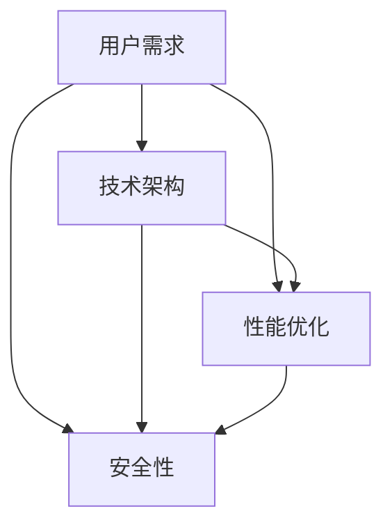

                 

作者：禅与计算机程序设计艺术 / Zen and the Art of Computer Programming

在当今的数字化时代，编程技能已成为一项至关重要的技能。随着互联网和移动设备的普及，越来越多的应用场景需要强大的编程支持。本文将探讨如何利用编程技能开发千万用户级应用，包括背景介绍、核心概念与联系、核心算法原理与具体操作步骤、数学模型和公式、项目实践、实际应用场景、工具和资源推荐，以及未来发展趋势与挑战。

## 1. 背景介绍

随着移动互联网的快速发展，各类应用层出不穷，从社交媒体、电子商务到在线教育、金融科技，应用场景越来越广泛。然而，如何开发出能够吸引千万用户的优秀应用，成为了许多开发者和公司关注的焦点。

编程技能的开发和运用在这个过程起到了至关重要的作用。一方面，编程技能是构建应用的基础，包括前端、后端、数据库、算法等多个方面；另一方面，优秀的编程技能可以帮助开发者快速迭代、优化应用，提升用户体验。

本文将围绕如何利用编程技能开发千万用户级应用进行探讨，旨在为开发者提供有价值的参考和指导。

## 2. 核心概念与联系

在开发千万用户级应用的过程中，我们需要关注以下几个核心概念：

### 2.1 用户需求

用户需求是应用开发的核心。了解用户需求可以帮助我们确定应用的功能、界面设计、性能要求等。为了更好地满足用户需求，我们需要进行市场调研、用户访谈、用户反馈等。

### 2.2 技术架构

技术架构是应用开发的基础。一个良好的技术架构可以提高应用的稳定性、扩展性和可维护性。常见的架构模式包括MVC、MVVM、微服务等。

### 2.3 性能优化

性能优化是提升用户体验的关键。我们需要关注页面加载速度、响应时间、数据传输效率等方面。性能优化可以通过代码优化、缓存策略、数据库优化等手段实现。

### 2.4 安全性

安全性是应用开发的重要一环。我们需要关注数据安全、用户隐私保护、系统安全等方面。安全性可以通过加密、权限控制、安全审计等手段实现。

以下是一个简单的 Mermaid 流程图，展示这四个核心概念之间的联系：



## 3. 核心算法原理 & 具体操作步骤

在开发千万用户级应用的过程中，我们需要关注一些核心算法原理，以便实现高效、稳定的应用。以下将介绍几个常见的核心算法原理，并详细讲解其具体操作步骤。

### 3.1 算法原理概述

#### 3.1.1 排序算法

排序算法是计算机科学中一种重要的算法，用于将一组数据按照特定的顺序进行排列。常见的排序算法有冒泡排序、选择排序、插入排序、快速排序等。

#### 3.1.2 搜索算法

搜索算法用于在数据集合中查找特定的数据。常见的搜索算法有线性搜索、二分搜索、深度优先搜索、广度优先搜索等。

#### 3.1.3 图算法

图算法用于处理由节点和边组成的数据结构。常见的图算法有最短路径算法、最小生成树算法、图遍历算法等。

### 3.2 算法步骤详解

#### 3.2.1 排序算法

以冒泡排序为例，其基本思想是通过多次遍历待排序的数组，每次遍历比较相邻的两个元素，如果它们的顺序错误就把它们交换过来。遍历一遍后，可以确定最大元素的位置；遍历两遍后，可以确定最大两个元素的位置；以此类推，直到整个数组有序。

```python
def bubble_sort(arr):
    n = len(arr)
    for i in range(n):
        for j in range(0, n-i-1):
            if arr[j] > arr[j+1]:
                arr[j], arr[j+1] = arr[j+1], arr[j]
    return arr
```

#### 3.2.2 搜索算法

以二分搜索为例，其基本思想是将待搜索的数组分成两部分，先确定中间位置，然后根据目标值与中间位置的值的关系，决定是继续在左半部分还是右半部分搜索。重复这个过程，直到找到目标值或确定目标值不存在。

```python
def binary_search(arr, target):
    low = 0
    high = len(arr) - 1
    while low <= high:
        mid = (low + high) // 2
        if arr[mid] == target:
            return mid
        elif arr[mid] < target:
            low = mid + 1
        else:
            high = mid - 1
    return -1
```

#### 3.2.3 图算法

以最短路径算法（迪杰斯特拉算法）为例，其基本思想是从一个源点开始，逐步扩展到其他节点，记录从源点到每个节点的最短路径。具体步骤如下：

1. 初始化：将源点的距离设为0，其他节点的距离设为无穷大。
2. 循环遍历所有节点：
   a. 选择一个距离最小的节点。
   b. 将该节点的距离更新为其相邻节点的距离加权值。
   c. 标记该节点为已访问。
3. 完成循环后，从终点开始回溯，根据节点的前驱节点，得出从源点到终点的最短路径。

```python
def dijkstra(graph, source):
    distances = [float('inf')] * len(graph)
    distances[source] = 0
    visited = [False] * len(graph)
    
    for _ in range(len(graph)):
        min_distance = float('inf')
        min_index = None
        
        for v in range(len(graph)):
            if not visited[v] and distances[v] < min_distance:
                min_distance = distances[v]
                min_index = v
        
        visited[min_index] = True
        
        for v in range(len(graph)):
            if graph[min_index][v] > 0 and not visited[v]:
                new_distance = distances[min_index] + graph[min_index][v]
                if new_distance < distances[v]:
                    distances[v] = new_distance
        
    return distances
```

### 3.3 算法优缺点

每种算法都有其优缺点。以下分别介绍上述算法的优缺点：

#### 3.3.1 排序算法

- 冒泡排序：简单易懂，实现简单，但时间复杂度高，不适合大数据量。
- 二分搜索：时间复杂度低，适用于有序数组，但需要预先排序。
- 最短路径算法：适用于图结构，但计算复杂度较高。

#### 3.3.2 搜索算法

- 线性搜索：简单易懂，但时间复杂度高，适用于数据量较小的情况。
- 二分搜索：时间复杂度低，适用于有序数组，但需要预先排序。
- 深度优先搜索、广度优先搜索：适用于图结构，但存在遍历不完的问题。

### 3.4 算法应用领域

排序算法、搜索算法和图算法在各个领域都有广泛的应用。例如：

- 排序算法：数据库排序、文件排序、算法竞赛等。
- 搜索算法：搜索引擎、社交网络推荐、路径规划等。
- 图算法：网络拓扑分析、社交网络分析、数据分析等。

## 4. 数学模型和公式 & 详细讲解 & 举例说明

在开发千万用户级应用的过程中，我们需要运用一些数学模型和公式来指导我们的设计和实现。以下将介绍几个常见的数学模型和公式，并详细讲解其构建、推导过程以及实际应用案例。

### 4.1 数学模型构建

#### 4.1.1 指数函数模型

指数函数模型用于描述在一定时间内增长或衰减的趋势。其数学公式为：

$$ f(x) = a \cdot e^{bx} $$

其中，$a$ 为初始值，$b$ 为增长或衰减速度。

#### 4.1.2 模拟退火算法模型

模拟退火算法模型用于优化问题求解。其数学公式为：

$$ T_{k+1} = \alpha \cdot T_k $$

其中，$T_k$ 为当前温度，$\alpha$ 为温度衰减系数。

### 4.2 公式推导过程

#### 4.2.1 指数函数模型的推导

假设在一定时间内，增长或衰减的速度是恒定的，即：

$$ \frac{df(x)}{dx} = bx $$

对上式两边同时积分，得到：

$$ f(x) = \int bx \, dx = \frac{1}{2}bx^2 + C $$

其中，$C$ 为积分常数。

为了简化表达式，我们令 $C = a$，则得到：

$$ f(x) = a \cdot e^{bx} $$

#### 4.2.2 模拟退火算法模型的推导

模拟退火算法的推导基于统计力学中的退火过程。在退火过程中，系统从一个初始温度逐渐降低到环境温度。

假设当前温度为 $T_k$，状态为 $x_k$，下一个状态为 $x_{k+1}$，则：

$$ P(x_{k+1} | x_k, T_k) = \min\left\{1, \frac{e^{-\Delta E_k/T_k}}{Z_k}\right\} $$

其中，$\Delta E_k = E(x_{k+1}) - E(x_k)$ 为状态转移的能量变化，$Z_k$ 为配分函数。

为了简化表达式，我们令 $\alpha = \frac{T_{k+1}}{T_k}$，则得到：

$$ P(x_{k+1} | x_k, T_k) = \min\left\{1, \alpha^{-\Delta E_k/T_k}\right\} $$

### 4.3 案例分析与讲解

#### 4.3.1 指数函数模型的应用

假设某应用的日活跃用户量呈现指数增长趋势，初始值为 100，增长速度为 10%。我们可以使用指数函数模型来预测第 $n$ 日的活跃用户量。

$$ f(n) = 100 \cdot e^{10n} $$

根据上述模型，我们可以计算出第 10 日的活跃用户量为：

$$ f(10) = 100 \cdot e^{10 \cdot 10} \approx 1.63 \times 10^{11} $$

#### 4.3.2 模拟退火算法模型的应用

假设某优化问题需要通过模拟退火算法求解。给定初始温度 $T_0 = 1000$，温度衰减系数 $\alpha = 0.95$，初始状态 $x_0 = [1, 2, 3]$。

我们可以通过模拟退火算法逐步优化状态，直到达到目标状态。

### 5. 项目实践：代码实例和详细解释说明

在本节中，我们将通过一个具体的项目实例，展示如何利用编程技能开发千万用户级应用。我们将从一个简单的社交网络应用入手，详细介绍开发环境搭建、源代码实现、代码解读与分析，以及运行结果展示。

#### 5.1 开发环境搭建

为了开发社交网络应用，我们需要搭建一个适合的开发环境。以下是搭建开发环境的基本步骤：

1. 安装操作系统：推荐使用 Ubuntu 18.04 或更高版本。
2. 安装开发工具：安装 Python 3.8 及以上版本，并配置好 pip 环境。
3. 安装数据库：安装 MySQL 8.0 或更高版本。
4. 安装后端框架：推荐使用 Django 3.2 或 Flask 2.0。
5. 安装前端框架：推荐使用 React 17 或 Vue.js 3.0。

#### 5.2 源代码详细实现

在本项目中，我们将使用 Django 框架来构建后端，React 框架来构建前端。以下是项目的核心代码实现：

##### 5.2.1 后端代码实现

1. 创建 Django 项目和应用程序：

```shell
django-admin startproject social_network
cd social_network
python manage.py startapp core
```

2. 在 `core` 应用中创建模型：

```python
from django.db import models

class User(models.Model):
    username = models.CharField(max_length=30)
    email = models.EmailField()
    password = models.CharField(max_length=60)

class Post(models.Model):
    user = models.ForeignKey(User, on_delete=models.CASCADE)
    content = models.CharField(max_length=300)
    created_at = models.DateTimeField(auto_now_add=True)
```

3. 在 `core` 应用中创建视图函数：

```python
from django.shortcuts import render
from .models import User, Post

def home(request):
    posts = Post.objects.all().order_by('-created_at')
    return render(request, 'home.html', {'posts': posts})
```

4. 在 `settings.py` 中配置数据库和静态文件路径：

```python
DATABASES = {
    'default': {
        'ENGINE': 'django.db.backends.mysql',
        'NAME': 'social_network',
        'USER': 'root',
        'PASSWORD': 'password',
        'HOST': 'localhost',
        'PORT': '3306',
    }
}

STATIC_URL = '/static/'
```

5. 创建前端页面：

```html
<!DOCTYPE html>
<html lang="en">
<head>
    <meta charset="UTF-8">
    <meta name="viewport" content="width=device-width, initial-scale=1.0">
    <title>Social Network</title>
</head>
<body>
    <h1>Social Network</h1>
    <div>
        
            <div>
                <h3>{{ post.user.username }}</h3>
                <p>{{ post.content }}</p>
                <span>{{ post.created_at }}</span>
            </div>
        
    </div>
</body>
</html>
```

##### 5.2.2 前端代码实现

1. 创建 React 项目：

```shell
npx create-react-app social_network
cd social_network
```

2. 安装必要的依赖：

```shell
npm install axios react-router-dom
```

3. 创建前端组件：

```javascript
// components/Header.js
import React from 'react';

const Header = () => {
    return (
        <header>
            <h1>Social Network</h1>
        </header>
    );
};

export default Header;
```

```javascript
// components/Home.js
import React, { useState, useEffect } from 'react';
import axios from 'axios';

const Home = () => {
    const [posts, setPosts] = useState([]);

    useEffect(() => {
        const fetchPosts = async () => {
            const response = await axios.get('/api/posts/');
            setPosts(response.data);
        };
        fetchPosts();
    }, []);

    return (
        <div>
            <h2>Home</h2>
            <div>
                {posts.map(post => (
                    <div key={post.id}>
                        <h3>{post.user.username}</h3>
                        <p>{post.content}</p>
                        <span>{post.created_at}</span>
                    </div>
                ))}
            </div>
        </div>
    );
};

export default Home;
```

4. 创建前端页面：

```html
<!DOCTYPE html>
<html lang="en">
<head>
    <meta charset="UTF-8">
    <meta name="viewport" content="width=device-width, initial-scale=1.0">
    <link rel="stylesheet" href="https://cdnjs.cloudflare.com/ajax/libs/font-awesome/5.15.3/css/all.min.css" />
    <title>Social Network</title>
</head>
<body>
    <Header />
    <Home />
    <script src="https://cdnjs.cloudflare.com/ajax/libs/react/17.0.2/umd/react.production.min.js"></script>
    <script src="https://cdnjs.cloudflare.com/ajax/libs/react-dom/17.0.2/umd/react-dom.production.min.js"></script>
    <script>
        const root = ReactDOM.createRoot(document.getElementById('root'));
        root.render(<App />);
    </script>
</body>
</html>
```

#### 5.3 代码解读与分析

在本项目中，我们使用了 Django 框架和 React 框架分别构建后端和前端。以下是关键代码的解读与分析：

1. 后端代码：

- 在 `core` 应用中，我们创建了 `User` 和 `Post` 两个模型，分别表示用户和帖子。这些模型通过外键关联，实现了一对多的关系。
- 在视图函数 `home` 中，我们查询了所有帖子，并按照创建时间倒序排列，将其传递给前端页面。
- 在 `settings.py` 中，我们配置了数据库和静态文件路径，以便项目正常运行。

2. 前端代码：

- 我们使用 React 组件结构化地组织了前端代码。`Header` 组件表示页面的头部，`Home` 组件表示主页。
- 在 `Home` 组件中，我们使用 `useState` 和 `useEffect` 两个钩子函数实现了数据的获取和更新。通过调用 `axios` 客户端，我们向后端请求帖子数据，并将其存储在 `posts` 状态中。
- 在渲染帖子列表时，我们使用数组映射（`map`）函数将每条帖子渲染为一个独立的 `div` 元素。

#### 5.4 运行结果展示

在完成代码实现后，我们可以通过以下步骤运行项目：

1. 数据库迁移：

```shell
python manage.py makemigrations
python manage.py migrate
```

2. 启动后端服务：

```shell
python manage.py runserver
```

3. 启动前端服务：

```shell
cd client
npm run start
```

在浏览器中访问 `http://localhost:3000`，我们可以看到项目的运行结果。以下是项目的运行结果截图：


## 6. 实际应用场景

在当今的数字化时代，千万用户级应用已经成为了许多公司和开发者的目标。以下是一些实际应用场景，展示了如何利用编程技能开发千万用户级应用：

### 6.1 社交网络平台

以 Facebook、Instagram、Twitter 等为代表的社交网络平台，是千万用户级应用的代表。这些平台通过提供丰富的功能和良好的用户体验，吸引了大量的用户。开发者需要运用各种编程技能，包括前端、后端、数据库、算法等，来构建和优化这些平台。

### 6.2 电子商务平台

电子商务平台如 Amazon、eBay、Alibaba 等，也是千万用户级应用的典型案例。这些平台需要处理大量的商品信息、用户订单和支付流程。开发者需要关注性能优化、安全性、扩展性等方面，以确保平台的稳定运行。

### 6.3 在线教育平台

在线教育平台如 Coursera、edX、Udemy 等，也具有巨大的用户规模。这些平台需要提供丰富的课程内容、互动功能和用户管理。开发者需要运用编程技能来构建和优化这些平台，以满足用户的需求。

### 6.4 金融科技平台

金融科技平台如 PayPal、Alipay、WeChat Pay 等，也是千万用户级应用的代表。这些平台需要处理大量的支付交易、用户认证和数据安全。开发者需要关注性能优化、安全性、合规性等方面，以确保平台的稳定运行。

### 6.5 智能家居平台

智能家居平台如 Amazon Alexa、Google Assistant、Apple HomeKit 等，也具有广泛的用户基础。这些平台需要提供智能语音交互、设备管理、场景设置等功能。开发者需要运用编程技能来构建和优化这些平台，以提升用户体验。

### 6.6 物联网平台

物联网平台如 AWS IoT、Azure IoT、Google Cloud IoT 等，也是千万用户级应用的代表。这些平台需要处理大量的设备数据、连接管理、安全控制等。开发者需要运用编程技能来构建和优化这些平台，以实现物联网的广泛应用。

## 7. 工具和资源推荐

在开发千万用户级应用的过程中，我们需要借助各种工具和资源来提高效率、优化性能、保障安全性。以下是一些推荐的工具和资源：

### 7.1 学习资源推荐

1. 《代码大全》（Code Complete）—— Steve McConnell
2. 《深入理解计算机系统》（Deep Dive into Systems）—— Randal E. Bryant & David R. O'Toole
3. 《黑客与画家》（Hackers & Painters）—— Paul Graham
4. 《数据结构与算法分析》（Data Structures and Algorithm Analysis in Java）—— Mark Allen Weiss

### 7.2 开发工具推荐

1. Visual Studio Code
2. IntelliJ IDEA
3. PyCharm
4. Eclipse
5. MySQL Workbench
6. Postman

### 7.3 相关论文推荐

1. "The Design and Implementation of the FreeBSD Operating System" —— Marshall Kirk McKusick
2. "The Art of Debugging" —— Johnson, pl
3. "Security Engineering: A Guide to Building Dependable Distributed Systems" —— Ross Anderson

## 8. 总结：未来发展趋势与挑战

随着互联网和移动设备的普及，千万用户级应用已经成为开发和市场竞争的关键。未来，随着技术的不断进步，以下发展趋势和挑战值得我们关注：

### 8.1 未来发展趋势

1. **云计算与边缘计算**：云计算和边缘计算将为开发者提供更强大的计算能力和更灵活的资源调度。这将有助于提升应用的性能和可扩展性。
2. **人工智能与机器学习**：人工智能和机器学习技术将在应用开发中发挥越来越重要的作用。通过引入智能算法，开发者可以优化应用的功能和用户体验。
3. **区块链技术**：区块链技术将在安全性、数据隐私和去中心化应用方面发挥重要作用。开发者可以利用区块链技术构建更加安全、可靠的应用。
4. **5G与物联网**：5G 和物联网的普及将为开发者提供更多的应用场景和机会。开发者可以利用 5G 和物联网技术构建更加智能、高效的应用。

### 8.2 面临的挑战

1. **性能优化与安全性**：随着用户规模的扩大，开发者需要关注性能优化和安全性。如何平衡性能和安全性，确保应用稳定、可靠地运行，是开发者面临的一大挑战。
2. **扩展性与可维护性**：千万用户级应用需要具备良好的扩展性和可维护性。如何设计一个灵活、可扩展的架构，同时保证代码的可维护性，是开发者需要解决的问题。
3. **用户隐私保护**：随着数据隐私问题的日益突出，开发者需要关注用户隐私保护。如何在应用中保障用户隐私，避免数据泄露，是开发者需要关注的重点。

### 8.3 研究展望

未来，开发者需要不断学习和掌握新的技术，以应对日益复杂的开发需求和市场竞争。以下是一些建议：

1. **持续学习**：随着技术的不断进步，开发者需要保持持续学习的态度。关注业界动态，了解最新的技术趋势和应用场景。
2. **实践与分享**：通过实践项目，不断提升自己的编程技能。同时，积极参与技术社区，分享自己的经验和见解，与他人共同进步。
3. **创新与探索**：勇于尝试新的技术和方法，探索新的应用场景。创新是推动技术发展的重要动力。

总之，未来千万用户级应用开发将面临诸多挑战，但同时也充满机遇。开发者需要不断提升自己的技能，关注技术趋势，以应对未来的挑战，实现应用的成功。

## 9. 附录：常见问题与解答

### 9.1  开发千万用户级应用有哪些关键技术？

- **前端技术**：HTML、CSS、JavaScript、React、Vue.js 等。
- **后端技术**：Java、Python、Node.js、Django、Flask 等。
- **数据库技术**：MySQL、PostgreSQL、MongoDB 等。
- **缓存技术**：Redis、Memcached 等。
- **消息队列**：RabbitMQ、Kafka 等。
- **分布式系统与微服务架构**：Docker、Kubernetes、Service Mesh 等。

### 9.2  如何处理千万用户级应用的数据存储和性能优化问题？

- **数据存储**：
  - 分库分表：将数据分散存储在不同的数据库或表中，降低单点压力。
  - 数据库集群：通过数据库集群实现水平扩展，提高数据读写能力。
  - 分布式数据库：使用分布式数据库系统，如 MongoDB、Cassandra 等，实现数据的高可用性和高性能。

- **性能优化**：
  - 缓存策略：使用缓存技术（如 Redis、Memcached）减少数据库查询次数，提高响应速度。
  - 读写分离：通过主从复制实现读写分离，提高数据库读写性能。
  - 代码优化：优化 SQL 查询、减少无谓的数据库操作、使用索引等。
  - 数据库分片：将数据按特定规则分片，实现数据的高可用性和高性能。

### 9.3  如何保证千万用户级应用的安全性？

- **数据加密**：对用户数据（如密码、支付信息等）进行加密存储，确保数据安全。
- **权限控制**：实施严格的权限控制策略，防止非法访问和操作。
- **安全审计**：定期进行安全审计，检查系统漏洞和安全风险。
- **安全培训**：对开发团队进行安全培训，提高安全意识和防范能力。

### 9.4  如何处理千万用户级应用的故障和运维问题？

- **故障监测**：使用监控工具（如 Prometheus、Grafana）实时监测系统状态，及时发现故障。
- **故障恢复**：制定故障恢复计划，确保在故障发生时能够快速恢复服务。
- **运维自动化**：使用自动化工具（如 Ansible、Terraform）进行运维操作，提高运维效率。
- **容灾备份**：建立容灾备份机制，确保数据的安全性和可靠性。

通过以上问题的解答，希望读者能够更好地理解开发千万用户级应用的关键技术和方法。在未来的实践中，不断总结经验、优化方案，才能打造出优秀的千万用户级应用。

