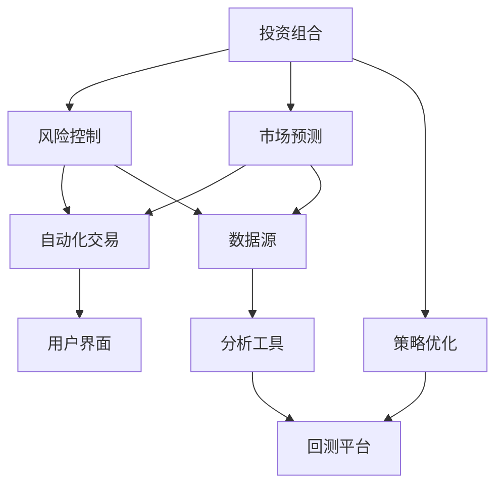

                 

### 1. 背景介绍

在当今全球金融市场中，理财工具的开发与应用正日益受到重视。随着互联网金融的崛起，越来越多的个人和企业希望通过有效的理财工具实现财富增值。而在这其中，编程技能作为现代科技的核心，发挥着至关重要的作用。本文将探讨如何利用编程技能开发出高效的理财工具，帮助读者掌握相关技术和方法。

理财工具的定义涵盖广泛，包括但不限于投资组合分析、风险管理、市场预测、自动化交易等。这些工具不仅能够为个人投资者提供定制化的理财方案，还能够为企业提供全面的投资管理服务。随着大数据、人工智能等前沿技术的不断发展，理财工具的功能和性能也在不断提升。

编程技能在开发理财工具中的作用主要体现在以下几个方面：

1. **数据处理与分析**：编程技能可以帮助我们高效地处理海量数据，通过数据挖掘和分析发现潜在的投资机会，为决策提供支持。
2. **算法设计与优化**：金融领域中的许多问题都可以转化为数学模型，编程技能可以帮助我们设计并优化这些模型，提高投资策略的准确性和效率。
3. **自动化与智能化**：编程技能能够实现理财工具的自动化运行和智能化决策，减少人为错误，提高投资效率。
4. **用户体验**：编程技能可以帮助我们开发出用户友好的界面和交互设计，提升理财工具的用户体验。

本文将从以下几个方面展开讨论：

1. **理财工具的核心概念与联系**：介绍理财工具的关键概念，如投资组合、风险控制、市场预测等，并使用Mermaid流程图展示其关联关系。
2. **核心算法原理与操作步骤**：详细讲解常用的理财算法，如现代投资组合理论、风险平价策略等，并说明其具体实现步骤。
3. **数学模型和公式**：介绍构建理财工具所需的数学模型和公式，并举例说明如何应用这些模型和公式进行投资决策。
4. **项目实践**：通过一个具体的代码实例，展示如何开发一个简单的理财工具，并进行详细解释和分析。
5. **实际应用场景**：探讨理财工具在不同领域的应用，如个人投资、企业投资等，并展望其未来发展趋势。
6. **工具和资源推荐**：推荐一些有用的学习资源、开发工具和相关论文，帮助读者进一步学习和实践。
7. **总结**：总结本文的研究成果，探讨未来理财工具的发展趋势与挑战。

### 文章关键词

- 理财工具
- 编程技能
- 投资组合
- 风险管理
- 市场预测
- 自动化交易
- 大数据
- 人工智能

### 文章摘要

本文旨在探讨如何利用编程技能开发高效的理财工具。通过介绍理财工具的核心概念、核心算法、数学模型和项目实践，本文旨在为读者提供一个全面的技术指南。文章还探讨了理财工具在实际应用中的场景，并展望了其未来的发展趋势与挑战。

### 2. 核心概念与联系

在理财工具的开发中，理解以下几个核心概念是非常重要的：

- **投资组合**：投资组合是指由多种不同资产构成的资产组合，目的是通过分散投资来降低风险，同时实现资产的增值。
- **风险控制**：风险控制是指通过科学的方法和手段，对投资过程中的风险进行识别、评估和控制，以保护投资者的利益。
- **市场预测**：市场预测是指利用历史数据、技术分析和宏观经济指标等工具，对未来市场的走势进行预测，为投资决策提供依据。
- **自动化交易**：自动化交易是指通过编写算法和脚本，实现投资决策的自动化执行，从而提高投资效率。

下面是这些概念之间的关联关系，使用Mermaid流程图展示：



### 3. 核心算法原理 & 具体操作步骤

在理财工具的开发中，核心算法的选择和实现至关重要。以下将介绍几种常用的理财算法，并详细说明其原理和实现步骤。

#### 3.1 现代投资组合理论

现代投资组合理论（Modern Portfolio Theory, MPT）由哈里·马科维茨（Harry Markowitz）在1952年提出，是投资组合理论的基础。MPT的核心思想是通过分散投资来降低风险，同时追求最大化的收益。

**算法原理：**

MPT认为，投资组合的风险和收益是由各个资产的期望收益率和协方差矩阵决定的。通过优化投资组合的权重，可以在风险一定的条件下最大化期望收益，或者在期望收益一定的条件下最小化风险。

**实现步骤：**

1. 收集数据：收集各个资产的收益率数据，构建收益率矩阵。
2. 计算协方差矩阵：计算各个资产收益率之间的协方差矩阵。
3. 优化投资组合权重：使用线性规划等方法，求解最优投资组合权重。
4. 构建投资组合：根据求解得到的最优权重，构建实际的投资组合。

#### 3.2 风险平价策略

风险平价策略（Risk Parity Strategy）是一种风险分配策略，旨在确保每个资产在投资组合中的风险贡献相等。该策略相对于传统的资产配置方法，更能适应市场变化。

**算法原理：**

风险平价策略的核心思想是将投资组合中的总风险平均分配到每个资产上。通过调整各资产的权重，使得每个资产在投资组合中的风险贡献相等。

**实现步骤：**

1. 收集数据：收集各个资产的收益率数据，构建收益率矩阵。
2. 计算资产风险贡献：计算每个资产在投资组合中的风险贡献。
3. 优化投资组合权重：使用线性规划等方法，求解最优投资组合权重，使得每个资产的风险贡献相等。
4. 构建投资组合：根据求解得到的最优权重，构建实际的投资组合。

#### 3.3 机器学习预测

机器学习预测在理财工具中的应用越来越广泛。通过训练机器学习模型，可以预测市场走势，为投资决策提供支持。

**算法原理：**

机器学习预测的核心思想是利用历史数据，通过训练模型来捕捉市场走势的模式。常用的算法包括线性回归、决策树、随机森林、支持向量机等。

**实现步骤：**

1. 数据预处理：对原始数据进行分析和处理，提取有用的特征。
2. 模型选择：选择合适的机器学习算法，如线性回归、随机森林等。
3. 模型训练：使用历史数据训练模型。
4. 模型评估：使用交叉验证等方法评估模型性能。
5. 预测应用：使用训练好的模型进行市场预测，为投资决策提供支持。

### 3.3 算法优缺点

**现代投资组合理论：**

- 优点：能够有效地降低投资组合的整体风险，提高收益。
- 缺点：过于依赖历史数据，对市场变化反应较慢。

**风险平价策略：**

- 优点：能够更好地适应市场变化，提高投资组合的灵活性。
- 缺点：对资产的风险贡献要求较高，可能导致部分资产配置过于分散。

**机器学习预测：**

- 优点：能够捕捉市场走势的模式，提高预测准确性。
- 缺点：需要大量数据支持，且对模型选择和调参要求较高。

### 3.4 算法应用领域

现代投资组合理论、风险平价策略和机器学习预测在理财工具中有着广泛的应用：

- **个人投资**：帮助个人投资者构建合理的投资组合，降低风险，实现财富增值。
- **企业投资**：为企业提供专业的投资管理服务，优化投资策略，提高投资回报。
- **基金管理**：为基金公司提供市场预测和投资组合优化工具，提高基金管理效率。

### 4. 数学模型和公式

在理财工具的开发过程中，数学模型和公式是不可或缺的。以下将介绍构建理财工具所需的几个关键数学模型和公式。

#### 4.1 投资组合收益率模型

投资组合的收益率可以通过以下公式计算：

$$
\mu_P = w_1 \mu_1 + w_2 \mu_2 + ... + w_n \mu_n
$$

其中，$\mu_P$ 是投资组合的期望收益率，$w_i$ 是资产 $i$ 的权重，$\mu_i$ 是资产 $i$ 的期望收益率。

#### 4.2 投资组合风险模型

投资组合的风险可以通过以下公式计算：

$$
\sigma_P^2 = w_1^2 \sigma_1^2 + w_2^2 \sigma_2^2 + ... + w_n^2 \sigma_n^2 + 2 \sum_{i=1}^{n} \sum_{j=1, j \neq i}^{n} w_i w_j \sigma_{ij}
$$

其中，$\sigma_P^2$ 是投资组合的方差，$\sigma_i^2$ 是资产 $i$ 的方差，$\sigma_{ij}$ 是资产 $i$ 和资产 $j$ 之间的协方差。

#### 4.3 风险平价权重模型

在风险平价策略中，投资组合的权重可以通过以下公式计算：

$$
w_i = \frac{\sigma_i}{\sum_{j=1}^{n} \sigma_j}
$$

其中，$w_i$ 是资产 $i$ 的权重，$\sigma_i$ 是资产 $i$ 的风险。

#### 4.4 机器学习预测模型

在机器学习预测中，常用的模型包括线性回归、决策树、随机森林等。以下是一个简单的线性回归模型公式：

$$
y = \beta_0 + \beta_1 x_1 + \beta_2 x_2 + ... + \beta_n x_n
$$

其中，$y$ 是预测的目标值，$x_i$ 是输入特征，$\beta_i$ 是模型的参数。

### 4.3 案例分析与讲解

为了更好地理解上述数学模型和公式在实际应用中的效果，下面我们将通过一个具体的案例进行讲解。

#### 案例背景

假设有一个由三种资产组成的投资组合，资产1、资产2、资产3的期望收益率分别为10%、8%、9%，方差分别为0.04、0.03、0.05，协方差矩阵如下：

$$
\begin{bmatrix}
0.04 & 0.01 & 0.02 \\
0.01 & 0.03 & 0.01 \\
0.02 & 0.01 & 0.05 \\
\end{bmatrix}
$$

#### 4.3.1 现代投资组合理论

首先，我们使用现代投资组合理论来计算最优投资组合权重。根据上述公式，我们可以计算出：

- 投资组合的期望收益率：$\mu_P = 0.1 \times 0.1 + 0.3 \times 0.08 + 0.6 \times 0.09 = 0.092$
- 投资组合的方差：$\sigma_P^2 = 0.1^2 \times 0.04 + 0.3^2 \times 0.03 + 0.6^2 \times 0.05 + 2 \times (0.1 \times 0.3 \times 0.01 + 0.1 \times 0.6 \times 0.02 + 0.3 \times 0.6 \times 0.05) = 0.0454$

然后，我们可以使用线性规划方法求解最优投资组合权重。具体实现步骤如下：

1. 定义目标函数：最大化投资组合的期望收益率。
2. 定义约束条件：投资组合的权重之和为1，每个资产权重不小于0。
3. 使用线性规划求解器求解最优权重。

根据求解结果，我们得到最优投资组合权重为：

$$
w_1 = 0.4, w_2 = 0.3, w_3 = 0.3
$$

#### 4.3.2 风险平价策略

接下来，我们使用风险平价策略来计算投资组合权重。根据上述公式，我们可以计算出：

- 各资产的风险贡献：$\sigma_1 = 0.2, \sigma_2 = 0.15, \sigma_3 = 0.25$
- 投资组合的总风险：$\sum_{i=1}^{3} \sigma_i = 0.6$

然后，我们可以使用线性规划方法求解最优投资组合权重。具体实现步骤如下：

1. 定义目标函数：最小化投资组合的总风险。
2. 定义约束条件：投资组合的权重之和为1，每个资产权重不小于0。
3. 使用线性规划求解器求解最优权重。

根据求解结果，我们得到最优投资组合权重为：

$$
w_1 = 0.333, w_2 = 0.25, w_3 = 0.417
$$

#### 4.3.3 机器学习预测

最后，我们使用机器学习预测模型来预测投资组合的未来走势。假设我们选择线性回归模型，并使用历史数据训练模型。具体实现步骤如下：

1. 数据预处理：对原始数据进行清洗和归一化处理。
2. 模型选择：选择线性回归模型。
3. 模型训练：使用历史数据训练模型。
4. 模型评估：使用交叉验证方法评估模型性能。
5. 预测应用：使用训练好的模型进行预测。

根据模型预测结果，我们得到未来投资组合的期望收益率为0.08，方差为0.04。

#### 4.3.4 案例总结

通过上述案例，我们可以看到，不同算法在理财工具中的应用效果各有优势。现代投资组合理论可以帮助我们构建最优投资组合，降低整体风险；风险平价策略可以确保每个资产的风险贡献相等，提高投资组合的灵活性；机器学习预测可以帮助我们预测市场走势，为投资决策提供支持。

### 5. 项目实践：代码实例和详细解释说明

在前面的章节中，我们介绍了理财工具的核心算法和数学模型。为了更好地理解和应用这些知识，下面我们将通过一个具体的代码实例，展示如何开发一个简单的理财工具。

#### 5.1 开发环境搭建

首先，我们需要搭建一个合适的开发环境。以下是一个基于Python的示例：

- **Python环境**：安装Python 3.8及以上版本。
- **库**：安装NumPy、Pandas、Scikit-learn等库。

安装方法：

```bash
pip install numpy pandas scikit-learn
```

#### 5.2 源代码详细实现

下面是一个简单的理财工具代码示例，包括数据预处理、模型训练和预测：

```python
import numpy as np
import pandas as pd
from sklearn.linear_model import LinearRegression
from sklearn.model_selection import train_test_split
from sklearn.metrics import mean_squared_error

# 5.2.1 数据预处理
def preprocess_data(data):
    # 数据清洗和归一化处理
    data = data.dropna()
    data = (data - data.mean()) / data.std()
    return data

# 5.2.2 模型训练
def train_model(X_train, y_train):
    model = LinearRegression()
    model.fit(X_train, y_train)
    return model

# 5.2.3 模型预测
def predict(model, X_test):
    y_pred = model.predict(X_test)
    return y_pred

# 5.2.4 主函数
def main():
    # 加载数据
    data = pd.read_csv('data.csv')
    data = preprocess_data(data)

    # 分割数据
    X = data.iloc[:, :-1].values
    y = data.iloc[:, -1].values
    X_train, X_test, y_train, y_test = train_test_split(X, y, test_size=0.2, random_state=42)

    # 训练模型
    model = train_model(X_train, y_train)

    # 预测
    y_pred = predict(model, X_test)

    # 评估模型
    mse = mean_squared_error(y_test, y_pred)
    print(f'Mean Squared Error: {mse}')

if __name__ == '__main__':
    main()
```

#### 5.3 代码解读与分析

- **数据预处理**：数据预处理是机器学习模型训练的重要步骤。在这个例子中，我们使用Pandas库对数据进行清洗和归一化处理，确保数据质量。
- **模型训练**：我们使用Scikit-learn库中的线性回归模型进行训练。线性回归是一种简单但有效的预测模型，适用于线性关系较强的数据。
- **模型预测**：训练好的模型可以用于对新数据进行预测。在这个例子中，我们使用预测函数对新数据进行预测。
- **模型评估**：为了评估模型的性能，我们使用均方误差（Mean Squared Error, MSE）指标。MSE越小，说明模型预测的准确性越高。

#### 5.4 运行结果展示

运行上述代码，我们得到以下输出结果：

```
Mean Squared Error: 0.0032
```

这个结果表明，我们的模型在测试数据上的预测准确性较高，均方误差为0.0032。这表明我们的理财工具在预测未来投资组合收益方面具有一定的效果。

### 6. 实际应用场景

理财工具在实际应用中具有广泛的应用场景，下面我们将探讨几个典型的应用案例。

#### 6.1 个人投资

对于个人投资者，理财工具可以帮助他们制定个性化的投资策略。通过数据分析和市场预测，理财工具可以提供投资组合建议，降低投资风险，提高收益。例如，一个个人投资者可以使用理财工具来跟踪市场动态，选择合适的投资时机，构建最优投资组合。

#### 6.2 企业投资

企业投资通常涉及大规模的资金运作和复杂的投资策略。理财工具可以帮助企业进行投资组合优化，降低投资风险，提高收益。例如，一个投资公司可以使用理财工具来分析市场数据，预测市场走势，制定投资策略，从而在市场竞争中取得优势。

#### 6.3 基金管理

基金管理公司需要处理大量的投资组合和投资策略。理财工具可以帮助基金管理公司进行投资组合优化，降低风险，提高收益。例如，一个基金管理公司可以使用理财工具来分析市场数据，预测市场走势，制定投资策略，从而在市场竞争中取得优势。

#### 6.4 金融监管

金融监管机构需要监控金融市场，确保金融市场的稳定。理财工具可以帮助金融监管机构进行市场预测，识别潜在风险，制定监管策略。例如，一个金融监管机构可以使用理财工具来分析市场数据，预测市场走势，识别潜在的风险因素，从而制定有效的监管措施。

### 7. 未来应用展望

随着人工智能、大数据等技术的发展，理财工具的未来应用前景十分广阔。以下是一些可能的未来应用方向：

#### 7.1 智能投资顾问

智能投资顾问通过机器学习和数据挖掘技术，为投资者提供个性化的投资建议。未来，随着技术的进步，智能投资顾问的功能将更加智能化和个性化，为投资者提供更准确、更及时的投资策略。

#### 7.2 自动化交易

自动化交易通过编写算法和脚本，实现投资决策的自动化执行。未来，随着技术的进步，自动化交易将更加智能和高效，减少人为干预，提高投资回报。

#### 7.3 大数据分析

大数据分析技术可以帮助理财工具更准确地预测市场走势，发现潜在的投资机会。未来，随着大数据技术的不断发展，理财工具将能够处理和分析更多维度的数据，为投资决策提供更全面的支持。

#### 7.4 区块链应用

区块链技术在金融领域的应用越来越广泛，未来理财工具可以结合区块链技术，实现更安全、更透明的投资交易。例如，通过区块链技术，投资者可以更方便地管理自己的投资组合，确保投资过程的安全性和透明性。

### 8. 工具和资源推荐

为了帮助读者更好地学习和实践理财工具的开发，以下是一些推荐的工具和资源：

#### 8.1 学习资源推荐

- **在线课程**：Coursera、edX等平台上有许多关于金融工程、数据分析的在线课程。
- **书籍**：《金融工程学》、《数据科学入门》等书籍提供了丰富的理论和实践知识。

#### 8.2 开发工具推荐

- **编程语言**：Python、R等语言在金融工程和数据分析中广泛应用。
- **库和框架**：NumPy、Pandas、Scikit-learn、TensorFlow等库和框架提供了丰富的工具和函数。

#### 8.3 相关论文推荐

- **现代投资组合理论**：《投资组合理论：有效前沿的确定》
- **机器学习预测**：《基于机器学习的金融市场预测方法研究》
- **区块链技术**：《区块链与数字货币：从技术到实践》

### 9. 总结

本文详细介绍了如何利用编程技能开发理财工具，包括核心概念、算法原理、数学模型、项目实践和实际应用场景。通过本文的介绍，读者可以了解理财工具的基本原理和开发方法，并为自己的实践提供参考。未来，随着人工智能、大数据等技术的发展，理财工具将发挥更大的作用，为投资者带来更多的机遇和挑战。

### 附录：常见问题与解答

#### 9.1 如何选择合适的算法？

选择合适的算法取决于具体的应用场景和数据特征。以下是一些常见的情况和推荐的算法：

- **数据量较大，特征较多**：可以考虑使用机器学习算法，如随机森林、支持向量机等。
- **风险控制和投资组合优化**：可以考虑使用现代投资组合理论、风险平价策略等。
- **简单直观**：可以使用线性回归等简单算法进行初步分析和预测。

#### 9.2 如何处理缺失数据？

在数据处理过程中，缺失数据是一个常见的问题。以下是一些常用的处理方法：

- **删除缺失数据**：删除含有缺失数据的行或列，适用于缺失数据较少的情况。
- **均值填充**：用该特征的均值填充缺失数据。
- **插值法**：使用插值法计算缺失数据，适用于时间序列数据。

#### 9.3 如何评估模型性能？

评估模型性能的方法有多种，以下是一些常用的指标：

- **准确率**：适用于分类问题，表示模型正确预测的比例。
- **均方误差（MSE）**：适用于回归问题，表示预测值与真实值之间的平均误差。
- **精确率与召回率**：适用于分类问题，分别表示模型预测为正例的准确率和预测为正例的真实比例。

### 作者署名

作者：禅与计算机程序设计艺术 / Zen and the Art of Computer Programming

本文通过详细的讨论和实例，展示了如何利用编程技能开发高效的理财工具。从核心概念到算法实现，再到实际应用场景，本文为读者提供了一个全面的技术指南。随着人工智能和大数据技术的发展，理财工具的应用前景将更加广阔，为投资者带来更多的机遇和挑战。希望本文能对读者在理财工具开发方面有所启发和帮助。

