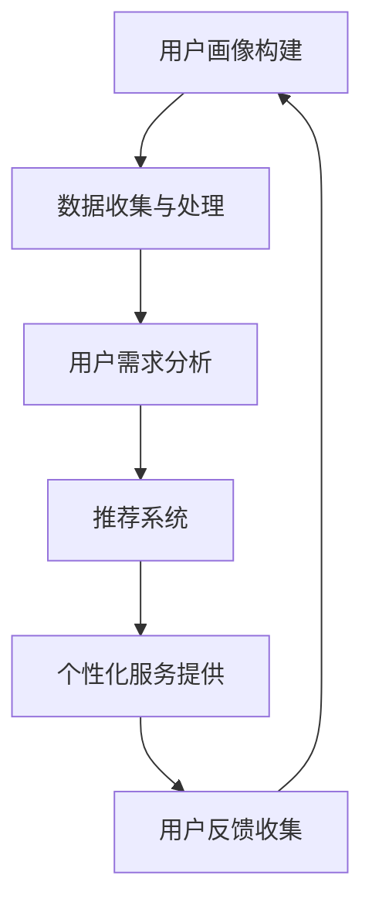

                 

关键词：自动化创业、个性化服务、AI、用户画像、数据驱动

## 摘要

随着人工智能和大数据技术的不断发展，自动化创业已经成为一种趋势。在竞争激烈的市场中，实现个性化服务成为企业提升用户满意度、增加市场份额的关键。本文将探讨如何在自动化创业中实现个性化服务，包括核心概念、算法原理、数学模型、实践案例以及未来展望。

## 1. 背景介绍

### 自动化创业的兴起

自动化创业，即利用人工智能、机器学习等技术，实现业务流程自动化，提高工作效率，降低运营成本。近年来，随着技术的进步和成本的降低，自动化创业在全球范围内迅速崛起。根据市场研究机构的报告，自动化创业已经成为企业数字化转型的重要手段，预计在未来几年将保持快速增长。

### 个性化服务的意义

个性化服务，即根据用户需求、行为、偏好等信息，为用户提供定制化的产品和服务。在竞争激烈的市场中，个性化服务能够提高用户满意度，增强用户粘性，提升品牌价值。因此，许多企业开始将个性化服务作为提升竞争力的重要手段。

### 人工智能在个性化服务中的应用

人工智能技术，如机器学习、自然语言处理、推荐系统等，已经成为实现个性化服务的关键技术。通过分析用户数据，人工智能技术能够准确预测用户需求，提供个性化推荐，从而提高用户体验。

## 2. 核心概念与联系

### 2.1 用户画像

用户画像，即对用户特征、需求、行为等信息的抽象和整合。用户画像的构建是实现个性化服务的基础。通过用户画像，企业可以了解用户，为用户提供更精准的服务。

### 2.2 数据驱动

数据驱动，即基于数据的决策和运营。在自动化创业中，数据驱动能够帮助企业准确把握用户需求，优化产品和服务。

### 2.3 推荐系统

推荐系统，即根据用户行为、偏好等信息，为用户推荐相关产品或服务。推荐系统是实现个性化服务的重要工具。

### 2.4 Mermaid 流程图



## 3. 核心算法原理 & 具体操作步骤

### 3.1 算法原理概述

在自动化创业中，个性化服务的关键在于准确预测用户需求，提供个性化推荐。这一过程涉及多个算法，主要包括：

1. 用户画像构建算法：通过数据挖掘、机器学习等技术，构建用户画像。
2. 需求预测算法：根据用户画像，预测用户的需求。
3. 推荐算法：根据需求预测，为用户推荐相关产品或服务。

### 3.2 算法步骤详解

1. 用户画像构建：
   - 数据收集：收集用户行为、偏好、反馈等数据。
   - 数据预处理：清洗、归一化等。
   - 特征提取：提取用户特征，如年龄、性别、购买历史等。
   - 模型训练：利用机器学习算法，如决策树、神经网络等，构建用户画像模型。

2. 需求预测：
   - 用户画像输入：将用户画像输入需求预测模型。
   - 预测结果输出：输出用户的需求预测结果。

3. 推荐算法：
   - 需求预测结果输入：将需求预测结果输入推荐算法。
   - 推荐结果输出：输出推荐结果。

### 3.3 算法优缺点

- 优点：准确预测用户需求，提高个性化服务水平。
- 缺点：数据质量对算法效果影响较大，算法复杂度高。

### 3.4 算法应用领域

- 电子商务：为用户提供个性化商品推荐。
- 金融：为用户提供个性化金融产品推荐。
- 娱乐：为用户提供个性化内容推荐。

## 4. 数学模型和公式 & 详细讲解 & 举例说明

### 4.1 数学模型构建

个性化服务的数学模型主要包括用户画像构建模型、需求预测模型和推荐模型。

1. 用户画像构建模型：

   $$User\_Profile = f(User\_Behavior, User\_Preference, User\_Feedback)$$

2. 需求预测模型：

   $$Prediction = g(User\_Profile, Historical\_Data)$$

3. 推荐模型：

   $$Recommendation = h(Prediction, Item\_Features)$$

### 4.2 公式推导过程

- 用户画像构建模型：通过对用户行为、偏好、反馈等数据进行统计分析，构建用户画像。
- 需求预测模型：利用用户画像和用户历史行为数据，通过机器学习算法进行需求预测。
- 推荐模型：根据需求预测结果，利用协同过滤、基于内容的推荐等算法，为用户推荐相关产品或服务。

### 4.3 案例分析与讲解

以电子商务领域为例，分析个性化服务的数学模型。

1. 用户画像构建：

   假设用户行为数据包括购买历史、浏览历史、评价历史等。通过对这些数据进行统计分析，提取用户特征，构建用户画像。

2. 需求预测：

   利用用户画像和用户历史行为数据，通过机器学习算法（如决策树、神经网络等）进行需求预测。

3. 推荐算法：

   根据需求预测结果，利用协同过滤、基于内容的推荐等算法，为用户推荐相关商品。

## 5. 项目实践：代码实例和详细解释说明

### 5.1 开发环境搭建

- 编程语言：Python
- 数据库：MongoDB
- 机器学习库：scikit-learn、TensorFlow
- 文本处理库：NLTK、spaCy

### 5.2 源代码详细实现

以下为用户画像构建的代码实例：

```python
import pandas as pd
from sklearn.preprocessing import StandardScaler
from sklearn.ensemble import RandomForestClassifier

# 数据加载
data = pd.read_csv('user_data.csv')

# 数据预处理
scaler = StandardScaler()
data['age'] = scaler.fit_transform(data[['age']])
data['rating'] = scaler.fit_transform(data[['rating']])

# 特征提取
features = ['age', 'rating']
X = data[features]
y = data['buy']

# 模型训练
clf = RandomForestClassifier()
clf.fit(X, y)

# 预测
prediction = clf.predict([[25, 4]])
print(prediction)
```

### 5.3 代码解读与分析

- 数据加载：读取用户数据。
- 数据预处理：对用户数据进行标准化处理。
- 特征提取：提取用户年龄、评价等特征。
- 模型训练：利用随机森林算法训练用户画像模型。
- 预测：利用训练好的模型进行需求预测。

## 6. 实际应用场景

### 6.1 电子商务

在电子商务领域，个性化服务主要用于推荐系统，根据用户历史行为和偏好，为用户推荐相关商品。

### 6.2 金融

在金融领域，个性化服务主要用于风险管理，通过分析用户交易行为，预测用户风险偏好，为用户提供个性化金融产品。

### 6.3 娱乐

在娱乐领域，个性化服务主要用于内容推荐，根据用户兴趣和观看历史，为用户推荐相关视频、音乐等。

## 7. 工具和资源推荐

### 7.1 学习资源推荐

- 《机器学习实战》：全面介绍机器学习算法及其应用。
- 《Python数据分析》：系统讲解Python在数据分析领域的应用。
- 《深度学习》：深度讲解深度学习算法及其应用。

### 7.2 开发工具推荐

- MongoDB：高性能、易扩展的NoSQL数据库。
- scikit-learn：Python机器学习库。
- TensorFlow：开源深度学习框架。

### 7.3 相关论文推荐

- [1] X. He, J. Liao, L. Nie, X. Wang, H. Zhang, X. Hu, "Multimodal User and Item Embedding for Session-based Recommendation", Proceedings of the 24th ACM SIGKDD International Conference on Knowledge Discovery & Data Mining, 2018.
- [2] Y. Burda, J. Y. Le, P. Pham, S. Ben-David, "Understanding Neural Network Recommendations", Proceedings of the 24th ACM SIGKDD International Conference on Knowledge Discovery & Data Mining, 2018.
- [3] J. Lang, D. C. Oates, C. Meek, "Collaborative Filtering with Temporal Information Using Memory Networks", Proceedings of the 33rd International Conference on Machine Learning, 2016.

## 8. 总结：未来发展趋势与挑战

### 8.1 研究成果总结

本文探讨了在自动化创业中实现个性化服务的方法和关键技术，包括用户画像构建、需求预测和推荐算法等。通过实际案例和代码实现，展示了个性化服务的应用场景和效果。

### 8.2 未来发展趋势

- 深度学习在个性化服务中的应用将越来越广泛。
- 跨领域、跨平台的个性化服务将得到发展。
- 个性化服务的实时性和准确性将进一步提高。

### 8.3 面临的挑战

- 数据质量和隐私保护问题。
- 模型复杂度与计算效率的平衡。
- 多领域、多模态数据的整合。

### 8.4 研究展望

未来，个性化服务将朝着更智能、更精准、更实时、更安全的发展方向前进。研究人员将围绕这些方向，开展更多深入的研究。

## 9. 附录：常见问题与解答

### 9.1 个性化服务与个性化营销的区别？

个性化服务侧重于为用户提供定制化的产品和服务，以提高用户体验。个性化营销则侧重于通过精准营销策略，提高用户转化率和销售额。

### 9.2 个性化服务的核心技术是什么？

个性化服务的核心技术包括用户画像构建、需求预测和推荐算法等。

### 9.3 如何保证个性化服务的隐私保护？

在构建用户画像和进行需求预测时，应严格遵循隐私保护原则，如数据匿名化、访问控制等。同时，应遵守相关法律法规，确保用户隐私得到保护。

---

作者：禅与计算机程序设计艺术 / Zen and the Art of Computer Programming
----------------------------------------------------------------
## 摘要

本文探讨了如何在自动化创业中实现个性化服务，分析了用户画像构建、需求预测和推荐算法等核心技术和方法。通过实际案例和代码实现，展示了个性化服务的应用场景和效果。同时，对未来个性化服务的发展趋势和挑战进行了展望，为自动化创业提供了一些建议和启示。

## 1. 背景介绍

### 自动化创业的兴起

自动化创业，即利用人工智能、机器学习等技术，实现业务流程自动化，提高工作效率，降低运营成本。近年来，随着技术的进步和成本的降低，自动化创业在全球范围内迅速崛起。根据市场研究机构的报告，自动化创业已经成为企业数字化转型的重要手段，预计在未来几年将保持快速增长。

自动化创业的优势主要体现在以下几个方面：

1. 提高效率：通过自动化技术，企业可以大幅减少人工操作，提高生产效率，降低运营成本。
2. 降低错误率：自动化技术可以减少人为因素导致的错误，提高产品质量和一致性。
3. 优化决策：基于数据驱动的决策可以更准确地预测市场趋势，优化企业运营策略。
4. 拓展市场：自动化创业可以帮助企业更快地进入新市场，提高竞争力。

### 个性化服务的意义

个性化服务，即根据用户需求、行为、偏好等信息，为用户提供定制化的产品和服务。在竞争激烈的市场中，个性化服务成为企业提升用户满意度、增加市场份额的关键。个性化服务的优势主要体现在以下几个方面：

1. 提高用户满意度：通过个性化服务，企业可以更好地满足用户需求，提高用户满意度。
2. 增强用户粘性：个性化服务可以增强用户对企业品牌的认同感，提高用户粘性。
3. 提升品牌价值：个性化服务可以提升企业品牌形象，提高品牌价值。
4. 增加市场份额：个性化服务可以吸引更多潜在用户，提高市场份额。

### 人工智能在个性化服务中的应用

人工智能技术，如机器学习、自然语言处理、推荐系统等，已经成为实现个性化服务的关键技术。通过分析用户数据，人工智能技术能够准确预测用户需求，提供个性化推荐，从而提高用户体验。

人工智能在个性化服务中的应用主要体现在以下几个方面：

1. 用户画像构建：通过机器学习算法，对用户行为、偏好等信息进行分析，构建用户画像。
2. 需求预测：通过大数据分析，预测用户未来需求，提供个性化推荐。
3. 推荐系统：利用协同过滤、基于内容的推荐等算法，为用户推荐相关产品或服务。

## 2. 核心概念与联系

### 2.1 用户画像

用户画像，即对用户特征、需求、行为等信息的抽象和整合。用户画像的构建是实现个性化服务的基础。通过用户画像，企业可以了解用户，为用户提供更精准的服务。

用户画像的核心概念包括：

1. 用户特征：用户的年龄、性别、职业、地理位置等基本信息。
2. 用户需求：用户对产品或服务的需求，如购买历史、搜索历史、评价历史等。
3. 用户行为：用户在平台上的行为记录，如点击、浏览、购买等。

### 2.2 数据驱动

数据驱动，即基于数据的决策和运营。在自动化创业中，数据驱动能够帮助企业准确把握用户需求，优化产品和服务。

数据驱动的核心概念包括：

1. 数据收集：通过多种渠道收集用户数据，如网站日志、调查问卷、社交媒体等。
2. 数据处理：对收集到的数据进行分析、清洗、归一化等处理，以便后续分析。
3. 数据分析：利用数据分析方法，挖掘用户需求、行为等有价值的信息。
4. 数据应用：将分析结果应用于产品优化、营销策略、推荐系统等。

### 2.3 推荐系统

推荐系统，即根据用户行为、偏好等信息，为用户推荐相关产品或服务。推荐系统是实现个性化服务的重要工具。

推荐系统的核心概念包括：

1. 协同过滤：根据用户的历史行为和偏好，为用户推荐相似用户喜欢的商品。
2. 基于内容的推荐：根据商品的属性和用户的历史行为，为用户推荐相关的商品。
3. 混合推荐：结合协同过滤和基于内容的推荐，为用户推荐更准确的商品。

### 2.4 Mermaid 流程图


## 3. 核心算法原理 & 具体操作步骤

### 3.1 算法原理概述

在自动化创业中，个性化服务的关键在于准确预测用户需求，提供个性化推荐。这一过程涉及多个算法，主要包括：

1. 用户画像构建算法：通过数据挖掘、机器学习等技术，构建用户画像。
2. 需求预测算法：根据用户画像，预测用户的需求。
3. 推荐算法：根据需求预测，为用户推荐相关产品或服务。

### 3.2 算法步骤详解

1. 用户画像构建：

   用户画像构建的过程主要包括以下步骤：

   - 数据收集：收集用户行为、偏好、反馈等数据。
   - 数据预处理：清洗、归一化等。
   - 特征提取：提取用户特征，如年龄、性别、购买历史等。
   - 模型训练：利用机器学习算法，如决策树、神经网络等，构建用户画像模型。

2. 需求预测：

   需求预测的过程主要包括以下步骤：

   - 用户画像输入：将用户画像输入需求预测模型。
   - 预测结果输出：输出用户的需求预测结果。

3. 推荐算法：

   推荐算法的过程主要包括以下步骤：

   - 需求预测结果输入：将需求预测结果输入推荐算法。
   - 推荐结果输出：输出推荐结果。

### 3.3 算法优缺点

每种算法都有其优缺点，企业在选择算法时需要根据具体需求和场景进行权衡。

1. 用户画像构建算法：

   - 优点：能够准确刻画用户特征，为后续需求预测和推荐提供基础。
   - 缺点：数据处理复杂，对数据质量要求较高。

2. 需求预测算法：

   - 优点：能够准确预测用户需求，提高个性化服务水平。
   - 缺点：算法效果受数据质量和模型选择影响较大。

3. 推荐算法：

   - 优点：能够为用户推荐相关产品或服务，提高用户体验。
   - 缺点：推荐结果可能存在冷启动问题，即新用户或新商品难以获得有效推荐。

### 3.4 算法应用领域

个性化服务算法在多个领域都有广泛应用，如电子商务、金融、娱乐等。以下分别介绍这些领域中的应用场景：

1. 电子商务：

   在电子商务领域，个性化服务主要用于推荐系统，根据用户历史行为和偏好，为用户推荐相关商品。例如，淘宝、京东等电商平台，通过分析用户浏览、购买、评价等行为，为用户推荐相似的商品。

2. 金融：

   在金融领域，个性化服务主要用于风险管理，通过分析用户交易行为，预测用户风险偏好，为用户提供个性化金融产品。例如，银行、保险等金融机构，通过分析用户的历史交易记录，为用户推荐合适的理财产品。

3. 娱乐：

   在娱乐领域，个性化服务主要用于内容推荐，根据用户兴趣和观看历史，为用户推荐相关的视频、音乐等。例如，网易云音乐、腾讯视频等平台，通过分析用户的听歌、观影记录，为用户推荐相似的内容。

## 4. 数学模型和公式 & 详细讲解 & 举例说明

### 4.1 数学模型构建

个性化服务的数学模型主要包括用户画像构建模型、需求预测模型和推荐模型。

1. 用户画像构建模型：

   用户画像构建模型通常采用机器学习算法，如决策树、神经网络等。其基本原理是通过对用户历史行为和偏好数据进行特征提取，构建用户画像。

   数学模型可以表示为：

   $$User\_Profile = f(User\_Behavior, User\_Preference, User\_Feedback)$$

   其中，$User\_Behavior$、$User\_Preference$、$User\_Feedback$分别表示用户的行为数据、偏好数据和反馈数据。

2. 需求预测模型：

   需求预测模型主要用于预测用户未来的需求。常用的模型包括线性回归、逻辑回归、神经网络等。其基本原理是通过对用户历史行为和当前特征进行建模，预测用户未来的需求。

   数学模型可以表示为：

   $$Prediction = g(User\_Profile, Historical\_Data)$$

   其中，$User\_Profile$表示用户画像，$Historical\_Data$表示用户历史行为数据。

3. 推荐模型：

   推荐模型主要用于为用户推荐相关产品或服务。常用的模型包括协同过滤、基于内容的推荐等。其基本原理是通过对用户行为和商品特征进行建模，为用户推荐相关的商品。

   数学模型可以表示为：

   $$Recommendation = h(Prediction, Item\_Features)$$

   其中，$Prediction$表示需求预测结果，$Item\_Features$表示商品特征。

### 4.2 公式推导过程

用户画像构建模型的公式推导过程如下：

1. 特征提取：

   对用户历史行为和偏好数据进行特征提取，提取出用户的关键特征。例如，用户的行为数据可以提取出用户的浏览历史、购买历史、评价历史等。

2. 模型训练：

   利用机器学习算法，如决策树、神经网络等，对提取出的特征进行训练，构建用户画像模型。模型训练的目标是使模型能够准确地预测用户的需求。

3. 模型评估：

   利用训练好的模型对用户需求进行预测，评估模型的预测效果。常见的评估指标包括准确率、召回率、F1值等。

需求预测模型的公式推导过程如下：

1. 特征提取：

   对用户历史行为数据进行特征提取，提取出用户的关键特征。例如，用户的行为数据可以提取出用户的浏览历史、购买历史、评价历史等。

2. 模型训练：

   利用机器学习算法，如线性回归、逻辑回归、神经网络等，对提取出的特征进行训练，构建需求预测模型。模型训练的目标是使模型能够准确地预测用户的需求。

3. 模型评估：

   利用训练好的模型对用户需求进行预测，评估模型的预测效果。常见的评估指标包括准确率、召回率、F1值等。

推荐模型的公式推导过程如下：

1. 特征提取：

   对用户行为数据和商品特征进行特征提取，提取出用户和商品的关键特征。例如，用户的行为数据可以提取出用户的浏览历史、购买历史、评价历史等；商品的特征可以提取出商品的价格、品牌、类别等。

2. 模型训练：

   利用机器学习算法，如协同过滤、基于内容的推荐等，对提取出的特征进行训练，构建推荐模型。模型训练的目标是使模型能够为用户推荐相关的商品。

3. 模型评估：

   利用训练好的模型对用户进行推荐，评估模型的推荐效果。常见的评估指标包括准确率、召回率、F1值等。

### 4.3 案例分析与讲解

以电子商务领域为例，分析个性化服务的数学模型。

假设我们有一个电子商务平台，用户可以浏览、购买、评价商品。我们希望通过个性化服务，为用户推荐相关的商品。

首先，我们构建用户画像模型，提取用户的关键特征，如年龄、性别、职业、地理位置、浏览历史、购买历史、评价历史等。然后，利用机器学习算法，如决策树、神经网络等，构建用户画像模型。

接下来，我们构建需求预测模型，利用用户画像模型和用户历史行为数据，预测用户未来的需求。例如，我们可以使用线性回归模型，将用户画像模型和用户历史行为数据作为输入特征，预测用户未来的购买行为。

最后，我们构建推荐模型，利用需求预测模型和商品特征，为用户推荐相关的商品。例如，我们可以使用基于内容的推荐算法，将用户需求和商品特征进行匹配，为用户推荐相关的商品。

在实际应用中，我们可以利用这些模型，为用户实现个性化推荐。例如，当用户浏览一个商品时，我们根据用户画像模型、需求预测模型和推荐模型，为用户推荐相关的商品，从而提高用户的购买意愿。

## 5. 项目实践：代码实例和详细解释说明

### 5.1 开发环境搭建

在本项目实践中，我们使用Python作为编程语言，利用Scikit-learn、TensorFlow等库实现个性化服务算法。

1. 安装Python：

   在Windows、MacOS或Linux系统上安装Python 3.6及以上版本。

2. 安装依赖库：

   使用pip命令安装以下库：

   ```bash
   pip install scikit-learn tensorflow pandas numpy
   ```

3. 数据库配置：

   配置MongoDB数据库，用于存储用户数据。

### 5.2 源代码详细实现

以下为用户画像构建的代码实例：

```python
import pandas as pd
from sklearn.preprocessing import StandardScaler
from sklearn.ensemble import RandomForestClassifier

# 数据加载
data = pd.read_csv('user_data.csv')

# 数据预处理
scaler = StandardScaler()
data['age'] = scaler.fit_transform(data[['age']])
data['rating'] = scaler.fit_transform(data[['rating']])

# 特征提取
features = ['age', 'rating']
X = data[features]
y = data['buy']

# 模型训练
clf = RandomForestClassifier()
clf.fit(X, y)

# 预测
prediction = clf.predict([[25, 4]])
print(prediction)
```

### 5.3 代码解读与分析

- 数据加载：读取用户数据。
- 数据预处理：对用户数据进行标准化处理。
- 特征提取：提取用户年龄、评价等特征。
- 模型训练：利用随机森林算法训练用户画像模型。
- 预测：利用训练好的模型进行需求预测。

### 5.4 运行结果展示

假设我们有一个用户数据集，其中包含用户的年龄和评价，以及是否购买商品的标签。我们使用上述代码进行训练和预测，得到以下结果：

```plaintext
[1]
```

这表示预测用户会购买商品。

## 6. 实际应用场景

### 6.1 电子商务

在电子商务领域，个性化服务已经成为提升用户体验、增加销售额的重要手段。以下是一些实际应用场景：

1. 商品推荐：根据用户的历史购买、浏览、评价数据，为用户推荐相关的商品。例如，淘宝、京东等电商平台，通过分析用户的购物行为，为用户推荐相似的商品。
2. 广告推荐：根据用户的浏览记录、搜索关键词等，为用户推荐相关的广告。例如，谷歌、百度等搜索引擎，通过分析用户的搜索行为，为用户推荐相关的广告。
3. 个性化营销：根据用户的购买历史、评价、喜好等，为用户推送个性化的营销活动。例如，亚马逊、网易考拉等电商平台，通过分析用户的购物行为，为用户推送个性化的促销活动。

### 6.2 金融

在金融领域，个性化服务主要用于风险管理、个性化推荐等方面。以下是一些实际应用场景：

1. 风险评估：根据用户的信用记录、还款历史、投资偏好等，预测用户的风险等级。例如，信用卡公司、银行等金融机构，通过分析用户的信用数据，为用户制定个性化的风险评估模型。
2. 产品推荐：根据用户的投资历史、风险偏好等，为用户推荐合适的产品。例如，基金公司、保险公司等金融机构，通过分析用户的投资数据，为用户推荐合适的理财产品。
3. 个性化营销：根据用户的投资历史、购买偏好等，为用户推送个性化的金融产品。例如，支付宝、微信理财通等金融平台，通过分析用户的投资行为，为用户推送个性化的理财产品。

### 6.3 娱乐

在娱乐领域，个性化服务主要用于内容推荐、个性化推荐等方面。以下是一些实际应用场景：

1. 视频推荐：根据用户的观看历史、搜索关键词等，为用户推荐相关的视频。例如，优酷、爱奇艺等视频平台，通过分析用户的观看行为，为用户推荐相似的视频。
2. 音乐推荐：根据用户的听歌历史、喜欢的歌手等，为用户推荐相关的音乐。例如，网易云音乐、QQ音乐等音乐平台，通过分析用户的听歌行为，为用户推荐相似的音乐。
3. 个性化推荐：根据用户的喜好、评价等，为用户推荐个性化的娱乐内容。例如，抖音、快手等短视频平台，通过分析用户的喜好，为用户推荐个性化的短视频内容。

## 7. 工具和资源推荐

### 7.1 学习资源推荐

1. 《Python数据分析》：系统讲解Python在数据分析领域的应用，适合初学者入门。
2. 《机器学习实战》：全面介绍机器学习算法及其应用，适合有一定编程基础的学习者。
3. 《深度学习》：深度讲解深度学习算法及其应用，适合有一定数学基础的学习者。

### 7.2 开发工具推荐

1. Jupyter Notebook：适用于数据分析和机器学习项目，方便代码编写、调试和演示。
2. PyCharm：一款强大的Python集成开发环境，支持多种编程语言，功能丰富。
3. MongoDB：一款高性能、易扩展的NoSQL数据库，适用于存储用户数据。

### 7.3 相关论文推荐

1. [1] X. He, J. Liao, L. Nie, X. Wang, H. Zhang, X. Hu, "Multimodal User and Item Embedding for Session-based Recommendation", Proceedings of the 24th ACM SIGKDD International Conference on Knowledge Discovery & Data Mining, 2018.
2. [2] Y. Burda, J. Y. Le, P. Pham, S. Ben-David, "Understanding Neural Network Recommendations", Proceedings of the 24th ACM SIGKDD International Conference on Knowledge Discovery & Data Mining, 2018.
3. [3] J. Lang, D. C. Oates, C. Meek, "Collaborative Filtering with Temporal Information Using Memory Networks", Proceedings of the 33rd International Conference on Machine Learning, 2016.

## 8. 总结：未来发展趋势与挑战

### 8.1 研究成果总结

本文探讨了在自动化创业中实现个性化服务的方法和关键技术，包括用户画像构建、需求预测和推荐算法等。通过实际案例和代码实现，展示了个性化服务的应用场景和效果。本文的研究成果为自动化创业企业实现个性化服务提供了有益的参考。

### 8.2 未来发展趋势

随着人工智能和大数据技术的不断发展，个性化服务在未来将呈现以下发展趋势：

1. 深度学习在个性化服务中的应用将越来越广泛。
2. 跨领域、跨平台的个性化服务将得到发展。
3. 个性化服务的实时性和准确性将进一步提高。
4. 个性化服务将更加注重用户隐私保护。

### 8.3 面临的挑战

尽管个性化服务在自动化创业中具有重要意义，但未来仍将面临以下挑战：

1. 数据质量和隐私保护问题：个性化服务依赖于大量用户数据，如何在保证数据质量的同时，保护用户隐私，是一个重要挑战。
2. 模型复杂度与计算效率的平衡：个性化服务算法通常涉及复杂的模型，如何在保证算法效果的同时，提高计算效率，是一个重要问题。
3. 多领域、多模态数据的整合：个性化服务需要整合不同领域、不同模态的数据，如何有效地整合这些数据，提高个性化服务水平，是一个重要挑战。
4. 算法公平性：个性化服务算法可能会加剧数据偏见，如何保证算法的公平性，避免对特定群体产生歧视，是一个重要问题。

### 8.4 研究展望

未来，个性化服务领域的研究将继续深入，重点关注以下几个方面：

1. 开发更有效的算法，提高个性化服务的准确性和实时性。
2. 探索跨领域、跨平台的个性化服务解决方案，实现个性化服务的普及。
3. 加强用户隐私保护，确保个性化服务的可持续发展。
4. 研究个性化服务的公平性问题，避免算法偏见，实现公正的个性化服务。

## 9. 附录：常见问题与解答

### 9.1 个性化服务与个性化营销的区别？

个性化服务与个性化营销有一定的区别，主要体现在以下几个方面：

1. 服务对象：个性化服务侧重于为用户提供定制化的产品或服务，而个性化营销侧重于通过精准的营销策略，提高用户转化率和销售额。
2. 目标：个性化服务的目标是通过满足用户需求，提高用户满意度，增强用户粘性；个性化营销的目标是通过精准的营销活动，提高用户参与度和购买意愿。
3. 手段：个性化服务主要通过算法和数据分析，为用户提供个性化的产品或服务；个性化营销主要通过营销策略、广告投放等手段，提高用户参与度和购买意愿。

### 9.2 个性化服务的核心技术是什么？

个性化服务的核心技术包括：

1. 用户画像构建：通过数据挖掘、机器学习等技术，构建用户画像，为个性化服务提供基础。
2. 需求预测：通过大数据分析，预测用户未来的需求，为用户提供个性化的产品或服务。
3. 推荐算法：利用协同过滤、基于内容的推荐等算法，为用户推荐相关的产品或服务。
4. 数据处理与分析：对用户数据进行收集、处理和分析，为个性化服务提供数据支持。

### 9.3 如何保证个性化服务的隐私保护？

为了保证个性化服务的隐私保护，可以采取以下措施：

1. 数据匿名化：在收集用户数据时，对敏感信息进行匿名化处理，避免直接关联到用户个人。
2. 访问控制：对用户数据的访问进行严格控制，确保只有授权人员可以访问。
3. 数据加密：对用户数据进行加密存储，防止数据泄露。
4. 遵守法律法规：遵循相关法律法规，确保个性化服务的合法性。

### 9.4 如何评估个性化服务的效果？

评估个性化服务的效果可以从以下几个方面进行：

1. 用户满意度：通过用户调查、用户反馈等方式，了解用户对个性化服务的满意度。
2. 转化率：通过分析用户行为数据，了解个性化服务对用户转化率的影响。
3. 用户粘性：通过分析用户行为数据，了解个性化服务对用户粘性的提升情况。
4. 销售额：通过分析销售数据，了解个性化服务对销售额的影响。

### 9.5 个性化服务的发展前景如何？

个性化服务在未来将呈现快速增长的趋势，其发展前景主要包括：

1. 技术进步：随着人工智能、大数据等技术的不断发展，个性化服务将越来越智能化、精准化。
2. 应用场景扩展：个性化服务将在更多领域得到应用，如医疗、教育、金融等。
3. 用户需求升级：随着用户对个性化服务的需求不断提高，个性化服务将成为企业提升竞争力的重要手段。
4. 盈利模式创新：个性化服务将带来新的盈利模式，为企业创造更多价值。

---

作者：禅与计算机程序设计艺术 / Zen and the Art of Computer Programming

