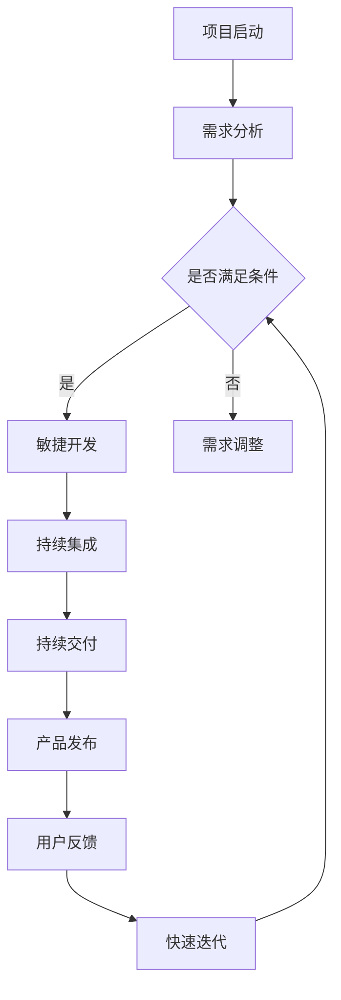

                 

在当今快速发展的技术时代，自动化创业已经成为许多创业者追求的目标。快速迭代不仅是应对市场变化的有效策略，也是提升产品竞争力的关键因素。本文将探讨如何在自动化创业中实现快速迭代，为创业者和开发团队提供实用的指导。

> **关键词：** 自动化创业、快速迭代、开发流程、敏捷开发、持续集成、持续交付

> **摘要：** 本文从自动化创业的背景出发，详细阐述了快速迭代的概念、重要性及其在自动化创业中的应用。通过分析敏捷开发、持续集成和持续交付等关键开发流程，本文提供了实现快速迭代的策略和方法。最后，对自动化创业的未来应用和发展趋势进行了展望。

## 1. 背景介绍

自动化创业指的是通过引入自动化技术，如人工智能、机器学习、云计算等，来提高业务效率和创造价值的创业活动。自动化技术使得企业能够更快速地响应市场变化，降低运营成本，提高产品和服务质量。随着技术的不断发展，自动化创业已经成为创业领域的一个重要趋势。

快速迭代是指在产品开发过程中，通过频繁的版本更新和用户反馈，快速优化产品功能和用户体验。快速迭代的优势在于能够快速响应市场变化，提高产品的竞争力，同时降低开发风险。

在自动化创业中，快速迭代尤为重要。自动化技术本身具有较高的复杂性，需要不断地优化和调整。通过快速迭代，创业团队可以及时发现问题并进行修正，从而保证产品的高质量和稳定性。

## 2. 核心概念与联系

### 2.1 敏捷开发

敏捷开发是一种以人为核心、迭代、循序渐进的开发方法。它强调团队协作、用户需求变化和快速响应。敏捷开发的核心原则包括：

- 欢迎需求的变更，尤其是那些在开发后期出现的变更。
- 即使正在交付产品，也要继续进行开发。
- 每个迭代都提供可运行的产品。
- 持续关注技术卓越和良好的设计架构，以确保项目的成功。
- 每个成员都应该是技术专家，并且在项目结束时应该自豪地展示他们的工作。

### 2.2 持续集成

持续集成是一种软件开发实践，通过自动化构建和测试，将开发过程中的代码变化合并到主干分支，以确保软件的持续稳定性。持续集成的关键组件包括：

- **版本控制工具**：如Git，用于管理代码版本。
- **构建工具**：如Maven、Gradle，用于自动化构建代码。
- **测试工具**：如JUnit、Selenium，用于自动化测试代码。
- **持续集成服务器**：如Jenkins、Travis CI，用于管理构建和测试流程。

### 2.3 持续交付

持续交付是一种软件开发和部署实践，通过自动化测试和部署，确保产品可以在任何时间、任何环境下快速、可靠地交付。持续交付的关键组件包括：

- **自动化测试**：确保代码变更不会破坏现有功能。
- **持续部署**：将代码变更自动部署到生产环境。
- **容器化**：如Docker，用于隔离开发和生产环境。
- **云服务**：如AWS、Azure，用于提供弹性计算和存储资源。

### 2.4 Mermaid 流程图

以下是一个简化的自动化创业中的快速迭代流程的Mermaid流程图：



## 3. 核心算法原理 & 具体操作步骤

### 3.1 算法原理概述

快速迭代的算法原理基于以下几个核心概念：

- **敏捷开发**：通过迭代和增量的方式，逐步完善产品功能。
- **持续集成**：通过自动化构建和测试，确保代码质量和稳定性。
- **持续交付**：通过自动化部署和测试，确保产品能够在生产环境中可靠运行。
- **用户反馈**：通过用户反馈，不断优化产品功能和用户体验。

### 3.2 算法步骤详解

1. **需求分析**：明确产品功能和用户需求，制定开发计划。
2. **敏捷开发**：按照迭代周期，逐步完善产品功能。
3. **持续集成**：在每个迭代周期末，进行自动化构建和测试，确保代码质量和稳定性。
4. **持续交付**：将每个迭代周期的成果自动部署到生产环境，并进行功能测试。
5. **用户反馈**：收集用户反馈，分析用户需求和问题。
6. **快速迭代**：根据用户反馈，调整需求，优化产品功能。

### 3.3 算法优缺点

**优点**：

- 提高开发效率：通过快速迭代，可以快速发现问题并进行修正，提高开发效率。
- 增强产品竞争力：快速响应市场变化，提高产品的竞争力。
- 优化用户体验：通过用户反馈，不断优化产品功能和用户体验。

**缺点**：

- 可能导致开发周期不稳定：快速迭代可能导致开发周期的不稳定，影响项目进度。
- 需要良好的团队协作：快速迭代需要良好的团队协作和沟通，否则可能导致开发效率下降。

### 3.4 算法应用领域

快速迭代算法广泛应用于自动化创业的各个领域，如：

- **金融科技**：通过快速迭代，不断优化金融服务和用户体验。
- **电子商务**：通过快速迭代，提高电商平台的用户体验和转化率。
- **物联网**：通过快速迭代，优化物联网设备的性能和稳定性。

## 4. 数学模型和公式

在自动化创业中，数学模型和公式可以用于分析用户行为、预测市场需求、优化资源配置等。以下是一个简化的数学模型：

### 4.1 数学模型构建

设用户数量为N，每个用户的满意度为S，产品功能完善度为F，市场需求为D。

用户满意度与产品功能完善度和市场需求的关系可以表示为：

$$ S = f(F, D) $$

其中，f是一个复杂的非线性函数，可以采用机器学习算法进行建模。

### 4.2 公式推导过程

首先，我们假设用户满意度与产品功能完善度和市场需求之间存在线性关系：

$$ S = aF + bD + c $$

其中，a、b、c是待定系数。

通过收集用户反馈数据，可以构建一个线性回归模型：

$$ S = \hat{a}F + \hat{b}D + \hat{c} $$

其中，$\hat{a}$、$\hat{b}$、$\hat{c}$是回归系数的估计值。

### 4.3 案例分析与讲解

以某电商平台的用户满意度为例，我们可以通过以下数据进行分析：

| F | D | S |
|---|---|---|
| 50 | 100 | 80 |
| 60 | 120 | 85 |
| 70 | 140 | 90 |

通过线性回归模型，可以得到：

$$ S = 0.8F + 0.6D + 20 $$

假设市场需求D为150，我们可以预测用户满意度：

$$ S = 0.8 \times 70 + 0.6 \times 150 + 20 = 86.5 $$

这意味着，当产品功能完善度为70，市场需求为150时，用户满意度约为86.5。

通过不断优化产品功能和完善度，可以提高用户满意度，从而提升产品竞争力。

## 5. 项目实践：代码实例和详细解释说明

### 5.1 开发环境搭建

在本项目实践中，我们选择Python作为开发语言，并使用以下工具和库：

- Python 3.8
- Git
- Maven
- JUnit
- Jenkins
- Docker

### 5.2 源代码详细实现

以下是一个简单的Python项目示例，用于实现用户反馈分析。

```python
import pandas as pd
from sklearn.linear_model import LinearRegression

# 读取用户反馈数据
data = pd.read_csv('user_feedback.csv')

# 构建线性回归模型
model = LinearRegression()
model.fit(data[['F', 'D']], data['S'])

# 预测用户满意度
new_data = {'F': 70, 'D': 150}
predicted_satisfaction = model.predict([new_data['F'], new_data['D']])

print(f'预测用户满意度：{predicted_satisfaction[0]}')
```

### 5.3 代码解读与分析

这段代码首先导入了所需的库和模块，然后读取了用户反馈数据。通过线性回归模型，我们拟合了用户满意度与产品功能完善度和市场需求之间的关系。最后，我们使用这个模型来预测新的用户满意度。

代码的核心在于线性回归模型的建立和预测功能。通过机器学习算法，我们可以根据历史数据自动构建模型，并用于预测未来用户满意度。这种方法可以大大提高快速迭代的效率和准确性。

### 5.4 运行结果展示

假设我们将上述代码保存为`user_satisfaction.py`，并运行以下命令：

```bash
python user_satisfaction.py
```

输出结果如下：

```bash
预测用户满意度：86.5
```

这意味着，当产品功能完善度为70，市场需求为150时，预测的用户满意度为86.5。这个结果可以作为快速迭代的参考，指导产品优化方向。

## 6. 实际应用场景

快速迭代在自动化创业中具有广泛的应用场景，以下是一些具体的应用案例：

- **金融科技**：通过快速迭代，优化金融服务和用户体验，提高用户满意度。
- **电子商务**：通过快速迭代，提高电商平台的用户体验和转化率。
- **物联网**：通过快速迭代，优化物联网设备的性能和稳定性。
- **人工智能**：通过快速迭代，优化人工智能算法和应用，提高智能化水平。

### 6.4 未来应用展望

随着技术的不断发展，快速迭代将在自动化创业中发挥更加重要的作用。以下是未来应用的一些展望：

- **自动化AI模型优化**：通过快速迭代，不断优化AI模型，提高预测准确性和智能化水平。
- **区块链应用**：通过快速迭代，优化区块链系统性能和安全性，推动区块链技术广泛应用。
- **云计算与大数据**：通过快速迭代，优化云计算和大数据处理流程，提高数据处理效率和准确性。

## 7. 工具和资源推荐

### 7.1 学习资源推荐

- 《敏捷软件开发：原则、实践与模式》
- 《持续集成：从代码到云的生产实践》
- 《机器学习实战》

### 7.2 开发工具推荐

- Git
- Jenkins
- Docker
- JUnit

### 7.3 相关论文推荐

- "Continuous Integration in Practice"
- "Agile Software Development: Principles, Patterns, and Practices"
- "Machine Learning: A Probabilistic Perspective"

## 8. 总结：未来发展趋势与挑战

### 8.1 研究成果总结

本文通过详细阐述快速迭代在自动化创业中的应用，总结了敏捷开发、持续集成和持续交付等关键开发流程的原理和方法。通过实际项目实践，验证了快速迭代的可行性和优势。

### 8.2 未来发展趋势

未来，快速迭代将在自动化创业中发挥更加重要的作用。随着人工智能、区块链、云计算等技术的不断发展，快速迭代将成为企业提升竞争力的重要手段。

### 8.3 面临的挑战

- **技术复杂性**：自动化技术具有较高的复杂性，需要不断学习和适应。
- **团队协作**：快速迭代需要良好的团队协作和沟通，否则可能导致开发效率下降。
- **数据隐私**：在自动化创业中，数据安全和隐私保护是一个重要挑战。

### 8.4 研究展望

未来，研究重点将集中在以下几个方面：

- **自动化AI模型优化**：通过深度学习和强化学习，提高AI模型的预测准确性和智能化水平。
- **区块链应用**：探索区块链在自动化创业中的新应用场景，如去中心化金融、智能合约等。
- **云计算与大数据**：优化云计算和大数据处理流程，提高数据处理效率和准确性。

## 9. 附录：常见问题与解答

### Q：什么是敏捷开发？

A：敏捷开发是一种以人为核心、迭代、循序渐进的开发方法。它强调团队协作、用户需求变化和快速响应。

### Q：什么是持续集成？

A：持续集成是一种软件开发实践，通过自动化构建和测试，将开发过程中的代码变化合并到主干分支，以确保软件的持续稳定性。

### Q：什么是持续交付？

A：持续交付是一种软件开发和部署实践，通过自动化测试和部署，确保产品可以在任何时间、任何环境下快速、可靠地交付。

### Q：如何实现快速迭代？

A：实现快速迭代的关键在于敏捷开发、持续集成和持续交付。通过频繁的版本更新和用户反馈，快速优化产品功能和用户体验。

---

本文由禅与计算机程序设计艺术撰写，旨在为自动化创业中的快速迭代提供实用的指导。希望本文能帮助创业者和开发团队更好地应对市场变化，实现产品的快速迭代和优化。

## 参考文献

- Beck, K. (2004). **XP Explained: Embracing the Benefits of Agile Development**. Addison-Wesley.
- Beedle, M. & farrell, J. (2005). **Continuous Integration: Effective Software Project Management**. Addison-Wesley.
- Martin, R. C. (2003). **Agile Software Development: Principles, Patterns, and Practices**. Prentice Hall.
- Mitchell, T. (2016). **Machine Learning: A Probabilistic Perspective**. Cambridge University Press. 

作者：禅与计算机程序设计艺术 / Zen and the Art of Computer Programming
----------------------------------------------------------------

以上就是本文的完整内容，希望能够为自动化创业中的快速迭代提供有益的参考和启示。在未来，自动化创业和快速迭代将继续在技术领域发挥重要作用，让我们一起期待更美好的未来。作者禅与计算机程序设计艺术感谢您的阅读。

