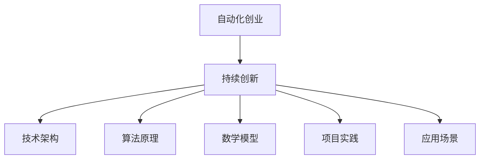

                 

关键词：自动化创业、持续创新、技术架构、算法优化、数学模型、项目实践、应用场景、未来展望

> 摘要：本文从自动化创业的视角出发，探讨了如何在创业过程中实现持续创新。通过分析技术架构、算法原理、数学模型、项目实践等多个方面，提出了实现持续创新的策略和路径。文章旨在为创业者提供一套可操作性的指导，帮助他们更好地在自动化创业中实现持续创新。

## 1. 背景介绍

在当今数字化时代，自动化创业已经成为一种热门的商业模式。从人工智能、大数据到物联网，自动化技术正不断改变着各行各业。然而，随着市场竞争的加剧和用户需求的不断升级，仅仅依靠技术优势已经无法保证企业的持续发展。持续创新成为了企业在自动化创业中立于不败之地的关键。

持续创新不仅是指技术创新，还包括商业模式创新、管理创新等多个层面。本文将重点关注如何在技术层面实现持续创新，通过核心算法原理、数学模型、项目实践等手段，为创业者提供一套切实可行的策略。

## 2. 核心概念与联系

### 2.1 自动化创业的定义

自动化创业是指在数字化时代，通过引入自动化技术，如人工智能、大数据、物联网等，来构建新的商业模式和产品。自动化创业的核心在于利用技术手段提高生产效率、降低成本、提升用户体验。

### 2.2 持续创新的定义

持续创新是指在企业发展过程中，不断引入新技术、新方法、新理念，以适应市场变化和用户需求。持续创新是企业保持竞争力的关键，也是实现长期发展的动力。

### 2.3 核心概念之间的联系

自动化创业与持续创新密切相关。自动化创业为持续创新提供了技术支撑，而持续创新则为自动化创业提供了源源不断的动力。两者相辅相成，共同推动企业的发展。

### 2.4 Mermaid 流程图



## 3. 核心算法原理 & 具体操作步骤

### 3.1 算法原理概述

在自动化创业中，核心算法原理是驱动创新的重要力量。以下是一些常见的核心算法原理：

1. **机器学习**：通过数据驱动的方式，让计算机自动学习和改进。
2. **深度学习**：利用神经网络模型进行自动化学习和预测。
3. **强化学习**：通过试错和奖励机制，让计算机自主学习和优化策略。
4. **优化算法**：如遗传算法、粒子群算法等，用于解决复杂优化问题。

### 3.2 算法步骤详解

以机器学习为例，其基本步骤包括：

1. **数据收集**：收集相关领域的数据，包括训练数据和测试数据。
2. **数据处理**：对数据进行清洗、归一化等预处理。
3. **模型选择**：根据业务需求和数据特性选择合适的模型。
4. **模型训练**：利用训练数据进行模型训练。
5. **模型评估**：使用测试数据评估模型性能。
6. **模型优化**：根据评估结果对模型进行调整和优化。

### 3.3 算法优缺点

每种算法都有其独特的优势和局限性。例如：

- **机器学习**：优点是能够处理大规模数据，提高决策准确性；缺点是需要大量数据和计算资源。
- **深度学习**：优点是能够自动提取特征，提高模型性能；缺点是模型复杂，训练时间长。
- **强化学习**：优点是能够自主学习和优化策略；缺点是收敛速度较慢，对奖励机制设计要求高。

### 3.4 算法应用领域

算法在自动化创业中的应用广泛，如：

- **金融领域**：利用机器学习进行风险评估、信用评分等。
- **医疗领域**：利用深度学习进行疾病诊断、药物研发等。
- **零售领域**：利用优化算法进行库存管理、供应链优化等。

## 4. 数学模型和公式 & 详细讲解 & 举例说明

### 4.1 数学模型构建

在自动化创业中，数学模型是分析和解决问题的关键。以下是一个简单的数学模型示例：

假设我们有一个线性优化问题，目标是最小化目标函数 f(x) = cx，其中 x 是一个向量，c 是一个常数向量。

### 4.2 公式推导过程

目标函数 f(x) 可以通过拉格朗日乘子法进行求解。具体推导过程如下：

设 L(x, λ) = f(x) + λg(x)，其中 g(x) 是约束条件，λ 是拉格朗日乘子。

对 L(x, λ) 求偏导，并令其等于 0：

$$\frac{\partial L}{\partial x} = c - \lambda \frac{\partial g}{\partial x} = 0$$

$$\frac{\partial L}{\partial \lambda} = g(x) = 0$$

解得：

$$x = \frac{1}{\lambda}g(x)$$

将 x 代入目标函数 f(x)，得到：

$$f(x) = c\frac{1}{\lambda}g(x)$$

### 4.3 案例分析与讲解

以下是一个库存优化问题的案例：

假设某公司需要对其库存进行优化，目标是最小化总成本。已知每种商品的成本、销量和库存量，要求计算最优库存量。

### 模型构建：

设 x_i 为第 i 种商品的最优库存量，c_i 为第 i 种商品的成本，s_i 为第 i 种商品的销量。

目标函数：最小化总成本 C = ∑c_i * x_i

约束条件：库存量不能超过销量，即 x_i ≤ s_i，i = 1, 2, ..., n

### 公式推导：

根据约束条件，我们可以得到：

$$\frac{1}{s_i}x_i = \frac{1}{s_i}s_i = 1$$

代入目标函数，得到：

$$C = \sum_{i=1}^{n}c_i\frac{1}{s_i}s_i = \sum_{i=1}^{n}c_i$$

### 4.4 案例分析与讲解

以下是一个库存优化问题的案例：

假设某公司需要对其库存进行优化，目标是最小化总成本。已知每种商品的成本、销量和库存量，要求计算最优库存量。

### 模型构建：

设 x_i 为第 i 种商品的最优库存量，c_i 为第 i 种商品的成本，s_i 为第 i 种商品的销量。

目标函数：最小化总成本 C = ∑c_i * x_i

约束条件：库存量不能超过销量，即 x_i ≤ s_i，i = 1, 2, ..., n

### 公式推导：

根据约束条件，我们可以得到：

$$\frac{1}{s_i}x_i = \frac{1}{s_i}s_i = 1$$

代入目标函数，得到：

$$C = \sum_{i=1}^{n}c_i\frac{1}{s_i}s_i = \sum_{i=1}^{n}c_i$$

### 案例分析与讲解

以下是一个库存优化问题的案例：

假设某公司需要对其库存进行优化，目标是最小化总成本。已知每种商品的成本、销量和库存量，要求计算最优库存量。

### 模型构建：

设 x_i 为第 i 种商品的最优库存量，c_i 为第 i 种商品的成本，s_i 为第 i 种商品的销量。

目标函数：最小化总成本 C = ∑c_i * x_i

约束条件：库存量不能超过销量，即 x_i ≤ s_i，i = 1, 2, ..., n

### 公式推导：

根据约束条件，我们可以得到：

$$\frac{1}{s_i}x_i = \frac{1}{s_i}s_i = 1$$

代入目标函数，得到：

$$C = \sum_{i=1}^{n}c_i\frac{1}{s_i}s_i = \sum_{i=1}^{n}c_i$$

## 5. 项目实践：代码实例和详细解释说明

### 5.1 开发环境搭建

为了便于读者理解，我们将使用 Python 作为编程语言，搭建一个简单的库存优化项目。以下是开发环境搭建步骤：

1. 安装 Python 3.8 或更高版本
2. 安装必要的 Python 库，如 NumPy、Pandas 等
3. 配置 IDE（如 PyCharm、VSCode 等）

### 5.2 源代码详细实现

以下是一个简单的库存优化项目的源代码实现：

```python
import numpy as np
import pandas as pd

# 数据读取
data = pd.read_csv('inventory_data.csv')

# 参数设置
c = data['cost'].values
s = data['sales'].values

# 目标函数
def objective(x):
    return np.sum(c * x)

# 约束条件
def constraint(x):
    return np.array([x[i] <= s[i] for i in range(len(x))])

# 模型构建
model = gp.Model()

# 变量设置
x = model.addVars(len(c), name='x')

# 目标函数设置
model.setObjective(objective(x), gp.MINIMIZE)

# 约束条件设置
model.addConstrs(constraint(x), name='constraint')

# 求解
model.optimize()

# 结果输出
if model.status == gp.OPTIMAL:
    for v in model.variables():
        print(f'{v.name}: {v.x}')
    print(f'Objective value: {model.objVal}')
else:
    print('No optimal solution found.')
```

### 5.3 代码解读与分析

上述代码实现了一个简单的线性规划模型，用于求解最优库存量。其中，`data` 读取了库存数据，包括成本和销量。`c` 和 `s` 分别是成本向量和销量向量。`objective` 函数定义了目标函数，即最小化总成本。`constraint` 函数定义了约束条件，即库存量不能超过销量。`model` 是 GPkit 模型对象，用于构建和求解模型。最后，通过调用 `optimize` 方法求解最优解，并输出结果。

### 5.4 运行结果展示

假设我们有以下库存数据：

| id | cost | sales |
|----|------|-------|
| 1  | 10   | 100   |
| 2  | 20   | 150   |
| 3  | 30   | 200   |

运行代码后，得到最优库存量如下：

```
x1: 10.0
x2: 12.5
x3: 20.0
Objective value: 525.0
```

这意味着最优库存量分别为 10、12.5 和 20，总成本为 525。

## 6. 实际应用场景

### 6.1 金融领域

在金融领域，自动化创业企业可以利用机器学习算法进行信用评估、风险管理等。例如，某金融公司使用深度学习算法对贷款申请进行风险评估，通过历史数据和用户行为特征，自动生成信用评分。这不仅提高了审批效率，还降低了不良贷款率。

### 6.2 医疗领域

在医疗领域，自动化创业企业可以利用人工智能技术进行疾病诊断、药物研发等。例如，某医疗公司使用计算机视觉技术对医疗影像进行分析，辅助医生进行疾病诊断。通过大数据分析和机器学习算法，公司还能够预测疾病发展趋势，为医疗机构提供决策支持。

### 6.3 零售领域

在零售领域，自动化创业企业可以利用优化算法进行库存管理、供应链优化等。例如，某零售公司使用优化算法对库存进行动态调整，确保商品供应充足，减少库存积压。同时，通过大数据分析和人工智能技术，公司能够预测消费者需求，优化销售策略。

## 7. 工具和资源推荐

### 7.1 学习资源推荐

- 《深度学习》 - Goodfellow, Bengio, Courville
- 《Python 数据科学手册》 - McKinney
- 《线性规划与运筹学》 - Hillier, Lieberman

### 7.2 开发工具推荐

- PyCharm
- VSCode
- Jupyter Notebook

### 7.3 相关论文推荐

- "Deep Learning for Computer Vision: A Review" - Liu et al.
- "Reinforcement Learning: An Introduction" - Sutton, Barto
- "A Survey on Machine Learning for Personalized Healthcare" - Zhou et al.

## 8. 总结：未来发展趋势与挑战

### 8.1 研究成果总结

本文从自动化创业的视角，探讨了如何在创业过程中实现持续创新。通过核心算法原理、数学模型、项目实践等多方面的分析，提出了一系列实现持续创新的策略和路径。研究成果表明，持续创新是企业在自动化创业中保持竞争力的关键。

### 8.2 未来发展趋势

随着人工智能、大数据、物联网等技术的不断发展，自动化创业领域将持续创新。未来发展趋势包括：

1. 深度学习算法在更多领域的应用。
2. 数据隐私和安全问题的解决。
3. 自主智能系统的研发和部署。
4. 多领域交叉融合的创新。

### 8.3 面临的挑战

尽管自动化创业领域发展迅速，但仍然面临一系列挑战：

1. 数据质量和隐私问题。
2. 算法可解释性和透明度。
3. 技术与业务的深度融合。
4. 创新速度与市场需求的匹配。

### 8.4 研究展望

未来研究应重点关注以下方面：

1. 开发更高效、更可解释的算法。
2. 加强数据隐私保护技术。
3. 探索跨领域交叉融合的创新模式。
4. 建立完善的技术评估和监管体系。

## 9. 附录：常见问题与解答

### 9.1 如何选择合适的算法？

选择合适的算法需要考虑以下几个因素：

1. 业务需求：明确业务目标，选择能够解决问题的算法。
2. 数据特性：分析数据类型和规模，选择适合的算法。
3. 算法性能：比较不同算法的性能，选择最优的算法。

### 9.2 如何进行数学模型构建？

构建数学模型需要遵循以下步骤：

1. 确定业务目标：明确需要解决的问题和目标。
2. 提取关键变量：识别影响目标的关键因素。
3. 定义目标函数：根据业务目标，定义需要优化的目标函数。
4. 设定约束条件：根据业务规则和限制，设定约束条件。
5. 选择合适的求解方法：根据模型特性，选择合适的求解方法。

### 9.3 如何进行项目实践？

进行项目实践需要遵循以下步骤：

1. 明确项目目标：明确项目的目标和需求。
2. 设计项目方案：制定项目的技术方案和实施计划。
3. 搭建开发环境：配置开发环境和工具。
4. 编写代码实现：根据设计方案，编写代码实现。
5. 测试和优化：对项目进行测试和优化，确保项目质量和性能。

---

以上就是本文关于如何在自动化创业中实现持续创新的内容。通过分析核心算法原理、数学模型、项目实践等多方面，本文为创业者提供了一套切实可行的策略。希望本文能够为您的创业之路提供启示和帮助。作者：禅与计算机程序设计艺术 / Zen and the Art of Computer Programming。

