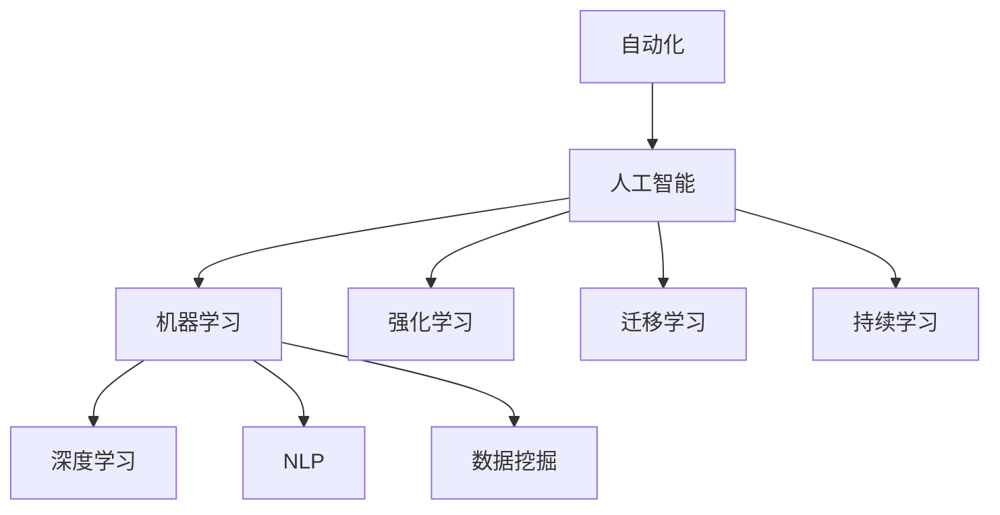

                 

## 1. 背景介绍

### 1.1 问题由来

自动化创业（也称为AI创业）是指利用人工智能技术进行自动化流程优化、智能化决策支持、个性化推荐等，以提升业务效率和客户体验的创业模式。近年来，随着AI技术的成熟和普及，自动化创业成为了许多创业公司新的发力点。然而，在激烈的市场竞争中，如何快速、高效地建立竞争优势，成为众多创业者需要面对的难题。

### 1.2 问题核心关键点

自动创业建立竞争优势的关键在于如何通过高效、准确、可解释的AI技术，解决具体业务问题，提升运营效率和客户满意度。常见的技术挑战包括：

- 数据的获取和处理：自动化创业依赖于大规模的数据集，数据质量直接影响模型的准确性和泛化能力。
- 模型选择和优化：选择合适的模型和算法，在数据和计算资源的限制下进行高效优化。
- 系统集成与部署：将AI模型嵌入实际业务流程，确保系统稳定、高效、可扩展。
- 可解释性和用户信任：解释AI决策过程，构建用户信任，推动实际应用。
- 持续学习和适应：随着业务环境的变化，模型需要持续学习和优化，以保持竞争优势。

### 1.3 问题研究意义

研究自动化创业中建立竞争优势的方法，对于提升AI技术的实际应用价值，推动产业数字化转型，具有重要意义：

1. 提升效率：利用AI自动化流程，大幅减少人工操作，降低成本，提高效率。
2. 增强决策：基于大数据和深度学习，辅助企业做出更精准、更科学的决策。
3. 个性化服务：通过AI技术提供定制化的产品和服务，提升客户满意度。
4. 市场竞争力：在竞争激烈的市场中，AI技术成为企业差异化的关键竞争力。
5. 推动创新：AI技术赋能传统业务，催生新的商业模式和业务模式。

## 2. 核心概念与联系

### 2.1 核心概念概述

为了更好地理解如何在自动化创业中建立竞争优势，本节将介绍几个密切相关的核心概念：

- 自动化（Automation）：通过程序、算法等技术手段，自动完成重复性、规则性强的工作，提升效率。
- 人工智能（AI）：模拟人脑的智能行为，通过机器学习、深度学习等方法，实现智能决策和自主学习。
- 机器学习（Machine Learning）：使计算机能够从数据中自动学习模式，无需人工干预。
- 深度学习（Deep Learning）：一种基于多层神经网络的机器学习技术，能够处理大规模、复杂的数据集。
- 自然语言处理（NLP）：使计算机能够理解和处理人类语言，实现文本分类、情感分析、机器翻译等功能。
- 数据挖掘（Data Mining）：从大量数据中提取有用信息和知识，辅助决策和预测。
- 强化学习（Reinforcement Learning）：通过试错学习，优化决策策略，实现智能控制和自主学习。
- 迁移学习（Transfer Learning）：将一个任务学到的知识迁移到另一个相关任务上，减少数据需求和计算资源。

这些核心概念之间的逻辑关系可以通过以下Mermaid流程图来展示：



这个流程图展示了这个领域的关键概念及其之间的关系：

1. 自动化是基础，通过技术手段实现自动执行。
2. 人工智能是核心，通过算法和模型实现智能决策。
3. 机器学习、深度学习和自然语言处理是主要技术手段，用于处理大规模、复杂的数据集。
4. 强化学习、迁移学习和持续学习是进阶技术，用于提高模型的泛化能力和适应能力。

## 3. 核心算法原理 & 具体操作步骤
### 3.1 算法原理概述

自动化创业建立竞争优势的核心在于利用AI技术解决具体业务问题，提升效率和决策质量。其核心算法原理基于机器学习和深度学习，通过数据挖掘和模型优化，实现业务流程的自动化和智能化。

具体来说，自动化创业的过程可以分为以下几个步骤：

1. **数据收集与预处理**：收集与业务相关的数据，清洗、整理数据，确保数据质量和完整性。
2. **模型选择与训练**：根据业务需求选择合适的模型和算法，在数据集上进行训练，优化模型参数。
3. **系统集成与部署**：将训练好的模型嵌入到实际业务系统中，进行系统集成和优化。
4. **持续学习与优化**：随着业务环境的变化，持续收集数据，重新训练和优化模型，保持系统竞争力。

### 3.2 算法步骤详解

以下是自动化创业建立竞争优势的详细步骤：

#### 3.2.1 数据收集与预处理

- **数据收集**：从业务运营过程中收集相关的数据，如交易数据、用户行为数据、客户反馈数据等。可以通过日志、数据库、API接口等方式进行数据采集。
- **数据清洗**：对采集到的数据进行去重、去噪、异常值处理等操作，确保数据质量和一致性。
- **数据标注**：对数据进行标注，如分类、标注、回归等，为模型训练提供监督信号。

#### 3.2.2 模型选择与训练

- **模型选择**：根据业务需求选择合适的模型和算法，如决策树、随机森林、深度学习等。对于复杂任务，可以选择具有先验知识的模型，如BERT、GPT等。
- **数据划分**：将数据划分为训练集、验证集和测试集，用于模型训练、验证和评估。
- **模型训练**：使用训练集对模型进行训练，优化模型参数。可以使用梯度下降、Adam等优化算法。
- **模型验证**：在验证集上评估模型性能，调整模型参数和超参数，确保模型泛化能力。

#### 3.2.3 系统集成与部署

- **系统设计**：设计系统架构，确定API接口、数据流、业务逻辑等。
- **模型集成**：将训练好的模型嵌入到系统中，进行API封装，方便业务系统调用。
- **性能优化**：对系统进行性能优化，如模型压缩、缓存、负载均衡等。
- **部署上线**：将系统部署到服务器或云平台上，确保系统稳定、高效运行。

#### 3.2.4 持续学习与优化

- **数据监控**：实时监控系统运行状态，收集新数据，进行持续学习。
- **模型更新**：定期重新训练模型，更新模型参数，保持模型最新状态。
- **业务反馈**：收集用户反馈，分析问题，优化系统。
- **自动化部署**：实现自动化部署流程，确保系统更新和优化无缝衔接。

### 3.3 算法优缺点

自动化创业建立竞争优势的算法具有以下优点：

1. **高效自动化**：通过AI技术实现自动化流程，大幅提升效率。
2. **智能决策**：基于大数据和深度学习，提供精准、科学的决策支持。
3. **个性化服务**：利用AI技术提供定制化的产品和服务，提升客户满意度。
4. **可解释性强**：AI模型可以通过可解释性技术，解释决策过程，构建用户信任。
5. **适应性强**：通过持续学习和优化，模型能够适应业务环境的变化。

同时，该算法也存在以下局限性：

1. **数据依赖性强**：依赖高质量、大规模的数据集，数据获取和处理成本高。
2. **模型复杂度高**：深度学习等高级模型计算复杂，资源消耗大。
3. **模型黑盒问题**：深度学习模型黑盒性强，难以解释决策过程。
4. **算法调试难**：复杂的模型调试和优化需要丰富的经验和技能。
5. **应用场景受限**：部分业务场景难以用AI技术完全自动化，需要人工干预。

尽管存在这些局限性，但就目前而言，利用AI技术实现自动化创业，仍是最有效的竞争手段之一。未来相关研究的重点在于如何进一步提高算法的可解释性、减少资源消耗，同时扩大应用场景，提升系统的稳定性和可靠性。

### 3.4 算法应用领域

自动化创业建立竞争优势的方法已经在多个领域得到了广泛应用，包括但不限于以下几个方向：

- **金融科技**：利用AI进行信用评估、风险控制、交易决策等，提升金融服务效率和精准度。
- **电商零售**：通过推荐系统、智能客服、库存管理等AI技术，提升客户体验和运营效率。
- **医疗健康**：利用AI进行疾病预测、诊断、治疗方案推荐等，提升医疗服务质量和效率。
- **智能制造**：通过自动化、智能化生产流程，提升制造业的生产效率和产品质量。
- **智能家居**：通过智能语音助手、智能监控等AI技术，提升家居生活的便捷性和安全性。
- **智慧城市**：利用AI进行交通管理、环境监测、应急响应等，提升城市治理水平。

除了上述这些常见领域，自动化创业的方法也在更多新兴行业得到应用，如教育、物流、能源等，为各行各业带来新的创新和变革。

## 4. 数学模型和公式 & 详细讲解 & 举例说明

### 4.1 数学模型构建

本节将使用数学语言对自动化创业中建立竞争优势的算法进行更加严格的刻画。

记自动化创业的业务模型为 $M_{\theta}:\mathcal{X} \rightarrow \mathcal{Y}$，其中 $\mathcal{X}$ 为输入空间，$\mathcal{Y}$ 为输出空间，$\theta$ 为模型参数。假设自动化创业面临的业务问题为 $T$，数据集为 $D=\{(x_i,y_i)\}_{i=1}^N, x_i \in \mathcal{X}, y_i \in \mathcal{Y}$。

定义模型 $M_{\theta}$ 在数据样本 $(x,y)$ 上的损失函数为 $\ell(M_{\theta}(x),y)$，则在数据集 $D$ 上的经验风险为：

$$
\mathcal{L}(\theta) = \frac{1}{N} \sum_{i=1}^N \ell(M_{\theta}(x_i),y_i)
$$

微调的优化目标是最小化经验风险，即找到最优参数：

$$
\theta^* = \mathop{\arg\min}_{\theta} \mathcal{L}(\theta)
$$

在实践中，我们通常使用基于梯度的优化算法（如SGD、Adam等）来近似求解上述最优化问题。设 $\eta$ 为学习率，$\lambda$ 为正则化系数，则参数的更新公式为：

$$
\theta \leftarrow \theta - \eta \nabla_{\theta}\mathcal{L}(\theta) - \eta\lambda\theta
$$

其中 $\nabla_{\theta}\mathcal{L}(\theta)$ 为损失函数对参数 $\theta$ 的梯度，可通过反向传播算法高效计算。

### 4.2 公式推导过程

以下我们以金融风控为例，推导损失函数及其梯度的计算公式。

假设模型 $M_{\theta}$ 在输入 $x$ 上的输出为 $\hat{y}=M_{\theta}(x) \in [0,1]$，表示样本属于高风险的概率。真实标签 $y \in \{0,1\}$。则二分类交叉熵损失函数定义为：

$$
\ell(M_{\theta}(x),y) = -[y\log \hat{y} + (1-y)\log (1-\hat{y})]
$$

将其代入经验风险公式，得：

$$
\mathcal{L}(\theta) = -\frac{1}{N}\sum_{i=1}^N [y_i\log M_{\theta}(x_i)+(1-y_i)\log(1-M_{\theta}(x_i))]
$$

根据链式法则，损失函数对参数 $\theta_k$ 的梯度为：

$$
\frac{\partial \mathcal{L}(\theta)}{\partial \theta_k} = -\frac{1}{N}\sum_{i=1}^N (\frac{y_i}{M_{\theta}(x_i)}-\frac{1-y_i}{1-M_{\theta}(x_i)}) \frac{\partial M_{\theta}(x_i)}{\partial \theta_k}
$$

其中 $\frac{\partial M_{\theta}(x_i)}{\partial \theta_k}$ 可进一步递归展开，利用自动微分技术完成计算。

在得到损失函数的梯度后，即可带入参数更新公式，完成模型的迭代优化。重复上述过程直至收敛，最终得到适应业务任务的最优模型参数 $\theta^*$。

### 4.3 案例分析与讲解

**案例：电商推荐系统**

电商推荐系统是自动化创业中应用广泛的场景。通过AI技术，电商平台可以根据用户行为数据、历史购买记录等，推荐用户可能感兴趣的商品。

具体而言，可以收集用户浏览、点击、购买等行为数据，提取和商品描述、价格、标签等文本内容。将文本内容作为模型输入，用户的后续行为（如是否购买等）作为监督信号，在此基础上微调预训练语言模型。微调后的模型能够从文本内容中准确把握用户的兴趣点。在生成推荐列表时，先用候选商品描述作为输入，由模型预测用户的兴趣匹配度，再结合其他特征综合排序，便可以得到个性化程度更高的推荐结果。

**案例：智能客服系统**

智能客服系统是自动化创业中的另一重要应用。传统客服往往需要配备大量人力，高峰期响应缓慢，且一致性和专业性难以保证。通过AI技术，客服系统可以7x24小时不间断服务，快速响应客户咨询，用自然流畅的语言解答各类常见问题。

在技术实现上，可以收集企业内部的历史客服对话记录，将问题和最佳答复构建成监督数据，在此基础上对预训练对话模型进行微调。微调后的对话模型能够自动理解用户意图，匹配最合适的答案模板进行回复。对于客户提出的新问题，还可以接入检索系统实时搜索相关内容，动态组织生成回答。如此构建的智能客服系统，能大幅提升客户咨询体验和问题解决效率。

## 5. 项目实践：代码实例和详细解释说明

### 5.1 开发环境搭建

在进行自动化创业的微调实践前，我们需要准备好开发环境。以下是使用Python进行PyTorch开发的环境配置流程：

1. 安装Anaconda：从官网下载并安装Anaconda，用于创建独立的Python环境。

2. 创建并激活虚拟环境：
```bash
conda create -n pytorch-env python=3.8 
conda activate pytorch-env
```

3. 安装PyTorch：根据CUDA版本，从官网获取对应的安装命令。例如：
```bash
conda install pytorch torchvision torchaudio cudatoolkit=11.1 -c pytorch -c conda-forge
```

4. 安装Transformers库：
```bash
pip install transformers
```

5. 安装各类工具包：
```bash
pip install numpy pandas scikit-learn matplotlib tqdm jupyter notebook ipython
```

完成上述步骤后，即可在`pytorch-env`环境中开始微调实践。

### 5.2 源代码详细实现

下面我们以金融风控任务为例，给出使用Transformers库对BERT模型进行微调的PyTorch代码实现。

首先，定义风控任务的数据处理函数：

```python
from transformers import BertTokenizer
from torch.utils.data import Dataset
import torch

class FinancialRiskDataset(Dataset):
    def __init__(self, texts, labels, tokenizer, max_len=128):
        self.texts = texts
        self.labels = labels
        self.tokenizer = tokenizer
        self.max_len = max_len
        
    def __len__(self):
        return len(self.texts)
    
    def __getitem__(self, item):
        text = self.texts[item]
        label = self.labels[item]
        
        encoding = self.tokenizer(text, return_tensors='pt', max_length=self.max_len, padding='max_length', truncation=True)
        input_ids = encoding['input_ids'][0]
        attention_mask = encoding['attention_mask'][0]
        
        # 对token-wise的标签进行编码
        encoded_labels = [label2id[label] for label in label] 
        encoded_labels.extend([label2id['default']] * (self.max_len - len(encoded_labels)))
        labels = torch.tensor(encoded_labels, dtype=torch.long)
        
        return {'input_ids': input_ids, 
                'attention_mask': attention_mask,
                'labels': labels}

# 标签与id的映射
label2id = {'default': 0, 'high': 1, 'low': 2}
id2label = {v: k for k, v in label2id.items()}

# 创建dataset
tokenizer = BertTokenizer.from_pretrained('bert-base-cased')

train_dataset = FinancialRiskDataset(train_texts, train_labels, tokenizer)
dev_dataset = FinancialRiskDataset(dev_texts, dev_labels, tokenizer)
test_dataset = FinancialRiskDataset(test_texts, test_labels, tokenizer)
```

然后，定义模型和优化器：

```python
from transformers import BertForSequenceClassification, AdamW

model = BertForSequenceClassification.from_pretrained('bert-base-cased', num_labels=len(label2id))

optimizer = AdamW(model.parameters(), lr=2e-5)
```

接着，定义训练和评估函数：

```python
from torch.utils.data import DataLoader
from tqdm import tqdm
from sklearn.metrics import classification_report

device = torch.device('cuda') if torch.cuda.is_available() else torch.device('cpu')
model.to(device)

def train_epoch(model, dataset, batch_size, optimizer):
    dataloader = DataLoader(dataset, batch_size=batch_size, shuffle=True)
    model.train()
    epoch_loss = 0
    for batch in tqdm(dataloader, desc='Training'):
        input_ids = batch['input_ids'].to(device)
        attention_mask = batch['attention_mask'].to(device)
        labels = batch['labels'].to(device)
        model.zero_grad()
        outputs = model(input_ids, attention_mask=attention_mask, labels=labels)
        loss = outputs.loss
        epoch_loss += loss.item()
        loss.backward()
        optimizer.step()
    return epoch_loss / len(dataloader)

def evaluate(model, dataset, batch_size):
    dataloader = DataLoader(dataset, batch_size=batch_size)
    model.eval()
    preds, labels = [], []
    with torch.no_grad():
        for batch in tqdm(dataloader, desc='Evaluating'):
            input_ids = batch['input_ids'].to(device)
            attention_mask = batch['attention_mask'].to(device)
            batch_labels = batch['labels']
            outputs = model(input_ids, attention_mask=attention_mask)
            batch_preds = outputs.logits.argmax(dim=2).to('cpu').tolist()
            batch_labels = batch_labels.to('cpu').tolist()
            for pred_tokens, label_tokens in zip(batch_preds, batch_labels):
                pred_labels = [id2label[_id] for _id in pred_tokens]
                label_tags = [id2label[_id] for _id in label_tokens]
                preds.append(pred_labels[:len(label_tags)])
                labels.append(label_tags)
                
    print(classification_report(labels, preds))
```

最后，启动训练流程并在测试集上评估：

```python
epochs = 5
batch_size = 16

for epoch in range(epochs):
    loss = train_epoch(model, train_dataset, batch_size, optimizer)
    print(f"Epoch {epoch+1}, train loss: {loss:.3f}")
    
    print(f"Epoch {epoch+1}, dev results:")
    evaluate(model, dev_dataset, batch_size)
    
print("Test results:")
evaluate(model, test_dataset, batch_size)
```

以上就是使用PyTorch对BERT进行金融风控任务微调的完整代码实现。可以看到，得益于Transformers库的强大封装，我们可以用相对简洁的代码完成BERT模型的加载和微调。

### 5.3 代码解读与分析

让我们再详细解读一下关键代码的实现细节：

**FinancialRiskDataset类**：
- `__init__`方法：初始化文本、标签、分词器等关键组件。
- `__len__`方法：返回数据集的样本数量。
- `__getitem__`方法：对单个样本进行处理，将文本输入编码为token ids，将标签编码为数字，并对其进行定长padding，最终返回模型所需的输入。

**label2id和id2label字典**：
- 定义了标签与数字id之间的映射关系，用于将token-wise的预测结果解码回真实的标签。

**训练和评估函数**：
- 使用PyTorch的DataLoader对数据集进行批次化加载，供模型训练和推理使用。
- 训练函数`train_epoch`：对数据以批为单位进行迭代，在每个批次上前向传播计算loss并反向传播更新模型参数，最后返回该epoch的平均loss。
- 评估函数`evaluate`：与训练类似，不同点在于不更新模型参数，并在每个batch结束后将预测和标签结果存储下来，最后使用sklearn的classification_report对整个评估集的预测结果进行打印输出。

**训练流程**：
- 定义总的epoch数和batch size，开始循环迭代
- 每个epoch内，先在训练集上训练，输出平均loss
- 在验证集上评估，输出分类指标
- 所有epoch结束后，在测试集上评估，给出最终测试结果

可以看到，PyTorch配合Transformers库使得BERT微调的代码实现变得简洁高效。开发者可以将更多精力放在数据处理、模型改进等高层逻辑上，而不必过多关注底层的实现细节。

当然，工业级的系统实现还需考虑更多因素，如模型的保存和部署、超参数的自动搜索、更灵活的任务适配层等。但核心的微调范式基本与此类似。

## 6. 实际应用场景
### 6.1 金融科技

利用AI技术，金融科技可以在风险控制、信用评估、交易决策等领域实现自动化和智能化。通过自动化创业建立竞争优势，金融科技公司能够实时监控和分析客户行为数据，构建精准的风险评估模型，降低欺诈风险，提高资金安全。

在技术实现上，可以收集金融领域相关的新闻、报道、评论等文本数据，并对其进行情感分析、实体识别等处理。将处理后的数据作为模型输入，训练风控模型，对客户行为进行风险评估。微调后的模型能够自动识别异常交易行为，及时预警，降低风险损失。

### 6.2 电商零售

电商零售行业竞争激烈，用户体验和运营效率是关键。通过自动化创业建立竞争优势，电商公司可以实现个性化推荐、智能客服、库存管理等，提升客户满意度，降低运营成本。

具体而言，电商公司可以收集用户浏览、点击、购买等行为数据，提取和商品描述、价格、标签等文本内容。将文本内容作为模型输入，用户的后续行为（如是否购买等）作为监督信号，在此基础上微调预训练语言模型。微调后的模型能够从文本内容中准确把握用户的兴趣点，生成个性化推荐列表，提升客户购买转化率。同时，智能客服系统可以实时响应客户咨询，提升客户体验，减少人工客服成本。

### 6.3 医疗健康

医疗健康行业对数据分析和决策支持需求强烈。通过自动化创业建立竞争优势，医疗公司可以实现疾病预测、诊断、治疗方案推荐等，提升医疗服务质量和效率。

具体而言，医疗公司可以收集电子病历、医学文献等文本数据，训练疾病预测模型。微调后的模型能够根据患者症状和历史数据，预测疾病风险，提供个性化诊疗方案。同时，基于医学知识图谱，智能推荐系统可以辅助医生进行诊疗决策，提高诊断准确性和治疗效果。

### 6.4 智能制造

智能制造是制造业未来发展的重要方向，通过自动化创业建立竞争优势，可以实现生产流程的自动化和智能化，提升生产效率和产品质量。

具体而言，制造企业可以收集生产数据、设备状态、供应链信息等文本数据，训练智能监控和调度模型。微调后的模型能够实时监控生产设备和供应链状态，优化生产计划，提高生产效率。同时，基于AI技术进行智能设备维护和故障预测，减少停机时间，提高设备利用率。

### 6.5 智能家居

智能家居是未来生活的重要趋势，通过自动化创业建立竞争优势，可以实现智能语音助手、智能监控等功能，提升家居生活的便捷性和安全性。

具体而言，家居公司可以收集用户语音指令、行为数据等文本信息，训练智能语音助手和智能监控系统。微调后的模型能够理解用户语音指令，实现智能家居控制，提升用户生活体验。同时，智能监控系统可以实时监测家居安全，提供预警和报警功能，保障用户安全。

### 6.6 智慧城市

智慧城市是未来城市治理的重要方向，通过自动化创业建立竞争优势，可以实现交通管理、环境监测、应急响应等功能，提升城市治理水平。

具体而言，城市管理部门可以收集交通流量、环境数据等文本信息，训练交通管理和环境监测模型。微调后的模型能够实时监测交通流量和环境状态，提供交通调度和环保措施建议，优化城市交通和环境治理。同时，基于AI技术的应急响应系统可以实时监测和预警，提高城市应急响应能力。

## 7. 工具和资源推荐
### 7.1 学习资源推荐

为了帮助开发者系统掌握自动化创业的理论基础和实践技巧，这里推荐一些优质的学习资源：

1. 《深度学习理论与实践》系列博文：由深度学习专家撰写，全面介绍了深度学习的基本理论和实践技巧。

2. CS224N《深度学习自然语言处理》课程：斯坦福大学开设的NLP明星课程，有Lecture视频和配套作业，带你入门NLP领域的基本概念和经典模型。

3. 《Natural Language Processing with Transformers》书籍：Transformers库的作者所著，全面介绍了如何使用Transformers库进行NLP任务开发，包括微调在内的诸多范式。

4. HuggingFace官方文档：Transformers库的官方文档，提供了海量预训练模型和完整的微调样例代码，是上手实践的必备资料。

5. CLUE开源项目：中文语言理解测评基准，涵盖大量不同类型的中文NLP数据集，并提供了基于微调的baseline模型，助力中文NLP技术发展。

通过对这些资源的学习实践，相信你一定能够快速掌握自动化创业的精髓，并用于解决实际的NLP问题。
###  7.2 开发工具推荐

高效的开发离不开优秀的工具支持。以下是几款用于自动化创业开发的常用工具：

1. PyTorch：基于Python的开源深度学习框架，灵活动态的计算图，适合快速迭代研究。大部分预训练语言模型都有PyTorch版本的实现。

2. TensorFlow：由Google主导开发的开源深度学习框架，生产部署方便，适合大规模工程应用。同样有丰富的预训练语言模型资源。

3. Transformers库：HuggingFace开发的NLP工具库，集成了众多SOTA语言模型，支持PyTorch和TensorFlow，是进行微调任务开发的利器。

4. Weights & Biases：模型训练的实验跟踪工具，可以记录和可视化模型训练过程中的各项指标，方便对比和调优。与主流深度学习框架无缝集成。

5. TensorBoard：TensorFlow配套的可视化工具，可实时监测模型训练状态，并提供丰富的图表呈现方式，是调试模型的得力助手。

6. Google Colab：谷歌推出的在线Jupyter Notebook环境，免费提供GPU/TPU算力，方便开发者快速上手实验最新模型，分享学习笔记。

合理利用这些工具，可以显著提升自动化创业的开发效率，加快创新迭代的步伐。

### 7.3 相关论文推荐

自动化创业建立竞争优势的研究源于学界的持续研究。以下是几篇奠基性的相关论文，推荐阅读：

1. Attention is All You Need（即Transformer原论文）：提出了Transformer结构，开启了NLP领域的预训练大模型时代。

2. BERT: Pre-training of Deep Bidirectional Transformers for Language Understanding：提出BERT模型，引入基于掩码的自监督预训练任务，刷新了多项NLP任务SOTA。

3. Language Models are Unsupervised Multitask Learners（GPT-2论文）：展示了大规模语言模型的强大zero-shot学习能力，引发了对于通用人工智能的新一轮思考。

4. Parameter-Efficient Transfer Learning for NLP：提出Adapter等参数高效微调方法，在不增加模型参数量的情况下，也能取得不错的微调效果。

5. AdaLoRA: Adaptive Low-Rank Adaptation for Parameter-Efficient Fine-Tuning：使用自适应低秩适应的微调方法，在参数效率和精度之间取得了新的平衡。

6. Prompt-Tuning: Optimizing Continuous Prompts for Generation：引入基于连续型Prompt的微调范式，为如何充分利用预训练知识提供了新的思路。

这些论文代表了大语言模型微调技术的发展脉络。通过学习这些前沿成果，可以帮助研究者把握学科前进方向，激发更多的创新灵感。

## 8. 总结：未来发展趋势与挑战

### 8.1 总结

本文对自动化创业中建立竞争优势的方法进行了全面系统的介绍。首先阐述了自动化创业的业务需求和数据处理流程，明确了在数据收集、模型选择、系统集成等方面的关键技术点。其次，从原理到实践，详细讲解了模型训练和优化的数学模型和具体步骤，给出了金融风控任务的微调代码实现。同时，本文还广泛探讨了自动化创业在金融科技、电商零售、医疗健康等领域的实际应用，展示了自动化创业的巨大潜力。此外，本文精选了微调技术的各类学习资源，力求为读者提供全方位的技术指引。

通过本文的系统梳理，可以看到，自动化创业通过AI技术提升业务效率和决策质量，已成为各行各业的重要趋势。未来，伴随AI技术的不断演进和微调方法的发展，自动化创业将在更多领域得到应用，为传统行业带来新的变革和机遇。

### 8.2 未来发展趋势

展望未来，自动化创业建立竞争优势的方法将呈现以下几个发展趋势：

1. **数据获取与处理自动化**：利用AI技术自动化数据清洗和标注，提高数据质量，降低数据获取成本。

2. **模型自动化优化**：开发自动化模型训练和优化工具，减少人力干预，提高模型训练效率和精度。

3. **跨领域模型迁移**：通过迁移学习，将特定领域的预训练模型迁移到新任务上，实现模型快速适应。

4. **多模态数据融合**：将文本、图像、语音等多种数据源融合，构建更加全面的模型，提升决策能力。

5. **交互式用户界面**：构建交互式用户界面，提升用户体验，增强模型的人机交互能力。

6. **实时化决策支持**：实现实时数据分析和决策支持，提升业务响应速度和效率。

7. **隐私保护与伦理安全**：在模型训练和应用中，注重隐私保护和伦理安全，确保数据和模型合规使用。

以上趋势凸显了自动化创业技术的广阔前景。这些方向的探索发展，必将进一步提升AI技术的应用价值，推动各行各业的数字化转型。

### 8.3 面临的挑战

尽管自动化创业建立竞争优势的方法已经取得了瞩目成就，但在迈向更加智能化、普适化应用的过程中，它仍面临着诸多挑战：

1. **数据隐私与合规**：在处理大量个人数据时，如何保护用户隐私和数据安全，确保数据合规使用，成为重要挑战。

2. **模型泛化能力**：大规模数据集对于特定业务领域的泛化能力可能有限，如何在不同领域应用时保持性能，仍需进一步研究。

3. **资源消耗与成本**：大模型训练和优化需要大量的计算资源和时间，如何优化资源使用，降低成本，成为关键问题。

4. **模型复杂性与可解释性**：深度学习模型复杂性强，难以解释决策过程，如何提高模型可解释性，增强用户信任，是未来研究方向。

5. **自动化系统的鲁棒性**：自动化系统面对异常数据和复杂场景时，可能出现误判和误操作，如何提高系统的鲁棒性和稳定性，是未来挑战之一。

6. **持续学习与更新**：自动化系统需要持续学习新数据和新知识，如何保持系统的灵活性和适应性，是长期研究课题。

7. **跨领域融合与协同**：不同领域的应用场景和业务逻辑差异较大，如何实现跨领域模型的融合和协同，是未来研究方向。

这些挑战凸显了自动化创业技术的复杂性和系统性。解决这些挑战，需要跨学科合作，从数据、算法、工程、伦理等多个维度协同发力，才能真正实现自动化创业的落地应用。

### 8.4 研究展望

面对自动化创业面临的种种挑战，未来的研究需要在以下几个方面寻求新的突破：

1. **数据隐私保护**：开发数据隐私保护技术，确保用户数据安全，同时满足合规要求。

2. **模型泛化与迁移学习**：研究模型泛化能力，探索跨领域迁移学习的最佳实践，提升模型适应能力。

3. **资源优化与高效训练**：开发高效训练工具和算法，优化资源使用，降低训练成本。

4. **模型可解释性与用户信任**：研究可解释性技术，提高模型透明度，增强用户信任。

5. **系统鲁棒性与稳定性**：开发鲁棒性优化技术，提高系统应对异常数据和复杂场景的能力。

6. **跨领域融合与协同**：研究跨领域模型融合技术，提升多模态数据的协同建模能力。

这些研究方向的探索，必将引领自动化创业技术迈向更高的台阶，为各行各业带来新的创新和变革。

## 9. 附录：常见问题与解答

**Q1：自动化创业中如何获取高质量数据？**

A: 自动化创业中，数据质量和数据量对模型的性能影响巨大。获取高质量数据的关键在于：
1. **数据来源多样化**：结合多种数据源，如公开数据集、内部数据、第三方API等，构建多样化的数据集。
2. **数据标注规范**：确保标注数据的一致性和准确性，采用多标注者验证和质量控制。
3. **数据清洗与预处理**：对数据进行清洗、去噪、异常值处理等，确保数据质量和一致性。
4. **数据增强与扩充**：通过数据增强技术，如回译、近义替换等，扩充训练集，提高模型泛化能力。

**Q2：自动化创业中如何选择合适的模型和算法？**

A: 自动化创业中，选择合适的模型和算法是关键。主要考虑以下几点：
1. **任务类型**：根据具体的业务需求，选择适合的模型类型，如分类模型、回归模型、序列模型等。
2. **数据规模**：对于小规模数据集，选择参数较小的轻量级模型，如线性模型、决策树等。对于大规模数据集，选择复杂度较高的模型，如深度学习模型。
3. **计算资源**：考虑计算资源的限制，选择资源消耗较低的模型和算法，如Adam、SGD等。
4. **模型性能**：评估模型的性能指标，如准确率、召回率、F1-score等，选择性能最优的模型。

**Q3：自动化创业中如何进行系统集成与部署？**

A: 自动化创业中，系统集成与部署是关键。主要步骤包括：
1. **API接口设计**：设计API接口，确保系统各组件之间的数据流通。
2. **系统架构设计**：设计系统架构，包括数据库、缓存、负载均衡等，确保系统稳定性和可扩展性。
3. **系统开发与测试**：开发系统组件，进行单元测试和集成测试，确保系统功能完整性。
4. **系统部署与监控**：将系统部署到服务器或云平台，进行性能监控和优化，确保系统运行效率。
5. **系统迭代与更新**：根据业务需求和数据变化，进行系统迭代和更新，确保系统持续改进。

**Q4：自动化创业中如何进行持续学习和优化？**

A: 自动化创业中，持续学习和优化是保持系统竞争力的关键。主要方法包括：
1. **数据实时监控**：实时监控系统运行状态，收集新数据，进行持续学习。
2. **模型定期更新**：定期重新训练模型，更新模型参数，保持模型最新状态。
3. **业务反馈分析**：收集用户反馈，分析问题，优化系统。
4. **自动化部署流程**：实现自动化部署流程，确保模型更新和优化无缝衔接。

通过这些方法，可以不断提升系统的性能和竞争力，适应业务环境的变化。

**Q5：自动化创业中如何进行模型优化与训练？**

A: 自动化创业中，模型优化与训练是提升系统性能的关键。主要方法包括：
1. **超参数调优**：通过网格搜索、贝叶斯优化等方法，优化模型的超参数，提升模型性能。
2. **模型压缩与加速**：通过模型压缩、量化加速等技术，降低模型计算复杂度，提升推理速度。
3. **集成学习**：通过集成多个模型，提高模型性能和鲁棒性。
4. **数据增强与扩充**：通过数据增强技术，如回译、近义替换等，扩充训练集，提高模型泛化能力。
5. **对抗训练**：通过对抗样本，提高模型的鲁棒性和泛化能力。

通过这些方法，可以提升模型的性能和泛化能力，增强系统的竞争力。

**Q6：自动化创业中如何进行模型可解释性分析？**

A: 自动化创业中，模型可解释性分析是增强用户信任的关键。主要方法包括：
1. **特征重要性分析**：通过特征重要性分析，理解模型决策的关键特征，提高模型可解释性。
2. **局部解释技术**：通过局部解释技术，如LIME、SHAP等，解释模型在特定样本上的决策过程。
3. **模型可视化**：通过模型可视化，理解模型的结构、参数分布等，提高模型透明度。
4. **用户界面设计**：设计友好的用户界面，展示模型决策过程，增强用户信任。

通过这些方法，可以提高模型的可解释性，增强用户信任，推动模型实际应用。

**Q7：自动化创业中如何进行跨领域融合与协同？**

A: 自动化创业中，跨领域融合与协同是提升系统综合能力的关键。主要方法包括：
1. **多模态数据融合**：将文本、图像、语音等多种数据源融合，构建更加全面的模型，提升决策能力。
2. **跨领域知识图谱**：构建跨领域知识图谱，整合不同领域的专业知识，提升模型知识库。
3. **跨领域迁移学习**：通过迁移学习，将特定领域的预训练模型迁移到新任务上，实现模型快速适应。
4. **协同优化技术**：通过协同优化技术，如联邦学习、分布式训练等，提升跨领域模型的协同效果。

通过这些方法，可以提升系统的综合能力和跨领域适应能力，推动模型在更多领域的应用。

---

作者：禅与计算机程序设计艺术 / Zen and the Art of Computer Programming

