                 

关键词：开源项目、影响力、财务收益、商业化、策略、营销、商业模式、用户参与、社区建设、法律法规

> 摘要：本文旨在探讨如何通过有效的策略和策略，将开源项目的影响力转化为财务收益。从商业化的路径、营销策略、商业模式设计、用户参与和社区建设等多个角度，提供全面的指导和建议。

## 1. 背景介绍

在过去的几十年里，开源软件已经成为全球软件开发生态系统的重要组成部分。开源项目的协作和共享精神推动了技术的创新和发展，为无数企业和开发者带来了巨大的价值。随着开源项目的日益普及，许多项目已经积累了大量的用户和贡献者，形成了一定的影响力。

然而，对于许多开源项目的维护者和贡献者来说，如何将这种影响力转化为实际的财务收益仍然是一个挑战。尽管开源项目的价值不容忽视，但在商业化的道路上，如何找到合适的路径和策略，仍然需要深入探讨。

本文将围绕以下几个核心问题展开讨论：

1. 开源项目如何实现商业化？
2. 有效的营销策略如何制定？
3. 什么样的商业模式能够最大化收益？
4. 用户参与和社区建设在财务收益中的作用是什么？
5. 面临的法律和伦理问题如何处理？

通过本文的探讨，希望能够为开源项目的维护者和贡献者提供一些实用的指导和建议，帮助他们更好地将开源项目的影响力转化为财务收益。

## 2. 核心概念与联系

### 2.1 开源项目的基本概念

开源项目是指那些遵循某种开源许可证的软件项目，允许用户自由地使用、研究、修改和分发。开源许可证通常包括BSD、GPL、Apache等，每种许可证都有其特定的条款和条件。开源项目的核心是代码的开放性和社区的参与，这种协作模式极大地促进了技术的创新和进步。

### 2.2 商业化的路径

商业化的路径是指如何将开源项目的价值和影响力转化为经济收益。常见的商业化路径包括：

- 软件即服务（SaaS）：提供基于开源软件的云服务，如GitHub、GitLab。
- 提供付费支持和服务：为开源项目提供技术支持、维护服务和定制开发。
- 商业许可证：对开源软件进行封装，提供商业许可版本。
- 开源增值服务：提供围绕开源软件的培训、咨询服务和其他增值服务。

### 2.3 营销策略

营销策略是指如何推广和宣传开源项目，吸引更多的用户和贡献者。有效的营销策略包括：

- 社交媒体：利用Twitter、LinkedIn、Facebook等社交媒体平台宣传项目。
- 社区建设：通过论坛、邮件列表、Wiki等工具建立和维护活跃的社区。
- 合作伙伴关系：与其他企业和开源项目建立合作关系，共同推广和推广。

### 2.4 商业模式设计

商业模式设计是指如何通过商业策略实现开源项目的盈利。常见的商业模式包括：

- 产品销售：直接销售软件产品。
- 订阅模式：提供基于时间的订阅服务。
- 增值服务：提供培训、咨询服务等增值服务。
- 广告和赞助：通过广告和赞助获得收入。

### 2.5 用户参与和社区建设

用户参与和社区建设是开源项目成功的关键因素。用户参与包括：

- 报告和修复bug。
- 提供新的功能需求和功能实现。
- 参与文档编写和测试。

社区建设包括：

- 维护活跃的论坛和邮件列表。
- 定期举办代码审查和贡献者会议。
- 提供奖励机制，鼓励用户参与。

### 2.6 法律和伦理问题

开源项目的商业化过程中，需要考虑的法律和伦理问题包括：

- 开源许可证的合规性：确保所有代码和贡献都符合开源许可证的要求。
- 数据隐私和安全：确保用户数据的隐私和安全。
- 商业道德：遵守商业道德和伦理标准，维护社区的信任。

### 2.7 Mermaid 流程图

```mermaid
graph TB
    A[商业化路径] --> B[软件即服务]
    A --> C[付费支持和服务]
    A --> D[商业许可证]
    A --> E[开源增值服务]
    B --> F[GitHub]
    B --> G[GitLab]
    C --> H[技术支持]
    C --> I[定制开发]
    D --> J[商业许可版]
    E --> K[培训]
    E --> L[咨询服务]
    M[营销策略] --> N[社交媒体]
    M --> O[社区建设]
    M --> P[合作伙伴关系]
    Q[商业模式设计] --> R[产品销售]
    Q --> S[订阅模式]
    Q --> T[增值服务]
    Q --> U[广告和赞助]
    V[用户参与] --> W[报告bug]
    V --> X[功能实现]
    V --> Y[文档编写]
    V --> Z[测试参与]
    AA[社区建设] --> BB[论坛]
    AA --> CC[邮件列表]
    AA --> DD[代码审查]
    AA --> EE[贡献者会议]
    AA --> FF[奖励机制]
    GG[法律和伦理问题] --> HH[开源许可证合规]
    GG --> II[数据隐私和安全]
    GG --> JJ[商业道德]
```



## 3. 核心算法原理 & 具体操作步骤

### 3.1 算法原理概述

将开源项目影响力转化为财务收益的核心算法原理主要涉及以下几个方面：

1. **市场定位**：明确项目的市场定位，了解目标用户群体和市场需求。
2. **用户体验**：优化软件功能和服务，提升用户体验，增加用户黏性。
3. **社区参与**：通过有效的社区管理和激励措施，提高用户参与度和贡献率。
4. **商业模式**：设计合适的商业模式，实现项目价值的商业化转换。
5. **营销推广**：制定和实施有效的营销策略，扩大项目影响力。

### 3.2 算法步骤详解

1. **市场调研与定位**：
   - 分析目标市场，了解用户需求。
   - 确定项目的核心价值和差异化优势。
   - 制定市场定位策略。

2. **软件优化与用户体验提升**：
   - 定期更新和优化软件功能，确保高质量和稳定性。
   - 收集用户反馈，持续改进用户体验。
   - 提供详细的文档和教程，降低使用门槛。

3. **社区管理与激励**：
   - 建立和维护活跃的社区，如论坛、邮件列表、GitHub等。
   - 实施贡献者奖励机制，如积分、徽章、赞助等。
   - 定期举办社区活动，增强用户归属感。

4. **商业模式设计**：
   - 选择适合项目的商业模式，如SaaS、订阅、增值服务等。
   - 设计合理的收费结构和定价策略。
   - 确保商业模式的可持续性和盈利能力。

5. **营销推广**：
   - 利用社交媒体、博客、会议等渠道推广项目。
   - 建立品牌形象，提升项目知名度。
   - 与其他项目和公司建立合作伙伴关系。

### 3.3 算法优缺点

**优点**：
- **灵活性和创新性**：开源项目的灵活性和社区的创新精神，有助于快速响应市场变化和技术进步。
- **用户参与度**：通过社区建设和用户参与，可以获取更多宝贵的反馈和建议，提高产品质量。
- **成本效益**：开源项目通常具有较低的成本，特别是在开发和维护初期。

**缺点**：
- **盈利模式不明确**：一些开源项目可能难以找到明确的盈利模式，尤其是在项目初期。
- **商业道德和信任问题**：在商业化过程中，需要妥善处理开源许可证的合规性和商业道德问题，以维护社区信任。

### 3.4 算法应用领域

- **企业级软件**：如企业协作工具、数据管理系统等。
- **云服务**：如云存储、云计算平台等。
- **开源社区平台**：如代码托管平台、社区论坛等。
- **嵌入式系统**：如智能家居、物联网设备等。

## 4. 数学模型和公式 & 详细讲解 & 举例说明

### 4.1 数学模型构建

为了将开源项目的影响力转化为财务收益，我们可以构建以下数学模型：

1. **收益模型**：
   收益（R）= 营收（A）- 成本（C）
   - 营收（A）= 用户数量（U）× 平均单价（P）
   - 成本（C）= 固定成本（FC）+ 变动成本（VC）

2. **用户增长模型**：
   用户数量（U）= 初始用户数量（U0）× （1 + r）^t
   - 初始用户数量（U0）：项目启动时的用户数量。
   - 增长率（r）：用户数量的年增长率。

3. **成本模型**：
   成本（C）= 固定成本（FC）+ 变动成本（VC）× 用户数量（U）
   - 固定成本（FC）：项目启动和维护的固定成本。
   - 变动成本（VC）：随着用户数量增加而增加的成本。

### 4.2 公式推导过程

1. **收益模型推导**：

   营收（A）= 用户数量（U）× 平均单价（P）

   用户数量（U）= 初始用户数量（U0）× （1 + r）^t

   因此，收益（R）= A - C = U0 × P × （1 + r）^t - （FC + VC × U0）

2. **用户增长模型推导**：

   初始用户数量（U0）：项目启动时的用户数量。

   用户数量（U）= U0 × （1 + r）^t

   其中，r 是用户数量的年增长率，t 是时间（年）。

3. **成本模型推导**：

   成本（C）= 固定成本（FC）+ 变动成本（VC）× 用户数量（U）

   其中，固定成本（FC）是项目启动和维护的固定成本，变动成本（VC）是随着用户数量增加而增加的成本。

### 4.3 案例分析与讲解

假设一个开源项目在启动时拥有1000名用户，平均单价为100美元。固定成本为10万美元，变动成本为每位用户10美元。

1. **收益模型**：

   收益（R）= 1000 × 100 × （1 + 0.05）^1 - （100000 + 10 × 1000）= 98000美元

2. **用户增长模型**：

   用户数量（U）= 1000 × （1 + 0.05）^1 = 1050名用户

3. **成本模型**：

   成本（C）= 100000 + 10 × 1050 = 105000美元

根据上述模型，我们可以看到在一年内，项目的收益为98000美元，成本为105000美元，净亏损为7000美元。

### 4.4 举例说明

假设项目在第二年实现了20%的用户增长率，固定成本不变，变动成本随着用户增长而降低至每位用户8美元。

1. **收益模型**：

   收益（R）= 1000 × 100 × （1 + 0.05）^2 - （100000 + 8 × 1050）= 108100美元

2. **用户增长模型**：

   用户数量（U）= 1000 × （1 + 0.05）^2 = 1215名用户

3. **成本模型**：

   成本（C）= 100000 + 8 × 1215 = 110200美元

根据调整后的模型，第二年的收益为108100美元，成本为110200美元，净亏损为200美元。

通过这个例子，我们可以看到用户增长和成本调整对于开源项目的财务收益有着显著的影响。

## 5. 项目实践：代码实例和详细解释说明

### 5.1 开发环境搭建

为了更好地展示如何将开源项目影响力转化为财务收益，我们以一个具体的开源项目为例，该项目的目标是提供一款基于Web的文档管理工具。以下是搭建开发环境的基本步骤：

1. **安装Node.js**：
   - 访问 Node.js 官网（https://nodejs.org/），下载并安装最新版本的 Node.js。
   - 确认安装成功：打开命令行工具，输入 `node -v` 和 `npm -v`，查看版本信息。

2. **创建项目文件夹**：
   - 在命令行中输入 `mkdir my-doc-manager`，创建项目文件夹。
   - 进入项目文件夹：`cd my-doc-manager`。

3. **初始化项目**：
   - 在项目文件夹中运行 `npm init`，根据提示完成项目初始化。
   - 安装项目依赖：`npm install express body-parser`。

4. **创建主文件**：
   - 在项目文件夹中创建一个名为 `app.js` 的文件。
   - 在 `app.js` 文件中编写基本的 Web 服务器代码。

### 5.2 源代码详细实现

以下是一个简单的基于 Express.js 的 Web 应用程序示例，用于文档管理：

```javascript
const express = require('express');
const bodyParser = require('body-parser');

const app = express();

app.use(bodyParser.json());
app.use(bodyParser.urlencoded({ extended: true }));

// 定义路由和处理函数
app.post('/documents', (req, res) => {
  const document = req.body;
  // 存储文档的逻辑
  console.log('Received document:', document);
  res.status(201).send('Document created');
});

app.get('/documents/:id', (req, res) => {
  const documentId = req.params.id;
  // 获取文档的逻辑
  console.log('Requested document:', documentId);
  res.status(200).send('Document retrieved');
});

app.delete('/documents/:id', (req, res) => {
  const documentId = req.params.id;
  // 删除文档的逻辑
  console.log('Deleted document:', documentId);
  res.status(204).send();
});

const PORT = process.env.PORT || 3000;

app.listen(PORT, () => {
  console.log(`Server is running on port ${PORT}`);
});
```

### 5.3 代码解读与分析

这段代码实现了一个基本的文档管理Web应用程序，包含以下关键部分：

- **依赖引入**：
  - 使用 `require` 引入 `express` 和 `body-parser` 模块，这是搭建 Web 应用程序的基础。
  
- **中间件使用**：
  - `app.use(bodyParser.json())`：将请求体解析为 JSON 对象。
  - `app.use(bodyParser.urlencoded({ extended: true }))`：将请求体解析为 URL 编码格式。

- **路由与处理函数**：
  - `app.post('/documents', ...)`：处理文档创建请求，将文档存储到后端数据库。
  - `app.get('/documents/:id', ...)`：处理文档获取请求，从后端数据库中检索文档。
  - `app.delete('/documents/:id', ...)`：处理文档删除请求，从后端数据库中删除文档。

- **服务器启动**：
  - `app.listen(PORT, ...)`：启动 Web 服务器，监听指定端口。

### 5.4 运行结果展示

运行该应用程序后，我们可以使用浏览器或 API 工具（如 Postman）来测试其功能：

1. **创建文档**：

   - 发送 POST 请求到 `http://localhost:3000/documents`，包含文档数据。
   - 应返回状态码 201 和消息 "Document created"。

2. **获取文档**：

   - 发送 GET 请求到 `http://localhost:3000/documents/{文档ID}`。
   - 应返回状态码 200 和相应的文档数据。

3. **删除文档**：

   - 发送 DELETE 请求到 `http://localhost:3000/documents/{文档ID}`。
   - 应返回状态码 204，没有响应体。

通过这个简单的实例，我们可以看到如何使用开源技术构建一个基本的 Web 应用程序，并在此基础上实现商业化的可能性。在实际项目中，还需要考虑数据库设计、安全性、扩展性等因素。

## 6. 实际应用场景

开源项目的影响力在多个领域和行业中都有广泛的应用，以下是几个典型的实际应用场景：

### 6.1 企业级软件

开源项目在企业级软件领域的应用非常广泛。许多公司使用开源软件作为其核心业务系统的基础，例如：

- **红帽公司**：红帽公司通过其开源的Linux操作系统，结合企业级支持和定制服务，成为全球领先的IT解决方案供应商。
- **云计算平台**：许多云服务提供商（如AWS、Google Cloud、微软Azure）都基于开源技术构建，提供丰富的云服务和解决方案。

### 6.2 云服务和SaaS

开源项目在云服务和SaaS领域的应用也非常成功。许多SaaS公司通过提供基于开源软件的云服务来吸引客户：

- **GitHub**：GitHub是一个基于Git版本控制系统的云服务，它不仅提供了一个开源项目的托管平台，还提供了一系列增值服务，如GitHub Enterprise，为公司带来了显著的财务收益。
- **GitLab**：GitLab提供了一个完整的开源开发平台，包括代码托管、项目管理、CI/CD等，通过提供GitLab Enterprise Edition，GitLab成功地将开源项目的影响力转化为财务收益。

### 6.3 嵌入式系统

开源项目在嵌入式系统领域的应用也越来越普遍。许多嵌入式设备依赖于开源软件来提高性能和降低成本：

- **智能家居设备**：智能家居设备（如智能音箱、智能灯泡）通常使用开源软件，如Linux、 BusyBox等，以提高系统性能和可定制性。
- **物联网设备**：物联网设备（如传感器、智能手表）通常使用开源软件，如Arduino、Raspberry Pi操作系统等，以实现设备的灵活性和可扩展性。

### 6.4 开源社区平台

开源社区平台本身也是开源项目影响力的一种体现。这些平台为开发者提供了一个交流、合作和学习的空间：

- **开源中国**：开源中国是一个大型的中文开源社区，提供代码托管、项目发布、技术交流等服务，为中国的开发者提供了一个重要的交流平台。
- **GitHub**：GitHub是全球最大的开源代码托管平台，通过提供代码托管、项目管理、代码审查等功能，促进了全球开发者的合作和交流。

### 6.5 未来应用展望

随着开源文化的普及和技术的发展，开源项目的影响力将会在更多的领域和行业中得到体现。以下是几个未来应用展望：

- **人工智能**：开源项目在人工智能领域的应用将越来越广泛，如TensorFlow、PyTorch等开源框架，为人工智能研究提供了强大的工具和平台。
- **区块链**：区块链技术的开源项目（如Ethereum、Hyperledger Fabric等）为金融、供应链、数据安全等领域提供了创新的解决方案。
- **物联网**：随着物联网设备的普及，开源项目将在智能城市、智能农业、智能交通等领域发挥重要作用，提高行业效率和用户体验。

开源项目的商业化路径和策略将不断演进，为企业和开发者提供更多的机会和挑战。通过有效的市场定位、用户体验优化、社区建设和商业模式设计，开源项目的影响力可以转化为持续的财务收益。

## 7. 工具和资源推荐

在将开源项目影响力转化为财务收益的过程中，使用合适的工具和资源是非常重要的。以下是一些推荐的工具和资源，它们可以帮助开源项目的维护者和贡献者更好地实现这一目标。

### 7.1 学习资源推荐

- **《开源之道》**：这本书详细介绍了开源文化、开源项目管理和开源商业模式，为开源项目的维护者提供了宝贵的指导和见解。
- **《创业维艰》**：作者本·霍洛维茨分享了自己在创业过程中的经验和教训，对于希望通过开源项目实现商业化的开发者来说，是一本非常有启发性的书籍。
- **开源社区网站**：如GitHub、GitLab、开源中国等，这些平台提供了丰富的开源项目、社区讨论和技术资源。

### 7.2 开发工具推荐

- **版本控制工具**：Git是最流行的版本控制工具，几乎所有大型开源项目都使用Git进行版本管理。
- **持续集成和持续部署工具**：如Jenkins、Travis CI、GitLab CI等，这些工具可以帮助自动化测试和部署流程，提高开发效率。
- **项目管理工具**：如Trello、JIRA等，这些工具可以帮助团队更好地管理项目任务和进度。

### 7.3 相关论文推荐

- **"The Business of Open Source"**：这篇论文探讨了开源软件的商业化路径和策略，为开源项目的商业化提供了深入的分析和指导。
- **"The Economics of Open Source"**：这篇论文分析了开源软件的经济模式，探讨了开源项目如何创造价值和获取收益。
- **"Open Source as a Business Model"**：这篇论文详细介绍了开源作为一种商业模式的优缺点和实施策略。

通过学习和使用这些工具和资源，开源项目的维护者和贡献者可以更好地理解开源商业化的本质，制定有效的策略和计划，实现开源项目的影响力和财务收益的双赢。

## 8. 总结：未来发展趋势与挑战

开源项目在技术和商业领域的发展已经取得了显著的成果，未来这一趋势将继续深化。以下是开源项目未来发展的几个关键方向和面临的挑战。

### 8.1 研究成果总结

1. **开源社区的增强**：随着开源项目的发展，社区建设变得更加重要。社区不仅是技术的交流平台，也是创新的源泉。通过社区参与，开源项目可以更快速地响应用户需求，持续改进和优化。

2. **商业模式的多样化**：开源项目的商业化模式逐渐多样化，从传统的软件销售、支持和服务，到SaaS、订阅、广告赞助等多种模式，为企业提供了更多的选择。

3. **开源生态的完善**：随着开源软件在各个行业的广泛应用，围绕开源的生态系统也在逐步完善。从工具链到培训、咨询、集成服务，开源生态为企业提供了全方位的支持。

### 8.2 未来发展趋势

1. **开源技术与新兴技术的融合**：随着人工智能、区块链、物联网等新兴技术的发展，开源项目将在这些领域发挥更加重要的作用。开源项目将为这些新兴技术提供基础框架和工具，加速其创新和应用。

2. **开源协作的全球化**：开源项目不再局限于某个国家或地区，而是成为全球协作的典范。通过互联网，开发者可以跨越地域限制，共同推动开源技术的发展。

3. **商业模式的创新**：未来开源项目的商业模式将继续创新，特别是在SaaS、订阅和增值服务领域。企业将更加注重通过提供高质量的服务和解决方案来吸引用户和贡献者。

### 8.3 面临的挑战

1. **开源许可的合规性问题**：随着开源项目的商业化，开源许可的合规性问题变得尤为重要。确保所有代码和贡献都符合开源许可证的要求，是维护社区信任和项目可持续发展的关键。

2. **社区管理难题**：开源社区管理是一项复杂的工作，需要平衡开发者、用户和企业等多方利益。如何建立和维护一个健康、活跃的社区，是开源项目面临的挑战。

3. **商业化与社区关系的平衡**：在追求商业收益的同时，如何保持开源社区的初心和透明度，是维护社区信任和项目持续发展的关键。商业化过程需要谨慎处理，以避免破坏社区关系。

### 8.4 研究展望

未来的研究应关注以下几个方面：

1. **开源商业模式的深入分析**：进一步探讨不同开源商业模式的特点、优势和适用场景，为企业提供更有针对性的商业化策略。

2. **开源社区的可持续发展**：研究如何通过有效的激励机制和管理策略，促进开源社区的可持续发展，提高社区参与度和创新能力。

3. **开源法律和伦理问题**：随着开源项目在全球范围内的广泛应用，开源项目的法律和伦理问题将变得更加复杂。未来的研究应关注如何妥善处理这些法律和伦理问题，确保开源项目的合规性和可持续性。

通过不断的研究和实践，开源项目将继续在全球范围内推动技术创新和行业发展，为企业和个人带来更多的价值。

## 9. 附录：常见问题与解答

### Q1. 如何确保开源项目的合规性？

**A1.** 确保开源项目合规性的关键步骤包括：

- **理解开源许可证**：详细阅读和理解所使用的开源许可证条款，确保所有代码和贡献都符合许可证的要求。
- **代码审查**：定期进行代码审查，确保所有代码和第三方库都符合开源许可证的要求。
- **贡献者协议**：要求所有贡献者在提交代码前签署贡献者协议，明确其对代码的授权和许可。
- **开源许可证声明**：在项目的文档和代码仓库中明确声明所使用的开源许可证。

### Q2. 如何激励用户参与开源项目？

**A2.** 激励用户参与开源项目的方法包括：

- **奖励机制**：提供奖励，如积分、徽章、赞助等，以鼓励用户参与代码贡献、文档编写和测试。
- **社区互动**：建立和维护活跃的社区，通过论坛、邮件列表、GitHub等工具，促进开发者之间的交流与合作。
- **认可与赞赏**：对贡献者进行公开认可和赞赏，增加他们的参与感和成就感。
- **提供资源**：提供技术文档、教程、样例代码等资源，降低用户参与项目的门槛。

### Q3. 开源项目商业化过程中可能面临哪些法律问题？

**A3.** 开源项目商业化过程中可能面临的法律问题包括：

- **版权问题**：确保所有代码和贡献都拥有合法的版权，避免侵犯他人的知识产权。
- **开源许可证合规性**：确保项目的商业化过程不违反开源许可证的条款，如禁止商业化、禁止修改等。
- **数据隐私和安全**：遵守数据隐私和安全法规，确保用户数据的保护和安全。
- **合同和合作关系**：在与其他企业或个人合作时，确保合同条款明确，保护双方的权益。

### Q4. 开源项目如何制定有效的营销策略？

**A4.** 开源项目制定有效的营销策略的步骤包括：

- **明确目标用户**：了解目标用户的需求和痛点，制定针对性的营销策略。
- **建立品牌形象**：通过设计专业的网站、Logo和宣传材料，建立项目的品牌形象。
- **利用社交媒体**：在Twitter、LinkedIn、Facebook等社交媒体平台上推广项目，扩大影响力。
- **社区建设**：通过社区论坛、邮件列表、GitHub等工具，建立和维护活跃的社区。
- **合作伙伴关系**：与其他开源项目和企业建立合作伙伴关系，共同推广和推广。

### Q5. 如何平衡开源项目的商业化与社区关系？

**A5.** 平衡开源项目的商业化与社区关系的策略包括：

- **透明沟通**：在商业化的过程中保持透明，及时与社区沟通项目的变化和决策。
- **社区参与**：在商业决策中考虑社区的意见和建议，增加社区的参与度。
- **公平待遇**：确保商业行为不影响社区成员的利益，公平对待所有用户和贡献者。
- **社区反馈机制**：建立有效的社区反馈机制，及时处理社区成员的反馈和问题。

通过遵循这些常见问题的解答和建议，开源项目的维护者和贡献者可以更好地平衡商业化与社区关系，实现开源项目的长期可持续发展。

