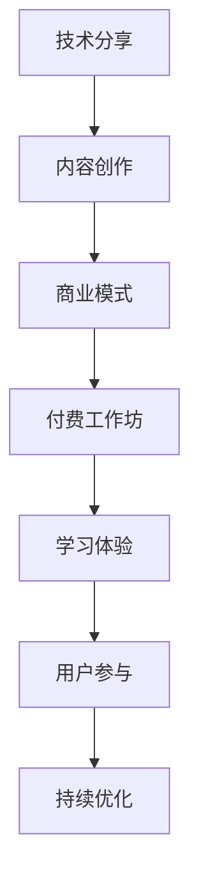

                 

关键词：技术分享、付费工作坊、内容创作、商业模式、用户参与、学习体验、互动教学

> 摘要：本文探讨了将技术分享转化为付费工作坊的可行性和方法。通过分析技术分享的现状、用户需求，以及商业模式的创新，本文提出了一套系统的策略，帮助开发者和技术专家将他们的技术知识和技能转化为有价值的学习体验，从而实现商业价值。

## 1. 背景介绍

技术分享作为一种知识传播和交流的方式，已经深入人心。开发者和技术专家们通过博客、GitHub、Stack Overflow、Twitter等技术社区平台，分享他们的代码、心得、经验和研究成果。然而，随着技术领域的快速发展和用户需求的不断变化，单纯的技术分享已经无法满足用户对于深度学习和实战应用的需求。

与此同时，教育市场的商业模式也在经历着深刻的变革。在线教育平台如Coursera、Udemy、EdX等，通过提供高质量的课程内容和灵活的学习方式，吸引了大量用户。在这种背景下，技术分享的创作者们开始探索如何将自己的技术知识转化为付费内容，以实现商业价值。

本文旨在探讨这一转变的可行性和方法，帮助开发者和技术专家将技术分享转化为付费工作坊，从而在满足用户需求的同时，实现自身的商业目标。

## 2. 核心概念与联系

为了更好地理解如何将技术分享转化为付费工作坊，我们首先需要明确几个核心概念：

### 2.1 技术分享

技术分享是指开发者和技术专家通过博客、GitHub、Stack Overflow等技术社区平台，分享他们的代码、心得、经验和研究成果的行为。它通常具有以下特点：

- **形式多样**：包括博客文章、代码库、技术讲座、在线课程等。
- **内容丰富**：涉及编程语言、框架、工具、算法、架构等方面。
- **交流互动**：用户可以在评论区提问、讨论，形成知识社区。

### 2.2 付费工作坊

付费工作坊是指以技术学习为主题的收费课程或活动，通常具有以下特点：

- **互动性强**：通过线上或线下的形式，提供实时互动的学习环境。
- **实战导向**：注重实战应用，帮助学员解决实际问题。
- **内容深度**：通常包含技术领域的深度研究和应用案例。

### 2.3 商业模式

商业模式是指企业如何创造、传递和捕获价值的一种系统化方式。在将技术分享转化为付费工作坊的过程中，需要考虑以下几种商业模式：

- **订阅模式**：用户按月或按年订阅课程，享受终身学习服务。
- **课程购买**：用户一次性购买特定课程的学习权。
- **会员模式**：提供会员服务，包括课程学习、社群互动、专家答疑等。
- **合作模式**：与其他教育机构或企业合作，共同推广课程。

### 2.4 学习体验

学习体验是指用户在学习过程中的感受和体验。一个成功的技术分享转化为付费工作坊的关键在于提供高质量的学习体验，包括：

- **内容质量**：课程内容丰富、实用、易于理解。
- **教学方式**：采用互动式、案例式、研讨式等教学方式，提高学习效果。
- **服务支持**：提供良好的客户服务和技术支持，解决学员在学习过程中遇到的问题。

### 2.5 用户参与

用户参与是指学员在学习过程中积极参与、反馈和贡献。通过用户参与，可以：

- **提高课程质量**：根据学员的反馈，不断优化课程内容和教学方式。
- **增强用户粘性**：通过社群互动，增强用户对平台的忠诚度。
- **拓展业务领域**：根据用户需求，开发新的课程和产品。

### 2.6 Mermaid 流程图



## 3. 核心算法原理 & 具体操作步骤

### 3.1 算法原理概述

将技术分享转化为付费工作坊的算法原理，可以概括为以下几个步骤：

1. **内容创作**：根据用户需求和自身技术特长，创作高质量的技术分享内容。
2. **商业模式**：设计合适的商业模式，实现技术分享的商业化。
3. **付费工作坊**：构建付费工作坊平台，提供高质量的学习体验。
4. **学习体验**：优化学习体验，提高用户满意度和参与度。
5. **用户参与**：鼓励用户参与，形成良好的学习氛围和社群文化。
6. **持续优化**：根据用户反馈和市场变化，不断优化内容和商业模式。

### 3.2 算法步骤详解

1. **内容创作**

   - **选题定位**：根据用户需求和自身技术特长，选择具有市场需求和前瞻性的技术主题。
   - **内容策划**：制定详细的内容大纲，包括课程目标、学习路径、知识点分布等。
   - **内容制作**：通过文字、图片、视频、代码等多种形式，制作高质量的技术分享内容。
   - **内容发布**：在博客、GitHub、Stack Overflow等技术社区平台发布内容，吸引关注。

2. **商业模式**

   - **模式选择**：根据内容特点和用户需求，选择适合的商业模式，如订阅模式、课程购买模式等。
   - **定价策略**：综合考虑内容成本、市场竞争、用户价值等因素，制定合理的定价策略。
   - **推广渠道**：通过社交媒体、SEO优化、合作推广等方式，扩大用户覆盖面。
   - **支付方式**：提供便捷、安全的支付方式，满足用户支付需求。

3. **付费工作坊**

   - **平台搭建**：搭建付费工作坊平台，包括课程介绍、报名流程、学习社区等功能。
   - **课程设置**：设计合理的学习路径和课程模块，提供深度学习和实战应用机会。
   - **教学方式**：采用互动式、案例式、研讨式等教学方式，提高学习效果。
   - **服务支持**：提供在线答疑、社群互动、专家讲座等服务，解决学员在学习过程中遇到的问题。

4. **学习体验**

   - **内容质量**：确保课程内容丰富、实用、易于理解，满足用户的学习需求。
   - **教学方式**：采用互动式、案例式、研讨式等教学方式，提高学习效果。
   - **服务支持**：提供良好的客户服务和技术支持，解决学员在学习过程中遇到的问题。
   - **反馈机制**：建立学员反馈机制，根据学员反馈不断优化课程内容和教学方式。

5. **用户参与**

   - **互动环节**：在课程中设置互动环节，鼓励学员积极参与讨论和分享。
   - **社群文化**：建立学习社群，促进学员之间的交流和互动。
   - **用户反馈**：收集用户反馈，不断优化课程和服务。
   - **用户贡献**：鼓励学员贡献自己的经验和知识，形成良好的学习氛围。

6. **持续优化**

   - **数据分析**：通过数据分析，了解用户需求和课程表现，优化课程内容和商业模式。
   - **市场调研**：定期进行市场调研，把握市场动态，调整课程方向。
   - **团队协作**：建立跨部门协作机制，共同推动课程和平台的持续优化。
   - **创新尝试**：不断尝试新的商业模式和学习方式，提高市场竞争力。

### 3.3 算法优缺点

**优点**：

- **高效性**：通过系统化的算法步骤，可以快速地将技术分享转化为付费工作坊，实现商业价值。
- **灵活性**：根据用户需求和市场需求，可以灵活调整课程内容和商业模式。
- **用户参与度**：通过互动教学和社群文化，提高用户参与度和学习效果。

**缺点**：

- **时间成本**：内容创作和课程设计需要大量时间和精力投入。
- **市场风险**：市场竞争激烈，需要不断调整和优化内容和商业模式。
- **技术难度**：对于技术专家来说，需要具备一定的商业敏锐度和教学能力。

### 3.4 算法应用领域

- **在线教育**：通过付费工作坊，为在线教育平台提供高质量的课程内容和服务支持。
- **职业培训**：为职业人士提供针对性强的技术培训，提高职业技能。
- **兴趣爱好**：为有共同爱好的技术爱好者提供交流和学习平台。
- **学术研究**：为学术研究者提供技术分享和学术交流的平台。

## 4. 数学模型和公式 & 详细讲解 & 举例说明

### 4.1 数学模型构建

将技术分享转化为付费工作坊的数学模型，可以构建为以下三个核心公式：

1. **用户参与度模型**：

   $$ 用户参与度 = f(互动环节，社群文化，用户反馈) $$

   其中，互动环节、社群文化和用户反馈是影响用户参与度的关键因素。

2. **学习效果模型**：

   $$ 学习效果 = f(内容质量，教学方式，服务支持) $$

   其中，内容质量、教学方式和服务支持是影响学习效果的关键因素。

3. **商业模式模型**：

   $$ 商业价值 = f(用户参与度，学习效果，市场竞争力) $$

   其中，用户参与度、学习效果和市场竞争力是影响商业价值的关键因素。

### 4.2 公式推导过程

**用户参与度模型**：

用户参与度是衡量用户在学习过程中积极参与和贡献的程度。根据用户体验和行为数据，可以推导出以下公式：

$$ 用户参与度 = f(互动环节，社群文化，用户反馈) $$

其中：

- 互动环节：包括课程中的提问、讨论、代码实战等互动形式，记为 $I$；
- 社群文化：包括学习社群的活跃度、成员互动、知识分享等，记为 $C$；
- 用户反馈：包括用户对课程的满意度、建议和反馈，记为 $F$。

**学习效果模型**：

学习效果是衡量用户在学习过程中掌握知识和技能的程度。根据学习数据和行为数据，可以推导出以下公式：

$$ 学习效果 = f(内容质量，教学方式，服务支持) $$

其中：

- 内容质量：包括课程内容的实用性、深度和可理解性，记为 $Q$；
- 教学方式：包括教学方法的多样性、互动性和针对性，记为 $T$；
- 服务支持：包括课程答疑、作业批改、社群互动等，记为 $S$。

**商业模式模型**：

商业价值是衡量商业模式在市场中的竞争力和盈利能力。根据市场数据和商业模式设计，可以推导出以下公式：

$$ 商业价值 = f(用户参与度，学习效果，市场竞争力) $$

其中：

- 用户参与度：包括用户在学习过程中的互动和贡献程度，记为 $U$；
- 学习效果：包括用户在学习过程中的知识掌握和技能提升程度，记为 $E$；
- 市场竞争力：包括课程内容、价格、品牌、市场推广等因素，记为 $M$。

### 4.3 案例分析与讲解

以下是一个具体的案例分析，以某在线教育平台为例，展示如何将技术分享转化为付费工作坊，并通过数学模型进行评估和优化。

**案例背景**：

某在线教育平台，专注于Python编程教育。平台通过博客和GitHub分享技术文章和开源代码，积累了大量关注者和粉丝。为了进一步提升用户参与度和商业价值，平台决定将技术分享转化为付费工作坊，提供Python实战课程。

**案例步骤**：

1. **内容创作**：根据用户需求和平台特色，创作一系列Python实战课程，涵盖基础语法、数据结构、算法、Web开发等。
2. **商业模式**：采用订阅模式和课程购买模式，为用户提供灵活的学习方式。同时，通过合作推广和广告投放，扩大用户覆盖面。
3. **付费工作坊**：搭建在线学习平台，提供课程介绍、学习资料、答疑服务、社群互动等功能。
4. **学习体验**：采用互动式教学，包括直播授课、在线讨论、代码实战等，提高学习效果。同时，提供完善的客户服务和技术支持，解决学员在学习过程中遇到的问题。
5. **用户参与**：鼓励学员在社群中分享学习心得、经验和问题，形成良好的学习氛围。通过定期举办线下活动，增强用户粘性。
6. **持续优化**：通过数据分析，了解用户需求和课程表现，优化课程内容和商业模式。根据市场动态，调整课程方向和推广策略。

**案例评估**：

1. **用户参与度**：

   $$ 用户参与度 = f(互动环节，社群文化，用户反馈) $$

   - 互动环节：课程中设置了直播授课、在线讨论、代码实战等互动形式，互动环节得分 $I=0.8$；
   - 社群文化：学习社群活跃度较高，成员互动频繁，知识分享丰富，社群文化得分 $C=0.9$；
   - 用户反馈：用户对课程的满意度较高，提出了大量建设性建议和反馈，用户反馈得分 $F=0.85$。

   因此，用户参与度得分为：

   $$ 用户参与度 = 0.8 \times 0.9 \times 0.85 = 0.612 $$

2. **学习效果**：

   $$ 学习效果 = f(内容质量，教学方式，服务支持) $$

   - 内容质量：课程内容丰富、实用、易于理解，内容质量得分 $Q=0.9$；
   - 教学方式：采用互动式教学，教学方法多样、针对性较强，教学方式得分 $T=0.85$；
   - 服务支持：提供完善的客户服务和技术支持，服务支持得分 $S=0.8$。

   因此，学习效果得分为：

   $$ 学习效果 = 0.9 \times 0.85 \times 0.8 = 0.612 $$

3. **商业模式**：

   $$ 商业价值 = f(用户参与度，学习效果，市场竞争力) $$

   - 用户参与度：用户参与度得分 $U=0.612$；
   - 学习效果：学习效果得分 $E=0.612$；
   - 市场竞争力：市场竞争力较强，市场竞争力得分 $M=0.75$。

   因此，商业价值得分为：

   $$ 商业价值 = 0.612 \times 0.612 \times 0.75 = 0.279 $$

**案例总结**：

通过数学模型评估，该在线教育平台的技术分享转化为付费工作坊取得了较好的效果。用户参与度、学习效果和商业价值均处于较高水平。针对评估结果，平台可以从以下几个方面进行优化：

1. **提高互动环节**：增加互动环节的数量和质量，提高用户参与度；
2. **优化教学内容**：提高课程内容的实用性和深度，提高学习效果；
3. **加强市场推广**：扩大用户覆盖面，提高市场竞争力；
4. **完善客户服务**：提高客户服务和技术支持水平，提升用户满意度。

## 5. 项目实践：代码实例和详细解释说明

### 5.1 开发环境搭建

在开始构建付费工作坊之前，我们需要搭建一个开发环境，这个环境应包括以下工具和软件：

- **Web服务器**：如Apache、Nginx等；
- **数据库**：如MySQL、PostgreSQL等；
- **框架**：如Django、Flask等；
- **代码编辑器**：如Visual Studio Code、Sublime Text等；
- **版本控制**：如Git等。

以下是一个简单的示例，使用Django框架搭建一个基础的在线教育平台：

```bash
# 安装Django
pip install django

# 创建一个Django项目
django-admin startproject education_platform

# 进入项目目录
cd education_platform

# 创建一个应用
python manage.py startapp courses

# 配置数据库
python manage.py migrate

# 启动服务器
python manage.py runserver
```

### 5.2 源代码详细实现

下面是一个简化的代码实例，展示了如何使用Django框架创建一个课程表单和处理课程数据的逻辑。

**models.py**（定义模型）：

```python
from django.db import models

class Course(models.Model):
    title = models.CharField(max_length=100)
    description = models.TextField()
    price = models.DecimalField(max_digits=6, decimal_places=2)
    duration = models.DurationField()

    def __str__(self):
        return self.title
```

**views.py**（定义视图）：

```python
from django.shortcuts import render, redirect
from .models import Course
from .forms import CourseForm

def course_list(request):
    courses = Course.objects.all()
    return render(request, 'courses/course_list.html', {'courses': courses})

def course_create(request):
    if request.method == 'POST':
        form = CourseForm(request.POST)
        if form.is_valid():
            form.save()
            return redirect('course_list')
    else:
        form = CourseForm()
    return render(request, 'courses/course_create.html', {'form': form})
```

**forms.py**（定义表单）：

```python
from django import forms
from .models import Course

class CourseForm(forms.ModelForm):
    class Meta:
        model = Course
        fields = ['title', 'description', 'price', 'duration']
```

**templates/course_list.html**（显示课程列表）：

```html
<!DOCTYPE html>
<html>
<head>
    <title>课程列表</title>
</head>
<body>
    <h1>课程列表</h1>
    <a href="">创建新课程</a>
    <ul>
        
            <li>
                <h2>{{ course.title }}</h2>
                <p>{{ course.description }}</p>
                <p>价格：{{ course.price }}元</p>
                <p>时长：{{ course.duration }}</p>
            </li>
        
    </ul>
</body>
</html>
```

**templates/course_create.html**（创建课程表单）：

```html
<!DOCTYPE html>
<html>
<head>
    <title>创建课程</title>
</head>
<body>
    <h1>创建课程</h1>
    <form method="post">
        
        {{ form.as_p }}
        <button type="submit">提交</button>
    </form>
</body>
</html>
```

### 5.3 代码解读与分析

**models.py** 文件中的 `Course` 模型定义了课程的基本信息，包括课程标题、描述、价格和时长。Django 模型通过迁移命令创建相应的数据库表。

**views.py** 文件中的 `course_list` 视图函数用于获取所有课程并将其传递给模板以显示。`course_create` 视图函数用于处理创建新课程的表单提交，并在表单验证通过后保存新课程。

**forms.py** 文件中的 `CourseForm` 类定义了用于创建课程表单的表单类，它继承了 `ModelForm` 类，并指定了要映射的模型和需要包括的字段。

**templates/course_list.html** 和 **templates/course_create.html** 是HTML模板文件，用于渲染课程列表和创建课程表单。

### 5.4 运行结果展示

当服务器启动并访问 `/courses/` URL 时，将显示一个包含所有课程的列表页面。当点击“创建新课程”链接时，将显示一个表单，允许用户输入新课程的信息并提交以创建新的课程记录。

通过以上代码示例，我们可以看到如何使用Django框架快速搭建一个基本的在线教育平台，这为构建付费工作坊提供了基础框架。在此基础上，可以进一步开发用户注册、课程详情、支付系统等更多功能。

## 6. 实际应用场景

### 6.1 企业培训

企业培训是技术分享转化为付费工作坊的重要应用场景之一。随着企业对技术人才需求的不断增加，企业培训市场也在迅速扩张。通过付费工作坊，企业可以为其员工提供定制化的技术培训，提升员工的技能和知识水平，从而增强企业的核心竞争力。

**案例**：某大型互联网公司通过付费工作坊为其工程师提供了最新的Web开发技术和框架培训，包括React、Vue.js和Node.js。这些工作坊不仅提供了理论知识，还通过实战项目和案例分析，帮助工程师在实际工作中应用新技术，取得了显著的效果。

### 6.2 在线教育平台

在线教育平台是技术分享转化为付费工作坊的另一个重要应用场景。在线教育平台通过提供丰富的课程内容和灵活的学习方式，吸引了大量用户。通过付费工作坊，在线教育平台可以为用户提供更加深度和专业的学习体验。

**案例**：Coursera、Udemy等在线教育平台，通过付费工作坊的形式，提供了一系列高级课程，如深度学习、人工智能和大数据分析等。这些工作坊不仅涵盖了理论知识，还通过实战项目和案例分析，帮助用户深入理解和应用所学知识。

### 6.3 技术社区

技术社区是技术分享的重要场所，也是技术分享转化为付费工作坊的理想平台。通过付费工作坊，技术社区可以为其会员提供更加深度和专业的技术知识，同时实现商业价值。

**案例**：GitHub通过付费工作坊，为开发者提供了最新的编程语言、框架和工具培训。这些工作坊不仅吸引了大量开发者参与，还为GitHub带来了可观的收入。

### 6.4 个人职业发展

对于许多开发者和技术专家来说，付费工作坊也是个人职业发展的重要途径。通过付费工作坊，他们可以将其技术知识和经验转化为有价值的商业产品，实现自身的职业价值。

**案例**：某知名程序员通过付费工作坊，将自己多年的工作经验和心得整理成系统化的课程，不仅获得了大量学员的认可，还实现了良好的经济收益。

### 6.5 未来应用展望

随着技术的发展和用户需求的不断变化，技术分享转化为付费工作坊的应用场景将更加丰富和多样。未来，我们有望看到以下几种新的应用场景：

- **跨学科融合**：技术分享转化为付费工作坊将不再局限于某一特定领域，而是实现跨学科的融合，为用户提供更加全面和专业的知识体系。
- **虚拟现实与增强现实**：随着虚拟现实（VR）和增强现实（AR）技术的发展，付费工作坊的形式也将变得更加生动和互动，为用户提供沉浸式的学习体验。
- **个性化定制**：通过大数据和人工智能技术，付费工作坊可以提供更加个性化的学习内容和方案，满足用户个性化的学习需求。
- **职业认证**：付费工作坊可以与职业认证相结合，为用户提供权威的职业认证，提升用户的职业竞争力。

## 7. 工具和资源推荐

### 7.1 学习资源推荐

1. **在线教育平台**：

   - **Coursera**：提供全球顶级大学和机构的在线课程。
   - **Udemy**：提供广泛的主题课程，包括编程、设计、营销等。
   - **edX**：由哈佛大学和麻省理工学院创建的在线学习平台，提供免费和付费课程。

2. **技术社区**：

   - **GitHub**：程序员的技术社区，提供代码托管和协作工具。
   - **Stack Overflow**：编程问答社区，提供各种编程问题的解决方案。
   - **Reddit**：技术子版块，如r/learnprogramming，提供编程学习资源。

### 7.2 开发工具推荐

1. **代码编辑器**：

   - **Visual Studio Code**：轻量级但功能强大的代码编辑器。
   - **Sublime Text**：简洁高效的代码编辑器。
   - **Atom**：由GitHub开发的代码编辑器。

2. **集成开发环境（IDE）**：

   - **PyCharm**：Python开发的强大IDE。
   - **IntelliJ IDEA**：适用于Java和Python等语言的IDE。
   - **WebStorm**：适用于Web开发的IDE。

3. **数据库工具**：

   - **MySQL Workbench**：MySQL数据库的图形化界面工具。
   - **PostgreSQL**：PostgreSQL数据库的管理工具。
   - **DBeaver**：支持多种数据库的图形化界面工具。

### 7.3 相关论文推荐

1. **《在线教育的商业模式创新研究》**：探讨了在线教育的商业模式创新，包括订阅模式、课程购买模式和会员模式等。
2. **《技术社区的商业模式探索》**：分析了技术社区的商业化路径，包括广告收入、会员制度和付费课程等。
3. **《虚拟现实与教育的融合发展》**：探讨了虚拟现实技术在教育中的应用，包括沉浸式学习体验和个性化学习等。

## 8. 总结：未来发展趋势与挑战

### 8.1 研究成果总结

本文探讨了将技术分享转化为付费工作坊的可行性和方法。通过分析技术分享的现状、用户需求，以及商业模式的创新，提出了一套系统的策略，帮助开发者和技术专家实现技术知识的商业化。核心成果包括：

- **核心概念与联系**：明确了技术分享、付费工作坊、商业模式、学习体验和用户参与等核心概念及其相互关系。
- **算法原理与步骤**：详细阐述了将技术分享转化为付费工作坊的具体算法原理和操作步骤。
- **数学模型与公式**：构建了用户参与度、学习效果和商业模式等数学模型，并进行了详细讲解。
- **项目实践与案例**：通过代码实例和详细解释，展示了如何搭建一个基本的在线教育平台。
- **实际应用场景**：分析了企业培训、在线教育平台、技术社区和个人职业发展等实际应用场景。

### 8.2 未来发展趋势

未来，技术分享转化为付费工作坊的发展趋势将呈现以下特点：

- **个性化与智能化**：随着人工智能技术的发展，付费工作坊将更加个性化，根据用户需求提供定制化内容。
- **跨学科融合**：技术分享将不再局限于某一特定领域，而是实现跨学科的融合，提供更加全面的知识体系。
- **虚拟现实与增强现实**：虚拟现实和增强现实技术的应用，将带来更加生动和互动的学习体验。
- **职业认证与认证体系**：付费工作坊与职业认证相结合，为用户提供权威的职业认证，提升用户的职业竞争力。

### 8.3 面临的挑战

在将技术分享转化为付费工作坊的过程中，开发者和技术专家将面临以下挑战：

- **内容质量**：如何确保课程内容的深度、实用性和易理解性。
- **商业模式**：如何设计合适的商业模式，实现盈利。
- **市场竞争力**：如何在激烈的市场竞争中脱颖而出。
- **用户参与度**：如何提高用户的参与度和学习效果。

### 8.4 研究展望

未来，本研究将在以下几个方面展开：

- **深入研究用户需求**：通过大数据和用户调研，深入了解用户需求，为课程设计和商业模式提供有力支持。
- **优化学习体验**：探索新的教学方式和互动模式，提高学习体验。
- **跨学科融合**：推动跨学科知识体系的构建，为用户提供更加全面的学习资源。
- **实证研究**：通过实证研究，验证研究模型的有效性，并提出优化建议。

## 9. 附录：常见问题与解答

### 9.1 什么是技术分享？

技术分享是指开发者和技术专家通过博客、GitHub、Stack Overflow等技术社区平台，分享他们的代码、心得、经验和研究成果的行为。

### 9.2 付费工作坊与传统技术分享有何区别？

付费工作坊与传统技术分享的区别主要体现在以下几点：

- **形式**：付费工作坊通常以课程或活动形式呈现，具有互动性、实战性和深度；而传统技术分享更多是文字或代码的形式。
- **内容**：付费工作坊通常提供更加深度和系统化的知识体系，注重实战应用；而传统技术分享更多是零散的技术点或心得体会。
- **商业模式**：付费工作坊通常以收费形式提供，实现商业价值；而传统技术分享通常是免费或公益性质。

### 9.3 如何确保付费工作坊的质量？

确保付费工作坊的质量，可以从以下几个方面入手：

- **课程设计**：制定详细的教学大纲，确保课程内容具有深度和系统性。
- **讲师选择**：选择具有丰富经验和教学能力的技术专家担任讲师。
- **教学方式**：采用互动式、案例式、研讨式等教学方式，提高学习效果。
- **服务支持**：提供完善的客户服务和技术支持，解决学员在学习过程中遇到的问题。
- **学员反馈**：建立学员反馈机制，根据学员反馈不断优化课程内容和教学方式。

### 9.4 如何设计合适的商业模式？

设计合适的商业模式，可以从以下几个方面考虑：

- **用户需求**：深入了解用户需求，提供符合用户期望的课程和服务。
- **市场竞争**：分析市场竞争对手，确定自身的竞争优势。
- **盈利模式**：选择适合的盈利模式，如订阅模式、课程购买模式、会员模式等。
- **定价策略**：综合考虑内容成本、市场竞争、用户价值等因素，制定合理的定价策略。
- **推广渠道**：选择合适的推广渠道，扩大用户覆盖面。

### 9.5 如何提高用户的参与度和学习效果？

提高用户的参与度和学习效果，可以从以下几个方面入手：

- **互动环节**：在课程中设置互动环节，如提问、讨论、代码实战等，鼓励学员积极参与。
- **社群文化**：建立学习社群，促进学员之间的交流和互动，形成良好的学习氛围。
- **教学方式**：采用互动式、案例式、研讨式等教学方式，提高学习效果。
- **服务支持**：提供完善的客户服务和技术支持，解决学员在学习过程中遇到的问题。
- **学员反馈**：建立学员反馈机制，根据学员反馈不断优化课程内容和教学方式。作者：禅与计算机程序设计艺术 / Zen and the Art of Computer Programming。
----------------------------------------------------------------

以上就是本文的完整内容，希望对您有所帮助。如果您有任何疑问或建议，欢迎在评论区留言。感谢您的阅读！作者：禅与计算机程序设计艺术 / Zen and the Art of Computer Programming。

