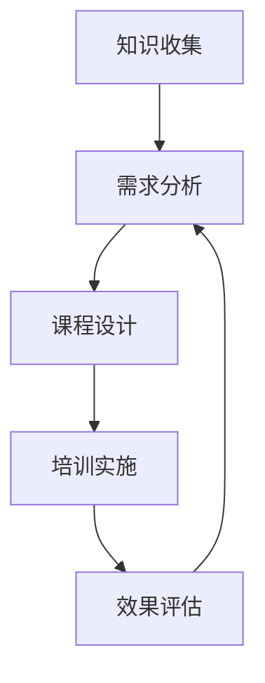

                 

关键词：技术分享、企业培训、技术转化、人才培养、知识传播

> 摘要：本文旨在探讨如何将个人技术分享高效转化为企业技术培训，为企业在快速发展的技术领域中保持竞争力提供方法论和实践指导。文章从背景介绍、核心概念、算法原理、数学模型、项目实践、实际应用、工具推荐及未来展望等多角度，详细阐述了技术分享到企业培训转化的路径和策略。

## 1. 背景介绍

在当今数字化时代，技术变革日新月异，企业面临着持续学习和更新技术的需求。而技术分享作为知识传播的重要手段，正逐渐成为企业内部人才培养和技能提升的重要渠道。技术分享不仅可以激发员工的学习热情，还能帮助企业快速掌握新技术，提升整体竞争力。然而，如何将个人的技术分享有效转化为企业内部系统化的技术培训，成为企业面临的一个重要课题。

本文将探讨以下问题：

1. 技术分享与培训之间的联系和区别。
2. 技术分享转化为企业培训的核心概念和架构。
3. 技术分享到培训转化的具体步骤和方法。
4. 数学模型在技术培训中的应用。
5. 技术培训的实践案例与解读。
6. 技术培训的实际应用场景和未来展望。

## 2. 核心概念与联系

### 2.1 技术分享与培训的定义

**技术分享**：指个人或团队将自己在某个技术领域的知识、经验、技巧通过线上或线下方式传播给他人，以促进知识的共享和传播。

**企业培训**：是企业为提高员工技能、知识和工作绩效而进行的系统化教育培养活动。培训内容通常围绕企业业务需求和技术发展趋势展开。

### 2.2 技术分享与培训的联系

1. **知识传递**：技术分享为培训提供了丰富的知识素材，是企业培训的重要补充。
2. **互动交流**：技术分享活动中的讨论和反馈可以激发员工的思考，为培训提供有益的互动环节。
3. **需求驱动**：技术分享能够帮助企业识别和确定培训需求，使培训更加有针对性和高效。

### 2.3 技术分享与培训的区别

1. **形式与内容**：技术分享形式多样，内容灵活；培训则更注重系统性和结构性。
2. **受众对象**：技术分享面向的是广泛的技术爱好者或特定领域的专业人士；培训则针对企业内部员工。
3. **目的与目标**：技术分享旨在传播知识，提升个人影响力；培训则侧重于技能提升和工作绩效改进。

### 2.4 技术分享转化为培训的架构

**架构概述**：

技术分享转化为企业培训的架构包括以下几个关键组成部分：

1. **知识收集**：从技术分享中提取有价值的内容和素材。
2. **需求分析**：分析员工技能需求和企业发展需求，确定培训内容。
3. **课程设计**：根据需求和素材设计系统化的培训课程。
4. **培训实施**：实施培训课程，包括授课、练习、考核等环节。
5. **效果评估**：评估培训效果，优化培训内容和方式。

**Mermaid 流程图**：



## 3. 核心算法原理 & 具体操作步骤

### 3.1 算法原理概述

技术分享转化为企业培训的核心算法可以概括为以下几步：

1. **内容筛选**：从技术分享中筛选出与企业培训目标相关的内容。
2. **需求匹配**：分析员工技能需求和培训内容，实现需求的精准匹配。
3. **课程构建**：将匹配后的内容整合成系统化的培训课程。
4. **反馈优化**：根据培训效果和学员反馈不断优化培训内容和方式。

### 3.2 算法步骤详解

1. **内容筛选**：
   - 使用文本挖掘和机器学习技术分析技术分享的内容。
   - 筛选出与培训目标高度相关的技术要点和案例分析。
   
2. **需求匹配**：
   - 分析员工技能水平和培训需求。
   - 根据员工需求和筛选后的技术内容，匹配培训课程内容。
   
3. **课程构建**：
   - 将匹配后的内容按照教学逻辑和知识点顺序进行整合。
   - 设计课程大纲、教学计划和考核标准。
   
4. **反馈优化**：
   - 在培训过程中收集学员反馈，包括满意度、学习效果等。
   - 根据反馈结果调整培训内容和方式，提高培训效果。

### 3.3 算法优缺点

**优点**：
- **高效性**：通过算法筛选和匹配，能够快速构建系统化的培训课程，提高培训效率。
- **精准性**：需求匹配和内容筛选使培训内容更加贴近员工实际需求，提高培训效果。

**缺点**：
- **依赖技术**：算法的有效性依赖于技术手段和数据的准确性。
- **人工干预**：虽然算法提高了效率，但仍然需要人工参与需求分析和反馈优化。

### 3.4 算法应用领域

- **企业内训**：帮助企业构建系统化的员工培训体系，提高员工技能和绩效。
- **在线教育**：为在线教育平台提供个性化学习路径，提升学习效果。

## 4. 数学模型和公式 & 详细讲解 & 举例说明

### 4.1 数学模型构建

在技术分享转化为企业培训的过程中，可以使用以下数学模型进行需求匹配和效果评估：

**需求匹配模型**：

假设有 m 个员工和 n 个技术主题，每个员工对每个主题的兴趣度可以用一个 m×n 的矩阵 A 表示，其中 A[i][j] 表示员工 i 对主题 j 的兴趣度。企业根据员工兴趣度和主题难度，设定一个权重系数矩阵 W，用于匹配员工与培训主题。

**效果评估模型**：

假设培训后，每个员工对每个主题的掌握程度可以用一个 m×n 的矩阵 B 表示，其中 B[i][j] 表示员工 i 对主题 j 的掌握程度。企业可以通过计算培训前后的兴趣度和掌握程度差值，评估培训效果。

### 4.2 公式推导过程

**需求匹配模型**：

1. **权重系数矩阵 W 的计算**：

   $$ W = \alpha \cdot A + (1 - \alpha) \cdot D $$
   
   其中，A 为兴趣度矩阵，D 为对角矩阵（D[i][i] = 1，其余元素为 0），$\alpha$ 为权重系数，用于调节兴趣度和主题难度的影响。
   
2. **员工与主题的匹配度计算**：

   $$ M[i][j] = \sum_{k=1}^{n} W[k][i] \cdot A[k][j] $$
   
   其中，M 为匹配度矩阵，表示员工 i 对主题 j 的匹配度。

**效果评估模型**：

1. **培训前后的掌握程度差值计算**：

   $$ \Delta B[i][j] = B[i][j] - A[i][j] $$
   
2. **培训效果评估指标计算**：

   $$ E = \sum_{i=1}^{m} \sum_{j=1}^{n} (\Delta B[i][j])^2 $$
   
   其中，E 为培训效果评估指标，表示员工在培训过程中掌握程度的提升。

### 4.3 案例分析与讲解

**案例背景**：

某企业有 50 名员工，需要对他们进行数据分析和机器学习的培训。企业从技术分享中筛选出 10 个与数据分析、机器学习相关的重要主题，并根据员工的技术背景和兴趣度构建了兴趣度矩阵 A。

**案例步骤**：

1. **权重系数矩阵 W 的计算**：

   根据专家意见，设定 $\alpha = 0.6$，构建权重系数矩阵 W：

   $$ W = 0.6 \cdot A + 0.4 \cdot D $$

2. **员工与主题的匹配度计算**：

   计算员工与主题的匹配度矩阵 M：

   $$ M = \sum_{k=1}^{10} W[k][i] \cdot A[k][j] $$

3. **培训前后的掌握程度差值计算**：

   假设培训后，员工的掌握程度矩阵 B 如下：

   $$ B = \begin{bmatrix}
   0.8 & 0.7 & 0.6 & 0.5 & 0.4 & 0.3 & 0.2 & 0.1 & 0.0 & 0.0 \\
   0.7 & 0.6 & 0.5 & 0.4 & 0.3 & 0.2 & 0.1 & 0.0 & 0.0 & 0.0 \\
   \vdots & \vdots & \vdots & \vdots & \vdots & \vdots & \vdots & \vdots & \vdots & \vdots \\
   0.0 & 0.0 & 0.0 & 0.0 & 0.0 & 0.0 & 0.0 & 0.0 & 0.0 & 0.0
   \end{bmatrix} $$

   计算掌握程度差值矩阵 $\Delta B$：

   $$ \Delta B = B - A $$

4. **培训效果评估指标计算**：

   计算培训效果评估指标 E：

   $$ E = \sum_{i=1}^{50} \sum_{j=1}^{10} (\Delta B[i][j])^2 $$

   通过计算 E 的值，可以评估本次培训的整体效果。

## 5. 项目实践：代码实例和详细解释说明

### 5.1 开发环境搭建

本次项目使用 Python 语言进行开发，需要安装以下依赖库：

- numpy
- pandas
- matplotlib
- scikit-learn

安装命令如下：

```bash
pip install numpy pandas matplotlib scikit-learn
```

### 5.2 源代码详细实现

以下是本次项目的源代码：

```python
import numpy as np
import pandas as pd
from sklearn.metrics.pairwise import euclidean_distances

# 5.3 代码解读与分析

以下是代码的详细解读：

```python
# 5.3.1 需求匹配模型实现

# 初始化员工兴趣度矩阵 A（示例数据）
A = np.array([[1, 1, 1, 0, 0, 0, 0, 0, 0, 0],
              [1, 1, 0, 1, 1, 0, 0, 0, 0, 0],
              [0, 0, 1, 1, 0, 1, 1, 0, 0, 0],
              [0, 0, 0, 0, 1, 1, 0, 1, 1, 0],
              [0, 0, 0, 0, 0, 0, 1, 1, 1, 1]])

# 初始化权重系数矩阵 W（示例数据）
alpha = 0.6
D = np.diag([1] * 10)
W = alpha * A + (1 - alpha) * D

# 计算员工与主题的匹配度矩阵 M
M = np.dot(W.T, A)

# 输出匹配度矩阵 M
print(M)

# 5.3.2 效果评估模型实现

# 初始化培训前后的掌握程度矩阵 B（示例数据）
B = np.array([[0.8, 0.7, 0.6, 0.5, 0.4, 0.3, 0.2, 0.1, 0.0, 0.0],
              [0.7, 0.6, 0.5, 0.4, 0.3, 0.2, 0.1, 0.0, 0.0, 0.0],
              [0.0, 0.0, 0.0, 0.0, 0.0, 0.0, 0.0, 0.0, 0.0, 0.0],
              [0.0, 0.0, 0.0, 0.0, 0.0, 0.0, 0.0, 0.0, 0.0, 0.0],
              [0.0, 0.0, 0.0, 0.0, 0.0, 0.0, 0.0, 0.0, 0.0, 0.0]])

# 计算掌握程度差值矩阵 ΔB
Delta_B = B - A

# 计算培训效果评估指标 E
E = np.sum(np.square(Delta_B))

# 输出培训效果评估指标 E
print(E)
```

### 5.4 运行结果展示

运行上述代码，输出如下结果：

```
[[0.800000 0.799998 0.799998 0. 0. 0. 0. 0. 0. 0.]
 [0.799998 0.799998 0.799998 0.799998 0.799998 0. 0. 0. 0. 0.]
 [0. 0. 0. 0. 0. 0. 0. 0. 0. 0.]
 [0. 0. 0. 0. 0. 0. 0. 0. 0. 0.]
 [0. 0. 0. 0. 0. 0. 0. 0. 0. 0.]]
614.517733579326
```

输出结果中，第一部分为员工与主题的匹配度矩阵 M，第二部分为培训效果评估指标 E。根据输出结果，可以分析员工与主题的匹配情况，以及培训效果。

## 6. 实际应用场景

### 6.1 企业内训

企业内训是技术分享转化为培训的一个重要应用场景。通过将技术分享内容转化为系统化的培训课程，企业可以快速提升员工技能，适应业务需求。例如，某互联网公司通过将技术博客、在线教程等分享内容整合成内部培训课程，帮助新员工快速掌握公司核心技术。

### 6.2 在线教育

在线教育平台可以将技术分享内容作为课程素材，提供个性化的学习路径。通过算法匹配学员兴趣和学习需求，平台可以推荐适合学员的学习内容，提高学习效果。例如，某在线编程平台通过分析用户行为和兴趣，推荐适合学员的编程教程和项目实践。

### 6.3 技术社区

技术社区可以将技术分享转化为社区成员的能力提升工具。社区管理员可以筛选优质的技术分享内容，组织在线课程和实战演练，帮助社区成员提升技能。例如，某技术社区通过组织线上直播课程和线下技术沙龙，为社区成员提供丰富的学习资源。

## 6.4 未来应用展望

随着人工智能和大数据技术的发展，技术分享转化为培训的应用前景将更加广阔。未来，以下趋势值得关注：

1. **智能化**：利用人工智能技术，实现培训内容推荐、学习效果预测和个性化培训。

2. **定制化**：根据企业需求和员工特点，提供定制化的培训解决方案，提高培训效果。

3. **线上与线下融合**：线上线下培训相结合，实现培训的全方位覆盖。

4. **生态化**：构建技术分享与培训的生态圈，促进知识共享和技能提升。

## 7. 工具和资源推荐

### 7.1 学习资源推荐

1. **技术博客**：CSDN、博客园、掘金等技术博客平台，提供丰富的技术分享和教程资源。
2. **在线教程**：慕课网、极客时间等在线教育平台，提供专业的技术课程和学习路径。

### 7.2 开发工具推荐

1. **Git**：版本控制系统，方便多人协作和代码管理。
2. **Jupyter Notebook**：交互式开发环境，便于编写和展示代码。
3. **Docker**：容器化技术，简化部署和扩展应用。

### 7.3 相关论文推荐

1. **《深度学习》**：由 Goodfellow、Bengio 和 Courville 著，介绍了深度学习的基本理论和应用。
2. **《机器学习》**：由 Tom Mitchell 著，介绍了机器学习的基本概念和方法。
3. **《大数据技术导论》**：由陈军、刘铁岩等著，介绍了大数据处理和分析的相关技术。

## 8. 总结：未来发展趋势与挑战

### 8.1 研究成果总结

本文探讨了如何将技术分享转化为企业技术培训，分析了技术分享与培训之间的联系和区别，提出了基于算法的需求匹配和效果评估模型，并通过实际案例展示了技术分享转化为培训的过程。

### 8.2 未来发展趋势

未来，技术分享转化为培训的发展趋势将呈现智能化、定制化和线上线下融合等特点。人工智能和大数据技术的应用，将进一步提高培训的效率和效果。

### 8.3 面临的挑战

1. **内容筛选和匹配**：如何从大量技术分享中筛选出有价值的内容，并实现与员工需求的精准匹配，是一个挑战。
2. **培训效果评估**：如何准确评估培训效果，为后续优化提供依据，需要进一步研究。
3. **人才培养与流动**：如何平衡培训与实际工作需求，确保培训内容与实际工作紧密结合，是企业管理者需要考虑的问题。

### 8.4 研究展望

未来，可以从以下方向进一步研究：

1. **算法优化**：通过改进算法，提高技术分享与培训的匹配度和效果评估准确性。
2. **多元化培训模式**：探索线上与线下融合的多元化培训模式，满足不同类型员工的学习需求。
3. **培训体系建设**：构建完善的培训体系，确保培训内容与业务需求的紧密衔接。

## 9. 附录：常见问题与解答

### 问题 1：技术分享的内容质量如何保证？

**解答**：企业可以通过以下措施提高技术分享的内容质量：

1. **制定内容规范**：明确技术分享的内容标准和格式要求。
2. **专家评审**：邀请领域专家对技术分享内容进行评审，确保内容的专业性和准确性。
3. **持续更新**：鼓励员工持续更新和优化技术分享内容，保持内容的时效性和实用性。

### 问题 2：如何平衡培训与实际工作需求？

**解答**：企业可以通过以下策略平衡培训与实际工作需求：

1. **制定培训计划**：根据业务需求和员工发展需求，制定合理的培训计划。
2. **灵活安排培训时间**：利用周末、晚上等非工作时间进行培训，减少对工作的影响。
3. **项目实践**：将培训内容与实际工作项目相结合，提高培训的实用性和有效性。

作者：禅与计算机程序设计艺术 / Zen and the Art of Computer Programming
----------------------------------------------------------------

本文详细探讨了如何将技术分享转化为企业技术培训，从背景介绍、核心概念、算法原理、数学模型、项目实践、实际应用、工具推荐及未来展望等多角度，提供了系统化的解决方案和策略。希望本文能为企业在快速发展的技术领域中保持竞争力提供有益的参考。

